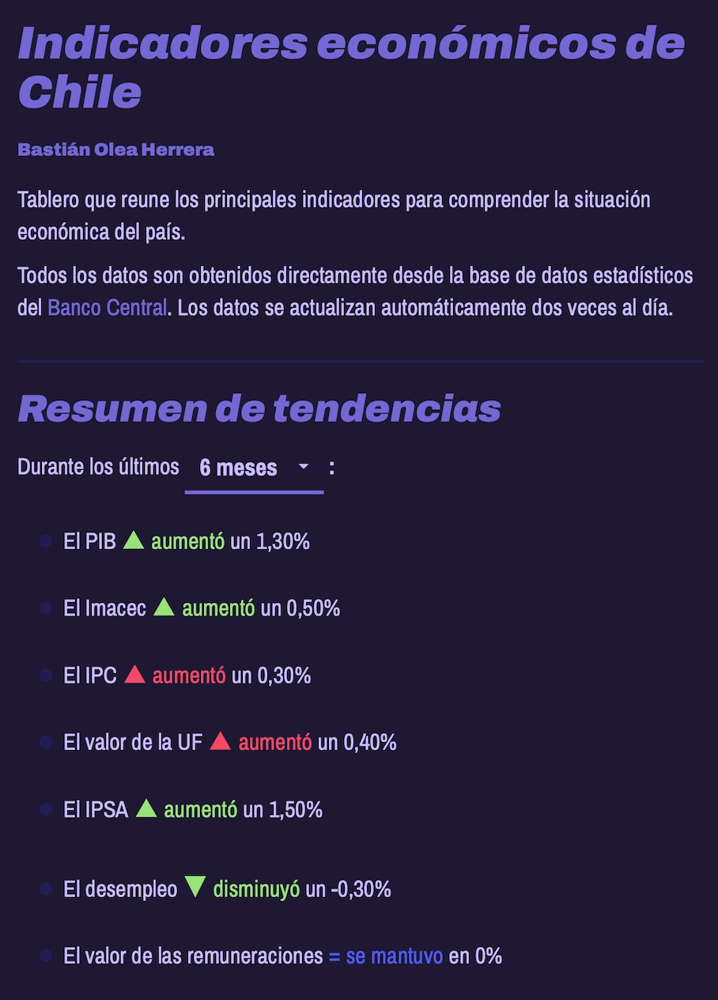
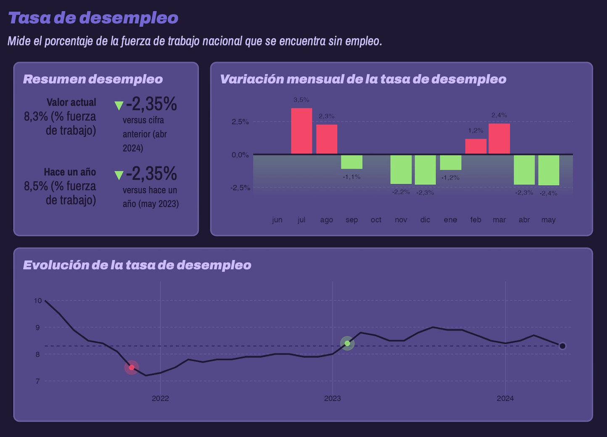
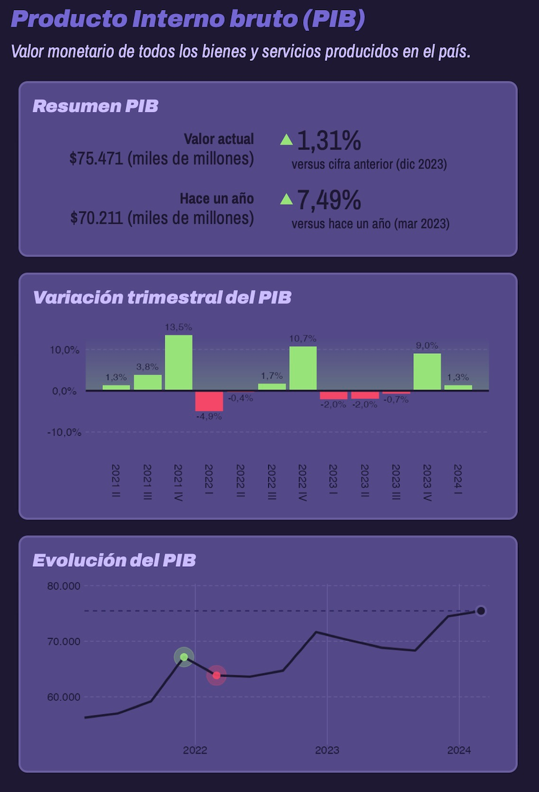

[Aplicación web](https://bastianoleah.shinyapps.io/economia_chile/) tipo dashboard que busca presentar de forma sencilla y compacta los principales indicadores de la economía chilena.

Los datos de este repositorio se actualizan automáticamente cada 12 horas por medio de GitHub Actions. Estos datos se obtienen realizando web scraping al [sitio web del Banco Central.](https://www.bcentral.cl/web/banco-central) usando el [paquete de R `{rvest}`](https://rvest.tidyverse.org).

### Indicadores disponibles
- PIB
- IMACEC
- IPC
- IPSA
- UF
- Tasa de desempleo
- Índice de remuneraciones reales
- Inversión extranjera **(nuevo)**
- Precio del cobre **(nuevo)**

----

### Actualizaciones

#### Actualización 22/07/2024
- Indicador de fecha de actualización de los datos, y de dato más reciente (excluyendo la UF, que es diaria)
- Ajustes menores de la interfaz

#### Actualización 11/07/2024
- Nuevo indicador: inversión extranjera directa (IED)
- Nuevo indicador: precio del cobre
- Interpretación automática de las tendencias de aumento/disminución

#### Lanzamiento 08/07/2024
Lanzamiento de la app

----

### Funcionamiento
El script `obtener_datos.R` realiza el web scraping desde el Banco Central, y guarda los resultados sólo si es que encuentra diferencias con los datos preexistentes. Este script es ejecutado cada 12 horas en GitHub Actions. Toma aprox. 5 minutos en ejecutarse, y si encuentra datos nuevos, los sube al repositorio. El script de automatización, con las especificaciones del contenedor que crea, se encuentran en `.github/workflows/scrapear_bancocentral.yaml`.

La aplicación web, por su parte, carga los datos directamente desde el repositorio de GitHub, en formato .csv, y por lo tanto, la aplicación cuenta con datos actualizados sin necesidad de actualizar la aplicación misma, ya que obtiene sus datos remotamente. Si por algún motivo no se pudieran cargar los datos desde el repositorio, la app tiene versiones antiguas de los datos como plan B. 

Podrían obtenerse los datos desde la app directamente por medio de scraping usando las mismas funciones que se automatizan en el workflow de GitHub Actions, pero sería poco considerado con el servidor del Banco Central. Del mismo modo, podría optimizarse la carga de los datos, ya que actualmente cada dato se guarda en un solo archivo .csv, pero no creo que valga la pena volver más engorroso el proceso para ahorrar 4 segundos. Finalmente, otro punto de optimización sería que toda la app fuera un reporte Quarto estático.

La app en sí se caracteriza por estar completamente optimizada en su estructura de código, dado que todos los elementos son generados con funciones. Por lo tanto, basta con copiar y pegar aproximadamente 6 bloques breves de código para agregar un indicador nuevo, incluyendo la automatización de su obtención de datos.

### Fuentes
- [Banco Central, Base de datos estadística](https://si3.bcentral.cl/siete)
- [Banco Central, Inversión Extranjera Directa](https://www.bcentral.cl/areas/estadisticas/inversion-extranjera-directa-ied)
- [Banco Central, Indicadores diarios: Precio del Cobre, dólares por libra (Dólar)](https://si3.bcentral.cl/Indicadoressiete/secure/IndicadoresDiarios.aspx)

### Referencias
- https://www.gavinrozzi.com/post/automating-scraping-gh-actions/
- https://si3.bcentral.cl/SetGraficos/