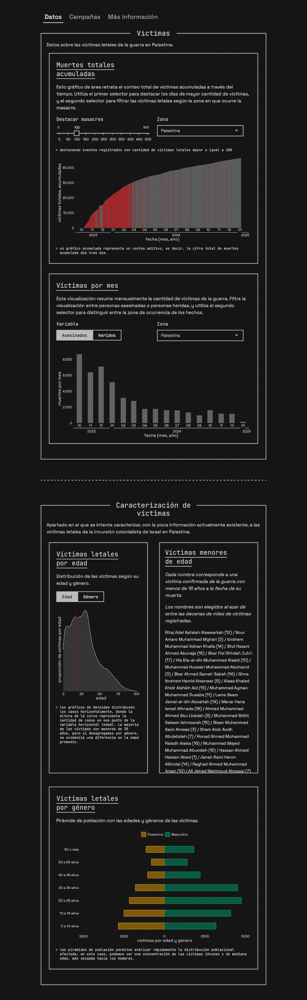
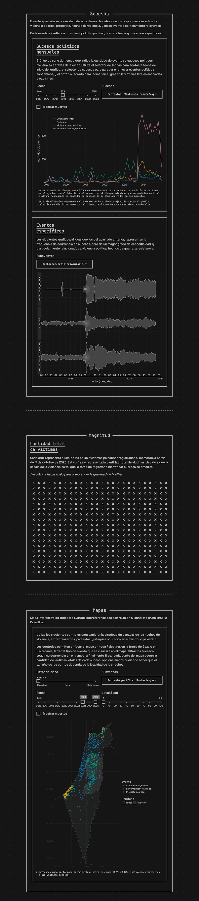

[Visualizador de datos](https://bastianoleah.shinyapps.io/palestina) que busca reflejar el horror de la guerra y el exterminio que se están llevando a cabo en el territorio palestino por obra de Israel y sus aliados. Los datos provienen de Palestine Datasets y de Armed Conflict Location & Event Data, organizaciones que están documentando datos sobre identificación de víctimas y registro de sucesos de relevancia política en la región.

[Accede al visualizador de datos por este enlace.](https://bastianoleah.shinyapps.io/palestina)

----

## Fuentes
- Palestine Datasets: https://data.techforpalestine.org/docs/killed-in-gaza/
- Armed Conflict Location & Event Data (ACLED): https://acleddata.com/israel-palestine/