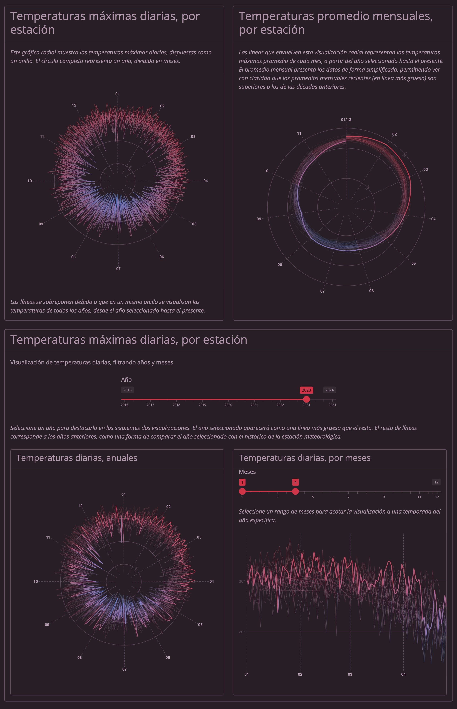

Consulta datos históricos de temperaturas extremas en el país, desde 1970 hasta 2024, y visualiza los cambios históricos en las temperaturas producto de la crisis climática.

[Accede al visualizador de datos por este enlace.](https://bastianoleah.shinyapps.io/temperaturas_chile/)

Este proyecto parte por dos razones: porque quería reutilizar los datos publicados en la plataforma de Datos Abiertos del Estado (muy recomendable, pero también requiere de muchas mejoras), y porque genuinamente tenía curiosidad sobre la evolución en las temperaturas que estamos viviendo. 

Me tardé solamente la tarde del domingo en hacer el scraping de datos, y parte del domingo y la mañana del lunes en hacer el dashboard. Desarrollar este tipo de proyectos con R es realmente rápido!

Lo otro que quería hacer eran estos gráficos radiales que muestran múltiples años en un anillo de meses. Nunca los había hecho! Quedan muy lindos y son muy fáciles de hacer con {ggplot2}.

Nunca había explorado ni visualizado datos de clima, así que acepto cualquier crítica️! 🥰 

## Obtención de los datos

Los datos son obtenidos de forma semi-automática usando técnicas de web scrapping con el paquete {RSelenium}. Esto debido a que el portal de datos abiertos no tiene una buena interfaz de usuario (no permite abrir resultados en nuevas pestañas, no permite copiar los enlaces de las fuentes de datos, y hay que actualizar las páginas entre 1 a 8 veces para que muestren los resultados). El script `obtener_temperaturas.R` simplifica tres tareas para obtener los datos: realizar una búsqueda y ampliar la cantidad de resultados mostrados en la página, entrar a cada uno de los enlaces del resultado de la búsqueda, y dentro de los conjuntos de datos, descargar todos los archivos con un solo comando. Esta ahorra muchísimo tiempo, considerando que los datos de temperatura vienen separados por semestre y año, lo que significa que hay que entrar a aproximadamente 16 conjuntos de datos distintos, y dentro de estos conjuntos de datos hay que descargar aproximadamente 6 archivos separados, mientras la plataforma dificulta abrir estos resultados por pestañas.

## Fuentes
- Datos de la Dirección General de Aeronáutica Civil subidos a la plataforma de [Datos Abiertos del Estado](https://datos.gob.cl/dataset/?q=temperatura)
- [Dirección Meteorológica de Chile](https://climatologia.meteochile.gob.cl)
