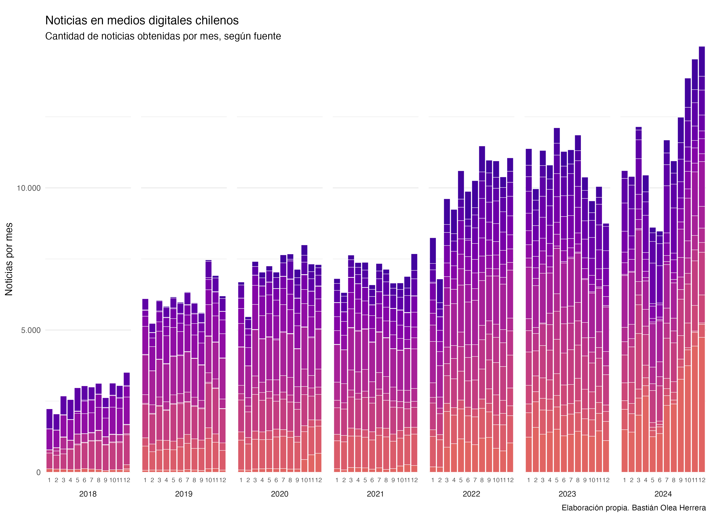

A largo de todo el año 2024 he estado realizando [web scraping](https://bastianolea.rbind.io/tags/web-scraping/) de distintas fuentes de noticias digitales de Chile. Casi todos los días ejecuto un script que a su vez se ejecuta decenas de otros scripts, que realizan el scraping diario de noticias. El resultado de estos procesos, día tras día, va aumentando la cantidad total de noticias que he ido recolectando. De vez en cuando, algún sitio cambia, o algo falla, y tengo que corregir manualmente los scripts. Cada cierto tiempo ejecuto versiones alternativas de los scripts para hacer una extracción de datos desde fechas anteriores, aumentando la cantidad total de noticias de fechas pasadas, lo que me permite rellenar vacíos en las obtenciones anteriores de noticias diarias, como también aumentar la cantidad total de noticias con datos desde años antes de que empezara este proyecto.

El proceso de limpieza y procesamiento del texto de estas noticias es bastante entretenido y complejo. Me gustaría poder escribir sobre él en el futuro. Pero la gracia es que yo simplemente aprieto ejecutar, y el proceso se ejecuta de principio a fin sin intervención, generando versiones actualizadas de todas las bases de datos de noticias. En total se demora unos 6 minutos en cargar y limpiar las 800 mil noticias (la extracción de la fecha sería lo más intenso en este paso), y luego hay varios scripts que tokenizan y analizan el texto, dando un total aproximado de 20 minutos de procesamiento. [El proceso completo está resumido con cierto nivel de detalle en el repositorio.](https://github.com/bastianolea/prensa_chile)

El resultado de todo este proceso es que, a la fecha, mantengo una base de datos de más de 800.000 noticias de Chile, con su texto completo, fecha, y fuente, entre otras variables. Esta base de datos se usa para alimentar mi [aplicación de análisis de prensa semanal.](https://bastianolea.rbind.io/apps/prensa_chile/) si en la base de datos no es de acceso público, puedes acceder a una muestra de 3.000 noticias del año 2024 seleccionadas al azar, para poder realizar análisis de texto o jugar con los datos.

La siguiente animación muestra la evolución del proceso de obtención de los datos (se pone buena cuando llega al 2024). Cada paso de la animación representa un mes, y las barras del gráfico representan la cantidad de datos que tenía recolectados hasta ese momento. A través de la animación, se puede ir viendo cómo van obteniéndose nuevos datos mes a mes, así como también en algunos momentos del tiempo se obtienen datos de meses anteriores, incluso años anteriores, a través de estos pasos de obtención de datos retroactivos.

<video src="datos_prensa_scraping_2025-01-01.mov" width="100%" autoplay loop></video>

La animación fue hecha en R con `{ggplot2}` y `{gganimate}`, y fue posible gracias a que en algún momento se me ocurrió que cada noticia extraída también registrara la fecha exacta en la que se obtuvo. Por eso, la animación puede avanzar a partir de la fecha de obtención de la noticia, de forma independiente a la fecha de publicación de la noticia.

Actualmente, y [como he escrito en el blog](/blog/2024-12-20/), estoy realizando un procesamiento retroactivo de estos datos de noticias, para poder obtener información extra acerca de las noticias almacenadas. Estoy [usando un modelo de lenguaje (LLM)](/tags/inteligencia-artificial/) para procesar cada una de las noticias, desde la más reciente hacia atrás, para agregar a cada noticia información de su [sentimiento](/blog/analisis_sentimiento_llm/) (positivo/negativo), su clasificación o tópico (política/economía/policial, etc.), y un resumen de máximo 40 palabras del texto de cada noticia. Ya llegué a un momento de equilibrio, en el cual he obtenido estas variables para varias decenas de miles de noticias de varios meses atrás hasta el presente, y ahora solamente restaría ir procesando estas variables para las noticias nuevas que se obtengan semana a semana, que son aproximadamente unas 3.000 noticias nuevas por semana.

Con estos nuevos datos planeo agregar nuevas visualizaciones para la aplicación de análisis de prensa. Así que estén atentos para las novedades que se vienen.