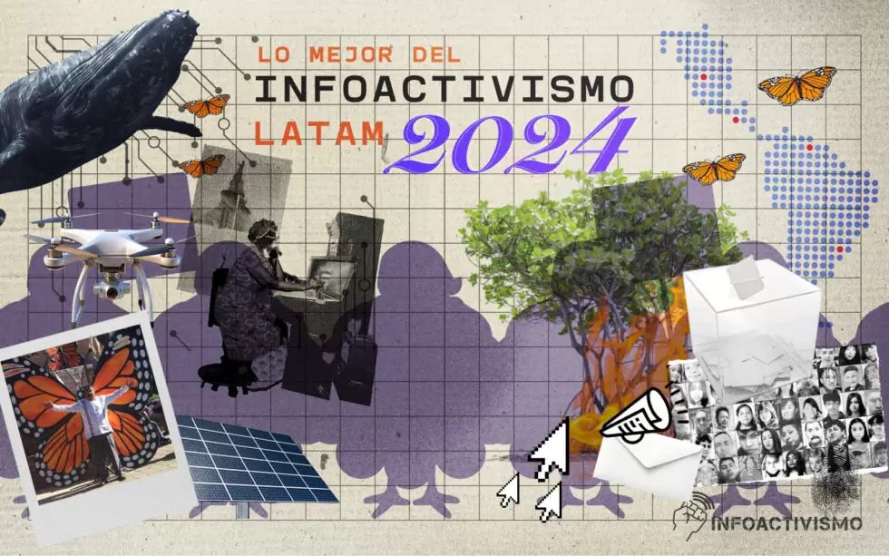

Estoy muy feliz porque la organización [SocialTIC](https://socialtic.org) junto a [infoactivismo.org](https://infoactivismo.org/) me mencionaron como una de las iniciativas de infoactivismo más destacada del año 2024! 🥳💕

[_Lo mejor del Infoactivismo 2024_](https://infoactivismo.org/lo-mejor-del-infoactivismo-en-latinoamerica-2024/) es un recuento anual de iniciativas y proyectos dedicados a la justicia y el cambio social apoyadas en tecnologías, datos e información en Latinoamérica. 

Agradezco mucho la mención! Es un honor estar entre otras iniciativas tan destacadas. Para mi, el año 2024 fue un año en el que me di cuenta que podía combinar mis habilidades técnicas con mis intereses sociales y políticos para crear herramientas de visualización de datos que resulten útiles e interesantes para los demás. Espero que este 2025 se venga con más datos!

[En este enlace](https://infoactivismo.org/lo-mejor-del-infoactivismo-en-latinoamerica-2024/) les dejo la lista completa de iniciativas, todas ellas muy interesantes para informarse de iniciativas en la región que utilizan tecnologías y datos para visibilizar y combatir problemáticas sociales.

Mi mención la incluyeron en la sección _Datos abiertos generados por organizaciones_, y la comparto a continuación:

> [Bastián Olea.](https://bastianolea.rbind.io) Desde Chile, reconocemos la labor ciudadana de Bastián quien ha visualizado datos sociales sobre Chile de manera atractiva y comprensible a través de R. [En su blog](https://bastianolea.rbind.io/blog/) facilita datos abiertos del sector público y comparte el código para que otras personas puedan aprender y contribuir. 

----

Les dejo el texto de introducción a la lista, como contexto y para que se animen a [revisar el resto de iniciativas](https://infoactivismo.org/lo-mejor-del-infoactivismo-en-latinoamerica-2024/):

> Como cada fin de año, nos alegra compartir una edición más de Lo mejor del Infoactivismo 2024, un recuento de acciones por la justicia y el cambio social apoyadas en tecnologías, datos e información en Latinoamérica. 

> El contexto actual de esta edición aborda desafíos como la desinformación y la polarización, la criminalización y ataques hacia activistas, periodistas y personas defensoras de derechos humanos, la emergencia climática, la crisis de desapariciones, los conflictos armados, el avance de grupos antiderechos, el abuso de tecnologías, la vulneración de los derechos humanos y la manipulación de la información por parte de gobiernos y grupos de poder.

> Los proyectos e iniciativas que compartimos a continuación son un reflejo de las problemáticas que impactan a nivel local y regional y de la búsqueda de soluciones a los retos que enfrentamos como sociedad. 

> Esta recopilación reúne más de 50 esfuerzos agrupados en 12 categorías, que por su estrategia, experimentación y creatividad en el uso de las tecnologías y la información, consideramos inspiradores para generar cambios en aspectos sociales, ambientales, políticos y culturales.