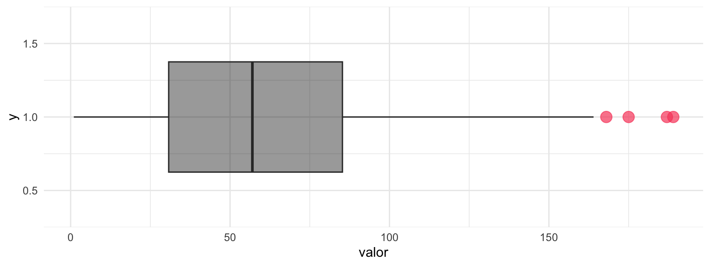
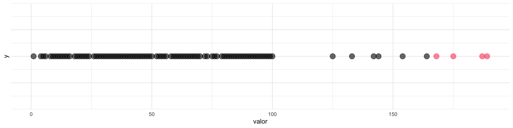
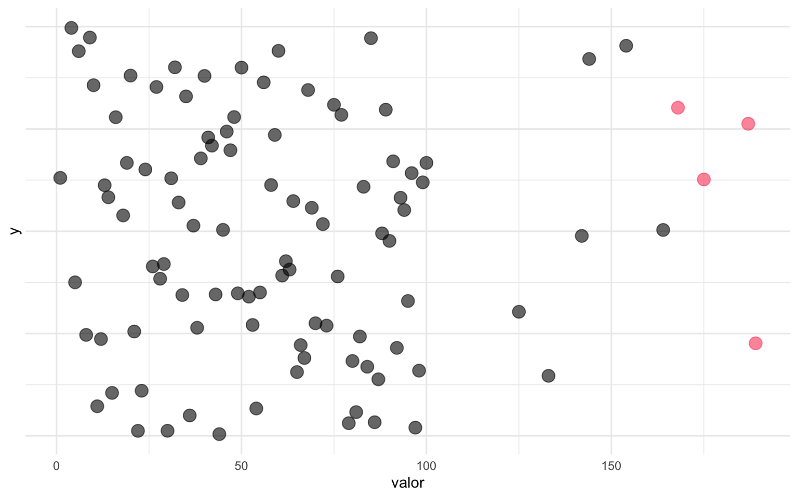
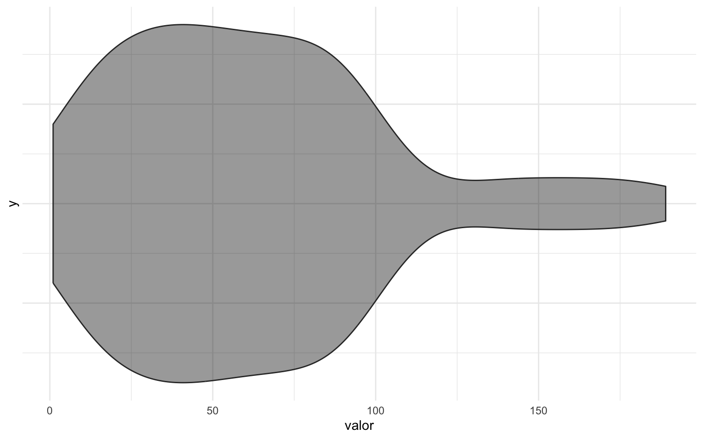
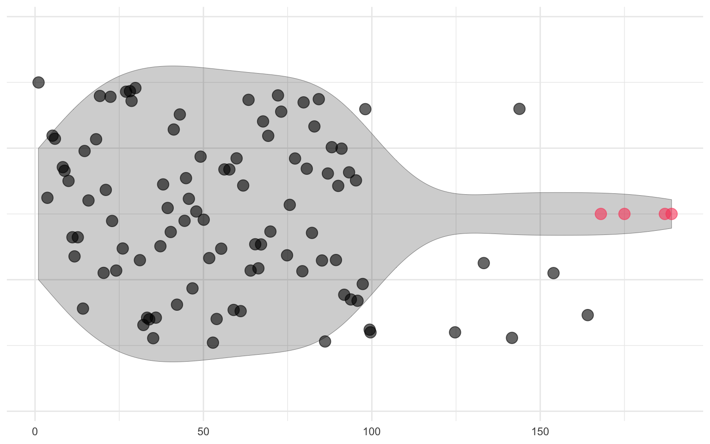
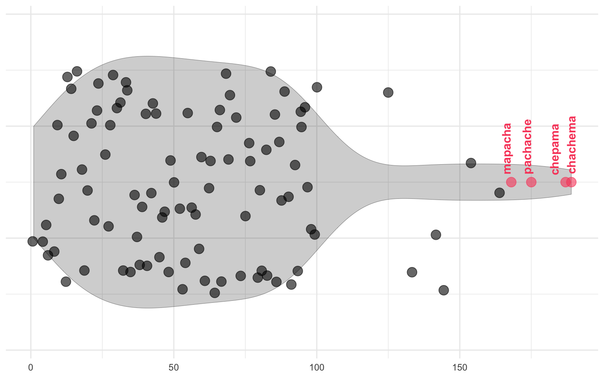
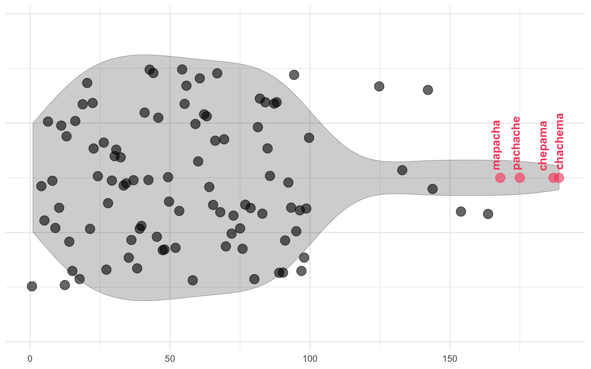

<link href="index_files/libs/htmltools-fill-0.5.8.1/fill.css" rel="stylesheet" />
<script src="index_files/libs/htmlwidgets-1.6.4/htmlwidgets.js"></script>
<script src="index_files/libs/d3-bundle-5.16.0/d3-bundle.min.js"></script>
<script src="index_files/libs/d3-lasso-0.0.5/d3-lasso.min.js"></script>
<script src="index_files/libs/save-svg-as-png-1.4.17/save-svg-as-png.min.js"></script>
<script src="index_files/libs/flatbush-4.4.0/flatbush.min.js"></script>
<link href="index_files/libs/ggiraphjs-0.8.10/ggiraphjs.min.css" rel="stylesheet" />
<script src="index_files/libs/ggiraphjs-0.8.10/ggiraphjs.min.js"></script>
<script src="index_files/libs/girafe-binding-0.8.13/girafe.js"></script>


Los datos anómalos o *outliers* son datos que se alejan considerablemente de los demás. Estos datos pueden resultar problemáticos para ciertos análisis, pueden ser indicio de errores en la recolección o limpieza de datos, o pueden requerir que tomemos ciertas decisiones para corregirlos o excluirlos.

En este post crearemos un dataset con datos outliers y luego mostraremos algunas formas de visualizarlos [en `{ggplot2}`](../../../tags/ggplot2/) para tomar decisiones al respecto. Al final crearemos un gráfico interactivo [con `{ggiraph}`](https://davidgohel.github.io/ggiraph/) que permita poner el cursor sobre las observaciones para obtener más información.

------------------------------------------------------------------------

Primero creemos un conjunto de datos que contenga números al azar, 90 números entre 1 y 100, y 10 números más grandes, para que sean nuestros outliers simulados:

``` r
library(dplyr)
library(ggplot2)

set.seed(1993)

valor <- c(sample(1:100, size = 90), # números al azar
           sample(120:190, size = 10)) # outliers
```

Obtenemos un vector con los dos conjuntos de números al azar.

Con la función `tibble()` convertimos el vector en una columna de un dataframe nuevo, y usando nuevamente `sample()` crearemos dos columnas con palabras al azar para complementar estos datos simulados:

``` r
datos <- tibble(valor) |> 
  # procesar por fila
  rowwise() |> 
  # por fila, elegir tres sílabas al azar y unirlas en un texto
  mutate(nombre = sample(c("ma", "pa", "che", "cha"), 3, F) |> paste(collapse = "")) |> 
  # desagrupar y creat otra columna que distribuya los datos en tres grupos
  ungroup() |>
  mutate(grupo = sample(c("ma", "pa", "che"), n(), T))

datos
```

    # A tibble: 100 × 3
       valor nombre   grupo
       <int> <chr>    <chr>
     1    45 chapache pa   
     2    95 chechapa ma   
     3    83 chamapa  ma   
     4    92 mapache  pa   
     5    40 chamache che  
     6    42 pachama  pa   
     7    75 mapacha  che  
     8    65 machepa  che  
     9    55 chachema che  
    10    18 chapama  che  
    # ℹ 90 more rows

Para identificar los *outliers*, utilizaremos el criterio del rango intercuartílico. El rango intercuartílico es el rango de los datos entre el primer y tercer cuartil (el percentil 25 y el percentil 75; es decir, la diferencia entre el dato ubicado en el 75% mayor y el 25% mayor de la distribución de los datos). Luego, este valor se multiplica por 1,5, y se suma al valor del tercer cuartil (percentil 75), de modo que se identifiquen como *outliers* los datos que sean mayores al tercer cuartil más 1,5 veces el rango intercuartílico.

``` r
datos_outliers <- datos |> 
  mutate(umbral = quantile(valor, 0.75) + 1.5 * IQR(valor))
```

Esto nos dará una cifra que operará como el umbral respecto del cual, si un valor es mayor a esta cifra, se clasificará como outlier. Es conveniente calcular este umbral dentro del dataframe, porque si queremos calcular outliers desagregados por otra variable, simplemente mantenemos la fórmula y agregamos antes un `group_by()` para realizar el cálculo por grupos.

Crearemos una columna que simplemente nos diga si los valores son mayores o menores al umbral:

``` r
datos_outliers <- datos_outliers |> 
  mutate(outlier = valor >= umbral)

datos_outliers
```

    # A tibble: 100 × 5
       valor nombre   grupo umbral outlier
       <int> <chr>    <chr>  <dbl> <lgl>  
     1    45 chapache pa       167 FALSE  
     2    95 chechapa ma       167 FALSE  
     3    83 chamapa  ma       167 FALSE  
     4    92 mapache  pa       167 FALSE  
     5    40 chamache che      167 FALSE  
     6    42 pachama  pa       167 FALSE  
     7    75 mapacha  che      167 FALSE  
     8    65 machepa  che      167 FALSE  
     9    55 chachema che      167 FALSE  
    10    18 chapama  che      167 FALSE  
    # ℹ 90 more rows

Obtenemos la variable `outlier` con `TRUE` si es outlier, y `FALSE` si no lo es.

Ahora vamos a visualizar estos datos con el paquete `{ggplot2}`. Si necesitas una introducción a esta librería de visualización de datos, [te recomiendo revisar este tutorial](../../../blog/r_introduccion/tutorial_visualizacion_ggplot/), donde explicamos en mayor detalle varias de estas visualizaciones.

## Gráfico de cajas o *boxplot*

El *boxplot* es una visualización que en su mismo diseño incluye la opción de mostrar los outliers, así que se trata de la opción natural para este tipo de visualizaciones exploratorias. Así que con esto concluye este tutorial. Bromita 🥰

``` r
datos_outliers |> 
  ggplot() +
  aes(x = valor, y = 1) +
  # gráfico de boxplot
  geom_boxplot(alpha = 0.4, fill = "black", 
               outlier.color = "#F94C6A", outlier.size = 4, outlier.alpha = 0.7) + # configuración de outliers
  # temas
  theme_minimal() +
  scale_y_continuous(expand = expansion(c(0.5, 0.5))) # aumentar margen del eje vertical
```



En un *boxplot*, los puntos al extremo de la caja representan los casos anómalos.

Pero la gracia de este tutorial es entrenar nuestras capacidades de visualización de datos, así que veamos otras formas de visualizarlos:

## Gráfico de puntos

Una forma sencilla de visualizar outliers sería simplemente visualizar las observaciones del dataser como puntos, coloreando los puntos si son outliers.

``` r
datos_outliers |> 
  ggplot() +
  aes(x = valor, y = 1, color = outlier) +
  # gráfico de puntos
  geom_point(size = 4, alpha = 0.6) +
  # escala de colores
  scale_color_manual(values = c("black", "#F94C6A")) +
  # temas
  theme_minimal() +
  # ocultar leyenda
  guides(color = guide_none(),
         y =  guide_none())
```



### Puntos con dispersión

Como existe una concentración densa en parte de la distribución, podemos usar la función `geom_jitter()` para que los puntos se dispersen verticalmente (`width = 0`, porque si se dispersan horizontalmente se ubicarían incorrectamente con respecto a su valor)

``` r
datos_outliers |> 
  ggplot() +
  aes(x = valor, y = 1, color = outlier) +
  # gráfico de puntos con dispersión
  geom_jitter(size = 4, alpha = 0.6, width = 0) +
  scale_color_manual(values = c("black", "#F94C6A")) +
  theme_minimal() +
  guides(color = guide_none(),
         y =  guide_none())
```



## Gráfico de violín

El gráfico de violín también nos permite observar la distribución de los datos, pero por sí solo no nos muestra las observaciones exactas, por lo que no entrega información certera sobre los outliers, sino que nos da indicios de que la distribución de los datos tiene *colas* que podrían contener outliers.

``` r
datos_outliers |> 
  ggplot() +
  aes(x = valor, y = 1) +
  # gráfico de violín
  geom_violin(fill = "black", alpha = 0.4) +
  theme_minimal() +
  guides(y =  guide_none()) # ocultar eje y
```



## Combinar visualizaciones

Una buena opción es combinar las visualizaciones anteriores en una sola. De fondo podemos poner la distribución de los datos con `geom_violin()`, y encima poner los puntos de las observaciones; para las observaciones normales podemos usar `geom_jitter()` para dispersar los datos, y para los outliers, como son poquitos, `geom_point()` para que se ubiquen en concordancia con la distribución del violín.

``` r
grafico_outliers <- datos_outliers |> 
  ggplot() +
  aes(x = valor, y = 1, color = outlier) +
  # gráfico de violín
  geom_violin(aes(y = 1, x = valor), 
              inherit.aes = F,
              alpha = 0.2, lwd = 0.1, fill = "black") +
  # puntos para los outliers
  geom_point(data = ~filter(.x, outlier), # sólo para observaciones que son outlier
             size = 4, alpha = 0.6) +
  # puntos dispersados para el resto de los datos
  geom_jitter(data = ~filter(.x, !outlier), # sólo para observaciones que no son outlier
              size = 4, alpha = 0.6) +
  # escala de colores
  scale_color_manual(values = c("black", "#F94C6A")) +
  # temas
  theme_minimal() +
  theme(axis.title = element_blank()) +
  guides(color = guide_none(),
         y =  guide_none())

grafico_outliers
```



Para combinar estas visualizaciones, aprovechamos la capacidad de `{ggplot2}` de especificar los datos que se usan en cada capa o geometría de la visualización por medio del argumento `data`. Normalmente, el argumento `data` se rellena por defecto con los datos que entregamos a la función `ggplot()`, pero si especificamos el argumento podemos hacer que cada capa use datos completamente distintos. En nuestro caso, no queremos datos distintos, sino **aplicar filtros a los datos de cada capa**, lo que se logra con `data = ~filter(.x, ...)`[^1], donde `...` sería el filtro que necesitemos. En la visualización anterior, queremos que `geom_point()` sólo muestre los datos que son `outlier == FALSE`, y que `geom_jitter()` sólo muestre los datos que son `outlier == TRUE`[^2].

``` r
data = ~filter(.x, outlier)
```

### Etiquetas de texto

Al identificar outliers, una buena opción es mostrar etiquetas de texto para estos casos con `geom_text()`. De este modo podemos identificar exactamente a qué observaciones corresponden las anomalías. En el caso de que fueran muchas etiquetas, podemos usar `geom_text_repel()` para que las etiquetas se muevan si es que caen encima de otras.

``` r
library(ggrepel)

grafico_outliers <- grafico_outliers + 
  # agregar texto al gráfico anterior
  ggrepel::geom_text_repel(data = ~filter(.x, outlier), # sólo para observaciones que son outlier
                  aes(label = nombre), # variable con el texto a mostrar
                  fontface = "bold", size = 4, point.padding = 4, angle = 90, hjust = 0) 

grafico_outliers
```



Ahora sabemos que *mapacha, pachache, chepama* y *chachema* son outliers 🤨

### Dividir por grupos

Otra forma de afinar el análisis es separar la visualización en los valores de la variable de agrupación que tengamos con `facet_wrap()`. En este caso, como la variable `grupo` tiene 3 valores posibles, se multiplica la visualización por tres.

``` r
grafico_outliers <- grafico_outliers +
  # separar gráfico en facetas según la variable grupo
  facet_wrap(~grupo, ncol = 1, scales = "fixed") +
  theme(strip.text = element_text(face = "bold")) # título de facetas en negrita

grafico_outliers
```



## Gráfico interactivo

Para mejorar la exploración de los datos podemos convertir fácilmente cualquier gráfico de `{ggplot2}` en gráficos interactivos gracias [al paquete `{ggiraph}`](https://davidgohel.github.io/ggiraph/). Principalmente, lo que agregaremos son *tooltips* o cajas emergentes que aparecerán cuando se pose el cursor sobre un punto del gráfico y que muestren información extra.

Con `{ggiraph}` solamente se requieren cambios mínimos para volver interactivo caulquier gráfico. Entre ellos es agregar `_interactive` a las funciones que crean las geometrías del gráfico:

-   Pasar de `geom_point()` a `geom_point_interactive()`
-   Pasar de `geom_jitter()` a `geom_jitter_interactive()`

Habiendo hecho este cambio, dentro de las geometrías `geom_x_interactive()` podemos definir la estética `tooltip` dentro de `aes()` para especificar el contenido que aparecerá cuando se ponga el cursor sobre los elementos del gráfico. En este caso, haremos que los *tooltips* muestren el nombre de la observación y su valor, y la palabra *outlier* si corresponde.

Copiamos el código anterior y hacemos los cambios apropiados al gráfico:

``` r
library(ggiraph)

grafico_outliers_interactivo <- datos_outliers |> 
  ggplot() +
  aes(x = valor, y = 1, color = outlier) +
  geom_violin(aes(y = 1, x = valor), 
              inherit.aes = F,
              alpha = 0.2, lwd = 0.1, fill = "black") +
  # puntos para los outliers
  ggiraph::geom_point_interactive(data = ~filter(.x, outlier), 
                         aes(tooltip = paste("outlier: ", valor, sep = "")), # texto "outlier" con el valor
                         size = 4, alpha = 0.6) +
  # puntos dispersados para el resto de los datos
  ggiraph::geom_jitter_interactive(data = ~filter(.x, !outlier), 
                          aes(tooltip = paste(nombre, ": ", valor, sep = "")), # nombre de observación y valor
                          size = 4, alpha = 0.6) +
  ggrepel::geom_text_repel(data = ~filter(.x, outlier),
                  aes(label = nombre),
                  fontface = "bold", size = 4, point.padding = 4, angle = 90, hjust = 0) +
  scale_color_manual(values = c("black", "#F94C6A")) +
  theme_minimal() +
  theme(axis.title = element_blank()) +
  guides(color = guide_none(),
         y =  guide_none())
```

Finalmente, para permitir la interactividad del gráfico, debemos generarlo con la función `girafe()`, la cual recibe el objeto con el gráfico además de varias opciones para personalizar la visualización:

``` r
girafe(ggobj = grafico_outliers_interactivo, 
       # dimensiones del gráfico
       width_svg = 9, height_svg = 4,
       # opciones para los tooltips
       options = list(
         # ocultar barra de opciones
         opts_toolbar(hidden = "selection", saveaspng = FALSE),
         # personalizar la apariencia del tooltip
         opts_tooltip(opacity = 0.7, use_fill = TRUE,
                      css = "font-family: sans-serif; font-size: 70%; color: white; padding: 4px; border-radius: 5px;"))
       )
```

<div class="girafe html-widget html-fill-item" id="htmlwidget-30221084b0cc18eee823" style="width:768px;height:480px;"></div>
<script type="application/json" data-for="htmlwidget-30221084b0cc18eee823">{"x":{"html":"<?xml version=\"1.0\" encoding=\"UTF-8\"?>\n<svg xmlns='http://www.w3.org/2000/svg' xmlns:xlink='http://www.w3.org/1999/xlink' class='ggiraph-svg' role='graphics-document' id='svg_06bdf23f_2b3b_4dce_ac28_5e2962591c67' viewBox='0 0 648 288'>\n <defs id='svg_06bdf23f_2b3b_4dce_ac28_5e2962591c67_defs'>\n  <clipPath id='svg_06bdf23f_2b3b_4dce_ac28_5e2962591c67_c1'>\n   <rect x='0' y='0' width='648' height='288'/>\n  <\/clipPath>\n  <clipPath id='svg_06bdf23f_2b3b_4dce_ac28_5e2962591c67_c2'>\n   <rect x='5.48' y='5.48' width='637.04' height='263.85'/>\n  <\/clipPath>\n <\/defs>\n <g id='svg_06bdf23f_2b3b_4dce_ac28_5e2962591c67_rootg' class='ggiraph-svg-rootg'>\n  <g clip-path='url(#svg_06bdf23f_2b3b_4dce_ac28_5e2962591c67_c1)'>\n   <rect x='0' y='0' width='648' height='288' fill='#FFFFFF' fill-opacity='1' stroke='#FFFFFF' stroke-opacity='1' stroke-width='0.75' stroke-linejoin='round' stroke-linecap='round' class='ggiraph-svg-bg'/>\n  <\/g>\n  <g clip-path='url(#svg_06bdf23f_2b3b_4dce_ac28_5e2962591c67_c2)'>\n   <polyline points='5.48,237.35 642.52,237.35' fill='none' stroke='#EBEBEB' stroke-opacity='1' stroke-width='0.53' stroke-linejoin='round' stroke-linecap='butt'/>\n   <polyline points='5.48,170.72 642.52,170.72' fill='none' stroke='#EBEBEB' stroke-opacity='1' stroke-width='0.53' stroke-linejoin='round' stroke-linecap='butt'/>\n   <polyline points='5.48,104.09 642.52,104.09' fill='none' stroke='#EBEBEB' stroke-opacity='1' stroke-width='0.53' stroke-linejoin='round' stroke-linecap='butt'/>\n   <polyline points='5.48,37.46 642.52,37.46' fill='none' stroke='#EBEBEB' stroke-opacity='1' stroke-width='0.53' stroke-linejoin='round' stroke-linecap='butt'/>\n   <polyline points='108.37,269.33 108.37,5.48' fill='none' stroke='#EBEBEB' stroke-opacity='1' stroke-width='0.53' stroke-linejoin='round' stroke-linecap='butt'/>\n   <polyline points='262.39,269.33 262.39,5.48' fill='none' stroke='#EBEBEB' stroke-opacity='1' stroke-width='0.53' stroke-linejoin='round' stroke-linecap='butt'/>\n   <polyline points='416.41,269.33 416.41,5.48' fill='none' stroke='#EBEBEB' stroke-opacity='1' stroke-width='0.53' stroke-linejoin='round' stroke-linecap='butt'/>\n   <polyline points='570.44,269.33 570.44,5.48' fill='none' stroke='#EBEBEB' stroke-opacity='1' stroke-width='0.53' stroke-linejoin='round' stroke-linecap='butt'/>\n   <polyline points='5.48,204.03 642.52,204.03' fill='none' stroke='#EBEBEB' stroke-opacity='1' stroke-width='1.07' stroke-linejoin='round' stroke-linecap='butt'/>\n   <polyline points='5.48,137.41 642.52,137.41' fill='none' stroke='#EBEBEB' stroke-opacity='1' stroke-width='1.07' stroke-linejoin='round' stroke-linecap='butt'/>\n   <polyline points='5.48,70.78 642.52,70.78' fill='none' stroke='#EBEBEB' stroke-opacity='1' stroke-width='1.07' stroke-linejoin='round' stroke-linecap='butt'/>\n   <polyline points='31.36,269.33 31.36,5.48' fill='none' stroke='#EBEBEB' stroke-opacity='1' stroke-width='1.07' stroke-linejoin='round' stroke-linecap='butt'/>\n   <polyline points='185.38,269.33 185.38,5.48' fill='none' stroke='#EBEBEB' stroke-opacity='1' stroke-width='1.07' stroke-linejoin='round' stroke-linecap='butt'/>\n   <polyline points='339.40,269.33 339.40,5.48' fill='none' stroke='#EBEBEB' stroke-opacity='1' stroke-width='1.07' stroke-linejoin='round' stroke-linecap='butt'/>\n   <polyline points='493.43,269.33 493.43,5.48' fill='none' stroke='#EBEBEB' stroke-opacity='1' stroke-width='1.07' stroke-linejoin='round' stroke-linecap='butt'/>\n   <polygon points='34.44,190.61 35.57,191.77 36.70,192.93 37.84,194.09 38.97,195.26 40.10,196.42 41.24,197.59 42.37,198.75 43.50,199.92 44.64,201.08 45.77,202.24 46.90,203.40 48.04,204.55 49.17,205.70 50.30,206.84 51.44,207.98 52.57,209.11 53.70,210.24 54.84,211.36 55.97,212.46 57.10,213.57 58.24,214.66 59.37,215.74 60.50,216.81 61.64,217.87 62.77,218.93 63.90,219.97 65.04,220.99 66.17,222.01 67.30,223.01 68.44,224.00 69.57,224.98 70.70,225.94 71.84,226.89 72.97,227.82 74.10,228.74 75.24,229.64 76.37,230.53 77.50,231.40 78.64,232.26 79.77,233.10 80.90,233.94 82.04,234.74 83.17,235.54 84.30,236.32 85.44,237.08 86.57,237.83 87.70,238.56 88.84,239.28 89.97,239.98 91.10,240.66 92.24,241.32 93.37,241.98 94.50,242.61 95.64,243.23 96.77,243.83 97.90,244.42 99.04,244.99 100.17,245.54 101.30,246.08 102.44,246.61 103.57,247.12 104.70,247.62 105.84,248.09 106.97,248.56 108.10,249.01 109.24,249.45 110.37,249.87 111.50,250.28 112.64,250.67 113.77,251.06 114.90,251.42 116.04,251.77 117.17,252.12 118.30,252.44 119.44,252.76 120.57,253.06 121.70,253.35 122.84,253.63 123.97,253.90 125.10,254.16 126.24,254.40 127.37,254.63 128.50,254.85 129.64,255.06 130.77,255.26 131.90,255.45 133.04,255.63 134.17,255.80 135.30,255.96 136.43,256.11 137.57,256.25 138.70,256.38 139.83,256.50 140.97,256.61 142.10,256.71 143.23,256.81 144.37,256.89 145.50,256.97 146.63,257.04 147.77,257.10 148.90,257.16 150.03,257.20 151.17,257.24 152.30,257.28 153.43,257.30 154.57,257.32 155.70,257.33 156.83,257.34 157.97,257.34 159.10,257.33 160.23,257.32 161.37,257.30 162.50,257.28 163.63,257.25 164.77,257.21 165.90,257.17 167.03,257.13 168.17,257.08 169.30,257.03 170.43,256.97 171.57,256.91 172.70,256.85 173.83,256.78 174.97,256.71 176.10,256.63 177.23,256.55 178.37,256.47 179.50,256.39 180.63,256.30 181.77,256.21 182.90,256.12 184.03,256.03 185.17,255.93 186.30,255.83 187.43,255.74 188.57,255.64 189.70,255.53 190.83,255.43 191.97,255.33 193.10,255.22 194.23,255.11 195.37,255.01 196.50,254.90 197.63,254.79 198.77,254.68 199.90,254.57 201.03,254.46 202.17,254.35 203.30,254.25 204.43,254.14 205.57,254.03 206.70,253.92 207.83,253.81 208.97,253.70 210.10,253.60 211.23,253.49 212.37,253.38 213.50,253.28 214.63,253.17 215.77,253.07 216.90,252.97 218.03,252.86 219.17,252.76 220.30,252.66 221.43,252.56 222.57,252.46 223.70,252.36 224.83,252.26 225.97,252.16 227.10,252.07 228.23,251.97 229.37,251.87 230.50,251.78 231.63,251.68 232.77,251.58 233.90,251.49 235.03,251.39 236.17,251.29 237.30,251.20 238.43,251.10 239.57,251.00 240.70,250.90 241.83,250.80 242.97,250.70 244.10,250.59 245.23,250.49 246.37,250.38 247.50,250.27 248.63,250.15 249.77,250.04 250.90,249.92 252.03,249.79 253.17,249.67 254.30,249.53 255.43,249.40 256.57,249.25 257.70,249.11 258.83,248.95 259.97,248.79 261.10,248.63 262.23,248.45 263.37,248.27 264.50,248.08 265.63,247.88 266.77,247.68 267.90,247.46 269.03,247.23 270.17,247.00 271.30,246.75 272.43,246.49 273.57,246.23 274.70,245.94 275.83,245.65 276.97,245.34 278.10,245.02 279.23,244.69 280.37,244.34 281.50,243.97 282.63,243.60 283.77,243.20 284.90,242.79 286.03,242.36 287.17,241.91 288.30,241.46 289.43,240.98 290.57,240.48 291.70,239.97 292.83,239.43 293.97,238.88 295.10,238.31 296.23,237.72 297.37,237.12 298.50,236.49 299.63,235.84 300.77,235.18 301.90,234.49 303.03,233.79 304.17,233.06 305.30,232.31 306.43,231.56 307.57,230.77 308.70,229.97 309.83,229.15 310.97,228.31 312.10,227.46 313.23,226.58 314.37,225.68 315.50,224.78 316.63,223.85 317.77,222.91 318.90,221.94 320.03,220.97 321.17,219.98 322.30,218.97 323.43,217.95 324.57,216.92 325.70,215.88 326.83,214.82 327.97,213.75 329.10,212.68 330.23,211.59 331.37,210.49 332.50,209.39 333.63,208.27 334.77,207.16 335.90,206.03 337.03,204.90 338.17,203.77 339.30,202.63 340.43,201.50 341.57,200.36 342.70,199.22 343.83,198.08 344.97,196.94 346.10,195.80 347.23,194.67 348.37,193.54 349.50,192.42 350.63,191.30 351.77,190.19 352.90,189.09 354.03,187.99 355.17,186.91 356.30,185.83 357.43,184.77 358.57,183.72 359.70,182.67 360.83,181.65 361.97,180.63 363.10,179.64 364.23,178.65 365.37,177.68 366.50,176.73 367.63,175.79 368.77,174.87 369.90,173.98 371.03,173.09 372.17,172.23 373.30,171.38 374.43,170.55 375.57,169.75 376.70,168.96 377.83,168.19 378.97,167.45 380.10,166.72 381.23,166.02 382.37,165.33 383.50,164.67 384.63,164.03 385.77,163.40 386.90,162.81 388.03,162.23 389.17,161.66 390.30,161.13 391.43,160.61 392.57,160.11 393.70,159.64 394.83,159.18 395.97,158.75 397.10,158.33 398.23,157.93 399.37,157.55 400.50,157.19 401.63,156.85 402.77,156.53 403.90,156.21 405.03,155.93 406.17,155.66 407.30,155.40 408.43,155.16 409.57,154.93 410.70,154.73 411.83,154.53 412.97,154.35 414.10,154.18 415.23,154.03 416.37,153.89 417.50,153.76 418.63,153.64 419.77,153.54 420.90,153.45 422.03,153.36 423.17,153.29 424.30,153.22 425.43,153.17 426.57,153.12 427.70,153.08 428.83,153.05 429.97,153.03 431.10,153.01 432.23,153.00 433.37,153.00 434.50,153.00 435.63,153.01 436.77,153.02 437.90,153.03 439.03,153.05 440.17,153.08 441.30,153.10 442.43,153.13 443.57,153.17 444.70,153.20 445.83,153.24 446.97,153.28 448.10,153.32 449.23,153.36 450.37,153.41 451.50,153.45 452.63,153.50 453.77,153.55 454.90,153.59 456.03,153.64 457.17,153.68 458.30,153.73 459.43,153.78 460.57,153.82 461.70,153.87 462.83,153.91 463.97,153.96 465.10,154.00 466.23,154.04 467.37,154.08 468.50,154.12 469.63,154.16 470.77,154.20 471.90,154.23 473.03,154.27 474.17,154.30 475.30,154.33 476.43,154.36 477.57,154.39 478.70,154.42 479.83,154.45 480.97,154.47 482.10,154.50 483.23,154.52 484.37,154.54 485.50,154.56 486.63,154.58 487.77,154.60 488.90,154.62 490.03,154.63 491.17,154.65 492.30,154.66 493.43,154.67 494.57,154.68 495.70,154.70 496.83,154.70 497.97,154.71 499.10,154.72 500.23,154.73 501.37,154.74 502.50,154.74 503.63,154.75 504.77,154.75 505.90,154.75 507.03,154.76 508.17,154.76 509.30,154.76 510.43,154.76 511.57,154.76 512.70,154.76 513.83,154.76 514.96,154.76 516.10,154.76 517.23,154.75 518.36,154.75 519.50,154.75 520.63,154.74 521.76,154.74 522.90,154.73 524.03,154.73 525.16,154.72 526.30,154.71 527.43,154.70 528.56,154.69 529.70,154.68 530.83,154.67 531.96,154.66 533.10,154.65 534.23,154.64 535.36,154.62 536.50,154.61 537.63,154.59 538.76,154.57 539.90,154.55 541.03,154.53 542.16,154.51 543.30,154.49 544.43,154.47 545.56,154.44 546.70,154.42 547.83,154.39 548.96,154.36 550.10,154.33 551.23,154.30 552.36,154.26 553.50,154.23 554.63,154.19 555.76,154.15 556.90,154.11 558.03,154.07 559.16,154.02 560.30,153.97 561.43,153.92 562.56,153.87 563.70,153.82 564.83,153.76 565.96,153.71 567.10,153.65 568.23,153.58 569.36,153.52 570.50,153.45 571.63,153.38 572.76,153.31 573.90,153.23 575.03,153.16 576.16,153.08 577.30,153.00 578.43,152.91 579.56,152.82 580.70,152.73 581.83,152.64 582.96,152.55 584.10,152.45 585.23,152.35 586.36,152.24 587.50,152.14 588.63,152.03 589.76,151.92 590.90,151.80 592.03,151.68 593.16,151.57 594.30,151.44 595.43,151.32 596.56,151.19 597.70,151.06 598.83,150.93 599.96,150.79 601.10,150.65 602.23,150.51 603.36,150.37 604.50,150.22 605.63,150.08 606.76,149.93 607.90,149.78 609.03,149.62 610.16,149.46 611.30,149.31 612.43,149.15 613.56,148.98 613.56,125.83 612.43,125.66 611.30,125.50 610.16,125.35 609.03,125.19 607.90,125.03 606.76,124.88 605.63,124.73 604.50,124.59 603.36,124.44 602.23,124.30 601.10,124.16 599.96,124.02 598.83,123.88 597.70,123.75 596.56,123.62 595.43,123.49 594.30,123.37 593.16,123.24 592.03,123.13 590.90,123.01 589.76,122.89 588.63,122.78 587.50,122.67 586.36,122.57 585.23,122.46 584.10,122.36 582.96,122.26 581.83,122.17 580.70,122.08 579.56,121.99 578.43,121.90 577.30,121.81 576.16,121.73 575.03,121.65 573.90,121.58 572.76,121.50 571.63,121.43 570.50,121.36 569.36,121.29 568.23,121.23 567.10,121.16 565.96,121.10 564.83,121.05 563.70,120.99 562.56,120.94 561.43,120.89 560.30,120.84 559.16,120.79 558.03,120.74 556.90,120.70 555.76,120.66 554.63,120.62 553.50,120.58 552.36,120.55 551.23,120.51 550.10,120.48 548.96,120.45 547.83,120.42 546.70,120.39 545.56,120.37 544.43,120.34 543.30,120.32 542.16,120.30 541.03,120.28 539.90,120.26 538.76,120.24 537.63,120.22 536.50,120.20 535.36,120.19 534.23,120.17 533.10,120.16 531.96,120.15 530.83,120.14 529.70,120.13 528.56,120.12 527.43,120.11 526.30,120.10 525.16,120.09 524.03,120.09 522.90,120.08 521.76,120.07 520.63,120.07 519.50,120.06 518.36,120.06 517.23,120.06 516.10,120.05 514.96,120.05 513.83,120.05 512.70,120.05 511.57,120.05 510.43,120.05 509.30,120.05 508.17,120.05 507.03,120.05 505.90,120.06 504.77,120.06 503.63,120.06 502.50,120.07 501.37,120.07 500.23,120.08 499.10,120.09 497.97,120.10 496.83,120.11 495.70,120.11 494.57,120.13 493.43,120.14 492.30,120.15 491.17,120.16 490.03,120.18 488.90,120.19 487.77,120.21 486.63,120.23 485.50,120.25 484.37,120.27 483.23,120.29 482.10,120.31 480.97,120.34 479.83,120.36 478.70,120.39 477.57,120.42 476.43,120.45 475.30,120.48 474.17,120.51 473.03,120.54 471.90,120.58 470.77,120.61 469.63,120.65 468.50,120.69 467.37,120.73 466.23,120.77 465.10,120.81 463.97,120.85 462.83,120.90 461.70,120.94 460.57,120.99 459.43,121.03 458.30,121.08 457.17,121.13 456.03,121.17 454.90,121.22 453.77,121.27 452.63,121.31 451.50,121.36 450.37,121.40 449.23,121.45 448.10,121.49 446.97,121.53 445.83,121.57 444.70,121.61 443.57,121.64 442.43,121.68 441.30,121.71 440.17,121.73 439.03,121.76 437.90,121.78 436.77,121.79 435.63,121.80 434.50,121.81 433.37,121.81 432.23,121.81 431.10,121.80 429.97,121.78 428.83,121.76 427.70,121.73 426.57,121.69 425.43,121.64 424.30,121.59 423.17,121.52 422.03,121.45 420.90,121.36 419.77,121.27 418.63,121.17 417.50,121.05 416.37,120.92 415.23,120.78 414.10,120.63 412.97,120.46 411.83,120.28 410.70,120.08 409.57,119.88 408.43,119.65 407.30,119.41 406.17,119.15 405.03,118.88 403.90,118.60 402.77,118.28 401.63,117.96 400.50,117.62 399.37,117.26 398.23,116.88 397.10,116.48 395.97,116.06 394.83,115.63 393.70,115.17 392.57,114.70 391.43,114.20 390.30,113.68 389.17,113.15 388.03,112.58 386.90,112.00 385.77,111.41 384.63,110.78 383.50,110.14 382.37,109.48 381.23,108.79 380.10,108.09 378.97,107.36 377.83,106.62 376.70,105.85 375.57,105.06 374.43,104.26 373.30,103.43 372.17,102.58 371.03,101.72 369.90,100.84 368.77,99.94 367.63,99.02 366.50,98.08 365.37,97.13 364.23,96.16 363.10,95.17 361.97,94.18 360.83,93.16 359.70,92.14 358.57,91.09 357.43,90.04 356.30,88.98 355.17,87.90 354.03,86.82 352.90,85.72 351.77,84.62 350.63,83.51 349.50,82.39 348.37,81.27 347.23,80.14 346.10,79.01 344.97,77.87 343.83,76.73 342.70,75.59 341.57,74.45 340.43,73.31 339.30,72.18 338.17,71.04 337.03,69.91 335.90,68.78 334.77,67.65 333.63,66.54 332.50,65.42 331.37,64.32 330.23,63.22 329.10,62.13 327.97,61.06 326.83,59.99 325.70,58.93 324.57,57.89 323.43,56.86 322.30,55.84 321.17,54.83 320.03,53.84 318.90,52.87 317.77,51.91 316.63,50.96 315.50,50.03 314.37,49.13 313.23,48.23 312.10,47.35 310.97,46.50 309.83,45.66 308.70,44.84 307.57,44.04 306.43,43.25 305.30,42.50 304.17,41.75 303.03,41.02 301.90,40.32 300.77,39.63 299.63,38.97 298.50,38.32 297.37,37.69 296.23,37.09 295.10,36.50 293.97,35.93 292.83,35.38 291.70,34.84 290.57,34.33 289.43,33.83 288.30,33.35 287.17,32.90 286.03,32.45 284.90,32.02 283.77,31.61 282.63,31.21 281.50,30.84 280.37,30.47 279.23,30.12 278.10,29.79 276.97,29.47 275.83,29.16 274.70,28.87 273.57,28.58 272.43,28.32 271.30,28.06 270.17,27.81 269.03,27.58 267.90,27.35 266.77,27.13 265.63,26.93 264.50,26.73 263.37,26.54 262.23,26.36 261.10,26.18 259.97,26.02 258.83,25.86 257.70,25.70 256.57,25.56 255.43,25.41 254.30,25.28 253.17,25.14 252.03,25.02 250.90,24.89 249.77,24.77 248.63,24.66 247.50,24.54 246.37,24.43 245.23,24.32 244.10,24.22 242.97,24.11 241.83,24.01 240.70,23.91 239.57,23.81 238.43,23.71 237.30,23.61 236.17,23.52 235.03,23.42 233.90,23.32 232.77,23.23 231.63,23.13 230.50,23.03 229.37,22.94 228.23,22.84 227.10,22.74 225.97,22.65 224.83,22.55 223.70,22.45 222.57,22.35 221.43,22.25 220.30,22.15 219.17,22.05 218.03,21.95 216.90,21.84 215.77,21.74 214.63,21.64 213.50,21.53 212.37,21.43 211.23,21.32 210.10,21.21 208.97,21.11 207.83,21.00 206.70,20.89 205.57,20.78 204.43,20.67 203.30,20.56 202.17,20.46 201.03,20.35 199.90,20.24 198.77,20.13 197.63,20.02 196.50,19.91 195.37,19.80 194.23,19.70 193.10,19.59 191.97,19.48 190.83,19.38 189.70,19.28 188.57,19.17 187.43,19.07 186.30,18.98 185.17,18.88 184.03,18.78 182.90,18.69 181.77,18.60 180.63,18.51 179.50,18.42 178.37,18.34 177.23,18.26 176.10,18.18 174.97,18.10 173.83,18.03 172.70,17.96 171.57,17.90 170.43,17.84 169.30,17.78 168.17,17.73 167.03,17.68 165.90,17.64 164.77,17.60 163.63,17.56 162.50,17.53 161.37,17.51 160.23,17.49 159.10,17.48 157.97,17.47 156.83,17.47 155.70,17.48 154.57,17.49 153.43,17.51 152.30,17.53 151.17,17.57 150.03,17.61 148.90,17.65 147.77,17.71 146.63,17.77 145.50,17.84 144.37,17.92 143.23,18.00 142.10,18.10 140.97,18.20 139.83,18.31 138.70,18.43 137.57,18.56 136.43,18.70 135.30,18.85 134.17,19.01 133.04,19.18 131.90,19.36 130.77,19.55 129.64,19.75 128.50,19.96 127.37,20.18 126.24,20.41 125.10,20.65 123.97,20.91 122.84,21.18 121.70,21.46 120.57,21.75 119.44,22.05 118.30,22.37 117.17,22.69 116.04,23.04 114.90,23.39 113.77,23.75 112.64,24.14 111.50,24.53 110.37,24.94 109.24,25.36 108.10,25.80 106.97,26.25 105.84,26.72 104.70,27.19 103.57,27.69 102.44,28.20 101.30,28.73 100.17,29.27 99.04,29.82 97.90,30.39 96.77,30.98 95.64,31.58 94.50,32.20 93.37,32.83 92.24,33.49 91.10,34.15 89.97,34.83 88.84,35.53 87.70,36.25 86.57,36.98 85.44,37.73 84.30,38.49 83.17,39.27 82.04,40.07 80.90,40.87 79.77,41.71 78.64,42.55 77.50,43.41 76.37,44.28 75.24,45.17 74.10,46.07 72.97,46.99 71.84,47.92 70.70,48.87 69.57,49.83 68.44,50.81 67.30,51.80 66.17,52.80 65.04,53.82 63.90,54.84 62.77,55.89 61.64,56.94 60.50,58.00 59.37,59.07 58.24,60.15 57.10,61.24 55.97,62.35 54.84,63.45 53.70,64.57 52.57,65.70 51.44,66.83 50.30,67.97 49.17,69.11 48.04,70.26 46.90,71.41 45.77,72.57 44.64,73.73 43.50,74.89 42.37,76.06 41.24,77.22 40.10,78.39 38.97,79.55 37.84,80.72 36.70,81.88 35.57,83.04 34.44,84.20 34.44,190.61' fill='#000000' fill-opacity='0.2' stroke='#333333' stroke-opacity='1' stroke-width='0.21' stroke-linejoin='round' stroke-linecap='butt'/>\n   <circle id='svg_06bdf23f_2b3b_4dce_ac28_5e2962591c67_e1' cx='607.4' cy='137.41' r='3.47pt' fill='#F94C6A' fill-opacity='0.6' stroke='#F94C6A' stroke-opacity='0.6' stroke-width='0.71' stroke-linejoin='round' stroke-linecap='round' title='outlier: 187'/>\n   <circle id='svg_06bdf23f_2b3b_4dce_ac28_5e2962591c67_e2' cx='570.44' cy='137.41' r='3.47pt' fill='#F94C6A' fill-opacity='0.6' stroke='#F94C6A' stroke-opacity='0.6' stroke-width='0.71' stroke-linejoin='round' stroke-linecap='round' title='outlier: 175'/>\n   <circle id='svg_06bdf23f_2b3b_4dce_ac28_5e2962591c67_e3' cx='548.87' cy='137.41' r='3.47pt' fill='#F94C6A' fill-opacity='0.6' stroke='#F94C6A' stroke-opacity='0.6' stroke-width='0.71' stroke-linejoin='round' stroke-linecap='round' title='outlier: 168'/>\n   <circle id='svg_06bdf23f_2b3b_4dce_ac28_5e2962591c67_e4' cx='613.56' cy='137.41' r='3.47pt' fill='#F94C6A' fill-opacity='0.6' stroke='#F94C6A' stroke-opacity='0.6' stroke-width='0.71' stroke-linejoin='round' stroke-linecap='round' title='outlier: 189'/>\n   <circle id='svg_06bdf23f_2b3b_4dce_ac28_5e2962591c67_e5' cx='169.56' cy='204.96' r='3.47pt' fill='#000000' fill-opacity='0.6' stroke='#000000' stroke-opacity='0.6' stroke-width='0.71' stroke-linejoin='round' stroke-linecap='round' title='chapache: 45'/>\n   <circle id='svg_06bdf23f_2b3b_4dce_ac28_5e2962591c67_e6' cx='322.9' cy='93.95' r='3.47pt' fill='#000000' fill-opacity='0.6' stroke='#000000' stroke-opacity='0.6' stroke-width='0.71' stroke-linejoin='round' stroke-linecap='round' title='chechapa: 95'/>\n   <circle id='svg_06bdf23f_2b3b_4dce_ac28_5e2962591c67_e7' cx='286.87' cy='131.71' r='3.47pt' fill='#000000' fill-opacity='0.6' stroke='#000000' stroke-opacity='0.6' stroke-width='0.71' stroke-linejoin='round' stroke-linecap='round' title='chamapa: 83'/>\n   <circle id='svg_06bdf23f_2b3b_4dce_ac28_5e2962591c67_e8' cx='314.17' cy='242.77' r='3.47pt' fill='#000000' fill-opacity='0.6' stroke='#000000' stroke-opacity='0.6' stroke-width='0.71' stroke-linejoin='round' stroke-linecap='round' title='mapache: 92'/>\n   <circle id='svg_06bdf23f_2b3b_4dce_ac28_5e2962591c67_e9' cx='153.47' cy='53.11' r='3.47pt' fill='#000000' fill-opacity='0.6' stroke='#000000' stroke-opacity='0.6' stroke-width='0.71' stroke-linejoin='round' stroke-linecap='round' title='chamache: 40'/>\n   <circle id='svg_06bdf23f_2b3b_4dce_ac28_5e2962591c67_e10' cx='161.64' cy='109.35' r='3.47pt' fill='#000000' fill-opacity='0.6' stroke='#000000' stroke-opacity='0.6' stroke-width='0.71' stroke-linejoin='round' stroke-linecap='round' title='pachama: 42'/>\n   <circle id='svg_06bdf23f_2b3b_4dce_ac28_5e2962591c67_e11' cx='261.94' cy='112.21' r='3.47pt' fill='#000000' fill-opacity='0.6' stroke='#000000' stroke-opacity='0.6' stroke-width='0.71' stroke-linejoin='round' stroke-linecap='round' title='mapacha: 75'/>\n   <circle id='svg_06bdf23f_2b3b_4dce_ac28_5e2962591c67_e12' cx='231.47' cy='61.02' r='3.47pt' fill='#000000' fill-opacity='0.6' stroke='#000000' stroke-opacity='0.6' stroke-width='0.71' stroke-linejoin='round' stroke-linecap='round' title='machepa: 65'/>\n   <circle id='svg_06bdf23f_2b3b_4dce_ac28_5e2962591c67_e13' cx='200.19' cy='182.25' r='3.47pt' fill='#000000' fill-opacity='0.6' stroke='#000000' stroke-opacity='0.6' stroke-width='0.71' stroke-linejoin='round' stroke-linecap='round' title='chachema: 55'/>\n   <circle id='svg_06bdf23f_2b3b_4dce_ac28_5e2962591c67_e14' cx='87.62' cy='180.13' r='3.47pt' fill='#000000' fill-opacity='0.6' stroke='#000000' stroke-opacity='0.6' stroke-width='0.71' stroke-linejoin='round' stroke-linecap='round' title='chapama: 18'/>\n   <circle id='svg_06bdf23f_2b3b_4dce_ac28_5e2962591c67_e15' cx='321.97' cy='82.51' r='3.47pt' fill='#000000' fill-opacity='0.6' stroke='#000000' stroke-opacity='0.6' stroke-width='0.71' stroke-linejoin='round' stroke-linecap='round' title='pamache: 94'/>\n   <circle id='svg_06bdf23f_2b3b_4dce_ac28_5e2962591c67_e16' cx='311.7' cy='213.75' r='3.47pt' fill='#000000' fill-opacity='0.6' stroke='#000000' stroke-opacity='0.6' stroke-width='0.71' stroke-linejoin='round' stroke-linecap='round' title='chepama: 91'/>\n   <circle id='svg_06bdf23f_2b3b_4dce_ac28_5e2962591c67_e17' cx='192.15' cy='225.17' r='3.47pt' fill='#000000' fill-opacity='0.6' stroke='#000000' stroke-opacity='0.6' stroke-width='0.71' stroke-linejoin='round' stroke-linecap='round' title='chamapa: 52'/>\n   <circle id='svg_06bdf23f_2b3b_4dce_ac28_5e2962591c67_e18' cx='218.56' cy='80.11' r='3.47pt' fill='#000000' fill-opacity='0.6' stroke='#000000' stroke-opacity='0.6' stroke-width='0.71' stroke-linejoin='round' stroke-linecap='round' title='machapa: 61'/>\n   <circle id='svg_06bdf23f_2b3b_4dce_ac28_5e2962591c67_e19' cx='277.1' cy='226.5' r='3.47pt' fill='#000000' fill-opacity='0.6' stroke='#000000' stroke-opacity='0.6' stroke-width='0.71' stroke-linejoin='round' stroke-linecap='round' title='pachema: 80'/>\n   <circle id='svg_06bdf23f_2b3b_4dce_ac28_5e2962591c67_e20' cx='127.22' cy='32.11' r='3.47pt' fill='#000000' fill-opacity='0.6' stroke='#000000' stroke-opacity='0.6' stroke-width='0.71' stroke-linejoin='round' stroke-linecap='round' title='chemacha: 31'/>\n   <circle id='svg_06bdf23f_2b3b_4dce_ac28_5e2962591c67_e21' cx='121.18' cy='141.74' r='3.47pt' fill='#000000' fill-opacity='0.6' stroke='#000000' stroke-opacity='0.6' stroke-width='0.71' stroke-linejoin='round' stroke-linecap='round' title='chechama: 29'/>\n   <circle id='svg_06bdf23f_2b3b_4dce_ac28_5e2962591c67_e22' cx='98.83' cy='191.19' r='3.47pt' fill='#000000' fill-opacity='0.6' stroke='#000000' stroke-opacity='0.6' stroke-width='0.71' stroke-linejoin='round' stroke-linecap='round' title='chapama: 22'/>\n   <circle id='svg_06bdf23f_2b3b_4dce_ac28_5e2962591c67_e23' cx='175.9' cy='215.58' r='3.47pt' fill='#000000' fill-opacity='0.6' stroke='#000000' stroke-opacity='0.6' stroke-width='0.71' stroke-linejoin='round' stroke-linecap='round' title='pachama: 47'/>\n   <circle id='svg_06bdf23f_2b3b_4dce_ac28_5e2962591c67_e24' cx='178.75' cy='140.95' r='3.47pt' fill='#000000' fill-opacity='0.6' stroke='#000000' stroke-opacity='0.6' stroke-width='0.71' stroke-linejoin='round' stroke-linecap='round' title='pachama: 48'/>\n   <circle id='svg_06bdf23f_2b3b_4dce_ac28_5e2962591c67_e25' cx='216.06' cy='76.44' r='3.47pt' fill='#000000' fill-opacity='0.6' stroke='#000000' stroke-opacity='0.6' stroke-width='0.71' stroke-linejoin='round' stroke-linecap='round' title='pamacha: 60'/>\n   <circle id='svg_06bdf23f_2b3b_4dce_ac28_5e2962591c67_e26' cx='172.07' cy='118.71' r='3.47pt' fill='#000000' fill-opacity='0.6' stroke='#000000' stroke-opacity='0.6' stroke-width='0.71' stroke-linejoin='round' stroke-linecap='round' title='chepama: 46'/>\n   <circle id='svg_06bdf23f_2b3b_4dce_ac28_5e2962591c67_e27' cx='139.16' cy='175.52' r='3.47pt' fill='#000000' fill-opacity='0.6' stroke='#000000' stroke-opacity='0.6' stroke-width='0.71' stroke-linejoin='round' stroke-linecap='round' title='chechapa: 35'/>\n   <circle id='svg_06bdf23f_2b3b_4dce_ac28_5e2962591c67_e28' cx='241.38' cy='140.97' r='3.47pt' fill='#000000' fill-opacity='0.6' stroke='#000000' stroke-opacity='0.6' stroke-width='0.71' stroke-linejoin='round' stroke-linecap='round' title='chamapa: 68'/>\n   <circle id='svg_06bdf23f_2b3b_4dce_ac28_5e2962591c67_e29' cx='96.42' cy='121.37' r='3.47pt' fill='#000000' fill-opacity='0.6' stroke='#000000' stroke-opacity='0.6' stroke-width='0.71' stroke-linejoin='round' stroke-linecap='round' title='pamache: 21'/>\n   <circle id='svg_06bdf23f_2b3b_4dce_ac28_5e2962591c67_e30' cx='237.41' cy='180.65' r='3.47pt' fill='#000000' fill-opacity='0.6' stroke='#000000' stroke-opacity='0.6' stroke-width='0.71' stroke-linejoin='round' stroke-linecap='round' title='chemacha: 67'/>\n   <circle id='svg_06bdf23f_2b3b_4dce_ac28_5e2962591c67_e31' cx='295.13' cy='168.96' r='3.47pt' fill='#000000' fill-opacity='0.6' stroke='#000000' stroke-opacity='0.6' stroke-width='0.71' stroke-linejoin='round' stroke-linecap='round' title='chamache: 86'/>\n   <circle id='svg_06bdf23f_2b3b_4dce_ac28_5e2962591c67_e32' cx='34.96' cy='80.48' r='3.47pt' fill='#000000' fill-opacity='0.6' stroke='#000000' stroke-opacity='0.6' stroke-width='0.71' stroke-linejoin='round' stroke-linecap='round' title='chemapa: 1'/>\n   <circle id='svg_06bdf23f_2b3b_4dce_ac28_5e2962591c67_e33' cx='246.03' cy='129.1' r='3.47pt' fill='#000000' fill-opacity='0.6' stroke='#000000' stroke-opacity='0.6' stroke-width='0.71' stroke-linejoin='round' stroke-linecap='round' title='chepama: 70'/>\n   <circle id='svg_06bdf23f_2b3b_4dce_ac28_5e2962591c67_e34' cx='264.52' cy='131.61' r='3.47pt' fill='#000000' fill-opacity='0.6' stroke='#000000' stroke-opacity='0.6' stroke-width='0.71' stroke-linejoin='round' stroke-linecap='round' title='chechapa: 76'/>\n   <circle id='svg_06bdf23f_2b3b_4dce_ac28_5e2962591c67_e35' cx='135.93' cy='219.84' r='3.47pt' fill='#000000' fill-opacity='0.6' stroke='#000000' stroke-opacity='0.6' stroke-width='0.71' stroke-linejoin='round' stroke-linecap='round' title='mapacha: 34'/>\n   <circle id='svg_06bdf23f_2b3b_4dce_ac28_5e2962591c67_e36' cx='124.81' cy='238.6' r='3.47pt' fill='#000000' fill-opacity='0.6' stroke='#000000' stroke-opacity='0.6' stroke-width='0.71' stroke-linejoin='round' stroke-linecap='round' title='chamache: 30'/>\n   <circle id='svg_06bdf23f_2b3b_4dce_ac28_5e2962591c67_e37' cx='294' cy='42.1' r='3.47pt' fill='#000000' fill-opacity='0.6' stroke='#000000' stroke-opacity='0.6' stroke-width='0.71' stroke-linejoin='round' stroke-linecap='round' title='chechapa: 85'/>\n   <circle id='svg_06bdf23f_2b3b_4dce_ac28_5e2962591c67_e38' cx='183.43' cy='33.61' r='3.47pt' fill='#000000' fill-opacity='0.6' stroke='#000000' stroke-opacity='0.6' stroke-width='0.71' stroke-linejoin='round' stroke-linecap='round' title='machache: 49'/>\n   <circle id='svg_06bdf23f_2b3b_4dce_ac28_5e2962591c67_e39' cx='133.74' cy='153.73' r='3.47pt' fill='#000000' fill-opacity='0.6' stroke='#000000' stroke-opacity='0.6' stroke-width='0.71' stroke-linejoin='round' stroke-linecap='round' title='chechama: 33'/>\n   <circle id='svg_06bdf23f_2b3b_4dce_ac28_5e2962591c67_e40' cx='102.85' cy='189.98' r='3.47pt' fill='#000000' fill-opacity='0.6' stroke='#000000' stroke-opacity='0.6' stroke-width='0.71' stroke-linejoin='round' stroke-linecap='round' title='pachema: 23'/>\n   <circle id='svg_06bdf23f_2b3b_4dce_ac28_5e2962591c67_e41' cx='162.65' cy='185.32' r='3.47pt' fill='#000000' fill-opacity='0.6' stroke='#000000' stroke-opacity='0.6' stroke-width='0.71' stroke-linejoin='round' stroke-linecap='round' title='chapama: 43'/>\n   <circle id='svg_06bdf23f_2b3b_4dce_ac28_5e2962591c67_e42' cx='116.54' cy='231.95' r='3.47pt' fill='#000000' fill-opacity='0.6' stroke='#000000' stroke-opacity='0.6' stroke-width='0.71' stroke-linejoin='round' stroke-linecap='round' title='pamache: 28'/>\n   <circle id='svg_06bdf23f_2b3b_4dce_ac28_5e2962591c67_e43' cx='254.26' cy='140.56' r='3.47pt' fill='#000000' fill-opacity='0.6' stroke='#000000' stroke-opacity='0.6' stroke-width='0.71' stroke-linejoin='round' stroke-linecap='round' title='chamache: 72'/>\n   <circle id='svg_06bdf23f_2b3b_4dce_ac28_5e2962591c67_e44' cx='338.69' cy='94.11' r='3.47pt' fill='#000000' fill-opacity='0.6' stroke='#000000' stroke-opacity='0.6' stroke-width='0.71' stroke-linejoin='round' stroke-linecap='round' title='pachama: 100'/>\n   <circle id='svg_06bdf23f_2b3b_4dce_ac28_5e2962591c67_e45' cx='317.77' cy='198.24' r='3.47pt' fill='#000000' fill-opacity='0.6' stroke='#000000' stroke-opacity='0.6' stroke-width='0.71' stroke-linejoin='round' stroke-linecap='round' title='chapama: 93'/>\n   <circle id='svg_06bdf23f_2b3b_4dce_ac28_5e2962591c67_e46' cx='208.92' cy='179.46' r='3.47pt' fill='#000000' fill-opacity='0.6' stroke='#000000' stroke-opacity='0.6' stroke-width='0.71' stroke-linejoin='round' stroke-linecap='round' title='machepa: 58'/>\n   <circle id='svg_06bdf23f_2b3b_4dce_ac28_5e2962591c67_e47' cx='110.37' cy='154.2' r='3.47pt' fill='#000000' fill-opacity='0.6' stroke='#000000' stroke-opacity='0.6' stroke-width='0.71' stroke-linejoin='round' stroke-linecap='round' title='chemapa: 26'/>\n   <circle id='svg_06bdf23f_2b3b_4dce_ac28_5e2962591c67_e48' cx='234.19' cy='70.86' r='3.47pt' fill='#000000' fill-opacity='0.6' stroke='#000000' stroke-opacity='0.6' stroke-width='0.71' stroke-linejoin='round' stroke-linecap='round' title='machepa: 66'/>\n   <circle id='svg_06bdf23f_2b3b_4dce_ac28_5e2962591c67_e49' cx='290.42' cy='231.04' r='3.47pt' fill='#000000' fill-opacity='0.6' stroke='#000000' stroke-opacity='0.6' stroke-width='0.71' stroke-linejoin='round' stroke-linecap='round' title='mapache: 84'/>\n   <circle id='svg_06bdf23f_2b3b_4dce_ac28_5e2962591c67_e50' cx='256.27' cy='142.34' r='3.47pt' fill='#000000' fill-opacity='0.6' stroke='#000000' stroke-opacity='0.6' stroke-width='0.71' stroke-linejoin='round' stroke-linecap='round' title='mapacha: 73'/>\n   <circle id='svg_06bdf23f_2b3b_4dce_ac28_5e2962591c67_e51' cx='148.73' cy='161.66' r='3.47pt' fill='#000000' fill-opacity='0.6' stroke='#000000' stroke-opacity='0.6' stroke-width='0.71' stroke-linejoin='round' stroke-linecap='round' title='chemapa: 38'/>\n   <circle id='svg_06bdf23f_2b3b_4dce_ac28_5e2962591c67_e52' cx='326.34' cy='145.69' r='3.47pt' fill='#000000' fill-opacity='0.6' stroke='#000000' stroke-opacity='0.6' stroke-width='0.71' stroke-linejoin='round' stroke-linecap='round' title='chepacha: 96'/>\n   <circle id='svg_06bdf23f_2b3b_4dce_ac28_5e2962591c67_e53' cx='269.59' cy='186.13' r='3.47pt' fill='#000000' fill-opacity='0.6' stroke='#000000' stroke-opacity='0.6' stroke-width='0.71' stroke-linejoin='round' stroke-linecap='round' title='chepacha: 77'/>\n   <circle id='svg_06bdf23f_2b3b_4dce_ac28_5e2962591c67_e54' cx='74.8' cy='172.47' r='3.47pt' fill='#000000' fill-opacity='0.6' stroke='#000000' stroke-opacity='0.6' stroke-width='0.71' stroke-linejoin='round' stroke-linecap='round' title='chemapa: 14'/>\n   <circle id='svg_06bdf23f_2b3b_4dce_ac28_5e2962591c67_e55' cx='336.5' cy='229.04' r='3.47pt' fill='#000000' fill-opacity='0.6' stroke='#000000' stroke-opacity='0.6' stroke-width='0.71' stroke-linejoin='round' stroke-linecap='round' title='mapacha: 99'/>\n   <circle id='svg_06bdf23f_2b3b_4dce_ac28_5e2962591c67_e56' cx='43.17' cy='231.11' r='3.47pt' fill='#000000' fill-opacity='0.6' stroke='#000000' stroke-opacity='0.6' stroke-width='0.71' stroke-linejoin='round' stroke-linecap='round' title='chapama: 4'/>\n   <circle id='svg_06bdf23f_2b3b_4dce_ac28_5e2962591c67_e57' cx='333.15' cy='130.9' r='3.47pt' fill='#000000' fill-opacity='0.6' stroke='#000000' stroke-opacity='0.6' stroke-width='0.71' stroke-linejoin='round' stroke-linecap='round' title='machache: 98'/>\n   <circle id='svg_06bdf23f_2b3b_4dce_ac28_5e2962591c67_e58' cx='309.06' cy='74.96' r='3.47pt' fill='#000000' fill-opacity='0.6' stroke='#000000' stroke-opacity='0.6' stroke-width='0.71' stroke-linejoin='round' stroke-linecap='round' title='chemapa: 90'/>\n   <circle id='svg_06bdf23f_2b3b_4dce_ac28_5e2962591c67_e59' cx='156.94' cy='231.29' r='3.47pt' fill='#000000' fill-opacity='0.6' stroke='#000000' stroke-opacity='0.6' stroke-width='0.71' stroke-linejoin='round' stroke-linecap='round' title='chechama: 41'/>\n   <circle id='svg_06bdf23f_2b3b_4dce_ac28_5e2962591c67_e60' cx='68.1' cy='190.61' r='3.47pt' fill='#000000' fill-opacity='0.6' stroke='#000000' stroke-opacity='0.6' stroke-width='0.71' stroke-linejoin='round' stroke-linecap='round' title='chapache: 12'/>\n   <circle id='svg_06bdf23f_2b3b_4dce_ac28_5e2962591c67_e61' cx='281.11' cy='216.84' r='3.47pt' fill='#000000' fill-opacity='0.6' stroke='#000000' stroke-opacity='0.6' stroke-width='0.71' stroke-linejoin='round' stroke-linecap='round' title='machecha: 81'/>\n   <circle id='svg_06bdf23f_2b3b_4dce_ac28_5e2962591c67_e62' cx='197.24' cy='102.09' r='3.47pt' fill='#000000' fill-opacity='0.6' stroke='#000000' stroke-opacity='0.6' stroke-width='0.71' stroke-linejoin='round' stroke-linecap='round' title='machecha: 54'/>\n   <circle id='svg_06bdf23f_2b3b_4dce_ac28_5e2962591c67_e63' cx='203.08' cy='155.53' r='3.47pt' fill='#000000' fill-opacity='0.6' stroke='#000000' stroke-opacity='0.6' stroke-width='0.71' stroke-linejoin='round' stroke-linecap='round' title='pachema: 56'/>\n   <circle id='svg_06bdf23f_2b3b_4dce_ac28_5e2962591c67_e64' cx='185.54' cy='102.58' r='3.47pt' fill='#000000' fill-opacity='0.6' stroke='#000000' stroke-opacity='0.6' stroke-width='0.71' stroke-linejoin='round' stroke-linecap='round' title='pachecha: 50'/>\n   <circle id='svg_06bdf23f_2b3b_4dce_ac28_5e2962591c67_e65' cx='77.69' cy='130.8' r='3.47pt' fill='#000000' fill-opacity='0.6' stroke='#000000' stroke-opacity='0.6' stroke-width='0.71' stroke-linejoin='round' stroke-linecap='round' title='machapa: 15'/>\n   <circle id='svg_06bdf23f_2b3b_4dce_ac28_5e2962591c67_e66' cx='226.58' cy='159.8' r='3.47pt' fill='#000000' fill-opacity='0.6' stroke='#000000' stroke-opacity='0.6' stroke-width='0.71' stroke-linejoin='round' stroke-linecap='round' title='chepacha: 63'/>\n   <circle id='svg_06bdf23f_2b3b_4dce_ac28_5e2962591c67_e67' cx='90.48' cy='207.53' r='3.47pt' fill='#000000' fill-opacity='0.6' stroke='#000000' stroke-opacity='0.6' stroke-width='0.71' stroke-linejoin='round' stroke-linecap='round' title='chapama: 19'/>\n   <circle id='svg_06bdf23f_2b3b_4dce_ac28_5e2962591c67_e68' cx='59.41' cy='53.44' r='3.47pt' fill='#000000' fill-opacity='0.6' stroke='#000000' stroke-opacity='0.6' stroke-width='0.71' stroke-linejoin='round' stroke-linecap='round' title='pachache: 9'/>\n   <circle id='svg_06bdf23f_2b3b_4dce_ac28_5e2962591c67_e69' cx='49.39' cy='46.65' r='3.47pt' fill='#000000' fill-opacity='0.6' stroke='#000000' stroke-opacity='0.6' stroke-width='0.71' stroke-linejoin='round' stroke-linecap='round' title='machecha: 6'/>\n   <circle id='svg_06bdf23f_2b3b_4dce_ac28_5e2962591c67_e70' cx='62.4' cy='179.16' r='3.47pt' fill='#000000' fill-opacity='0.6' stroke='#000000' stroke-opacity='0.6' stroke-width='0.71' stroke-linejoin='round' stroke-linecap='round' title='machepa: 10'/>\n   <circle id='svg_06bdf23f_2b3b_4dce_ac28_5e2962591c67_e71' cx='223.22' cy='236.2' r='3.47pt' fill='#000000' fill-opacity='0.6' stroke='#000000' stroke-opacity='0.6' stroke-width='0.71' stroke-linejoin='round' stroke-linecap='round' title='machache: 62'/>\n   <circle id='svg_06bdf23f_2b3b_4dce_ac28_5e2962591c67_e72' cx='71.33' cy='33.11' r='3.47pt' fill='#000000' fill-opacity='0.6' stroke='#000000' stroke-opacity='0.6' stroke-width='0.71' stroke-linejoin='round' stroke-linecap='round' title='chechapa: 13'/>\n   <circle id='svg_06bdf23f_2b3b_4dce_ac28_5e2962591c67_e73' cx='141.53' cy='137.57' r='3.47pt' fill='#000000' fill-opacity='0.6' stroke='#000000' stroke-opacity='0.6' stroke-width='0.71' stroke-linejoin='round' stroke-linecap='round' title='chachepa: 36'/>\n   <circle id='svg_06bdf23f_2b3b_4dce_ac28_5e2962591c67_e74' cx='80.35' cy='172.08' r='3.47pt' fill='#000000' fill-opacity='0.6' stroke='#000000' stroke-opacity='0.6' stroke-width='0.71' stroke-linejoin='round' stroke-linecap='round' title='pamache: 16'/>\n   <circle id='svg_06bdf23f_2b3b_4dce_ac28_5e2962591c67_e75' cx='194.34' cy='205.61' r='3.47pt' fill='#000000' fill-opacity='0.6' stroke='#000000' stroke-opacity='0.6' stroke-width='0.71' stroke-linejoin='round' stroke-linecap='round' title='chechapa: 53'/>\n   <circle id='svg_06bdf23f_2b3b_4dce_ac28_5e2962591c67_e76' cx='106.41' cy='242.15' r='3.47pt' fill='#000000' fill-opacity='0.6' stroke='#000000' stroke-opacity='0.6' stroke-width='0.71' stroke-linejoin='round' stroke-linecap='round' title='chamapa: 24'/>\n   <circle id='svg_06bdf23f_2b3b_4dce_ac28_5e2962591c67_e77' cx='229.62' cy='211.73' r='3.47pt' fill='#000000' fill-opacity='0.6' stroke='#000000' stroke-opacity='0.6' stroke-width='0.71' stroke-linejoin='round' stroke-linecap='round' title='chemacha: 64'/>\n   <circle id='svg_06bdf23f_2b3b_4dce_ac28_5e2962591c67_e78' cx='330.05' cy='48.49' r='3.47pt' fill='#000000' fill-opacity='0.6' stroke='#000000' stroke-opacity='0.6' stroke-width='0.71' stroke-linejoin='round' stroke-linecap='round' title='chepama: 97'/>\n   <circle id='svg_06bdf23f_2b3b_4dce_ac28_5e2962591c67_e79' cx='150.44' cy='225.49' r='3.47pt' fill='#000000' fill-opacity='0.6' stroke='#000000' stroke-opacity='0.6' stroke-width='0.71' stroke-linejoin='round' stroke-linecap='round' title='mapacha: 39'/>\n   <circle id='svg_06bdf23f_2b3b_4dce_ac28_5e2962591c67_e80' cx='56.42' cy='137' r='3.47pt' fill='#000000' fill-opacity='0.6' stroke='#000000' stroke-opacity='0.6' stroke-width='0.71' stroke-linejoin='round' stroke-linecap='round' title='chemacha: 8'/>\n   <circle id='svg_06bdf23f_2b3b_4dce_ac28_5e2962591c67_e81' cx='298.61' cy='167.62' r='3.47pt' fill='#000000' fill-opacity='0.6' stroke='#000000' stroke-opacity='0.6' stroke-width='0.71' stroke-linejoin='round' stroke-linecap='round' title='pachecha: 87'/>\n   <circle id='svg_06bdf23f_2b3b_4dce_ac28_5e2962591c67_e82' cx='212.03' cy='129.45' r='3.47pt' fill='#000000' fill-opacity='0.6' stroke='#000000' stroke-opacity='0.6' stroke-width='0.71' stroke-linejoin='round' stroke-linecap='round' title='chapache: 59'/>\n   <circle id='svg_06bdf23f_2b3b_4dce_ac28_5e2962591c67_e83' cx='146.14' cy='225.28' r='3.47pt' fill='#000000' fill-opacity='0.6' stroke='#000000' stroke-opacity='0.6' stroke-width='0.71' stroke-linejoin='round' stroke-linecap='round' title='machecha: 37'/>\n   <circle id='svg_06bdf23f_2b3b_4dce_ac28_5e2962591c67_e84' cx='274.34' cy='86.33' r='3.47pt' fill='#000000' fill-opacity='0.6' stroke='#000000' stroke-opacity='0.6' stroke-width='0.71' stroke-linejoin='round' stroke-linecap='round' title='chamache: 79'/>\n   <circle id='svg_06bdf23f_2b3b_4dce_ac28_5e2962591c67_e85' cx='303.08' cy='69.32' r='3.47pt' fill='#000000' fill-opacity='0.6' stroke='#000000' stroke-opacity='0.6' stroke-width='0.71' stroke-linejoin='round' stroke-linecap='round' title='chamache: 88'/>\n   <circle id='svg_06bdf23f_2b3b_4dce_ac28_5e2962591c67_e86' cx='92.55' cy='69.71' r='3.47pt' fill='#000000' fill-opacity='0.6' stroke='#000000' stroke-opacity='0.6' stroke-width='0.71' stroke-linejoin='round' stroke-linecap='round' title='chechama: 20'/>\n   <circle id='svg_06bdf23f_2b3b_4dce_ac28_5e2962591c67_e87' cx='64.18' cy='41.33' r='3.47pt' fill='#000000' fill-opacity='0.6' stroke='#000000' stroke-opacity='0.6' stroke-width='0.71' stroke-linejoin='round' stroke-linecap='round' title='chapama: 11'/>\n   <circle id='svg_06bdf23f_2b3b_4dce_ac28_5e2962591c67_e88' cx='243.01' cy='162.93' r='3.47pt' fill='#000000' fill-opacity='0.6' stroke='#000000' stroke-opacity='0.6' stroke-width='0.71' stroke-linejoin='round' stroke-linecap='round' title='chechama: 69'/>\n   <circle id='svg_06bdf23f_2b3b_4dce_ac28_5e2962591c67_e89' cx='304.49' cy='194.88' r='3.47pt' fill='#000000' fill-opacity='0.6' stroke='#000000' stroke-opacity='0.6' stroke-width='0.71' stroke-linejoin='round' stroke-linecap='round' title='chamapa: 89'/>\n   <circle id='svg_06bdf23f_2b3b_4dce_ac28_5e2962591c67_e90' cx='113.42' cy='207.95' r='3.47pt' fill='#000000' fill-opacity='0.6' stroke='#000000' stroke-opacity='0.6' stroke-width='0.71' stroke-linejoin='round' stroke-linecap='round' title='pamache: 27'/>\n   <circle id='svg_06bdf23f_2b3b_4dce_ac28_5e2962591c67_e91' cx='130.1' cy='139.77' r='3.47pt' fill='#000000' fill-opacity='0.6' stroke='#000000' stroke-opacity='0.6' stroke-width='0.71' stroke-linejoin='round' stroke-linecap='round' title='chechapa: 32'/>\n   <circle id='svg_06bdf23f_2b3b_4dce_ac28_5e2962591c67_e92' cx='45.72' cy='174.21' r='3.47pt' fill='#000000' fill-opacity='0.6' stroke='#000000' stroke-opacity='0.6' stroke-width='0.71' stroke-linejoin='round' stroke-linecap='round' title='pamacha: 5'/>\n   <circle id='svg_06bdf23f_2b3b_4dce_ac28_5e2962591c67_e93' cx='283.68' cy='196.47' r='3.47pt' fill='#000000' fill-opacity='0.6' stroke='#000000' stroke-opacity='0.6' stroke-width='0.71' stroke-linejoin='round' stroke-linecap='round' title='chepacha: 82'/>\n   <circle id='svg_06bdf23f_2b3b_4dce_ac28_5e2962591c67_e94' cx='166.71' cy='69.78' r='3.47pt' fill='#000000' fill-opacity='0.6' stroke='#000000' stroke-opacity='0.6' stroke-width='0.71' stroke-linejoin='round' stroke-linecap='round' title='mapache: 44'/>\n   <circle id='svg_06bdf23f_2b3b_4dce_ac28_5e2962591c67_e95' cx='537.57' cy='196.59' r='3.47pt' fill='#000000' fill-opacity='0.6' stroke='#000000' stroke-opacity='0.6' stroke-width='0.71' stroke-linejoin='round' stroke-linecap='round' title='chapache: 164'/>\n   <circle id='svg_06bdf23f_2b3b_4dce_ac28_5e2962591c67_e96' cx='505.08' cy='101.5' r='3.47pt' fill='#000000' fill-opacity='0.6' stroke='#000000' stroke-opacity='0.6' stroke-width='0.71' stroke-linejoin='round' stroke-linecap='round' title='pachama: 154'/>\n   <circle id='svg_06bdf23f_2b3b_4dce_ac28_5e2962591c67_e97' cx='474.18' cy='171.24' r='3.47pt' fill='#000000' fill-opacity='0.6' stroke='#000000' stroke-opacity='0.6' stroke-width='0.71' stroke-linejoin='round' stroke-linecap='round' title='chechama: 144'/>\n   <circle id='svg_06bdf23f_2b3b_4dce_ac28_5e2962591c67_e98' cx='415.7' cy='215.12' r='3.47pt' fill='#000000' fill-opacity='0.6' stroke='#000000' stroke-opacity='0.6' stroke-width='0.71' stroke-linejoin='round' stroke-linecap='round' title='chepama: 125'/>\n   <circle id='svg_06bdf23f_2b3b_4dce_ac28_5e2962591c67_e99' cx='442.08' cy='98.66' r='3.47pt' fill='#000000' fill-opacity='0.6' stroke='#000000' stroke-opacity='0.6' stroke-width='0.71' stroke-linejoin='round' stroke-linecap='round' title='chemapa: 133'/>\n   <circle id='svg_06bdf23f_2b3b_4dce_ac28_5e2962591c67_e100' cx='469.62' cy='232.46' r='3.47pt' fill='#000000' fill-opacity='0.6' stroke='#000000' stroke-opacity='0.6' stroke-width='0.71' stroke-linejoin='round' stroke-linecap='round' title='machepa: 142'/>\n   <text transform='translate(603.05,130.72) rotate(-90.00)' font-size='8.54pt' font-weight='bold' font-family='Helvetica' fill='#F94C6A' fill-opacity='1'>chepama<\/text>\n   <text transform='translate(570.60,130.38) rotate(-90.00)' font-size='8.54pt' font-weight='bold' font-family='Helvetica' fill='#F94C6A' fill-opacity='1'>pachache<\/text>\n   <text transform='translate(548.70,130.69) rotate(-90.00)' font-size='8.54pt' font-weight='bold' font-family='Helvetica' fill='#F94C6A' fill-opacity='1'>mapacha<\/text>\n   <text transform='translate(619.08,130.36) rotate(-90.00)' font-size='8.54pt' font-weight='bold' font-family='Helvetica' fill='#F94C6A' fill-opacity='1'>chachema<\/text>\n  <\/g>\n  <g clip-path='url(#svg_06bdf23f_2b3b_4dce_ac28_5e2962591c67_c1)'>\n   <text x='28.91' y='280.57' font-size='6.6pt' font-family='Helvetica' fill='#4D4D4D' fill-opacity='1'>0<\/text>\n   <text x='180.48' y='280.57' font-size='6.6pt' font-family='Helvetica' fill='#4D4D4D' fill-opacity='1'>50<\/text>\n   <text x='332.06' y='280.57' font-size='6.6pt' font-family='Helvetica' fill='#4D4D4D' fill-opacity='1'>100<\/text>\n   <text x='486.08' y='280.57' font-size='6.6pt' font-family='Helvetica' fill='#4D4D4D' fill-opacity='1'>150<\/text>\n  <\/g>\n <\/g>\n<\/svg>","js":null,"uid":"svg_06bdf23f_2b3b_4dce_ac28_5e2962591c67","ratio":2.25,"settings":{"tooltip":{"css":".tooltip_SVGID_ { font-family: sans-serif; font-size: 70%; color: white; padding: 4px; border-radius: 5px; ; position:absolute;pointer-events:none;z-index:999;}","placement":"doc","opacity":0.7,"offx":10,"offy":0,"use_cursor_pos":true,"use_fill":true,"use_stroke":false,"delay_over":200,"delay_out":500},"hover":{"css":".hover_data_SVGID_ { fill:orange;stroke:black;cursor:pointer; }\ntext.hover_data_SVGID_ { stroke:none;fill:orange; }\ncircle.hover_data_SVGID_ { fill:orange;stroke:black; }\nline.hover_data_SVGID_, polyline.hover_data_SVGID_ { fill:none;stroke:orange; }\nrect.hover_data_SVGID_, polygon.hover_data_SVGID_, path.hover_data_SVGID_ { fill:orange;stroke:none; }\nimage.hover_data_SVGID_ { stroke:orange; }","reactive":true,"nearest_distance":null},"hover_inv":{"css":""},"hover_key":{"css":".hover_key_SVGID_ { fill:orange;stroke:black;cursor:pointer; }\ntext.hover_key_SVGID_ { stroke:none;fill:orange; }\ncircle.hover_key_SVGID_ { fill:orange;stroke:black; }\nline.hover_key_SVGID_, polyline.hover_key_SVGID_ { fill:none;stroke:orange; }\nrect.hover_key_SVGID_, polygon.hover_key_SVGID_, path.hover_key_SVGID_ { fill:orange;stroke:none; }\nimage.hover_key_SVGID_ { stroke:orange; }","reactive":true},"hover_theme":{"css":".hover_theme_SVGID_ { fill:orange;stroke:black;cursor:pointer; }\ntext.hover_theme_SVGID_ { stroke:none;fill:orange; }\ncircle.hover_theme_SVGID_ { fill:orange;stroke:black; }\nline.hover_theme_SVGID_, polyline.hover_theme_SVGID_ { fill:none;stroke:orange; }\nrect.hover_theme_SVGID_, polygon.hover_theme_SVGID_, path.hover_theme_SVGID_ { fill:orange;stroke:none; }\nimage.hover_theme_SVGID_ { stroke:orange; }","reactive":true},"select":{"css":".select_data_SVGID_ { fill:red;stroke:black;cursor:pointer; }\ntext.select_data_SVGID_ { stroke:none;fill:red; }\ncircle.select_data_SVGID_ { fill:red;stroke:black; }\nline.select_data_SVGID_, polyline.select_data_SVGID_ { fill:none;stroke:red; }\nrect.select_data_SVGID_, polygon.select_data_SVGID_, path.select_data_SVGID_ { fill:red;stroke:none; }\nimage.select_data_SVGID_ { stroke:red; }","type":"multiple","only_shiny":true,"selected":[]},"select_inv":{"css":""},"select_key":{"css":".select_key_SVGID_ { fill:red;stroke:black;cursor:pointer; }\ntext.select_key_SVGID_ { stroke:none;fill:red; }\ncircle.select_key_SVGID_ { fill:red;stroke:black; }\nline.select_key_SVGID_, polyline.select_key_SVGID_ { fill:none;stroke:red; }\nrect.select_key_SVGID_, polygon.select_key_SVGID_, path.select_key_SVGID_ { fill:red;stroke:none; }\nimage.select_key_SVGID_ { stroke:red; }","type":"single","only_shiny":true,"selected":[]},"select_theme":{"css":".select_theme_SVGID_ { fill:red;stroke:black;cursor:pointer; }\ntext.select_theme_SVGID_ { stroke:none;fill:red; }\ncircle.select_theme_SVGID_ { fill:red;stroke:black; }\nline.select_theme_SVGID_, polyline.select_theme_SVGID_ { fill:none;stroke:red; }\nrect.select_theme_SVGID_, polygon.select_theme_SVGID_, path.select_theme_SVGID_ { fill:red;stroke:none; }\nimage.select_theme_SVGID_ { stroke:red; }","type":"single","only_shiny":true,"selected":[]},"zoom":{"min":1,"max":1,"duration":300},"toolbar":{"position":"topright","pngname":"diagram","tooltips":null,"fixed":false,"hidden":["selection","saveaspng"],"delay_over":200,"delay_out":500},"sizing":{"rescale":true,"width":1}}},"evals":[],"jsHooks":[]}</script>

Toca o posa el cursor sobre un punto para ver la información extra! ¿Puedes encontrar el punto que dice *pamache*? 🦝

------------------------------------------------------------------------



[^1]: Esto funciona porque, al anteponer la colita de chancho (`~`) a la función, creamos una *función lambda* que reciba los datos directamente sin tener que especificar el nombre del objeto (conveniente, por ejemplo, si pasaste directo de modificar los datos a hacer el gráfico sin crear un objeto intermedio).

[^2]: En R, decir `variable == TRUE` es lo mismo que decir simplemente `variable`, porque `variable` *es* `TRUE`; o sea que puedes hacer `filter(variable)` en vez de `filter(variable == TRUE)`, y de la misma forma, `filter(!variable)` en vez de `filter(variable == FALSE)`.
