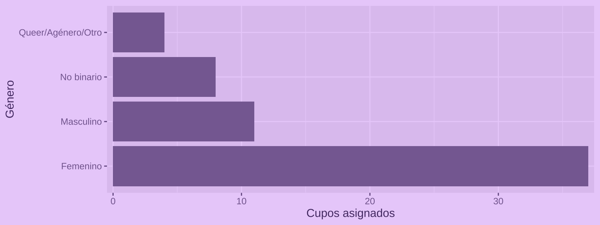



La [convocatoria al curso gratuito de introducción a R](../../../blog/curso_gratis_r_intro_1/) fue un éxito! **Más de 500 personas** postularon para poder aprender.

Lamentablemente no podían participar las 500 personas, así que decidí por hacer una selección aleatoria de participantes, dónde según sus características tendrían mayores o menores probabilidades de obtener un cupo.



## Selección

### ¿Por qué asignar cupos?

Algunas personas dicen que el **azar es lo más justo** cuando se trata de distribuir recursos limitados. En algunos sentidos es verdad, pero también es cierto que **no todas las personas tienen las mismas capacidades ni oportunidades**, y también que muchas personas enfrentan **barreras culturales, sociales y estructurales** para acceder a ciertos recursos y participar de determinados espacios.

Es por esto que opté por asignar cupos considerando cuotas de género, diversidades y disidencias sexogenéricas, y situación de discapacidad.

El objetivo fue poder dar **mayores oportunidades** a que **personas sistemáticamente excluidas** pueden participar del curso, sin que esto signifique dejar sin oportunidades a otras personas.

### Criterios de probabilidad

Los criterios usados para otorgar las probabilidades de obtener un cupo fueron los siguientes:

| Criterios excluyentes                                         |
|---------------------------------------------------------------|
| Inscripción antes de fecha de cierre (14 de enero a las 9 PM) |
| Inscripción con correo válido                                 |
| Carrera o área de estudio en ciencias sociales o humanidades  |

Luego de aplicar los criterios excluyentes, quedó un total de **521 postulaciones**.

Las probabilidades de selección aumentaron según los siguientes criterios:

|                 Criterio de inclusión | Probabilidades |
|--------------------------------------:|----------------|
| Género femenino, no binario o *queer* | 2              |
|                   Persona transgénero | 3              |
|                       Persona LGBTIQ+ | 2              |
|              Persona con discapacidad | 1              |
|                           Chilenos/as | 1              |

Asimismo, las probabilidades disminuyeron según los siguientes criterios:

|              Criterio de exclusión | Probabilidades |
|-----------------------------------:|----------------|
| Maneja un lenguaje de programación | -1             |
|           Posee conocimientos de R | -1             |

En total postularon **12 personas trans**, por lo que decidí darles un cupo a todxs.

### Selección de cupos

Obviamente utilicé R para hacer la selección 😄

El primer paso fue la limpieza de los datos obtenidos por la [encuesta programada en R con el paquete `{surveydown}`.](../../../blog/surveydown_encuestas/)



``` r
resultados <- data |> 
  # solamente con correo
  filter(!is.na(correo)) |> 
  # excluir pruebas
  filter(nombre != "Bastián Olea") |> 
  # seleccionar columnas
  select(-starts_with("time"), time_end, -session_id, -nivel) |> 
  # convertir fechas
  mutate(time_end = lubridate::as_datetime(time_end)) |> 
  arrange(time_end) |> 
  # limpiar nombres
  mutate(nombre = str_squish(nombre)) |> 
  distinct(nombre, .keep_all = TRUE) |> 
  # filtrar fecha de cierre
  filter(time_end <= lubridate::ymd_hms("2026-01-14 20:59:59")) |> 
  # limpiar respuestas
  mutate(across(where(is.character), ~case_match(.x, "sí" ~ "sí", .default = .x)))
```



De acuerdo a los criterios, cada persona obtuvo un **puntaje**, a partir del cual las personas postulantes fueron ordenadas en un ranking.



``` r
resultados_p <- resultados |> 
  mutate(puntaje = 2) |> 
  # sumar puntos a grupos de interés
  mutate(puntaje = if_else(trans == "sí", puntaje + 3, puntaje),
         puntaje = if_else(lgbt == "sí" | is.na(lgbt), puntaje + 2, puntaje),
         puntaje = if_else(genero %in% c("femenino", "no_binario", "queer_ag_nero_otro"), puntaje + 2, puntaje),
         puntaje = if_else(pais == "chile", puntaje + 1, puntaje),
         puntaje = if_else(disca != "no", puntaje + 1, puntaje)) |> 
  # penalizar grupos
  mutate(puntaje = if_else(nivel_programacion == "sí", puntaje - 1, puntaje),
         puntaje = if_else(nivel_r %in% c("intermedio", "avanzado"), puntaje - 1, puntaje)) |> 
  # criterios excluyentes   
  filter(!str_detect(areas, "otra_que_no_es_de_ciencias_sociales_o_humanidades")) |> 
  # crear ranking de postulantes
  arrange(desc(puntaje)) |> 
  mutate(id = row_number())
```



Luego, se usó la función `sample()` para seleccionar **45 cupos aleatorios**, pero ponderando las probabilidades de cada persona según su puntaje:

``` r
# selección aleatoria con probabilidad
seleccion <- sample(resultados$id, 
                    size = 45, 
                    prob = resultados$id$puntaje,
                    replace = FALSE)
```

## Resultados

De un total de 521 postulaciones, 60 personas obtuvieron un cupo.

De las 60 personas, 37 son mujeres, y 8 son no binarias.



12 personas trans obtuvieron cupo.


Finalmente, 27 personas son de Chile, 16 de México, y 17 de otros países de latinoamérica.


💜 Gracias a todxs por su interés! En sus correos tendrán la confirmación del cupo, y cerca del día de inicio del curso recibirán el enlace de conexión.


