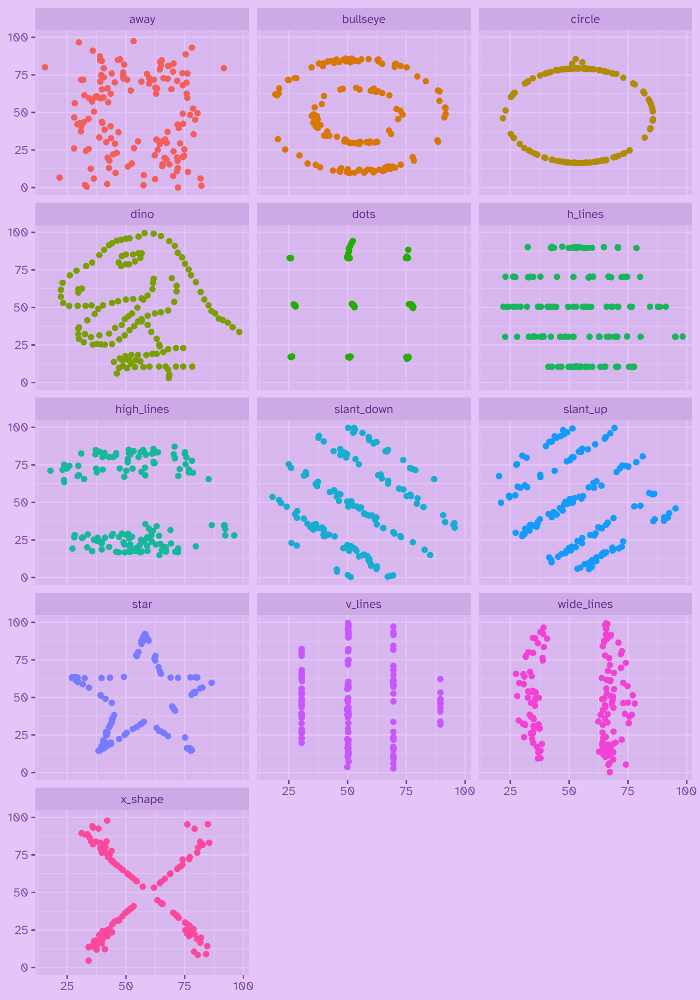

Uno de los primeros pasos al trabajar con datos es explorarlos, y si bien existen [herramientas estadísticas para resumir datos y obtener medidas que los describan](../../../blog/estadisticos_descriptivos/), debemos recordar que **visualizar los datos es igual de importante que obtener sus estadísticas descriptivas** 🤯

Veamos un ejemplo clásico de ésto: el [cuarteto de Anscombe](https://es.wikipedia.org/wiki/Cuarteto_de_Anscombe). Este conjunto de datos, creado por Francis John Anscombe en 1973, está compuesto por cuatro grupos distintos, con **las mismas estadísticas descriptivas** (media, varianza, correlación y regresión lineal), pero que **al visualizarlos revelan distribuciones muy diferentes**!

El cuarteto de Anscombe viene por defecto en R:

``` r
datasets::anscombe
```

       x1 x2 x3 x4    y1   y2    y3    y4
    1  10 10 10  8  8.04 9.14  7.46  6.58
    2   8  8  8  8  6.95 8.14  6.77  5.76
    3  13 13 13  8  7.58 8.74 12.74  7.71
    4   9  9  9  8  8.81 8.77  7.11  8.84
    5  11 11 11  8  8.33 9.26  7.81  8.47
    6  14 14 14  8  9.96 8.10  8.84  7.04
    7   6  6  6  8  7.24 6.13  6.08  5.25
    8   4  4  4 19  4.26 3.10  5.39 12.50
    9  12 12 12  8 10.84 9.13  8.15  5.56
    10  7  7  7  8  4.82 7.26  6.42  7.91
    11  5  5  5  8  5.68 4.74  5.73  6.89

Vemos que hay 8 columnas, aparentemente en dos pares de 4 columnas: las que corresponden al *eje x* de cada grupo, y las del *eje y*.

Si encuentras que los datos están **desordenados**, es porque sí, vienen desordenados 😒

## Limpiar datos

Los datos tienen un problema común: las columnas contienen en sus nombres información que deberían ser datos (la variable y el grupo al que pertenece). Esto se ven en que, por ejemplo, la columna `x1` te dice dos cosas a la vez: que la variable se llama `x`, y que pertenece al grupo `1` 🙄

Ordenemos un poco estos datos [llevándolos al **formato largo,**](../../../blog/r_introduccion/tidyr_pivotar/) para hacer que cada fila represente una observación individual, y que cada columna presente una sola cosa a la vez:

``` r
library(dplyr)
library(tidyr)

anscombe_largo <- anscombe |> 
  pivot_longer(cols = everything(),
               names_to = "grupo",
               values_to = "valor") |> 
  separate(grupo, sep = 1, into = c("variable", "grupo"))

anscombe_largo
```

    # A tibble: 88 × 3
       variable grupo valor
       <chr>    <chr> <dbl>
     1 x        1     10   
     2 x        2     10   
     3 x        3     10   
     4 x        4      8   
     5 y        1      8.04
     6 y        2      9.14
     7 y        3      7.46
     8 y        4      6.58
     9 x        1      8   
    10 x        2      8   
    # ℹ 78 more rows

Usamos `pivot_longer()` para *pivotar* los datos y hacer que todas las cifras estén en una sola columna, y los nombres de todas las columnas en otra. Luego usamos `separate()` para separar la columna `grupo` en dos: una con la `variable`, y otra con el `grupo`. Mucho mejor! ☺️

{{< info "Si quieres aprender en detalle cómo **transformar datos** para cambiarlos dal formato largo o anch, revisa este tutorial sobre [pivotar datos con `{tidyr}`](/blog/r_introduccion/tidyr_pivotar/)." >}}

## Calcular estadísticos descriptivos

Con los datos ordenados, tenemos todas las cifras en una sola columna. Ahora podemos calcular sus **estadísticos descriptivos**.



Para [calcular resúmenes de datos](../../../blog/r_introduccion/dplyr_summarize/) usamos la función `summarize()`. Ella nos permite calcular, por ejemplo, un promedio de todas las observaciones. Pero como los datos vienen en grupos, agrupamos primero con `group_by()`:

``` r
estadisticos <- anscombe_largo |> 
  group_by(grupo) |> 
  summarize(promedio = mean(valor),
            mediana = median(valor),
            varianza = var(valor))
```

| grupo | promedio | mediana | varianza |
|:------|---------:|--------:|---------:|
| 1     | 8.250455 |   8.020 | 7.792033 |
| 2     | 8.250455 |   8.440 | 7.792205 |
| 3     | 8.250000 |   7.635 | 7.790533 |
| 4     | 8.250455 |   8.000 | 7.790119 |

Al calcular algunos estadísticos descriptivos (**promedio**, **mediana** y **varianza**) confirmamos que los cuatro grupos del cuarteto tienen cifras casi idénticas!

{{< info "Si quieres aprender a usar `summarize()`, revisa este tutorial sobre [resúmenes de datos con `{dplyr}`](/blog/r_introduccion/dplyr_summarize/)." >}}

## Visualizar los datos

Para comparar los grupos del cuarteto de Anscombe, queremos graficar un [gráfico de dispersión](../../../blog/r_introduccion/tutorial_visualizacion_ggplot/#dispersión-1), y para eso necesitamos tener los valores del *eje x* e *y* en columnas distintas. Actualmente están en una sola columna (`valor`), y se distinguen por el valor de la columna `variable`, así que podemos [usar `pivot_wider()` para volver a pivotar los datos hacia el **formato ancho**](../../../blog/r_introduccion/tidyr_pivotar/#desde-largo-hacia-ancho), y pasar de una columna descrita por otra, a dos columnas con nombres distintos:

``` r
# crear identificación única de cada valor del conjunto
anscombe_ids <- anscombe_largo |> 
  group_by(grupo, variable) |>
  mutate(id = row_number()) |> 
  ungroup()

# pivotar los valores hacia el ancho, creando dos columnas según `variable`
anscombe_ancho <- anscombe_ids |> 
  pivot_wider(names_from = variable, values_from = valor) |> 
  arrange(grupo, id) |> # ordenar
  select(-id) # sacar variable id

anscombe_ancho
```

    # A tibble: 44 × 3
       grupo     x     y
       <chr> <dbl> <dbl>
     1 1        10  8.04
     2 1         8  6.95
     3 1        13  7.58
     4 1         9  8.81
     5 1        11  8.33
     6 1        14  9.96
     7 1         6  7.24
     8 1         4  4.26
     9 1        12 10.8 
    10 1         7  4.82
    # ℹ 34 more rows

Ahora los datos están en un formato mucho más simple e intuitivo: cada fila es una observación, separadas por la variable `grupo`, cuyos valores están en las columnas `x` e `y`.

Para visualizar los datos cargamos `{ggplot2}`:

``` r
library(ggplot2)
```

Antes definimos algunas cositas para que el gráfico se vea bonito:



Vamos a [configurar una tipografía para el gráfico](../../../blog/ggplot_tipografias/), y vamos a [cambiar los colores del gráfico](../../../blog/ggplot_temas/).

``` r
library(showtext)

# descargar una tipografía desde google fonts
font_add_google(name = "Atkinson Hyperlegible")
showtext_auto()
showtext_opts(dpi = 200)

# aplicar tema de colores
theme_set(
  theme_grey(paper = "#EAD2FA",
             ink = "#6E3A98",
             accent = "#9069C0",
             base_family = "Atkinson Hyperlegible")
)
```


{{< info "Para aprender a crear gráficos con `{ggplot2}`, revisa este tutorial introductorio a la [visualización de datos](/blog/r_introduccion/tutorial_visualizacion_ggplot/)." >}}

Al graficar los datos de cada grupo, podemos ver que las distribuciones son muy diferentes entre sí, a pesar de tener estadísticas descriptivas similares.

``` r
anscombe_ancho |> 
  ggplot() +
  aes(x, y) +
  # línea de regresión
  geom_smooth(method = "lm", se = FALSE, 
              fullrange = T, 
              color = alpha("#9069C0", 0.6)) +
  # puntitos   
  geom_point(size = 2.5, 
             alpha = 0.8) +
  # separar grupos en gráficos distintos
  facet_wrap(~grupo,
             labeller = as_labeller(~glue::glue("Grupo {.x}"))) +
  # textos
  labs(title = "Cuarteto de Anscombe",
       subtitle = "Conjuntos de datos con mismas estadísticas pero distintas distribuciones") +
  # título en negrita
  theme(plot.title = element_text(size = 14, face = "bold"))
```


Si nos hubiéramos quedado con las estadísticas descriptivas, habríamos pasado por alto las diferencias entre los grupos! *Moraleja:* siempre hacer gráficos exploratorios para comprender con qué estamos trabajando 🤓☝🏼

------------------------------------------------------------------------

## Bonus: *¿datasaurio?*

El *datasaurio* aparece en [el paquete `{datasauRus}`](https://jumpingrivers.github.io/datasauRus/articles/Datasaurus.html)\_ y es un conjunto de datos que demuestra el mismo principio, pero de forma más extrema: cada uno de los 13 conjuntos tiene las mismas estadísticas descriptivas, pero visualmente son todas distintas, y uno de ellos **tiene forma de dinosaurio!** 🦖

``` r
install.packages("datasauRus")
```

``` r
library(dplyr)
library(datasauRus)

datasaurus_dozen |> 
  group_by(dataset) |> 
  summarize(
    mean_x    = mean(x),
    mean_y    = mean(y),
    std_dev_x = sd(x),
    std_dev_y = sd(y),
    corr_x_y  = cor(x, y)
  )
```

    # A tibble: 13 × 6
       dataset    mean_x mean_y std_dev_x std_dev_y corr_x_y
       <chr>       <dbl>  <dbl>     <dbl>     <dbl>    <dbl>
     1 away         54.3   47.8      16.8      26.9  -0.0641
     2 bullseye     54.3   47.8      16.8      26.9  -0.0686
     3 circle       54.3   47.8      16.8      26.9  -0.0683
     4 dino         54.3   47.8      16.8      26.9  -0.0645
     5 dots         54.3   47.8      16.8      26.9  -0.0603
     6 h_lines      54.3   47.8      16.8      26.9  -0.0617
     7 high_lines   54.3   47.8      16.8      26.9  -0.0685
     8 slant_down   54.3   47.8      16.8      26.9  -0.0690
     9 slant_up     54.3   47.8      16.8      26.9  -0.0686
    10 star         54.3   47.8      16.8      26.9  -0.0630
    11 v_lines      54.3   47.8      16.8      26.9  -0.0694
    12 wide_lines   54.3   47.8      16.8      26.9  -0.0666
    13 x_shape      54.3   47.8      16.8      26.9  -0.0656

``` r
datasaurus_dozen |> 
  ggplot() +
  aes(x = x, y = y, colour = dataset) +
  geom_point() +
  # theme_void() +
  theme(legend.position = "none") +
  facet_wrap(~dataset, ncol = 3) +
  theme(axis.title = element_blank())
```



*¡Plop!*



