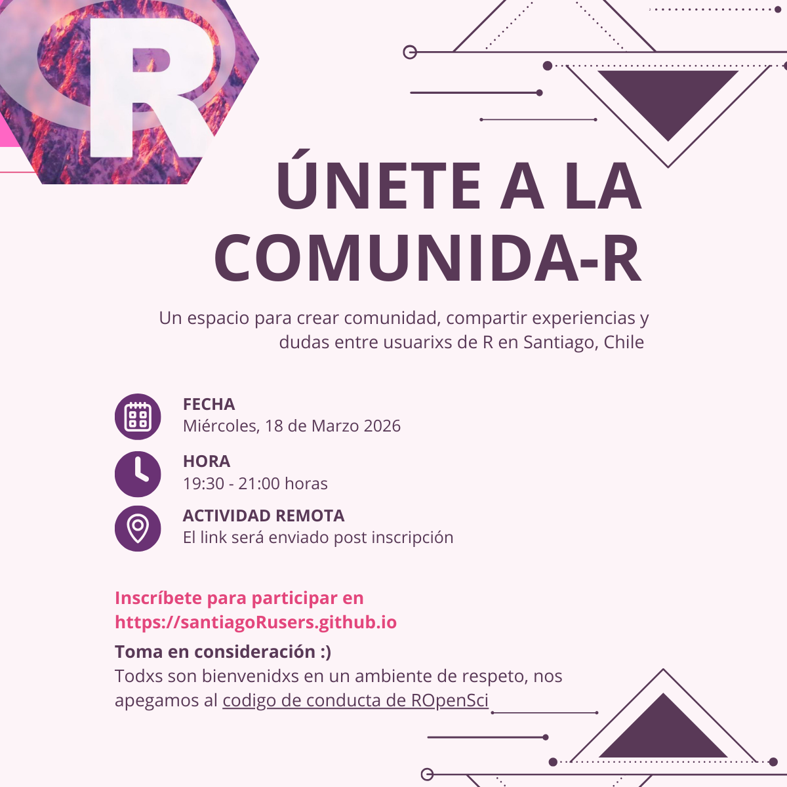

Hace tiempo que estamos coordinando un espacio de colaboración entre **usuari@s de R en Chile**, y pronto verá la luz!

La próxima semana tendremos la **primera reunión del grupo de usuari@s de R de Santiago, Chile.** La idea es crear un espacio de **aprendizaje y apoyo** entre personas que usan R en el país, para **compartir lo que hacemos**, aprender de lo que hacen otras personas, y apoyarnos en conjunto.

Entre otras actividades, habrá espacio para mostrar lo que hayas desarrollado: visualizaciones de datos, investigaciones, aplicaciones, estudios, lo que sea! 

La idea es saber qué hacemos con R y así apoyarnos y seguir aprendiendo 💜



