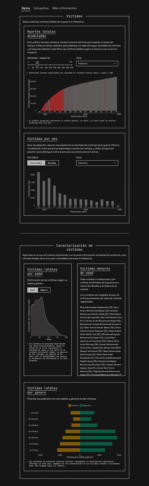
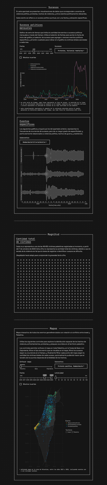

[Visualizador de datos](https://bastianoleah.shinyapps.io/palestina) que busca reflejar el horror de la guerra y el exterminio que se están llevando a cabo en el territorio de Palestina por obra del estado de Israel y sus aliados. Los datos provienen de [Palestine Datasets](https://data.techforpalestine.org/) y de [Armed Conflict Location & Event Data](https://acleddata.com/), organizaciones que están documentando datos sobre identificación de víctimas y registro de sucesos de relevancia política en la región.

[Accede al visualizador de datos por este enlace.](https://bastianoleah.shinyapps.io/palestina)

----

Desarrollé un nuevo visualizador de datos sobre un tema que puede ser polémico para algunas personas. Sé que compartir este tipo de cosas me hace aún menos empleable, y me puede hacer perder oportunidades laborales. Pero fue un ejercicio de contemplación y respeto a las víctimas de un conflicto de características colonialistas y genocidas.

Se trata de un trabajo sencillo de visualización de datos a partir de dos fuentes de información, desarrollado completamente en el lenguaje R. 

El desarrollo tuvo un foco en la personalización de la apariencia de la aplicación usando CSS mediante funciones de R, para darle esa apariencia de interfaz gráfica militar vintage. De hecho, desarrollé primero la interfaz completa, con uno de cada uno de los elementos de prueba, para darles un estilo homogéneo, y solo después fui creando la aplicación real con esos bloques de la interfaz estilizada. Nunca había empezado a desarrollar algo por lo visual, antes de tener los datos procesados, y aprendí que se puede.

Otro detalle que me gustó implementar, y que me gustaría hacer en su propia sección o app, es la de los nombres de víctimas que aparecen secuencialmente (es tan sólo un loop donde cada nombre tiene un retardo mayor que el anterior para su animación de entrada). En general no me gusta el uso de animaciones, porque implementar una animación te va llevando a tener que implementar animaciones en todo, pero en este caso daba un ritmo solemne a datos sensibles.

Trabajar con datos sensibles siempre tiene un peso, en mi experiencia. Me cuesta digerir lo que veo, y me pesa el corazón. Varias veces tan sólo dictar los textos de la app me hizo nudos en la garganta. Pero creo que es importante intentar visibilizar estos temas, en memoria de las víctimas, y como un granito de arena. 

----

----

## Fuentes
- Palestine Datasets: https://data.techforpalestine.org/docs/killed-in-gaza/
- Armed Conflict Location & Event Data (ACLED): https://acleddata.com/israel-palestine/