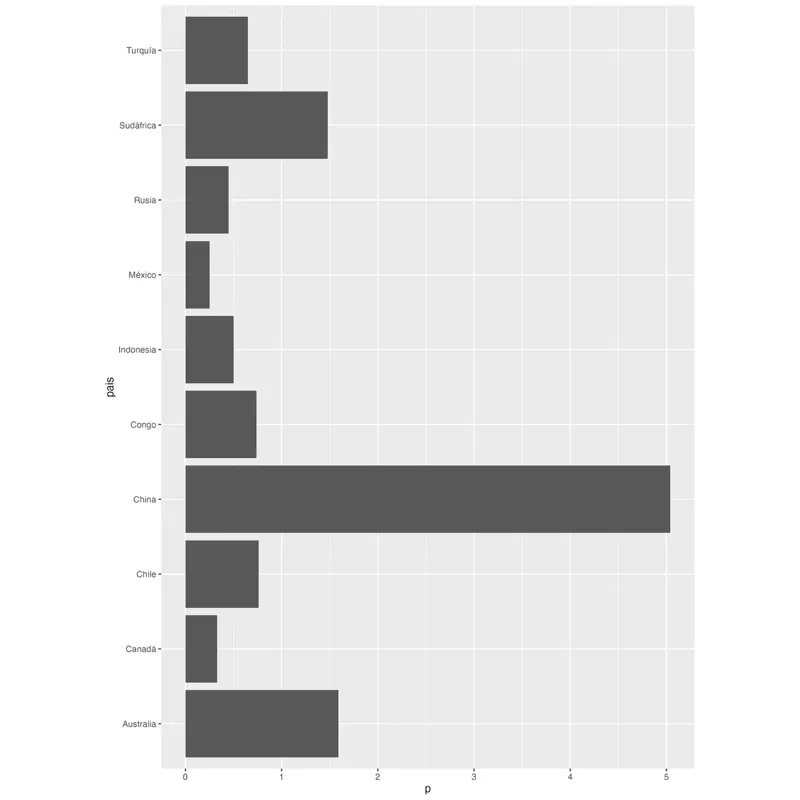
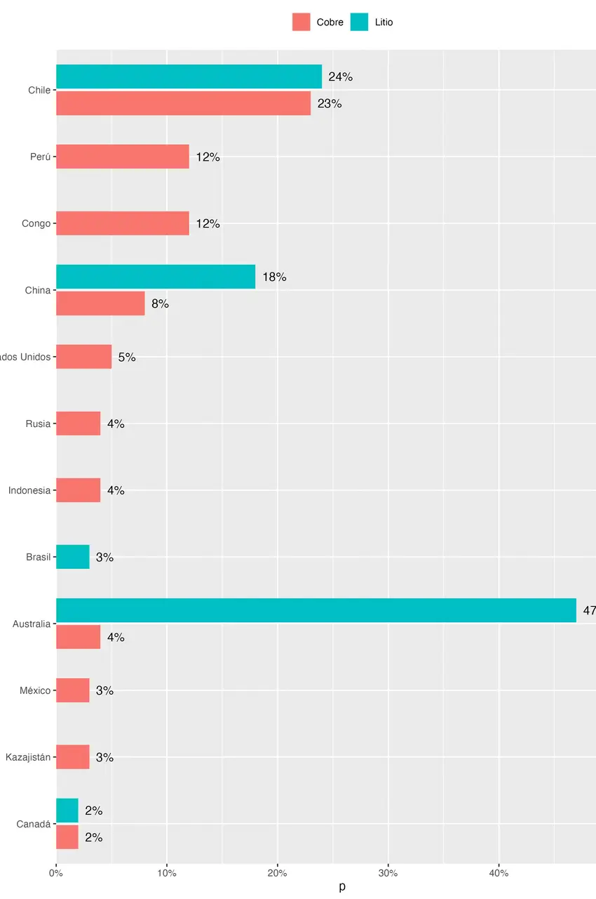

El [paquete de R {camcorder}](https://github.com/thebioengineer/camcorder) te permite ir registrando todos los gráficos que hagas durante una sesión, y al final te entrega una animación que contiene el paso a paso de tu proceso de visualización de datos, desde el gráfico de {ggplot2} inicial hasta el producto final.



Solo tienes que instalarlo y activarlo para que todos los gráficos que generes vayan siendo registrados automáticamente:

```r
# instalar
install.packages("camcorder")

library(camcorder)

# empeazr grabar gráficos
gg_record(
  dir = "gráficos/grabacion",
  device = "jpeg",
  1200, 1800, scale = 1.2, units = "px",
  dpi = 300
)
```

Al iniciar la grabación, hay que especificar las dimensiones del gráfico. Todos los gráficos que generes desde ese momento tendrán esas dimensiones, independiente de el tamaño de tu panel de gráficos en RStudio. Esto es muy útil, porque al especificar las dimensiones de tu gráfico de antemano, te permite adecuar el diseño de tus visualizaciones a su tamaño y escala desde el primer momento, en vez de tener que ajustar todos los tamaños en el momento final de exportar el gráfico (esto también es posible de hacer [con el paquete {ggview}!](https://github.com/idmn/ggview)).

Los gráficos van a ir guardándose como imagen en la carpeta que especificaste, con un nombre de archivo secuencial.


Si en algún momento necesitas cambiar las dimensiones de tu gráfico, puedes usar la función `gg_resize_film()`, por ejemplo, si la forma que está tomando tu gráfico se beneficia más de un lienzo más largo o ancho. También, si necesitas pausar la grabación, puedes usar `gg_stop_recording()` para que los gráficos dejen de guardarse, y luego resumirla de la misma forma en que la iniciaste.

Cuando termines de hacer tu visualización, usa la función `gg_playback()` para convertir todas las imágenes en una animación!

```r
# crear video
gg_playback(
  last_as_first = FALSE,
  first_image_duration = 1,
  background = "white",
  image_resize = 1280,
  playback = FALSE
  )
```

Los resultados son muy entretenidos! Me gustó poder plasmar estos procesos detallistas en una animación que expresa parte de las dificultades (y lo entretenido) de hacer gráficos.



Gracias a [Nicola Rennie por el post que me hizo conocer](https://nrennie.rbind.io/blog/another-year-of-tidytuesday/) este interesante paquete 🥰


----

### Bonus

Al generarse las animaciones en formato `gif`, quise convertirlas a un formato más moderno (y eficiente) como `.webp`, así que usé `ffmpeg`. Pero también me di cuenta que tenía que recortar algunos videos (porque el gráfico final quedaba con bordes en blanco, debido a la proporción de aspecto de los primeros gráficos era más alta o ancha que el del final), y achicar otros para que fueran mas livianos, así que dejo los comandos que usé para convertir `gif` a `webp` recortando y achicando:

```sh
# achicar video
ffmpeg -f gif -i "2025_01_11_01_24_41.gif" -c libwebp -vf scale=800:-1 -loop 0 camcorder1.webp

# recortar video
ffmpeg -f gif -i "2025_01_11_01_21_05.gif" -c libwebp -vf crop=850:1280 -loop 0 camcorder3.webp

ffmpeg -f gif -i "2025_01_11_01_22_24.gif" -c libwebp -vf crop=1280:1134 -loop 0 camcorder2.webp

# recortar y luego achicar:
ffmpeg -f gif -i "2025_01_11_01_22_24.gif" -c libwebp -vf "crop=1280:1134,scale=800:-1" -loop 0 camcorder2b.webp
```