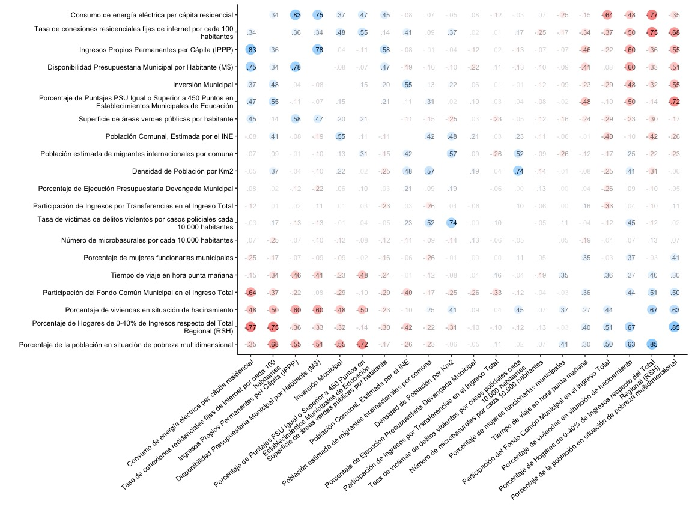
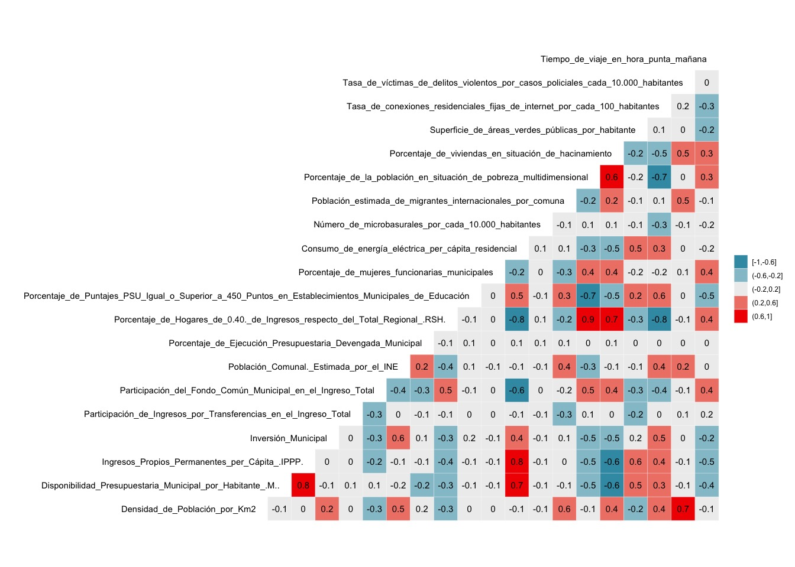
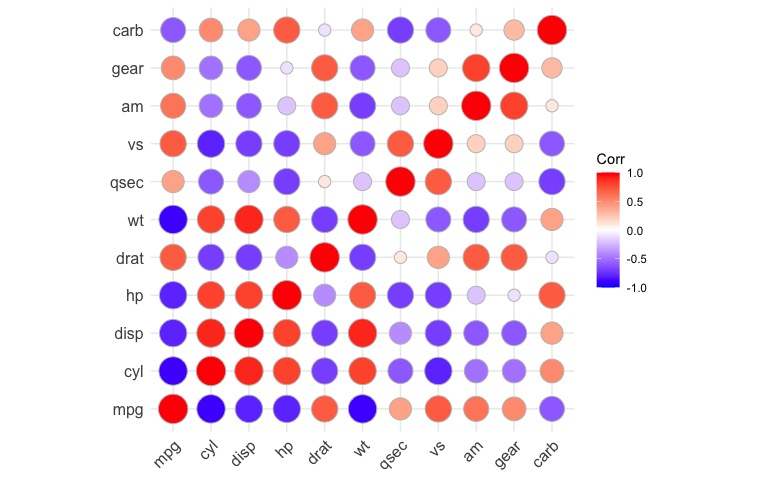
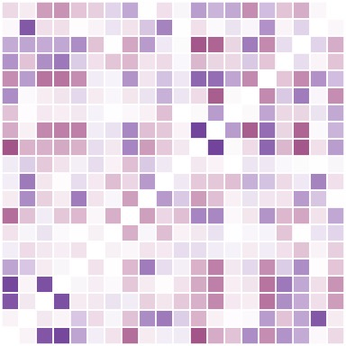

El análisis de correlación es una técnica estadística que nos permite **identificar si existen relaciones lineales entre distintas variables.**

Lo que hace una correlación es indicarnos si dos variables tienen una relación entre sí, en el sentido de que el aumento o disminución de una de las variables ocurra en concordancia con la otra variable, ya sea una **correlación positiva** (si una variable aumenta, la otra también) o **correlación negativa** (si una variable aumenta, la otra disminuye).

Un ejemplo de correlación positiva sería: mientras más solcito, más calor. Una correlación negativa sería: a mayor frío, menos ganas de levantarse 😴

En R podemos realizar análisis de correlación en conjuntos de datos enteros, y de este modo podemos encontrar todas las correlaciones que existen entre las variables de los datos. Esto se lograría tomando todas las variables y cruzándolas todas con todas, para luego identificar cuáles se correlacionan, en qué dirección y con qué intensidad.

## Cargar datos

Para hacer más interesante el tutorial, vamos a cargar dos conjuntos de datos sociales, obtenidos de mi [repositorio de datos sociales públicos](https://bastianolea.github.io/datos_sociales/).

En esta oportunidad cargaremos un conjunto de datos del [Sistema de Información Municipal (Sinim)](https://github.com/bastianolea/sinim_info_municipal), que es una base de datos sobre los municipios chilenos mantenida anualmente por la [Subsecretaría de Desarrollo Regional y Administrativo (Subdere)](https://datos.sinim.gov.cl), y el conjunto de datos del [Sistema de Indicadores y Estándares de Desarrollo Urbano](https://github.com/bastianolea/siedu_indicadores_urbanos/), conjunto desarrollado por el [Instituto Nacional de Estadísticas de Chile](https://www.ine.gob.cl/herramientas/portal-de-mapas/siedu) que agrupa estadísticas Sobre medio ambiente, planificación de ciudades, desarrollo sostenible, acceso a servicios básicos, y movilidad.

Gracias al [repositorio de datos sociales](https://bastianolea.github.io/datos_sociales/), tenemos enlaces directos a conjuntos de datos sociales listos para usar, y cargarlos a tu sesión de R es tan fácil como cargar el dato directamente desde internet:

``` r
library(arrow)

# cargar datos sinim
sinim <- arrow::read_parquet("https://github.com/bastianolea/sinim_datos_comunales/raw/main/datos/sinim_2019-2023.parquet")

# cargar datos de siedu
siedu <- arrow::read_parquet("https://github.com/bastianolea/siedu_indicadores_urbanos/raw/main/datos/siedu_indicadores_desarrollo_urbano.parquet")
```

## Limpieza de datos

Antes que nada, vamos a cargar `{dplyr}` para el manejo y la limpieza de los datos.

``` r
library(dplyr)
```

Echémosle un vistazo a los datos con `glimpse()`:

``` r
glimpse(sinim)
```

    Rows: 842,510
    Columns: 11
    $ municipio     <chr> "IQUIQUE", "ALTO HOSPICIO", "POZO ALMONTE", "CAMIÑA", "C…
    $ cut_comuna    <chr> "01101", "01107", "01401", "01402", "01403", "01404", "0…
    $ año_id        <int> 20, 20, 20, 20, 20, 20, 20, 20, 20, 20, 20, 20, 20, 20, …
    $ año           <int> 2019, 2019, 2019, 2019, 2019, 2019, 2019, 2019, 2019, 20…
    $ variable_id   <chr> "879", "879", "879", "879", "879", "879", "879", "879", …
    $ variable      <chr> "Ingresos Propios Permanentes (IPP)", "Ingresos Propios …
    $ variable_desc <chr> "Indicador Bep Ingresos (variable sistema antiguo)", "In…
    $ area          <chr> "01.  ADMINISTRACION Y FINANZAS MUNICIPALES", "01.  ADMI…
    $ subarea       <chr> "A. INGRESOS MUNICIPALES (M$)", "A. INGRESOS MUNICIPALES…
    $ unidad        <chr> "M$", "M$", "M$", "M$", "M$", "M$", "M$", "M$", "M$", "M…
    $ valor         <dbl> 34745945, 4107522, 3776040, 108439, 160661, 1067476, 333…

``` r
glimpse(siedu)
```

    Rows: 6,701
    Columns: 8
    $ comuna     <chr> "ALTO HOSPICIO", "ALTO HOSPICIO", "ALTO HOSPICIO", "ALTO HO…
    $ cut_comuna <chr> "1107", "1107", "1107", "1107", "1107", "1107", "1107", "11…
    $ id         <chr> "BPU_8", "BPU_17", "EA_34", "EA_22a", "EA_22", "EA_33a", "B…
    $ año        <dbl> 2018, 2019, 2019, 2021, 2021, 2022, 2018, 2018, 2018, 2018,…
    $ variable   <chr> "Cantidad de jornadas diarias completas de trabajo de médic…
    $ valor      <dbl> 32.750000, 0.580000, 1.220618, 168.223082, 484.296058, 44.9…
    $ medida     <chr> "Jornadas diarias / 10.000 habs", "Relación (Número de lumi…
    $ estandar   <chr> "Sin estándar", "Sin estándar", "Hasta 1 kilogramo / habita…

Notamos que ambos conjuntos de datos vienen en el [formato *largo*](https://r4ds.had.co.nz/tidy-data.html#longer), dónde tenemos una columna con los nombres de las variables o indicadores, y otra columna con los valores correspondientes. Así tenemos una tabla con menor cantidad de columnas,
donde cada fila es una observación que corresponde a una comuna del país, en un año específico, para una de las variables del conjunto de datos, con su valor correspondiente.

Haremos tres cosas con los datos:

1.  Primero haremos una selección de variables interesantes de cada conjunto de datos.
2.  Luego, como ambos conjuntos de datos poseen mediciones de distintos años en cada una de sus indicadores o estadísticos, realizaremos una agrupación por comuna y variable para dejar las mediciones más recientes en cada indicador y en cada comuna.
3.  Finalmente, dejaremos sólo las columnas que nos interesan

``` r
# filtrar variables
sinim_2 <- sinim |> 
  filter(variable %in% c("Ingresos Propios Permanentes per Cápita (IPPP)",
                         "Disponibilidad Presupuestaria Municipal por Habitante (M$)",
                         "Inversión Municipal",
                         "Participación del Fondo Común Municipal en el Ingreso Total",
                         "Participación de Ingresos por Transferencias en el Ingreso Total",
                         "Porcentaje de Ejecución Presupuestaria Devengada Municipal",
                         "Porcentaje de Puntajes PSU Igual o Superior a 450 Puntos en Establecimientos Municipales de Educación",
                         "Metros Cuadrados (M2) de Areas Verdes con Mantenimiento por Habitante",
                         "Porcentaje de mujeres funcionarias municipales",
                         "Densidad de Población por Km2",
                         "Población Comunal, Estimada por el INE",
                         "Porcentaje de Hogares de 0-40% de Ingresos respecto del Total Regional (RSH)"))

# dejar sólo la medición más reciente de cada variable en cada comuna
sinim_3 <- sinim_2 |> 
  group_by(cut_comuna, variable) |> 
  slice_max(año) |> 
  ungroup()
  
# seleccionar columnas
sinim_4 <- sinim_3 |> 
  select(cut_comuna, variable, valor)
```

``` r
# filtrar variables
siedu_2 <- siedu |> 
  filter(variable %in% c(
    "Consumo de energía eléctrica per cápita residencial",
    "Tiempo de viaje en hora punta mañana",
    "Superficie de áreas verdes públicas por habitante",
    "Número de microbasurales por cada 10.000 habitantes",
    "Población estimada de migrantes internacionales por comuna",
    "Porcentaje de la población en situación de pobreza multidimensional",
    "Porcentaje de viviendas en situación de hacinamiento",
    "Tasa de víctimas de delitos violentos por casos policiales cada 10.000 habitantes",
    "Tasa de conexiones residenciales fijas de internet por cada 100 habitantes"))

# dejar sólo la medición más reciente de cada variable en cada comuna
siedu_3 <- siedu_2 |> 
  group_by(cut_comuna, variable) |> 
  slice_max(año) |> 
  ungroup()

# seleccionar columnas
siedu_4 <- siedu_3 |> 
  select(cut_comuna, variable, valor)
```

Veamos cómo van quedando los datos:

``` r
sinim_4
```

    # A tibble: 3,806 × 3
       cut_comuna variable                                                     valor
       <chr>      <chr>                                                        <dbl>
     1 01101      Densidad de Población por Km2                               1.02e2
     2 01101      Disponibilidad Presupuestaria Municipal por Habitante (M$)  4.27e2
     3 01101      Ingresos Propios Permanentes per Cápita (IPPP)              1.92e2
     4 01101      Inversión Municipal                                         2.57e6
     5 01101      Participación de Ingresos por Transferencias en el Ingreso… 4.38e1
     6 01101      Participación del Fondo Común Municipal en el Ingreso Total 6.4 e0
     7 01101      Población Comunal, Estimada por el INE                      2.31e5
     8 01101      Porcentaje de Ejecución Presupuestaria Devengada Municipal  7.58e1
     9 01101      Porcentaje de Hogares de 0-40% de Ingresos respecto del To… 4.44e1
    10 01101      Porcentaje de Puntajes PSU Igual o Superior a 450 Puntos e… 7.61e1
    # ℹ 3,796 more rows

``` r
siedu_4
```

    # A tibble: 891 × 3
       cut_comuna variable                                                     valor
       <chr>      <chr>                                                        <dbl>
     1 10101      Consumo de energía eléctrica per cápita residencial        8.91e+2
     2 10101      Número de microbasurales por cada 10.000 habitantes        1.5 e-1
     3 10101      Población estimada de migrantes internacionales por comuna 1.27e+4
     4 10101      Porcentaje de la población en situación de pobreza multid… 2.03e+1
     5 10101      Porcentaje de viviendas en situación de hacinamiento       6.43e+0
     6 10101      Superficie de áreas verdes públicas por habitante          7.92e+0
     7 10101      Tasa de conexiones residenciales fijas de internet por ca… 1.89e+1
     8 10101      Tasa de víctimas de delitos violentos por casos policiale… 7.71e+1
     9 10101      Tiempo de viaje en hora punta mañana                       6   e+1
    10 10109      Consumo de energía eléctrica per cápita residencial        1.37e+3
    # ℹ 881 more rows

### Unir datos

Vamos a combinar estos dos conjuntos de datos para tener una mezcla de variables de temas socioeconómicos que sería interesante correlacionar. Como hicimos que ambos conjuntos de datos estén ordenados bajo la misma lógica, para unirlos sólo necesitamos agregar las filas de un conjunto al otro.

``` r
datos <- bind_rows(sinim_4, siedu_4)
```

Ahora que los datos están unidos, contamos con 20 variables para correlacionar.

``` r
datos |> distinct(variable) |> print(n=Inf)
```

    # A tibble: 20 × 1
       variable                                                                     
       <chr>                                                                        
     1 Densidad de Población por Km2                                                
     2 Disponibilidad Presupuestaria Municipal por Habitante (M$)                   
     3 Ingresos Propios Permanentes per Cápita (IPPP)                               
     4 Inversión Municipal                                                          
     5 Participación de Ingresos por Transferencias en el Ingreso Total             
     6 Participación del Fondo Común Municipal en el Ingreso Total                  
     7 Población Comunal, Estimada por el INE                                       
     8 Porcentaje de Ejecución Presupuestaria Devengada Municipal                   
     9 Porcentaje de Hogares de 0-40% de Ingresos respecto del Total Regional (RSH) 
    10 Porcentaje de Puntajes PSU Igual o Superior a 450 Puntos en Establecimientos…
    11 Porcentaje de mujeres funcionarias municipales                               
    12 Consumo de energía eléctrica per cápita residencial                          
    13 Número de microbasurales por cada 10.000 habitantes                          
    14 Población estimada de migrantes internacionales por comuna                   
    15 Porcentaje de la población en situación de pobreza multidimensional          
    16 Porcentaje de viviendas en situación de hacinamiento                         
    17 Superficie de áreas verdes públicas por habitante                            
    18 Tasa de conexiones residenciales fijas de internet por cada 100 habitantes   
    19 Tasa de víctimas de delitos violentos por casos policiales cada 10.000 habit…
    20 Tiempo de viaje en hora punta mañana                                         

### Pivotar datos a ancho

El último paso antes del análisis de correlación es [pivotar la estructura de los datos al formato ancho.](https://r4ds.hadley.nz/data-tidy.html#widening-data), porque las funciones que realizan correlaciones en R esperan que los datos vengan de esta forma.

Si bien en el formato largo tenemos una columna con el nombre de las variables y otra columna con el valor de cada variable, siendo cada fila una observación, en el **formato ancho** cada columna corresponde a una variable, mientras que cada fila corresponde a una observación.

``` r
library(tidyr)

datos_ancho <- datos |> 
  # pivotar a ancho
  pivot_wider(id_cols = cut_comuna, # columna que identifica las observaciones
              values_from = valor, # columna con los valores
              names_from = variable # columna con los nombres de columna
              )
```

Se consultamos los nombres de las columnas, confirmamos que ahora cada variable se encuentra una columna individual:

``` r
names(datos_ancho)
```

     [1] "cut_comuna"                                                                                           
     [2] "Densidad de Población por Km2"                                                                        
     [3] "Disponibilidad Presupuestaria Municipal por Habitante (M$)"                                           
     [4] "Ingresos Propios Permanentes per Cápita (IPPP)"                                                       
     [5] "Inversión Municipal"                                                                                  
     [6] "Participación de Ingresos por Transferencias en el Ingreso Total"                                     
     [7] "Participación del Fondo Común Municipal en el Ingreso Total"                                          
     [8] "Población Comunal, Estimada por el INE"                                                               
     [9] "Porcentaje de Ejecución Presupuestaria Devengada Municipal"                                           
    [10] "Porcentaje de Hogares de 0-40% de Ingresos respecto del Total Regional (RSH)"                         
    [11] "Porcentaje de Puntajes PSU Igual o Superior a 450 Puntos en Establecimientos Municipales de Educación"
    [12] "Porcentaje de mujeres funcionarias municipales"                                                       
    [13] "Consumo de energía eléctrica per cápita residencial"                                                  
    [14] "Número de microbasurales por cada 10.000 habitantes"                                                  
    [15] "Población estimada de migrantes internacionales por comuna"                                           
    [16] "Porcentaje de la población en situación de pobreza multidimensional"                                  
    [17] "Porcentaje de viviendas en situación de hacinamiento"                                                 
    [18] "Superficie de áreas verdes públicas por habitante"                                                    
    [19] "Tasa de conexiones residenciales fijas de internet por cada 100 habitantes"                           
    [20] "Tasa de víctimas de delitos violentos por casos policiales cada 10.000 habitantes"                    
    [21] "Tiempo de viaje en hora punta mañana"                                                                 

## Correlación

El paquete [`{corrr}`](https://corrr.tidymodels.org), parte del framework [tidymodels](https://www.tidymodels.org), nos facilita realizar una correlación cuyo resultado viene en una tabla ordenada con tan sólo una función: `correlate()`

``` r
library(corrr)

correlación <- datos_ancho |> 
  select(-cut_comuna) |> 
  correlate() 

correlación
```

    # A tibble: 20 × 21
       term                                   Densidad de Població…¹ Disponibilidad Presu…² Ingresos Propios Per…³ `Inversión Municipal` Participación de Ing…⁴ Participación del Fo…⁵ Población Comunal, E…⁶ Porcentaje de Ejecuc…⁷ Porcentaje de Hogare…⁸ Porcentaje de Puntaj…⁹ Porcentaje de mujere…˟ Consumo de energía e…˟ Número de microbasur…˟ Población estimada d…˟ Porcentaje de la pob…˟ Porcentaje de vivien…˟ Superficie de áreas …˟ Tasa de conexiones r…˟ Tasa de víctimas de …˟ Tiempo de viaje en h…˟
       <chr>                                                   <dbl>                  <dbl>                  <dbl>                 <dbl>                  <dbl>                  <dbl>                  <dbl>                  <dbl>                  <dbl>                  <dbl>                  <dbl>                  <dbl>                  <dbl>                  <dbl>                  <dbl>                  <dbl>                  <dbl>                  <dbl>                  <dbl>                  <dbl>
     1 Densidad de Población por Km2                         NA                     -0.0969                -0.0445               0.222                  0.0415                 -0.255                 0.480                  0.192                  -0.311                  0.0238               -0.0105                 -0.0514                -0.143                  0.567                 -0.0601                 0.410                 -0.249                 0.367                  0.740                 -0.0829 
     2 Disponibilidad Presupuestaria Municip…                -0.0969                NA                      0.782               -0.0794                 0.110                   0.0764               -0.190                 -0.217                  -0.327                 -0.0743               -0.0905                  0.748                 -0.0984                -0.102                 -0.512                 -0.605                  0.472                 0.344                 -0.129                 -0.409  
     3 Ingresos Propios Permanentes per Cápi…                -0.0445                 0.782                 NA                    0.0366                 0.0233                 -0.224                -0.0802                -0.117                  -0.359                 -0.106                -0.0711                  0.830                 -0.0682                -0.0125                -0.547                 -0.604                  0.576                 0.359                 -0.134                 -0.457  
     4 Inversión Municipal                                    0.222                 -0.0794                 0.0366              NA                      0.00615                -0.290                 0.555                  0.0647                 -0.317                  0.153                -0.0946                  0.374                 -0.116                  0.134                 -0.547                 -0.482                  0.198                 0.478                 -0.0113                -0.234  
     5 Participación de Ingresos por Transfe…                 0.0415                 0.110                  0.0233               0.00615               NA                      -0.331                 0.0326                -0.0573                 -0.0969                 0.0340                0.00478                -0.119                 -0.0619                -0.265                  0.112                  0.0431                -0.235                 0.00647                0.104                  0.163  
     6 Participación del Fondo Común Municip…                -0.255                  0.0764                -0.224               -0.290                 -0.331                  NA                    -0.400                 -0.263                   0.511                 -0.100                -0.0315                 -0.637                 -0.0353                -0.167                  0.504                  0.443                 -0.295                -0.370                 -0.117                  0.358  
     7 Población Comunal, Estimada por el INE                 0.480                 -0.190                 -0.0802               0.555                  0.0326                 -0.400                NA                      0.213                  -0.416                  0.110                -0.0592                 -0.0802                -0.113                  0.417                 -0.262                 -0.0987                -0.113                 0.413                  0.230                 -0.00621
     8 Porcentaje de Ejecución Presupuestari…                 0.192                 -0.217                 -0.117                0.0647                -0.0573                 -0.263                 0.213                 NA                      -0.0976                 0.0992                0.00160                 0.0778                 0.135                  0.0863                -0.0491                 0.0899                 0.0296                0.0158                 0.00294                0.0366 
     9 Porcentaje de Hogares de 0-40% de Ing…                -0.311                 -0.327                 -0.359               -0.317                 -0.0969                  0.511                -0.416                 -0.0976                 NA                     -0.143                -0.0263                 -0.767                  0.134                 -0.221                  0.852                  0.673                 -0.295                -0.755                 -0.123                  0.402  
    10 Porcentaje de Puntajes PSU Igual o Su…                 0.0238                -0.0743                -0.106                0.153                  0.0340                 -0.100                 0.110                  0.0992                 -0.143                 NA                    -0.0230                  0.474                 -0.0812                 0.314                 -0.718                 -0.500                  0.213                 0.553                  0.0376                -0.484  
    11 Porcentaje de mujeres funcionarias mu…                -0.0105                -0.0905                -0.0711              -0.0946                 0.00478                -0.0315               -0.0592                 0.00160                -0.0263                -0.0230               NA                      -0.248                  0.0473                -0.261                  0.406                  0.365                 -0.158                -0.169                  0.108                  0.351  
    12 Consumo de energía eléctrica per cápi…                -0.0514                 0.748                  0.830                0.374                 -0.119                  -0.637                -0.0802                 0.0778                 -0.767                  0.474                -0.248                  NA                      0.0685                 0.0691                -0.346                 -0.482                  0.450                 0.342                 -0.0319                -0.155  
    13 Número de microbasurales por cada 10.…                -0.143                 -0.0984                -0.0682              -0.116                 -0.0619                 -0.0353               -0.113                  0.135                   0.134                 -0.0812                0.0473                  0.0685                NA                     -0.0890                 0.0742                 0.0720                -0.120                -0.251                 -0.0503                -0.191  
    14 Población estimada de migrantes inter…                 0.567                 -0.102                 -0.0125               0.134                 -0.265                  -0.167                 0.417                  0.0863                 -0.221                  0.314                -0.261                   0.0691                -0.0890                NA                     -0.230                  0.246                 -0.145                 0.0871                 0.523                 -0.119  
    15 Porcentaje de la población en situaci…                -0.0601                -0.512                 -0.547               -0.547                  0.112                   0.504                -0.262                 -0.0491                  0.852                 -0.718                 0.406                  -0.346                  0.0742                -0.230                 NA                      0.628                 -0.169                -0.681                  0.0239                 0.301  
    16 Porcentaje de viviendas en situación …                 0.410                 -0.605                 -0.604               -0.482                  0.0431                  0.443                -0.0987                 0.0899                  0.673                 -0.500                 0.365                  -0.482                  0.0720                 0.246                  0.628                 NA                     -0.235                -0.505                  0.454                  0.266  
    17 Superficie de áreas verdes públicas p…                -0.249                  0.472                  0.576                0.198                 -0.235                  -0.295                -0.113                  0.0296                 -0.295                  0.213                -0.158                   0.450                 -0.120                 -0.145                 -0.169                 -0.235                 NA                     0.135                 -0.0458                -0.241  
    18 Tasa de conexiones residenciales fija…                 0.367                  0.344                  0.359                0.478                  0.00647                -0.370                 0.413                  0.0158                 -0.755                  0.553                -0.169                   0.342                 -0.251                  0.0871                -0.681                 -0.505                  0.135                NA                      0.172                 -0.338  
    19 Tasa de víctimas de delitos violentos…                 0.740                 -0.129                 -0.134               -0.0113                 0.104                  -0.117                 0.230                  0.00294                -0.123                  0.0376                0.108                  -0.0319                -0.0503                 0.523                  0.0239                 0.454                 -0.0458                0.172                 NA                     -0.0366 
    20 Tiempo de viaje en hora punta mañana                  -0.0829                -0.409                 -0.457               -0.234                  0.163                   0.358                -0.00621                0.0366                  0.402                 -0.484                 0.351                  -0.155                 -0.191                 -0.119                  0.301                  0.266                 -0.241                -0.338                 -0.0366                NA      
    # ℹ abbreviated names: ¹​`Densidad de Población por Km2`, ²​`Disponibilidad Presupuestaria Municipal por Habitante (M$)`, ³​`Ingresos Propios Permanentes per Cápita (IPPP)`, ⁴​`Participación de Ingresos por Transferencias en el Ingreso Total`, ⁵​`Participación del Fondo Común Municipal en el Ingreso Total`, ⁶​`Población Comunal, Estimada por el INE`, ⁷​`Porcentaje de Ejecución Presupuestaria Devengada Municipal`, ⁸​`Porcentaje de Hogares de 0-40% de Ingresos respecto del Total Regional (RSH)`,
    #   ⁹​`Porcentaje de Puntajes PSU Igual o Superior a 450 Puntos en Establecimientos Municipales de Educación`, ˟​`Porcentaje de mujeres funcionarias municipales`, ˟​`Consumo de energía eléctrica per cápita residencial`, ˟​`Número de microbasurales por cada 10.000 habitantes`, ˟​`Población estimada de migrantes internacionales por comuna`, ˟​`Porcentaje de la población en situación de pobreza multidimensional`, ˟​`Porcentaje de viviendas en situación de hacinamiento`,
    #   ˟​`Superficie de áreas verdes públicas por habitante`, ˟​`Tasa de conexiones residenciales fijas de internet por cada 100 habitantes`, ˟​`Tasa de víctimas de delitos violentos por casos policiales cada 10.000 habitantes`, ˟​`Tiempo de viaje en hora punta mañana`

En la tabla anterior (muy rudimentaria aún) podemos ver el cruce entre todas las variables. La tabla se lee partiendo por una fila, que representa una de las variables, y cada vez que esta fila se intercepta con una columna, el valor representa el cruce de la variable de la fila con la variable de la columna.

Como estamos cruzando todas con todas las variables, obviamente cada variable también se cruza consigo misma, lo cual resulta en un `NA`.

Como el resultado es muy grande, y la cantidad de columnas muy alta, `{corrr}` ofrece la función `stretch()` para convertir fácilmente el resultado a un formato largo:

``` r
correlación |> stretch()
```

    # A tibble: 400 × 3
       x                             y                                                  r
       <chr>                         <chr>                                          <dbl>
     1 Densidad de Población por Km2 Densidad de Población por Km2                NA     
     2 Densidad de Población por Km2 Disponibilidad Presupuestaria Municipal por… -0.0969
     3 Densidad de Población por Km2 Ingresos Propios Permanentes per Cápita (IP… -0.0445
     4 Densidad de Población por Km2 Inversión Municipal                           0.222 
     5 Densidad de Población por Km2 Participación de Ingresos por Transferencia…  0.0415
     6 Densidad de Población por Km2 Participación del Fondo Común Municipal en … -0.255 
     7 Densidad de Población por Km2 Población Comunal, Estimada por el INE        0.480 
     8 Densidad de Población por Km2 Porcentaje de Ejecución Presupuestaria Deve…  0.192 
     9 Densidad de Población por Km2 Porcentaje de Hogares de 0-40% de Ingresos … -0.311 
    10 Densidad de Población por Km2 Porcentaje de Puntajes PSU Igual o Superior…  0.0238
    # ℹ 390 more rows

Esto nos puede servir para encontrar las correlaciones con una de las variables en particular; por ejemplo, encontrar la correlación de las variables con el tiempo de viaje en hora punta por las mañanas:

``` r
correlación |> 
  stretch() |> 
  filter(x == "Tiempo de viaje en hora punta mañana") |> 
  select(y, r) |> 
  head()
```

    # A tibble: 6 × 2
      y                                                                      r
      <chr>                                                              <dbl>
    1 Densidad de Población por Km2                                    -0.0829
    2 Disponibilidad Presupuestaria Municipal por Habitante (M$)       -0.409 
    3 Ingresos Propios Permanentes per Cápita (IPPP)                   -0.457 
    4 Inversión Municipal                                              -0.234 
    5 Participación de Ingresos por Transferencias en el Ingreso Total  0.163 
    6 Participación del Fondo Común Municipal en el Ingreso Total       0.358 

### Interpretación de correlaciones

La columna `r` nos indica el valor de la correlación de la variable filtrada con todo el resto de las variables.

Como las correlaciones pueden ser positivas o negativas, el valor de la correlación (`r`) puede ser positivo o negativo. Los valores de correlación van del 0 al 1 (o del 0 al -1), donde una correlación igual a 0 significa que no existe correlación, y una correlación igual a 1 significa que la correlación es total. Usualmente, una correlación mayor a 0,3 se considera moderada, y mayor a 0,5 se considera fuerte, pero las interpretaciones De estos valores son múltiples.

Ordenemos las variables por su intensidad de correlación con el tiempo de viaje:

``` r
correlación |> 
  stretch() |> 
  filter(x == "Tiempo de viaje en hora punta mañana") |> 
  select(y, r) |> 
  arrange(desc(abs(r))) |> 
  head()
```

    # A tibble: 6 × 2
      y                                                                                 r
      <chr>                                                                         <dbl>
    1 Porcentaje de Puntajes PSU Igual o Superior a 450 Puntos en Establecimiento… -0.484
    2 Ingresos Propios Permanentes per Cápita (IPPP)                               -0.457
    3 Disponibilidad Presupuestaria Municipal por Habitante (M$)                   -0.409
    4 Porcentaje de Hogares de 0-40% de Ingresos respecto del Total Regional (RSH)  0.402
    5 Participación del Fondo Común Municipal en el Ingreso Total                   0.358
    6 Porcentaje de mujeres funcionarias municipales                                0.351

En las primeras 3 filas podemos ver **correlaciones negativas fuertes**: las comunas del país donde los *tiempos de viaje de viaje en hora punta por la mañana* son mayores, también son comunas donde los *puntajes en la prueba de selección universitaria (PSU)* son menores, y menores son los *recursos municipales por habitante*. Dicho de otro modo, a menores recursos municipales por habitantes, mayor tiempo de viaje en hora punta por la mañana.

En las filas 4 y 5 vemos unas **correlaciones positivas moderadas**: los tiempos de viaje en horario punta por las mañanas también son más altos en las comunas donde existen más *hogares con ingresos bajos* (según el Registro Social de Hogares), y donde los *municipios dependen más del financiamiento del Fondo Común Municipal*.

### Búsqueda de correlaciones

Cómo tenemos todos los valores de correlación en una misma columna gracias a `stretch()`, podemos filtrar los valores para encontrar solamente con relaciones fuertes. Podemos lograr esto filtrando valores mayores a 0,5 o menores a -0,5, o filtrando valores mayores a el valor absoluto de 0,5 (`abs(0.5)`). Luego ordenamos los valores de mayor a menor, usando el valor absoluto de `r` (el valor en positivo).

``` r
correlación |> 
  stretch(remove.dups = T) |> 
  filter(r > 0.5 | r < -0.5) |> 
  arrange(desc(abs(r))) |> 
  head()
```

    # A tibble: 6 × 3
      x                                                                            y                                                                               r
      <chr>                                                                        <chr>                                                                       <dbl>
    1 Porcentaje de Hogares de 0-40% de Ingresos respecto del Total Regional (RSH) Porcentaje de la población en situación de pobreza multidimensional         0.852
    2 Ingresos Propios Permanentes per Cápita (IPPP)                               Consumo de energía eléctrica per cápita residencial                         0.830
    3 Disponibilidad Presupuestaria Municipal por Habitante (M$)                   Ingresos Propios Permanentes per Cápita (IPPP)                              0.782
    4 Porcentaje de Hogares de 0-40% de Ingresos respecto del Total Regional (RSH) Consumo de energía eléctrica per cápita residencial                        -0.767
    5 Porcentaje de Hogares de 0-40% de Ingresos respecto del Total Regional (RSH) Tasa de conexiones residenciales fijas de internet por cada 100 habitantes -0.755
    6 Disponibilidad Presupuestaria Municipal por Habitante (M$)                   Consumo de energía eléctrica per cápita residencial                         0.748

Evidentemente, las correlaciones más fuertes son entre variables similares: los hogares de menores ingresos correlacionan con la población en situación de pobreza, la disponibilidad de presupuesto municipal por habitante se correlaciona con los ingresos municipales percápita, y otras obviedades. Habría que afinar la selección de variables para remover aquellas que representan a un mismo fenómeno social subyacente.

## Visualización

Otra gracia de `{corrr}` es que facilita visualizar las correlaciones por medio de un gráfico con la función `rplot()`, que produce un gráfico `{ggplot2}` con nuestra matriz de correlación.

En teoría, visualizar una correlación sería así de fácil:

``` r
datos |> 
  correlate() |> 
  rplot()
```

Como nuestra matriz de correlación tiene muchas variables, tendremos que agregar algunos ajustes para que se vea bien.

``` r
library(ggplot2)

correlación |> 
  rearrange() |> # ordenar por intensidad
  rplot(print_cor = T, # agregar valores encima
        legend = F) + # sin leyenda
  # cortar los nombres de variable
  scale_y_discrete(labels = scales::label_wrap(70)) +
  scale_x_discrete(labels = scales::label_wrap(70)) +
  # variables inferiores inclinadas
  theme(axis.text.x = element_text(angle = 40, hjust = 1),
        axis.text = element_text(lineheight = 0.9, color = "black"))
```



Con esta visualización, podemos ver el color y el tamaño de los círculos para encontrar rápidamente los cruces entre variables que están correlacionados.

A la rápida, podemos ver que arriba a la izquierda la variable de consumo de energía eléctrica se correlaciona con los recursos municipales, y abajo la izquierda podemos ver qué el porcentaje de hogares en los tramos menores de ingresos se correlaciona con menos conexiones a Internet y menos consumo eléctrico. También al centro del gráfico podemos ver una alta correlación entre la *tasa de víctimas de delitos violentos* y la *densidad poblacional*.

### Alternativa

Otra función de R que permite realizar correlaciones y visualizarlas de inmediato es `ggcor()` del paquete [`{GGally}`](https://ggobi.github.io/ggally/index.html), que entrega varios tipos de gráficos estadísticos para análisis exploratorios de datos.

``` r
datos_ancho |> 
  select(-cut_comuna) |> 
  GGally::ggcorr(hjust = 1, nbreaks = 5, layout.exp = 10,
                 label = TRUE)
```



El resultado es menos atractivo, pero si es bastante más legible.

### Manualmente

Finalmente, y como no podía faltar, también podemos crear un gráfico de la matriz de correlación desde cero con `{ggplot2}`. Esto no es tan complejo gracias a que `correlate()` y `stretch()` entregan los resultados bien ordenaditos.

``` r
datos_ancho |> 
  correlate() |> 
  rearrange() |> 
  stretch() |> 
  # gráfico
  ggplot() +
  aes(x, y, fill = r) +
  geom_tile(color = "white", linewidth = 0.6) + # geometría de cuadros o mosaicos
  geom_text(aes(label = round(r, 1)), color = "black", size = 3) + # texto
  # escala de color de los cuadros
  scale_fill_gradient2(high = "indianred2", mid = "white", low = "skyblue1", na.value = "white") +
  # formato de las escalas de los ejes
  scale_y_discrete(labels = scales::label_wrap(50), expand = c(0, 0)) +
  scale_x_discrete(labels = scales::label_wrap(60), expand = c(0, 0)) +
  # ajustes de tema
  theme_minimal() +
  theme(axis.text = element_text(lineheight = 0.9, color = "black"),
        axis.text.x = element_text(angle = 40, hjust = 1),
        axis.title = element_blank(),
        legend.key.width = unit(2, "mm"))
```



También podemos aprovechar el vuelo para hacer una bonita obra de arte con nuestras correlaciones:

``` r
datos_ancho |> 
  correlate() |> 
  rearrange() |> 
  stretch() |> 
  ggplot() +
  aes(x, y, fill = r) +
  geom_tile(color = "white", linewidth = 0.6) +
  scale_fill_gradient2(high = "#865BAB", mid = "white", low = "#AB5B90", na.value = "white") +
  guides(fill = guide_none()) +
  theme_void() +
  coord_fixed()
```



Como siempre, `{ggplot2}` es una herramienta extremadamente versátil para visualizar cualquier tipo de información. Puedes [aprender a crear visualizaciones de datos desde cero en R siguiendo este tutorial de `{ggplot2}`.](https://bastianolea.rbind.io/blog/r_introduccion/tutorial_visualizacion_ggplot/)

------------------------------------------------------------------------

Si te gustó este contenido, puedes ayudarme donándome un cafecito si presionas el siguiente botón. Te lo agradecería mucho y me anima a seguir compartiendo!



