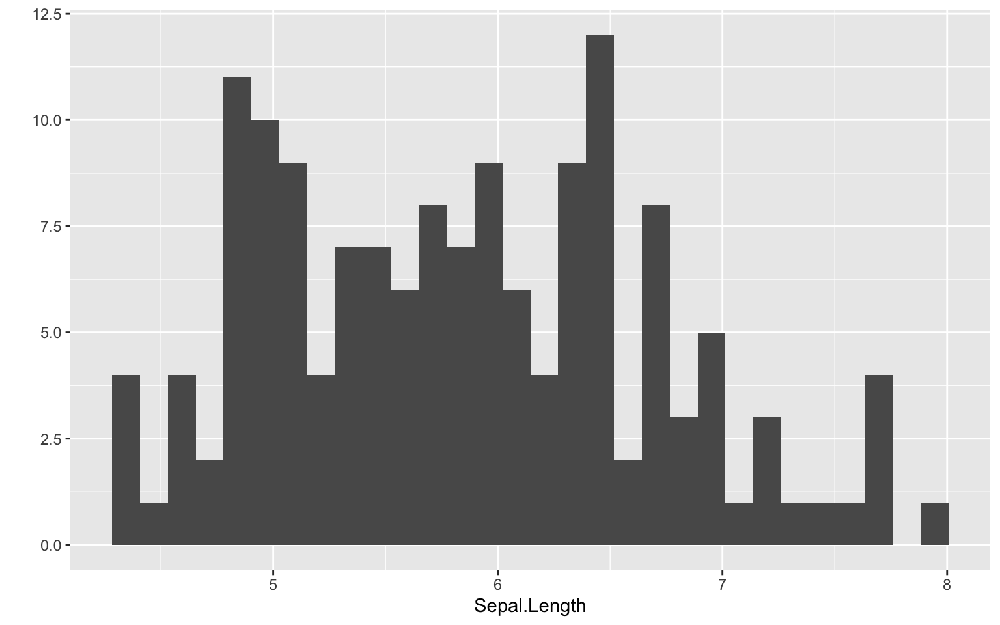

Por medio de la exploración de datos obtenemos las primeras ideas sobre la información que vamos a abordar. Set de un paso muy importante para poder planificar tempranamente los pasos a seguir en tu análisis, así como detectar a tiempo posibles problemas o dificultades. Por eso te voy a entregar algunas ideas para poder explorar datos de forma rápida y clara.

``` r
ggplot2::qplot(Sepal.Length, data = iris, geom = "histogram")
```

    Warning: `qplot()` was deprecated in ggplot2 3.4.0.

    `stat_bin()` using `bins = 30`. Pick better value with `binwidth`.


``` r
library(ggplot2)

ggplot(iris) +
  aes(Sepal.Length) +
  geom_histogram()
```

    `stat_bin()` using `bins = 30`. Pick better value with `binwidth`.


``` r
library(GGally)
```

    Registered S3 method overwritten by 'GGally':
      method from   
      +.gg   ggplot2

``` r
iris |> 
 ggpairs(aes(color = Species)) + 
  theme_minimal() +
  scale_color_brewer(palette = "Purples", aesthetics = c("color", "fill"))
```

    `stat_bin()` using `bins = 30`. Pick better value with `binwidth`.

    `stat_bin()` using `bins = 30`. Pick better value with `binwidth`.
    `stat_bin()` using `bins = 30`. Pick better value with `binwidth`.
    `stat_bin()` using `bins = 30`. Pick better value with `binwidth`.



[Florencia Mangini](https://www.thinkingondata.com/how-to-show-correlations-between-variables/)
