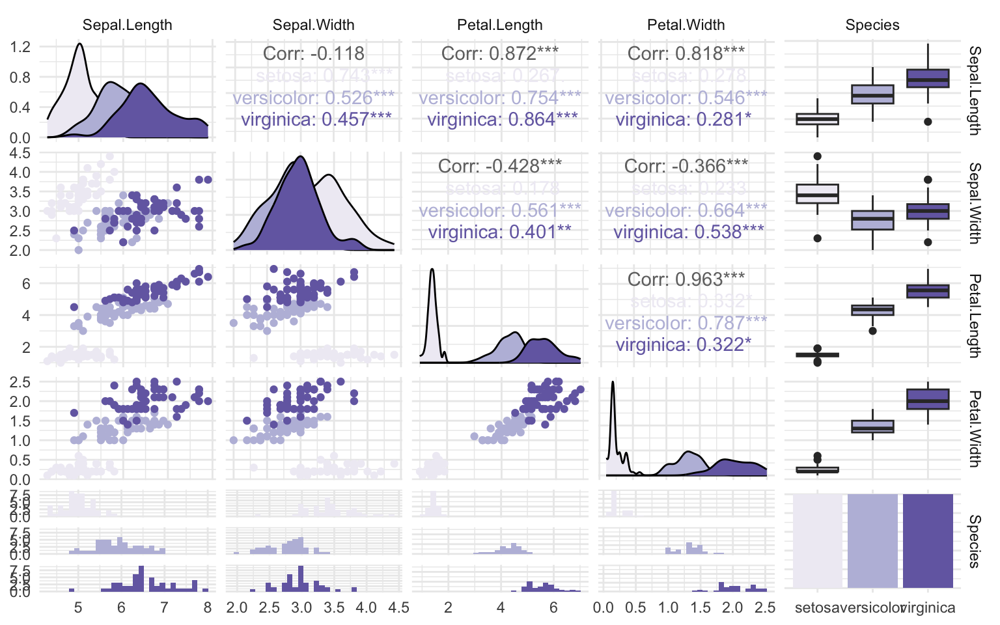

Por medio de la exploración de datos obtenemos las primeras ideas sobre la información que vamos a abordar. Set de un paso muy importante para poder planificar tempranamente los pasos a seguir en tu análisis, así como detectar a tiempo posibles problemas o dificultades. Por eso te voy a entregar algunas ideas para poder explorar datos de forma rápida y clara.

``` r
# install.packages("skimr")
library(skimr)

skim(iris)
```

|                                                  |      |
|:-------------------------------------------------|:-----|
| Name                                             | iris |
| Number of rows                                   | 150  |
| Number of columns                                | 5    |
| \_\_\_\_\_\_\_\_\_\_\_\_\_\_\_\_\_\_\_\_\_\_\_   |      |
| Column type frequency:                           |      |
| factor                                           | 1    |
| numeric                                          | 4    |
| \_\_\_\_\_\_\_\_\_\_\_\_\_\_\_\_\_\_\_\_\_\_\_\_ |      |
| Group variables                                  | None |

Data summary

**Variable type: factor**

| skim_variable | n_missing | complete_rate | ordered | n_unique | top_counts |
|:------------|---------:|------------:|:-------|--------:|:---------------------|
| Species | 0 | 1 | FALSE | 3 | set: 50, ver: 50, vir: 50 |

**Variable type: numeric**

| skim_variable | n_missing | complete_rate | mean |   sd |  p0 | p25 |  p50 | p75 | p100 | hist  |
|:------------|--------:|------------:|----:|----:|----:|----:|----:|----:|----:|:-----|
| Sepal.Length  |         0 |             1 | 5.84 | 0.83 | 4.3 | 5.1 | 5.80 | 6.4 |  7.9 | ▆▇▇▅▂ |
| Sepal.Width   |         0 |             1 | 3.06 | 0.44 | 2.0 | 2.8 | 3.00 | 3.3 |  4.4 | ▁▆▇▂▁ |
| Petal.Length  |         0 |             1 | 3.76 | 1.77 | 1.0 | 1.6 | 4.35 | 5.1 |  6.9 | ▇▁▆▇▂ |
| Petal.Width   |         0 |             1 | 1.20 | 0.76 | 0.1 | 0.3 | 1.30 | 1.8 |  2.5 | ▇▁▇▅▃ |

``` r
iris |>
  dplyr::group_by(Species) |>
  skim()
```

|  |  |
|:---|:---|
| Name | dplyr::group_by(iris, Spe... |
| Number of rows | 150 |
| Number of columns | 5 |
| \_\_\_\_\_\_\_\_\_\_\_\_\_\_\_\_\_\_\_\_\_\_\_ |  |
| Column type frequency: |  |
| numeric | 4 |
| \_\_\_\_\_\_\_\_\_\_\_\_\_\_\_\_\_\_\_\_\_\_\_\_ |  |
| Group variables | Species |

Data summary

**Variable type: numeric**

| skim_variable | Species | n_missing | complete_rate | mean | sd | p0 | p25 | p50 | p75 | p100 | hist |
|:----------|:--------|-------:|----------:|----:|----:|---:|----:|----:|----:|----:|:----|
| Sepal.Length | setosa | 0 | 1 | 5.01 | 0.35 | 4.3 | 4.80 | 5.00 | 5.20 | 5.8 | ▃▃▇▅▁ |
| Sepal.Length | versicolor | 0 | 1 | 5.94 | 0.52 | 4.9 | 5.60 | 5.90 | 6.30 | 7.0 | ▂▇▆▃▃ |
| Sepal.Length | virginica | 0 | 1 | 6.59 | 0.64 | 4.9 | 6.23 | 6.50 | 6.90 | 7.9 | ▁▃▇▃▂ |
| Sepal.Width | setosa | 0 | 1 | 3.43 | 0.38 | 2.3 | 3.20 | 3.40 | 3.68 | 4.4 | ▁▃▇▅▂ |
| Sepal.Width | versicolor | 0 | 1 | 2.77 | 0.31 | 2.0 | 2.52 | 2.80 | 3.00 | 3.4 | ▁▅▆▇▂ |
| Sepal.Width | virginica | 0 | 1 | 2.97 | 0.32 | 2.2 | 2.80 | 3.00 | 3.18 | 3.8 | ▂▆▇▅▁ |
| Petal.Length | setosa | 0 | 1 | 1.46 | 0.17 | 1.0 | 1.40 | 1.50 | 1.58 | 1.9 | ▁▃▇▃▁ |
| Petal.Length | versicolor | 0 | 1 | 4.26 | 0.47 | 3.0 | 4.00 | 4.35 | 4.60 | 5.1 | ▂▂▇▇▆ |
| Petal.Length | virginica | 0 | 1 | 5.55 | 0.55 | 4.5 | 5.10 | 5.55 | 5.88 | 6.9 | ▃▇▇▃▂ |
| Petal.Width | setosa | 0 | 1 | 0.25 | 0.11 | 0.1 | 0.20 | 0.20 | 0.30 | 0.6 | ▇▂▂▁▁ |
| Petal.Width | versicolor | 0 | 1 | 1.33 | 0.20 | 1.0 | 1.20 | 1.30 | 1.50 | 1.8 | ▅▇▃▆▁ |
| Petal.Width | virginica | 0 | 1 | 2.03 | 0.27 | 1.4 | 1.80 | 2.00 | 2.30 | 2.5 | ▂▇▆▅▇ |

``` r
ggplot2::qplot(Sepal.Length, data = iris, geom = "histogram")
```

    Warning: `qplot()` was deprecated in ggplot2 3.4.0.

    `stat_bin()` using `bins = 30`. Pick better value with `binwidth`.


``` r
library(ggplot2)

ggplot(iris) +
  aes(Sepal.Length) +
  geom_histogram()
```

    `stat_bin()` using `bins = 30`. Pick better value with `binwidth`.


``` r
library(GGally)
```

    Registered S3 method overwritten by 'GGally':
      method from   
      +.gg   ggplot2

``` r
iris |> 
 ggpairs(aes(color = Species)) + 
  theme_minimal() +
  scale_color_brewer(palette = "Purples", aesthetics = c("color", "fill"))
```

    `stat_bin()` using `bins = 30`. Pick better value with `binwidth`.

    `stat_bin()` using `bins = 30`. Pick better value with `binwidth`.
    `stat_bin()` using `bins = 30`. Pick better value with `binwidth`.
    `stat_bin()` using `bins = 30`. Pick better value with `binwidth`.



[Florencia Mangini](https://www.thinkingondata.com/how-to-show-correlations-between-variables/)
