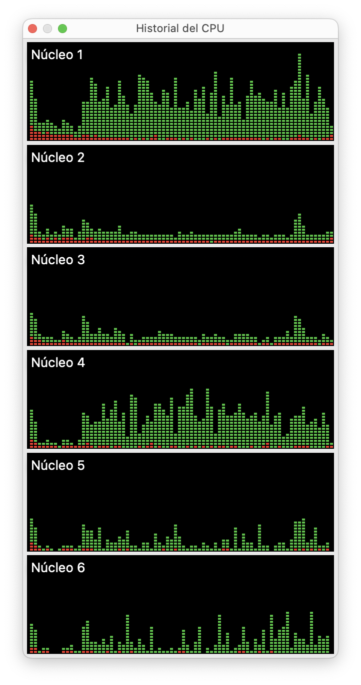
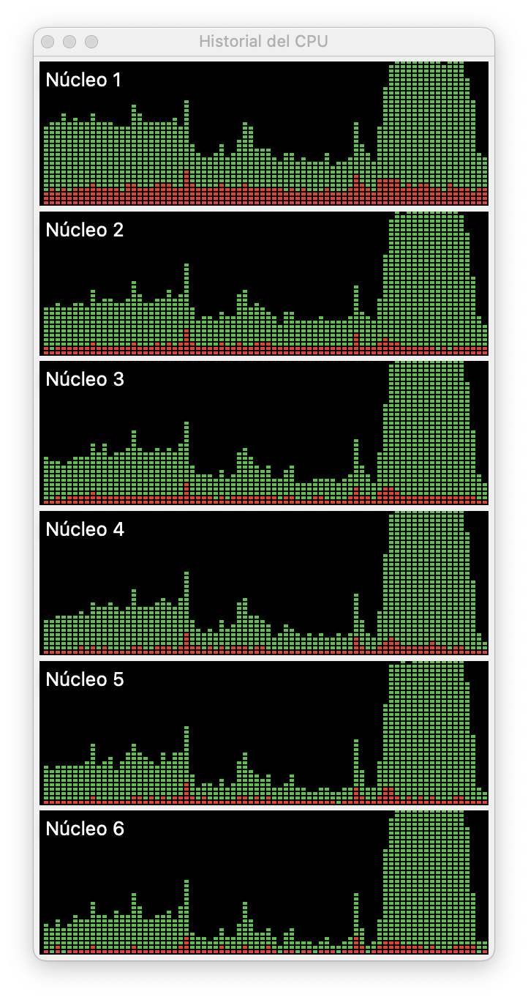

La mayoría de las funciones de R, así como R mismo, se ejecutan en un único proceso dentro de tu computadora, dado que R es un software de un sólo hilo (_single threaded_). 

Los computadores modernos en general tienen entre 2 y 8 núcleos (_cores_), algunos incluso muchos más. Una mayor cantidad de núcleos o procesadores permite a tu computadora hacer más **operaciones paralelas**. Por ejemplo, si tu computador tiene 6 núcleos y R está procesando datos, R usará 1 núcleo al 100%, y te quedarán 5 núcleos en desuso, que podrían estar ejecutando otras tareas. En otras palabras, R está usando sólo el 100% de tu computador, cuando podría estar usando el 600%.

Existen programas que son capaces de **distribuir** cargas de procesamiento en múltiples núcleos de tu computador, lo cual les permite terminar sus tareas más rápido o realizar tareas más complejas. Siguiendo el ejemplo, si tienes 6 núcleos y una tarea que usa 1 núcleo se demora 30 segundos en realizarse, en teoría podrías usar los 6 núcleos para realizar la tarea en una fracción del tiempo original (~5 segundos). 

Pero esto asume varias cosas: 

- que es posible separar en partes la tarea
- que las partes de la tarea se pueden procesar simultáneamente[^1]
- que procesar paralelamente la tarea trae beneficios de rendimiento[^2].

[^1]: No todas las tareas son posibles de procesar de forma paralela, por ejemplo, 6 personas no se demoran menos en contar hasta 100 porque sería imposible.
[^2]: No todas las tareas escalan de la misma forma; por ejemplo, si la tarea es lenta porque tiene que leer muchos datos, no se va a realizar más rápido por leer simultáneamente los datos, porque el cuello de botella es la velocidad de lectura y no el procesador.

Asumiendo que lo anterior se cumple,  podemos **realizar cálculos a través de múltiples procesadores (_multicore_) en R**, aprovechando la totalidad de la capacidad de cómputo de nuestros computadores para optimizar el rendimiento de nuestros procesos.


## Ejemplo
Usaremos un conjunto de datos que contiene [10.000 noticias de prensa digital chilena](https://github.com/bastianolea/prensa_chile); es decir, que contiene muchísimo texto. Para hacer el ejemplo más ilustrativo de un problema de procesamiento de grandes volúmenes de datos, multiplicaremos la base de datos para que sea 20 veces más grande, y así se entienda la necesidad de optimización.

```r
# cargar datos desde repositorio
prensa <- readr::read_csv2("https://github.com/bastianolea/prensa_chile/raw/main/datos/prensa_datos_muestra.csv")
# para más información: https://github.com/bastianolea/prensa_chile

# multiplicar cantidad de datos
prensa_b <- rep(list(prensa), 20) |> purrr::list_rbind()

# ver datos
prensa_b
```

```
# A tibble: 200,000 × 4
   titulo                                               cuerpo fuente fecha     
   <chr>                                                <chr>  <chr>  <date>    
 1 "Hombre de 66 años fue asesinado en plena vía públi… "El h… Coope… 2024-07-21
 2 "Revive el cuarto capítulo de Indecisos: Candidatos… "Este… Megan… 2024-09-03
 3 "Menos personas circulando y miedo de los residente… "Poca… Megan… 2024-04-08
 4 "CEO de Walmart Chile sostiene que si la empresa no… "Hace… The C… 2024-12-22
 5 "Pdte. Boric entregó mensaje por la muerte de Piñer… "El p… CNN C… 2024-02-06
 6 "Encuentran dos cadáveres en un canal de regadío en… "Pers… Publi… 2024-07-13
 7 "Magisterio denuncia 'abandono de la educación públ… "Carl… Coope… 2024-02-21
 8 "“El día que la democracia triunfó sobre la dictadu… "Los … CNN C… 2024-10-05
 9 "Accidente de tránsito deja un fallecido y tres her… "En h… T13    2024-12-22
10 "Dos personas resultan baleadas tras intentar evita… "Aton… Emol   2024-11-02
# ℹ 199,990 more rows
```


Tenemos un dataset con 200 mil filas, donde cada fila es una noticia, y en la columna `cuerpo` está el texto completo de cada noticia. 

### Ejemplo de cálculo con 1 procesador

El objetivo va a ser detectar noticias que contengan un conjunto de palabras en su cuerpo, contar cuántas palabras están presentes en cada noticia, y luego filtrar los datos para dejar sólo las noticias que tengan `x` cantidad de términos.


```r
library(dplyr) 
library(stringr)

# lista de términos a buscar
términos <- "delincuen(cia|te)|crimen|criminal|inseguridad|deli(to|ctual)|hurto|robo|asalt(o|ante)|narco|homicidio|asesina(to|do)"

tictoc::tic()

prensa_delincuencia <- prensa_b |> 
  # extraer términos desde cada noticia, si es que están presentes
  mutate(conceptos = str_extract_all(cuerpo, términos)) |> 
  # contar cantidad de términos presentes en cada noticia
  mutate(n_conceptos = lengths(conceptos)) |> 
  # filtrar para que tengan más de x términos
  filter(n_conceptos > 2)

tictoc::toc() 
```

Medimos el tiempo que se demora en realizar esta operación usando las funciones `tic()` y `toc()` del [paquete `{tictoc}`](https://github.com/collectivemedia/tictoc).

En mi computador R se demoró **70 segundos** en buscar los términos entre las 200.000 noticias (varios millones de palabras en total) y luego hacer el conteo y filtrado.


<div style="display: flex; margin:auto; max-width: 500px;">
  <div style="flex: 1; margin: auto; padding: 6px;">
  
  </div>
  <div style="flex: 1; margin: auto; padding: 6px;">
  
  </div>
</div>

<div style="text-align: center; margin: auto; opacity: 65%; font-size: 85%;">
<em>Uso de recursos con 1 procesador</em>
</div>

Como vemos en los gráficos, solamente 1 núcleo del computador mostró uso de recursos, y el resto de los núcleos permanecieron inactivos. Esto significa que R no está aprovechando la capacidad de procesamiento de tu computador, y por lo tanto, el cálculo se demora más de lo que podría. En otras palabras, si R ocupa 1 núcleo y sobran 5 núcleos en desuso, significa que podrías ejecutar 5 sesiones de R más, de forma paralela.


### Ejemplo de cálculo con 6 procesadores

Para realizar el cálculo optimizando para el uso de múltiples procesadores, primero usamos la función `split()` para **dividir los datos en varias partes iguales.** Esto es equivalente a lo que mencionamos antes sobre dividir una tarea en partes.

Luego, vamos a usar la función `future_map()` del [paquete `{furrr}`](https://furrr.futureverse.org), Esta función es similar a `map()` de [`{purrr}`](https://purrr.tidyverse.org), que permite iterar sobre tus datos, pero al agregarle `future_` hará que cada iteración se ejecute en un proceso separado, aprovechando los múltiples núcleos de tu computador. En otras palabras, `{furrr}` creará 6 sesiones de R, y cada una procesará su parte de los datos.

Cargamos los paquetes que posibilitan esta optimización:

```r
library(purrr) 
library(furrr)
```

Definimos la cantidad de procesadores que usaremos:[^3]
```r
plan(multisession, workers = 6)
```

[^3]: El número de `workers` (subprocesos) depende de tu computador; en este caso pondré 6, pero si tu computador tiene 8 entonces pone 8, aunque hay gente que recomienda usar `n-1` para dejar un núcleo libre para el sistema operativo.

Modificamos el código del cálculo levemente para pedirle que lo ejecute a cada una de las partes de nuestro dataset, recordando que los datos quedaron divididos en una lista que contiene 6 elementos, cada uno con una parte de los datos originales:

```r
tictoc::tic() # benchmark

prensa_delincuencia <- prensa_b |> 
  # separar el dataframe en una lista con x cantidad de dataframes de la misma cantidad de filas
  split(1:6) |>
  # calcular multiprocesador, una parte por cada procesador
  future_map(\(parte) {
    parte |> 
      mutate(conceptos = str_extract_all(cuerpo, términos)) |> 
      mutate(n_conceptos = lengths(conceptos)) |> 
      filter(n_conceptos > 2)
  }) |> 
# volver a unir los resultados en un solo dataframe
list_rbind()
  
tictoc::toc() 
```

El proceso se demora **18 segundos, apenas un 25% de lo que se demoró antes!** En el monitor de actividad vemos claramente la diferencia en el aprovechamiento de los recursos computacionales:

<div style="display: flex; margin:auto; max-width: 500px;">
  <div style="flex: 1; margin: auto; padding: 6px;">
  
  </div>
  <div style="flex: 1; margin: auto; padding: 6px;">
  
  </div>
</div>

<div style="text-align: center; margin: auto; opacity: 65%; font-size: 85%;">
<em>Uso de recursos con 6 procesadores</em>
</div>

Notamos que todos los procesadores del computador están al 100%, a diferencia de antes. Si revisamos los procesos en el computador durante el cálculo, vemos que, aparte del proceso principal `rsession`, se crearon 6 procesos `R` que procesan los datos de forma paralela:

<div style="max-width: 440px; margin: auto;">

</div>

En conclusión, vimos que al usar 6 procesadores, obtenemos resultados 400%[^4] más rápidos, con tan solo haber agregado un par de líneas.

----



[^4]: 400% más rápido porque se demoró 18 segundos en vez de 70 segundos al usar 6 núcleos en vez de 1. Pero entonces, ¿por qué no 600% más rápido, si eran 6 procesadores? Esto se debe a que un procesamiento de este tipo tiene el costo extra (_overhead_) de tener que duplicar los datos y el entorno para cada subproceso, lo cual también puede significar un aumento en el uso de la memoria. 