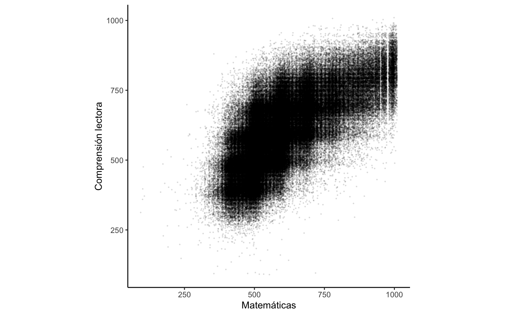
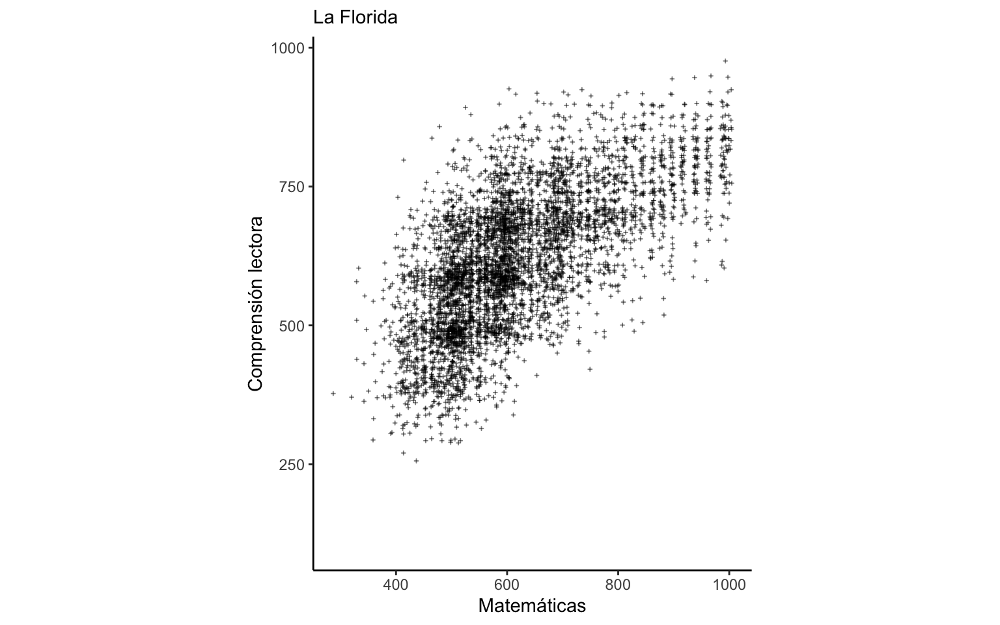
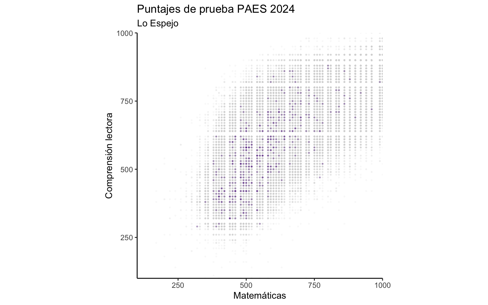
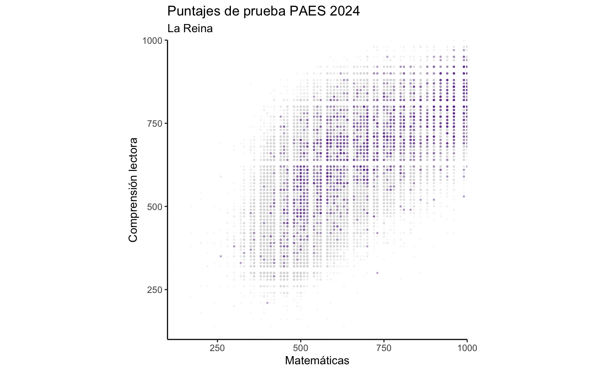
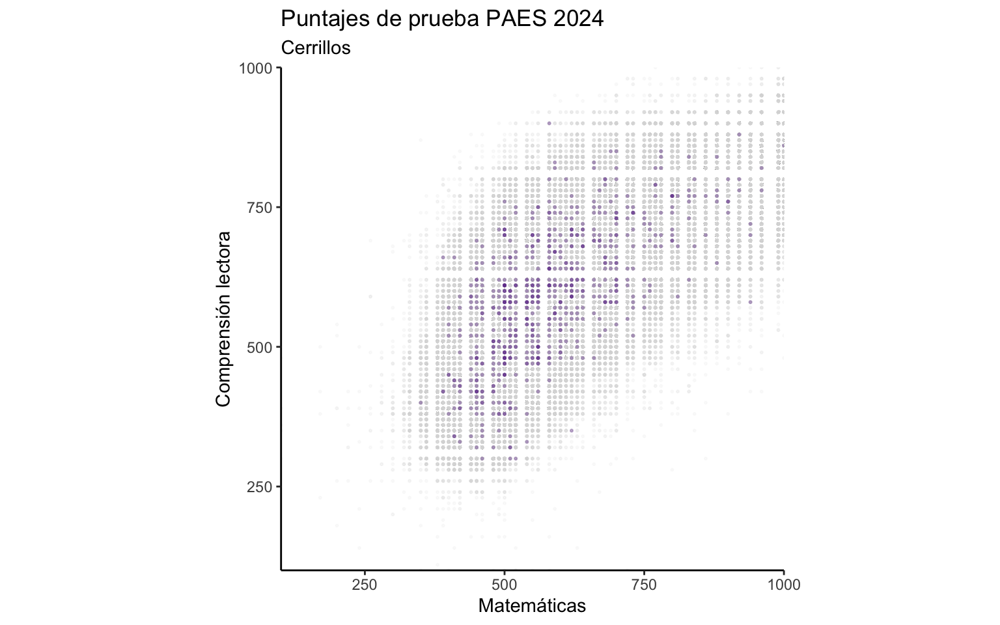
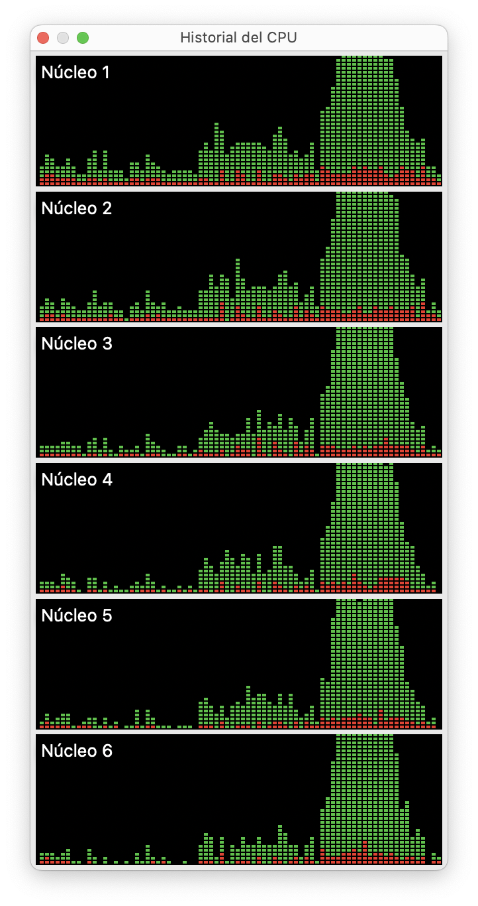

Uno de los principales beneficios del análisis de datos en base a programación es que **el código es reutilizable.** Esto significa que cualquier cosa que hayas hecho puedes **reutilizarla**, y así ahorrar trabajo. El siguiente paso es reutilizar el código de tal forma que sirva para aplicarlo a varios casos a la vez, incluso cientos o miles de veces.

La reutilización de código es súper conveniente para la visualización de datos: una vez que diseñaste un gráfico, con muy pocas modificaciones puedes adaptarlo para que funcione con una fuente de datos distintas, una fuente actualizada, o para que visualice distintas variables.

En este post vamos a ver cómo **automatizar la creación de gráficos** para que solamente tengas que diseñar una visualización que te genere múltiples resultados.

Lo que necesitamos para automatizar la generación de gráficos es:
1. Preparar los datos para la visualización
2. Diseñar una visualización que pueda adaptarse a distintos datos o variables
3. Crear un loop o iteración donde el código que genera el gráfico se ejecute múltiples veces en base a lo que necesites replicar.

## Datos

Para este tutorial usaremos [un conjunto de datos relativamente grande sobre educación](https://github.com/bastianolea/puntajes_prueba_paes), sacado de mi [repositorio de datos sociales abiertos](https://bastianolea.github.io/datos_sociales/). Se trata de una bases de datos de resultados de puntajes de la Prueba de Acceso a la Educación Superior (PAES).

Dado que los datos ya vienen limpios y procesados desde su fuente original [en el repositorio de GitHub](https://github.com/bastianolea/puntajes_prueba_paes), podemos cargarlos directamente desde su repositorio usando el enlace:

``` r
library(arrow)

# cargar datos desde GitHub
datos <- read_parquet("https://github.com/bastianolea/puntajes_prueba_paes/raw/main/datos/puntajes_paes_2024.parquet")
```

Antes que nada, miremos los datos:

``` r
library(dplyr)

glimpse(datos)
```

    Rows: 304,420
    Columns: 12
    $ nombre_comuna    <chr> "Ñuñoa", "Santiago", "San Antonio", "Concepción", "Pe…
    $ codigo_comuna    <dbl> 13120, 13101, 5601, 8101, 9113, 13130, 7101, 13118, 1…
    $ nombre_region    <chr> "Metropolitana de Santiago", "Metropolitana de Santia…
    $ codigo_region    <chr> "13", "13", "05", "08", "09", "13", "07", "13", "13",…
    $ año              <dbl> 2024, 2024, 2024, 2024, 2024, 2024, 2024, 2024, 2024,…
    $ cod_sexo         <chr> "Femenino", "Femenino", "Masculino", "Femenino", "Fem…
    $ promedio_notas   <dbl> 6.50, NA, NA, 5.10, 6.35, 5.45, 6.50, 6.10, NA, NA, 5…
    $ paes_complectora <dbl> 711, NA, 484, 597, 491, 364, NA, 584, 510, NA, NA, NA…
    $ paes_matematica1 <dbl> NA, NA, 513, 498, 436, 424, NA, 498, 478, NA, NA, NA,…
    $ paes_matematica2 <dbl> NA, NA, NA, NA, NA, NA, NA, NA, NA, NA, NA, NA, NA, N…
    $ paes_histciesoc  <dbl> 739, NA, 520, 647, 373, 405, NA, 654, 540, NA, NA, NA…
    $ paes_ciencias    <dbl> NA, NA, NA, NA, NA, NA, NA, NA, NA, NA, NA, NA, NA, 4…

En este conjunto de datos, de 304 mil observaciones, cada fila representa a una persona que dio la *Prueba de Acceso a la Educación Superior* (PAES), y en las columnas se detallan características de las personas y los puntajes obtenidos. Las columnas que empiezan con `paes_` contienen los puntajes.

Exploremos visualmente dos de las variables con un [gráfico de dispersión](https://bastianolea.rbind.io/blog/r_introduccion/tutorial_visualizacion_ggplot/#dispersión):

``` r
library(ggplot2)

datos |> 
  # filter(nombre_region == "Metropolitana de Santiago") |> 
  ggplot() +
  aes(paes_matematica1, paes_complectora) +
  geom_jitter(height = 10, width = 10,
              size = 0.2, alpha = 0.1) +
  theme_classic() +
  coord_fixed() +
  labs(x = "Matemáticas", y = "Comprensión lectora")
```



Obtenemos una tenebrosa nube que correlaciona los puntajes de la prueba de comprensión lectora y la de matemátitas. En este gráfico cada punto es un estudiante, y la ubicación del punto corresponde al puntaje que obtuvo en las pruebas de Matemática y Comprensión Lectora. Como los datos vienen con más variables de caracterización de las observaciones, podemos filtrar los datos por comuna:

``` r
library(dplyr)

datos |> 
  filter(nombre_comuna == "La Florida")
```

    # A tibble: 6,306 × 12
       nombre_comuna codigo_comuna nombre_region        codigo_region   año cod_sexo
       <chr>                 <dbl> <chr>                <chr>         <dbl> <chr>   
     1 La Florida            13110 Metropolitana de Sa… 13             2024 Masculi…
     2 La Florida            13110 Metropolitana de Sa… 13             2024 Masculi…
     3 La Florida            13110 Metropolitana de Sa… 13             2024 Femenino
     4 La Florida            13110 Metropolitana de Sa… 13             2024 Masculi…
     5 La Florida            13110 Metropolitana de Sa… 13             2024 Femenino
     6 La Florida            13110 Metropolitana de Sa… 13             2024 Femenino
     7 La Florida            13110 Metropolitana de Sa… 13             2024 Femenino
     8 La Florida            13110 Metropolitana de Sa… 13             2024 Femenino
     9 La Florida            13110 Metropolitana de Sa… 13             2024 Femenino
    10 La Florida            13110 Metropolitana de Sa… 13             2024 Femenino
    # ℹ 6,296 more rows
    # ℹ 6 more variables: promedio_notas <dbl>, paes_complectora <dbl>,
    #   paes_matematica1 <dbl>, paes_matematica2 <dbl>, paes_histciesoc <dbl>,
    #   paes_ciencias <dbl>

Esto significa qeu podemos generar gráficos para subgrupos de la población; en este caso, gráficos por unidades administrativas o comunas.

## Gráfico

{{< aviso "Si necesitas aprender a visualizar datos desde cero, [revisa este tutorial de `{ggplot2}`](https://bastianolea.rbind.io/blog/r_introduccion/tutorial_visualizacion_ggplot/)" >}}

Podemos intentar volver a generar el mismo gráfico con **exactamente el mismo código**, pero antes filtrando una comuna, para obtener sólo los resultados de estudiantes que viven en la comuna de La Florida:

``` r
datos |> 
  # filtrar datos
  filter(nombre_comuna == "La Florida") |> 
  # gráfico
  ggplot() +
  aes(paes_matematica1, paes_complectora) +
  geom_jitter(shape = 3, 
              height = 5, width = 5,
              size = 0.4, alpha = 0.5) +
  theme_classic() +
  coord_fixed() +
  labs(subtitle = "La Florida",
       x = "Matemáticas", y = "Comprensión lectora")
```



Obviamente podemos filtrar por cualquier otra comuna (o cualquier otra variable) y obtendremos el gráfico de los estudiantes correspondientes.

Mejoremos un poco la visualización, ahora además con la reutilización en mente:

``` r
# el nombre de la comuna que seleccionamos para visualizar
comuna <- "Lo Espejo"

# filtrado de los gráficos
datos <- datos |> 
  # crear variable que indica si la observacion pertenece o no a la comuna seleccionada
  mutate(seleccion = if_else(nombre_comuna == comuna, 
                             true = "Destacada", false = "Otras")) |>
  # ordenar las observaciones según la selección de comuna
  arrange(desc(seleccion)) |> 
  # redondear punteajes
  mutate(across(c(paes_matematica1, paes_complectora), ~signif(.x, 2)))

# gráfico básico
grafico_base <- datos |> 
  ggplot() +
  aes(paes_matematica1, paes_complectora, 
      color = seleccion, alpha = seleccion) +
  geom_point(size = 0.4)

# modificar detalles del gráfico
grafico_bonito <- grafico_base + 
  # escala de colores para destacar la comuna seleccionada
  scale_color_manual(values = c("Otras" = "grey85", "Destacada" = "#6E3A98")) +
  # escala de transparencia para mejorar visualización
  scale_alpha_manual(values = c("Otras" = 0.1, "Destacada" = 0.3)) +
  # temas
  theme_classic() +
  theme(legend.position = "none") + # ocultar leyenda
  coord_fixed(expand = FALSE) + # gráfico cuadrado
  labs(subtitle = comuna, # nombre de la comuna elegida
       title = "Puntajes de prueba PAES 2024",
       x = "Matemáticas", y = "Comprensión lectora")

grafico_bonito
```



Efectivamente obtenemos un gráfico más bonito ☺️ donde especificamos de antemano un objeto `comuna` con el nombre de la unidad administrativa que queremos visualizar. Luego, este objeto se usa para filtrar los datos y para poner un título al gráfico.

También usamos la función `signif()` para redondear los puntajes a dos *dígitos significativos*; es decir, un número como `456` se vuelve `450`, para simplificar el ordenamiento de los puntos en el plano del gráfico.

## Función



El siguiente paso es opcional, pero lo recomiendo porque simplifica bastante la lectura del código y su mantenimiento futuro. Vamos a [**crear una función**](https://bastianolea.rbind.io/blog/r_introduccion/r_intermedio/#crear-funciones) que genere el mismo gráfico que antes, para facilitar su reutilización.

Para crear una función, simplemente incluimos el código dentro de `function() { }` y definimos los argumentos de la función en `function()` y dentro de la misma. Pero como somos bacanes, en vez de `function()` vamos a usar la abreviatura `\()` 😎

``` r
grafico <- \(datos, comuna) {
  datos |> 
    mutate(seleccion = if_else(nombre_comuna == comuna, 
                               true = "Destacada", false = "Otras")) |>
    arrange(desc(seleccion)) |> 
    mutate(across(c(paes_matematica1, paes_complectora), ~signif(.x, 2))) |> 
    ggplot() +
    aes(paes_matematica1, paes_complectora, 
        color = seleccion, alpha = seleccion) +
    geom_point(size = 0.4) +
    scale_color_manual(values = c("Otras" = "grey85", "Destacada" = "#6E3A98")) +
    scale_alpha_manual(values = c("Otras" = 0.1, "Destacada" = 0.3)) +
    theme_classic() +
    theme(legend.position = "none") +
    coord_fixed(expand = FALSE) +
    labs(subtitle = comuna, title = "Puntajes de prueba PAES 2024",
         x = "Matemáticas", y = "Comprensión lectora")
}
```

[Hacer una función en R](https://bastianolea.rbind.io/blog/r_introduccion/r_intermedio/#crear-funciones) es como empaquetar tu código en su propio programita para que sea más fácil de usar sin tener que copiar y pegar todo el código cada vez que lo necesites. También tiene el beneficio de que, si necesitas corregir o mejorar el código, lo modificas una sola vez y el cambio va a aparecer en todos los demás lugares que la uses.

Ahora que creamos la función, solo tenemos que ejecutar `grafico()` para generar el gráfico!

``` r
grafico(datos, "La Reina")
```



``` r
grafico(datos, "Cerrillos")
```



## Automatización

Una vez que hayamos desarrollado el código que genera la visualización, y que hayamos probado y confirmado que el código va a servir en distintas situaciones (en nuestro caso, filtrando distintas comunas), podemos [introducir el código a un *loop*](https://bastianolea.rbind.io/blog/r_introduccion/r_intermedio/#bucles) para **generar todas las variaciones que queramos** del mismo gráfico.

En el caso de nuestro conjunto de datos, esto sería **hacer un gráfico por cada comuna** en la base de datos. Si hiciéramos esto a mano, tendríamos que copiar y pegar más de 300 veces el mismo código 😰 Así que, para no tener que hacer las cosas a mano como los perdedores, vamos a **automatizar el proceso de generación de gráficos**.

Definamos primero la lista de elementos por los que queremos crear los gráficos. Esto pueden ser años, países, nombres, o en nuestro caso, divisiones administrativas como pueden ser comunas.

``` r
comunas <- unique(datos$nombre_comuna)
```

El vector anterior nos da todas las categorías de la variable `nombre_comuna` del dataset `datos`, eliminando duplicados con `unique()`. Estos serán los valores por los que iremos iterando: por cada uno de estos valores vamos a querer que se produzca un gráfico distinto.

En otras palabras, queremos aplicar nuestra función `grafico()` (o el código para generar el gráfico) una vez por cada comuna en el dataset. Para esto utilizaremos un [bucle o *loop* en R](https://bastianolea.rbind.io/blog/r_introduccion/r_intermedio/#bucles) nos permite **repetir un conjunto de instrucciones varias veces**.



Si bien en R podemos crear loops o bucles con `for`, usaremos `map()` del [paquete `{purrr}`](https://purrr.tidyverse.org) para lograr lo mismo de una forma más elegante y eficiente.

Dentro de `map()`, primero entregamos los **elementos por los que queremos iterar** (en nuestro caso, los nombres de las comunas), y **luego se aplica una función**[^1], dentro de la cual ponemos lo que queremos que pase en cada paso de la iteración. O sea que, por cada elemento de `comunas`, se va a aplicar el código del gráfico.

Dentro de la función, simplemente ponemos el código que genera el gráfico, y luego le pedimos que guarde el resultado en nuestro computador. Es muy importante que los nombres de archivo sean distintos! De lo contrario los resultados se van a ir sobrescribiendo unos a otros 🙄 Así que usamos el nombre de la comuna dentro de `paste()` para crear nombres de archivo únicos.

``` r
library(purrr)

map(comunas[1:12], # elementos por los que se va a iterar
    \(comuna) { # cada elemento va a pasar a la función como un objeto llamado `comuna`
      
      # crear gráficos
      grafico <- grafico(datos, comuna)
      
      # guardar gráficos
      ggsave(plot = grafico, 
             filename = paste0("graficos/Gráfico Paes ", comuna, ".jpeg"), # nombre del archivo
             width = 6, height = 6)
    })
```

    [[1]]
    [1] "graficos/Gráfico Paes Ñuñoa.jpeg"

    [[2]]
    [1] "graficos/Gráfico Paes Santiago.jpeg"

    [[3]]
    [1] "graficos/Gráfico Paes San Antonio.jpeg"

    [[4]]
    [1] "graficos/Gráfico Paes Concepción.jpeg"

    [[5]]
    [1] "graficos/Gráfico Paes Perquenco.jpeg"

    [[6]]
    [1] "graficos/Gráfico Paes San Miguel.jpeg"

    [[7]]
    [1] "graficos/Gráfico Paes Talca.jpeg"

    [[8]]
    [1] "graficos/Gráfico Paes Macul.jpeg"

    [[9]]
    [1] "graficos/Gráfico Paes Quilicura.jpeg"

    [[10]]
    [1] "graficos/Gráfico Paes San Joaquín.jpeg"

    [[11]]
    [1] "graficos/Gráfico Paes Valparaíso.jpeg"

    [[12]]
    [1] "graficos/Gráfico Paes Limache.jpeg"

Con tan sólo ejecutar el código anterior, obtendremos más de 300 gráficos! Pero como son tantos, le puse `comunas[1:10]` para que sólo se hagan las primeras 10 😅

Procesando...

<div style="margin:auto; max-width:70%;">
<video src="ggplot_batch_singlecore.mov" style="border-radius:7px; max-width: 100%; margin:auto;" autoplay loop>
</video>
</div>


## Optimización

Naturalmente, generar cientos de gráficos puede demorar unos minutos, sobre todo si los datos son muy grandes (y en nuestro caso, cada gráfico tiene más de 300 mil puntos...).

Lo bueno es que podemos aprovechar todo el potencial de nuestras computadoras [modificando el código para que el proceso sea multiprocesador](https://bastianolea.rbind.io/blog/furrr_multiprocesador/); es decir, que se usen todos los procesadores de nuestro computador al mismo tiempo. Tan sólo especificamos cuántos procesadores queremos usar con `plan(multisession, workers = 6)`, y luego reemplazamos `map()` por `future_map()` de [`{furrr}`](https://furrr.futureverse.org):

``` r
library(furrr)
plan(multisession, workers = 8)

future_map(comunas[1:20],
           \(comuna) {
             
             grafico <- grafico(datos, comuna)
             
             ggsave(plot = grafico, 
                    filename = paste0("graficos/Gráfico Paes ", comuna, ".jpeg"), # nombre del archivo
                    width = 6, height = 6)
           })
```

<div style="max-width: 280px; margin:auto;">
  
  </div>


Procesando...

<div style="margin:auto; max-width:80%;">
<video src="ggplot_batch_multicore.mov" style="border-radius:7px; max-width: 100%; margin:auto;" autoplay loop>
</video>
</div>


Listo! 🎉 Imagínate todo el tiempo que ahorramos: podemos obtener cientos de gráficos con tan sólo presionar el botón *Run* (o la combinación *control* + *enter*), y si tenemos que actualizar, modificar o mejorar los gráficos, simplemente cambiamos el código en la función y volvemos a ejecutar el *loop*. Excelente! Esto hace que aprender a programar valga la pena, cierto?... cierto? 🥺

------------------------------------------------------------------------




[^1]: En vez de una función, usaremos una [función anónima](https://www.jumpingrivers.com/blog/new-features-r410-pipe-anonymous-functions/), lo que significa que crearemos la función dentro de `map()` solamente porque es más rápido.
