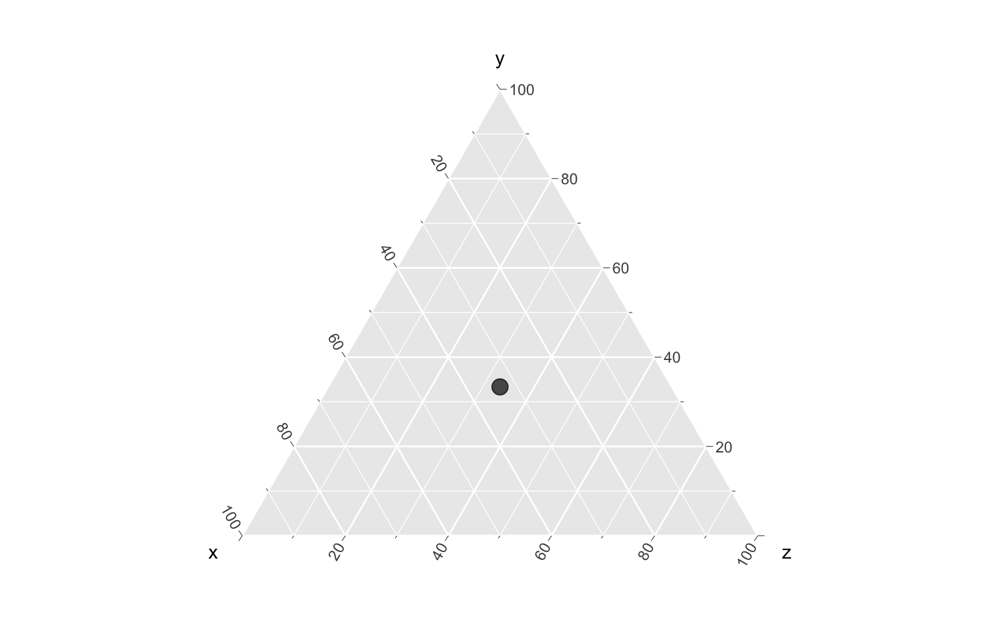
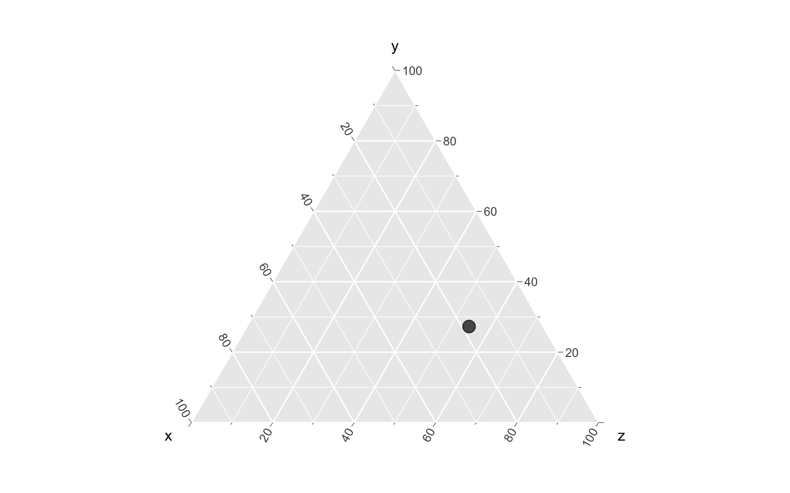
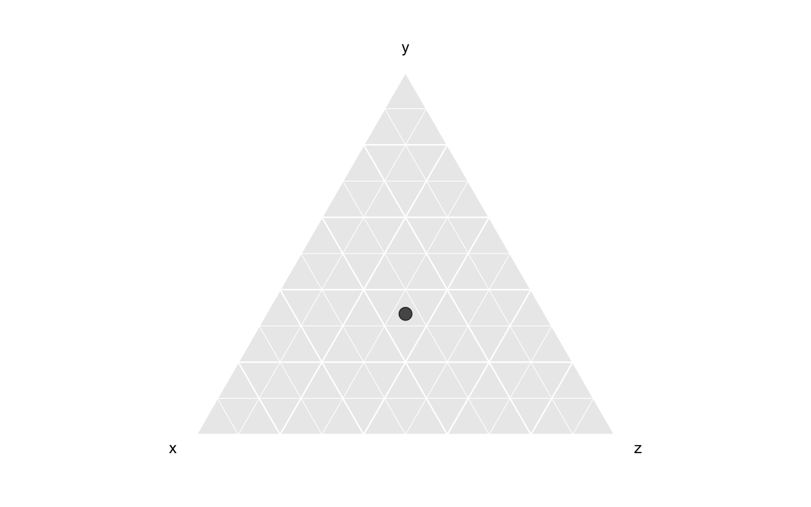
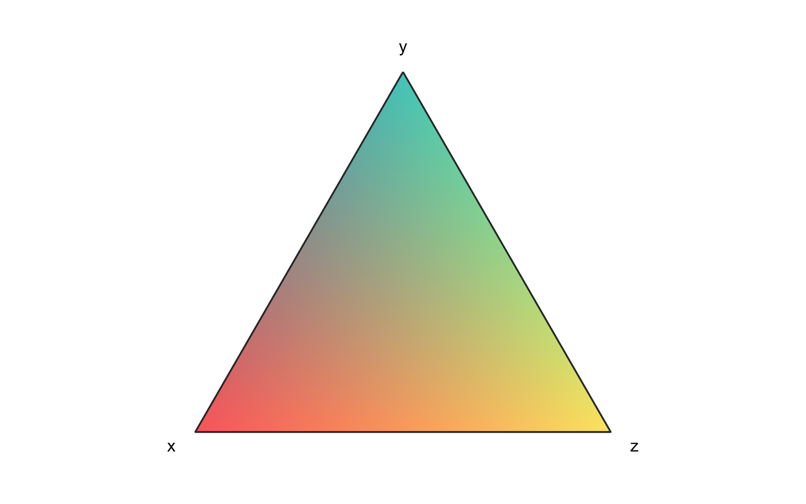

Un **gráfico ternario** es una visualización de datos que representa tres variables numéricas dentro de un triángulo. En este post usaremos el paquete `{ggtern}` para crearlos con R y `{ggplot2}`.



Primero instalamos el paquete:

``` r
install.packages("ggtern")
```

## Gráfico ternario básico

Veamos lo más básico de este tipo de diagramas. Necesitamos tres variables numéricas:

``` r
library(dplyr)
```

``` r
datos <- tibble(x = 33,
                y = 33,
                z = 33)
```

Para visualizarlas dentro de un triángulo, usamos la función `ggtern()` en vez de `ggplot()`, y definimos las tres variables en `aes()`:

``` r
library(ggplot2)
library(ggtern)

datos |> 
  ggtern() +
  aes(x = x,
      y = y,
      z = z) +
  geom_point(size = 4, alpha = 0.7)
```



{{< info "Aparentemente `{ggtern}` sobreescribe y cambia varias cosas del funcionamiento interno de `{ggplot2}, por lo que puede que provoque problemas o incompatibilidades. Recuerda que si tienes problemas, siempre se puede **Reiniciar R** desde el menú _Session_ de RStudio." >}}

Como las tres variables tienen el mismo valor, el punto queda en el centro del triángulo.

Si cambiamos los datos levemente, vemos que el punto se representa dentro del triángulo **como si los vértices ejercieran una atracción**.

``` r
datos <- tibble(x = 20,
                y = 30,
                z = 60)

datos |> 
  ggtern() +
  aes(x = x,
      y = y,
      z = z) +
  geom_point(size = 4, alpha = 0.7)
```



Esto se debe a que, como se trata de tres variables, no pueden representarse exactamente como sí podrían en un plano cartesiano, sino que **los valores son escalados entre 0 y 100**. En este sentido, los valores que aparecen en los ejes refieren al porcentaje de la variable con respecto a las demás.

Por ejemplo, si hacemos que una variable concentre el 100%, el punto aparecerá exactamente en el vértice.

``` r
datos <- tibble(x = 0,
                y = 100,
                z = 0)

datos |> 
  ggtern() +
  aes(x = x,
      y = y,
      z = z) +
  geom_point(size = 8, alpha = 0.7)
```


Pero lo mismo va a pasar si la suma de las tres variables no es 100, dado que, como dijimos, las variables se escalan.

Si los ejes resultan distractores para la interpretación visual del gráfico, se pueden ocultar:

``` r
datos <- tibble(x = 33,
                y = 33,
                z = 33)

datos |> 
  ggtern() +
  aes(x = x,
      y = y,
      z = z) +
  geom_point(size = 4, alpha = 0.7) +
  ggtern::theme_hideticks() +
  ggtern::theme_hidelabels()
```



### Visualizar tres variables

Teniendo una tabla de datos con tres variables, las mapeamos en `aes()` y obtenemos sus posiciones dentro del triángulo:

``` r
datos <- tibble(x = c(10, 30, 60, 20, 40, 80),
                y = c(30, 60, 20, 40, 30, 10),
                z = c(60, 20, 20, 40, 30, 10),
                grupo = c("B", "B", "A", "B", "A", "A"))

datos |> 
    ggtern() +
  aes(x = x,
      y = y,
      z = z,
      shape = grupo,
      color = x) +
  geom_point(size = 4, alpha = 0.8) +
  theme_linedraw() +
  ggtern::theme_hideticks() +
  ggtern::theme_hidelabels()
```


En este ejemplo podemos ver que los valores del grupo A tienen mayor valor en la variable `x` que los del grupo `b`, los cuales a su vez tienen mayor valor de `z`.

### Visualizar una trayectoria

Si tenemos datos que cuentan con mediciones consecutivas, podemos graficar una línea que va pasando por todos sus valores:

``` r
datos <- tibble::tribble(
                ~año,  ~a, ~b, ~c,
                 2013, 41.68, 44.98, 50.62,
                 2014, 41.75, 44.18, 50.19,
                 2015, 42.58, 45.19, 49.70,
                 2016, 42.91, 46.61, 51.27,
                 2017, 43.60, 48.17, 51.40,
                 2018, 43.91, 48.71, 50.68,
                 2019, 44.35, 48.52, 49.55,
                 2020, 43.70, 46.53, 47.33,
                 2021, 44.84, 51.60, 50.65,
                 2022, 46.62, 53.56, 49.30,
                 2023, 47.13, 50.73, 49.65,
                 2024, 47.32, 50.94, 48.93,
                 2025, 47.53, 50.86, 48.78,
                )

datos |> 
  ggtern() +
  aes(x = a,
      y = b,
      z = c,
      color = año,
      linewidth = año) +
  geom_line(lineend = "round") +
  ggtern::theme_hideticks() +
  ggtern::theme_zoom_center(.4) +
  scale_color_continuous(labels = scales::label_number(big.mark = "", 
                                                       accuracy = 1)) +
  scale_linewidth_continuous(range = c(0.4, 1.9),
                             labels = scales::label_number(big.mark = "", 
                                                           accuracy = 1)) +
  theme_bw() +
  ggtern::theme_hideticks() +
  ggtern::theme_hidelabels() +
  guides(color = guide_legend()) +
  labs(x = "A", y = "B", z = "C")
```


En este gráfico podemos ver que la unidad de información empieza con alto valor de `C`, el cual va disminuyendo en la medida que aumenta su valor de `B` y levemente aumenta su valor de `A`, terminando en una posición más balanceada.

## Agregar un fondo en degradado

Esto lo encontré demasiado bonito! Para explicar mejor la relación de atracción o proporcionalidad entre las tres variables, podemos pensarlo como un espectro de colores, donde cada variable tiene un color. De esta forma se puede expresar mejor la idea de que la posición de los puntos es una proporción entre los valores de las tres variables, una especie de mezcla entre ellas.

Para crear un fondo creamos la siguiente función, que toma tres colores y crea una matriz de valores que, al mapearse en el triángulo, generarán un degradado.

``` r
# función para crear fondo degradado en gráfico ternario
ggtern_degradado <- function(color_x = "#FF6B6B",
                             color_y = "#4ECDC4",
                             color_z = "#FFE66D",
                             resolucion = 150) {
  
  # crear grilla de fondo
  fondo <- expand.grid(
    x = seq(0, 1, length.out = resolucion),
    y = seq(0, 1, length.out = resolucion)
  )
  
  # calcular z y filtrar puntos fuera del triángulo
  fondo <- fondo |> 
    mutate(z = 1 - x - y) |> 
    filter(x >= 0, y >= 0, z >= 0, 
           x <= 1, y <= 1, z <= 1)
  
  # convertir colores a RGB
  rgb_x <- col2rgb(color_x) / 255
  rgb_y <- col2rgb(color_y) / 255
  rgb_z <- col2rgb(color_z) / 255
  
  # interpolar colores
  fondo$color <- rgb(
    fondo$x * rgb_x[1] + fondo$y * rgb_y[1] + fondo$z * rgb_z[1],
    fondo$x * rgb_x[2] + fondo$y * rgb_y[2] + fondo$z * rgb_z[2],
    fondo$x * rgb_x[3] + fondo$y * rgb_y[3] + fondo$z * rgb_z[3]
  )
  
  return(fondo)
}
```

Ejecutamos la función con los tres colores que elijamos, y obtendremos una matriz de valores con sus coordenadas y respectivos colores.

``` r
fondo <- ggtern_degradado(color_x = "#FF6B6B",
                          color_y = "#4ECDC4",
                          color_z = "#FFE66D",
                          resolucion = 200)

head(fondo)
```

                x y         z   color
    1 0.000000000 0 1.0000000 #FFE66D
    2 0.005025126 0 0.9949749 #FFE56D
    3 0.010050251 0 0.9899497 #FFE56D
    4 0.015075377 0 0.9849246 #FFE46D
    5 0.020100503 0 0.9798995 #FFE46D
    6 0.025125628 0 0.9748744 #FFE36D

Luego usamos esos datos para llenar de puntos el triángulo! Debido a la gran cantidad de puntos y sus cambios leves de colores, se crea un degradado suave:

``` r
ggtern() +
  aes(x = x, y = y, z = z) +
  # fondo con degradado
  geom_point(data = fondo, 
             aes(x = x, y = y, z = z),
             color = fondo$color) +
  theme_bw() +
  ggtern::theme_hideticks() +
  ggtern::theme_hidelabels()
```



Para aclarar los colores del fondo podemos usar la función `col_lighter()` de `{scales}`, como detallamos en el [post sobre colores en `{ggplot2}`](../../../blog/colores/):

``` r
fondo <- fondo |> 
  mutate(color = scales::col_lighter(color, 10))

ggtern() +
  geom_point(data = fondo, 
             aes(x = x, y = y, z = z),
             color = fondo$color) +
  theme_bw() +
  ggtern::theme_hideticks() +
  ggtern::theme_hidelabels()
```


Finalmente podemos agregar los datos en otra capa de `geom_point()` sobre el fondo:

``` r
datos <- data.frame(
  x = c(0.2, 0.4, 0.3, 0.5, 0.2, 0.5, 0.4, 0.3, 0.2, 0.4),
  y = c(0.3, 0.2, 0.4, 0.2, 0.3, 0.2, 0.4, 0.3, 0.5, 0.2),
  z = c(0.5, 0.4, 0.3, 0.2, 0.4, 0.3, 0.2, 0.4, 0.2, 0.3)
)

datos |> 
  ggtern() +
  aes(x = x, y = y, z = z) +
  # fondo con degradado
  geom_point(data = fondo, 
             aes(x = x, y = y, z = z),
             color = fondo$color) +
  # datos
  geom_point(size = 2.5, alpha = 0.6) +
  theme_bw() +
  ggtern::theme_hideticks() +
  ggtern::theme_hidelabels()
```


## Referencias

-   Hamilton NE, Ferry M (2018). "ggtern: Ternary Diagrams Using ggplot2."
    *Journal of Statistical Software, Code Snippets*, *87*(3), 1-17.
    doi: [10.18637/jss.v087.c03](https://doi.org/10.18637/jss.v087.c03)
-   Claude Sonnet 4.5 (para la función de fondo degradado)
