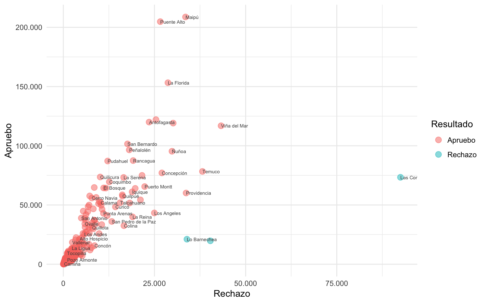
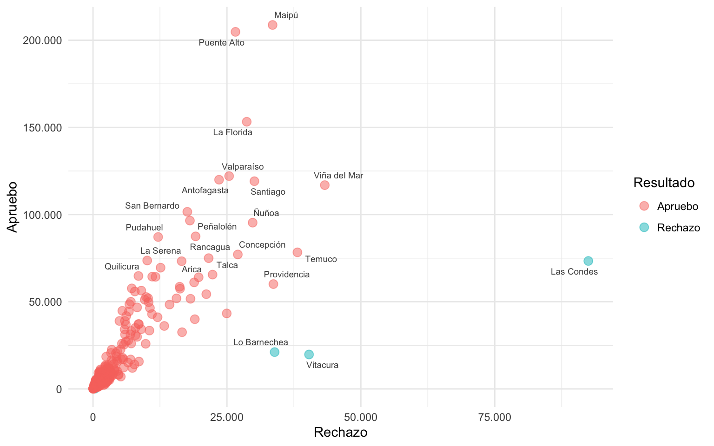
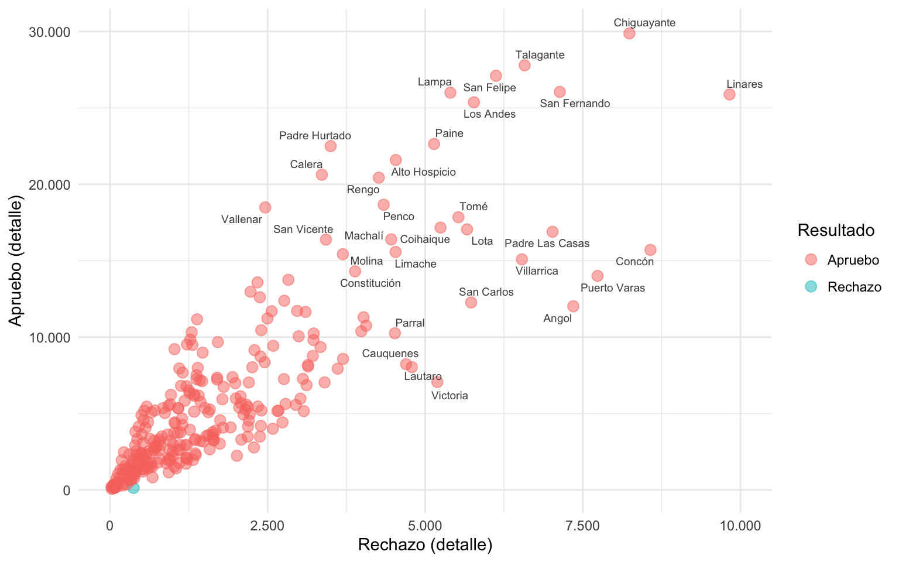

<link href="index_files/libs/htmltools-fill-0.5.8.1/fill.css" rel="stylesheet" />
<script src="index_files/libs/htmlwidgets-1.6.4/htmlwidgets.js"></script>
<script src="index_files/libs/d3-bundle-5.16.0/d3-bundle.min.js"></script>
<script src="index_files/libs/d3-lasso-0.0.5/d3-lasso.min.js"></script>
<script src="index_files/libs/save-svg-as-png-1.4.17/save-svg-as-png.min.js"></script>
<script src="index_files/libs/flatbush-4.4.0/flatbush.min.js"></script>
<link href="index_files/libs/ggiraphjs-0.8.10/ggiraphjs.min.css" rel="stylesheet" />
<script src="index_files/libs/ggiraphjs-0.8.10/ggiraphjs.min.js"></script>
<script src="index_files/libs/girafe-binding-0.8.10/girafe.js"></script>


En este post veremos cómo mejorar visualizaciones de datos a las que queremos agregarle texto que identifique las observaciones, aún cuando las observaciones son demasiadas como para etiquetarlas a todas. Usaremos el [paquete de R `{ggrepel}`](https://ggrepel.slowkow.com) para etiquetar puntos en un gráfico con textos que se repelen entre sí de forma automática.

{{< aviso "Este tutorial requiere conocimientos de `{ggplot2}`. Si necesitas aprender, revisa [este tutorial sobre visualización de datos](/blog/r_introduccion/tutorial_visualizacion_ggplot/) primero." >}}

### Datos

A modo de ejemplo, usaremos datos del [plebiscito de entrada de 2020 en Chile](https://www.bcn.cl/procesoconstituyente/plebiscito2020), obtenidos desde el [repositorio de datos sobre los plebiscitos constitucionales](https://github.com/bastianolea/plebiscitos_chile). Éste repositorio, parte de mi [mini sitio de datos sociales chilenos](https://bastianolea.github.io/datos_sociales/), ofrece versiones limpias y listas para usar de los resultados electorales de estos procesos.

``` r
library(arrow)

plebiscito <- read_parquet("https://github.com/bastianolea/plebiscitos_chile/raw/main/datos/plebiscito_2020_comunas.parquet")
```

Como los datos están alojados en el repositorio, pueden cargarse directamente en tu sesión de R tan sólo cargándolos desde el enlace anterior, sin necesidad de descargarse en tu computador.

Los datos vienen con cada fila representando una opción de voto por comuna del país, con su respectiva cantidad de votos, y se ven así:

``` r
library(dplyr)

head(plebiscito)
```

    # A tibble: 6 × 6
      cut_region region   cut_comuna comuna        opciones        votos
           <int> <chr>         <int> <chr>         <chr>           <dbl>
    1          1 Tarapacá       1101 Iquique       Apruebo         61103
    2          1 Tarapacá       1101 Iquique       Rechazo         18879
    3          1 Tarapacá       1101 Iquique       Votos En Blanco   114
    4          1 Tarapacá       1101 Iquique       Votos Nulos       275
    5          1 Tarapacá       1107 Alto Hospicio Apruebo         21589
    6          1 Tarapacá       1107 Alto Hospicio Rechazo          4534

## Procesamiento

Vamos a hacer un [gráfico de dispersión](https://bastianolea.rbind.io/blog/r_introduccion/tutorial_visualizacion_ggplot/#dispersión) con `{ggplot2}`, para el cual necesitamos dos columnas con las dos opciones de voto: apruebo y rechazo. Como en el conjunto de datos que cargamos las opciones vienen en una columna (`opciones`), y el conteo viene en otra (`votos`), transformaremos la estructura de los datos a un formato *ancho* usando `pivot_wider()`:

``` r
library(tidyr)

plebiscito_ancho <- plebiscito |> 
  pivot_wider(names_from = opciones, values_from = votos) |> 
  janitor::clean_names()
```

Lo que hizo `pivot_wider()` fue a usar la variable `opciones` para crear nuevas columnas, y la variable `votos` para rellenar las nuevas columnas con valores. De este modo, nuestros datos pasaron del formato largo al formato ancho, con una columna que contiene los votos del *apruebo* y otra del *rechazo*:

``` r
head(plebiscito_ancho)
```

    # A tibble: 6 × 8
      cut_region region   cut_comuna comuna        apruebo rechazo votos_en_blanco
           <int> <chr>         <int> <chr>           <dbl>   <dbl>           <dbl>
    1          1 Tarapacá       1101 Iquique         61103   18879             114
    2          1 Tarapacá       1107 Alto Hospicio   21589    4534              37
    3          1 Tarapacá       1401 Pozo Almonte     3730    1076              11
    4          1 Tarapacá       1402 Camiña            293     207               2
    5          1 Tarapacá       1403 Colchane          131     374               3
    6          1 Tarapacá       1404 Huara            1136     379               6
    # ℹ 1 more variable: votos_nulos <dbl>

Ahora usaremos `{dplyr}` para calcular qué opción ganó en cada comuna del país, y el porcentaje de votos que obtuvo:

``` r
library(dplyr)

plebiscito_comunas <- plebiscito_ancho |> 
  group_by(cut_comuna) |> 
  # calcular resultado final
  mutate(resultado = case_when(apruebo > rechazo ~ "Apruebo",
                               rechazo >= apruebo ~ "Rechazo"),
         .before = apruebo) |> 
  # calcular porcentaje de votos
  mutate(porcentaje = apruebo/(apruebo+rechazo)) |> 
  ungroup()
```

``` r
head(plebiscito_comunas)
```

    # A tibble: 6 × 10
      cut_region region  cut_comuna comuna resultado apruebo rechazo votos_en_blanco
           <int> <chr>        <int> <chr>  <chr>       <dbl>   <dbl>           <dbl>
    1          1 Tarapa…       1101 Iquiq… Apruebo     61103   18879             114
    2          1 Tarapa…       1107 Alto … Apruebo     21589    4534              37
    3          1 Tarapa…       1401 Pozo … Apruebo      3730    1076              11
    4          1 Tarapa…       1402 Camiña Apruebo       293     207               2
    5          1 Tarapa…       1403 Colch… Rechazo       131     374               3
    6          1 Tarapa…       1404 Huara  Apruebo      1136     379               6
    # ℹ 2 more variables: votos_nulos <dbl>, porcentaje <dbl>

### Gráfico

Para realizar un gráfico de densidad, y especificamos las dos variables que pondremos en los ejes *x* e *y*, y una variable que representará el color de cada observación, las cuales se visualizarán como puntos usando `geom_point()`:

``` r
library(ggplot2)

plebiscito_comunas |> 
  ggplot() +
  aes(rechazo, apruebo, color = resultado) +
  geom_point()
```


Ahora mejoraremos un poco el gráfico anterior: definiremos el formato de los números de las escalas con `scales::number_options()`, ajustaremos el tamaño transparencia de los puntos de `geom_point()`, luego aplicaremos escalas numéricas más bonitas con `scale_{x}_continuous()`, y finalmente ajustaremos un poco el tema y textos del gráfico:

``` r
library(scales)
# formato de números
number_options(decimal.mark = ",", big.mark = ".")

grafico_resultado <- plebiscito_comunas |> 
  ggplot() +
  aes(rechazo, apruebo, color = resultado) +
  geom_point(size = 3, alpha = 0.5) +
  scale_x_continuous(labels = label_number()) +
  scale_y_continuous(labels = label_number()) +
  theme_minimal() +
  theme(legend.text = element_text(margin = margin(l = 2))) +
  labs(x = "Rechazo", y = "Apruebo", color = "Resultado")

grafico_resultado
```


Ahora, al gráfico anterior, le agregaremos inocentemente etiquetas de texto a cada punto, a ver qué pasa:

``` r
grafico_resultado +
  geom_text(aes(label = comuna), size = 2, color = "grey30", hjust = 0)
```


Absolutamente nefasto. Son tantos puntos que los textos se transforman en una masa gris debido a la concentración.

Un intento desesperado de corregir esto podría ser el argumento `check_overlap`, eliminará los textos que aparezcan encima de otros:

``` r
grafico_resultado +
  geom_text(aes(label = comuna), size = 2, color = "grey30", hjust = 0,
            check_overlap = TRUE)
```



Sin embargo, esta solución es demasiado básica, y aún hay textos que aparece encima de puntos, o fuera del margen del gráfico.

En estos casos resulta ideal `geom_text_repel()` como reemplazo de `geom_text()`:

``` r
library(ggrepel)

grafico_resultado +
  geom_text_repel(aes(label = comuna), size = 2.5, color = "grey30",
                  point.padding = 2 # margen de cada punto
  )
```



La función `geom_text_repel()` calcula la posesión de las etiquetas de texto con respecto a las demás, y decide el posicionamiento óptimo para que la mayor cantidad de textos aparezcan, sin que salgan encima de otros textos, ni encima de los puntos.

Esta función tiene varios argumentos para ajustar el algoritmo que decide la ubicación de los textos. Uno de ellos es `max.overlaps`, cuyo defecto es 10, y determina la cantidad máxima de etiquetas que pueden estar unas encima de otras antes de qué sean descartadas por estar demasiado concentrados en un mismo lugar. Si aumentamos este argumento, la función tomará en cuenta etiquetas de texto en ubicaciones más complejas, e intentará graficarlas moviéndolas más lejos de los puntos, o moviendo otras etiquetas de texto a posiciones más lejanas del punto que lo origina. Para mejorar el resultado, podemos aumentar el valor del argumento `max.time`, el cual le da más tiempo al algoritmo para buscar resolver el posicionamiento de los textos.

``` r
grafico_resultado +
  geom_text_repel(aes(label = comuna), size = 2.5, color = "grey30",
                  segment.size = 0.1, # ancho de líneas (si es que salen)
                  max.overlaps = 30, max.time = 1)
```


En el gráfico anterior, aparecen nuevas etiquetas que no salieron antes, algunas de ellas conectadas por líneas con el punto correspondiente.

También podemos determinar ciertos parámetros para que aparezcan o no aparezcan ciertos textos en el gráfico. En el siguiente ejemplo, agregamos una condicional para que solamente aparezcan textos que superen ciertos valores de cada eje, excluyendo los demás.

``` r
grafico_resultado +
  geom_text_repel(aes(label = ifelse(rechazo > 30000 | apruebo > 100000, comuna, " ")), 
                  size = 2.5, color = "grey30",
                  segment.size = 0, max.overlaps = 30)
```


Es importante dejar las observaciones que queremos excluir de el etiquetado de texto con un texto vacío o un espacio (`" "`), y no solamente filtrar las observaciones del dataset, porque así los puntos del gráfico seguirán teniendo un texto vacío encima de ellos, lo que hará que el resto de las etiquetas de texto también se alejen de los puntos sin etiqueta.

Haremos un acercamiento al gráfico, definiendo los límites verticales y horizontales con `coord_cartesian()`, para que hayan puntos más dispersos:

``` r
grafico_resultado +
  coord_cartesian(xlim = c(0, 10000),
                  ylim = c(0, 50000),
                  clip = "off") +
  geom_text_repel(
    aes(label = ifelse(rechazo > 3000 & rechazo < 10000 
                       | apruebo > 20000 & apruebo < 50000, 
                       comuna, " ")), 
    size = 2.5, color = "grey30",
    segment.size = 0, max.overlaps = 30, max.time = 5)
```


En este caso aplicamos condicionales más estrictas para que aparezcan o desaparezcan los puntos, con el objetivo de que aparezca la mayor cantidad de textos de un sector específico del gráfico.

También podemos utilizar criterios estadísticos para incluir o excluir el etiquetado de textos. Por ejemplo, en el siguiente gráfico solamente mostramos el nombre de los puntos cuyo valor es superior al percentil 73 de cada variable.

``` r
grafico_resultado +
  geom_text_repel(aes(label = case_when(rechazo > quantile(rechazo, 0.73) ~ comuna, 
                                        apruebo > quantile(apruebo, 0.73) ~ comuna)), 
                  size = 2.5, color = "grey30", 
                  segment.size = 0, max.overlaps = 30, max.time = 5) +
  scale_x_continuous(labels = label_number(), limits = c(0, 10000)) +
  scale_y_continuous(labels = label_number(), limits = c(0, 30000)) +
  labs(x = "Rechazo (detalle)", y = "Apruebo (detalle)")
```



## Gráfico interactivo

Finalmente, una mejor solución para estos casos sería permitir a las y los usuarios explorar la información de todas las observaciones del gráfico mediante la interactividad. El [paquete `{ggiraph}` para visualizaciones interactivas](https://davidgohel.github.io/ggiraph/) nos puede ayudar a transformar cualquier gráfico de `{ggplot2}` en un gráfico interactivo, donde los usuarios pueden tocar o poner el Mouse encima de un elemento para obtener más información. Sólo es necesario agregarle `_interactive` a las funciones `geom_` del gráfico, y especificar el texto que aparecerá cuándo se ponga el cursor encima de cada elemento en `tooltip` dentro de `aes()`:

``` r
library(ggiraph)
library(glue)

grafico_interactivo <- plebiscito_comunas |> 
  ggplot() +
  aes(rechazo, apruebo, color = resultado) +
  geom_point_interactive(size = 3, alpha = 0.5,
                         aes(tooltip = glue("<b>{comuna}</b>: gana {resultado} con un {percent(porcentaje, 0.1)}"))
  ) +
  geom_text_repel(aes(label = comuna), size = 2.5, color = "grey30",
                  segment.size = 0.1, point.padding = 2) +
  scale_x_continuous(labels = label_number()) +
  scale_y_continuous(labels = label_number()) +
  theme_minimal() +
  theme(legend.text = element_text(margin = margin(l = 2))) +
  labs(x = "Rechazo", y = "Apruebo", color = "Resultado")
```

Para que el gráfico se vea y funcione interactivamente, debemos mostrarlo mediante la función `girafe()`:

``` r
girafe(ggobj = grafico_interactivo, 
       # dimensiones del gráfico
       width_svg = 7, height_svg = 5,
       # opciones para los tooltips
       options = list(
         # ocultar barra de opciones
         opts_toolbar(hidden = "selection", saveaspng = FALSE),
         # color al poner el cursor encima
         opts_hover(css = "fill: white; stroke: black;"),
         # personalizar la apariencia del tooltip
         opts_tooltip(opacity = 0.7, use_fill = TRUE,
                      css = "font-family: sans-serif; font-size: 70%; color: white; padding: 4px; border-radius: 5px;"))
)
```

<div class="girafe html-widget html-fill-item" id="htmlwidget-d8a8997257b1aef960cf" style="width:672px;height:480px;"></div>
<script type="application/json" data-for="htmlwidget-d8a8997257b1aef960cf">{"x":{"html":"<?xml version=\"1.0\" encoding=\"UTF-8\"?>\n<svg xmlns='http://www.w3.org/2000/svg' xmlns:xlink='http://www.w3.org/1999/xlink' class='ggiraph-svg' role='graphics-document' id='svg_cd97f874_0138_4211_9ea5_b8efc46b0cdb' viewBox='0 0 504 360'>\n <defs id='svg_cd97f874_0138_4211_9ea5_b8efc46b0cdb_defs'>\n  <clipPath id='svg_cd97f874_0138_4211_9ea5_b8efc46b0cdb_c1'>\n   <rect x='0' y='0' width='504' height='360'/>\n  <\/clipPath>\n  <clipPath id='svg_cd97f874_0138_4211_9ea5_b8efc46b0cdb_c2'>\n   <rect x='55.29' y='5.48' width='367.31' height='322.79'/>\n  <\/clipPath>\n <\/defs>\n <g id='svg_cd97f874_0138_4211_9ea5_b8efc46b0cdb_rootg' class='ggiraph-svg-rootg'>\n  <g clip-path='url(#svg_cd97f874_0138_4211_9ea5_b8efc46b0cdb_c1)'>\n   <rect x='0' y='0' width='504' height='360' fill='#FFFFFF' fill-opacity='1' stroke='#FFFFFF' stroke-opacity='1' stroke-width='0.75' stroke-linejoin='round' stroke-linecap='round' class='ggiraph-svg-bg'/>\n  <\/g>\n  <g clip-path='url(#svg_cd97f874_0138_4211_9ea5_b8efc46b0cdb_c2)'>\n   <polyline points='55.29,278.53 422.60,278.53' fill='none' stroke='#EBEBEB' stroke-opacity='1' stroke-width='0.53' stroke-linejoin='round' stroke-linecap='butt'/>\n   <polyline points='55.29,208.22 422.60,208.22' fill='none' stroke='#EBEBEB' stroke-opacity='1' stroke-width='0.53' stroke-linejoin='round' stroke-linecap='butt'/>\n   <polyline points='55.29,137.91 422.60,137.91' fill='none' stroke='#EBEBEB' stroke-opacity='1' stroke-width='0.53' stroke-linejoin='round' stroke-linecap='butt'/>\n   <polyline points='55.29,67.61 422.60,67.61' fill='none' stroke='#EBEBEB' stroke-opacity='1' stroke-width='0.53' stroke-linejoin='round' stroke-linecap='butt'/>\n   <polyline points='117.06,328.27 117.06,5.48' fill='none' stroke='#EBEBEB' stroke-opacity='1' stroke-width='0.53' stroke-linejoin='round' stroke-linecap='butt'/>\n   <polyline points='207.37,328.27 207.37,5.48' fill='none' stroke='#EBEBEB' stroke-opacity='1' stroke-width='0.53' stroke-linejoin='round' stroke-linecap='butt'/>\n   <polyline points='297.68,328.27 297.68,5.48' fill='none' stroke='#EBEBEB' stroke-opacity='1' stroke-width='0.53' stroke-linejoin='round' stroke-linecap='butt'/>\n   <polyline points='387.99,328.27 387.99,5.48' fill='none' stroke='#EBEBEB' stroke-opacity='1' stroke-width='0.53' stroke-linejoin='round' stroke-linecap='butt'/>\n   <polyline points='55.29,313.68 422.60,313.68' fill='none' stroke='#EBEBEB' stroke-opacity='1' stroke-width='1.07' stroke-linejoin='round' stroke-linecap='butt'/>\n   <polyline points='55.29,243.37 422.60,243.37' fill='none' stroke='#EBEBEB' stroke-opacity='1' stroke-width='1.07' stroke-linejoin='round' stroke-linecap='butt'/>\n   <polyline points='55.29,173.07 422.60,173.07' fill='none' stroke='#EBEBEB' stroke-opacity='1' stroke-width='1.07' stroke-linejoin='round' stroke-linecap='butt'/>\n   <polyline points='55.29,102.76 422.60,102.76' fill='none' stroke='#EBEBEB' stroke-opacity='1' stroke-width='1.07' stroke-linejoin='round' stroke-linecap='butt'/>\n   <polyline points='55.29,32.45 422.60,32.45' fill='none' stroke='#EBEBEB' stroke-opacity='1' stroke-width='1.07' stroke-linejoin='round' stroke-linecap='butt'/>\n   <polyline points='71.90,328.27 71.90,5.48' fill='none' stroke='#EBEBEB' stroke-opacity='1' stroke-width='1.07' stroke-linejoin='round' stroke-linecap='butt'/>\n   <polyline points='162.21,328.27 162.21,5.48' fill='none' stroke='#EBEBEB' stroke-opacity='1' stroke-width='1.07' stroke-linejoin='round' stroke-linecap='butt'/>\n   <polyline points='252.52,328.27 252.52,5.48' fill='none' stroke='#EBEBEB' stroke-opacity='1' stroke-width='1.07' stroke-linejoin='round' stroke-linecap='butt'/>\n   <polyline points='342.83,328.27 342.83,5.48' fill='none' stroke='#EBEBEB' stroke-opacity='1' stroke-width='1.07' stroke-linejoin='round' stroke-linecap='butt'/>\n   <circle id='svg_cd97f874_0138_4211_9ea5_b8efc46b0cdb_e1' cx='140.1' cy='227.76' r='2.67pt' fill='#F8766D' fill-opacity='0.5' stroke='#F8766D' stroke-opacity='0.5' stroke-width='0.71' stroke-linejoin='round' stroke-linecap='round' title='&amp;lt;b&amp;gt;Iquique&amp;lt;/b&amp;gt;: gana Apruebo con un 76,4%'/>\n   <circle id='svg_cd97f874_0138_4211_9ea5_b8efc46b0cdb_e2' cx='88.28' cy='283.33' r='2.67pt' fill='#F8766D' fill-opacity='0.5' stroke='#F8766D' stroke-opacity='0.5' stroke-width='0.71' stroke-linejoin='round' stroke-linecap='round' title='&amp;lt;b&amp;gt;Alto Hospicio&amp;lt;/b&amp;gt;: gana Apruebo con un 82,6%'/>\n   <circle id='svg_cd97f874_0138_4211_9ea5_b8efc46b0cdb_e3' cx='75.79' cy='308.44' r='2.67pt' fill='#F8766D' fill-opacity='0.5' stroke='#F8766D' stroke-opacity='0.5' stroke-width='0.71' stroke-linejoin='round' stroke-linecap='round' title='&amp;lt;b&amp;gt;Pozo Almonte&amp;lt;/b&amp;gt;: gana Apruebo con un 77,6%'/>\n   <circle id='svg_cd97f874_0138_4211_9ea5_b8efc46b0cdb_e4' cx='72.65' cy='313.27' r='2.67pt' fill='#F8766D' fill-opacity='0.5' stroke='#F8766D' stroke-opacity='0.5' stroke-width='0.71' stroke-linejoin='round' stroke-linecap='round' title='&amp;lt;b&amp;gt;Camiña&amp;lt;/b&amp;gt;: gana Apruebo con un 58,6%'/>\n   <circle id='svg_cd97f874_0138_4211_9ea5_b8efc46b0cdb_e5' cx='73.26' cy='313.5' r='2.67pt' fill='#00BFC4' fill-opacity='0.5' stroke='#00BFC4' stroke-opacity='0.5' stroke-width='0.71' stroke-linejoin='round' stroke-linecap='round' title='&amp;lt;b&amp;gt;Colchane&amp;lt;/b&amp;gt;: gana Rechazo con un 25,9%'/>\n   <circle id='svg_cd97f874_0138_4211_9ea5_b8efc46b0cdb_e6' cx='73.27' cy='312.09' r='2.67pt' fill='#F8766D' fill-opacity='0.5' stroke='#F8766D' stroke-opacity='0.5' stroke-width='0.71' stroke-linejoin='round' stroke-linecap='round' title='&amp;lt;b&amp;gt;Huara&amp;lt;/b&amp;gt;: gana Apruebo con un 75,0%'/>\n   <circle id='svg_cd97f874_0138_4211_9ea5_b8efc46b0cdb_e7' cx='74.24' cy='311.2' r='2.67pt' fill='#F8766D' fill-opacity='0.5' stroke='#F8766D' stroke-opacity='0.5' stroke-width='0.71' stroke-linejoin='round' stroke-linecap='round' title='&amp;lt;b&amp;gt;Pica&amp;lt;/b&amp;gt;: gana Apruebo con un 73,3%'/>\n   <circle id='svg_cd97f874_0138_4211_9ea5_b8efc46b0cdb_e8' cx='156.91' cy='144.96' r='2.67pt' fill='#F8766D' fill-opacity='0.5' stroke='#F8766D' stroke-opacity='0.5' stroke-width='0.71' stroke-linejoin='round' stroke-linecap='round' title='&amp;lt;b&amp;gt;Antofagasta&amp;lt;/b&amp;gt;: gana Apruebo con un 83,6%'/>\n   <circle id='svg_cd97f874_0138_4211_9ea5_b8efc46b0cdb_e9' cx='73.83' cy='307.25' r='2.67pt' fill='#F8766D' fill-opacity='0.5' stroke='#F8766D' stroke-opacity='0.5' stroke-width='0.71' stroke-linejoin='round' stroke-linecap='round' title='&amp;lt;b&amp;gt;Mejillones&amp;lt;/b&amp;gt;: gana Apruebo con un 89,6%'/>\n   <circle id='svg_cd97f874_0138_4211_9ea5_b8efc46b0cdb_e10' cx='72.28' cy='312.63' r='2.67pt' fill='#F8766D' fill-opacity='0.5' stroke='#F8766D' stroke-opacity='0.5' stroke-width='0.71' stroke-linejoin='round' stroke-linecap='round' title='&amp;lt;b&amp;gt;Sierra Gorda&amp;lt;/b&amp;gt;: gana Apruebo con un 87,8%'/>\n   <circle id='svg_cd97f874_0138_4211_9ea5_b8efc46b0cdb_e11' cx='73.95' cy='307.96' r='2.67pt' fill='#F8766D' fill-opacity='0.5' stroke='#F8766D' stroke-opacity='0.5' stroke-width='0.71' stroke-linejoin='round' stroke-linecap='round' title='&amp;lt;b&amp;gt;Taltal&amp;lt;/b&amp;gt;: gana Apruebo con un 87,8%'/>\n   <circle id='svg_cd97f874_0138_4211_9ea5_b8efc46b0cdb_e12' cx='109.04' cy='240.48' r='2.67pt' fill='#F8766D' fill-opacity='0.5' stroke='#F8766D' stroke-opacity='0.5' stroke-width='0.71' stroke-linejoin='round' stroke-linecap='round' title='&amp;lt;b&amp;gt;Calama&amp;lt;/b&amp;gt;: gana Apruebo con un 83,5%'/>\n   <circle id='svg_cd97f874_0138_4211_9ea5_b8efc46b0cdb_e13' cx='72.13' cy='313.24' r='2.67pt' fill='#F8766D' fill-opacity='0.5' stroke='#F8766D' stroke-opacity='0.5' stroke-width='0.71' stroke-linejoin='round' stroke-linecap='round' title='&amp;lt;b&amp;gt;Ollagüe&amp;lt;/b&amp;gt;: gana Apruebo con un 83,9%'/>\n   <circle id='svg_cd97f874_0138_4211_9ea5_b8efc46b0cdb_e14' cx='73.34' cy='309.59' r='2.67pt' fill='#F8766D' fill-opacity='0.5' stroke='#F8766D' stroke-opacity='0.5' stroke-width='0.71' stroke-linejoin='round' stroke-linecap='round' title='&amp;lt;b&amp;gt;San Pedro de Atacama&amp;lt;/b&amp;gt;: gana Apruebo con un 88,0%'/>\n   <circle id='svg_cd97f874_0138_4211_9ea5_b8efc46b0cdb_e15' cx='75.6' cy='300.73' r='2.67pt' fill='#F8766D' fill-opacity='0.5' stroke='#F8766D' stroke-opacity='0.5' stroke-width='0.71' stroke-linejoin='round' stroke-linecap='round' title='&amp;lt;b&amp;gt;Tocopilla&amp;lt;/b&amp;gt;: gana Apruebo con un 90,0%'/>\n   <circle id='svg_cd97f874_0138_4211_9ea5_b8efc46b0cdb_e16' cx='72.58' cy='310.96' r='2.67pt' fill='#F8766D' fill-opacity='0.5' stroke='#F8766D' stroke-opacity='0.5' stroke-width='0.71' stroke-linejoin='round' stroke-linecap='round' title='&amp;lt;b&amp;gt;María Elena&amp;lt;/b&amp;gt;: gana Apruebo con un 91,2%'/>\n   <circle id='svg_cd97f874_0138_4211_9ea5_b8efc46b0cdb_e17' cx='106.8' cy='241.76' r='2.67pt' fill='#F8766D' fill-opacity='0.5' stroke='#F8766D' stroke-opacity='0.5' stroke-width='0.71' stroke-linejoin='round' stroke-linecap='round' title='&amp;lt;b&amp;gt;Copiapó&amp;lt;/b&amp;gt;: gana Apruebo con un 84,1%'/>\n   <circle id='svg_cd97f874_0138_4211_9ea5_b8efc46b0cdb_e18' cx='75.98' cy='304.1' r='2.67pt' fill='#F8766D' fill-opacity='0.5' stroke='#F8766D' stroke-opacity='0.5' stroke-width='0.71' stroke-linejoin='round' stroke-linecap='round' title='&amp;lt;b&amp;gt;Caldera&amp;lt;/b&amp;gt;: gana Apruebo con un 85,8%'/>\n   <circle id='svg_cd97f874_0138_4211_9ea5_b8efc46b0cdb_e19' cx='74.29' cy='306.53' r='2.67pt' fill='#F8766D' fill-opacity='0.5' stroke='#F8766D' stroke-opacity='0.5' stroke-width='0.71' stroke-linejoin='round' stroke-linecap='round' title='&amp;lt;b&amp;gt;Tierra Amarilla&amp;lt;/b&amp;gt;: gana Apruebo con un 88,5%'/>\n   <circle id='svg_cd97f874_0138_4211_9ea5_b8efc46b0cdb_e20' cx='73.87' cy='306.39' r='2.67pt' fill='#F8766D' fill-opacity='0.5' stroke='#F8766D' stroke-opacity='0.5' stroke-width='0.71' stroke-linejoin='round' stroke-linecap='round' title='&amp;lt;b&amp;gt;Chañaral&amp;lt;/b&amp;gt;: gana Apruebo con un 90,5%'/>\n   <circle id='svg_cd97f874_0138_4211_9ea5_b8efc46b0cdb_e21' cx='73.71' cy='306.81' r='2.67pt' fill='#F8766D' fill-opacity='0.5' stroke='#F8766D' stroke-opacity='0.5' stroke-width='0.71' stroke-linejoin='round' stroke-linecap='round' title='&amp;lt;b&amp;gt;Diego de Almagro&amp;lt;/b&amp;gt;: gana Apruebo con un 90,7%'/>\n   <circle id='svg_cd97f874_0138_4211_9ea5_b8efc46b0cdb_e22' cx='80.8' cy='287.69' r='2.67pt' fill='#F8766D' fill-opacity='0.5' stroke='#F8766D' stroke-opacity='0.5' stroke-width='0.71' stroke-linejoin='round' stroke-linecap='round' title='&amp;lt;b&amp;gt;Vallenar&amp;lt;/b&amp;gt;: gana Apruebo con un 88,2%'/>\n   <circle id='svg_cd97f874_0138_4211_9ea5_b8efc46b0cdb_e23' cx='72.78' cy='311.49' r='2.67pt' fill='#F8766D' fill-opacity='0.5' stroke='#F8766D' stroke-opacity='0.5' stroke-width='0.71' stroke-linejoin='round' stroke-linecap='round' title='&amp;lt;b&amp;gt;Alto del Carmen&amp;lt;/b&amp;gt;: gana Apruebo con un 86,6%'/>\n   <circle id='svg_cd97f874_0138_4211_9ea5_b8efc46b0cdb_e24' cx='72.7' cy='310.22' r='2.67pt' fill='#F8766D' fill-opacity='0.5' stroke='#F8766D' stroke-opacity='0.5' stroke-width='0.71' stroke-linejoin='round' stroke-linecap='round' title='&amp;lt;b&amp;gt;Freirina&amp;lt;/b&amp;gt;: gana Apruebo con un 91,8%'/>\n   <circle id='svg_cd97f874_0138_4211_9ea5_b8efc46b0cdb_e25' cx='73.36' cy='308.33' r='2.67pt' fill='#F8766D' fill-opacity='0.5' stroke='#F8766D' stroke-opacity='0.5' stroke-width='0.71' stroke-linejoin='round' stroke-linecap='round' title='&amp;lt;b&amp;gt;Huasco&amp;lt;/b&amp;gt;: gana Apruebo con un 90,4%'/>\n   <circle id='svg_cd97f874_0138_4211_9ea5_b8efc46b0cdb_e26' cx='131.67' cy='210.68' r='2.67pt' fill='#F8766D' fill-opacity='0.5' stroke='#F8766D' stroke-opacity='0.5' stroke-width='0.71' stroke-linejoin='round' stroke-linecap='round' title='&amp;lt;b&amp;gt;La Serena&amp;lt;/b&amp;gt;: gana Apruebo con un 81,6%'/>\n   <circle id='svg_cd97f874_0138_4211_9ea5_b8efc46b0cdb_e27' cx='117.48' cy='215.9' r='2.67pt' fill='#F8766D' fill-opacity='0.5' stroke='#F8766D' stroke-opacity='0.5' stroke-width='0.71' stroke-linejoin='round' stroke-linecap='round' title='&amp;lt;b&amp;gt;Coquimbo&amp;lt;/b&amp;gt;: gana Apruebo con un 84,6%'/>\n   <circle id='svg_cd97f874_0138_4211_9ea5_b8efc46b0cdb_e28' cx='74.01' cy='306.02' r='2.67pt' fill='#F8766D' fill-opacity='0.5' stroke='#F8766D' stroke-opacity='0.5' stroke-width='0.71' stroke-linejoin='round' stroke-linecap='round' title='&amp;lt;b&amp;gt;Andacollo&amp;lt;/b&amp;gt;: gana Apruebo con un 90,4%'/>\n   <circle id='svg_cd97f874_0138_4211_9ea5_b8efc46b0cdb_e29' cx='72.65' cy='311.79' r='2.67pt' fill='#F8766D' fill-opacity='0.5' stroke='#F8766D' stroke-opacity='0.5' stroke-width='0.71' stroke-linejoin='round' stroke-linecap='round' title='&amp;lt;b&amp;gt;La Higuera&amp;lt;/b&amp;gt;: gana Apruebo con un 86,7%'/>\n   <circle id='svg_cd97f874_0138_4211_9ea5_b8efc46b0cdb_e30' cx='73.5' cy='310.93' r='2.67pt' fill='#F8766D' fill-opacity='0.5' stroke='#F8766D' stroke-opacity='0.5' stroke-width='0.71' stroke-linejoin='round' stroke-linecap='round' title='&amp;lt;b&amp;gt;Paiguano&amp;lt;/b&amp;gt;: gana Apruebo con un 81,6%'/>\n   <circle id='svg_cd97f874_0138_4211_9ea5_b8efc46b0cdb_e31' cx='76.63' cy='300.35' r='2.67pt' fill='#F8766D' fill-opacity='0.5' stroke='#F8766D' stroke-opacity='0.5' stroke-width='0.71' stroke-linejoin='round' stroke-linecap='round' title='&amp;lt;b&amp;gt;Vicuña&amp;lt;/b&amp;gt;: gana Apruebo con un 87,9%'/>\n   <circle id='svg_cd97f874_0138_4211_9ea5_b8efc46b0cdb_e32' cx='76.9' cy='297.98' r='2.67pt' fill='#F8766D' fill-opacity='0.5' stroke='#F8766D' stroke-opacity='0.5' stroke-width='0.71' stroke-linejoin='round' stroke-linecap='round' title='&amp;lt;b&amp;gt;Illapel&amp;lt;/b&amp;gt;: gana Apruebo con un 89,0%'/>\n   <circle id='svg_cd97f874_0138_4211_9ea5_b8efc46b0cdb_e33' cx='73.47' cy='309.01' r='2.67pt' fill='#F8766D' fill-opacity='0.5' stroke='#F8766D' stroke-opacity='0.5' stroke-width='0.71' stroke-linejoin='round' stroke-linecap='round' title='&amp;lt;b&amp;gt;Canela&amp;lt;/b&amp;gt;: gana Apruebo con un 88,5%'/>\n   <circle id='svg_cd97f874_0138_4211_9ea5_b8efc46b0cdb_e34' cx='76.07' cy='302.88' r='2.67pt' fill='#F8766D' fill-opacity='0.5' stroke='#F8766D' stroke-opacity='0.5' stroke-width='0.71' stroke-linejoin='round' stroke-linecap='round' title='&amp;lt;b&amp;gt;Los Vilos&amp;lt;/b&amp;gt;: gana Apruebo con un 86,9%'/>\n   <circle id='svg_cd97f874_0138_4211_9ea5_b8efc46b0cdb_e35' cx='77.22' cy='301.05' r='2.67pt' fill='#F8766D' fill-opacity='0.5' stroke='#F8766D' stroke-opacity='0.5' stroke-width='0.71' stroke-linejoin='round' stroke-linecap='round' title='&amp;lt;b&amp;gt;Salamanca&amp;lt;/b&amp;gt;: gana Apruebo con un 85,9%'/>\n   <circle id='svg_cd97f874_0138_4211_9ea5_b8efc46b0cdb_e36' cx='93.21' cy='265.62' r='2.67pt' fill='#F8766D' fill-opacity='0.5' stroke='#F8766D' stroke-opacity='0.5' stroke-width='0.71' stroke-linejoin='round' stroke-linecap='round' title='&amp;lt;b&amp;gt;Ovalle&amp;lt;/b&amp;gt;: gana Apruebo con un 85,3%'/>\n   <circle id='svg_cd97f874_0138_4211_9ea5_b8efc46b0cdb_e37' cx='74.09' cy='307.46' r='2.67pt' fill='#F8766D' fill-opacity='0.5' stroke='#F8766D' stroke-opacity='0.5' stroke-width='0.71' stroke-linejoin='round' stroke-linecap='round' title='&amp;lt;b&amp;gt;Combarbalá&amp;lt;/b&amp;gt;: gana Apruebo con un 88,0%'/>\n   <circle id='svg_cd97f874_0138_4211_9ea5_b8efc46b0cdb_e38' cx='76.51' cy='299.85' r='2.67pt' fill='#F8766D' fill-opacity='0.5' stroke='#F8766D' stroke-opacity='0.5' stroke-width='0.71' stroke-linejoin='round' stroke-linecap='round' title='&amp;lt;b&amp;gt;Monte Patria&amp;lt;/b&amp;gt;: gana Apruebo con un 88,5%'/>\n   <circle id='svg_cd97f874_0138_4211_9ea5_b8efc46b0cdb_e39' cx='73.73' cy='308.58' r='2.67pt' fill='#F8766D' fill-opacity='0.5' stroke='#F8766D' stroke-opacity='0.5' stroke-width='0.71' stroke-linejoin='round' stroke-linecap='round' title='&amp;lt;b&amp;gt;Punitaqui&amp;lt;/b&amp;gt;: gana Apruebo con un 87,8%'/>\n   <circle id='svg_cd97f874_0138_4211_9ea5_b8efc46b0cdb_e40' cx='72.87' cy='311.78' r='2.67pt' fill='#F8766D' fill-opacity='0.5' stroke='#F8766D' stroke-opacity='0.5' stroke-width='0.71' stroke-linejoin='round' stroke-linecap='round' title='&amp;lt;b&amp;gt;Río Hurtado&amp;lt;/b&amp;gt;: gana Apruebo con un 83,6%'/>\n   <circle id='svg_cd97f874_0138_4211_9ea5_b8efc46b0cdb_e41' cx='163.68' cy='142.04' r='2.67pt' fill='#F8766D' fill-opacity='0.5' stroke='#F8766D' stroke-opacity='0.5' stroke-width='0.71' stroke-linejoin='round' stroke-linecap='round' title='&amp;lt;b&amp;gt;Valparaíso&amp;lt;/b&amp;gt;: gana Apruebo con un 82,8%'/>\n   <circle id='svg_cd97f874_0138_4211_9ea5_b8efc46b0cdb_e42' cx='80.18' cy='300.82' r='2.67pt' fill='#F8766D' fill-opacity='0.5' stroke='#F8766D' stroke-opacity='0.5' stroke-width='0.71' stroke-linejoin='round' stroke-linecap='round' title='&amp;lt;b&amp;gt;Casablanca&amp;lt;/b&amp;gt;: gana Apruebo con un 80,0%'/>\n   <circle id='svg_cd97f874_0138_4211_9ea5_b8efc46b0cdb_e43' cx='102.87' cy='291.6' r='2.67pt' fill='#F8766D' fill-opacity='0.5' stroke='#F8766D' stroke-opacity='0.5' stroke-width='0.71' stroke-linejoin='round' stroke-linecap='round' title='&amp;lt;b&amp;gt;Concón&amp;lt;/b&amp;gt;: gana Apruebo con un 64,7%'/>\n   <circle id='svg_cd97f874_0138_4211_9ea5_b8efc46b0cdb_e44' cx='72.13' cy='313.15' r='2.67pt' fill='#F8766D' fill-opacity='0.5' stroke='#F8766D' stroke-opacity='0.5' stroke-width='0.71' stroke-linejoin='round' stroke-linecap='round' title='&amp;lt;b&amp;gt;Juan Fernández&amp;lt;/b&amp;gt;: gana Apruebo con un 85,9%'/>\n   <circle id='svg_cd97f874_0138_4211_9ea5_b8efc46b0cdb_e45' cx='76.86' cy='303.5' r='2.67pt' fill='#F8766D' fill-opacity='0.5' stroke='#F8766D' stroke-opacity='0.5' stroke-width='0.71' stroke-linejoin='round' stroke-linecap='round' title='&amp;lt;b&amp;gt;Puchuncaví&amp;lt;/b&amp;gt;: gana Apruebo con un 84,1%'/>\n   <circle id='svg_cd97f874_0138_4211_9ea5_b8efc46b0cdb_e46' cx='80.57' cy='298.99' r='2.67pt' fill='#F8766D' fill-opacity='0.5' stroke='#F8766D' stroke-opacity='0.5' stroke-width='0.71' stroke-linejoin='round' stroke-linecap='round' title='&amp;lt;b&amp;gt;Quintero&amp;lt;/b&amp;gt;: gana Apruebo con un 81,3%'/>\n   <circle id='svg_cd97f874_0138_4211_9ea5_b8efc46b0cdb_e47' cx='228.19' cy='149.32' r='2.67pt' fill='#F8766D' fill-opacity='0.5' stroke='#F8766D' stroke-opacity='0.5' stroke-width='0.71' stroke-linejoin='round' stroke-linecap='round' title='&amp;lt;b&amp;gt;Viña del Mar&amp;lt;/b&amp;gt;: gana Apruebo con un 73,0%'/>\n   <circle id='svg_cd97f874_0138_4211_9ea5_b8efc46b0cdb_e48' cx='73.41' cy='310.46' r='2.67pt' fill='#F8766D' fill-opacity='0.5' stroke='#F8766D' stroke-opacity='0.5' stroke-width='0.71' stroke-linejoin='round' stroke-linecap='round' title='&amp;lt;b&amp;gt;Isla de Pascua&amp;lt;/b&amp;gt;: gana Apruebo con un 84,6%'/>\n   <circle id='svg_cd97f874_0138_4211_9ea5_b8efc46b0cdb_e49' cx='92.76' cy='278.01' r='2.67pt' fill='#F8766D' fill-opacity='0.5' stroke='#F8766D' stroke-opacity='0.5' stroke-width='0.71' stroke-linejoin='round' stroke-linecap='round' title='&amp;lt;b&amp;gt;Los Andes&amp;lt;/b&amp;gt;: gana Apruebo con un 81,5%'/>\n   <circle id='svg_cd97f874_0138_4211_9ea5_b8efc46b0cdb_e50' cx='75.35' cy='305.8' r='2.67pt' fill='#F8766D' fill-opacity='0.5' stroke='#F8766D' stroke-opacity='0.5' stroke-width='0.71' stroke-linejoin='round' stroke-linecap='round' title='&amp;lt;b&amp;gt;Calle Larga&amp;lt;/b&amp;gt;: gana Apruebo con un 85,4%'/>\n   <circle id='svg_cd97f874_0138_4211_9ea5_b8efc46b0cdb_e51' cx='75.65' cy='307.54' r='2.67pt' fill='#F8766D' fill-opacity='0.5' stroke='#F8766D' stroke-opacity='0.5' stroke-width='0.71' stroke-linejoin='round' stroke-linecap='round' title='&amp;lt;b&amp;gt;Rinconada&amp;lt;/b&amp;gt;: gana Apruebo con un 80,8%'/>\n   <circle id='svg_cd97f874_0138_4211_9ea5_b8efc46b0cdb_e52' cx='77.19' cy='303.68' r='2.67pt' fill='#F8766D' fill-opacity='0.5' stroke='#F8766D' stroke-opacity='0.5' stroke-width='0.71' stroke-linejoin='round' stroke-linecap='round' title='&amp;lt;b&amp;gt;San Esteban&amp;lt;/b&amp;gt;: gana Apruebo con un 83,0%'/>\n   <circle id='svg_cd97f874_0138_4211_9ea5_b8efc46b0cdb_e53' cx='80.36' cy='294.59' r='2.67pt' fill='#F8766D' fill-opacity='0.5' stroke='#F8766D' stroke-opacity='0.5' stroke-width='0.71' stroke-linejoin='round' stroke-linecap='round' title='&amp;lt;b&amp;gt;La Ligua&amp;lt;/b&amp;gt;: gana Apruebo con un 85,3%'/>\n   <circle id='svg_cd97f874_0138_4211_9ea5_b8efc46b0cdb_e54' cx='75.88' cy='302.51' r='2.67pt' fill='#F8766D' fill-opacity='0.5' stroke='#F8766D' stroke-opacity='0.5' stroke-width='0.71' stroke-linejoin='round' stroke-linecap='round' title='&amp;lt;b&amp;gt;Cabildo&amp;lt;/b&amp;gt;: gana Apruebo con un 87,8%'/>\n   <circle id='svg_cd97f874_0138_4211_9ea5_b8efc46b0cdb_e55' cx='74.44' cy='309.77' r='2.67pt' fill='#F8766D' fill-opacity='0.5' stroke='#F8766D' stroke-opacity='0.5' stroke-width='0.71' stroke-linejoin='round' stroke-linecap='round' title='&amp;lt;b&amp;gt;Papudo&amp;lt;/b&amp;gt;: gana Apruebo con un 79,9%'/>\n   <circle id='svg_cd97f874_0138_4211_9ea5_b8efc46b0cdb_e56' cx='73.56' cy='307.85' r='2.67pt' fill='#F8766D' fill-opacity='0.5' stroke='#F8766D' stroke-opacity='0.5' stroke-width='0.71' stroke-linejoin='round' stroke-linecap='round' title='&amp;lt;b&amp;gt;Petorca&amp;lt;/b&amp;gt;: gana Apruebo con un 90,1%'/>\n   <circle id='svg_cd97f874_0138_4211_9ea5_b8efc46b0cdb_e57' cx='77.84' cy='309.11' r='2.67pt' fill='#F8766D' fill-opacity='0.5' stroke='#F8766D' stroke-opacity='0.5' stroke-width='0.71' stroke-linejoin='round' stroke-linecap='round' title='&amp;lt;b&amp;gt;Zapallar&amp;lt;/b&amp;gt;: gana Apruebo con un 66,4%'/>\n   <circle id='svg_cd97f874_0138_4211_9ea5_b8efc46b0cdb_e58' cx='100.56' cy='270.27' r='2.67pt' fill='#F8766D' fill-opacity='0.5' stroke='#F8766D' stroke-opacity='0.5' stroke-width='0.71' stroke-linejoin='round' stroke-linecap='round' title='&amp;lt;b&amp;gt;Quillota&amp;lt;/b&amp;gt;: gana Apruebo con un 79,6%'/>\n   <circle id='svg_cd97f874_0138_4211_9ea5_b8efc46b0cdb_e59' cx='84.05' cy='284.68' r='2.67pt' fill='#F8766D' fill-opacity='0.5' stroke='#F8766D' stroke-opacity='0.5' stroke-width='0.71' stroke-linejoin='round' stroke-linecap='round' title='&amp;lt;b&amp;gt;Calera&amp;lt;/b&amp;gt;: gana Apruebo con un 86,0%'/>\n   <circle id='svg_cd97f874_0138_4211_9ea5_b8efc46b0cdb_e60' cx='76.48' cy='304.77' r='2.67pt' fill='#F8766D' fill-opacity='0.5' stroke='#F8766D' stroke-opacity='0.5' stroke-width='0.71' stroke-linejoin='round' stroke-linecap='round' title='&amp;lt;b&amp;gt;Hijuelas&amp;lt;/b&amp;gt;: gana Apruebo con un 83,4%'/>\n   <circle id='svg_cd97f874_0138_4211_9ea5_b8efc46b0cdb_e61' cx='79.09' cy='303.85' r='2.67pt' fill='#F8766D' fill-opacity='0.5' stroke='#F8766D' stroke-opacity='0.5' stroke-width='0.71' stroke-linejoin='round' stroke-linecap='round' title='&amp;lt;b&amp;gt;La Cruz&amp;lt;/b&amp;gt;: gana Apruebo con un 77,9%'/>\n   <circle id='svg_cd97f874_0138_4211_9ea5_b8efc46b0cdb_e62' cx='76.32' cy='300.3' r='2.67pt' fill='#F8766D' fill-opacity='0.5' stroke='#F8766D' stroke-opacity='0.5' stroke-width='0.71' stroke-linejoin='round' stroke-linecap='round' title='&amp;lt;b&amp;gt;Nogales&amp;lt;/b&amp;gt;: gana Apruebo con un 88,6%'/>\n   <circle id='svg_cd97f874_0138_4211_9ea5_b8efc46b0cdb_e63' cx='89.75' cy='258.89' r='2.67pt' fill='#F8766D' fill-opacity='0.5' stroke='#F8766D' stroke-opacity='0.5' stroke-width='0.71' stroke-linejoin='round' stroke-linecap='round' title='&amp;lt;b&amp;gt;San Antonio&amp;lt;/b&amp;gt;: gana Apruebo con un 88,8%'/>\n   <circle id='svg_cd97f874_0138_4211_9ea5_b8efc46b0cdb_e64' cx='79.56' cy='306.75' r='2.67pt' fill='#F8766D' fill-opacity='0.5' stroke='#F8766D' stroke-opacity='0.5' stroke-width='0.71' stroke-linejoin='round' stroke-linecap='round' title='&amp;lt;b&amp;gt;Algarrobo&amp;lt;/b&amp;gt;: gana Apruebo con un 70,0%'/>\n   <circle id='svg_cd97f874_0138_4211_9ea5_b8efc46b0cdb_e65' cx='78.05' cy='303.35' r='2.67pt' fill='#F8766D' fill-opacity='0.5' stroke='#F8766D' stroke-opacity='0.5' stroke-width='0.71' stroke-linejoin='round' stroke-linecap='round' title='&amp;lt;b&amp;gt;Cartagena&amp;lt;/b&amp;gt;: gana Apruebo con un 81,2%'/>\n   <circle id='svg_cd97f874_0138_4211_9ea5_b8efc46b0cdb_e66' cx='77.1' cy='305.57' r='2.67pt' fill='#F8766D' fill-opacity='0.5' stroke='#F8766D' stroke-opacity='0.5' stroke-width='0.71' stroke-linejoin='round' stroke-linecap='round' title='&amp;lt;b&amp;gt;El Quisco&amp;lt;/b&amp;gt;: gana Apruebo con un 80,1%'/>\n   <circle id='svg_cd97f874_0138_4211_9ea5_b8efc46b0cdb_e67' cx='76.03' cy='307.11' r='2.67pt' fill='#F8766D' fill-opacity='0.5' stroke='#F8766D' stroke-opacity='0.5' stroke-width='0.71' stroke-linejoin='round' stroke-linecap='round' title='&amp;lt;b&amp;gt;El Tabo&amp;lt;/b&amp;gt;: gana Apruebo con un 80,4%'/>\n   <circle id='svg_cd97f874_0138_4211_9ea5_b8efc46b0cdb_e68' cx='81.24' cy='308.05' r='2.67pt' fill='#F8766D' fill-opacity='0.5' stroke='#F8766D' stroke-opacity='0.5' stroke-width='0.71' stroke-linejoin='round' stroke-linecap='round' title='&amp;lt;b&amp;gt;Santo Domingo&amp;lt;/b&amp;gt;: gana Apruebo con un 60,8%'/>\n   <circle id='svg_cd97f874_0138_4211_9ea5_b8efc46b0cdb_e69' cx='94.02' cy='275.57' r='2.67pt' fill='#F8766D' fill-opacity='0.5' stroke='#F8766D' stroke-opacity='0.5' stroke-width='0.71' stroke-linejoin='round' stroke-linecap='round' title='&amp;lt;b&amp;gt;San Felipe&amp;lt;/b&amp;gt;: gana Apruebo con un 81,6%'/>\n   <circle id='svg_cd97f874_0138_4211_9ea5_b8efc46b0cdb_e70' cx='74.47' cy='306.37' r='2.67pt' fill='#F8766D' fill-opacity='0.5' stroke='#F8766D' stroke-opacity='0.5' stroke-width='0.71' stroke-linejoin='round' stroke-linecap='round' title='&amp;lt;b&amp;gt;Catemu&amp;lt;/b&amp;gt;: gana Apruebo con un 88,0%'/>\n   <circle id='svg_cd97f874_0138_4211_9ea5_b8efc46b0cdb_e71' cx='74.5' cy='309.66' r='2.67pt' fill='#F8766D' fill-opacity='0.5' stroke='#F8766D' stroke-opacity='0.5' stroke-width='0.71' stroke-linejoin='round' stroke-linecap='round' title='&amp;lt;b&amp;gt;Panquehue&amp;lt;/b&amp;gt;: gana Apruebo con un 79,9%'/>\n   <circle id='svg_cd97f874_0138_4211_9ea5_b8efc46b0cdb_e72' cx='75.4' cy='304.93' r='2.67pt' fill='#F8766D' fill-opacity='0.5' stroke='#F8766D' stroke-opacity='0.5' stroke-width='0.71' stroke-linejoin='round' stroke-linecap='round' title='&amp;lt;b&amp;gt;Putaendo&amp;lt;/b&amp;gt;: gana Apruebo con un 86,5%'/>\n   <circle id='svg_cd97f874_0138_4211_9ea5_b8efc46b0cdb_e73' cx='75.82' cy='306.17' r='2.67pt' fill='#F8766D' fill-opacity='0.5' stroke='#F8766D' stroke-opacity='0.5' stroke-width='0.71' stroke-linejoin='round' stroke-linecap='round' title='&amp;lt;b&amp;gt;Santa María&amp;lt;/b&amp;gt;: gana Apruebo con un 83,1%'/>\n   <circle id='svg_cd97f874_0138_4211_9ea5_b8efc46b0cdb_e74' cx='130.6' cy='232.87' r='2.67pt' fill='#F8766D' fill-opacity='0.5' stroke='#F8766D' stroke-opacity='0.5' stroke-width='0.71' stroke-linejoin='round' stroke-linecap='round' title='&amp;lt;b&amp;gt;Quilpué&amp;lt;/b&amp;gt;: gana Apruebo con un 78,0%'/>\n   <circle id='svg_cd97f874_0138_4211_9ea5_b8efc46b0cdb_e75' cx='88.27' cy='291.79' r='2.67pt' fill='#F8766D' fill-opacity='0.5' stroke='#F8766D' stroke-opacity='0.5' stroke-width='0.71' stroke-linejoin='round' stroke-linecap='round' title='&amp;lt;b&amp;gt;Limache&amp;lt;/b&amp;gt;: gana Apruebo con un 77,5%'/>\n   <circle id='svg_cd97f874_0138_4211_9ea5_b8efc46b0cdb_e76' cx='79.12' cy='305.27' r='2.67pt' fill='#F8766D' fill-opacity='0.5' stroke='#F8766D' stroke-opacity='0.5' stroke-width='0.71' stroke-linejoin='round' stroke-linecap='round' title='&amp;lt;b&amp;gt;Olmué&amp;lt;/b&amp;gt;: gana Apruebo con un 75,0%'/>\n   <circle id='svg_cd97f874_0138_4211_9ea5_b8efc46b0cdb_e77' cx='115.45' cy='255.88' r='2.67pt' fill='#F8766D' fill-opacity='0.5' stroke='#F8766D' stroke-opacity='0.5' stroke-width='0.71' stroke-linejoin='round' stroke-linecap='round' title='&amp;lt;b&amp;gt;Villa Alemana&amp;lt;/b&amp;gt;: gana Apruebo con un 77,3%'/>\n   <circle id='svg_cd97f874_0138_4211_9ea5_b8efc46b0cdb_e78' cx='141.1' cy='190.65' r='2.67pt' fill='#F8766D' fill-opacity='0.5' stroke='#F8766D' stroke-opacity='0.5' stroke-width='0.71' stroke-linejoin='round' stroke-linecap='round' title='&amp;lt;b&amp;gt;Rancagua&amp;lt;/b&amp;gt;: gana Apruebo con un 82,0%'/>\n   <circle id='svg_cd97f874_0138_4211_9ea5_b8efc46b0cdb_e79' cx='75.05' cy='306.6' r='2.67pt' fill='#F8766D' fill-opacity='0.5' stroke='#F8766D' stroke-opacity='0.5' stroke-width='0.71' stroke-linejoin='round' stroke-linecap='round' title='&amp;lt;b&amp;gt;Codegua&amp;lt;/b&amp;gt;: gana Apruebo con un 85,2%'/>\n   <circle id='svg_cd97f874_0138_4211_9ea5_b8efc46b0cdb_e80' cx='74.44' cy='310' r='2.67pt' fill='#F8766D' fill-opacity='0.5' stroke='#F8766D' stroke-opacity='0.5' stroke-width='0.71' stroke-linejoin='round' stroke-linecap='round' title='&amp;lt;b&amp;gt;Coinco&amp;lt;/b&amp;gt;: gana Apruebo con un 78,9%'/>\n   <circle id='svg_cd97f874_0138_4211_9ea5_b8efc46b0cdb_e81' cx='76.75' cy='305.03' r='2.67pt' fill='#F8766D' fill-opacity='0.5' stroke='#F8766D' stroke-opacity='0.5' stroke-width='0.71' stroke-linejoin='round' stroke-linecap='round' title='&amp;lt;b&amp;gt;Coltauco&amp;lt;/b&amp;gt;: gana Apruebo con un 82,1%'/>\n   <circle id='svg_cd97f874_0138_4211_9ea5_b8efc46b0cdb_e82' cx='76.94' cy='302.45' r='2.67pt' fill='#F8766D' fill-opacity='0.5' stroke='#F8766D' stroke-opacity='0.5' stroke-width='0.71' stroke-linejoin='round' stroke-linecap='round' title='&amp;lt;b&amp;gt;Doñihue&amp;lt;/b&amp;gt;: gana Apruebo con un 85,1%'/>\n   <circle id='svg_cd97f874_0138_4211_9ea5_b8efc46b0cdb_e83' cx='79.96' cy='295.45' r='2.67pt' fill='#F8766D' fill-opacity='0.5' stroke='#F8766D' stroke-opacity='0.5' stroke-width='0.71' stroke-linejoin='round' stroke-linecap='round' title='&amp;lt;b&amp;gt;Graneros&amp;lt;/b&amp;gt;: gana Apruebo con un 85,3%'/>\n   <circle id='svg_cd97f874_0138_4211_9ea5_b8efc46b0cdb_e84' cx='77.06' cy='303.58' r='2.67pt' fill='#F8766D' fill-opacity='0.5' stroke='#F8766D' stroke-opacity='0.5' stroke-width='0.71' stroke-linejoin='round' stroke-linecap='round' title='&amp;lt;b&amp;gt;Las Cabras&amp;lt;/b&amp;gt;: gana Apruebo con un 83,4%'/>\n   <circle id='svg_cd97f874_0138_4211_9ea5_b8efc46b0cdb_e85' cx='88.02' cy='290.63' r='2.67pt' fill='#F8766D' fill-opacity='0.5' stroke='#F8766D' stroke-opacity='0.5' stroke-width='0.71' stroke-linejoin='round' stroke-linecap='round' title='&amp;lt;b&amp;gt;Machalí&amp;lt;/b&amp;gt;: gana Apruebo con un 78,6%'/>\n   <circle id='svg_cd97f874_0138_4211_9ea5_b8efc46b0cdb_e86' cx='76.06' cy='307.71' r='2.67pt' fill='#F8766D' fill-opacity='0.5' stroke='#F8766D' stroke-opacity='0.5' stroke-width='0.71' stroke-linejoin='round' stroke-linecap='round' title='&amp;lt;b&amp;gt;Malloa&amp;lt;/b&amp;gt;: gana Apruebo con un 78,7%'/>\n   <circle id='svg_cd97f874_0138_4211_9ea5_b8efc46b0cdb_e87' cx='78.09' cy='300.08' r='2.67pt' fill='#F8766D' fill-opacity='0.5' stroke='#F8766D' stroke-opacity='0.5' stroke-width='0.71' stroke-linejoin='round' stroke-linecap='round' title='&amp;lt;b&amp;gt;Mostazal&amp;lt;/b&amp;gt;: gana Apruebo con un 85,0%'/>\n   <circle id='svg_cd97f874_0138_4211_9ea5_b8efc46b0cdb_e88' cx='76.73' cy='306.48' r='2.67pt' fill='#F8766D' fill-opacity='0.5' stroke='#F8766D' stroke-opacity='0.5' stroke-width='0.71' stroke-linejoin='round' stroke-linecap='round' title='&amp;lt;b&amp;gt;Olivar&amp;lt;/b&amp;gt;: gana Apruebo con un 79,3%'/>\n   <circle id='svg_cd97f874_0138_4211_9ea5_b8efc46b0cdb_e89' cx='74.95' cy='306.15' r='2.67pt' fill='#F8766D' fill-opacity='0.5' stroke='#F8766D' stroke-opacity='0.5' stroke-width='0.71' stroke-linejoin='round' stroke-linecap='round' title='&amp;lt;b&amp;gt;Peumo&amp;lt;/b&amp;gt;: gana Apruebo con un 86,4%'/>\n   <circle id='svg_cd97f874_0138_4211_9ea5_b8efc46b0cdb_e90' cx='75.81' cy='306.16' r='2.67pt' fill='#F8766D' fill-opacity='0.5' stroke='#F8766D' stroke-opacity='0.5' stroke-width='0.71' stroke-linejoin='round' stroke-linecap='round' title='&amp;lt;b&amp;gt;Pichidegua&amp;lt;/b&amp;gt;: gana Apruebo con un 83,2%'/>\n   <circle id='svg_cd97f874_0138_4211_9ea5_b8efc46b0cdb_e91' cx='75.26' cy='305.94' r='2.67pt' fill='#F8766D' fill-opacity='0.5' stroke='#F8766D' stroke-opacity='0.5' stroke-width='0.71' stroke-linejoin='round' stroke-linecap='round' title='&amp;lt;b&amp;gt;Quinta de Tilcoco&amp;lt;/b&amp;gt;: gana Apruebo con un 85,6%'/>\n   <circle id='svg_cd97f874_0138_4211_9ea5_b8efc46b0cdb_e92' cx='87.31' cy='284.95' r='2.67pt' fill='#F8766D' fill-opacity='0.5' stroke='#F8766D' stroke-opacity='0.5' stroke-width='0.71' stroke-linejoin='round' stroke-linecap='round' title='&amp;lt;b&amp;gt;Rengo&amp;lt;/b&amp;gt;: gana Apruebo con un 82,7%'/>\n   <circle id='svg_cd97f874_0138_4211_9ea5_b8efc46b0cdb_e93' cx='81.26' cy='300.43' r='2.67pt' fill='#F8766D' fill-opacity='0.5' stroke='#F8766D' stroke-opacity='0.5' stroke-width='0.71' stroke-linejoin='round' stroke-linecap='round' title='&amp;lt;b&amp;gt;Requínoa&amp;lt;/b&amp;gt;: gana Apruebo con un 78,4%'/>\n   <circle id='svg_cd97f874_0138_4211_9ea5_b8efc46b0cdb_e94' cx='84.28' cy='290.65' r='2.67pt' fill='#F8766D' fill-opacity='0.5' stroke='#F8766D' stroke-opacity='0.5' stroke-width='0.71' stroke-linejoin='round' stroke-linecap='round' title='&amp;lt;b&amp;gt;San Vicente&amp;lt;/b&amp;gt;: gana Apruebo con un 82,7%'/>\n   <circle id='svg_cd97f874_0138_4211_9ea5_b8efc46b0cdb_e95' cx='76.99' cy='305' r='2.67pt' fill='#F8766D' fill-opacity='0.5' stroke='#F8766D' stroke-opacity='0.5' stroke-width='0.71' stroke-linejoin='round' stroke-linecap='round' title='&amp;lt;b&amp;gt;Pichilemu&amp;lt;/b&amp;gt;: gana Apruebo con un 81,4%'/>\n   <circle id='svg_cd97f874_0138_4211_9ea5_b8efc46b0cdb_e96' cx='73.04' cy='312.05' r='2.67pt' fill='#F8766D' fill-opacity='0.5' stroke='#F8766D' stroke-opacity='0.5' stroke-width='0.71' stroke-linejoin='round' stroke-linecap='round' title='&amp;lt;b&amp;gt;La Estrella&amp;lt;/b&amp;gt;: gana Apruebo con un 78,6%'/>\n   <circle id='svg_cd97f874_0138_4211_9ea5_b8efc46b0cdb_e97' cx='73.88' cy='310.91' r='2.67pt' fill='#F8766D' fill-opacity='0.5' stroke='#F8766D' stroke-opacity='0.5' stroke-width='0.71' stroke-linejoin='round' stroke-linecap='round' title='&amp;lt;b&amp;gt;Litueche&amp;lt;/b&amp;gt;: gana Apruebo con un 78,3%'/>\n   <circle id='svg_cd97f874_0138_4211_9ea5_b8efc46b0cdb_e98' cx='73.71' cy='310.3' r='2.67pt' fill='#F8766D' fill-opacity='0.5' stroke='#F8766D' stroke-opacity='0.5' stroke-width='0.71' stroke-linejoin='round' stroke-linecap='round' title='&amp;lt;b&amp;gt;Marchihue&amp;lt;/b&amp;gt;: gana Apruebo con un 82,8%'/>\n   <circle id='svg_cd97f874_0138_4211_9ea5_b8efc46b0cdb_e99' cx='73.96' cy='310.42' r='2.67pt' fill='#F8766D' fill-opacity='0.5' stroke='#F8766D' stroke-opacity='0.5' stroke-width='0.71' stroke-linejoin='round' stroke-linecap='round' title='&amp;lt;b&amp;gt;Navidad&amp;lt;/b&amp;gt;: gana Apruebo con un 80,3%'/>\n   <circle id='svg_cd97f874_0138_4211_9ea5_b8efc46b0cdb_e100' cx='73.59' cy='310.91' r='2.67pt' fill='#F8766D' fill-opacity='0.5' stroke='#F8766D' stroke-opacity='0.5' stroke-width='0.71' stroke-linejoin='round' stroke-linecap='round' title='&amp;lt;b&amp;gt;Paredones&amp;lt;/b&amp;gt;: gana Apruebo con un 80,9%'/>\n   <circle id='svg_cd97f874_0138_4211_9ea5_b8efc46b0cdb_e101' cx='97.68' cy='277.06' r='2.67pt' fill='#F8766D' fill-opacity='0.5' stroke='#F8766D' stroke-opacity='0.5' stroke-width='0.71' stroke-linejoin='round' stroke-linecap='round' title='&amp;lt;b&amp;gt;San Fernando&amp;lt;/b&amp;gt;: gana Apruebo con un 78,5%'/>\n   <circle id='svg_cd97f874_0138_4211_9ea5_b8efc46b0cdb_e102' cx='75.95' cy='308.38' r='2.67pt' fill='#F8766D' fill-opacity='0.5' stroke='#F8766D' stroke-opacity='0.5' stroke-width='0.71' stroke-linejoin='round' stroke-linecap='round' title='&amp;lt;b&amp;gt;Chépica&amp;lt;/b&amp;gt;: gana Apruebo con un 77,1%'/>\n   <circle id='svg_cd97f874_0138_4211_9ea5_b8efc46b0cdb_e103' cx='80.93' cy='297.91' r='2.67pt' fill='#F8766D' fill-opacity='0.5' stroke='#F8766D' stroke-opacity='0.5' stroke-width='0.71' stroke-linejoin='round' stroke-linecap='round' title='&amp;lt;b&amp;gt;Chimbarongo&amp;lt;/b&amp;gt;: gana Apruebo con un 81,8%'/>\n   <circle id='svg_cd97f874_0138_4211_9ea5_b8efc46b0cdb_e104' cx='74.05' cy='311.13' r='2.67pt' fill='#F8766D' fill-opacity='0.5' stroke='#F8766D' stroke-opacity='0.5' stroke-width='0.71' stroke-linejoin='round' stroke-linecap='round' title='&amp;lt;b&amp;gt;Lolol&amp;lt;/b&amp;gt;: gana Apruebo con un 75,4%'/>\n   <circle id='svg_cd97f874_0138_4211_9ea5_b8efc46b0cdb_e105' cx='76.19' cy='305.47' r='2.67pt' fill='#F8766D' fill-opacity='0.5' stroke='#F8766D' stroke-opacity='0.5' stroke-width='0.71' stroke-linejoin='round' stroke-linecap='round' title='&amp;lt;b&amp;gt;Nancagua&amp;lt;/b&amp;gt;: gana Apruebo con un 83,1%'/>\n   <circle id='svg_cd97f874_0138_4211_9ea5_b8efc46b0cdb_e106' cx='74.87' cy='308.76' r='2.67pt' fill='#F8766D' fill-opacity='0.5' stroke='#F8766D' stroke-opacity='0.5' stroke-width='0.71' stroke-linejoin='round' stroke-linecap='round' title='&amp;lt;b&amp;gt;Palmilla&amp;lt;/b&amp;gt;: gana Apruebo con un 81,0%'/>\n   <circle id='svg_cd97f874_0138_4211_9ea5_b8efc46b0cdb_e107' cx='75.2' cy='308.61' r='2.67pt' fill='#F8766D' fill-opacity='0.5' stroke='#F8766D' stroke-opacity='0.5' stroke-width='0.71' stroke-linejoin='round' stroke-linecap='round' title='&amp;lt;b&amp;gt;Peralillo&amp;lt;/b&amp;gt;: gana Apruebo con un 79,8%'/>\n   <circle id='svg_cd97f874_0138_4211_9ea5_b8efc46b0cdb_e108' cx='74.44' cy='309.15' r='2.67pt' fill='#F8766D' fill-opacity='0.5' stroke='#F8766D' stroke-opacity='0.5' stroke-width='0.71' stroke-linejoin='round' stroke-linecap='round' title='&amp;lt;b&amp;gt;Placilla&amp;lt;/b&amp;gt;: gana Apruebo con un 82,1%'/>\n   <circle id='svg_cd97f874_0138_4211_9ea5_b8efc46b0cdb_e109' cx='73.14' cy='311.96' r='2.67pt' fill='#F8766D' fill-opacity='0.5' stroke='#F8766D' stroke-opacity='0.5' stroke-width='0.71' stroke-linejoin='round' stroke-linecap='round' title='&amp;lt;b&amp;gt;Pumanque&amp;lt;/b&amp;gt;: gana Apruebo con un 78,1%'/>\n   <circle id='svg_cd97f874_0138_4211_9ea5_b8efc46b0cdb_e110' cx='83.58' cy='299.28' r='2.67pt' fill='#F8766D' fill-opacity='0.5' stroke='#F8766D' stroke-opacity='0.5' stroke-width='0.71' stroke-linejoin='round' stroke-linecap='round' title='&amp;lt;b&amp;gt;Santa Cruz&amp;lt;/b&amp;gt;: gana Apruebo con un 76,0%'/>\n   <circle id='svg_cd97f874_0138_4211_9ea5_b8efc46b0cdb_e111' cx='149.89' cy='208.24' r='2.67pt' fill='#F8766D' fill-opacity='0.5' stroke='#F8766D' stroke-opacity='0.5' stroke-width='0.71' stroke-linejoin='round' stroke-linecap='round' title='&amp;lt;b&amp;gt;Talca&amp;lt;/b&amp;gt;: gana Apruebo con un 77,6%'/>\n   <circle id='svg_cd97f874_0138_4211_9ea5_b8efc46b0cdb_e112' cx='85.95' cy='293.57' r='2.67pt' fill='#F8766D' fill-opacity='0.5' stroke='#F8766D' stroke-opacity='0.5' stroke-width='0.71' stroke-linejoin='round' stroke-linecap='round' title='&amp;lt;b&amp;gt;Constitución&amp;lt;/b&amp;gt;: gana Apruebo con un 78,6%'/>\n   <circle id='svg_cd97f874_0138_4211_9ea5_b8efc46b0cdb_e113' cx='74.56' cy='309.76' r='2.67pt' fill='#F8766D' fill-opacity='0.5' stroke='#F8766D' stroke-opacity='0.5' stroke-width='0.71' stroke-linejoin='round' stroke-linecap='round' title='&amp;lt;b&amp;gt;Curepto&amp;lt;/b&amp;gt;: gana Apruebo con un 79,1%'/>\n   <circle id='svg_cd97f874_0138_4211_9ea5_b8efc46b0cdb_e114' cx='74.35' cy='312.53' r='2.67pt' fill='#F8766D' fill-opacity='0.5' stroke='#F8766D' stroke-opacity='0.5' stroke-width='0.71' stroke-linejoin='round' stroke-linecap='round' title='&amp;lt;b&amp;gt;Empedrado&amp;lt;/b&amp;gt;: gana Apruebo con un 54,8%'/>\n   <circle id='svg_cd97f874_0138_4211_9ea5_b8efc46b0cdb_e115' cx='80.77' cy='301.93' r='2.67pt' fill='#F8766D' fill-opacity='0.5' stroke='#F8766D' stroke-opacity='0.5' stroke-width='0.71' stroke-linejoin='round' stroke-linecap='round' title='&amp;lt;b&amp;gt;Maule&amp;lt;/b&amp;gt;: gana Apruebo con un 77,3%'/>\n   <circle id='svg_cd97f874_0138_4211_9ea5_b8efc46b0cdb_e116' cx='74.73' cy='310.04' r='2.67pt' fill='#F8766D' fill-opacity='0.5' stroke='#F8766D' stroke-opacity='0.5' stroke-width='0.71' stroke-linejoin='round' stroke-linecap='round' title='&amp;lt;b&amp;gt;Pelarco&amp;lt;/b&amp;gt;: gana Apruebo con un 76,8%'/>\n   <circle id='svg_cd97f874_0138_4211_9ea5_b8efc46b0cdb_e117' cx='76.31' cy='309.57' r='2.67pt' fill='#F8766D' fill-opacity='0.5' stroke='#F8766D' stroke-opacity='0.5' stroke-width='0.71' stroke-linejoin='round' stroke-linecap='round' title='&amp;lt;b&amp;gt;Pencahue&amp;lt;/b&amp;gt;: gana Apruebo con un 70,6%'/>\n   <circle id='svg_cd97f874_0138_4211_9ea5_b8efc46b0cdb_e118' cx='75.58' cy='308.43' r='2.67pt' fill='#F8766D' fill-opacity='0.5' stroke='#F8766D' stroke-opacity='0.5' stroke-width='0.71' stroke-linejoin='round' stroke-linecap='round' title='&amp;lt;b&amp;gt;Río Claro&amp;lt;/b&amp;gt;: gana Apruebo con un 78,6%'/>\n   <circle id='svg_cd97f874_0138_4211_9ea5_b8efc46b0cdb_e119' cx='83.11' cy='297.31' r='2.67pt' fill='#F8766D' fill-opacity='0.5' stroke='#F8766D' stroke-opacity='0.5' stroke-width='0.71' stroke-linejoin='round' stroke-linecap='round' title='&amp;lt;b&amp;gt;San Clemente&amp;lt;/b&amp;gt;: gana Apruebo con un 79,0%'/>\n   <circle id='svg_cd97f874_0138_4211_9ea5_b8efc46b0cdb_e120' cx='74.78' cy='309.56' r='2.67pt' fill='#F8766D' fill-opacity='0.5' stroke='#F8766D' stroke-opacity='0.5' stroke-width='0.71' stroke-linejoin='round' stroke-linecap='round' title='&amp;lt;b&amp;gt;San Rafael&amp;lt;/b&amp;gt;: gana Apruebo con un 78,7%'/>\n   <circle id='svg_cd97f874_0138_4211_9ea5_b8efc46b0cdb_e121' cx='88.87' cy='302.11' r='2.67pt' fill='#F8766D' fill-opacity='0.5' stroke='#F8766D' stroke-opacity='0.5' stroke-width='0.71' stroke-linejoin='round' stroke-linecap='round' title='&amp;lt;b&amp;gt;Cauquenes&amp;lt;/b&amp;gt;: gana Apruebo con un 63,7%'/>\n   <circle id='svg_cd97f874_0138_4211_9ea5_b8efc46b0cdb_e122' cx='75.86' cy='311.2' r='2.67pt' fill='#F8766D' fill-opacity='0.5' stroke='#F8766D' stroke-opacity='0.5' stroke-width='0.71' stroke-linejoin='round' stroke-linecap='round' title='&amp;lt;b&amp;gt;Chanco&amp;lt;/b&amp;gt;: gana Apruebo con un 61,7%'/>\n   <circle id='svg_cd97f874_0138_4211_9ea5_b8efc46b0cdb_e123' cx='75.34' cy='310.95' r='2.67pt' fill='#F8766D' fill-opacity='0.5' stroke='#F8766D' stroke-opacity='0.5' stroke-width='0.71' stroke-linejoin='round' stroke-linecap='round' title='&amp;lt;b&amp;gt;Pelluhue&amp;lt;/b&amp;gt;: gana Apruebo con un 67,1%'/>\n   <circle id='svg_cd97f874_0138_4211_9ea5_b8efc46b0cdb_e124' cx='123.55' cy='245.64' r='2.67pt' fill='#F8766D' fill-opacity='0.5' stroke='#F8766D' stroke-opacity='0.5' stroke-width='0.71' stroke-linejoin='round' stroke-linecap='round' title='&amp;lt;b&amp;gt;Curicó&amp;lt;/b&amp;gt;: gana Apruebo con un 77,2%'/>\n   <circle id='svg_cd97f874_0138_4211_9ea5_b8efc46b0cdb_e125' cx='74.74' cy='309.04' r='2.67pt' fill='#F8766D' fill-opacity='0.5' stroke='#F8766D' stroke-opacity='0.5' stroke-width='0.71' stroke-linejoin='round' stroke-linecap='round' title='&amp;lt;b&amp;gt;Hualañé&amp;lt;/b&amp;gt;: gana Apruebo con un 80,8%'/>\n   <circle id='svg_cd97f874_0138_4211_9ea5_b8efc46b0cdb_e126' cx='73.68' cy='310.29' r='2.67pt' fill='#F8766D' fill-opacity='0.5' stroke='#F8766D' stroke-opacity='0.5' stroke-width='0.71' stroke-linejoin='round' stroke-linecap='round' title='&amp;lt;b&amp;gt;Licantén&amp;lt;/b&amp;gt;: gana Apruebo con un 83,1%'/>\n   <circle id='svg_cd97f874_0138_4211_9ea5_b8efc46b0cdb_e127' cx='85.25' cy='291.99' r='2.67pt' fill='#F8766D' fill-opacity='0.5' stroke='#F8766D' stroke-opacity='0.5' stroke-width='0.71' stroke-linejoin='round' stroke-linecap='round' title='&amp;lt;b&amp;gt;Molina&amp;lt;/b&amp;gt;: gana Apruebo con un 80,7%'/>\n   <circle id='svg_cd97f874_0138_4211_9ea5_b8efc46b0cdb_e128' cx='75.36' cy='309.14' r='2.67pt' fill='#F8766D' fill-opacity='0.5' stroke='#F8766D' stroke-opacity='0.5' stroke-width='0.71' stroke-linejoin='round' stroke-linecap='round' title='&amp;lt;b&amp;gt;Rauco&amp;lt;/b&amp;gt;: gana Apruebo con un 77,2%'/>\n   <circle id='svg_cd97f874_0138_4211_9ea5_b8efc46b0cdb_e129' cx='78.22' cy='307.27' r='2.67pt' fill='#F8766D' fill-opacity='0.5' stroke='#F8766D' stroke-opacity='0.5' stroke-width='0.71' stroke-linejoin='round' stroke-linecap='round' title='&amp;lt;b&amp;gt;Romeral&amp;lt;/b&amp;gt;: gana Apruebo con un 72,3%'/>\n   <circle id='svg_cd97f874_0138_4211_9ea5_b8efc46b0cdb_e130' cx='76.73' cy='304.89' r='2.67pt' fill='#F8766D' fill-opacity='0.5' stroke='#F8766D' stroke-opacity='0.5' stroke-width='0.71' stroke-linejoin='round' stroke-linecap='round' title='&amp;lt;b&amp;gt;Sagrada Familia&amp;lt;/b&amp;gt;: gana Apruebo con un 82,4%'/>\n   <circle id='svg_cd97f874_0138_4211_9ea5_b8efc46b0cdb_e131' cx='80.06' cy='302.39' r='2.67pt' fill='#F8766D' fill-opacity='0.5' stroke='#F8766D' stroke-opacity='0.5' stroke-width='0.71' stroke-linejoin='round' stroke-linecap='round' title='&amp;lt;b&amp;gt;Teno&amp;lt;/b&amp;gt;: gana Apruebo con un 78,0%'/>\n   <circle id='svg_cd97f874_0138_4211_9ea5_b8efc46b0cdb_e132' cx='74.25' cy='311.48' r='2.67pt' fill='#F8766D' fill-opacity='0.5' stroke='#F8766D' stroke-opacity='0.5' stroke-width='0.71' stroke-linejoin='round' stroke-linecap='round' title='&amp;lt;b&amp;gt;Vichuquén&amp;lt;/b&amp;gt;: gana Apruebo con un 70,7%'/>\n   <circle id='svg_cd97f874_0138_4211_9ea5_b8efc46b0cdb_e133' cx='107.41' cy='277.29' r='2.67pt' fill='#F8766D' fill-opacity='0.5' stroke='#F8766D' stroke-opacity='0.5' stroke-width='0.71' stroke-linejoin='round' stroke-linecap='round' title='&amp;lt;b&amp;gt;Linares&amp;lt;/b&amp;gt;: gana Apruebo con un 72,5%'/>\n   <circle id='svg_cd97f874_0138_4211_9ea5_b8efc46b0cdb_e134' cx='77.34' cy='306.12' r='2.67pt' fill='#F8766D' fill-opacity='0.5' stroke='#F8766D' stroke-opacity='0.5' stroke-width='0.71' stroke-linejoin='round' stroke-linecap='round' title='&amp;lt;b&amp;gt;Colbún&amp;lt;/b&amp;gt;: gana Apruebo con un 78,1%'/>\n   <circle id='svg_cd97f874_0138_4211_9ea5_b8efc46b0cdb_e135' cx='80.38' cy='306.01' r='2.67pt' fill='#F8766D' fill-opacity='0.5' stroke='#F8766D' stroke-opacity='0.5' stroke-width='0.71' stroke-linejoin='round' stroke-linecap='round' title='&amp;lt;b&amp;gt;Longaví&amp;lt;/b&amp;gt;: gana Apruebo con un 69,9%'/>\n   <circle id='svg_cd97f874_0138_4211_9ea5_b8efc46b0cdb_e136' cx='88.23' cy='299.27' r='2.67pt' fill='#F8766D' fill-opacity='0.5' stroke='#F8766D' stroke-opacity='0.5' stroke-width='0.71' stroke-linejoin='round' stroke-linecap='round' title='&amp;lt;b&amp;gt;Parral&amp;lt;/b&amp;gt;: gana Apruebo con un 69,4%'/>\n   <circle id='svg_cd97f874_0138_4211_9ea5_b8efc46b0cdb_e137' cx='77.56' cy='308.64' r='2.67pt' fill='#F8766D' fill-opacity='0.5' stroke='#F8766D' stroke-opacity='0.5' stroke-width='0.71' stroke-linejoin='round' stroke-linecap='round' title='&amp;lt;b&amp;gt;Retiro&amp;lt;/b&amp;gt;: gana Apruebo con un 69,6%'/>\n   <circle id='svg_cd97f874_0138_4211_9ea5_b8efc46b0cdb_e138' cx='86.43' cy='297.79' r='2.67pt' fill='#F8766D' fill-opacity='0.5' stroke='#F8766D' stroke-opacity='0.5' stroke-width='0.71' stroke-linejoin='round' stroke-linecap='round' title='&amp;lt;b&amp;gt;San Javier&amp;lt;/b&amp;gt;: gana Apruebo con un 73,8%'/>\n   <circle id='svg_cd97f874_0138_4211_9ea5_b8efc46b0cdb_e139' cx='77.79' cy='308.38' r='2.67pt' fill='#F8766D' fill-opacity='0.5' stroke='#F8766D' stroke-opacity='0.5' stroke-width='0.71' stroke-linejoin='round' stroke-linecap='round' title='&amp;lt;b&amp;gt;Villa Alegre&amp;lt;/b&amp;gt;: gana Apruebo con un 69,9%'/>\n   <circle id='svg_cd97f874_0138_4211_9ea5_b8efc46b0cdb_e140' cx='77.96' cy='308.23' r='2.67pt' fill='#F8766D' fill-opacity='0.5' stroke='#F8766D' stroke-opacity='0.5' stroke-width='0.71' stroke-linejoin='round' stroke-linecap='round' title='&amp;lt;b&amp;gt;Yerbas Buenas&amp;lt;/b&amp;gt;: gana Apruebo con un 69,9%'/>\n   <circle id='svg_cd97f874_0138_4211_9ea5_b8efc46b0cdb_e141' cx='169.55' cy='205.26' r='2.67pt' fill='#F8766D' fill-opacity='0.5' stroke='#F8766D' stroke-opacity='0.5' stroke-width='0.71' stroke-linejoin='round' stroke-linecap='round' title='&amp;lt;b&amp;gt;Concepción&amp;lt;/b&amp;gt;: gana Apruebo con un 74,0%'/>\n   <circle id='svg_cd97f874_0138_4211_9ea5_b8efc46b0cdb_e142' cx='109.94' cy='266.63' r='2.67pt' fill='#F8766D' fill-opacity='0.5' stroke='#F8766D' stroke-opacity='0.5' stroke-width='0.71' stroke-linejoin='round' stroke-linecap='round' title='&amp;lt;b&amp;gt;Coronel&amp;lt;/b&amp;gt;: gana Apruebo con un 76,1%'/>\n   <circle id='svg_cd97f874_0138_4211_9ea5_b8efc46b0cdb_e143' cx='101.67' cy='271.67' r='2.67pt' fill='#F8766D' fill-opacity='0.5' stroke='#F8766D' stroke-opacity='0.5' stroke-width='0.71' stroke-linejoin='round' stroke-linecap='round' title='&amp;lt;b&amp;gt;Chiguayante&amp;lt;/b&amp;gt;: gana Apruebo con un 78,4%'/>\n   <circle id='svg_cd97f874_0138_4211_9ea5_b8efc46b0cdb_e144' cx='75.91' cy='310.01' r='2.67pt' fill='#F8766D' fill-opacity='0.5' stroke='#F8766D' stroke-opacity='0.5' stroke-width='0.71' stroke-linejoin='round' stroke-linecap='round' title='&amp;lt;b&amp;gt;Florida&amp;lt;/b&amp;gt;: gana Apruebo con un 70,2%'/>\n   <circle id='svg_cd97f874_0138_4211_9ea5_b8efc46b0cdb_e145' cx='78.93' cy='303.31' r='2.67pt' fill='#F8766D' fill-opacity='0.5' stroke='#F8766D' stroke-opacity='0.5' stroke-width='0.71' stroke-linejoin='round' stroke-linecap='round' title='&amp;lt;b&amp;gt;Hualqui&amp;lt;/b&amp;gt;: gana Apruebo con un 79,1%'/>\n   <circle id='svg_cd97f874_0138_4211_9ea5_b8efc46b0cdb_e146' cx='92.37' cy='289.71' r='2.67pt' fill='#F8766D' fill-opacity='0.5' stroke='#F8766D' stroke-opacity='0.5' stroke-width='0.71' stroke-linejoin='round' stroke-linecap='round' title='&amp;lt;b&amp;gt;Lota&amp;lt;/b&amp;gt;: gana Apruebo con un 75,1%'/>\n   <circle id='svg_cd97f874_0138_4211_9ea5_b8efc46b0cdb_e147' cx='87.59' cy='287.44' r='2.67pt' fill='#F8766D' fill-opacity='0.5' stroke='#F8766D' stroke-opacity='0.5' stroke-width='0.71' stroke-linejoin='round' stroke-linecap='round' title='&amp;lt;b&amp;gt;Penco&amp;lt;/b&amp;gt;: gana Apruebo con un 81,1%'/>\n   <circle id='svg_cd97f874_0138_4211_9ea5_b8efc46b0cdb_e148' cx='119.97' cy='262.92' r='2.67pt' fill='#F8766D' fill-opacity='0.5' stroke='#F8766D' stroke-opacity='0.5' stroke-width='0.71' stroke-linejoin='round' stroke-linecap='round' title='&amp;lt;b&amp;gt;San Pedro de la Paz&amp;lt;/b&amp;gt;: gana Apruebo con un 73,1%'/>\n   <circle id='svg_cd97f874_0138_4211_9ea5_b8efc46b0cdb_e149' cx='77.44' cy='308.7' r='2.67pt' fill='#F8766D' fill-opacity='0.5' stroke='#F8766D' stroke-opacity='0.5' stroke-width='0.71' stroke-linejoin='round' stroke-linecap='round' title='&amp;lt;b&amp;gt;Santa Juana&amp;lt;/b&amp;gt;: gana Apruebo con un 69,8%'/>\n   <circle id='svg_cd97f874_0138_4211_9ea5_b8efc46b0cdb_e150' cx='128.22' cy='240.66' r='2.67pt' fill='#F8766D' fill-opacity='0.5' stroke='#F8766D' stroke-opacity='0.5' stroke-width='0.71' stroke-linejoin='round' stroke-linecap='round' title='&amp;lt;b&amp;gt;Talcahuano&amp;lt;/b&amp;gt;: gana Apruebo con un 76,9%'/>\n   <circle id='svg_cd97f874_0138_4211_9ea5_b8efc46b0cdb_e151' cx='91.87' cy='288.59' r='2.67pt' fill='#F8766D' fill-opacity='0.5' stroke='#F8766D' stroke-opacity='0.5' stroke-width='0.71' stroke-linejoin='round' stroke-linecap='round' title='&amp;lt;b&amp;gt;Tomé&amp;lt;/b&amp;gt;: gana Apruebo con un 76,4%'/>\n   <circle id='svg_cd97f874_0138_4211_9ea5_b8efc46b0cdb_e152' cx='104.44' cy='265.51' r='2.67pt' fill='#F8766D' fill-opacity='0.5' stroke='#F8766D' stroke-opacity='0.5' stroke-width='0.71' stroke-linejoin='round' stroke-linecap='round' title='&amp;lt;b&amp;gt;Hualpén&amp;lt;/b&amp;gt;: gana Apruebo con un 79,2%'/>\n   <circle id='svg_cd97f874_0138_4211_9ea5_b8efc46b0cdb_e153' cx='81.97' cy='305.77' r='2.67pt' fill='#F8766D' fill-opacity='0.5' stroke='#F8766D' stroke-opacity='0.5' stroke-width='0.71' stroke-linejoin='round' stroke-linecap='round' title='&amp;lt;b&amp;gt;Lebu&amp;lt;/b&amp;gt;: gana Apruebo con un 66,9%'/>\n   <circle id='svg_cd97f874_0138_4211_9ea5_b8efc46b0cdb_e154' cx='86.3' cy='299.09' r='2.67pt' fill='#F8766D' fill-opacity='0.5' stroke='#F8766D' stroke-opacity='0.5' stroke-width='0.71' stroke-linejoin='round' stroke-linecap='round' title='&amp;lt;b&amp;gt;Arauco&amp;lt;/b&amp;gt;: gana Apruebo con un 72,2%'/>\n   <circle id='svg_cd97f874_0138_4211_9ea5_b8efc46b0cdb_e155' cx='84.21' cy='303.79' r='2.67pt' fill='#F8766D' fill-opacity='0.5' stroke='#F8766D' stroke-opacity='0.5' stroke-width='0.71' stroke-linejoin='round' stroke-linecap='round' title='&amp;lt;b&amp;gt;Cañete&amp;lt;/b&amp;gt;: gana Apruebo con un 67,4%'/>\n   <circle id='svg_cd97f874_0138_4211_9ea5_b8efc46b0cdb_e156' cx='75.28' cy='312.07' r='2.67pt' fill='#F8766D' fill-opacity='0.5' stroke='#F8766D' stroke-opacity='0.5' stroke-width='0.71' stroke-linejoin='round' stroke-linecap='round' title='&amp;lt;b&amp;gt;Contulmo&amp;lt;/b&amp;gt;: gana Apruebo con un 55,2%'/>\n   <circle id='svg_cd97f874_0138_4211_9ea5_b8efc46b0cdb_e157' cx='83.57' cy='299.89' r='2.67pt' fill='#F8766D' fill-opacity='0.5' stroke='#F8766D' stroke-opacity='0.5' stroke-width='0.71' stroke-linejoin='round' stroke-linecap='round' title='&amp;lt;b&amp;gt;Curanilahue&amp;lt;/b&amp;gt;: gana Apruebo con un 75,2%'/>\n   <circle id='svg_cd97f874_0138_4211_9ea5_b8efc46b0cdb_e158' cx='80.55' cy='307.79' r='2.67pt' fill='#F8766D' fill-opacity='0.5' stroke='#F8766D' stroke-opacity='0.5' stroke-width='0.71' stroke-linejoin='round' stroke-linecap='round' title='&amp;lt;b&amp;gt;Los Alamos&amp;lt;/b&amp;gt;: gana Apruebo con un 63,7%'/>\n   <circle id='svg_cd97f874_0138_4211_9ea5_b8efc46b0cdb_e159' cx='75.29' cy='310.73' r='2.67pt' fill='#F8766D' fill-opacity='0.5' stroke='#F8766D' stroke-opacity='0.5' stroke-width='0.71' stroke-linejoin='round' stroke-linecap='round' title='&amp;lt;b&amp;gt;Tirúa&amp;lt;/b&amp;gt;: gana Apruebo con un 69,1%'/>\n   <circle id='svg_cd97f874_0138_4211_9ea5_b8efc46b0cdb_e160' cx='162.09' cy='252.81' r='2.67pt' fill='#F8766D' fill-opacity='0.5' stroke='#F8766D' stroke-opacity='0.5' stroke-width='0.71' stroke-linejoin='round' stroke-linecap='round' title='&amp;lt;b&amp;gt;Los Angeles&amp;lt;/b&amp;gt;: gana Apruebo con un 63,4%'/>\n   <circle id='svg_cd97f874_0138_4211_9ea5_b8efc46b0cdb_e161' cx='73.46' cy='311.8' r='2.67pt' fill='#F8766D' fill-opacity='0.5' stroke='#F8766D' stroke-opacity='0.5' stroke-width='0.71' stroke-linejoin='round' stroke-linecap='round' title='&amp;lt;b&amp;gt;Antuco&amp;lt;/b&amp;gt;: gana Apruebo con un 75,7%'/>\n   <circle id='svg_cd97f874_0138_4211_9ea5_b8efc46b0cdb_e162' cx='83.17' cy='304.04' r='2.67pt' fill='#F8766D' fill-opacity='0.5' stroke='#F8766D' stroke-opacity='0.5' stroke-width='0.71' stroke-linejoin='round' stroke-linecap='round' title='&amp;lt;b&amp;gt;Cabrero&amp;lt;/b&amp;gt;: gana Apruebo con un 68,7%'/>\n   <circle id='svg_cd97f874_0138_4211_9ea5_b8efc46b0cdb_e163' cx='79.86' cy='303.8' r='2.67pt' fill='#F8766D' fill-opacity='0.5' stroke='#F8766D' stroke-opacity='0.5' stroke-width='0.71' stroke-linejoin='round' stroke-linecap='round' title='&amp;lt;b&amp;gt;Laja&amp;lt;/b&amp;gt;: gana Apruebo con un 76,1%'/>\n   <circle id='svg_cd97f874_0138_4211_9ea5_b8efc46b0cdb_e164' cx='81.88' cy='303.49' r='2.67pt' fill='#F8766D' fill-opacity='0.5' stroke='#F8766D' stroke-opacity='0.5' stroke-width='0.71' stroke-linejoin='round' stroke-linecap='round' title='&amp;lt;b&amp;gt;Mulchén&amp;lt;/b&amp;gt;: gana Apruebo con un 72,4%'/>\n   <circle id='svg_cd97f874_0138_4211_9ea5_b8efc46b0cdb_e165' cx='82.96' cy='303.46' r='2.67pt' fill='#F8766D' fill-opacity='0.5' stroke='#F8766D' stroke-opacity='0.5' stroke-width='0.71' stroke-linejoin='round' stroke-linecap='round' title='&amp;lt;b&amp;gt;Nacimiento&amp;lt;/b&amp;gt;: gana Apruebo con un 70,4%'/>\n   <circle id='svg_cd97f874_0138_4211_9ea5_b8efc46b0cdb_e166' cx='76.82' cy='310.47' r='2.67pt' fill='#F8766D' fill-opacity='0.5' stroke='#F8766D' stroke-opacity='0.5' stroke-width='0.71' stroke-linejoin='round' stroke-linecap='round' title='&amp;lt;b&amp;gt;Negrete&amp;lt;/b&amp;gt;: gana Apruebo con un 62,7%'/>\n   <circle id='svg_cd97f874_0138_4211_9ea5_b8efc46b0cdb_e167' cx='73.38' cy='312.1' r='2.67pt' fill='#F8766D' fill-opacity='0.5' stroke='#F8766D' stroke-opacity='0.5' stroke-width='0.71' stroke-linejoin='round' stroke-linecap='round' title='&amp;lt;b&amp;gt;Quilaco&amp;lt;/b&amp;gt;: gana Apruebo con un 73,3%'/>\n   <circle id='svg_cd97f874_0138_4211_9ea5_b8efc46b0cdb_e168' cx='75.51' cy='310.58' r='2.67pt' fill='#F8766D' fill-opacity='0.5' stroke='#F8766D' stroke-opacity='0.5' stroke-width='0.71' stroke-linejoin='round' stroke-linecap='round' title='&amp;lt;b&amp;gt;Quilleco&amp;lt;/b&amp;gt;: gana Apruebo con un 68,8%'/>\n   <circle id='svg_cd97f874_0138_4211_9ea5_b8efc46b0cdb_e169' cx='73.17' cy='311.45' r='2.67pt' fill='#F8766D' fill-opacity='0.5' stroke='#F8766D' stroke-opacity='0.5' stroke-width='0.71' stroke-linejoin='round' stroke-linecap='round' title='&amp;lt;b&amp;gt;San Rosendo&amp;lt;/b&amp;gt;: gana Apruebo con un 81,9%'/>\n   <circle id='svg_cd97f874_0138_4211_9ea5_b8efc46b0cdb_e170' cx='76.78' cy='309.1' r='2.67pt' fill='#F8766D' fill-opacity='0.5' stroke='#F8766D' stroke-opacity='0.5' stroke-width='0.71' stroke-linejoin='round' stroke-linecap='round' title='&amp;lt;b&amp;gt;Santa Bárbara&amp;lt;/b&amp;gt;: gana Apruebo con un 70,7%'/>\n   <circle id='svg_cd97f874_0138_4211_9ea5_b8efc46b0cdb_e171' cx='76.48' cy='308.14' r='2.67pt' fill='#F8766D' fill-opacity='0.5' stroke='#F8766D' stroke-opacity='0.5' stroke-width='0.71' stroke-linejoin='round' stroke-linecap='round' title='&amp;lt;b&amp;gt;Tucapel&amp;lt;/b&amp;gt;: gana Apruebo con un 75,7%'/>\n   <circle id='svg_cd97f874_0138_4211_9ea5_b8efc46b0cdb_e172' cx='79.67' cy='306.31' r='2.67pt' fill='#F8766D' fill-opacity='0.5' stroke='#F8766D' stroke-opacity='0.5' stroke-width='0.71' stroke-linejoin='round' stroke-linecap='round' title='&amp;lt;b&amp;gt;Yumbel&amp;lt;/b&amp;gt;: gana Apruebo con un 70,9%'/>\n   <circle id='svg_cd97f874_0138_4211_9ea5_b8efc46b0cdb_e173' cx='73.44' cy='311.9' r='2.67pt' fill='#F8766D' fill-opacity='0.5' stroke='#F8766D' stroke-opacity='0.5' stroke-width='0.71' stroke-linejoin='round' stroke-linecap='round' title='&amp;lt;b&amp;gt;Alto Biobío&amp;lt;/b&amp;gt;: gana Apruebo con un 75,0%'/>\n   <circle id='svg_cd97f874_0138_4211_9ea5_b8efc46b0cdb_e174' cx='209.75' cy='203.54' r='2.67pt' fill='#F8766D' fill-opacity='0.5' stroke='#F8766D' stroke-opacity='0.5' stroke-width='0.71' stroke-linejoin='round' stroke-linecap='round' title='&amp;lt;b&amp;gt;Temuco&amp;lt;/b&amp;gt;: gana Apruebo con un 67,2%'/>\n   <circle id='svg_cd97f874_0138_4211_9ea5_b8efc46b0cdb_e175' cx='79.92' cy='306.68' r='2.67pt' fill='#F8766D' fill-opacity='0.5' stroke='#F8766D' stroke-opacity='0.5' stroke-width='0.71' stroke-linejoin='round' stroke-linecap='round' title='&amp;lt;b&amp;gt;Carahue&amp;lt;/b&amp;gt;: gana Apruebo con un 69,2%'/>\n   <circle id='svg_cd97f874_0138_4211_9ea5_b8efc46b0cdb_e176' cx='78.82' cy='307.93' r='2.67pt' fill='#F8766D' fill-opacity='0.5' stroke='#F8766D' stroke-opacity='0.5' stroke-width='0.71' stroke-linejoin='round' stroke-linecap='round' title='&amp;lt;b&amp;gt;Cunco&amp;lt;/b&amp;gt;: gana Apruebo con un 68,1%'/>\n   <circle id='svg_cd97f874_0138_4211_9ea5_b8efc46b0cdb_e177' cx='75.12' cy='311.24' r='2.67pt' fill='#F8766D' fill-opacity='0.5' stroke='#F8766D' stroke-opacity='0.5' stroke-width='0.71' stroke-linejoin='round' stroke-linecap='round' title='&amp;lt;b&amp;gt;Curarrehue&amp;lt;/b&amp;gt;: gana Apruebo con un 66,1%'/>\n   <circle id='svg_cd97f874_0138_4211_9ea5_b8efc46b0cdb_e178' cx='80.58' cy='306.37' r='2.67pt' fill='#F8766D' fill-opacity='0.5' stroke='#F8766D' stroke-opacity='0.5' stroke-width='0.71' stroke-linejoin='round' stroke-linecap='round' title='&amp;lt;b&amp;gt;Freire&amp;lt;/b&amp;gt;: gana Apruebo con un 68,4%'/>\n   <circle id='svg_cd97f874_0138_4211_9ea5_b8efc46b0cdb_e179' cx='75.5' cy='310.21' r='2.67pt' fill='#F8766D' fill-opacity='0.5' stroke='#F8766D' stroke-opacity='0.5' stroke-width='0.71' stroke-linejoin='round' stroke-linecap='round' title='&amp;lt;b&amp;gt;Galvarino&amp;lt;/b&amp;gt;: gana Apruebo con un 71,3%'/>\n   <circle id='svg_cd97f874_0138_4211_9ea5_b8efc46b0cdb_e180' cx='79.43' cy='309.06' r='2.67pt' fill='#F8766D' fill-opacity='0.5' stroke='#F8766D' stroke-opacity='0.5' stroke-width='0.71' stroke-linejoin='round' stroke-linecap='round' title='&amp;lt;b&amp;gt;Gorbea&amp;lt;/b&amp;gt;: gana Apruebo con un 61,2%'/>\n   <circle id='svg_cd97f874_0138_4211_9ea5_b8efc46b0cdb_e181' cx='89.2' cy='302.38' r='2.67pt' fill='#F8766D' fill-opacity='0.5' stroke='#F8766D' stroke-opacity='0.5' stroke-width='0.71' stroke-linejoin='round' stroke-linecap='round' title='&amp;lt;b&amp;gt;Lautaro&amp;lt;/b&amp;gt;: gana Apruebo con un 62,7%'/>\n   <circle id='svg_cd97f874_0138_4211_9ea5_b8efc46b0cdb_e182' cx='79.39' cy='305.07' r='2.67pt' fill='#F8766D' fill-opacity='0.5' stroke='#F8766D' stroke-opacity='0.5' stroke-width='0.71' stroke-linejoin='round' stroke-linecap='round' title='&amp;lt;b&amp;gt;Loncoche&amp;lt;/b&amp;gt;: gana Apruebo con un 74,7%'/>\n   <circle id='svg_cd97f874_0138_4211_9ea5_b8efc46b0cdb_e183' cx='74.01' cy='311.51' r='2.67pt' fill='#F8766D' fill-opacity='0.5' stroke='#F8766D' stroke-opacity='0.5' stroke-width='0.71' stroke-linejoin='round' stroke-linecap='round' title='&amp;lt;b&amp;gt;Melipeuco&amp;lt;/b&amp;gt;: gana Apruebo con un 72,5%'/>\n   <circle id='svg_cd97f874_0138_4211_9ea5_b8efc46b0cdb_e184' cx='83.53' cy='301.36' r='2.67pt' fill='#F8766D' fill-opacity='0.5' stroke='#F8766D' stroke-opacity='0.5' stroke-width='0.71' stroke-linejoin='round' stroke-linecap='round' title='&amp;lt;b&amp;gt;Nueva Imperial&amp;lt;/b&amp;gt;: gana Apruebo con un 73,1%'/>\n   <circle id='svg_cd97f874_0138_4211_9ea5_b8efc46b0cdb_e185' cx='97.26' cy='289.93' r='2.67pt' fill='#F8766D' fill-opacity='0.5' stroke='#F8766D' stroke-opacity='0.5' stroke-width='0.71' stroke-linejoin='round' stroke-linecap='round' title='&amp;lt;b&amp;gt;Padre Las Casas&amp;lt;/b&amp;gt;: gana Apruebo con un 70,6%'/>\n   <circle id='svg_cd97f874_0138_4211_9ea5_b8efc46b0cdb_e186' cx='74.64' cy='311.18' r='2.67pt' fill='#F8766D' fill-opacity='0.5' stroke='#F8766D' stroke-opacity='0.5' stroke-width='0.71' stroke-linejoin='round' stroke-linecap='round' title='&amp;lt;b&amp;gt;Perquenco&amp;lt;/b&amp;gt;: gana Apruebo con un 70,1%'/>\n   <circle id='svg_cd97f874_0138_4211_9ea5_b8efc46b0cdb_e187' cx='82.55' cy='305.86' r='2.67pt' fill='#F8766D' fill-opacity='0.5' stroke='#F8766D' stroke-opacity='0.5' stroke-width='0.71' stroke-linejoin='round' stroke-linecap='round' title='&amp;lt;b&amp;gt;Pitrufquén&amp;lt;/b&amp;gt;: gana Apruebo con un 65,4%'/>\n   <circle id='svg_cd97f874_0138_4211_9ea5_b8efc46b0cdb_e188' cx='83.25' cy='302.19' r='2.67pt' fill='#F8766D' fill-opacity='0.5' stroke='#F8766D' stroke-opacity='0.5' stroke-width='0.71' stroke-linejoin='round' stroke-linecap='round' title='&amp;lt;b&amp;gt;Pucón&amp;lt;/b&amp;gt;: gana Apruebo con un 72,3%'/>\n   <circle id='svg_cd97f874_0138_4211_9ea5_b8efc46b0cdb_e189' cx='75.52' cy='309.52' r='2.67pt' fill='#F8766D' fill-opacity='0.5' stroke='#F8766D' stroke-opacity='0.5' stroke-width='0.71' stroke-linejoin='round' stroke-linecap='round' title='&amp;lt;b&amp;gt;Saavedra&amp;lt;/b&amp;gt;: gana Apruebo con un 74,7%'/>\n   <circle id='svg_cd97f874_0138_4211_9ea5_b8efc46b0cdb_e190' cx='78.2' cy='309.43' r='2.67pt' fill='#F8766D' fill-opacity='0.5' stroke='#F8766D' stroke-opacity='0.5' stroke-width='0.71' stroke-linejoin='round' stroke-linecap='round' title='&amp;lt;b&amp;gt;Teodoro Schmidt&amp;lt;/b&amp;gt;: gana Apruebo con un 63,5%'/>\n   <circle id='svg_cd97f874_0138_4211_9ea5_b8efc46b0cdb_e191' cx='76.29' cy='310.69' r='2.67pt' fill='#F8766D' fill-opacity='0.5' stroke='#F8766D' stroke-opacity='0.5' stroke-width='0.71' stroke-linejoin='round' stroke-linecap='round' title='&amp;lt;b&amp;gt;Toltén&amp;lt;/b&amp;gt;: gana Apruebo con un 63,7%'/>\n   <circle id='svg_cd97f874_0138_4211_9ea5_b8efc46b0cdb_e192' cx='82.82' cy='305.29' r='2.67pt' fill='#F8766D' fill-opacity='0.5' stroke='#F8766D' stroke-opacity='0.5' stroke-width='0.71' stroke-linejoin='round' stroke-linecap='round' title='&amp;lt;b&amp;gt;Vilcún&amp;lt;/b&amp;gt;: gana Apruebo con un 66,4%'/>\n   <circle id='svg_cd97f874_0138_4211_9ea5_b8efc46b0cdb_e193' cx='95.51' cy='292.47' r='2.67pt' fill='#F8766D' fill-opacity='0.5' stroke='#F8766D' stroke-opacity='0.5' stroke-width='0.71' stroke-linejoin='round' stroke-linecap='round' title='&amp;lt;b&amp;gt;Villarrica&amp;lt;/b&amp;gt;: gana Apruebo con un 69,8%'/>\n   <circle id='svg_cd97f874_0138_4211_9ea5_b8efc46b0cdb_e194' cx='76.23' cy='309.53' r='2.67pt' fill='#F8766D' fill-opacity='0.5' stroke='#F8766D' stroke-opacity='0.5' stroke-width='0.71' stroke-linejoin='round' stroke-linecap='round' title='&amp;lt;b&amp;gt;Cholchol&amp;lt;/b&amp;gt;: gana Apruebo con un 71,1%'/>\n   <circle id='svg_cd97f874_0138_4211_9ea5_b8efc46b0cdb_e195' cx='98.45' cy='296.78' r='2.67pt' fill='#F8766D' fill-opacity='0.5' stroke='#F8766D' stroke-opacity='0.5' stroke-width='0.71' stroke-linejoin='round' stroke-linecap='round' title='&amp;lt;b&amp;gt;Angol&amp;lt;/b&amp;gt;: gana Apruebo con un 62,1%'/>\n   <circle id='svg_cd97f874_0138_4211_9ea5_b8efc46b0cdb_e196' cx='83.01' cy='306.43' r='2.67pt' fill='#F8766D' fill-opacity='0.5' stroke='#F8766D' stroke-opacity='0.5' stroke-width='0.71' stroke-linejoin='round' stroke-linecap='round' title='&amp;lt;b&amp;gt;Collipulli&amp;lt;/b&amp;gt;: gana Apruebo con un 62,7%'/>\n   <circle id='svg_cd97f874_0138_4211_9ea5_b8efc46b0cdb_e197' cx='80.5' cy='308.77' r='2.67pt' fill='#F8766D' fill-opacity='0.5' stroke='#F8766D' stroke-opacity='0.5' stroke-width='0.71' stroke-linejoin='round' stroke-linecap='round' title='&amp;lt;b&amp;gt;Curacautín&amp;lt;/b&amp;gt;: gana Apruebo con un 59,5%'/>\n   <circle id='svg_cd97f874_0138_4211_9ea5_b8efc46b0cdb_e198' cx='75.59' cy='311.54' r='2.67pt' fill='#F8766D' fill-opacity='0.5' stroke='#F8766D' stroke-opacity='0.5' stroke-width='0.71' stroke-linejoin='round' stroke-linecap='round' title='&amp;lt;b&amp;gt;Ercilla&amp;lt;/b&amp;gt;: gana Apruebo con un 59,9%'/>\n   <circle id='svg_cd97f874_0138_4211_9ea5_b8efc46b0cdb_e199' cx='76.67' cy='310.92' r='2.67pt' fill='#F8766D' fill-opacity='0.5' stroke='#F8766D' stroke-opacity='0.5' stroke-width='0.71' stroke-linejoin='round' stroke-linecap='round' title='&amp;lt;b&amp;gt;Lonquimay&amp;lt;/b&amp;gt;: gana Apruebo con un 59,8%'/>\n   <circle id='svg_cd97f874_0138_4211_9ea5_b8efc46b0cdb_e200' cx='75.7' cy='311.7' r='2.67pt' fill='#F8766D' fill-opacity='0.5' stroke='#F8766D' stroke-opacity='0.5' stroke-width='0.71' stroke-linejoin='round' stroke-linecap='round' title='&amp;lt;b&amp;gt;Los Sauces&amp;lt;/b&amp;gt;: gana Apruebo con un 57,3%'/>\n   <circle id='svg_cd97f874_0138_4211_9ea5_b8efc46b0cdb_e201' cx='76.26' cy='311.28' r='2.67pt' fill='#F8766D' fill-opacity='0.5' stroke='#F8766D' stroke-opacity='0.5' stroke-width='0.71' stroke-linejoin='round' stroke-linecap='round' title='&amp;lt;b&amp;gt;Lumaco&amp;lt;/b&amp;gt;: gana Apruebo con un 58,7%'/>\n   <circle id='svg_cd97f874_0138_4211_9ea5_b8efc46b0cdb_e202' cx='77.62' cy='309.95' r='2.67pt' fill='#F8766D' fill-opacity='0.5' stroke='#F8766D' stroke-opacity='0.5' stroke-width='0.71' stroke-linejoin='round' stroke-linecap='round' title='&amp;lt;b&amp;gt;Purén&amp;lt;/b&amp;gt;: gana Apruebo con un 62,7%'/>\n   <circle id='svg_cd97f874_0138_4211_9ea5_b8efc46b0cdb_e203' cx='75.81' cy='309.97' r='2.67pt' fill='#F8766D' fill-opacity='0.5' stroke='#F8766D' stroke-opacity='0.5' stroke-width='0.71' stroke-linejoin='round' stroke-linecap='round' title='&amp;lt;b&amp;gt;Renaico&amp;lt;/b&amp;gt;: gana Apruebo con un 71,0%'/>\n   <circle id='svg_cd97f874_0138_4211_9ea5_b8efc46b0cdb_e204' cx='79.81' cy='307.86' r='2.67pt' fill='#F8766D' fill-opacity='0.5' stroke='#F8766D' stroke-opacity='0.5' stroke-width='0.71' stroke-linejoin='round' stroke-linecap='round' title='&amp;lt;b&amp;gt;Traiguén&amp;lt;/b&amp;gt;: gana Apruebo con un 65,4%'/>\n   <circle id='svg_cd97f874_0138_4211_9ea5_b8efc46b0cdb_e205' cx='90.66' cy='303.76' r='2.67pt' fill='#F8766D' fill-opacity='0.5' stroke='#F8766D' stroke-opacity='0.5' stroke-width='0.71' stroke-linejoin='round' stroke-linecap='round' title='&amp;lt;b&amp;gt;Victoria&amp;lt;/b&amp;gt;: gana Apruebo con un 57,6%'/>\n   <circle id='svg_cd97f874_0138_4211_9ea5_b8efc46b0cdb_e206' cx='152.51' cy='221.49' r='2.67pt' fill='#F8766D' fill-opacity='0.5' stroke='#F8766D' stroke-opacity='0.5' stroke-width='0.71' stroke-linejoin='round' stroke-linecap='round' title='&amp;lt;b&amp;gt;Puerto Montt&amp;lt;/b&amp;gt;: gana Apruebo con un 74,6%'/>\n   <circle id='svg_cd97f874_0138_4211_9ea5_b8efc46b0cdb_e207' cx='80.53' cy='301.41' r='2.67pt' fill='#F8766D' fill-opacity='0.5' stroke='#F8766D' stroke-opacity='0.5' stroke-width='0.71' stroke-linejoin='round' stroke-linecap='round' title='&amp;lt;b&amp;gt;Calbuco&amp;lt;/b&amp;gt;: gana Apruebo con un 78,5%'/>\n   <circle id='svg_cd97f874_0138_4211_9ea5_b8efc46b0cdb_e208' cx='73.29' cy='312.62' r='2.67pt' fill='#F8766D' fill-opacity='0.5' stroke='#F8766D' stroke-opacity='0.5' stroke-width='0.71' stroke-linejoin='round' stroke-linecap='round' title='&amp;lt;b&amp;gt;Cochamó&amp;lt;/b&amp;gt;: gana Apruebo con un 66,3%'/>\n   <circle id='svg_cd97f874_0138_4211_9ea5_b8efc46b0cdb_e209' cx='77.25' cy='309.23' r='2.67pt' fill='#F8766D' fill-opacity='0.5' stroke='#F8766D' stroke-opacity='0.5' stroke-width='0.71' stroke-linejoin='round' stroke-linecap='round' title='&amp;lt;b&amp;gt;Fresia&amp;lt;/b&amp;gt;: gana Apruebo con un 68,2%'/>\n   <circle id='svg_cd97f874_0138_4211_9ea5_b8efc46b0cdb_e210' cx='81.56' cy='306.39' r='2.67pt' fill='#F8766D' fill-opacity='0.5' stroke='#F8766D' stroke-opacity='0.5' stroke-width='0.71' stroke-linejoin='round' stroke-linecap='round' title='&amp;lt;b&amp;gt;Frutillar&amp;lt;/b&amp;gt;: gana Apruebo con un 66,0%'/>\n   <circle id='svg_cd97f874_0138_4211_9ea5_b8efc46b0cdb_e211' cx='80.16' cy='309.77' r='2.67pt' fill='#F8766D' fill-opacity='0.5' stroke='#F8766D' stroke-opacity='0.5' stroke-width='0.71' stroke-linejoin='round' stroke-linecap='round' title='&amp;lt;b&amp;gt;Los Muermos&amp;lt;/b&amp;gt;: gana Apruebo con un 54,9%'/>\n   <circle id='svg_cd97f874_0138_4211_9ea5_b8efc46b0cdb_e212' cx='79.41' cy='305.69' r='2.67pt' fill='#F8766D' fill-opacity='0.5' stroke='#F8766D' stroke-opacity='0.5' stroke-width='0.71' stroke-linejoin='round' stroke-linecap='round' title='&amp;lt;b&amp;gt;Llanquihue&amp;lt;/b&amp;gt;: gana Apruebo con un 73,2%'/>\n   <circle id='svg_cd97f874_0138_4211_9ea5_b8efc46b0cdb_e213' cx='77.8' cy='308.88' r='2.67pt' fill='#F8766D' fill-opacity='0.5' stroke='#F8766D' stroke-opacity='0.5' stroke-width='0.71' stroke-linejoin='round' stroke-linecap='round' title='&amp;lt;b&amp;gt;Maullín&amp;lt;/b&amp;gt;: gana Apruebo con un 67,7%'/>\n   <circle id='svg_cd97f874_0138_4211_9ea5_b8efc46b0cdb_e214' cx='99.84' cy='293.99' r='2.67pt' fill='#F8766D' fill-opacity='0.5' stroke='#F8766D' stroke-opacity='0.5' stroke-width='0.71' stroke-linejoin='round' stroke-linecap='round' title='&amp;lt;b&amp;gt;Puerto Varas&amp;lt;/b&amp;gt;: gana Apruebo con un 64,4%'/>\n   <circle id='svg_cd97f874_0138_4211_9ea5_b8efc46b0cdb_e215' cx='82.13' cy='294.35' r='2.67pt' fill='#F8766D' fill-opacity='0.5' stroke='#F8766D' stroke-opacity='0.5' stroke-width='0.71' stroke-linejoin='round' stroke-linecap='round' title='&amp;lt;b&amp;gt;Castro&amp;lt;/b&amp;gt;: gana Apruebo con un 82,9%'/>\n   <circle id='svg_cd97f874_0138_4211_9ea5_b8efc46b0cdb_e216' cx='81.17' cy='297.24' r='2.67pt' fill='#F8766D' fill-opacity='0.5' stroke='#F8766D' stroke-opacity='0.5' stroke-width='0.71' stroke-linejoin='round' stroke-linecap='round' title='&amp;lt;b&amp;gt;Ancud&amp;lt;/b&amp;gt;: gana Apruebo con un 82,0%'/>\n   <circle id='svg_cd97f874_0138_4211_9ea5_b8efc46b0cdb_e217' cx='73.8' cy='309.35' r='2.67pt' fill='#F8766D' fill-opacity='0.5' stroke='#F8766D' stroke-opacity='0.5' stroke-width='0.71' stroke-linejoin='round' stroke-linecap='round' title='&amp;lt;b&amp;gt;Chonchi&amp;lt;/b&amp;gt;: gana Apruebo con un 85,4%'/>\n   <circle id='svg_cd97f874_0138_4211_9ea5_b8efc46b0cdb_e218' cx='72.67' cy='312.15' r='2.67pt' fill='#F8766D' fill-opacity='0.5' stroke='#F8766D' stroke-opacity='0.5' stroke-width='0.71' stroke-linejoin='round' stroke-linecap='round' title='&amp;lt;b&amp;gt;Curaco de Vélez&amp;lt;/b&amp;gt;: gana Apruebo con un 83,7%'/>\n   <circle id='svg_cd97f874_0138_4211_9ea5_b8efc46b0cdb_e219' cx='74.2' cy='308.98' r='2.67pt' fill='#F8766D' fill-opacity='0.5' stroke='#F8766D' stroke-opacity='0.5' stroke-width='0.71' stroke-linejoin='round' stroke-linecap='round' title='&amp;lt;b&amp;gt;Dalcahue&amp;lt;/b&amp;gt;: gana Apruebo con un 84,1%'/>\n   <circle id='svg_cd97f874_0138_4211_9ea5_b8efc46b0cdb_e220' cx='72.37' cy='312.2' r='2.67pt' fill='#F8766D' fill-opacity='0.5' stroke='#F8766D' stroke-opacity='0.5' stroke-width='0.71' stroke-linejoin='round' stroke-linecap='round' title='&amp;lt;b&amp;gt;Puqueldón&amp;lt;/b&amp;gt;: gana Apruebo con un 89,0%'/>\n   <circle id='svg_cd97f874_0138_4211_9ea5_b8efc46b0cdb_e221' cx='72.51' cy='311.83' r='2.67pt' fill='#F8766D' fill-opacity='0.5' stroke='#F8766D' stroke-opacity='0.5' stroke-width='0.71' stroke-linejoin='round' stroke-linecap='round' title='&amp;lt;b&amp;gt;Queilén&amp;lt;/b&amp;gt;: gana Apruebo con un 88,7%'/>\n   <circle id='svg_cd97f874_0138_4211_9ea5_b8efc46b0cdb_e222' cx='78.42' cy='304.2' r='2.67pt' fill='#F8766D' fill-opacity='0.5' stroke='#F8766D' stroke-opacity='0.5' stroke-width='0.71' stroke-linejoin='round' stroke-linecap='round' title='&amp;lt;b&amp;gt;Quellón&amp;lt;/b&amp;gt;: gana Apruebo con un 78,9%'/>\n   <circle id='svg_cd97f874_0138_4211_9ea5_b8efc46b0cdb_e223' cx='73.27' cy='310.98' r='2.67pt' fill='#F8766D' fill-opacity='0.5' stroke='#F8766D' stroke-opacity='0.5' stroke-width='0.71' stroke-linejoin='round' stroke-linecap='round' title='&amp;lt;b&amp;gt;Quemchi&amp;lt;/b&amp;gt;: gana Apruebo con un 83,6%'/>\n   <circle id='svg_cd97f874_0138_4211_9ea5_b8efc46b0cdb_e224' cx='73.41' cy='310.12' r='2.67pt' fill='#F8766D' fill-opacity='0.5' stroke='#F8766D' stroke-opacity='0.5' stroke-width='0.71' stroke-linejoin='round' stroke-linecap='round' title='&amp;lt;b&amp;gt;Quinchao&amp;lt;/b&amp;gt;: gana Apruebo con un 85,9%'/>\n   <circle id='svg_cd97f874_0138_4211_9ea5_b8efc46b0cdb_e225' cx='137.66' cy='240.99' r='2.67pt' fill='#F8766D' fill-opacity='0.5' stroke='#F8766D' stroke-opacity='0.5' stroke-width='0.71' stroke-linejoin='round' stroke-linecap='round' title='&amp;lt;b&amp;gt;Osorno&amp;lt;/b&amp;gt;: gana Apruebo con un 74,0%'/>\n   <circle id='svg_cd97f874_0138_4211_9ea5_b8efc46b0cdb_e226' cx='75.32' cy='309.99' r='2.67pt' fill='#F8766D' fill-opacity='0.5' stroke='#F8766D' stroke-opacity='0.5' stroke-width='0.71' stroke-linejoin='round' stroke-linecap='round' title='&amp;lt;b&amp;gt;Puerto Octay&amp;lt;/b&amp;gt;: gana Apruebo con un 73,5%'/>\n   <circle id='svg_cd97f874_0138_4211_9ea5_b8efc46b0cdb_e227' cx='81.5' cy='306.42' r='2.67pt' fill='#F8766D' fill-opacity='0.5' stroke='#F8766D' stroke-opacity='0.5' stroke-width='0.71' stroke-linejoin='round' stroke-linecap='round' title='&amp;lt;b&amp;gt;Purranque&amp;lt;/b&amp;gt;: gana Apruebo con un 66,1%'/>\n   <circle id='svg_cd97f874_0138_4211_9ea5_b8efc46b0cdb_e228' cx='77.08' cy='309.17' r='2.67pt' fill='#F8766D' fill-opacity='0.5' stroke='#F8766D' stroke-opacity='0.5' stroke-width='0.71' stroke-linejoin='round' stroke-linecap='round' title='&amp;lt;b&amp;gt;Puyehue&amp;lt;/b&amp;gt;: gana Apruebo con un 69,1%'/>\n   <circle id='svg_cd97f874_0138_4211_9ea5_b8efc46b0cdb_e229' cx='77.81' cy='308.6' r='2.67pt' fill='#F8766D' fill-opacity='0.5' stroke='#F8766D' stroke-opacity='0.5' stroke-width='0.71' stroke-linejoin='round' stroke-linecap='round' title='&amp;lt;b&amp;gt;Río Negro&amp;lt;/b&amp;gt;: gana Apruebo con un 68,9%'/>\n   <circle id='svg_cd97f874_0138_4211_9ea5_b8efc46b0cdb_e230' cx='74.12' cy='310.13' r='2.67pt' fill='#F8766D' fill-opacity='0.5' stroke='#F8766D' stroke-opacity='0.5' stroke-width='0.71' stroke-linejoin='round' stroke-linecap='round' title='&amp;lt;b&amp;gt;San Juan de la Costa&amp;lt;/b&amp;gt;: gana Apruebo con un 80,5%'/>\n   <circle id='svg_cd97f874_0138_4211_9ea5_b8efc46b0cdb_e231' cx='75.92' cy='309.55' r='2.67pt' fill='#F8766D' fill-opacity='0.5' stroke='#F8766D' stroke-opacity='0.5' stroke-width='0.71' stroke-linejoin='round' stroke-linecap='round' title='&amp;lt;b&amp;gt;San Pablo&amp;lt;/b&amp;gt;: gana Apruebo con un 72,6%'/>\n   <circle id='svg_cd97f874_0138_4211_9ea5_b8efc46b0cdb_e232' cx='73.3' cy='312.33' r='2.67pt' fill='#F8766D' fill-opacity='0.5' stroke='#F8766D' stroke-opacity='0.5' stroke-width='0.71' stroke-linejoin='round' stroke-linecap='round' title='&amp;lt;b&amp;gt;Chaitén&amp;lt;/b&amp;gt;: gana Apruebo con un 71,4%'/>\n   <circle id='svg_cd97f874_0138_4211_9ea5_b8efc46b0cdb_e233' cx='73.1' cy='312.8' r='2.67pt' fill='#F8766D' fill-opacity='0.5' stroke='#F8766D' stroke-opacity='0.5' stroke-width='0.71' stroke-linejoin='round' stroke-linecap='round' title='&amp;lt;b&amp;gt;Futaleufú&amp;lt;/b&amp;gt;: gana Apruebo con un 65,6%'/>\n   <circle id='svg_cd97f874_0138_4211_9ea5_b8efc46b0cdb_e234' cx='73.8' cy='310.41' r='2.67pt' fill='#F8766D' fill-opacity='0.5' stroke='#F8766D' stroke-opacity='0.5' stroke-width='0.71' stroke-linejoin='round' stroke-linecap='round' title='&amp;lt;b&amp;gt;Hualaihué&amp;lt;/b&amp;gt;: gana Apruebo con un 81,6%'/>\n   <circle id='svg_cd97f874_0138_4211_9ea5_b8efc46b0cdb_e235' cx='72.63' cy='313.09' r='2.67pt' fill='#F8766D' fill-opacity='0.5' stroke='#F8766D' stroke-opacity='0.5' stroke-width='0.71' stroke-linejoin='round' stroke-linecap='round' title='&amp;lt;b&amp;gt;Palena&amp;lt;/b&amp;gt;: gana Apruebo con un 67,6%'/>\n   <circle id='svg_cd97f874_0138_4211_9ea5_b8efc46b0cdb_e236' cx='90.84' cy='289.55' r='2.67pt' fill='#F8766D' fill-opacity='0.5' stroke='#F8766D' stroke-opacity='0.5' stroke-width='0.71' stroke-linejoin='round' stroke-linecap='round' title='&amp;lt;b&amp;gt;Coihaique&amp;lt;/b&amp;gt;: gana Apruebo con un 76,6%'/>\n   <circle id='svg_cd97f874_0138_4211_9ea5_b8efc46b0cdb_e237' cx='72.35' cy='313.34' r='2.67pt' fill='#F8766D' fill-opacity='0.5' stroke='#F8766D' stroke-opacity='0.5' stroke-width='0.71' stroke-linejoin='round' stroke-linecap='round' title='&amp;lt;b&amp;gt;Lago Verde&amp;lt;/b&amp;gt;: gana Apruebo con un 66,6%'/>\n   <circle id='svg_cd97f874_0138_4211_9ea5_b8efc46b0cdb_e238' cx='78.04' cy='303.53' r='2.67pt' fill='#F8766D' fill-opacity='0.5' stroke='#F8766D' stroke-opacity='0.5' stroke-width='0.71' stroke-linejoin='round' stroke-linecap='round' title='&amp;lt;b&amp;gt;Aisén&amp;lt;/b&amp;gt;: gana Apruebo con un 81,0%'/>\n   <circle id='svg_cd97f874_0138_4211_9ea5_b8efc46b0cdb_e239' cx='73.8' cy='311.99' r='2.67pt' fill='#F8766D' fill-opacity='0.5' stroke='#F8766D' stroke-opacity='0.5' stroke-width='0.71' stroke-linejoin='round' stroke-linecap='round' title='&amp;lt;b&amp;gt;Cisnes&amp;lt;/b&amp;gt;: gana Apruebo con un 69,7%'/>\n   <circle id='svg_cd97f874_0138_4211_9ea5_b8efc46b0cdb_e240' cx='72.33' cy='313' r='2.67pt' fill='#F8766D' fill-opacity='0.5' stroke='#F8766D' stroke-opacity='0.5' stroke-width='0.71' stroke-linejoin='round' stroke-linecap='round' title='&amp;lt;b&amp;gt;Guaitecas&amp;lt;/b&amp;gt;: gana Apruebo con un 80,7%'/>\n   <circle id='svg_cd97f874_0138_4211_9ea5_b8efc46b0cdb_e241' cx='72.92' cy='312.43' r='2.67pt' fill='#F8766D' fill-opacity='0.5' stroke='#F8766D' stroke-opacity='0.5' stroke-width='0.71' stroke-linejoin='round' stroke-linecap='round' title='&amp;lt;b&amp;gt;Cochrane&amp;lt;/b&amp;gt;: gana Apruebo con un 76,0%'/>\n   <circle id='svg_cd97f874_0138_4211_9ea5_b8efc46b0cdb_e242' cx='72.2' cy='313.47' r='2.67pt' fill='#F8766D' fill-opacity='0.5' stroke='#F8766D' stroke-opacity='0.5' stroke-width='0.71' stroke-linejoin='round' stroke-linecap='round' title='&amp;lt;b&amp;gt;O&amp;#39;Higgins&amp;lt;/b&amp;gt;: gana Apruebo con un 64,8%'/>\n   <circle id='svg_cd97f874_0138_4211_9ea5_b8efc46b0cdb_e243' cx='71.99' cy='313.42' r='2.67pt' fill='#F8766D' fill-opacity='0.5' stroke='#F8766D' stroke-opacity='0.5' stroke-width='0.71' stroke-linejoin='round' stroke-linecap='round' title='&amp;lt;b&amp;gt;Tortel&amp;lt;/b&amp;gt;: gana Apruebo con un 88,9%'/>\n   <circle id='svg_cd97f874_0138_4211_9ea5_b8efc46b0cdb_e244' cx='72.91' cy='311.72' r='2.67pt' fill='#F8766D' fill-opacity='0.5' stroke='#F8766D' stroke-opacity='0.5' stroke-width='0.71' stroke-linejoin='round' stroke-linecap='round' title='&amp;lt;b&amp;gt;Chile Chico&amp;lt;/b&amp;gt;: gana Apruebo con un 83,4%'/>\n   <circle id='svg_cd97f874_0138_4211_9ea5_b8efc46b0cdb_e245' cx='72.94' cy='312.79' r='2.67pt' fill='#F8766D' fill-opacity='0.5' stroke='#F8766D' stroke-opacity='0.5' stroke-width='0.71' stroke-linejoin='round' stroke-linecap='round' title='&amp;lt;b&amp;gt;Río Ibáñez&amp;lt;/b&amp;gt;: gana Apruebo con un 68,9%'/>\n   <circle id='svg_cd97f874_0138_4211_9ea5_b8efc46b0cdb_e246' cx='111.67' cy='253.32' r='2.67pt' fill='#F8766D' fill-opacity='0.5' stroke='#F8766D' stroke-opacity='0.5' stroke-width='0.71' stroke-linejoin='round' stroke-linecap='round' title='&amp;lt;b&amp;gt;Punta Arenas&amp;lt;/b&amp;gt;: gana Apruebo con un 79,6%'/>\n   <circle id='svg_cd97f874_0138_4211_9ea5_b8efc46b0cdb_e247' cx='72.13' cy='313.49' r='2.67pt' fill='#F8766D' fill-opacity='0.5' stroke='#F8766D' stroke-opacity='0.5' stroke-width='0.71' stroke-linejoin='round' stroke-linecap='round' title='&amp;lt;b&amp;gt;Laguna Blanca&amp;lt;/b&amp;gt;: gana Apruebo con un 69,2%'/>\n   <circle id='svg_cd97f874_0138_4211_9ea5_b8efc46b0cdb_e248' cx='72.11' cy='313.51' r='2.67pt' fill='#F8766D' fill-opacity='0.5' stroke='#F8766D' stroke-opacity='0.5' stroke-width='0.71' stroke-linejoin='round' stroke-linecap='round' title='&amp;lt;b&amp;gt;Río Verde&amp;lt;/b&amp;gt;: gana Apruebo con un 68,1%'/>\n   <circle id='svg_cd97f874_0138_4211_9ea5_b8efc46b0cdb_e249' cx='72.17' cy='313.5' r='2.67pt' fill='#F8766D' fill-opacity='0.5' stroke='#F8766D' stroke-opacity='0.5' stroke-width='0.71' stroke-linejoin='round' stroke-linecap='round' title='&amp;lt;b&amp;gt;San Gregorio&amp;lt;/b&amp;gt;: gana Apruebo con un 63,7%'/>\n   <circle id='svg_cd97f874_0138_4211_9ea5_b8efc46b0cdb_e250' cx='72.88' cy='313.16' r='2.67pt' fill='#F8766D' fill-opacity='0.5' stroke='#F8766D' stroke-opacity='0.5' stroke-width='0.71' stroke-linejoin='round' stroke-linecap='round' title='&amp;lt;b&amp;gt;Cabo de Hornos&amp;lt;/b&amp;gt;: gana Apruebo con un 58,2%'/>\n   <circle id='svg_cd97f874_0138_4211_9ea5_b8efc46b0cdb_e251' cx='73.06' cy='311.52' r='2.67pt' fill='#F8766D' fill-opacity='0.5' stroke='#F8766D' stroke-opacity='0.5' stroke-width='0.71' stroke-linejoin='round' stroke-linecap='round' title='&amp;lt;b&amp;gt;Porvenir&amp;lt;/b&amp;gt;: gana Apruebo con un 82,7%'/>\n   <circle id='svg_cd97f874_0138_4211_9ea5_b8efc46b0cdb_e252' cx='72.03' cy='313.38' r='2.67pt' fill='#F8766D' fill-opacity='0.5' stroke='#F8766D' stroke-opacity='0.5' stroke-width='0.71' stroke-linejoin='round' stroke-linecap='round' title='&amp;lt;b&amp;gt;Primavera&amp;lt;/b&amp;gt;: gana Apruebo con un 86,2%'/>\n   <circle id='svg_cd97f874_0138_4211_9ea5_b8efc46b0cdb_e253' cx='72.01' cy='313.59' r='2.67pt' fill='#F8766D' fill-opacity='0.5' stroke='#F8766D' stroke-opacity='0.5' stroke-width='0.71' stroke-linejoin='round' stroke-linecap='round' title='&amp;lt;b&amp;gt;Timaukel&amp;lt;/b&amp;gt;: gana Apruebo con un 67,7%'/>\n   <circle id='svg_cd97f874_0138_4211_9ea5_b8efc46b0cdb_e254' cx='76.42' cy='304.53' r='2.67pt' fill='#F8766D' fill-opacity='0.5' stroke='#F8766D' stroke-opacity='0.5' stroke-width='0.71' stroke-linejoin='round' stroke-linecap='round' title='&amp;lt;b&amp;gt;Natales&amp;lt;/b&amp;gt;: gana Apruebo con un 83,9%'/>\n   <circle id='svg_cd97f874_0138_4211_9ea5_b8efc46b0cdb_e255' cx='72.32' cy='313.02' r='2.67pt' fill='#F8766D' fill-opacity='0.5' stroke='#F8766D' stroke-opacity='0.5' stroke-width='0.71' stroke-linejoin='round' stroke-linecap='round' title='&amp;lt;b&amp;gt;Torres del Paine&amp;lt;/b&amp;gt;: gana Apruebo con un 80,5%'/>\n   <circle id='svg_cd97f874_0138_4211_9ea5_b8efc46b0cdb_e256' cx='180.74' cy='146.15' r='2.67pt' fill='#F8766D' fill-opacity='0.5' stroke='#F8766D' stroke-opacity='0.5' stroke-width='0.71' stroke-linejoin='round' stroke-linecap='round' title='&amp;lt;b&amp;gt;Santiago&amp;lt;/b&amp;gt;: gana Apruebo con un 79,8%'/>\n   <circle id='svg_cd97f874_0138_4211_9ea5_b8efc46b0cdb_e257' cx='93.48' cy='269.82' r='2.67pt' fill='#F8766D' fill-opacity='0.5' stroke='#F8766D' stroke-opacity='0.5' stroke-width='0.71' stroke-linejoin='round' stroke-linecap='round' title='&amp;lt;b&amp;gt;Cerrillos&amp;lt;/b&amp;gt;: gana Apruebo con un 83,9%'/>\n   <circle id='svg_cd97f874_0138_4211_9ea5_b8efc46b0cdb_e258' cx='100.15' cy='235.1' r='2.67pt' fill='#F8766D' fill-opacity='0.5' stroke='#F8766D' stroke-opacity='0.5' stroke-width='0.71' stroke-linejoin='round' stroke-linecap='round' title='&amp;lt;b&amp;gt;Cerro Navia&amp;lt;/b&amp;gt;: gana Apruebo con un 87,7%'/>\n   <circle id='svg_cd97f874_0138_4211_9ea5_b8efc46b0cdb_e259' cx='104.48' cy='234.38' r='2.67pt' fill='#F8766D' fill-opacity='0.5' stroke='#F8766D' stroke-opacity='0.5' stroke-width='0.71' stroke-linejoin='round' stroke-linecap='round' title='&amp;lt;b&amp;gt;Conchalí&amp;lt;/b&amp;gt;: gana Apruebo con un 86,2%'/>\n   <circle id='svg_cd97f874_0138_4211_9ea5_b8efc46b0cdb_e260' cx='111.85' cy='223.14' r='2.67pt' fill='#F8766D' fill-opacity='0.5' stroke='#F8766D' stroke-opacity='0.5' stroke-width='0.71' stroke-linejoin='round' stroke-linecap='round' title='&amp;lt;b&amp;gt;El Bosque&amp;lt;/b&amp;gt;: gana Apruebo con un 85,3%'/>\n   <circle id='svg_cd97f874_0138_4211_9ea5_b8efc46b0cdb_e261' cx='107.69' cy='239.54' r='2.67pt' fill='#F8766D' fill-opacity='0.5' stroke='#F8766D' stroke-opacity='0.5' stroke-width='0.71' stroke-linejoin='round' stroke-linecap='round' title='&amp;lt;b&amp;gt;Estación Central&amp;lt;/b&amp;gt;: gana Apruebo con un 84,2%'/>\n   <circle id='svg_cd97f874_0138_4211_9ea5_b8efc46b0cdb_e262' cx='102.83' cy='261.41' r='2.67pt' fill='#F8766D' fill-opacity='0.5' stroke='#F8766D' stroke-opacity='0.5' stroke-width='0.71' stroke-linejoin='round' stroke-linecap='round' title='&amp;lt;b&amp;gt;Huechuraba&amp;lt;/b&amp;gt;: gana Apruebo con un 81,3%'/>\n   <circle id='svg_cd97f874_0138_4211_9ea5_b8efc46b0cdb_e263' cx='97.16' cy='269.67' r='2.67pt' fill='#F8766D' fill-opacity='0.5' stroke='#F8766D' stroke-opacity='0.5' stroke-width='0.71' stroke-linejoin='round' stroke-linecap='round' title='&amp;lt;b&amp;gt;Independencia&amp;lt;/b&amp;gt;: gana Apruebo con un 81,7%'/>\n   <circle id='svg_cd97f874_0138_4211_9ea5_b8efc46b0cdb_e264' cx='102.55' cy='261.38' r='2.67pt' fill='#F8766D' fill-opacity='0.5' stroke='#F8766D' stroke-opacity='0.5' stroke-width='0.71' stroke-linejoin='round' stroke-linecap='round' title='&amp;lt;b&amp;gt;La Cisterna&amp;lt;/b&amp;gt;: gana Apruebo con un 81,4%'/>\n   <circle id='svg_cd97f874_0138_4211_9ea5_b8efc46b0cdb_e265' cx='175.57' cy='98.21' r='2.67pt' fill='#F8766D' fill-opacity='0.5' stroke='#F8766D' stroke-opacity='0.5' stroke-width='0.71' stroke-linejoin='round' stroke-linecap='round' title='&amp;lt;b&amp;gt;La Florida&amp;lt;/b&amp;gt;: gana Apruebo con un 84,2%'/>\n   <circle id='svg_cd97f874_0138_4211_9ea5_b8efc46b0cdb_e266' cx='97.43' cy='243.4' r='2.67pt' fill='#F8766D' fill-opacity='0.5' stroke='#F8766D' stroke-opacity='0.5' stroke-width='0.71' stroke-linejoin='round' stroke-linecap='round' title='&amp;lt;b&amp;gt;La Granja&amp;lt;/b&amp;gt;: gana Apruebo con un 87,6%'/>\n   <circle id='svg_cd97f874_0138_4211_9ea5_b8efc46b0cdb_e267' cx='102.56' cy='222.59' r='2.67pt' fill='#F8766D' fill-opacity='0.5' stroke='#F8766D' stroke-opacity='0.5' stroke-width='0.71' stroke-linejoin='round' stroke-linecap='round' title='&amp;lt;b&amp;gt;La Pintana&amp;lt;/b&amp;gt;: gana Apruebo con un 88,4%'/>\n   <circle id='svg_cd97f874_0138_4211_9ea5_b8efc46b0cdb_e268' cx='140.55' cy='257.48' r='2.67pt' fill='#F8766D' fill-opacity='0.5' stroke='#F8766D' stroke-opacity='0.5' stroke-width='0.71' stroke-linejoin='round' stroke-linecap='round' title='&amp;lt;b&amp;gt;La Reina&amp;lt;/b&amp;gt;: gana Apruebo con un 67,8%'/>\n   <circle id='svg_cd97f874_0138_4211_9ea5_b8efc46b0cdb_e269' cx='405.9' cy='210.49' r='2.67pt' fill='#00BFC4' fill-opacity='0.5' stroke='#00BFC4' stroke-opacity='0.5' stroke-width='0.71' stroke-linejoin='round' stroke-linecap='round' title='&amp;lt;b&amp;gt;Las Condes&amp;lt;/b&amp;gt;: gana Rechazo con un 44,2%'/>\n   <circle id='svg_cd97f874_0138_4211_9ea5_b8efc46b0cdb_e270' cx='194.38' cy='284' r='2.67pt' fill='#00BFC4' fill-opacity='0.5' stroke='#00BFC4' stroke-opacity='0.5' stroke-width='0.71' stroke-linejoin='round' stroke-linecap='round' title='&amp;lt;b&amp;gt;Lo Barnechea&amp;lt;/b&amp;gt;: gana Rechazo con un 38,4%'/>\n   <circle id='svg_cd97f874_0138_4211_9ea5_b8efc46b0cdb_e271' cx='91.68' cy='250.68' r='2.67pt' fill='#F8766D' fill-opacity='0.5' stroke='#F8766D' stroke-opacity='0.5' stroke-width='0.71' stroke-linejoin='round' stroke-linecap='round' title='&amp;lt;b&amp;gt;Lo Espejo&amp;lt;/b&amp;gt;: gana Apruebo con un 89,1%'/>\n   <circle id='svg_cd97f874_0138_4211_9ea5_b8efc46b0cdb_e272' cx='96.1' cy='251.28' r='2.67pt' fill='#F8766D' fill-opacity='0.5' stroke='#F8766D' stroke-opacity='0.5' stroke-width='0.71' stroke-linejoin='round' stroke-linecap='round' title='&amp;lt;b&amp;gt;Lo Prado&amp;lt;/b&amp;gt;: gana Apruebo con un 86,9%'/>\n   <circle id='svg_cd97f874_0138_4211_9ea5_b8efc46b0cdb_e273' cx='109.42' cy='243.71' r='2.67pt' fill='#F8766D' fill-opacity='0.5' stroke='#F8766D' stroke-opacity='0.5' stroke-width='0.71' stroke-linejoin='round' stroke-linecap='round' title='&amp;lt;b&amp;gt;Macul&amp;lt;/b&amp;gt;: gana Apruebo con un 82,7%'/>\n   <circle id='svg_cd97f874_0138_4211_9ea5_b8efc46b0cdb_e274' cx='192.98' cy='20.15' r='2.67pt' fill='#F8766D' fill-opacity='0.5' stroke='#F8766D' stroke-opacity='0.5' stroke-width='0.71' stroke-linejoin='round' stroke-linecap='round' title='&amp;lt;b&amp;gt;Maipú&amp;lt;/b&amp;gt;: gana Apruebo con un 86,2%'/>\n   <circle id='svg_cd97f874_0138_4211_9ea5_b8efc46b0cdb_e275' cx='179.55' cy='179.59' r='2.67pt' fill='#F8766D' fill-opacity='0.5' stroke='#F8766D' stroke-opacity='0.5' stroke-width='0.71' stroke-linejoin='round' stroke-linecap='round' title='&amp;lt;b&amp;gt;Ñuñoa&amp;lt;/b&amp;gt;: gana Apruebo con un 76,2%'/>\n   <circle id='svg_cd97f874_0138_4211_9ea5_b8efc46b0cdb_e276' cx='96.42' cy='245.32' r='2.67pt' fill='#F8766D' fill-opacity='0.5' stroke='#F8766D' stroke-opacity='0.5' stroke-width='0.71' stroke-linejoin='round' stroke-linecap='round' title='&amp;lt;b&amp;gt;Pedro Aguirre Cerda&amp;lt;/b&amp;gt;: gana Apruebo con un 87,7%'/>\n   <circle id='svg_cd97f874_0138_4211_9ea5_b8efc46b0cdb_e277' cx='137.25' cy='177.95' r='2.67pt' fill='#F8766D' fill-opacity='0.5' stroke='#F8766D' stroke-opacity='0.5' stroke-width='0.71' stroke-linejoin='round' stroke-linecap='round' title='&amp;lt;b&amp;gt;Peñalolén&amp;lt;/b&amp;gt;: gana Apruebo con un 84,2%'/>\n   <circle id='svg_cd97f874_0138_4211_9ea5_b8efc46b0cdb_e278' cx='193.54' cy='229.13' r='2.67pt' fill='#F8766D' fill-opacity='0.5' stroke='#F8766D' stroke-opacity='0.5' stroke-width='0.71' stroke-linejoin='round' stroke-linecap='round' title='&amp;lt;b&amp;gt;Providencia&amp;lt;/b&amp;gt;: gana Apruebo con un 64,1%'/>\n   <circle id='svg_cd97f874_0138_4211_9ea5_b8efc46b0cdb_e279' cx='115.84' cy='191.15' r='2.67pt' fill='#F8766D' fill-opacity='0.5' stroke='#F8766D' stroke-opacity='0.5' stroke-width='0.71' stroke-linejoin='round' stroke-linecap='round' title='&amp;lt;b&amp;gt;Pudahuel&amp;lt;/b&amp;gt;: gana Apruebo con un 87,8%'/>\n   <circle id='svg_cd97f874_0138_4211_9ea5_b8efc46b0cdb_e280' cx='108.46' cy='210.14' r='2.67pt' fill='#F8766D' fill-opacity='0.5' stroke='#F8766D' stroke-opacity='0.5' stroke-width='0.71' stroke-linejoin='round' stroke-linecap='round' title='&amp;lt;b&amp;gt;Quilicura&amp;lt;/b&amp;gt;: gana Apruebo con un 87,9%'/>\n   <circle id='svg_cd97f874_0138_4211_9ea5_b8efc46b0cdb_e281' cx='101.65' cy='247.97' r='2.67pt' fill='#F8766D' fill-opacity='0.5' stroke='#F8766D' stroke-opacity='0.5' stroke-width='0.71' stroke-linejoin='round' stroke-linecap='round' title='&amp;lt;b&amp;gt;Quinta Normal&amp;lt;/b&amp;gt;: gana Apruebo con un 85,0%'/>\n   <circle id='svg_cd97f874_0138_4211_9ea5_b8efc46b0cdb_e282' cx='114.05' cy='223.29' r='2.67pt' fill='#F8766D' fill-opacity='0.5' stroke='#F8766D' stroke-opacity='0.5' stroke-width='0.71' stroke-linejoin='round' stroke-linecap='round' title='&amp;lt;b&amp;gt;Recoleta&amp;lt;/b&amp;gt;: gana Apruebo con un 84,6%'/>\n   <circle id='svg_cd97f874_0138_4211_9ea5_b8efc46b0cdb_e283' cx='98.05' cy='232.61' r='2.67pt' fill='#F8766D' fill-opacity='0.5' stroke='#F8766D' stroke-opacity='0.5' stroke-width='0.71' stroke-linejoin='round' stroke-linecap='round' title='&amp;lt;b&amp;gt;Renca&amp;lt;/b&amp;gt;: gana Apruebo con un 88,8%'/>\n   <circle id='svg_cd97f874_0138_4211_9ea5_b8efc46b0cdb_e284' cx='94.34' cy='254.91' r='2.67pt' fill='#F8766D' fill-opacity='0.5' stroke='#F8766D' stroke-opacity='0.5' stroke-width='0.71' stroke-linejoin='round' stroke-linecap='round' title='&amp;lt;b&amp;gt;San Joaquín&amp;lt;/b&amp;gt;: gana Apruebo con un 87,1%'/>\n   <circle id='svg_cd97f874_0138_4211_9ea5_b8efc46b0cdb_e285' cx='110.28' cy='248.43' r='2.67pt' fill='#F8766D' fill-opacity='0.5' stroke='#F8766D' stroke-opacity='0.5' stroke-width='0.71' stroke-linejoin='round' stroke-linecap='round' title='&amp;lt;b&amp;gt;San Miguel&amp;lt;/b&amp;gt;: gana Apruebo con un 81,4%'/>\n   <circle id='svg_cd97f874_0138_4211_9ea5_b8efc46b0cdb_e286' cx='93.4' cy='258.88' r='2.67pt' fill='#F8766D' fill-opacity='0.5' stroke='#F8766D' stroke-opacity='0.5' stroke-width='0.71' stroke-linejoin='round' stroke-linecap='round' title='&amp;lt;b&amp;gt;San Ramón&amp;lt;/b&amp;gt;: gana Apruebo con un 86,8%'/>\n   <circle id='svg_cd97f874_0138_4211_9ea5_b8efc46b0cdb_e287' cx='217.57' cy='285.92' r='2.67pt' fill='#00BFC4' fill-opacity='0.5' stroke='#00BFC4' stroke-opacity='0.5' stroke-width='0.71' stroke-linejoin='round' stroke-linecap='round' title='&amp;lt;b&amp;gt;Vitacura&amp;lt;/b&amp;gt;: gana Rechazo con un 32,9%'/>\n   <circle id='svg_cd97f874_0138_4211_9ea5_b8efc46b0cdb_e288' cx='167.99' cy='25.7' r='2.67pt' fill='#F8766D' fill-opacity='0.5' stroke='#F8766D' stroke-opacity='0.5' stroke-width='0.71' stroke-linejoin='round' stroke-linecap='round' title='&amp;lt;b&amp;gt;Puente Alto&amp;lt;/b&amp;gt;: gana Apruebo con un 88,5%'/>\n   <circle id='svg_cd97f874_0138_4211_9ea5_b8efc46b0cdb_e289' cx='82.72' cy='299.54' r='2.67pt' fill='#F8766D' fill-opacity='0.5' stroke='#F8766D' stroke-opacity='0.5' stroke-width='0.71' stroke-linejoin='round' stroke-linecap='round' title='&amp;lt;b&amp;gt;Pirque&amp;lt;/b&amp;gt;: gana Apruebo con un 77,1%'/>\n   <circle id='svg_cd97f874_0138_4211_9ea5_b8efc46b0cdb_e290' cx='76.86' cy='303.13' r='2.67pt' fill='#F8766D' fill-opacity='0.5' stroke='#F8766D' stroke-opacity='0.5' stroke-width='0.71' stroke-linejoin='round' stroke-linecap='round' title='&amp;lt;b&amp;gt;San José de Maipo&amp;lt;/b&amp;gt;: gana Apruebo con un 84,5%'/>\n   <circle id='svg_cd97f874_0138_4211_9ea5_b8efc46b0cdb_e291' cx='131.96' cy='267.95' r='2.67pt' fill='#F8766D' fill-opacity='0.5' stroke='#F8766D' stroke-opacity='0.5' stroke-width='0.71' stroke-linejoin='round' stroke-linecap='round' title='&amp;lt;b&amp;gt;Colina&amp;lt;/b&amp;gt;: gana Apruebo con un 66,2%'/>\n   <circle id='svg_cd97f874_0138_4211_9ea5_b8efc46b0cdb_e292' cx='91.41' cy='277.13' r='2.67pt' fill='#F8766D' fill-opacity='0.5' stroke='#F8766D' stroke-opacity='0.5' stroke-width='0.71' stroke-linejoin='round' stroke-linecap='round' title='&amp;lt;b&amp;gt;Lampa&amp;lt;/b&amp;gt;: gana Apruebo con un 82,8%'/>\n   <circle id='svg_cd97f874_0138_4211_9ea5_b8efc46b0cdb_e293' cx='76.29' cy='304.14' r='2.67pt' fill='#F8766D' fill-opacity='0.5' stroke='#F8766D' stroke-opacity='0.5' stroke-width='0.71' stroke-linejoin='round' stroke-linecap='round' title='&amp;lt;b&amp;gt;Tiltil&amp;lt;/b&amp;gt;: gana Apruebo con un 84,8%'/>\n   <circle id='svg_cd97f874_0138_4211_9ea5_b8efc46b0cdb_e294' cx='135.5' cy='170.84' r='2.67pt' fill='#F8766D' fill-opacity='0.5' stroke='#F8766D' stroke-opacity='0.5' stroke-width='0.71' stroke-linejoin='round' stroke-linecap='round' title='&amp;lt;b&amp;gt;San Bernardo&amp;lt;/b&amp;gt;: gana Apruebo con un 85,2%'/>\n   <circle id='svg_cd97f874_0138_4211_9ea5_b8efc46b0cdb_e295' cx='97.79' cy='266.94' r='2.67pt' fill='#F8766D' fill-opacity='0.5' stroke='#F8766D' stroke-opacity='0.5' stroke-width='0.71' stroke-linejoin='round' stroke-linecap='round' title='&amp;lt;b&amp;gt;Buin&amp;lt;/b&amp;gt;: gana Apruebo con un 82,3%'/>\n   <circle id='svg_cd97f874_0138_4211_9ea5_b8efc46b0cdb_e296' cx='83.97' cy='300.53' r='2.67pt' fill='#F8766D' fill-opacity='0.5' stroke='#F8766D' stroke-opacity='0.5' stroke-width='0.71' stroke-linejoin='round' stroke-linecap='round' title='&amp;lt;b&amp;gt;Calera de Tango&amp;lt;/b&amp;gt;: gana Apruebo con un 73,7%'/>\n   <circle id='svg_cd97f874_0138_4211_9ea5_b8efc46b0cdb_e297' cx='90.48' cy='281.85' r='2.67pt' fill='#F8766D' fill-opacity='0.5' stroke='#F8766D' stroke-opacity='0.5' stroke-width='0.71' stroke-linejoin='round' stroke-linecap='round' title='&amp;lt;b&amp;gt;Paine&amp;lt;/b&amp;gt;: gana Apruebo con un 81,5%'/>\n   <circle id='svg_cd97f874_0138_4211_9ea5_b8efc46b0cdb_e298' cx='100.45' cy='264.49' r='2.67pt' fill='#F8766D' fill-opacity='0.5' stroke='#F8766D' stroke-opacity='0.5' stroke-width='0.71' stroke-linejoin='round' stroke-linecap='round' title='&amp;lt;b&amp;gt;Melipilla&amp;lt;/b&amp;gt;: gana Apruebo con un 81,6%'/>\n   <circle id='svg_cd97f874_0138_4211_9ea5_b8efc46b0cdb_e299' cx='73.02' cy='310.42' r='2.67pt' fill='#F8766D' fill-opacity='0.5' stroke='#F8766D' stroke-opacity='0.5' stroke-width='0.71' stroke-linejoin='round' stroke-linecap='round' title='&amp;lt;b&amp;gt;Alhué&amp;lt;/b&amp;gt;: gana Apruebo con un 88,3%'/>\n   <circle id='svg_cd97f874_0138_4211_9ea5_b8efc46b0cdb_e300' cx='82.63' cy='297.21' r='2.67pt' fill='#F8766D' fill-opacity='0.5' stroke='#F8766D' stroke-opacity='0.5' stroke-width='0.71' stroke-linejoin='round' stroke-linecap='round' title='&amp;lt;b&amp;gt;Curacaví&amp;lt;/b&amp;gt;: gana Apruebo con un 79,8%'/>\n   <circle id='svg_cd97f874_0138_4211_9ea5_b8efc46b0cdb_e301' cx='75.6' cy='307.46' r='2.67pt' fill='#F8766D' fill-opacity='0.5' stroke='#F8766D' stroke-opacity='0.5' stroke-width='0.71' stroke-linejoin='round' stroke-linecap='round' title='&amp;lt;b&amp;gt;María Pinto&amp;lt;/b&amp;gt;: gana Apruebo con un 81,2%'/>\n   <circle id='svg_cd97f874_0138_4211_9ea5_b8efc46b0cdb_e302' cx='74.18' cy='310.34' r='2.67pt' fill='#F8766D' fill-opacity='0.5' stroke='#F8766D' stroke-opacity='0.5' stroke-width='0.71' stroke-linejoin='round' stroke-linecap='round' title='&amp;lt;b&amp;gt;San Pedro&amp;lt;/b&amp;gt;: gana Apruebo con un 79,1%'/>\n   <circle id='svg_cd97f874_0138_4211_9ea5_b8efc46b0cdb_e303' cx='95.66' cy='274.61' r='2.67pt' fill='#F8766D' fill-opacity='0.5' stroke='#F8766D' stroke-opacity='0.5' stroke-width='0.71' stroke-linejoin='round' stroke-linecap='round' title='&amp;lt;b&amp;gt;Talagante&amp;lt;/b&amp;gt;: gana Apruebo con un 80,9%'/>\n   <circle id='svg_cd97f874_0138_4211_9ea5_b8efc46b0cdb_e304' cx='80.5' cy='295.96' r='2.67pt' fill='#F8766D' fill-opacity='0.5' stroke='#F8766D' stroke-opacity='0.5' stroke-width='0.71' stroke-linejoin='round' stroke-linecap='round' title='&amp;lt;b&amp;gt;El Monte&amp;lt;/b&amp;gt;: gana Apruebo con un 84,1%'/>\n   <circle id='svg_cd97f874_0138_4211_9ea5_b8efc46b0cdb_e305' cx='81.89' cy='296.27' r='2.67pt' fill='#F8766D' fill-opacity='0.5' stroke='#F8766D' stroke-opacity='0.5' stroke-width='0.71' stroke-linejoin='round' stroke-linecap='round' title='&amp;lt;b&amp;gt;Isla de Maipo&amp;lt;/b&amp;gt;: gana Apruebo con un 81,7%'/>\n   <circle id='svg_cd97f874_0138_4211_9ea5_b8efc46b0cdb_e306' cx='84.55' cy='282.05' r='2.67pt' fill='#F8766D' fill-opacity='0.5' stroke='#F8766D' stroke-opacity='0.5' stroke-width='0.71' stroke-linejoin='round' stroke-linecap='round' title='&amp;lt;b&amp;gt;Padre Hurtado&amp;lt;/b&amp;gt;: gana Apruebo con un 86,5%'/>\n   <circle id='svg_cd97f874_0138_4211_9ea5_b8efc46b0cdb_e307' cx='94.04' cy='261.81' r='2.67pt' fill='#F8766D' fill-opacity='0.5' stroke='#F8766D' stroke-opacity='0.5' stroke-width='0.71' stroke-linejoin='round' stroke-linecap='round' title='&amp;lt;b&amp;gt;Peñaflor&amp;lt;/b&amp;gt;: gana Apruebo con un 85,8%'/>\n   <circle id='svg_cd97f874_0138_4211_9ea5_b8efc46b0cdb_e308' cx='130.34' cy='231.27' r='2.67pt' fill='#F8766D' fill-opacity='0.5' stroke='#F8766D' stroke-opacity='0.5' stroke-width='0.71' stroke-linejoin='round' stroke-linecap='round' title='&amp;lt;b&amp;gt;Valdivia&amp;lt;/b&amp;gt;: gana Apruebo con un 78,4%'/>\n   <circle id='svg_cd97f874_0138_4211_9ea5_b8efc46b0cdb_e309' cx='73.24' cy='310.88' r='2.67pt' fill='#F8766D' fill-opacity='0.5' stroke='#F8766D' stroke-opacity='0.5' stroke-width='0.71' stroke-linejoin='round' stroke-linecap='round' title='&amp;lt;b&amp;gt;Corral&amp;lt;/b&amp;gt;: gana Apruebo con un 84,3%'/>\n   <circle id='svg_cd97f874_0138_4211_9ea5_b8efc46b0cdb_e310' cx='77.54' cy='306.53' r='2.67pt' fill='#F8766D' fill-opacity='0.5' stroke='#F8766D' stroke-opacity='0.5' stroke-width='0.71' stroke-linejoin='round' stroke-linecap='round' title='&amp;lt;b&amp;gt;Lanco&amp;lt;/b&amp;gt;: gana Apruebo con un 76,5%'/>\n   <circle id='svg_cd97f874_0138_4211_9ea5_b8efc46b0cdb_e311' cx='79.31' cy='306.09' r='2.67pt' fill='#F8766D' fill-opacity='0.5' stroke='#F8766D' stroke-opacity='0.5' stroke-width='0.71' stroke-linejoin='round' stroke-linecap='round' title='&amp;lt;b&amp;gt;Los Lagos&amp;lt;/b&amp;gt;: gana Apruebo con un 72,5%'/>\n   <circle id='svg_cd97f874_0138_4211_9ea5_b8efc46b0cdb_e312' cx='74.74' cy='310.8' r='2.67pt' fill='#F8766D' fill-opacity='0.5' stroke='#F8766D' stroke-opacity='0.5' stroke-width='0.71' stroke-linejoin='round' stroke-linecap='round' title='&amp;lt;b&amp;gt;Máfil&amp;lt;/b&amp;gt;: gana Apruebo con un 72,3%'/>\n   <circle id='svg_cd97f874_0138_4211_9ea5_b8efc46b0cdb_e313' cx='78.35' cy='305.34' r='2.67pt' fill='#F8766D' fill-opacity='0.5' stroke='#F8766D' stroke-opacity='0.5' stroke-width='0.71' stroke-linejoin='round' stroke-linecap='round' title='&amp;lt;b&amp;gt;Mariquina&amp;lt;/b&amp;gt;: gana Apruebo con un 76,9%'/>\n   <circle id='svg_cd97f874_0138_4211_9ea5_b8efc46b0cdb_e314' cx='79.81' cy='306.04' r='2.67pt' fill='#F8766D' fill-opacity='0.5' stroke='#F8766D' stroke-opacity='0.5' stroke-width='0.71' stroke-linejoin='round' stroke-linecap='round' title='&amp;lt;b&amp;gt;Paillaco&amp;lt;/b&amp;gt;: gana Apruebo con un 71,3%'/>\n   <circle id='svg_cd97f874_0138_4211_9ea5_b8efc46b0cdb_e315' cx='85.26' cy='301.63' r='2.67pt' fill='#F8766D' fill-opacity='0.5' stroke='#F8766D' stroke-opacity='0.5' stroke-width='0.71' stroke-linejoin='round' stroke-linecap='round' title='&amp;lt;b&amp;gt;Panguipulli&amp;lt;/b&amp;gt;: gana Apruebo con un 69,9%'/>\n   <circle id='svg_cd97f874_0138_4211_9ea5_b8efc46b0cdb_e316' cx='86.58' cy='298.57' r='2.67pt' fill='#F8766D' fill-opacity='0.5' stroke='#F8766D' stroke-opacity='0.5' stroke-width='0.71' stroke-linejoin='round' stroke-linecap='round' title='&amp;lt;b&amp;gt;La Unión&amp;lt;/b&amp;gt;: gana Apruebo con un 72,6%'/>\n   <circle id='svg_cd97f874_0138_4211_9ea5_b8efc46b0cdb_e317' cx='79.79' cy='308.78' r='2.67pt' fill='#F8766D' fill-opacity='0.5' stroke='#F8766D' stroke-opacity='0.5' stroke-width='0.71' stroke-linejoin='round' stroke-linecap='round' title='&amp;lt;b&amp;gt;Futrono&amp;lt;/b&amp;gt;: gana Apruebo con un 61,5%'/>\n   <circle id='svg_cd97f874_0138_4211_9ea5_b8efc46b0cdb_e318' cx='76.27' cy='310.74' r='2.67pt' fill='#F8766D' fill-opacity='0.5' stroke='#F8766D' stroke-opacity='0.5' stroke-width='0.71' stroke-linejoin='round' stroke-linecap='round' title='&amp;lt;b&amp;gt;Lago Ranco&amp;lt;/b&amp;gt;: gana Apruebo con un 63,4%'/>\n   <circle id='svg_cd97f874_0138_4211_9ea5_b8efc46b0cdb_e319' cx='84.96' cy='302.52' r='2.67pt' fill='#F8766D' fill-opacity='0.5' stroke='#F8766D' stroke-opacity='0.5' stroke-width='0.71' stroke-linejoin='round' stroke-linecap='round' title='&amp;lt;b&amp;gt;Río Bueno&amp;lt;/b&amp;gt;: gana Apruebo con un 68,7%'/>\n   <circle id='svg_cd97f874_0138_4211_9ea5_b8efc46b0cdb_e320' cx='143.13' cy='223.66' r='2.67pt' fill='#F8766D' fill-opacity='0.5' stroke='#F8766D' stroke-opacity='0.5' stroke-width='0.71' stroke-linejoin='round' stroke-linecap='round' title='&amp;lt;b&amp;gt;Arica&amp;lt;/b&amp;gt;: gana Apruebo con un 76,5%'/>\n   <circle id='svg_cd97f874_0138_4211_9ea5_b8efc46b0cdb_e321' cx='72.48' cy='312.62' r='2.67pt' fill='#F8766D' fill-opacity='0.5' stroke='#F8766D' stroke-opacity='0.5' stroke-width='0.71' stroke-linejoin='round' stroke-linecap='round' title='&amp;lt;b&amp;gt;Camarones&amp;lt;/b&amp;gt;: gana Apruebo con un 82,6%'/>\n   <circle id='svg_cd97f874_0138_4211_9ea5_b8efc46b0cdb_e322' cx='73.15' cy='312.67' r='2.67pt' fill='#F8766D' fill-opacity='0.5' stroke='#F8766D' stroke-opacity='0.5' stroke-width='0.71' stroke-linejoin='round' stroke-linecap='round' title='&amp;lt;b&amp;gt;Putre&amp;lt;/b&amp;gt;: gana Apruebo con un 67,5%'/>\n   <circle id='svg_cd97f874_0138_4211_9ea5_b8efc46b0cdb_e323' cx='72.19' cy='313.37' r='2.67pt' fill='#F8766D' fill-opacity='0.5' stroke='#F8766D' stroke-opacity='0.5' stroke-width='0.71' stroke-linejoin='round' stroke-linecap='round' title='&amp;lt;b&amp;gt;General Lagos&amp;lt;/b&amp;gt;: gana Apruebo con un 73,3%'/>\n   <circle id='svg_cd97f874_0138_4211_9ea5_b8efc46b0cdb_e324' cx='148.31' cy='237.27' r='2.67pt' fill='#F8766D' fill-opacity='0.5' stroke='#F8766D' stroke-opacity='0.5' stroke-width='0.71' stroke-linejoin='round' stroke-linecap='round' title='&amp;lt;b&amp;gt;Chillán&amp;lt;/b&amp;gt;: gana Apruebo con un 72,0%'/>\n   <circle id='svg_cd97f874_0138_4211_9ea5_b8efc46b0cdb_e325' cx='79.72' cy='305.84' r='2.67pt' fill='#F8766D' fill-opacity='0.5' stroke='#F8766D' stroke-opacity='0.5' stroke-width='0.71' stroke-linejoin='round' stroke-linecap='round' title='&amp;lt;b&amp;gt;Bulnes&amp;lt;/b&amp;gt;: gana Apruebo con un 72,0%'/>\n   <circle id='svg_cd97f874_0138_4211_9ea5_b8efc46b0cdb_e326' cx='83.25' cy='302.33' r='2.67pt' fill='#F8766D' fill-opacity='0.5' stroke='#F8766D' stroke-opacity='0.5' stroke-width='0.71' stroke-linejoin='round' stroke-linecap='round' title='&amp;lt;b&amp;gt;Chillán Viejo&amp;lt;/b&amp;gt;: gana Apruebo con un 72,0%'/>\n   <circle id='svg_cd97f874_0138_4211_9ea5_b8efc46b0cdb_e327' cx='76.79' cy='310.32' r='2.67pt' fill='#F8766D' fill-opacity='0.5' stroke='#F8766D' stroke-opacity='0.5' stroke-width='0.71' stroke-linejoin='round' stroke-linecap='round' title='&amp;lt;b&amp;gt;El Carmen&amp;lt;/b&amp;gt;: gana Apruebo con un 63,9%'/>\n   <circle id='svg_cd97f874_0138_4211_9ea5_b8efc46b0cdb_e328' cx='75.24' cy='310.96' r='2.67pt' fill='#F8766D' fill-opacity='0.5' stroke='#F8766D' stroke-opacity='0.5' stroke-width='0.71' stroke-linejoin='round' stroke-linecap='round' title='&amp;lt;b&amp;gt;Pemuco&amp;lt;/b&amp;gt;: gana Apruebo con un 67,7%'/>\n   <circle id='svg_cd97f874_0138_4211_9ea5_b8efc46b0cdb_e329' cx='79.18' cy='310.54' r='2.67pt' fill='#F8766D' fill-opacity='0.5' stroke='#F8766D' stroke-opacity='0.5' stroke-width='0.71' stroke-linejoin='round' stroke-linecap='round' title='&amp;lt;b&amp;gt;Pinto&amp;lt;/b&amp;gt;: gana Apruebo con un 52,6%'/>\n   <circle id='svg_cd97f874_0138_4211_9ea5_b8efc46b0cdb_e330' cx='78.38' cy='307.96' r='2.67pt' fill='#F8766D' fill-opacity='0.5' stroke='#F8766D' stroke-opacity='0.5' stroke-width='0.71' stroke-linejoin='round' stroke-linecap='round' title='&amp;lt;b&amp;gt;Quillón&amp;lt;/b&amp;gt;: gana Apruebo con un 69,4%'/>\n   <circle id='svg_cd97f874_0138_4211_9ea5_b8efc46b0cdb_e331' cx='77.86' cy='309.11' r='2.67pt' fill='#F8766D' fill-opacity='0.5' stroke='#F8766D' stroke-opacity='0.5' stroke-width='0.71' stroke-linejoin='round' stroke-linecap='round' title='&amp;lt;b&amp;gt;San Ignacio&amp;lt;/b&amp;gt;: gana Apruebo con un 66,4%'/>\n   <circle id='svg_cd97f874_0138_4211_9ea5_b8efc46b0cdb_e332' cx='77.63' cy='306.28' r='2.67pt' fill='#F8766D' fill-opacity='0.5' stroke='#F8766D' stroke-opacity='0.5' stroke-width='0.71' stroke-linejoin='round' stroke-linecap='round' title='&amp;lt;b&amp;gt;Yungay&amp;lt;/b&amp;gt;: gana Apruebo con un 76,9%'/>\n   <circle id='svg_cd97f874_0138_4211_9ea5_b8efc46b0cdb_e333' cx='74.73' cy='309.24' r='2.67pt' fill='#F8766D' fill-opacity='0.5' stroke='#F8766D' stroke-opacity='0.5' stroke-width='0.71' stroke-linejoin='round' stroke-linecap='round' title='&amp;lt;b&amp;gt;Quirihue&amp;lt;/b&amp;gt;: gana Apruebo con un 80,2%'/>\n   <circle id='svg_cd97f874_0138_4211_9ea5_b8efc46b0cdb_e334' cx='73.56' cy='311.44' r='2.67pt' fill='#F8766D' fill-opacity='0.5' stroke='#F8766D' stroke-opacity='0.5' stroke-width='0.71' stroke-linejoin='round' stroke-linecap='round' title='&amp;lt;b&amp;gt;Cobquecura&amp;lt;/b&amp;gt;: gana Apruebo con un 77,7%'/>\n   <circle id='svg_cd97f874_0138_4211_9ea5_b8efc46b0cdb_e335' cx='79.86' cy='307.3' r='2.67pt' fill='#F8766D' fill-opacity='0.5' stroke='#F8766D' stroke-opacity='0.5' stroke-width='0.71' stroke-linejoin='round' stroke-linecap='round' title='&amp;lt;b&amp;gt;Coelemu&amp;lt;/b&amp;gt;: gana Apruebo con un 67,3%'/>\n   <circle id='svg_cd97f874_0138_4211_9ea5_b8efc46b0cdb_e336' cx='73.88' cy='311.78' r='2.67pt' fill='#F8766D' fill-opacity='0.5' stroke='#F8766D' stroke-opacity='0.5' stroke-width='0.71' stroke-linejoin='round' stroke-linecap='round' title='&amp;lt;b&amp;gt;Ninhue&amp;lt;/b&amp;gt;: gana Apruebo con un 71,2%'/>\n   <circle id='svg_cd97f874_0138_4211_9ea5_b8efc46b0cdb_e337' cx='74.09' cy='311.69' r='2.67pt' fill='#F8766D' fill-opacity='0.5' stroke='#F8766D' stroke-opacity='0.5' stroke-width='0.71' stroke-linejoin='round' stroke-linecap='round' title='&amp;lt;b&amp;gt;Portezuelo&amp;lt;/b&amp;gt;: gana Apruebo con un 70,1%'/>\n   <circle id='svg_cd97f874_0138_4211_9ea5_b8efc46b0cdb_e338' cx='74.33' cy='311.57' r='2.67pt' fill='#F8766D' fill-opacity='0.5' stroke='#F8766D' stroke-opacity='0.5' stroke-width='0.71' stroke-linejoin='round' stroke-linecap='round' title='&amp;lt;b&amp;gt;Ranquil&amp;lt;/b&amp;gt;: gana Apruebo con un 69,1%'/>\n   <circle id='svg_cd97f874_0138_4211_9ea5_b8efc46b0cdb_e339' cx='73.81' cy='311.48' r='2.67pt' fill='#F8766D' fill-opacity='0.5' stroke='#F8766D' stroke-opacity='0.5' stroke-width='0.71' stroke-linejoin='round' stroke-linecap='round' title='&amp;lt;b&amp;gt;Treguaco&amp;lt;/b&amp;gt;: gana Apruebo con un 74,8%'/>\n   <circle id='svg_cd97f874_0138_4211_9ea5_b8efc46b0cdb_e340' cx='92.6' cy='296.43' r='2.67pt' fill='#F8766D' fill-opacity='0.5' stroke='#F8766D' stroke-opacity='0.5' stroke-width='0.71' stroke-linejoin='round' stroke-linecap='round' title='&amp;lt;b&amp;gt;San Carlos&amp;lt;/b&amp;gt;: gana Apruebo con un 68,2%'/>\n   <circle id='svg_cd97f874_0138_4211_9ea5_b8efc46b0cdb_e341' cx='81.79' cy='307.47' r='2.67pt' fill='#F8766D' fill-opacity='0.5' stroke='#F8766D' stroke-opacity='0.5' stroke-width='0.71' stroke-linejoin='round' stroke-linecap='round' title='&amp;lt;b&amp;gt;Coihueco&amp;lt;/b&amp;gt;: gana Apruebo con un 61,8%'/>\n   <circle id='svg_cd97f874_0138_4211_9ea5_b8efc46b0cdb_e342' cx='76.34' cy='310.87' r='2.67pt' fill='#F8766D' fill-opacity='0.5' stroke='#F8766D' stroke-opacity='0.5' stroke-width='0.71' stroke-linejoin='round' stroke-linecap='round' title='&amp;lt;b&amp;gt;Ñiquén&amp;lt;/b&amp;gt;: gana Apruebo con un 62,0%'/>\n   <circle id='svg_cd97f874_0138_4211_9ea5_b8efc46b0cdb_e343' cx='73.75' cy='311.76' r='2.67pt' fill='#F8766D' fill-opacity='0.5' stroke='#F8766D' stroke-opacity='0.5' stroke-width='0.71' stroke-linejoin='round' stroke-linecap='round' title='&amp;lt;b&amp;gt;San Fabián&amp;lt;/b&amp;gt;: gana Apruebo con un 72,8%'/>\n   <circle id='svg_cd97f874_0138_4211_9ea5_b8efc46b0cdb_e344' cx='76.79' cy='308.99' r='2.67pt' fill='#F8766D' fill-opacity='0.5' stroke='#F8766D' stroke-opacity='0.5' stroke-width='0.71' stroke-linejoin='round' stroke-linecap='round' title='&amp;lt;b&amp;gt;San Nicolás&amp;lt;/b&amp;gt;: gana Apruebo con un 71,1%'/>\n   <circle id='svg_cd97f874_0138_4211_9ea5_b8efc46b0cdb_e345' cx='76.59' cy='299.18' r='2.67pt' fill='#F8766D' fill-opacity='0.5' stroke='#F8766D' stroke-opacity='0.5' stroke-width='0.71' stroke-linejoin='round' stroke-linecap='round' title='&amp;lt;b&amp;gt;NA&amp;lt;/b&amp;gt;: gana Apruebo con un 88,8%'/>\n   <text x='128.51' y='155.81' font-size='5.33pt' font-family='Helvetica' fill='#4D4D4D' fill-opacity='1'>Antofagasta<\/text>\n   <text x='104.02' y='204.33' font-size='5.33pt' font-family='Helvetica' fill='#4D4D4D' fill-opacity='1'>La Serena<\/text>\n   <text x='156.11' y='136.31' font-size='5.33pt' font-family='Helvetica' fill='#4D4D4D' fill-opacity='1'>Valparaíso<\/text>\n   <text x='217.72' y='143.51' font-size='5.33pt' font-family='Helvetica' fill='#4D4D4D' fill-opacity='1'>Viña del Mar<\/text>\n   <text x='144.05' y='199.49' font-size='5.33pt' font-family='Helvetica' fill='#4D4D4D' fill-opacity='1'>Rancagua<\/text>\n   <text x='156.02' y='216.11' font-size='5.33pt' font-family='Helvetica' fill='#4D4D4D' fill-opacity='1'>Talca<\/text>\n   <text x='183.62' y='197.76' font-size='5.33pt' font-family='Helvetica' fill='#4D4D4D' fill-opacity='1'>Concepción<\/text>\n   <text x='215.74' y='211.02' font-size='5.33pt' font-family='Helvetica' fill='#4D4D4D' fill-opacity='1'>Temuco<\/text>\n   <text x='176.19' y='157.04' font-size='5.33pt' font-family='Helvetica' fill='#4D4D4D' fill-opacity='1'>Santiago<\/text>\n   <text x='150.23' y='109.1' font-size='5.33pt' font-family='Helvetica' fill='#4D4D4D' fill-opacity='1'>La Florida<\/text>\n   <text x='366.62' y='221.35' font-size='5.33pt' font-family='Helvetica' fill='#4D4D4D' fill-opacity='1'>Las Condes<\/text>\n   <text x='162.83' y='278.27' font-size='5.33pt' font-family='Helvetica' fill='#4D4D4D' fill-opacity='1'>Lo Barnechea<\/text>\n   <text x='192.8' y='14.36' font-size='5.33pt' font-family='Helvetica' fill='#4D4D4D' fill-opacity='1'>Maipú<\/text>\n   <text x='178.61' y='173.75' font-size='5.33pt' font-family='Helvetica' fill='#4D4D4D' fill-opacity='1'>Ñuñoa<\/text>\n   <text x='143.32' y='186.13' font-size='5.33pt' font-family='Helvetica' fill='#4D4D4D' fill-opacity='1'>Peñalolén<\/text>\n   <text x='184.35' y='223.42' font-size='5.33pt' font-family='Helvetica' fill='#4D4D4D' fill-opacity='1'>Providencia<\/text>\n   <text x='91.33' y='185.35' font-size='5.33pt' font-family='Helvetica' fill='#4D4D4D' fill-opacity='1'>Pudahuel<\/text>\n   <text x='214.04' y='296.81' font-size='5.33pt' font-family='Helvetica' fill='#4D4D4D' fill-opacity='1'>Vitacura<\/text>\n   <text x='140.16' y='36.6' font-size='5.33pt' font-family='Helvetica' fill='#4D4D4D' fill-opacity='1'>Puente Alto<\/text>\n   <text x='85.59' y='168.19' font-size='5.33pt' font-family='Helvetica' fill='#4D4D4D' fill-opacity='1'>San Bernardo<\/text>\n  <\/g>\n  <g clip-path='url(#svg_cd97f874_0138_4211_9ea5_b8efc46b0cdb_c1)'>\n   <text x='45.46' y='316.84' font-size='6.6pt' font-family='Helvetica' fill='#4D4D4D' fill-opacity='1'>0<\/text>\n   <text x='23.44' y='246.53' font-size='6.6pt' font-family='Helvetica' fill='#4D4D4D' fill-opacity='1'>50.000<\/text>\n   <text x='18.54' y='176.22' font-size='6.6pt' font-family='Helvetica' fill='#4D4D4D' fill-opacity='1'>100.000<\/text>\n   <text x='18.54' y='105.91' font-size='6.6pt' font-family='Helvetica' fill='#4D4D4D' fill-opacity='1'>150.000<\/text>\n   <text x='18.54' y='35.6' font-size='6.6pt' font-family='Helvetica' fill='#4D4D4D' fill-opacity='1'>200.000<\/text>\n   <text x='69.46' y='339.5' font-size='6.6pt' font-family='Helvetica' fill='#4D4D4D' fill-opacity='1'>0<\/text>\n   <text x='148.75' y='339.5' font-size='6.6pt' font-family='Helvetica' fill='#4D4D4D' fill-opacity='1'>25.000<\/text>\n   <text x='239.06' y='339.5' font-size='6.6pt' font-family='Helvetica' fill='#4D4D4D' fill-opacity='1'>50.000<\/text>\n   <text x='329.37' y='339.5' font-size='6.6pt' font-family='Helvetica' fill='#4D4D4D' fill-opacity='1'>75.000<\/text>\n   <text x='217.23' y='352.09' font-size='8.25pt' font-family='Helvetica'>Rechazo<\/text>\n   <text transform='translate(13.37,187.67) rotate(-90.00)' font-size='8.25pt' font-family='Helvetica'>Apruebo<\/text>\n   <text x='439.04' y='150.8' font-size='8.25pt' font-family='Helvetica'>Resultado<\/text>\n   <circle cx='447.68' cy='166.13' r='2.67pt' fill='#F8766D' fill-opacity='0.5' stroke='#F8766D' stroke-opacity='0.5' stroke-width='0.71' stroke-linejoin='round' stroke-linecap='round'/>\n   <circle cx='447.68' cy='183.41' r='2.67pt' fill='#00BFC4' fill-opacity='0.5' stroke='#00BFC4' stroke-opacity='0.5' stroke-width='0.71' stroke-linejoin='round' stroke-linecap='round'/>\n   <text x='458.31' y='169.29' font-size='6.6pt' font-family='Helvetica'>Apruebo<\/text>\n   <text x='458.31' y='186.57' font-size='6.6pt' font-family='Helvetica'>Rechazo<\/text>\n  <\/g>\n <\/g>\n<\/svg>","js":null,"uid":"svg_cd97f874_0138_4211_9ea5_b8efc46b0cdb","ratio":1.4,"settings":{"tooltip":{"css":".tooltip_SVGID_ { font-family: sans-serif; font-size: 70%; color: white; padding: 4px; border-radius: 5px; ; position:absolute;pointer-events:none;z-index:999;}","placement":"doc","opacity":0.7,"offx":10,"offy":0,"use_cursor_pos":true,"use_fill":true,"use_stroke":false,"delay_over":200,"delay_out":500},"hover":{"css":".hover_data_SVGID_ { fill: white; stroke: black; }","reactive":false,"nearest_distance":null},"hover_inv":{"css":""},"hover_key":{"css":".hover_key_SVGID_ { fill:orange;stroke:black;cursor:pointer; }\ntext.hover_key_SVGID_ { stroke:none;fill:orange; }\ncircle.hover_key_SVGID_ { fill:orange;stroke:black; }\nline.hover_key_SVGID_, polyline.hover_key_SVGID_ { fill:none;stroke:orange; }\nrect.hover_key_SVGID_, polygon.hover_key_SVGID_, path.hover_key_SVGID_ { fill:orange;stroke:none; }\nimage.hover_key_SVGID_ { stroke:orange; }","reactive":true},"hover_theme":{"css":".hover_theme_SVGID_ { fill:orange;stroke:black;cursor:pointer; }\ntext.hover_theme_SVGID_ { stroke:none;fill:orange; }\ncircle.hover_theme_SVGID_ { fill:orange;stroke:black; }\nline.hover_theme_SVGID_, polyline.hover_theme_SVGID_ { fill:none;stroke:orange; }\nrect.hover_theme_SVGID_, polygon.hover_theme_SVGID_, path.hover_theme_SVGID_ { fill:orange;stroke:none; }\nimage.hover_theme_SVGID_ { stroke:orange; }","reactive":true},"select":{"css":".select_data_SVGID_ { fill:red;stroke:black;cursor:pointer; }\ntext.select_data_SVGID_ { stroke:none;fill:red; }\ncircle.select_data_SVGID_ { fill:red;stroke:black; }\nline.select_data_SVGID_, polyline.select_data_SVGID_ { fill:none;stroke:red; }\nrect.select_data_SVGID_, polygon.select_data_SVGID_, path.select_data_SVGID_ { fill:red;stroke:none; }\nimage.select_data_SVGID_ { stroke:red; }","type":"multiple","only_shiny":true,"selected":[]},"select_inv":{"css":""},"select_key":{"css":".select_key_SVGID_ { fill:red;stroke:black;cursor:pointer; }\ntext.select_key_SVGID_ { stroke:none;fill:red; }\ncircle.select_key_SVGID_ { fill:red;stroke:black; }\nline.select_key_SVGID_, polyline.select_key_SVGID_ { fill:none;stroke:red; }\nrect.select_key_SVGID_, polygon.select_key_SVGID_, path.select_key_SVGID_ { fill:red;stroke:none; }\nimage.select_key_SVGID_ { stroke:red; }","type":"single","only_shiny":true,"selected":[]},"select_theme":{"css":".select_theme_SVGID_ { fill:red;stroke:black;cursor:pointer; }\ntext.select_theme_SVGID_ { stroke:none;fill:red; }\ncircle.select_theme_SVGID_ { fill:red;stroke:black; }\nline.select_theme_SVGID_, polyline.select_theme_SVGID_ { fill:none;stroke:red; }\nrect.select_theme_SVGID_, polygon.select_theme_SVGID_, path.select_theme_SVGID_ { fill:red;stroke:none; }\nimage.select_theme_SVGID_ { stroke:red; }","type":"single","only_shiny":true,"selected":[]},"zoom":{"min":1,"max":1,"duration":300},"toolbar":{"position":"topright","pngname":"diagram","tooltips":null,"fixed":false,"hidden":["selection","saveaspng"],"delay_over":200,"delay_out":500},"sizing":{"rescale":true,"width":1}}},"evals":[],"jsHooks":[]}</script>

Vemos que en el gráfico anterior, podemos obtener información extra de cada observación tan sólo poniendo el cursor encima, lo cual amplía bastante las posibilidades de comunicación, por ejemplo, permitiendo saber información de los puntos de los sectores más densos, o agregando la información de otras variables del conjunto de datos, como el porcentaje.

------------------------------------------------------------------------

*Próximamente:* ejemplos para aplicar `{ggrepel}` en mapas y otras visualizaciones geoespaciales.

------------------------------------------------------------------------



