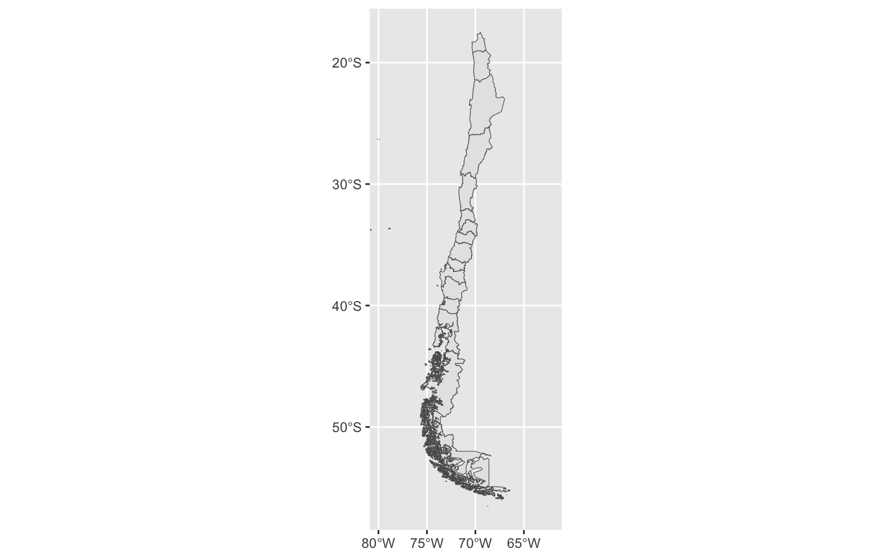
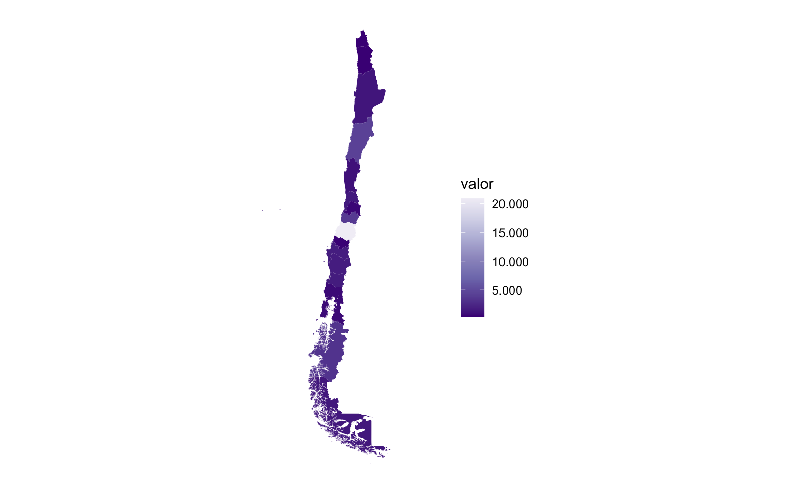
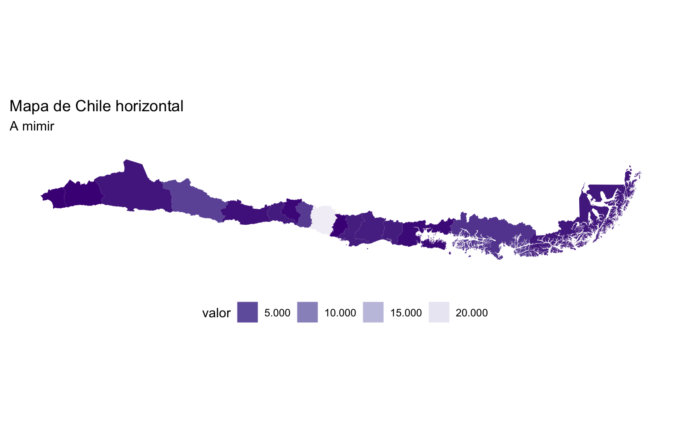

Visualizar un mapa de Chile puede ser complicado debido a su largo. Muchas veces cuesta ubicar correctamente el mapa por el espacio vertical que requiere. Pero en ciertos casos puede ser conveniente visualizar a Chile *de lado*, para aprovechar el espacio horizontal. En esta guía veremos cómo rotar un mapa de Chile 90° hacia la izquierda en R para que quede acostado.

Primero cargamos los paquetes necesarios:

``` r
library(sf) # manejo de datos espaciales
```

    Linking to GEOS 3.13.0, GDAL 3.8.5, PROJ 9.5.1; sf_use_s2() is TRUE

``` r
library(chilemapas) # mapas de Chile
```

    La documentacion del paquete y ejemplos de uso se encuentran en https://pacha.dev/chilemapas/.
    Visita https://buymeacoffee.com/pacha/ si deseas donar para contribuir al desarrollo de este software.

``` r
library(ggplot2) # visualización de datos
library(dplyr) # manejo de datos tabulares
```


    Attaching package: 'dplyr'

    The following objects are masked from 'package:stats':

        filter, lag

    The following objects are masked from 'package:base':

        intersect, setdiff, setequal, union

``` r
library(readr) # cargar datos
```

Obtenemos un mapa de Chile gracias al paquete {chilemapas}; en este caso un mapa del país por regiones:

``` r
# obtener mapa
mapa_region <- chilemapas::generar_regiones()

mapa_region
```

    Simple feature collection with 16 features and 1 field
    Geometry type: GEOMETRY
    Dimension:     XY
    Bounding box:  xmin: -109.4499 ymin: -56.52511 xmax: -66.41617 ymax: -17.49778
    Geodetic CRS:  SIRGAS 2000
    # A tibble: 16 × 2
       codigo_region                                                        geometry
     * <chr>                                                          <GEOMETRY [°]>
     1 01            POLYGON ((-68.86081 -21.28512, -68.7581 -21.21752, -68.65677 -…
     2 02            MULTIPOLYGON (((-68.98863 -25.38016, -68.98522 -25.37566, -68.…
     3 03            MULTIPOLYGON (((-70.68641 -26.15053, -70.68923 -26.15726, -70.…
     4 04            MULTIPOLYGON (((-71.66962 -30.34526, -71.67234 -30.34574, -71.…
     5 05            MULTIPOLYGON (((-71.67929 -33.44583, -71.68012 -33.448, -71.67…
     6 06            POLYGON ((-71.1344 -34.78711, -71.12134 -34.80128, -71.09905 -…
     7 07            POLYGON ((-72.1032 -36.12348, -72.09964 -36.12574, -72.09894 -…
     8 08            MULTIPOLYGON (((-71.41259 -38.10669, -71.3922 -38.098, -71.383…
     9 09            MULTIPOLYGON (((-73.35579 -38.73982, -73.35306 -38.73343, -73.…
    10 10            MULTIPOLYGON (((-73.6175 -41.8142, -73.61389 -41.80392, -73.61…
    11 11            MULTIPOLYGON (((-74.34857 -45.02053, -74.34886 -45.02632, -74.…
    12 12            MULTIPOLYGON (((-71.18405 -52.8089, -71.17569 -52.80759, -71.1…
    13 13            POLYGON ((-70.47405 -33.8624, -70.47327 -33.86269, -70.46068 -…
    14 14            MULTIPOLYGON (((-71.65597 -40.35386, -71.65874 -40.34691, -71.…
    15 15            POLYGON ((-70.35079 -18.8362, -70.34707 -18.83939, -70.34351 -…
    16 16            POLYGON ((-72.38553 -36.91169, -72.37685 -36.91617, -72.37034 …

``` r
# visualizar
mapa_region |> 
  ggplot(aes()) +
  geom_sf() +
  # recortar coordenadas horizontales
  coord_sf(xlim = c(-80, -62))
```



Cargamos algunos datos regionales para ponerle al mapa:

``` r
# obtener datos
datos <- read_csv2("https://github.com/bastianolea/economia_chile/raw/main/app/datos/pib_regional.csv")
```

    ℹ Using "','" as decimal and "'.'" as grouping mark. Use `read_delim()` for more control.

    New names:
    Rows: 951 Columns: 8
    ── Column specification
    ──────────────────────────────────────────────────────── Delimiter: ";" chr
    (2): serie, fecha dbl (5): ...1, valor, año, trimestre, mes date (1):
    fecha_scraping
    ℹ Use `spec()` to retrieve the full column specification for this data. ℹ
    Specify the column types or set `show_col_types = FALSE` to quiet this message.
    • `` -> `...1`

``` r
# limpiar datos
datos_2 <- datos |> 
  group_by(serie) |> 
  slice_max(año) |> 
  slice_max(mes) |> 
  select(nombre_region = serie, valor, año, trimestre, mes)

# crear tabla de regiones
regiones <- tribble(~codigo_region, ~nombre_region,
                    "01", "Región de Arica y Parinacota",
                    "02", "Región de Tarapacá",
                    "03", "Región de Antofagasta",
                    "04", "Región de Atacama",
                    "05", "Región de Coquimbo",
                    "06", "Región de Valparaíso",
                    "07", "Región Metropolitana de Santiago",
                    "08", "Región del Libertador General Bernardo OHiggins",
                    "09", "Región del Maule",
                    "10", "Región de Ñuble",
                    "11", "Región del Biobío",
                    "12", "Región de La Araucanía",
                    "13", "Región de Los Ríos",
                    "14", "Región de Los Lagos",
                    "15", "Región de Aysén del General Carlos Ibáñez del Campo",
                    "16", "Región de Magallanes y de la Antártica Chilena")

# agregar regiones y datos al mapa
mapa_datos <- mapa_region |> 
  left_join(regiones) |> 
  left_join(datos_2, by = join_by(nombre_region))
```

    Joining with `by = join_by(codigo_region)`

``` r
# visualizar mapa con datos
mapa_datos |> 
  ggplot() +
  aes(fill = valor) +
  geom_sf(linewidth = 0) +
  coord_sf(xlim = c(-80, -62)) +
  scale_fill_distiller(type = "seq", palette = 12,
                       labels = scales::label_comma(big.mark = ".")) +
  theme_classic() +
  theme(axis.text = element_blank(),
        axis.line = element_blank(),
        axis.ticks = element_blank())
```

    Warning in prettyNum(.Internal(format(x, trim, digits, nsmall, width, 3L, :
    'big.mark' and 'decimal.mark' are both '.', which could be confusing



Ahora que tenemos un mapa de Chile con datos regionales, procedemos a rotar el mapa. Para esto, necesitamos una *matriz de rotación*, respecto de la cual no hay mucho que entender, salvo que nos permitirá multiplicar la geometría del mapa para obtener como resultado la misma geometría, pero rotada. El único detalle que hay que considerar es que es necesario cambiar la proyección del mapa para que la zona sur del país no se vea deformada.

``` r
# reprojectar a CRS EPSG:5361 para evitar deformación
mapa_proyectado <- st_transform(mapa_datos, 5361)

# matriz de rotación 90° izquierda
rotacion <- matrix(c(0, -1, 1, 0), 2, 2)

# aplicar rotación al mapa proyectado
mapa_rotado <- mapa_proyectado |> 
  mutate(geometry = geometry * rotacion)
```

Finalmente, visualizamos el mapa reproyectado y rotado:

``` r
mapa_rotado |> 
  ggplot() +
  aes(fill = valor) +
  geom_sf(linewidth = 0) +
  scale_y_continuous(labels = scales::label_number()) +
  coord_sf(ylim = c(800000, -100000)) +
  labs(title = "Mapa de Chile horizontal",
       subtitle = "A mimir") +
  scale_fill_distiller(type = "seq", palette = 12,
                       labels = scales::label_comma(big.mark = ".")) +
  guides(fill = guide_legend(position = "bottom")) +
  theme_classic() +
  theme(axis.text = element_blank(),
        axis.line = element_blank(),
        axis.ticks = element_blank())
```

    Warning in prettyNum(.Internal(format(x, trim, digits, nsmall, width, 3L, :
    'big.mark' and 'decimal.mark' are both '.', which could be confusing



### Fuentes

-   [DeepSeek DeepThink (R1)](https://chat.deepseek.com)
-   https://gist.github.com/ryanpeek/99c6935ae51429761f5f73cf3b027da2
-   https://r-spatial.github.io/sf/articles/sf3.html#affine-transformations
-   https://en.wikipedia.org/wiki/Rotation_matrix
