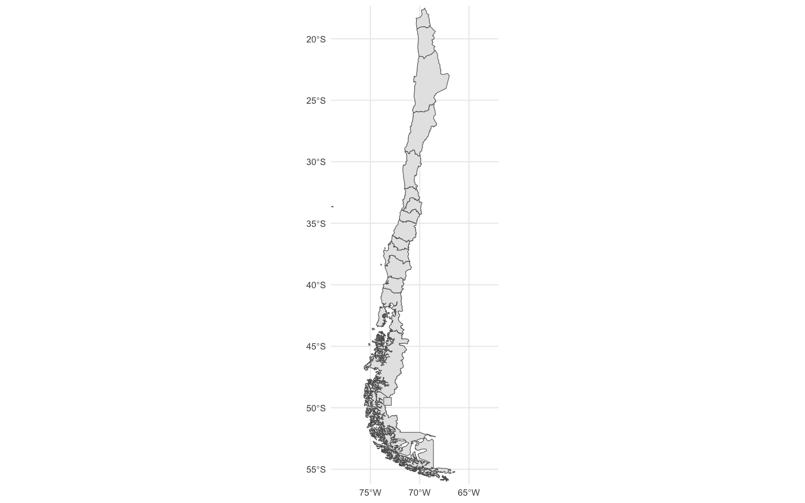
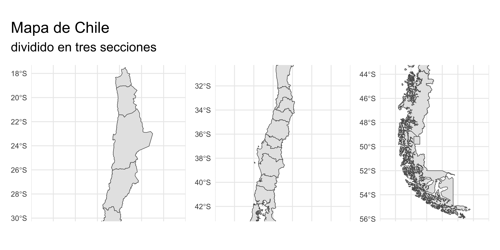
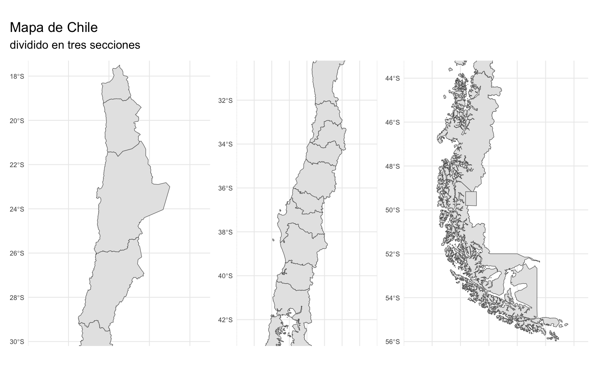



Como Chile es un país tan largo, a veces cuesta publicar mapas que se vean bien por el espacio que requiere. En otro post [intentamos resolver esto girando Chile para que quede horizontal o *acostado*](../../../blog/mapa_chile_horizontal/). Ahora veremos otra opción: partir Chile en tres secciones, norte centro y sur, que podemos disponer lado a lado para ocupar mejor el espacio.



## Descargar mapas

En el siguiente botón descargaremos un *shapefile* de Chile por regiones, que proviene de la [Mapoteca de la Biblioteca del Congreso Nacional](https://www.bcn.cl/siit/mapas_vectoriales). También puedes descargarlo en el script con `download.file()`.



Una vez descargado, descomprimimos el archivo (podemos usar `unzip()`) y obtendremos una **carpeta**. Como siempre, es importante que estemos trabajando en un [proyecto de RStudio](../../../blog/r_introduccion/proyectos/), y que guardemos los datos y *shapes* dentro de la carpeta del proyecto.

Puedes hacer esto mediante código:

``` r
# descargar
download.file("https://www.bcn.cl/obtienearchivo?id=repositorio/10221/10398/2/Regiones.zip",
              "Regiones.zip")

# descomprimir
unzip("Regiones.zip", exdir = "Regiones")
```

## Cargar mapa

Cargamos el *shape* con la función `read_sf()` [del paquete `{sf}`](../../../blog/mapas_sf/). Si es tu primera vez haciendo mapas, revisa [esta guía](../../../blog/mapas_sf/).

``` r
library(sf)

mapa <- read_sf("Regiones")
```

## Visualizar mapa

Primero veamos el mapa tal como viene desde el *shapefile*:

``` r
library(ggplot2)

mapa |> 
  ggplot() +
  geom_sf() +
  theme_minimal()
```


Aquí se nota al tiro el problema: el país es tan delgado y alto 🫦 que si contamos con poco espacio vertical, no se notan los detalles y dejamos márgenes sin uso.

Si la visualización se demora mucho en generar en tu computador, prueba [simplificando los detalles del mapa.](../../../blog/simplificar_mapas/)

## Cortar mapa de Chile continental

Un primer ajuste para la visualización es cortar los márgenes del mapa para enfocarnos en Chile *continental*. Perdón, Rapa Nui 😔

``` r
mapa |> 
  # reproyectar
  st_transform(crs = 5360) |> 
  # visualizar
  ggplot() +
  geom_sf() +
  # recortar Chile continental
  coord_sf(expand = FALSE,
           xlim = c(-79, -62),
           ylim = c(-56.2, -17.3)) +
  theme_minimal(base_size = 8)
```



Uno de los pasos para el recorte fue *reproyectar* el mapa, dado que vienen con un sistema de coordenadas distinto al que típicamente se usa. Al reproyectar, las coordenadas pasan a estar en grados decimales.

## Calcular recortes

Ahora toca sacar la calculadora (también se puede hace a mano, pero acá nos gusta el código reproducible y sobrecomplejizar todo) 🤓

La idea es: medir cuánto mide cada sección del país, y calcular los cortes que hay que hacerle al mapa para dividirlo en tres.

Primero tomamos el límite superior o norte del país, y el límite sur, y calculamos el *largo* en término de grados de latitud. Dividimos ese largo en tres partes para saber cuánto va a medir cada una de las tres secciones.

``` r
limite_sur = -56.2
limite_norte = -17.3
largo = abs(limite_sur) - abs(limite_norte)

parte = largo / 3
```

Obtenemos que cada sección medirá 12.9666667 grados de latitud.

Si empezamos desde el norte del país (`n`, que equivale a -17.3), la primera sección llegará hasta `n - parte` (-30.3). Luego la segunda sección empieza donde termina la anterior, y llega hasta `n - parte*2` (-43), y la tercera sección llegará hasta `n - parte*2` (-56.2), que coincide con el límite sur del país.

| secciones | norte  | sur    |
|-----------|--------|--------|
| 1         | n      | n-p    |
| 2         | n-p    | n-p\*2 |
| 3         | n-p\*2 | n-p\*3 |

Podemos calcular esto a mano, o hacerlo *al ojo*, pero vamos a creamor una tablita mejor.

``` r
library(dplyr)

cortes <- tibble(secciones = c(1, 2, 3))

cortes <- cortes |> 
  mutate(norte = limite_norte,
         sur = limite_norte)

cortes
```

    # A tibble: 3 × 3
      secciones norte   sur
          <dbl> <dbl> <dbl>
    1         1 -17.3 -17.3
    2         2 -17.3 -17.3
    3         3 -17.3 -17.3

``` r
cortes <- cortes |> 
  mutate(norte = norte - (parte * (secciones - 1)),
         sur   = sur - (parte * secciones))

cortes
```

    # A tibble: 3 × 3
      secciones norte   sur
          <dbl> <dbl> <dbl>
    1         1 -17.3 -30.3
    2         2 -30.3 -43.2
    3         3 -43.2 -56.2

| secciones |     norte |       sur |
|----------:|----------:|----------:|
|         1 | -17.30000 | -30.26667 |
|         2 | -30.26667 | -43.23333 |
|         3 | -43.23333 | -56.20000 |

## Cortar mapas

Creamos un mapa base, y definimos un objeto que contiene los cortes horizontales, que en este caso serán iguales para los tres mapas.

``` r
mapa_base <- mapa |> 
  # reproyectar
  st_transform(crs = 5360) |> 
  # visualizar
  ggplot() +
  geom_sf() +
  theme_minimal(base_size = 8)

limites_continental <- c(-78, -64)
```

Ahora, usando el `mapa_base`, aplicamos el corte de coordenadas con `coors_sf()` a partir de la tabla `cortes`, seleccionando la columna de la tabla que corresponde (norte o sur), y la posición del elemento para cada sección (1, 2 o 3).

``` r
mapa_norte <- mapa_base +
  coord_sf(expand = FALSE,
           xlim = limites_continental,
           ylim = c(cortes$norte[1], cortes$sur[1]))

mapa_centro <- mapa_base +
  coord_sf(expand = FALSE,
           xlim = limites_continental,
           ylim = c(cortes$norte[2], cortes$sur[2]))

mapa_sur <- mapa_base +
  coord_sf(expand = FALSE,
           xlim = limites_continental,
           ylim = c(cortes$norte[3], cortes$sur[3]))
```

## Unir mapas

El paso final es **unir** los tres gráficos: [como detallamos en un post anterior](../../../blog/patchwork/), con el paquete [`{patchwork}`](https://patchwork.data-imaginist.com/articles/patchwork.html) podemos unir y combinar gráficos de `{ggplot2}`, y la sintaxis es muy simple: si conectas los gráficos con el signo `+` se unirán lado a lado, si los *divides* con `/` aparecerán uno sobre otro. Con el signo `&` puedes agregar capas a todos los gráficos de una.

``` r
library(patchwork)

mapa_norte + mapa_centro + mapa_sur + 
  plot_annotation(title = "Mapa de Chile",
       subtitle = "dividido en tres secciones") &
  theme(axis.text.x = element_blank())
```



Listo! Ahora el mapa cabe mucho mejor en una hoja, página o imagen.

También podemos ajustar los cortes horizontales del mapa, para que cada sección tenga un espaciado similar. Acá dejo el código con los números exactos para copiar y pegar, o bien, [revisa el script completo en este Gist.](https://gist.github.com/bastianolea/52259ec4964891b2d11c5ad59c010246)

``` r
mapa_norte <- mapa_base +
  coord_sf(expand = FALSE,
           xlim = c(-74, -65),
           ylim = c(-17.3, -30.2))

mapa_centro <- mapa_base +
  coord_sf(expand = FALSE,
           xlim = c(-76, -68),
           ylim = c(-30.2, -43.2))

mapa_sur <- mapa_base +
  coord_sf(expand = FALSE,
           xlim = c(-78, -65),
           ylim = c(-43.2, -56.2))

mapa_norte + mapa_centro + mapa_sur + 
  plot_annotation(title = "Mapa de Chile",
       subtitle = "dividido en tres secciones") &
  theme(axis.text.x = element_blank())
```


