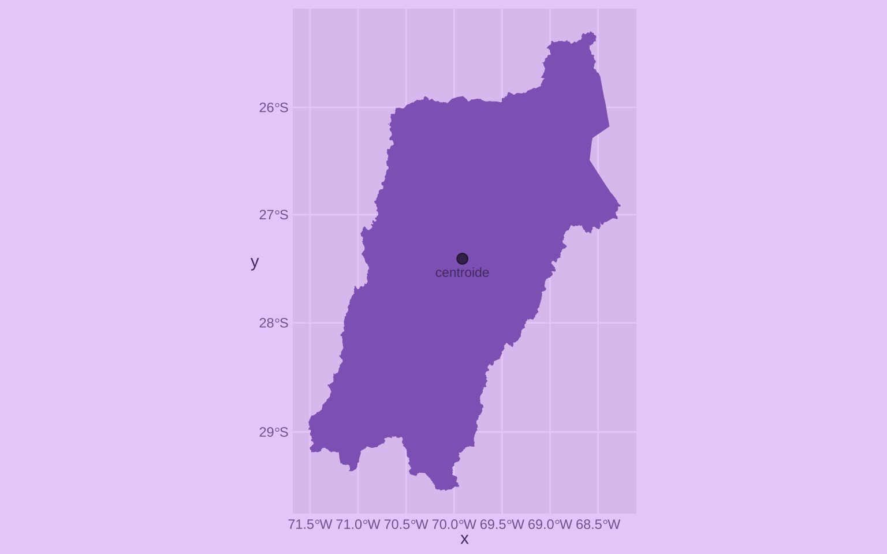
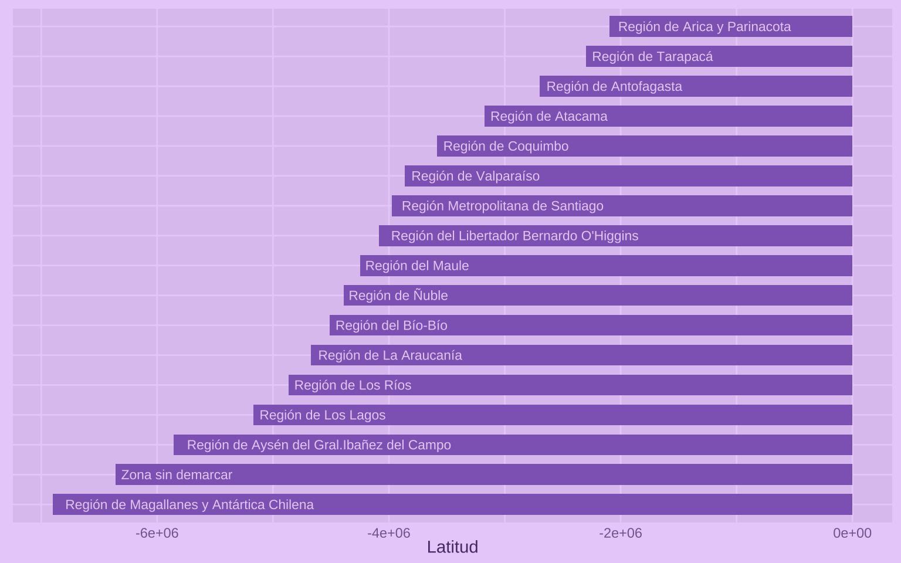




R cuenta con un muy amplio [ecosistema](https://github.com/r-spatial/) de paquetes para datos geoespaciales. Uno de los [paquetes más importantes es `{sf}`](https://r-spatial.github.io/sf/), que permite manipular datos espaciales a partir del estándar *simple features* (características simples), ampliamente utilizado en sistemas de información geográfica (SIG/GIS).

En esta guía iré guardando los comandos que uso frecuentemente para **manipular, transformar y visualizar datos geoespaciales** en R. En la medida que voy aprendiendo más sobre hacer mapitas, iré actualizando y complementando.

Lo inicial es instalar `{sf}`:

``` r
install.packages("sf")
```

Y cargarlo junto a `{dplyr}` para empezar a trabajar con datos geoespaciales.

``` r
library(sf)
library(dplyr)
```



``` r
# tema de colores
thematic::thematic_on(fg = "#553A74",
                      bg = "#EAD2FA",
                      accent = "#9069C0")

theme_set(
  # fondo transparente para mapas
  theme(plot.background = element_rect(fill = "transparent", color = "transparent")) +
  # borrar líneas feas
  theme(axis.ticks = element_blank())
)
```



<br>



------------------------------------------------------------------------

## Carga de datos



En este enlace podemos descargar un *shapefile* con los límites político-administrativos de Chile, como el titulado *[Division regional: polígonos de las regiones de Chile](https://www.bcn.cl/obtienearchivo?id=repositorio/10221/10398/2/Regiones.zip)*. También puedes descargarlo en el script con `download.file()`.

Una vez descargado, descomprimimos el archivo (podemos usar `unzip()`) y obtendremos una **carpeta**. Es importante que la carpeta esté en nuestro [proyecto de RStudio](../../../blog/r_introduccion/proyectos/). Personalmente prefiero guardar los *shapes* en su propia carpeta, así que pondré la carpeta del *shape* descargado dentro de `shapes/`

### Cargar *shapes*

``` r
mapa <- read_sf("shapes/Regiones") |> 
  janitor::clean_names()

mapa
```

    Simple feature collection with 17 features and 7 fields
    Geometry type: GEOMETRY
    Dimension:     XY
    Bounding box:  xmin: -12183900 ymin: -7554306 xmax: -7393644 ymax: -1978920
    Projected CRS: WGS 84 / Pseudo-Mercator
    # A tibble: 17 × 8
       objectid cir_sena codregion area_km    st_area_sh st_length region           
     *    <dbl>    <int>     <int>   <dbl>         <dbl>     <dbl> <chr>            
     1     1084        1        15  16867.  18868687744.   750530. Región de Arica …
     2     1085        2         1  42285.  48306372203.  1213713. Región de Tarapa…
     3     1086        3         2 126071. 150845155633   2516112. Región de Antofa…
     4     1087       15        12 133053. 358131609833  90498304. Región de Magall…
     5     1088       14        11 106703. 224274263072  41444811. Región de Aysén …
     6     1089        4         3  75661.  96439063562.  2401741. Región de Atacama
     7     1090        5         4  40576.  54980818749.  2065933. Región de Coquim…
     8     1091        6         5  16323.  23014748571.  1679609. Región de Valpar…
     9     1092        7        13  15392.  22252038246.  1064253. Región Metropoli…
    10     1093       13        10  48408.  87718341940.  7874158. Región de Los La…
    11     1094       12        14  18245.  31086613540.  1844423. Región de Los Rí…
    12     1095       11         9  31838.  52215073344.  1501025. Región de La Ara…
    13     1096       10         8  24022.  38176117509.  2097147. Región del Bío-B…
    14     1097       10        16  13104.  20376298459.  1074094. Región de Ñuble  
    15     1098        9         7  30322.  45969426092.  1388328. Región del Maule 
    16     1099        8         6  16349.  24090278437.   984853. Región del Liber…
    17     1100        0         0   3937.   9306245194.   388722. Zona sin demarcar
    # ℹ 1 more variable: geometry <GEOMETRY [m]>

<!--
### Cargar geoJSON


### Cargar KMZ


::: {.cell}

```{.r .cell-code}
unzip("~/Downloads/Mis lugares.kmz", exdir = "~/Downloads/Mis lugares")

sf::read_sf("~/Downloads/Mis lugares/doc.kml")
```
:::


-->

Como vemos, una vez que cargamos los datos geoespaciales obtenemos una **tabla con características especiales**. arriba de la tabla vemos una descripción de las características del mapa, el tipo de geometrías, la caja o *bounding box* que enmarca los polígonos, y el sistema de referencia de coordenadas del mapa.

En `{sf}` los datos geoespaciales además contienen una columna `geometry`, que contiene las geometrías (puntos, líneas o polígonos) que definen la forma y ubicación de los elementos geográficos. Vamos a trabajar con esta columna si queremos **modificar la geometría** de los elementos geoespaciales o calcular algo a partir de ellos. **Cada fila de la tabla representa un objeto geográfico** (una región, comuna, país, etc.) y las demás columnas son variables relacionadas al objeto geográfico (población, superficie, nombre, etc.)

## Glosario

-   **Simple features**: estándar para representar datos geoespaciales en forma de tablas con una columna especial de geometría.
-   **Shapefile**: formato de archivo común para datos geoespaciales, que en realidad consiste en varios archivos relacionados.
-   **Polígono**: forma geométrica que representa áreas en un mapa.

------------------------------------------------------------------------

## Operaciones sobre geometrías

Las operaciones sobre geometrías permiten manipular y analizar las formas y ubicaciones de los objetos geográficos. A continuación veremos algunas operaciones comunes que se pueden realizar con el paquete `{sf}` en R.

### Calcular centroide

El centroide es el punto central de un polígono. Calcularlo sirve, por ejemplo, para ubicar una etiqueta de texto sobre un polígono, poner un punto sobre un territorio que crece con respecto a una variable, etc.

``` r
mapa_centroide <- mapa |> 
  select(region, geometry) |> 
  mutate(centroide = st_centroid(geometry))

mapa_centroide
```

    Simple feature collection with 17 features and 1 field
    Active geometry column: geometry
    Geometry type: GEOMETRY
    Dimension:     XY
    Bounding box:  xmin: -12183900 ymin: -7554306 xmax: -7393644 ymax: -1978920
    Projected CRS: WGS 84 / Pseudo-Mercator
    # A tibble: 17 × 3
       region                                     geometry           centroide
     * <chr>                                <GEOMETRY [m]>         <POINT [m]>
     1 Región de Arica y Parina… POLYGON ((-7675501 -2147… (-7751019 -2095927)
     2 Región de Tarapacá        POLYGON ((-7807680 -2295… (-7724797 -2299134)
     3 Región de Antofagasta     MULTIPOLYGON (((-7859947… (-7694561 -2698986)
     4 Región de Magallanes y A… MULTIPOLYGON (((-7494058… (-7996444 -6899731)
     5 Región de Aysén del Gral… MULTIPOLYGON (((-8395076… (-8155537 -5856280)
     6 Región de Atacama         MULTIPOLYGON (((-7868801… (-7782778 -3174679)
     7 Región de Coquimbo        MULTIPOLYGON (((-7956099… (-7888264 -3584743)
     8 Región de Valparaíso      MULTIPOLYGON (((-8991646… (-7944452 -3860933)
     9 Región Metropolitana de … POLYGON ((-7857118 -3892… (-7862170 -3976036)
    10 Región de Los Lagos       MULTIPOLYGON (((-8128795… (-8114468 -5170738)
    11 Región de Los Ríos        MULTIPOLYGON (((-8156461… (-8078476 -4867034)
    12 Región de La Araucanía    POLYGON ((-7929978 -4593… (-8045539 -4672201)
    13 Región del Bío-Bío        MULTIPOLYGON (((-8231986… (-8058771 -4509385)
    14 Región de Ñuble           POLYGON ((-8053807 -4431… (-8012110 -4389990)
    15 Región del Maule          POLYGON ((-8018823 -4121… (-7953282 -4249088)
    16 Región del Libertador Be… POLYGON ((-8015044 -4051… (-7908857 -4087567)
    17 Zona sin demarcar         POLYGON ((-8197676 -6303… (-8154871 -6357913)





``` r
mapa_centroide |> 
filter(region == "Región de Atacama") |> 
ggplot() +
geom_sf(fill = "#9069C0", 
linewidth = NA) +
geom_sf(
aes(geometry = centroide),
size = 3, alpha = .6) +
geom_sf_text(
aes(geometry = centroide),
label = "centroide", size = 3,
nudge_y = -20000)
```



------------------------------------------------------------------------

### Extraer longitud y latitud

Para obtener las coordenadas (longitud y latitud) de un elemento espacial, necesitamos primero que sea un punto, porque un polígono es una figura compleja que no tiene solamente una latitud y una longitud. Si tenemos un polígono, [primero calculamos el centroide](#calcular-centroide), y luego extraemos las coordenadas con `st_coordinates()`. Como esta función retorna la longitud y latitud de cada punto al mismo tiempo, tenemos que pedirle que entregue la una o la otra usando corchetes.

``` r
mapa_centroide_coordenadas <- mapa_centroide |> 
  mutate(lon = st_coordinates(centroide)[,1],
         lat = st_coordinates(centroide)[,2])

mapa_centroide_coordenadas |> 
  select(region, lon, lat)
```

    Simple feature collection with 17 features and 3 fields
    Geometry type: GEOMETRY
    Dimension:     XY
    Bounding box:  xmin: -12183900 ymin: -7554306 xmax: -7393644 ymax: -1978920
    Projected CRS: WGS 84 / Pseudo-Mercator
    # A tibble: 17 × 4
       region                                  lon     lat                  geometry
       <chr>                                 <dbl>   <dbl>            <GEOMETRY [m]>
     1 Región de Arica y Parinacota        -7.75e6 -2.10e6 POLYGON ((-7675501 -2147…
     2 Región de Tarapacá                  -7.72e6 -2.30e6 POLYGON ((-7807680 -2295…
     3 Región de Antofagasta               -7.69e6 -2.70e6 MULTIPOLYGON (((-7859947…
     4 Región de Magallanes y Antártica C… -8.00e6 -6.90e6 MULTIPOLYGON (((-7494058…
     5 Región de Aysén del Gral.Ibañez de… -8.16e6 -5.86e6 MULTIPOLYGON (((-8395076…
     6 Región de Atacama                   -7.78e6 -3.17e6 MULTIPOLYGON (((-7868801…
     7 Región de Coquimbo                  -7.89e6 -3.58e6 MULTIPOLYGON (((-7956099…
     8 Región de Valparaíso                -7.94e6 -3.86e6 MULTIPOLYGON (((-8991646…
     9 Región Metropolitana de Santiago    -7.86e6 -3.98e6 POLYGON ((-7857118 -3892…
    10 Región de Los Lagos                 -8.11e6 -5.17e6 MULTIPOLYGON (((-8128795…
    11 Región de Los Ríos                  -8.08e6 -4.87e6 MULTIPOLYGON (((-8156461…
    12 Región de La Araucanía              -8.05e6 -4.67e6 POLYGON ((-7929978 -4593…
    13 Región del Bío-Bío                  -8.06e6 -4.51e6 MULTIPOLYGON (((-8231986…
    14 Región de Ñuble                     -8.01e6 -4.39e6 POLYGON ((-8053807 -4431…
    15 Región del Maule                    -7.95e6 -4.25e6 POLYGON ((-8018823 -4121…
    16 Región del Libertador Bernardo O'H… -7.91e6 -4.09e6 POLYGON ((-8015044 -4051…
    17 Zona sin demarcar                   -8.15e6 -6.36e6 POLYGON ((-8197676 -6303…





``` r
mapa_centroide_coordenadas |> 
mutate(region = forcats::fct_reorder(region, lat)) |> # ordenar regiones
ggplot() +
aes(lat, region) +
geom_col(width = 0.7, fill = "#9069C0") +
geom_text(
aes(label = region),
size = 3, hjust = -0.05, color = "#EAD2FA") +
scale_y_discrete(labels = NULL) +
labs(y = NULL, x = "Latitud")
```



------------------------------------------------------------------------

### Calcular buffer

``` r
st_buffer()
```

------------------------------------------------------------------------

### Calcular caja de un polígono

Bounding box

``` r
st_bbox(mapa)
```

         xmin      ymin      xmax      ymax 
    -12183903  -7554306  -7393644  -1978920 

------------------------------------------------------------------------

### Convertir caja a polígono

``` r
caja <- st_bbox(mapa)

caja_poli <- caja |> 
  st_as_sfc() |>
  st_as_sf()

caja_poli
```

------------------------------------------------------------------------

### Crear un cuadrado

Desde una coordenada

``` r
coordenadas <- c(38.29782, -76.51390)

coordenadas |> 
  st_point() |>
  st_sfc() |>
  st_buffer(dist = 30000)  |> 
  st_bbox() |> 
  st_as_sfc() |>
  st_as_sf()
```

<!--
Desde el centroide de un polígono


::: {.cell}

```{.r .cell-code}
mapa |> 
filter(region == "Región de Antofagasta") |>
st_centroid() |> 
st_buffer(dist = 8000) |> 
st_bbox() |> 
st_as_sfc() |>
st_as_sf()
```
:::


-->
<!--
### Calcular superficie o área


::: {.cell}

```{.r .cell-code}
mapa_region_comunas_areas |> 
st_union() |> 
st_area() |> 
units::set_units("km^2")
```
:::


### Recortar polígono a coordenadas


::: {.cell}

```{.r .cell-code}
st_crop(xmin = -74, ymin = -36, xmax = -65, ymax = -30) |> 
```
:::


### Simplificar un polígono


::: {.cell}

```{.r .cell-code}
https://bookdown.org/robinlovelace/geocompr/geometric-operations.html#simplification
st_simplify(dTolerance = 0.01)

rmapshaper::ms_simplify(geometry, keep = 0.8)) 
```
:::


### Extraer líneas internas de un polígono


::: {.cell}

```{.r .cell-code}
ms_innerlines() # deja solo las líneas interiores de un coso
```
:::


## Correcciones


::: {.cell}

```{.r .cell-code}
st_as_sf()
```
:::

::: {.cell}

```{.r .cell-code}
st_make_valid()
```
:::

::: {.cell}

```{.r .cell-code}
st_drop_geometry() 
```
:::


----


## Operaciones agrupadas

### Unir polígonos


::: {.cell}

```{.r .cell-code}
group_by() |> 
st_union()
```
:::


## Operaciones entre geometrías

### Recortar un polígono con otro
https://bookdown.org/robinlovelace/geocompr/geometric-operations.html#clipping


::: {.cell}

```{.r .cell-code}
st_intersection()
```
:::


### Usar un polígono para eliminar partes de otro


::: {.cell}

```{.r .cell-code}
st_difference()
```
:::


### unir dos polígonos


::: {.cell}

```{.r .cell-code}
st_union()
```
:::


### Spatial join

### Filter


::: {.cell}

```{.r .cell-code}
https://cengel.github.io/R-spatial/spatialops.html#topological-subsetting-select-polygons-by-location
```
:::


## Coordenadas

### Extraer sistema de coordenadas


::: {.cell}

```{.r .cell-code}
st_crs(comunas_region)
```
:::


### Cambiar coordenadas


::: {.cell}

```{.r .cell-code}
st_transform(crs = st_crs(comunas_region))
```
:::


## Visualización

### Visualizar por capas


::: {.cell}

```{.r .cell-code}
geom_sf()
```
:::


### Texto


::: {.cell}

```{.r .cell-code}
geom_sf_text(data = nombres_areas |> filter(clase_topo == "Comuna"), color = "red", fontface = "bold",
aes(label = nombre)) + 
```
:::


### Texto con repel
https://github.com/slowkow/ggrepel/issues/111#issuecomment-416853013


::: {.cell}

```{.r .cell-code}
ggrepel::geom_label_repel(data = comunas_region_conteo_urbanas,
aes(label = comuna, geometry = geometry),
stat = "sf_coordinates",
size = 2, box.padding = 0,
min.segment.length = unit(3, "mm"),
label.padding = 0.15, label.size = 0
) +
```
:::


### Hacer zoom


::: {.cell}

```{.r .cell-code}
#   coord_sf(xlim = c(-70.4, -70.2),
#            ylim = c(-18.7, -18.4),
```
:::


### Dibujar un cuadrado


::: {.cell}

```{.r .cell-code}
#   annotate("rect", fill = NA, color = "black", linewidth = 1,
#            xmin = bbox_area_met[1]-2000, xmax = bbox_area_met[2]+2000,
#            ymin = bbox_area_met[3]+2000, ymax = bbox_area_met[4]-2000)+
```
:::


### Escala de colores para mapa de calor


::: {.cell}

```{.r .cell-code}
scale_fill_gradient2(
low = color$bajo, mid = color$medio, high = color$alto,
midpoint = mean(comunas_region_conteo$n),
na.value = col_mix(color$fondo, color$principal, 0.1),
limits = c(0, NA)
# breaks = cortes
)
```
:::


### Minimapa
https://dominicroye.github.io/blog/inserted-map/


::: {.cell}

:::


-->

------------------------------------------------------------------------

## Recursos para aprender más

### Apuntes




### Libros

-   [Drawing beautiful maps programmatically with R, sf and ggplot2](https://r-spatial.org/r/2018/10/25/ggplot2-sf.html)
-   [Geocomputation with R](https://bookdown.org/robinlovelace/geocompr/)
-   [Spatial Data Science With Applications in R](https://r-spatial.org/book/)
-   [Using Spatial Data with R](https://cengel.github.io/R-spatial/)
