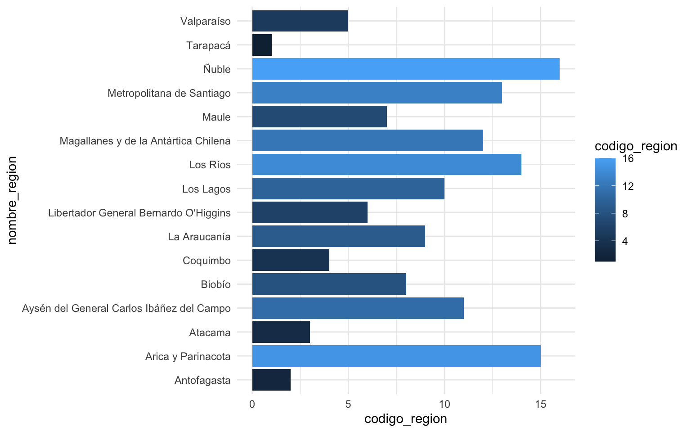
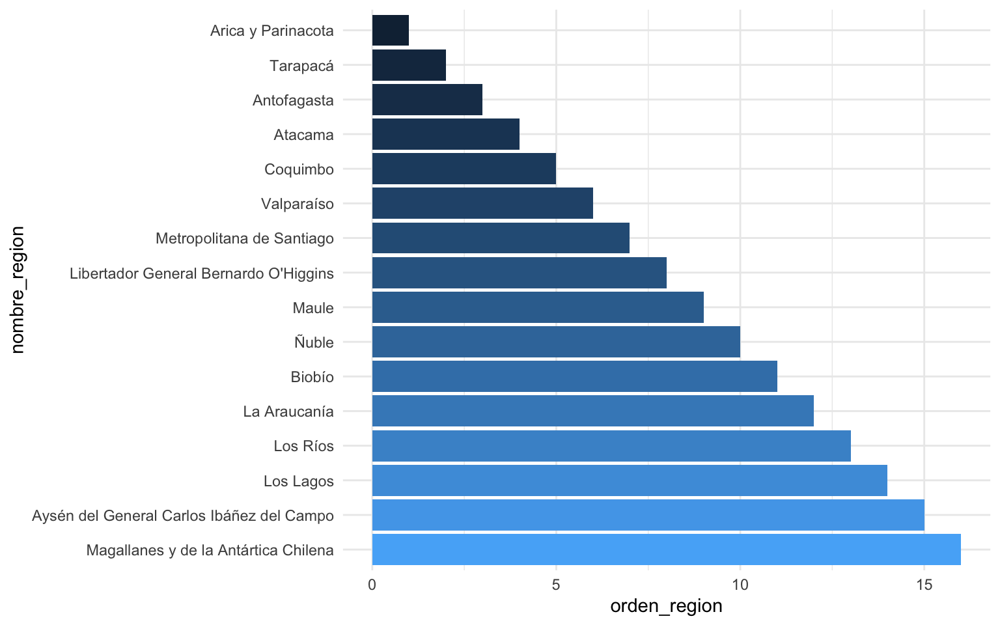

La franja larga y angosta que es Chile tiene el beneficio de que sus regiones se ubican casi perfectamente una sobre la otra, de norte a sur. Este orgen geográfico natural de sus regiones resulta familiar para sus habitantes, por lo que se vuelve recomendable ordenar los datos a nivel regional siguiendo este orden geográfico.

Creemos una tabla o *dataframe* con las regiones de Chile. Ejecuta el siguiente código en R para obtener una tabla:

``` r
library(dplyr)
```

``` r
regiones <- tibble::tribble(
  ~codigo_region,                  ~nombre_region,
  1,                                   "Tarapacá",
  2,                                "Antofagasta",
  3,                                    "Atacama",
  4,                                   "Coquimbo",
  5,                                 "Valparaíso",
  6,      "Libertador General Bernardo O'Higgins",
  7,                                      "Maule",
  8,                                     "Biobío",
  9,                               "La Araucanía",
  10,                                 "Los Lagos",
  11, "Aysén del General Carlos Ibáñez del Campo",
  12,      "Magallanes y de la Antártica Chilena",
  13,                 "Metropolitana de Santiago",
  14,                                  "Los Ríos",
  15,                        "Arica y Parinacota",
  16,                                     "Ñuble"
)
```

En esta tabla tenemos el nombre de las 16 regiones del país, y además una columna de código de región. El código de región corresponde al nombre antiguo que tenían las regiones (instaurado en dictadura), y que hoy en día no se sigue utilizando, pero que sin embargo se mantiene como código identificador de las regiones en la mayoría de las bases de datos oficiales. Si bien este código originalmente ordenaba las regiones, hoy en día la creación de nuevas regiones (como Ñuble en 2017 o Arica y Parinacota en 2007) provoca que este ordenamiento antiguo no se corresponda con el orden geográfico de las regiones.

Si ejecutamos esta tabla de datos, veremos que las regiones no están ordenadas geográficamente:

``` r
regiones
```

    # A tibble: 16 × 2
       codigo_region nombre_region                            
               <dbl> <chr>                                    
     1             1 Tarapacá                                 
     2             2 Antofagasta                              
     3             3 Atacama                                  
     4             4 Coquimbo                                 
     5             5 Valparaíso                               
     6             6 Libertador General Bernardo O'Higgins    
     7             7 Maule                                    
     8             8 Biobío                                   
     9             9 La Araucanía                             
    10            10 Los Lagos                                
    11            11 Aysén del General Carlos Ibáñez del Campo
    12            12 Magallanes y de la Antártica Chilena     
    13            13 Metropolitana de Santiago                
    14            14 Los Ríos                                 
    15            15 Arica y Parinacota                       
    16            16 Ñuble                                    

Para **ordenar geográficamente las regiones de Chile** podemos crear una variable nueva, que use el código de las regiones para asignar un nuevo número que ordene las regiones de norte a sur:

``` r
regiones_ordenadas <- regiones |> 
  # agregar orden de región de norte a sur
  mutate(orden_region = case_match(codigo_region,
                                   15 ~ 1,
                                   1 ~ 2,
                                   2 ~ 3,
                                   3 ~ 4,
                                   4 ~ 5,
                                   5 ~ 6,
                                   13 ~ 7,
                                   6 ~ 8,
                                   7 ~ 9,
                                   16 ~ 10,
                                   8 ~ 11,
                                   9 ~ 12,
                                   14 ~ 13,
                                   10 ~ 14,
                                   11 ~ 15,
                                   12 ~ 16
                                   
  ))
```

Se recomienda hacer este tipo de operaciones usando el código de las regiones, para evitar problemas por las distintas formas de escribir el nombre de cada región[^1]. Pero si lo quieres hacer por el nombre de las regiones, sería así:

``` r
regiones_ordenadas <- regiones |> 
  # agregar orden de región de norte a sur
  mutate(orden_region = case_match(nombre_region,
                                      "Tarapacá" ~  2,
                                   "Antofagasta" ~  3,
                                       "Atacama" ~  4,
                                      "Coquimbo" ~  5,
                                    "Valparaíso" ~  6,
         "Libertador General Bernardo O'Higgins" ~  8,
                                         "Maule" ~  9,
                                        "Biobío" ~  11,
                                  "La Araucanía" ~  12,
                                     "Los Lagos" ~  14,
     "Aysén del General Carlos Ibáñez del Campo" ~  15,
          "Magallanes y de la Antártica Chilena" ~  16,
                     "Metropolitana de Santiago" ~  7,
                                      "Los Ríos" ~  13,
                            "Arica y Parinacota" ~  1,
                                         "Ñuble" ~  10
     ))
```

Si ejecutamos la nueva tabla con la columna `orden_region`, vemos que sigue desordenada, así que la ordenamos:

``` r
regiones_ordenadas |> 
  arrange(orden_region)
```

    # A tibble: 16 × 3
       codigo_region nombre_region                             orden_region
               <dbl> <chr>                                            <dbl>
     1            15 Arica y Parinacota                                   1
     2             1 Tarapacá                                             2
     3             2 Antofagasta                                          3
     4             3 Atacama                                              4
     5             4 Coquimbo                                             5
     6             5 Valparaíso                                           6
     7            13 Metropolitana de Santiago                            7
     8             6 Libertador General Bernardo O'Higgins                8
     9             7 Maule                                                9
    10            16 Ñuble                                               10
    11             8 Biobío                                              11
    12             9 La Araucanía                                        12
    13            14 Los Ríos                                            13
    14            10 Los Lagos                                           14
    15            11 Aysén del General Carlos Ibáñez del Campo           15
    16            12 Magallanes y de la Antártica Chilena                16

¡Ahora sí aparecen ordenadas geográficamente! ¿Pero qué pasa si hacemos un gráfico con estas regiones?

``` r
library(ggplot2)

regiones_ordenadas |> 
  ggplot() +
  aes(x = codigo_region, 
      y = nombre_region, 
      fill = codigo_region) +
  geom_col() +
  theme_minimal()
```



Las regiones nuevamente aparecen desordenadas. ¿Por qué? Porque `{ggplot2}`, la librería de visualización de datos que usamos, así como muchos otros paquetes, no se basan en en el orden de las filas de la base de datos que usemos, sino en el *orden de la variable.* Como la variable `nombre_region` es una variable de texto (tipo *caracter*), no tiene un orden, así que se asume que su orden es alfabético (en el gráfico vemos que abajo están las regiones que empiezan con *A*, porque el eje `y` nace desde el cero que está abajo y aumenta hacia arriba).

La solución sería darle un *orden* a la variable. En R, las variables de texto que contienen información sobre su ordenamiento se llaman *factores.* Un factor es una variable categórica de tipo ordinal; es decir, una variable de texto que tiene categorías de texto, pero que estas categorías tienen un ordenamiento entre ellas: por ejemplo, *bajo*, *medio* y *alto* deberían tener un orden de 1 a 3, de lo contrario se ordenarían alfabéticamente y *alto* quedaría antes que *bajo*.

El paquete `{forcats}` facilita todo tipo de trabajo con variables tipo factor o categóricas. Entre sus funciones está `fct_reorder()`, que nos permite ordenar una variable de texto en base al ordenamiento que nos da una variable numérica: en nuestro caso, ordenar el `nombre_region` en base al `orden_region`:

``` r
library(forcats)

# ordenar variable a partir de una segunda variable numérica
regiones_ordenadas_2 <- regiones_ordenadas |> 
  mutate(nombre_region = forcats::fct_reorder(nombre_region, orden_region))
```

Si ahora volvemos a hacer el gráfico, la variable `nombre_region` sí aparecerá ordenada:

``` r
# crear un gráfico
regiones_ordenadas_2 |> 
  ggplot() +
  aes(x = orden_region,
      y = nombre_region, 
      fill = orden_region) +
  geom_col() +
  theme_minimal() +
  guides(fill = guide_none())
```


Naturalmente, las regiones aparecen al revés, porque el eje `y` parte desde abajo y aumenta hacia arriba, entonces la primera región (la de más al norte) aparece abajo. Pero sería esperable que las regiones estén ordenadas de norte a sur y de arriba hacia abajo (en el hemisferio sur), así que podemos invertir el orden del factor:

``` r
regiones_ordenadas_2 |> 
  # invertir orden de la variable
  mutate(nombre_region = forcats::fct_rev(nombre_region)) |> 
  ggplot() +
    aes(x = orden_region,
      y = nombre_region, 
      fill = orden_region) +
  geom_col() +
  theme_minimal() +
  guides(fill = guide_none())
```



¡Listo! Si te sirve, acá dejo un dataframe con las regiones del país, su código y su orden, para que puedas copiarlo y pegarlo en tu script de R, y luego agregarlo a tus datos usando `left_join()`:

``` r
# regiones_ordenadas |> 
#   datapasta::dpasta()

tibble::tribble(
     ~codigo_region,                              ~nombre_region, ~orden_region,
                  1,                                  "Tarapacá",             2,
                  2,                               "Antofagasta",             3,
                  3,                                   "Atacama",             4,
                  4,                                  "Coquimbo",             5,
                  5,                                "Valparaíso",             6,
                  6,     "Libertador General Bernardo O'Higgins",             8,
                  7,                                     "Maule",             9,
                  8,                                    "Biobío",            11,
                  9,                              "La Araucanía",            12,
                 10,                                 "Los Lagos",            14,
                 11, "Aysén del General Carlos Ibáñez del Campo",            15,
                 12,      "Magallanes y de la Antártica Chilena",            16,
                 13,                 "Metropolitana de Santiago",             7,
                 14,                                  "Los Ríos",            13,
                 15,                        "Arica y Parinacota",             1,
                 16,                                     "Ñuble",            10
     )
```

[^1]: Por ejempo, *Valparaíso* puede encontrarse como *Región de Valparaíso*, *De Valparaíso*, *V región de Valparaíso,* etc., y para qué hablar de O'Higgins...
