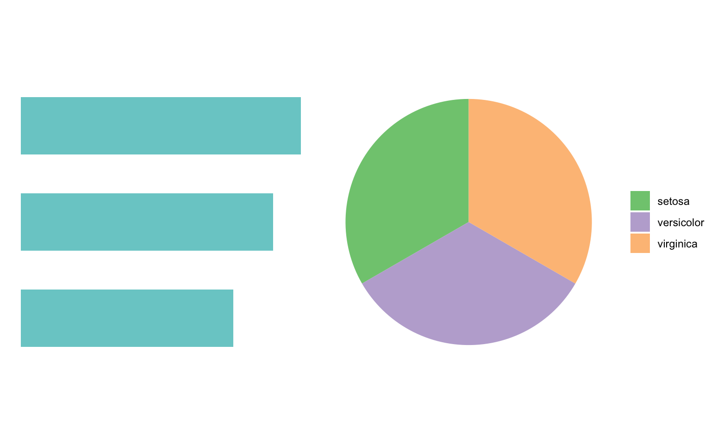
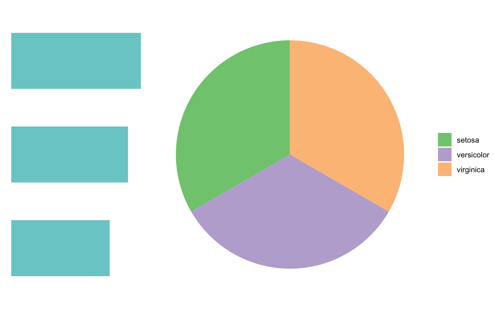
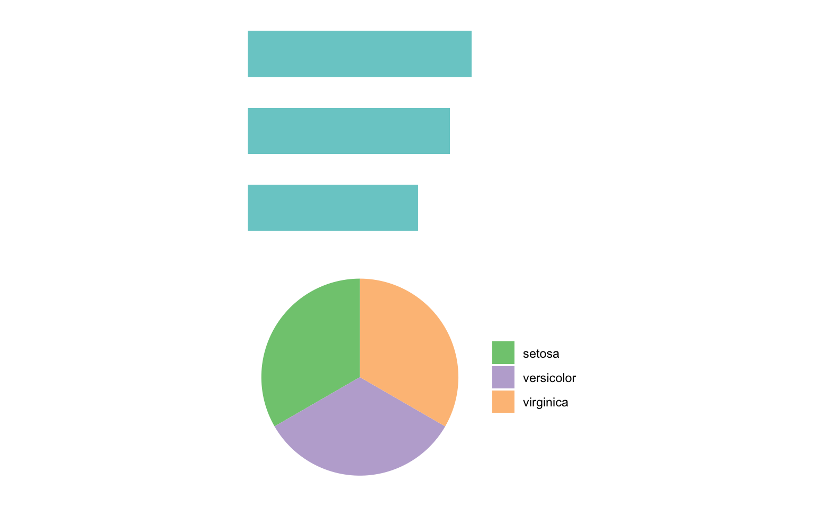
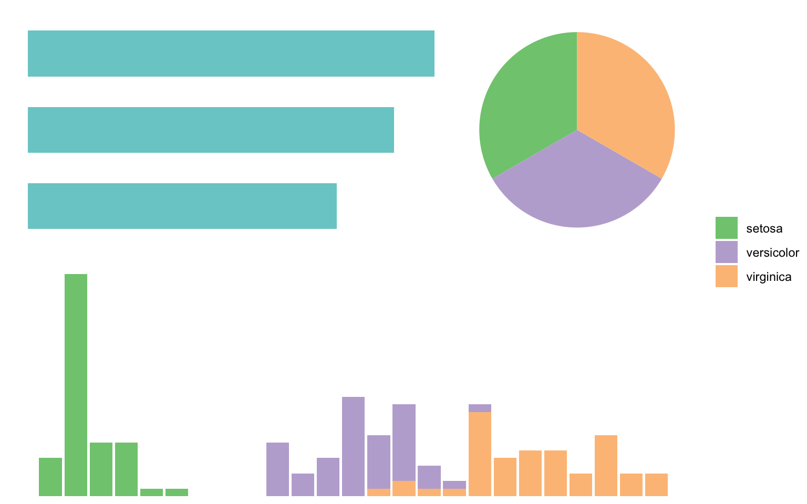
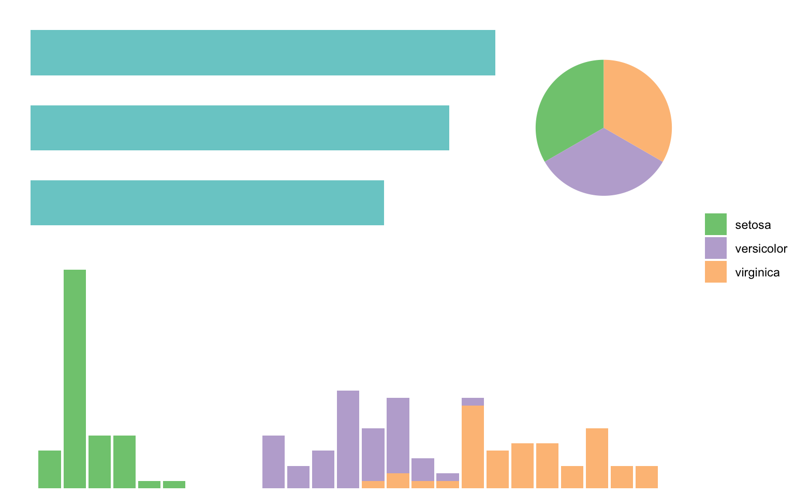
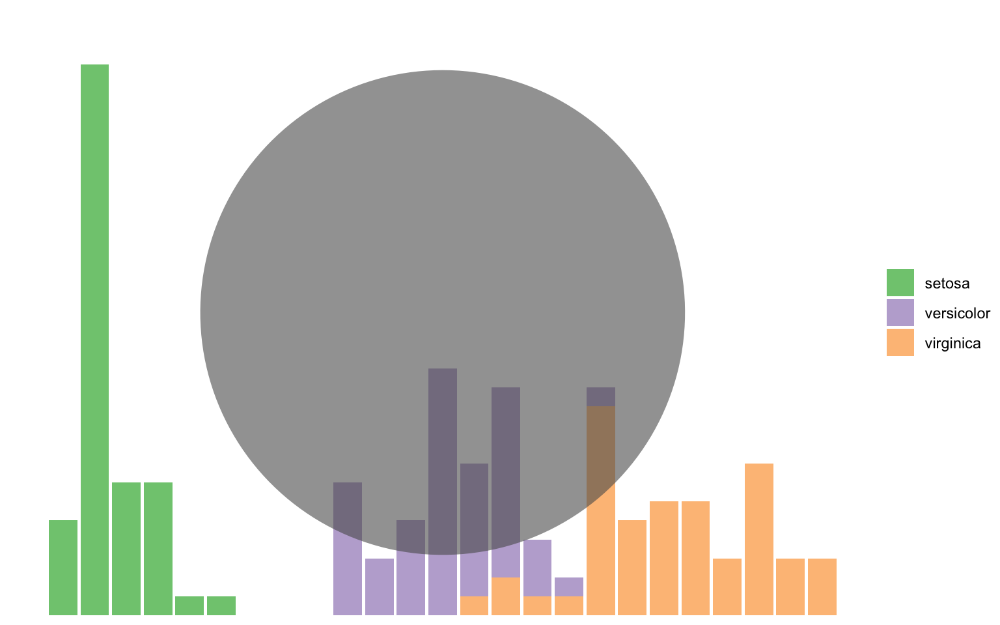
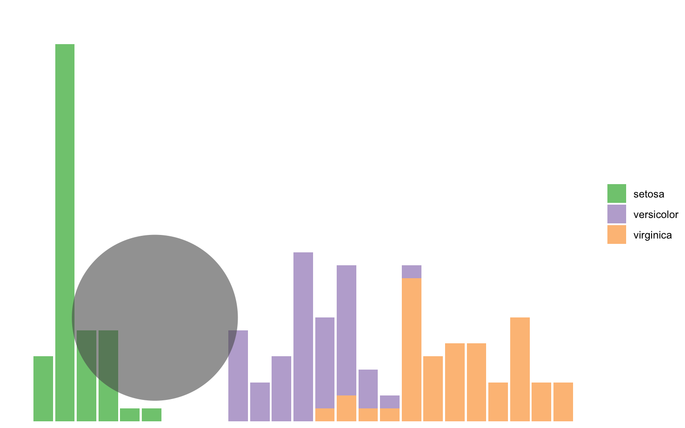
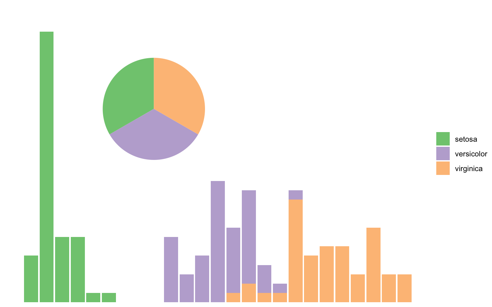
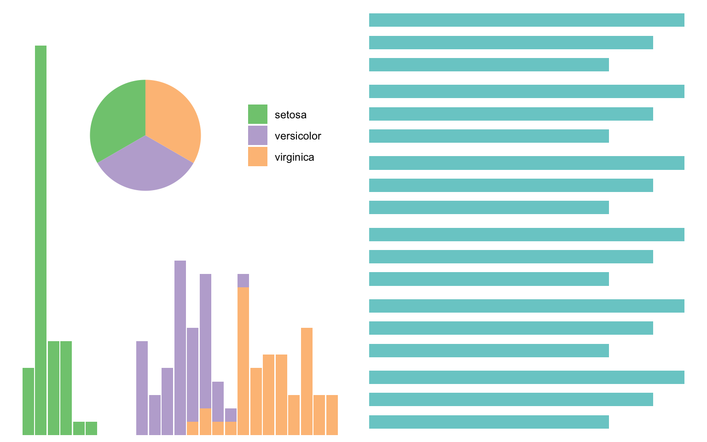

[El paquete `{patchwork}`](https://patchwork.data-imaginist.com/articles/patchwork.html) ayuda a **unir y combinar gráficos** de `{ggplot2}`. En esta guía veremos los principios del uso de este paquete, que nos permitirá construir visualizaciones más complejas



``` r
library(dplyr)
library(ggplot2)
library(patchwork)
```

Primero crearemos dos gráficos de muestra, a partir del dataset `iris`.

``` r
grafico_a <- iris |> 
  # calcular promedios por especie
  group_by(Species) |> 
  summarize(Sepal.Length = mean(Sepal.Length)) |> 
  # gráfico
  ggplot() +
  aes(x = Sepal.Length, y = Species) +
  # barras
  geom_col(fill = "darkslategray3", width = 0.6) +
  theme_void()
```

``` r
grafico_b <- iris |> 
  # conteo por especies
  count(Species) |> 
  # porcentaje
  mutate(p = n/sum(n)) |> 
  # gráfico
  ggplot() +
  aes(x = 1, y = p, fill = Species) +
  geom_col() +
  # escala de color
  scale_fill_brewer(name = "Set2", type = "qual") +
  # gráfico de torta
  coord_polar(theta = "y") +
  theme_void() +
  guides(fill = guide_legend(title = NULL))
```

### Combinar dos gráficos lado a lado

Gracias a `{patchwork}`, unir dos gráficos uno al lado del otro es tan sencillo como "sumarlos":

``` r
grafico_a + grafico_b
```



Si queremos ajustar las proporciones de los gráficos, agregamos la función `plot_layout()` para especificar las proporciones. Haremos que uno de los gráficos sea el doble de ancho que el otro:

``` r
grafico_a + grafico_b + plot_layout(widths = c(1, 2))
```



### Combinar dos gráficos uno arriba del otro

Para combinar dos gráficos en disposición vertical; es decir, uno arriba del otro, bsata con "dividir" los dos gráficos:

``` r
grafico_a / grafico_b
```



### Combinar más de dos gráficos

Creemos un tercer gráfico de nuestra para probar la combinación de tres gráficos en uno solo:

``` r
grafico_c <- iris |> 
  ggplot() +
  geom_bar(aes(Petal.Width, fill = Species)) +
  scale_fill_brewer(name = "Set2", type = "qual") +
  scale_y_continuous(expand = expansion(c(0, 0.1))) +
  theme_void() +
  guides(fill = guide_legend(title = NULL))
```

Teniendo dos gráficos, podemos disponerlos uno al lado dle otro, y el tercer gráfico debajo de los dos primeros; es decir, sumar `a` + `b` y luego dividirlos por `c`:

``` r
(grafico_a + grafico_b) / grafico_c + 
  plot_layout(guides = "collect")
```



En este caso agregamos una función `plot_layout()` para combinar las leyendas de dos de los gráficos, dado que las leyendas son iguales y sería redundante que cada gráfico las presente por separado.

Para ajustar las proporciones en este caso, podemos primero crear la fila 1 del gráfico final, ajustando su proporción, y luego a esta fila agregarle el gráfico de abajo:

``` r
fila_1 <- grafico_a + grafico_b + plot_layout(widths = c(3, 1))

fila_1 / grafico_c + plot_layout(guides = "collect")
```



## Poner un gráfico dentro de otro

``` r
grafico_d <- iris |> 
  ggplot() +
  geom_bar(aes(x = 1), alpha = 0.6) +
  coord_polar(theta = "y") +
  theme_void()
```

También podemos necesitar insertar un gráfico dentro de otro, quizás porque uno de los gráficos representa un detalle del otro, y como tal puede que sea más conveniente disponerlo dentro del primero.

Para insertar un gráfico dentro de otro, se agrega a un gráfico la función `inset_element()` con el gráfico que queremos insertar. Dentro de esta función hay que definir los argumentos `top`, `bottom`, `left` y `right`, que corresponden al perímetro en el que se ubicará el gráfico insertado.

Para ubicar el gráfico dentro, debemos entender que el límite superior del gráfico corresponde a `top = 1`, y el inferior a `bottom = 0`, mientras que el límite izquierdo es `left = 0` y el derecho es `right = 1`. Si usamos estos argumentos, el gráfico insertado usaría la totalidad del espacio del gráfico base:

``` r
grafico_c + inset_element(grafico_d,
                          top = 1, bottom = 0,
                          left = 0, right = 1)
```



Notemos que las coordenadas corresponden con el *centro* del área del gráfico, excluyendo el área de la leyenda.

Si ponemos que `top = 0.5`y `right = 0.5`, entonces el borde superior del gráfico insertado estará en la mitad del alto del gráfico base, y el borde derecho en la mitad del ancho; es decir, ubicándolo en la esquina inferior izquierda.

``` r
grafico_c + inset_element(grafico_d,
                          top = 0.5, bottom = 0,
                          left = 0, right = 0.5)
```



Sabiendo esto, podemos ajustar los argumentos de `inset_element()` para poner el gráfico exactamente donde queremos:

``` r
grafico_c + inset_element(grafico_b + guides(fill = guide_none()),
                          top = .9, bottom = .4,
                          left = .2, right = .5)
```



Naturalmente, podríamos combinar este gráfico con un gráfico insertado con otro gráfico más, o con la cantidad que se nos ocurra:

``` r
grafico_c + 
  guides(fill = guide_legend(position = "inside", title = NULL)) +
  theme(legend.position.inside = c(.8, .7)) +
  inset_element(grafico_b + guides(fill = guide_none()),
                top = 1, bottom = .4,
                left = .2, right = .6) +
  (grafico_a / grafico_a / grafico_a / grafico_a / grafico_a / grafico_a)
```



Otra forma de insertar un gráfico dentro de otro es ubicándolo a una cierta distancia desde un borde; en este caso, insertaremos un gráfico que solo contiene un texto (el año) en al esquina superior derecha, y para ello, definiremos que el borde izquierdo de la figura insertada `inset_element()` se ubique en el borde izquierdo del gráfico menos 3 centímetros, el borde derecho de la figura insertada en el límite derecho del gráfico, el borde superior en el límite superior del gráfico, y el borde inferior de la figura a 2 centímetros menos del límite superior del gráfico.

``` r
# gráfico vacío que solo contiene un texto
texto_año <- ggplot() + annotate("text", x = 1, y = 1, label = 2025, size = 7) +  theme_void()

grafico_c +
  inset_element(
      texto_año,
      left = unit(1, 'npc') - unit(3, 'cm'),
      right = 1,
      top = 1, 
      bottom = unit(1, 'npc') - unit(2, 'cm'),
      align_to = "full")
```


Podemos usar esta técnica para insertar cualquier texto en cualquier posición de un gráfico, incluso fuera de los límites de las escalas (que sería una limitación de hacer lo mismo con `annotate()`.

La gracia de usar `inset_element()` es que posicionamos los elementos con respecto al tamaño del gráfico (donde el borde izquierdo es 0 y el derecho es 1, y el borde inferior es 0 y el superior es 1) y no a las coordenadas de las variables `x` e `y`, lo que nos permite ubicar los elementos de forma independiente al sistema de coordenadas del gráfico.


