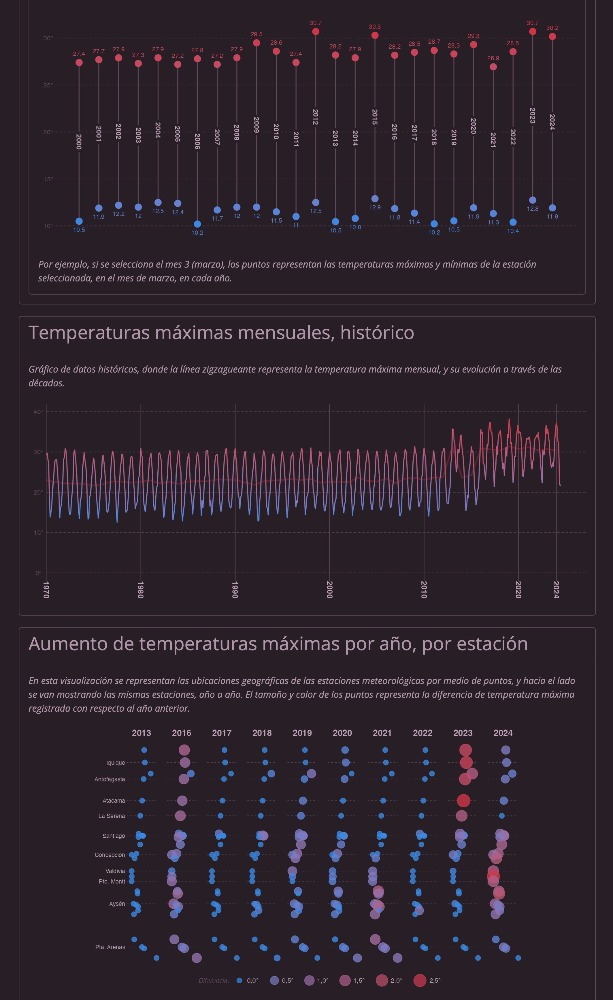
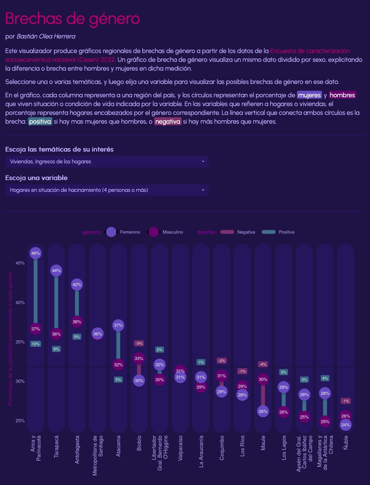

Portafolio de una selección de las aplicaciones públicas de visualización de datos que he desarrollado. Se trata de pequeñas aplicaciones web diseñadas para hacer más accesibles y comprensibles ciertos conjuntos de datos sobre temáticas sociales, políticas y socioeconómicas. Todas estas aplicaciones web fueron desarrolladas con R, y tanto el código de fuente como sus datos están disponibles de manera pública y abierta.

Otra versión más detallada de este portafolio está disponible en este enlace: <https://bastianolea.github.io/shiny_apps/>

<a href="/apps/temperaturas_chile/">
<h3 style="margin-top:0px;text-align:center;">Temperaturas extremas en Chile</h3>
</a>

Consulta datos históricos de temperaturas extremas en el país, desde 1970 hasta 2024, y visualiza los cambios históricos en las temperaturas producto de la crisis climática.

<a href="/apps/prensa_chile/">
<h3 style="margin-top:0px;text-align:center;">Análisis de prensa chilena</h3>
</a>

Aplicación de análisis de texto de prensa escrita chilena. Contiene varios gráficos que cuantifican el contenido de las noticias de Chile, semana por semana. Los gráficos permiten identificar qué palabras son las más usadas a través del tiempo, lo cual a su vez revela cómo va variando el acontecer nacional. Los datos de esta aplicación son obtenidos mediante web scraping de forma diaria, pero la app se actualiza semanalmente. La base de datos comprende más de 600 mil noticias, que suman más de 100 millones de palabras, abarcando más de 21 fuentes periodísticas distintas.

<a href="/apps/delincuencia_chile/">
<h3 style="margin-top:0px;text-align:center;">Estadísticas de delincuencia en Chile</h3>
</a>

Visualización de estadísticas oficiales de delincuencia, separadas por comuna y delito, para darle contexto y seriedad a un tema país a partir de datos objetivos. Selecciona una comuna y luego uno o varios delitos para obtener un gráfico de líneas que muestra una serie de tiempo de la cantidad de delitos, desde 2010 hasta 2023. Además, puedes visualizar la cantidad de delitos por año en la comuna seleccionada, el promedio de delitos en los gobiernos recientes, y una visualización de los tres delitos más frecuentes en cada comuna.

<a href="/apps/censo_proyecciones/">
<h3 style="margin-top:0px;text-align:center;">Proyecciones de población del Censo</h3>
</a>

Aplicación web que visualiza los datos oficiales del Instituto Nacional de Estadísticas de Chile sobre proyecciones de población; es decir, estimaciones del crecimiento poblacional hacia el futuro, a partir de los datos obtenidos en los censos oficiales.

<a href="/apps/comparador_mapas_chile/">
<h3 style="margin-top:0px;text-align:center;">Comparador de mapas comunales de Chile</h3>
</a>

Aplicación que reúne más de 170 variables urbanísticas, sociales y económicas, de nivel comunal, para todas las comunas del país, que permite al usuario elegir dos variables simultáneamente para compararlas visualmente por medio de dos mapas regionales. El visualizador entrega la posibilidad de poner a prueba relaciones entre variables tan distintas como áreas verdes y puntajes de pruebas de selección universitaria, nivel de ingresos y tasa de delitos, participación electoral y situación de las viviendas, etc., dejando al usuario la tarea de explicar los fenómenos que pueden surgir.

<a href="/apps/economia_chile/">
<h3 style="margin-top:0px;text-align:center;">Indicadores económicos de Chile</h3>
</a>

Tablero que presenta +8 indicadores económicos del Banco Central de Chile, cuya presentación resumida permite analizar la situación económica del país. Los datos de esta aplicación son obtenidos de forma automática dos veces al día, garantizando que se encuentren actualizados. Además, la arquitectura de esta app facilita el proceso de añadir nuevos indicadores.

<a href="/apps/corrupcion_chile/">
<h3 style="margin-top:0px;text-align:center;">Corrupción en Chile</h3>
</a>

Catálogo y visualizador de los casos de corrupción más trascendentes del último tiempo en Chile, para poner en perspectiva los montos, responsables, y sectores políticos asociados. Los datos son recopilados manualmente para producir una tabla con la mayor información posible sobre casos de corrupción, incluyendo responsables, delitos específicos, afiliación a partidos políticos, fundaciones involucradas y más, para alientar visualizaciones interactivas que permitan a la cuidadanía comprender de dónde viene la corrupción y cómo nos afecta como país.

<a href="/apps/millonarios_chile/">
<h3 style="margin-top:0px;text-align:center;">Millonarios de Chile</h3>
</a>

Con este visualizador puedes poner en perspectiva las fortunas individuales más grandes del país, para así dimensionar un aspecto clave de la desigualdad en Chile y el mundo. Diversas fuentes de datos permiten recopilar un listado de los empresarios más ricos de Chile. Distintas técnicas estadísticas y de visualización permiten dimensionar las enormes fortunas de estas personas, por ejemplo, comparando con los propios ingresos del usuario, o con los ingresos de toda la población del país.

<a href="/apps/femicidios_chile/">
<h3 style="margin-top:0px;text-align:center;">Femicidios en Chile</h3>
</a>

Sitio con gráficos y tablas que expresan en cifras los datos de femicidios cometidos en Chile. Estos datos, mantenidos por la Red Chilena contra la Violencia hacia las Mujeres, expresan la brutalidad manifestada de una sociedad patriarcal donde la violencia es una realidad transversal, llevada a su extremo en la agresión y asesinato de mujeres por razones de género.

<a href="/apps/casen_genero_brechas/">
<h3 style="margin-top:0px;text-align:center;">Brechas de género Casen</h3>
</a>

Visualizador que detalla brechas de género en temas sociales, de vivienda e ingresos, para analizar variables en las que las mujeres experimentan peores condiciones de vida, a nivel regional Selecciona una de las variables disponibles para generar un gráfico con todas las regiones del país, donde se detalla el porcentaje de la población femenina y masculina afectada por la variable seleccionada, o si eliges variables de vivienda o familia, el porcentaje de hogares con jefatura femenina o masculina correspondientes. Los puntos del gráfico además se detallan con las brechas o diferencias entre géneros existentes, volviendo explícitas las desigualdades o ausencia de las mismas.

<a href="/apps/casen_comparador_ingresos/">
<h3 style="margin-top:0px;text-align:center;">Comparador de ingresos Casen</h3>
</a>

Visualizador que compara distribuciones y promedios de ingresos entre las comunas de Chile, para observar las diferencias en las realidades socioeconómicas del país. Selecciona un grupo de comunas, y elige una variable de ingresos, como ingresos individuales, ingresos por hogar, ingresos per cápita o montos de pensiones/jubilación, para obtener un gráfico de densidad que describe y compara las poblaciones de las comunas, y un gráfico de dispersión que ubica los ingresos de las comunas seleccionadas en comparación a todas las demás comunas del país.

<a href="/apps/casen_relacionador/">
<h3 style="margin-top:0px;text-align:center;">Relacionador Casen</h3>
</a>

Visualizador que permite relacionar hasta 3 variables socioeconómicas en un gráfico de dispersión por comunas, para analizar la relación entre ellas. Este visualizador permite experimentar correlaciones con numerosas variables de temas como ingresos, educación, condiciones de vida, condiciones laborales, y más, dado que permite utilizar libremente cualquiera de ellas como los ejes del gráfico, creando así visualizaciones personalizadas. Por ejemplo, se puede explorar si las comunas con bajo nivel educacional promedio son también las de menores ingresos, si es que las comunas con viviendas de menor calidad y menores ingresos se correlacionan con mayor hacinamiento o no, si las comunas de altos ingresos tienen menores afiliados a Fonasa, y más.

<a href="/apps/cep_graficador/">
<h3 style="margin-top:0px;text-align:center;">Graficador encuesta CEP</h3>
</a>

Aplicación web que permite visualizar gráficos de los resultados de las encuestas del Centro de Estudios Públicos. Además, permite desagregar resultados en base a categorías sociodemográficas, filtrar grupos, configurar los gráficos y descargar los datos.

