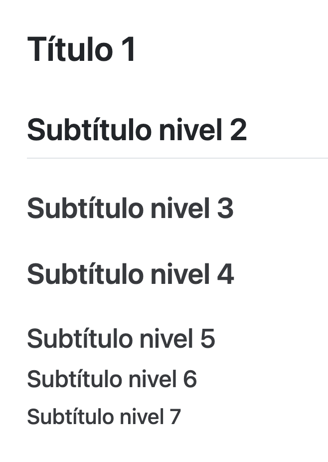
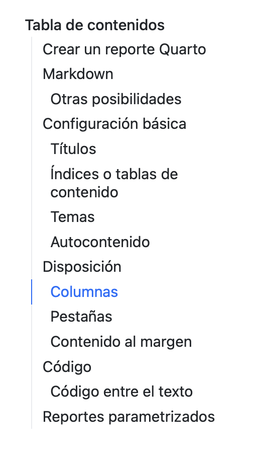
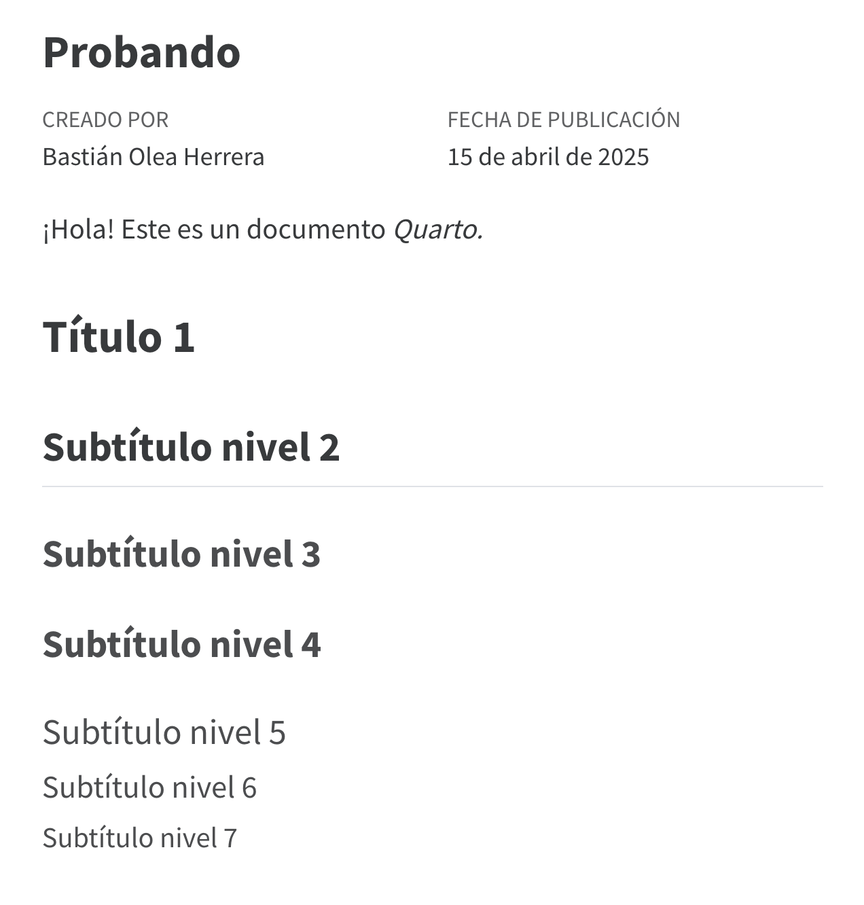
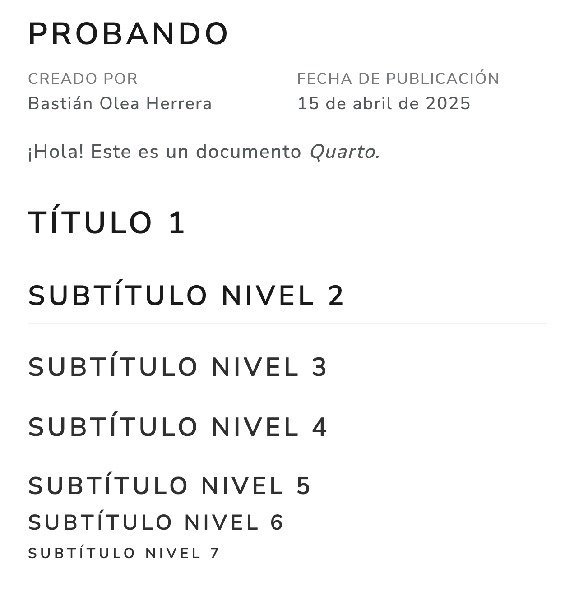
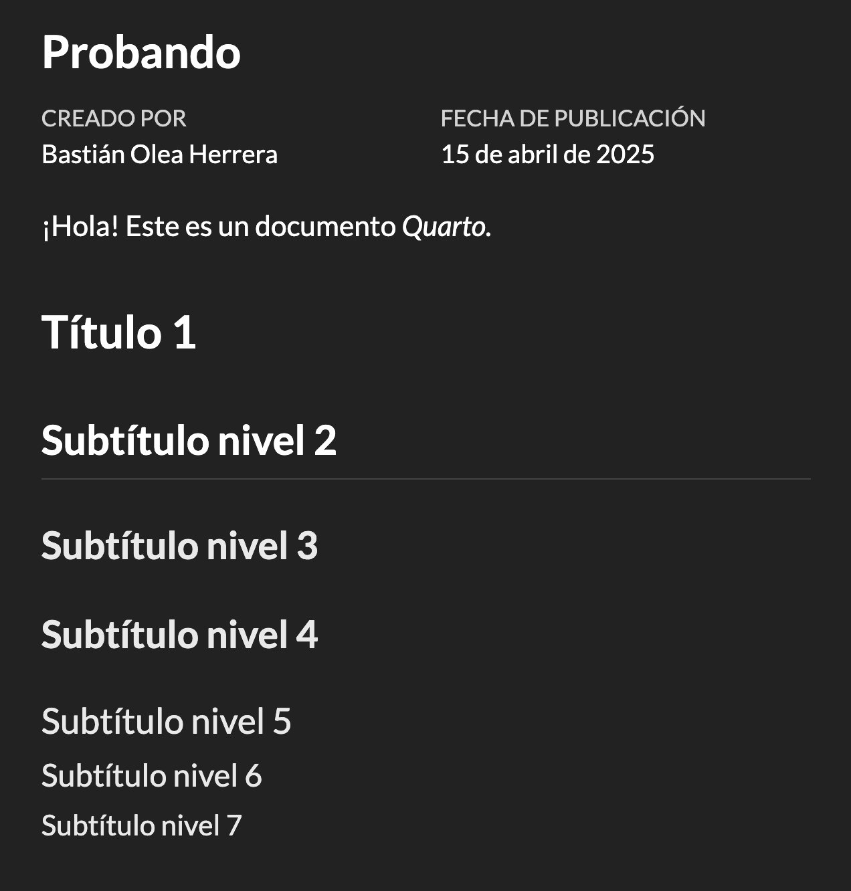
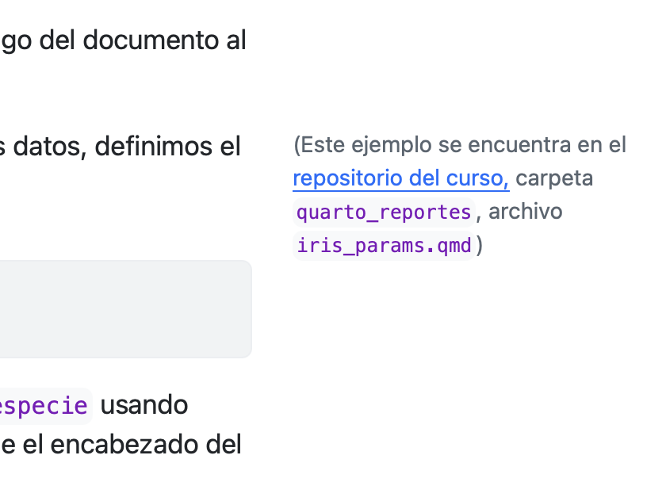
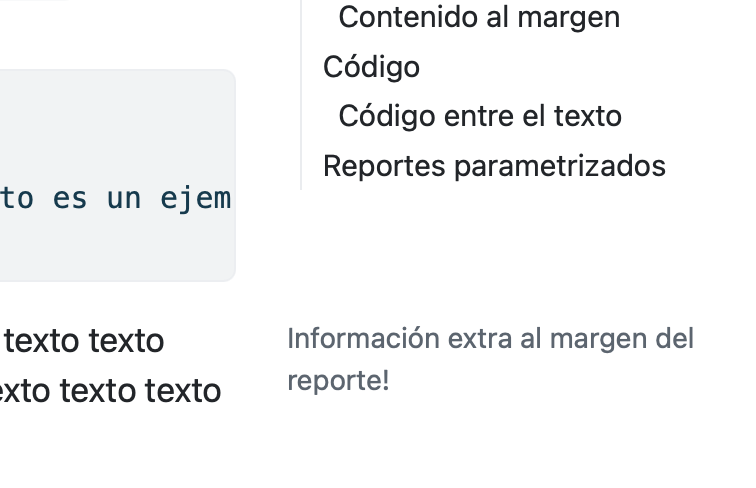
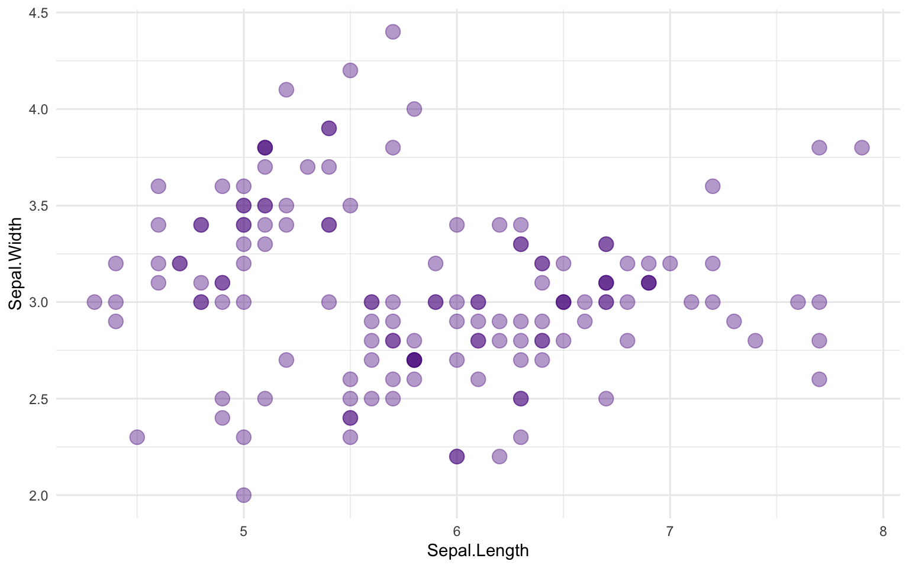
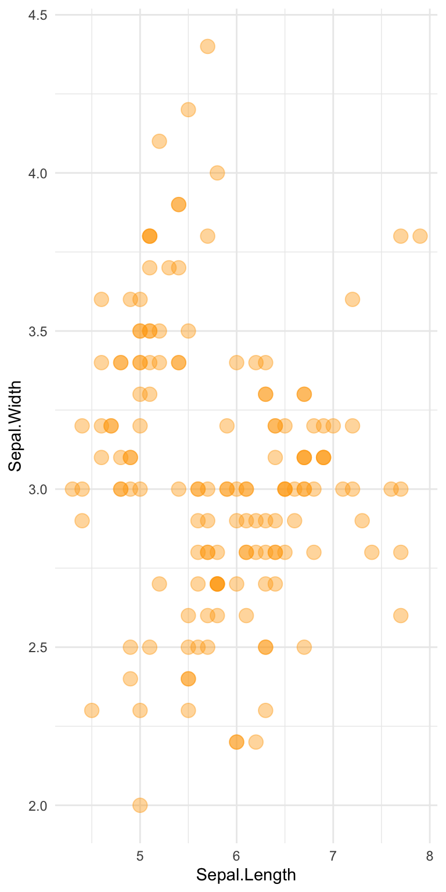

[Quarto](https://quarto.org) es una herramienta de publicación de documentos que te permite generar reportes de manera muy sencilla, utilizando bloques de código de R. En estos reportes puedes incluir tablas, gráficos, y mucho más, de forma atractiva y simple, para poder compartir tus análisis y resultados con otras personas.




## Crear un reporte Quarto

En RStudio, crear un nuevo archivo desde *New File*, y elegir *Quarto Document*.



Cuando hagamos los cambios que deseemos, presionamos el botón *Render* para generar el reporte a partir del código. El reporte se abre en el visor *Viewer*, y quedará guardado como un archivo `.html` para abrirlo con un navegador web.



El formato `.html` es el mismo formato que se usa para crear la mayoría de los sitios web, porque un reporte Quarto es básicamente una página web local. Es una forma más moderna, accesible, flexible e interactiva de crear documentos, a diferencia de formatos enfocados en la impresión como `.pdf` o formatos propietarios y editables como `.docx`.

## Markdown

Markdown es la forma de escritura principal usada en Quarto. Permite escribir texto enriquecido a partir de texto plano (código), usando símbolos de marcado para definir el estilo del texto. Más información [en esta guía.](https://quarto.org/docs/authoring/markdown-basics.html)

Lo que hace Markdown es ayudarnos a escribir código `html` con símbolos de marcado fáciles de recordar.

Algunos de los estilos básicos que puedes darle al texto son los siguientes:

``` markdown
**negrita**
*itálica* o _itálica_
<u>subrayado</u>
~~tachado~~
`código`
```

El uso de estos símboos de marcado resultarían en los siguientes textos:

<div style = "line-height: 6pt;">

**negrita**

*itálica*   o _itálica_

<u>subrayado</u>

~~tachado~~

`código`

</div>

Los cuales a su vez se ven así porque internamente fueron traducidos a `html`!

Para crear un título en tu documento, antepone un signo gato (`#`) al texto. Mientras más signos gato pongas, el titular será de un nivel menor; es decir, se volverán subtítulos.



### Otras posibilidades

#### Separadores

Puedes insertar **separadores** escribiendo cuatro guiones. Estos resultan en una línea vertical, como la de encima del subtítulo anterior.

``` markdown
----
```

#### Enlaces

Para agregar un **enlace** en Markdown, escrirbimos el texto del enlace entre corchetes, y luego el enlace al que queremos dirigir entre paréntesis:

    [Texto](http://enlace.cl)

El [enlace se vería así](https://bastianolea.rbind.io/about/). Naturalmente, puedes [mezclar **estilos** de *texto* dentro](https://bastianolea.rbind.io/about/) de un enlace.

#### Notas al pie de página

Para agregar una **nota al pie** se escribe el número de la nota entre corchetes, antecedido por el símbolo de superíndice o potencia `^`.

Ejemplo de una nota al pie[^1]. También se puede agregar directamente en el texto[^2].

``` markdown
Agregar una nota al pie[^1].
[^1]: Esta es una nota al pie
```

``` markdown
También se puede agregar directamente en el texto^[De esta forma].
```

#### Imágenes

Agregar una imagen es similar a la forma de hacer un enlace, excepto que la dirección del enlace debe ser a un archivo de imagen en la misma carpeta que el archivo Quarto (`.qmd`), y debes antecederlo por un signo de exclamación (`!`);

    


Puedes encontrar más [consejos básicos sobre Markdown en esta guía.](https://quarto.org/docs/authoring/markdown-basics.html)

------------------------------------------------------------------------

## Configuración básica

Los documentos Quarto se configuran principalmente desde su encabezado o *header*. El encabezado es el código que se encuentra en las primeras líneas, escrito entre tres guiones (`---`). Este código está escrito en lenguaje `yaml`, y permite configurar casi todos los aspectos de apariencia, funcionalidad y exportación del documento.

### Títulos

Puedes cambiar el título del documento en la etiqueta `title`.

``` yaml
---
title: "Probando"
---
```

También puedes agregar autoría y fecha, simplemente agregando las configuraciones debajo de las existentes:

``` yaml
---
title: "Probando"
author: "Bastián Olea Herrera"
date: 2025-04-01
lang: es
---
```



Puedes cambiar el texto que aparece arriba de alguna de las etiquetas. Sugiero buscar en internet este tipo de cosas, ya que Quarto tiene muy buena documentación.

``` yaml
---
lang: es
language: 
  title-block-author-single: "Creado por"
---
```

Puedes personalizar el titular del documento con estas etiquetas, para cambiar el color de fondo del título y el color del texto:

``` yaml
---
title-block-banner: "#f0f3f5"
title-block-banner-color: "black"
---
```



Para más información sobre el bloque titular, [revisa esta guía.](https://quarto.org/docs/authoring/title-blocks.html)



### Índices o tablas de contenido

A medida que agregas títulos Markdown, puedes agregar una tabla de contenidos que se actualizará automáticamente con los títulos que vayas agregando. Para más información, [revisa esta otra guía](https://quarto.org/docs/output-formats/html-basics.html#table-of-contents).

Activa la tabla de contenidos reemplazando el `format` de tu documento por uno personalizable:

``` yaml
format:
  html
    toc: true
```

Personaliza el nivel de titulares que aparecen en la tabla de contenidos con `toc-depth`:

``` yaml
format:
  html
    toc: true
    toc-expand: 2
```

También poner enlaces debajo del índice, por ejemplo a tu sitio web o redes sociales. Los enlaces pueden tener un [ícono personalizado](https://quarto.org/docs/output-formats/html-basics.html#code-links-and-other-links).

``` yaml
format:
  html:
    other-links:
      - text: Enlace 1
        href: https://data.nasa.gov/
      - text: Enlace 2
        icon: file-code
        href: https://data.nasa.gov/
```



### Títulos con numeración

Si tienes una estructura de títulos y subtítulos compleja, puedes agregar numeración a los títulos tanto en la tabla de contenidos como en los mismos títulos.

Para que las secciones se numeren automáticamente en la tabla de contenidos agrega `number-sections`.

``` yaml
format:
  html
    toc: true
    toc-expand: 2
    number-sections: true
```



### Temas

Configura el tema de tu reporte para cambiar su apariencia completa, incluyendo colores, espaciados, tipografías y más. Revisa la [lista de temas en este enlace](https://quarto.org/docs/output-formats/html-themes.html).

Tan solo agregando `theme` y el nombre del tema (de la [lista de temas](https://quarto.org/docs/output-formats/html-themes.html)) cambiarás la apariencia completa de tu reporte.

``` yaml
---
theme: lux
---
```

<div style="display: flex; margin:auto;">
  <div style="flex: 1; margin: auto; padding: 6px;">
  
  </div>
  <div style="flex: 1; margin: auto; padding: 6px;">
  
  </div>  
  <div style="flex: 1; margin: auto; padding: 6px;">
  
  </div>
</div>
<div style="text-align: center; margin: auto; opacity: 65%; font-size: 85%;">
<em>Temas Cosmo, Lux y Darkly</em>
</div>

Personaliza la **tipografía** y el tamaño global de las letras:

``` yaml
---
mainfont: Courier
fontsize: "20px"
---
```



### Documento autocontenido

Los reportes Quarto son archivos web, y como tales requieren de dependencias externas, como scripts, estilos e imágenes, que se guardan como archivos. Éstos se guardan en una carpeta con el mismo nombre de tu reporte. Pero esto puede resultar inconveniente para compartir los documentos, además de generar desorden.

Para que el documento no tenga dependencias externas, sino que sea **portable y auto-contenido en un sólo archivo `.html`**, podemos hacer que el reporte contenga todas sus dependencias dentro de sí agregando lo siguiente a la etiqueta `format` en el encabezado de nuestro documento:

``` yaml
format:
  html:
    embed-resources: true
```

Recomiendo siempre usar esta opción, a pesar de que puede generar archivos más pesados.

------------------------------------------------------------------------

## Disposición

Veamos algunas formas de personalizar la disposición de los reportes, como columnas, pestañas y contenido en los márgenes. Para más información, consulta [esta guía oficial](https://quarto.org/docs/output-formats/html-basics.html)

### Columnas

Para escribir contenido en columnas, debes crear un *bloque* (`::::`) con el estilo `.columns`, y dentro de él, crear dos secciones con el estilo `.column` indicando el porcentaje del ancho que tomarán:

``` markdown
:::: {.columns}

::: {.column width="40%"} 
Columna izquierda
:::

::: {.column width="60%"}
Columna derecha
:::

::::
```



Si quieres agregar un espacio entre ambas columnas, crea una columna vacía que sea más delgada:

``` markdown
:::: {.columns}

::: {.column width="40%"} 
Columna izquierda
:::

::: {.column width="5%"} 
:::

::: {.column width="55%"}
Columna derecha
:::

::::
```

### Pestañas

Para poner [contenido dentro de pestañas](https://quarto.org/docs/output-formats/html-basics.html#tabsets), crea un bloque con el estilo `.panel-tabset`, y dentro de éste, todos los títulos Markdown que pongas (`##`, `###`, etc.) aparecerán en su propia pestaña:

``` markdown
::: {.panel-tabset}

## Pestaña 1
Contenido de la pestaña 1

## Pestaña 3
Contenido de la pestaña 2

## Pestaña 3
Contenido de la pestaña 3
:::
```

Si usas como estilo `{.panel-tabset .nav-pills}`, los botones de las pestañas aparecerán rellenados.



### Contenido al margen

Puedes agregar cualquier contenido en los márgenes del documento, como fórmulas, aclaraciones, o incluso tablas y gráficos, usando un bloque con el estilo `.aside`:

``` markdown
::: {.aside}
\
Esto es un ejemplo. Esto es un ejemplo. Esto es un ejemplo. Esto es un ejemplo. Esto es un ejemplo. Esto es un ejemplo. Esto es un ejemplo. Esto es un ejemplo. Esto es un ejemplo. 
:::
```

<div style="display: flex; margin: auto;">
  <div style="flex: 1; margin: auto; padding: 6px;">
  
  </div>
  <div style="flex: 1; margin: auto; padding: 6px;">
  
  </div>  
</div>

------------------------------------------------------------------------

## Código

La gracia de Quarto es combinar código con texto. De esta forma puedes combinar tus procesos, análisis y desarrollos con la presentación de tus resultados en un mismo lugar.

Para agregar código, creamos bloques o *chunks*, en los que podemos escribir código de R, y sus resultados aparecerán en el documento.

``` r
library(ggplot2)

iris |> 
  ggplot() +
  aes(x = Sepal.Length, y = Sepal.Width) +
  geom_point(color = "purple4", alpha = 0.4, size = 4) +
  theme_minimal()
```



Si queremos que no aparezca el código, y sólo aparezca el output, agregamos `#| echo: false` al inicio del bloque. De este modo sólo saldrá el resultado del código, sin el código mismo. Por ejemplo, si en un bloque pongo `head(iris)` pero agrego antes `#| echo: false`, sólo saldrá el resultado, sin el código:

      Sepal.Length Sepal.Width Petal.Length Petal.Width Species
    1          5.1         3.5          1.4         0.2  setosa
    2          4.9         3.0          1.4         0.2  setosa
    3          4.7         3.2          1.3         0.2  setosa
    4          4.6         3.1          1.5         0.2  setosa
    5          5.0         3.6          1.4         0.2  setosa
    6          5.4         3.9          1.7         0.4  setosa

Algunas funciones u operaciones en R entregan mensajes además del resultado esperado. Por ejemplo, cuando ocurren *warnings*. Para omitir que los bloques impriman mensajes y/o alertas, agregamos `#| message: false` y `#| warning: false` respectivamente.

```` markdown
```{r}
#| message: false
#| warning: false
library(dplyr)
```
````

Para configurar el tamaño de los gráficos, agregamos al bloque las opciones `#| fig-width: 4` y/o `#| fig-height: 6` para modificar el ancho o alto, respectivamente. Por defecto, los gráficos son de 7 x 5.

```` markdown
```{r}
#| message: false
#| warning: false
#| fig-width: 4
#| fig-height: 8

iris |> 
  ggplot() +
  aes(x = Sepal.Length, y = Sepal.Width) +
  geom_point(color = "orange", alpha = 0.4, size = 4) +
  theme_minimal()
```
````



### Código entre el texto

Para integrar código en el texto de los párrafos de tu reporte, por ejemplo, para insertar una cifra, escribimos comillas invertidas (`` ` ``), la letra `r`, y el código cuyo output queremos que aparezca en el documento:



De esta forma podemos agregar texto que proviene desde nuestros datos: el dataset `iris` tiene 5 variables que describen 3 especies de plantas.



------------------------------------------------------------------------

Aprender a generar documentos Quarto es una herramienta que puede llevar tus habilidades de análisis de datos al siguiente nivel. Con Quarto puedes presentar tu resultado de forma mucho más atractiva, pero también puedes aprender a automatizar muchísimo trabajo relacionado a reportabilidad.

Si quieres seguir aprendiendo Quarto, por ejemplo a [automatizar reportes con documentos Quarto parametrizados](../../../blog/quarto_params/), o a generar contenido automáticamente para tus reportes usando loops, [revisa las siguientes publicaciones de este blog en la etiqueta Quarto!](../../../tags/quarto/)



[^1]: Nota al pie.

[^2]: De esta forma
