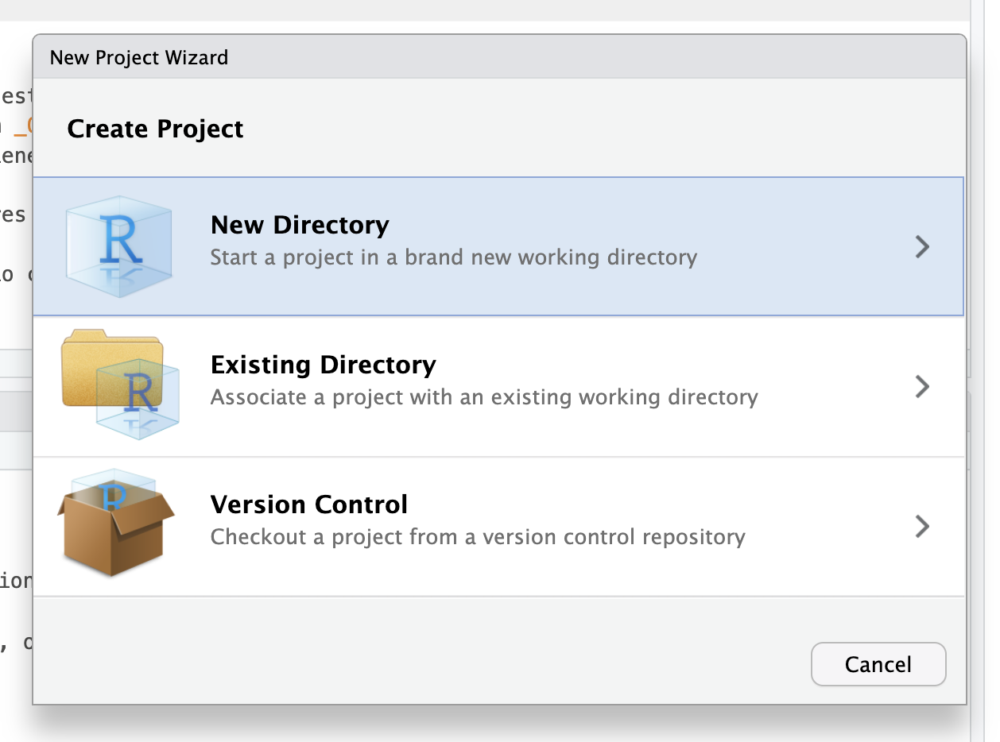

### Proyectos
Antes de hacer cualquier trabajo que involucre datos con R, se recomienda crear un _Proyecto_ de RStudio. Un proyecto es una forma de definir la carpeta específica donde vamos a guardar todos los scripts y archivos que vamos a necesitar. Se caracteriza por un archivo que termina en `.Rproj`, que marca nuestro espacio de trabajo: una carpeta reúne todas las piezas de nuestro análisis.

¿Por qué trabajar con proyectos? A través del tiempo vamos a trabajar con distintas fuentes de datos, para objetivos distintos, incluso para llevar a cabo ideas o trabajos completamente diferentes. Los proyectos de RStudio nos permiten separar estos distintos espacios de trabajo de forma clara. Si tenemos múltiples proyectos en los que trabajamos con R, al delimitarlos por medio de proyectos de RStudio podremos cambiar entre uno y otro de manera muy sencilla. También podremos tener distintas sesiones de R abiertas en distintas ventanas de RStudio, cada uno con proyectos distintos. Esto significa que cada proyecto de R va a tener un entorno distinto y scripts distintos. De esta forma no mezclamos cosas ni nos confundimos.

El beneficio principal de trabajar con proyectos en R es que simplifican muchísimo la **gestión de las rutas de archivos**. Todos los archivos con los que trabajamos nuestros computadores se encuentran en ubicaciones distintas, y estas ubicaciones varían entre computador y computador, y entre distintas personas. Por ejemplo, los datos con lo que yo trabajo están en una carpeta que tú no tienes en tu computador, y estas carpetas están a su vez dentro de una carpeta de usuario, que es distinto para cada persona. Peor aún, las estructuras de archivos son distintas en los diferentes sistemas operativos. Al crear un proyecto de RStudio, **las rutas de todos los archivos dentro del proyecto empezarán desde la carpeta del proyecto**. Esto significa que, si trabajamos en un proyecto de RStudio, podemos omitir completamente las rutas completas del archivo en nuestros computadores. En términos prácticos, un archivo que está ubicado en una carpeta como `/home/users/bastian/Documentos/Análisis de datos/Trabajo/Ejemplo/script.R` podrá ser cargado tan solo con la ruta `script.R` si abrimos un proyecto de R e la carpeta `Ejemplo`. Esto es bueno por dos razones: porque no tendremos que escribir la ruta del archivo completa, y porque si yo envío este proyecto a otra persona, o lo subo a internet para compartirlo, cualquier persona podrá ejecutar los scripts en sus computadores, porque los archivos dentro del proyecto podrán estar en cualquier lugar de su computador, pero gracias al proyecto, R encontrará los archivos.

