## Introducción a {ggplot2}

`{ggplot2}` es una librería de visualización de datos bastante popular en el mundo de la ciencia de datos. Sus principales características son su atractivo, su conveniencia para la exploración de datos, un gran potencial de personalización, y un extenso ecosistema de extensiones que nos permiten generar visualizaciones prácticamente de cualquier tipo.

Otro beneficio de usarlo es propio de el uso de cualquier herramienta programática para generar resultados en el ámbito del análisis de datos: la reusabilidad del código, que nos permite especificar una sola vez el resultado que queremos y luego volver a aplicarlo infinitas veces con distintos datos, datos actualizados, o variaciones de un conjunto de datos, etc.

La librería `{ggplot2}` crea gráficos por medio de un sistema de capas. Mediante la suma de capas vamos a poder crear expresiones gráficas de nuestros datos, agregando tantas capas como sean necesarias para comunicar los resultados, así como también para afinar la visualización final.

Para entender cómo funciona `{ggplot2}`, veamos primero los principales tipos de **capas** que vamos a poder ir agregando a nuestro gráfico. Cada capa va a tener un rol específico, y es importante saber cómo se llaman para poder aplicarlas cuando queramos modificar uno u otro aspecto de nuestra visualización.

-   **datos:** usualmente la primera capa, que entrega los datos a `{ggplot2}` para poder usar variables como elementos de la visualización
-   **estéticas:** (`aes()`) capa donde se realiza el *mapeo[^1]* de variables a objetos geométricos, leyendas, ejes y escalas
-   \*geometrías:\*\* (`geom_x()`)
-   **escalas:** (`scale_x_y()`) definición de las dimensiones que adquirirán las estéticas, tales como rangos de valores, paletas de colores, límites de los ejes, etc.
-   **coordenadas:** (`coord_x()`): configuración del plano de coordenadas donde se grafican los datos; por ejemplo, definir los límites del gráfico, la proyección de los datos si es que se trata de un mapa, etc.
-   **facetas:** (`facet_x()`) distribución de los datos en matrices de gráficos; son una forma de especificar que queremos dividir la visualización en tantos gráficos como valores tenga una variable
-   **temas:** (`theme()`) configura detalles visuales de todos los elementos del gráfico, tales como fondo, grilla, ejes, tipografía, tamaños, espaciados, bordes y más.

Una vez que entendamos estas piezas básicas de la creación de gráficos con `{ggplot2}`, pasemos a generar nuestras primeras visualizaciones.

``` r
# install.packages("ggplot2")
library(ggplot2)
```

Vamos a crear un gráfico vacío a partir de una primera capa de datos. Para iniciar la creación de un gráfico, usamos la función `ggplot()`, a la cual le pasamos el conjunto de datos que queremos usar.

``` r
iris |> ggplot()
```

``` r
ggplot(data = iris) # equivalente a lo anterior
```


Al llamar la función `ggplot()` se genera un gráfico completamente vacío, ya que aúnno hemos definido las estéticas ni las geometrías de nuestro gráfico.

A nuestra primera capa de datos le agregaremos una capa de estética, en la cual mapearemos variables a aspectos de la visualización. Los aspectos más básicos de una visualización de datos, y usualmente los que son obligatorios de definir, son las variables mapeadas a los ejes horizontales (`x`) y verticales (`y`) del gráfico.

``` r
iris |> 
  ggplot() + # iniciar el gráfico
  # definir el mapeo de variables a características estéticas del gráfico
  aes(x = Sepal.Length, # eje x (horizontal)
      y = Sepal.Width) # eje y (vertical)
```


Con el código anterior hicimos que el eje horizontal se corresponda con la variable `Sepal.Length` y el eje vertical con `Sepal.Width`. Podemos ver que ambos ejes adoptaron los nombres, rangos y valores de estas variables.

Sin embargo, aún no hay ninguna expresión gráfica directa de los datos en nuestro gráfico, debido a que aún no especificamos una capa de geometría.

### Gráfico de dispersión

Agreguemos una capa `geom_point()` a nuestro gráfico para que los datos se expresen visualmente como puntos:

``` r
iris |> 
  ggplot() + # iniciar el gráfico
  # definir el mapeo de variables a características estéticas del gráfico
  aes(x = Sepal.Length, # eje x (horizontal)
      y = Sepal.Width) + # eje y (vertical)
  # agregar una capa de geometría
  geom_point() # geometría de puntos
```


Con `geom_point()`, cada observación adquiere una coordenada en el gráfico en base a los valores que tengan en las variables de los ejes vertical y horizontal.

Este tipo de gráficos se llaman gráficos de dispersión, y son útiles para explorar datos que poseen varias variables numéricas que pueden estar relacionadas entre sí.

Complementemos el ejemplo anterior, esta vez mapeando una variable más a la estética del `color`:

``` r
iris |> 
  ggplot() +
  aes(x = Sepal.Length, 
      y = Sepal.Width, 
      color = Species) + # variable mapeada al color
  geom_point()
```


Los puntos del gráfico adquieren colores en base a una tercera variable, `Species`, permitiéndonos diferenciar grupos de puntos, y en consiguiente extraer más información desde la visualización.

Ahora mapeemos una variable al tamaño de los puntos:

``` r
iris |> 
  ggplot() +
  aes(x = Sepal.Length, 
      y = Sepal.Width, 
      size = Petal.Length) + # variable mapeada al tamaño
  geom_point(color = "purple2", alpha = 0.5)
```


Dentro de la geometría podemos definir manualmente el color, la transparencia, Y varios otros atributos visuales de todas las geometrías que usemos. En este caso, definimos un color para todos los puntos, y una transparencia que nos permitirá notar cuando existen puntos sobrepuestos (observaciones idénticas).

### Gráfico de histograma

Los gráficos de histograma se usan comúnmente para explorar la distribución de los datos de forma rápida.

``` r
iris |> # datos
  ggplot() + # iniciar
  aes(x = Sepal.Length) + # variable horizontal
  geom_histogram() # histograma
```


Ese tipo de gráficos solamente requiere de una variable. La variable se expresará en el eje horizontal, con la frecuencia de observaciones ascendiendo desde el plano horizontal en correspondencia con la cantidad de casos en cada valor de la variable.

En otras palabras, un histograma nos permite ver cuántas veces se repite cada valor de una variable, y de este modo podemos identificar cómo se distribuyen los datos.

### Gráfico de densidad

Al igual que los histogramas, los gráficos de densidad solo requieren de una variable. Los gráficos de densidad expresan la distribución de los datos como una curva, simplificando la visualización.

``` r
iris |> 
  ggplot() +
  aes(x = Sepal.Length) +
  geom_density()
```


Podemos cambiar los argumentos de `geom_density()`, o de cualquier otra función `geom_x()`, para personalizar su apariencia:

``` r
iris |> 
  ggplot() +
  aes(x = Sepal.Length) +
  geom_density(fill = "black", alpha = 0.6)
```


Si mapeamos una variable al color del gráfico de densidad, obtendremos múltiples distribuciones de datos para cada grupo en la variable asignada al color.

``` r
iris |> 
  ggplot() +
  aes(x = Sepal.Length, 
      fill = Species, # relleno de la figura
      color = Species) + # bordes de la figura
  geom_density(alpha = 0.6)
```


Cuándo se visualizan figuras cerradas, como una curva, una barra, o un polígono, existen dos argumentos que corresponden con el color: el relleno (`fill`) de las figuras, y su borde (`color`). Por eso en este ejemplo asignamos la variable `Species` tanto al relleno como al borde.

------------------------------------------------------------------------

Para seguir aprendiendo veremos algunos ejemplos con conjuntos de datos reales.

El primer conjunto de datos que utilizaremos es una serie de [temperaturas medidas en estaciones meteorológicas a lo largo de todo Chile.](https://github.com/bastianolea/temperaturas_chile)

``` r
library(dplyr) # para manipular datos
library(readr) # para cargar datos
```

Puedes descargar los datos [desde este repositorio](https://github.com/bastianolea/temperaturas_chile), o bien ejecutar el siguiente código que descargará los datos directamente y los cargará en tu sesión de R:

``` r
temp <- read_csv2("https://github.com/bastianolea/temperaturas_chile/raw/main/datos/procesados/temperaturas_chile_unificadas.csv")
```

``` r
glimpse(temp)
```

    Rows: 159,073
    Columns: 13
    $ codigo_nacional <dbl> 180005, 180005, 180005, 180005, 180005, 180005, 180005…
    $ altura          <dbl> 50, 50, 50, 50, 50, 50, 50, 50, 50, 50, 50, 50, 50, 50…
    $ año             <dbl> 2013, 2013, 2013, 2013, 2013, 2013, 2013, 2013, 2013, …
    $ mes             <dbl> 1, 1, 1, 1, 1, 1, 1, 1, 1, 1, 1, 1, 1, 1, 1, 1, 1, 1, …
    $ dia             <dbl> 1, 2, 3, 4, 5, 6, 7, 8, 9, 10, 11, 12, 13, 14, 15, 16,…
    $ t_min           <dbl> 16.7, 16.2, 20.1, 17.5, 19.8, 18.8, 17.5, 17.3, 19.2, …
    $ t_max           <dbl> 23.9, 23.5, 24.3, 24.4, 23.9, 24.0, 23.6, 23.1, 24.9, …
    $ nombre          <chr> "Chacalluta, Arica Ap.", "Chacalluta, Arica Ap.", "Cha…
    $ latitud         <dbl> -18.35555, -18.35555, -18.35555, -18.35555, -18.35555,…
    $ longitud        <dbl> -70.34028, -70.34028, -70.34028, -70.34028, -70.34028,…
    $ zona_geografica <chr> "Litoral", "Litoral", "Litoral", "Litoral", "Litoral",…
    $ fecha           <date> 2013-01-01, 2013-01-02, 2013-01-03, 2013-01-04, 2013-…
    $ t_med           <dbl> NA, NA, NA, NA, NA, NA, NA, NA, NA, NA, NA, NA, NA, NA…

El conjunto de datos posee variables de identificación de las estaciones meteorológicas como su nombre y ubicación, tres columnas que identifican la fecha de la observación, y dos columnas con las temperaturas mínimas y máximas.

### Gráfico de histograma

Exploremos las observaciones de una estación a través del tiempo con un gráfico de histograma, usando la geometría `geom_histogram()`:

``` r
temp |> 
  filter(nombre == "Chacalluta, Arica Ap.") |> 
  ggplot() +
  aes(fecha) +
  geom_histogram(color = "white") +
  # tema
  theme_classic()
```

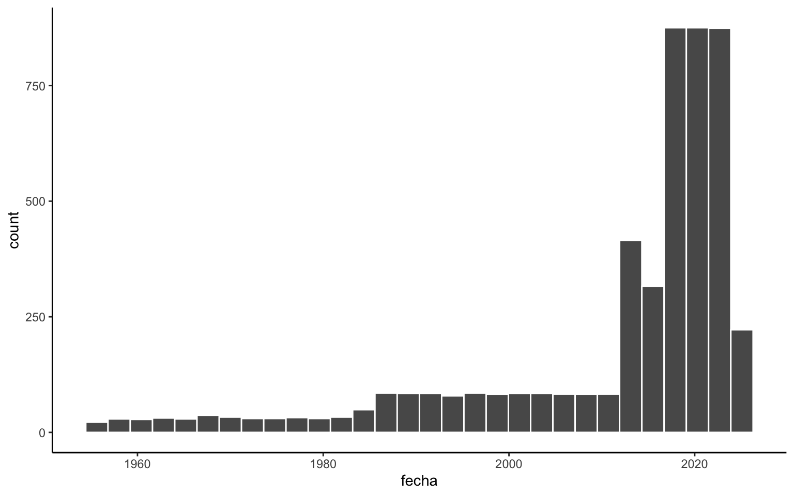

Dentro de la función `geom_histogram()` especificamos que el borde de las barras sea blanco, y al final del gráfico agregamos una función `theme_x()` para darle una apariencia distinta a la visualización.

### Gráfico de dispersión

Teniendo dos columnas numéricas, podemos crear un gráfico de dispersión que dibuje un puntos que relacionen las mediciones meteorológicas de cada día.

``` r
temp |> 
  filter(nombre == "Carriel Sur, Concepción Ap.",
         año > 1990) |> 
  ggplot() +
  aes(t_min, t_max, color = mes) +
  geom_point(alpha = 0.6) +
  # tema
  theme_classic()
```


Cada punto representa un día, y su ubicación corresponde a la temperatura máxima y mínima de cada día.

### Gráfico de cajas o boxplot

Puedes crear un gráfico de caja o *boxplot* del total de las observaciones:

``` r
temp |> 
  ggplot() +
  aes(y = t_max) +
  geom_boxplot(fill = "grey90") +
  theme_classic()
```


Solamente definiendo una variable para el eje vertical obtenemos un gráfico que nos presenta un resumen estadístico de las observaciones del conjunto de datos, con líneas que marcan la mediana (al medio de la caja) y los cuartiles del 25% y del 75% (los límites de la caja).

Filtremos los datos para tener información de sólo tres estaciones meteorológicas:

``` r
temp_filt <- temp |> 
  filter(nombre %in% c("Chacalluta, Arica Ap.",
                       "General Freire, Curicó Ad.",
                       "Carlos Ibañez, Punta Arenas Ap."))
```

Ahora podemos asignar la variable `nombre` al eje horizontal del gráfico para obtener tres cajas:

``` r
temp_filt |> 
  ggplot() +
  aes(nombre, t_max) +
  geom_boxplot(fill = "grey90") +
  # tema
  theme_classic()
```


También podemos volver a mapear la variable del eje horizontal a la estética del color para distinguir aún más las cajas; sin embargo, mapear una variable al color hace que aparezca una leyenda, que en este caso es redundante, por lo que agregamos una capa de leyenda (`guides()`) para omitirla.

``` r
temp_filt |> 
  ggplot() +
  aes(nombre, t_max, 
      color = nombre, fill = nombre) +
  geom_boxplot(alpha = 0.5) +
  guides(fill = guide_none(),
         color = guide_none()) +
  # tema
  theme_classic() +
  # paletas de colores
  scale_fill_brewer(palette = "Set2") +
  scale_color_brewer(palette = "Set2")
```


### Gráfico de dispersión por grupos

Si queremos producir un punto por cada observación a través de las tres estaciones metodologías que filtramos, obtenemos un gráfico como el siguiente:

``` r
temp_filt |> 
  ggplot() +
  aes(nombre, t_max) +
  geom_point(size = 10, alpha = 0.05) +
  theme_minimal()
```


Podemos ver que resulta un gráfico muy poco legible, dado que estamos dibujando 15 mil puntos unos encima de otros. Para solucionarlo, podemos reemplazar `geom_point()` por `geom_jitter()`, que es una geometría que agrega dispersión a los puntos para hacerlos mas visibles:

``` r
temp_filt |> 
  ggplot() +
  aes(nombre, t_max) +
  geom_jitter(size = 2, alpha = 0.05, height = 0) +
  theme_minimal()
```


Dentro de los argumentos de `geom_jitter()` podemos especificar la dirección en la que queremos agregar la dispersión aleatoria. Si especificamos `height = 0`, entonces la dispersión no será vertical, y los puntos solamente se moverán horizontalmente, para que la posición vertical de los puntos sea certera y solamente se desplacen hacia los lados para poder verlos individualmente sin que se tapen unos a otros.

### Gráfico de violín

Los gráficos de violin son básicamente gráficos de densidad, pero espejados o duplicados para producir una silueta similar a la de un violín.

``` r
temp_filt |> 
  ggplot() +
  aes(nombre, t_max) +
  geom_violin(alpha = 0.5, fill = "grey90") +
  theme_minimal()
```


Recordemos que siempre podemos agregar la cantidad de capas que deseemos a nuestros gráficos. Por ejemplo, agregar un boxplot sobre los violines:

``` r
temp_filt |> 
  ggplot() +
  aes(nombre, t_max) +
  geom_violin(alpha = 0.4, fill = "purple3", color = "purple3") +
  geom_boxplot(width = 0.2, outliers = FALSE, 
               alpha = 0.4, fill = "purple4", color = "purple4",) +
  theme_minimal()
```


combinar violín con puntos

``` r
temp_filt |> 
  ggplot() +
  aes(nombre, t_max) +
  geom_jitter(size = 1, alpha = 0.05, height = 0) +
  geom_violin(alpha = 0.4) +
  theme_minimal()
```


Los gráficos que creemos no tienen por qué reducirse a un solo conjunto de datos. Podemos calcular un nuevo conjunto de datos para complementar las visualizaciones que queremos realizar.

Calculemos una tabla que contenga los promedios y las medianas para cada uno de los tres grupos de nuestro conjunto de datos:

``` r
# calcular medianas
temp_median <- temp_filt |> 
  group_by(nombre) |> 
  summarise(t_max = median(t_max, na.rm = T))
```

Luego podemos hacer el gráfico, y en las capas que queremos utilizar conjuntos de datos distintos, usamos el argumento `data` para decirle a `{ggplot2}` que esas capas se basarán en datos distintos a los de la primera capa de datos (`temp_filt`):

``` r
temp_filt |> 
  ggplot() +
  aes(nombre, t_max) +
  geom_violin(alpha = 0.4, color = "grey80", fill = "grey80") +
  # cuadrados de mediana
  geom_point(data = temp_median, 
             size = 5, shape = "diamond", color = "purple", alpha = 0.6) +
  # tema
  theme_minimal()
```


Como las columnas de el segundo conjunto de datos (`temp_median`) se llaman igual a las del primero, `{ggplot2}` detecta las variables mapeadas en la capa de estética y las reutiliza en la segunda capa de geometría, por lo que no es necesario especificar en la capa de `geom_point()` las variables a utilizar. Pero si las variables de un segundo conjunto de datos se llamaran distinto, podríamos especificar dentro de la geometría una nueva estética con la función `aes()` para que se aplique a esa capa en particular.

### Gráfico de líneas

Para visualizar los datos como líneas primero procesaremos los datos para obtener promedios mensuales de temperatura:

``` r
library(lubridate) # para trabajar con fechas

temp_mensual <- temp |> 
    filter(nombre == "Quinta Normal, Santiago",
         año > 1980) |>
  # redondear fechas al mes
  mutate(fecha = lubridate::floor_date(fecha, "month")) |>  
  group_by(fecha) |> 
  summarise(t_min = mean(t_min, na.rm = T),
            t_max = mean(t_max, na.rm = T))
```

Ahora podemos usar una variable en formato fecha como eje horizontal. `{ggplot2}` detectará que la variable es una fecha y mostrará un eje adaptado de acuerdo a la escala de los datos; en este caso, mostrando sólo los años.

``` r
temp_mensual |> 
  ggplot() +
  aes(x = fecha, # usar fecha como eje horizontal
      y = t_max, 
      color = t_max) +
  geom_line(linewidth = 1) + # gráfico de líneas
  # especificar colores de la escala
  scale_color_gradient(low = "blue4", high = "red2") +
  # leyenda abajo
  guides(color = guide_colorbar(position = "bottom")) +
  # temas
  theme_classic() +
  theme(legend.key.width = unit(30, "pt"),
        legend.key.height = unit(4, "pt"))
```


### Gráfico de mosaico

Del mismo modo que realizamos un gráfico de dispersión, podemos realizar un gráfico de puntos ordenados si es que las variables numéricas que usaremos en los ejes de coordenadas son consistentes, por ejemplo, en el caso de observaciones medidas diaria o mensualente.

En el siguiente gráfico mapearemos los valores de las temperaturas por año horizontalmente, y con los meses verticalmente:

``` r
temp |> 
  filter(nombre == "General Freire, Curicó Ad.") |> 
  group_by(año, mes) |> 
  summarize(t_max = mean(t_max, na.rm = T)) |> 
  filter(año >= 1980) |> 
  ggplot() +
  aes(año, mes, color = t_max) +
  geom_point(size = 3, alpha = .7) +
  scale_y_continuous(breaks = 1:12) +
  theme_minimal()
```


Obtenemos una visualización que nos permite ver, al mismo tiempo, la evolución a través de los años de las temperaturas, teniendo la vista la variación mensual dentro de cada año. Podemos mejorar esta visualización utilizando la geometría `geom_tile()`, para generar mosaicos:

``` r
temp |> 
  filter(nombre == "General Freire, Curicó Ad.") |> 
  group_by(año, mes) |> 
  summarize(t_max = mean(t_max, na.rm = T)) |> 
  filter(año >= 1980) |> 
  ggplot() +
  aes(año, mes, fill = t_max) +
  geom_tile()+
  scale_y_continuous(breaks = 1:12) +
  theme_minimal()
```


En el clase anterior, cada observación es representada por uno de los mosaicos. Esta visualización podría mejorarse si es que cambiamos el sistema de coordenadas del gráfico para que la relación entre la variable vertical y la variable horizontal sea siempre cuadrada. Usamos la función `coord_fixed()` para fijar el sistema de coordenadas para cada intersección entre el eje *x* e *y* tengan un aspecto cuadrado:

``` r
temp |> 
  filter(nombre == "General Freire, Curicó Ad.") |> 
  group_by(año, mes) |> 
  summarize(t_max = mean(t_max, na.rm = T)) |> 
  filter(año >= 1980) |> 
  ggplot() +
  aes(año, mes, fill = t_max) +
  geom_tile() +
  coord_fixed(expand = FALSE) +
  viridis::scale_fill_viridis(option = "magma", name = NULL) +
  theme_minimal() +
  scale_y_continuous(breaks = 1:12) +
  scale_x_continuous(breaks = c(seq(1980, 2020, 10), 2024)) +
  labs(title = "Temperatura máxima mensual",
       subtitle = "Estación meteorológica General Freire, Curicó") +
  theme(legend.key.height = unit(8, "mm"),
        legend.key.width = unit(2, "mm")) +
  theme(panel.grid.major = element_blank())
```


Al especificar el argumento `expand = FALSE` en cualquier función `coord_x()`, hacemos que el gráfico elimine el espaciado interior entre los ejes y las geometrías, logrando así que se acerquen los mosaicos a los números de las escalas.

A esta visualización también le agregamos una paleta de colores continua más apropiada para mostrar las diferencias entre los valores; en este caso, la paleta `magma` del [conjunto de paletas de colores `{viridis}`](https://cran.r-project.org/web/packages/viridis/vignettes/intro-to-viridis.html#the-color-scales). Además usamos `scale_x_continuous()` para especificar los quiebres (`breaks`) de los valores de la escala horizontal, incluyendo así el año 2024, ya agregamos títulos, subtítulos, y especificaciones del tema del gráfico (`theme()`) para que la leyenda se vea mejor.

------------------------------------------------------------------------

Seguiremos con los ejemplos de visualizaciones usando un conjunto de datos distintos. Se trata de conteo de población indígena u originaria, desagradados por género, pueblo indígena, y ubicación geográfica. Puedes obtener los datos [desde este repositorio,](https://github.com/bastianolea/pueblos_indigenas_chile) o cargar los datos desde la siguiente función, que los descarga y lo agrega tu entorno de R directamente.

``` r
pueblos <- readr::read_csv2("https://github.com/bastianolea/pueblos_indigenas_chile/raw/master/datos/pueblos_indigenas_chile.csv")
```

``` r
glimpse(pueblos)
```

    Rows: 7,612
    Columns: 10
    $ sexo            <chr> "Hombres", "Hombres", "Hombres", "Hombres", "Hombres",…
    $ pueblo          <chr> "Mapuche", "Aymara", "Rapa Nui", "Lican Antai", "Quech…
    $ n               <dbl> 4094, 27075, 19, 353, 1156, 152, 915, 14, 5, 2202, 540…
    $ codigo_comuna   <dbl> 15101, 15101, 15101, 15101, 15101, 15101, 15101, 15101…
    $ nombre_comuna   <chr> "Arica", "Arica", "Arica", "Arica", "Arica", "Arica", …
    $ codigo_region   <dbl> 15, 15, 15, 15, 15, 15, 15, 15, 15, 15, 15, 15, 15, 15…
    $ nombre_region   <chr> "Arica y Parinacota", "Arica y Parinacota", "Arica y P…
    $ año             <dbl> 2017, 2017, 2017, 2017, 2017, 2017, 2017, 2017, 2017, …
    $ poblacion_total <dbl> 232628, 232628, 232628, 232628, 232628, 232628, 232628…
    $ orden_region    <dbl> 1, 1, 1, 1, 1, 1, 1, 1, 1, 1, 1, 1, 1, 1, 1, 1, 1, 1, …

### Gráfico de barras ordenado

Realicemos una suma de los conteos agrupada por pueblo originario:

``` r
pueblos_n <- pueblos |>
  mutate(pueblo = ifelse(pueblo %in% c("Mapuche", "Aymara", "Diaguita"), pueblo, "Otros")) |> 
  group_by(pueblo) |> 
  summarize(total = sum(n))

pueblos_n
```

    # A tibble: 4 × 2
      pueblo     total
      <chr>      <dbl>
    1 Aymara    156754
    2 Diaguita   88474
    3 Mapuche  1745147
    4 Otros     195417

Con esta información podemos generar un gráfico de barras:

``` r
pueblos_n |> 
  ggplot() +
  aes(pueblo, total, fill = pueblo) +
  geom_col() +
  theme_minimal() +
  # paleta de colores
  scale_fill_brewer(palette = "Dark2")
```

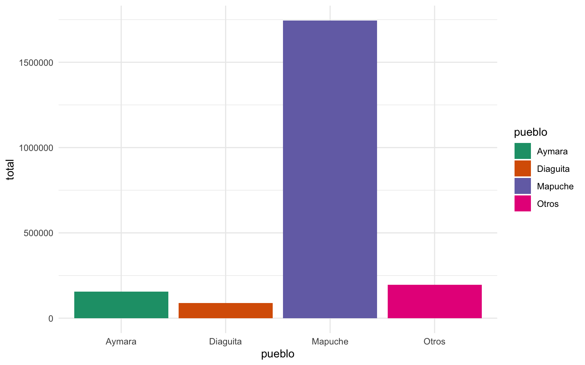

Si deseamos ordenar las barras de acuerdo a su valor, lo que tenemos que hacer es ordenar la variable del eje desde el que se originan las barras. En este caso, las barras salen desde el eje *x* de acuerdo al pueblo indígena. Entonces, la variable `pueblo` tendría que ser ordenada de acuerdo a la variable `total`. Para esto, necesitamos que la variable sea un factor, que son el tipo de variables categóricas en R que guardan información acerca de el orden de los niveles o categorías de la variable.

La función `fct_reorder()` del [paquete `{forcats}`](https://forcats.tidyverse.org) nos permite ordenar variables tipo caracter a partir de una segunda variable numérica:

``` r
grafico_pueblos_1 <- pueblos_n |> 
  mutate(pueblo = forcats::fct_reorder(pueblo, total)) |> 
  ggplot() +
  aes(pueblo, total, fill = pueblo) +
  geom_col() +
  theme_minimal() +
  # paleta de colores
  scale_fill_brewer(palette = "Dark2")+
  # escala vertical
  scale_y_continuous(labels = scales::label_comma(big.mark = "."))

grafico_pueblos_1
```


También agregamos una capa `scale_y_continuous()` para modificar la escala vertical del gráfico y así mostrar correctamente los números grandes con un separador de miles, para mejorar la legibilidad de las cifras. Para lograrlo, usamos la función `label_comma()` del [conveniente paquete `{scales}`.](https://scales.r-lib.org)

Para agregar texto a nuestros gráficos debemos introducir la capa de geometría `geom_text()`. Esta geometría requiere de un mapeo específico, `label`, que corresponde a la etiqueta de texto que se mostrará. En `label` debes poner la variable cuyo valor quieres que aparezca como texto:

``` r
grafico_pueblos_1 + 
  geom_text(aes(label = total))
```


En primera instancia, se ve terrible. Esto es porque los textos están apareciendo en la coordenada del eje vertical donde terminan las barras; es decir, justo encima del límite de las barras. Para mejorar esto, en la capa de `geom_text()` para especificar la justificación vertical del texto en `vjust`, para que el texto no aparezca centrado en la coordenada *y*, sino que la coordenada *y* sea la altura de base del texto, y el argumento `nudge_y` para sumarle un valor específico a la coordenada *y* del texto, cosa que aparezca levemente distanciado del borde de las barras:

``` r
grafico_pueblos_1 + 
  geom_text(aes(label = format(total, big.mark = ".")), 
            vjust = 0,
            nudge_y = 15000)
```


Cuando ponemos texto en un gráfico, usualmente tenemos que hacer algunos ajustes en consideración de que algunos elementos del gráfico van a ser muy grandes o muy pequeños, y por lo tanto el texto no siempre se va a ver bien. Para solucionar estos problemas podemos usar múltiples capas de texto en lugar de una sola, donde cada capa de texto dibuje los textos para algunos datos, con los ajustes necesarios para dichos casos.

En el ejemplo que estamos haciendo, vamos a graficar el texto en dos capas de `geom_text()`: una capa para las cifras que son mayores al promedio (barras grandes), y otra capa para las que son menores al promedio (barras pequeñas). De esta forma, podemos hacer que los números sobre las Barras grandes aparezcan dentro de la barra y en color blanco, y los números de las barras pequeñas aparezcan encima de las barras y en color negro:

``` r
grafico_pueblos_1 + 
  # texto para barras chicas
  geom_text(data = ~filter(.x, total < mean(total)),
            aes(label = format(total, big.mark = ".")), 
            vjust = 0, nudge_y = 20000) +
  # texto para barras grandes
  geom_text(data = ~filter(.x, total >= mean(total)),
            aes(label = format(total, big.mark = ".")), 
            vjust = 1, nudge_y = -20000, color = "white")
```


Hicimos que cada capa dibuje textos distintos filtrando los datos que llegan a cada una de las capas en el argumento `data` de cada geometría. En los argumentos `data` usamos notación lambda para filtrar los datos del gráfico (`~filter(.x)`) sin tener que especificar el conjunto de datos específico. Pero si esto te parece complicado, también se puede lograr el mismo efecto sin `data` usando `ifelse(total > mean(total), total, "")` en `label` para que cada capa escriba el texto que cumple con la condición, E imprima nada si es que no la cumple.

### Anotaciones

Muchas veces queremos agregar un texto o anotación específico en alguna ubicación de nuestro gráfico. Para estos fines existe una capa ed geometría personalizada llamada `annotate()`, que a diferencia del resto de la geometría de `{ggplot2}`, no depende de la especificación estética (`aes()`), sino que sus parámetros son completamente manuales. Entonces, podemos usar `annotate()` para crear un evento puntual en nuestra visualización, y sea escribiendo el texto y sus coordenadas a mano, o sacándolas de un objeto. En este caso, filtraremos la tabla de datos que produce el gráfico para enfocarnos en una sola observación, y usaremos las coordenadas de esta tabla resultante para crear una anotación que añada un texto en un lugar específico del gráfico:

``` r
# filtrar datos del gráfico
cifra_pueblos <- pueblos_n |> filter(pueblo == "Aymara")

grafico_pueblos_1 +
  # agregar una geometría manual
  annotate("text", 
           x = cifra_pueblos$pueblo,
           y = cifra_pueblos$total + 10000, # agregar separación entre la barra y el texto
           label = "***", size = 6, fontface = "bold")
```


Un segundo ejemplo:

``` r
pueblos_n |> 
  mutate(pueblo = forcats::fct_reorder(pueblo, total)) |> 
  ggplot() +
  aes(pueblo, total, fill = pueblo) +
  geom_col() +
  theme_minimal() +
  scale_fill_brewer(palette = "Dark2") +
  scale_y_continuous(labels = scales::label_comma(big.mark = ".")) +
  # geometría manual
  annotate("text", 
           x = "Mapuche",
           y = 1000000, 
           label = "Mayoría mapuche", 
           size = 5, angle = 90, color = "white")
```


### Gráfico de barras apiladas

``` r
grafico_pueblos_2 <- pueblos_n |> 
  mutate(pueblo = forcats::fct_reorder(pueblo, total)) |> 
  ggplot() +
  aes(total, factor(1), fill = pueblo) +
  geom_col() +
  theme_minimal() +
  scale_fill_brewer(palette = "Dark2") +
  scale_x_continuous(labels = scales::label_comma(big.mark = ".")) +
  coord_cartesian(expand = FALSE) +
  guides(fill = guide_legend(position = "top"))

grafico_pueblos_2
```


``` r
grafico_pueblos_2 +
  geom_text(aes(label = format(total, big.mark = ".")), color = "white",
          position = position_stack(0.5), angle = -90) +
  theme(axis.title.y = element_blank(),
        axis.text.y = element_blank())
```


### Gráfico de torta

Muchas personas dedicadas a las estadísticas o a la ciencia de datos han planteado buenos críticas en contra de los gráficos de torta. Para fines de este tutorial, ignoraremos un poco estas críticas, debido a que, a pesar de ser inapropiados para muchas situaciones, siguen siendo gráficos atractivos y muy solicitados en la práctica. Por lo tanto, aprenderemos de todas formas a realizarlos en `{ggplot2}`.

En `{ggplot2}`, un gráfico de torta no es un tipo de visualización completamente distinto a las que ya hemos visto, ya que, técnicamente, un gráfico de torta no es más que la una visualización radial o circular de lo mismo que expresa un gráfico de barras. En otras palabras, un gráfico de torta es un gráfico de barras apilado, y luego enrollado desde una de sus esquinas.

Todo gráfico de tortas empieza siendo un gráfico de barras apilado:

``` r
pueblos_n |> 
  ggplot() +
  aes(1, total, fill = pueblo) +
  geom_col() +
  scale_fill_brewer(palette = "Dark2") +
  theme_minimal()
```


A especificar que el eje horizontal del gráfico sea tan sólo el valor `1`, mientras que las observaciones están agrupadas por una variable asignada a la estética `color`, estamos haciendo que todos los datos del gráfico aparezcan uno encima del otro, sin separarse horizontalmente como los ejemplos anteriores.

Una vez que tenemos este gráfico de barras apilado, podemos agregar una capa `coord_polar()` para cambiar el sistema de coordenadas del gráfico, con el objetivo de que la escala vertical del gráfico deje de ser una línea vertical y se transforme en un círculo:

``` r
pueblos_n |> 
  ggplot() +
  aes(1, total, fill = pueblo) +
  geom_col() +
  scale_fill_brewer(palette = "Dark2") +
  theme_void() +
  # coordenadas circulares
  coord_polar(theta = "y") # enrollar el gráfico para volverlo circular
```


Si comparas este gráfico de torta con el gráfico anterior, notarás que el gráfico de torta es exactamente el gráfico de barras, pero en enrollado a partir de su esquina inferior derecha.

Para agregar etiquetas de texto a nuestro gráfico de torta, el proceso es el mismo que para agregar a un gráfico de barras apiladas; es decir, necesitamos agregar una capa `geom_text()` que especifique que los textos también deben apilarse con `position = position_stack()`:

``` r
pueblos_n |> 
  ggplot() +
  aes(1, total, fill = pueblo) +
  geom_col() +
  scale_fill_brewer(palette = "Dark2") +
  theme_void() +
  coord_polar(theta = "y") +
  # texto
  geom_text(aes(label = format(total, big.mark = "."), x = 1.3), color = "white",
          position = position_stack(0.5))
```


### Gráfico de donas

un gráfico de dona es un gráfico de torta con espacio al medio

``` r
pueblos_n |> 
  ggplot() +
  aes(1, total, fill = pueblo) +
  geom_col() +
  scale_fill_brewer(palette = "Dark2")
```


para crear el espacio dentro de la torta, necesitamos agregar espacio en el eje horizontal

``` r
pueblos_n |> 
  ggplot() +
  aes(1, total, fill = pueblo) +
  geom_col() +
  scale_fill_brewer(palette = "Dark2") +
  # agregar espacio en el eje
  scale_x_continuous(expand = expansion(c(2, 0)))
```


``` r
pueblos_n |> 
  ggplot() +
  aes(1, total, fill = pueblo) +
  geom_col() +
  scale_fill_brewer(palette = "Dark2") +
  # agregar espacio en el eje
  scale_x_continuous(expand = expansion(c(2, 0))) +
  # hacer en torta
  coord_polar(theta = "y") +
  theme_void()
```

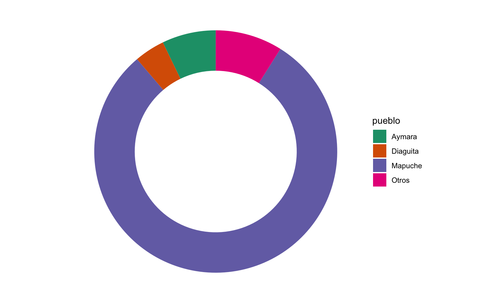

### Facetas

calculemos los datos agrupados otra variable

``` r
pueblos_n_sexo <- pueblos |> 
  mutate(pueblo = ifelse(pueblo %in% c("Mapuche", "Aymara", "Diaguita"), pueblo, "Otros")) |> 
  group_by(pueblo, sexo) |> 
  summarize(total = sum(n)) |> 
  group_by(sexo) |> 
  mutate(p = total/sum(total))
```

teniendo una variable extra en la base, podemos dividir el gráfico en más de uno

``` r
pueblos_n_sexo |> 
  ggplot() +
  aes(1, p, fill = pueblo) +
  geom_col() +
  coord_polar(theta = "y") +
  scale_fill_brewer(palette = "Dark2") +
  theme_void() +
  # dividir por sexo
  facet_wrap(~sexo)
```


faceta por otra variable

``` r
library(scales)

pueblos |> 
  group_by(pueblo, sexo) |> 
  summarize(total = sum(n)) |> 
  group_by(pueblo) |> 
  mutate(p = total/sum(total)) |> 
  ggplot() +
  aes(1, p, fill = sexo) +
  geom_col() +
  # agregar texto
  geom_text(aes(label = percent(p, accuracy = 1)), color = "white",
            position = position_stack(0.5), fontface = "bold") +
  coord_polar(theta = "y") +
  scale_fill_brewer(palette = "Dark2") +
  facet_wrap(~pueblo) +
  theme_void()
```


### Datos de delincuencia

``` r
# install.packages("arrow")
library(arrow)
library(lubridate)
```

cargar datos (en formato arrow)

``` r
delinc <- arrow::read_parquet("datos/cead_delincuencia_chile.parquet")
```

revisar tipos de delitos

``` r
delinc |> 
  distinct(delito) |> 
  print(n=Inf)
```

    # A tibble: 50 × 1
       delito                                       
       <fct>                                        
     1 Abigeato                                     
     2 Abusos sexuales                              
     3 Amenazas con armas                           
     4 Amenazas o riña                              
     5 Animales sueltos en la vía pública           
     6 Auxilio al suicidio                          
     7 Comercio ilegal                              
     8 Consumo de alcohol y drogas en la vía pública
     9 Daños                                        
    10 Delitos asociados a drogas                   
    11 Desórdenes públicos                          
    12 Disparo injustificado                        
    13 Elaboración o producción de sustancias       
    14 Femicidio                                    
    15 Femicidio no íntimo                          
    16 Homicidios                                   
    17 Hurtos                                       
    18 Lesiones graves o gravísimas                 
    19 Lesiones leves                               
    20 Lesiones menos graves                        
    21 Microtráfico de sustancias                   
    22 Ofensas al pudor                             
    23 Otras infracciones a la ley de armas         
    24 Otras infracciones a la ley de drogas        
    25 Otras violaciones                            
    26 Otros delitos sexuales                       
    27 Otros robos con fuerza en las cosas          
    28 Porte / posesión de armas o explosivos       
    29 Porte de arma cortante o punzante            
    30 Receptación                                  
    31 Robo con homicidio                           
    32 Robo con violación                           
    33 Robo de objetos de o desde vehículo          
    34 Robo de vehículo motorizado                  
    35 Robo en lugar habitado                       
    36 Robo frustrado                               
    37 Robo por sorpresa                            
    38 Robo violento de vehículo motorizado         
    39 Robos con violencia o intimidación           
    40 Robos en lugar no habitado                   
    41 Suicidio femicida                            
    42 Tortura o apremios ilegítimos con violación  
    43 Tráfico de sustancias                        
    44 Violación con homicidio                      
    45 Violencia intrafamiliar a adulto mayor       
    46 Violencia intrafamiliar a hombre             
    47 Violencia intrafamiliar a mujer              
    48 Violencia intrafamiliar a niño o niña        
    49 Violencia intrafamiliar no clasificada       
    50 Robos de vehículos y sus accesorios          

gráfico de líneas de un delito específico

``` r
delinc |> 
  # procesar datos
  filter(delito == "Robos con violencia o intimidación") |> 
  group_by(fecha) |> 
  summarize(n = sum(delito_n)) |> 
  # gráfico
  ggplot() +
  aes(fecha, n) +
  # podemos agregar más de una capa de geometría
  geom_line() +
  geom_point()
```


geom_col()

gráfico de barras vertical

``` r
delinc |> 
  filter(delito == "Robos con violencia o intimidación") |> 
  group_by(region) |> 
  summarize(n = sum(delito_n)) |> 
  ggplot() +
  aes(region, n) +
  geom_col() +
  # modificamos el tema del gráfico para que el texto del eje horizontal sea inclinado y justificado a la derecha
  theme(axis.text.x = element_text(angle = 45, hjust = 1))
```

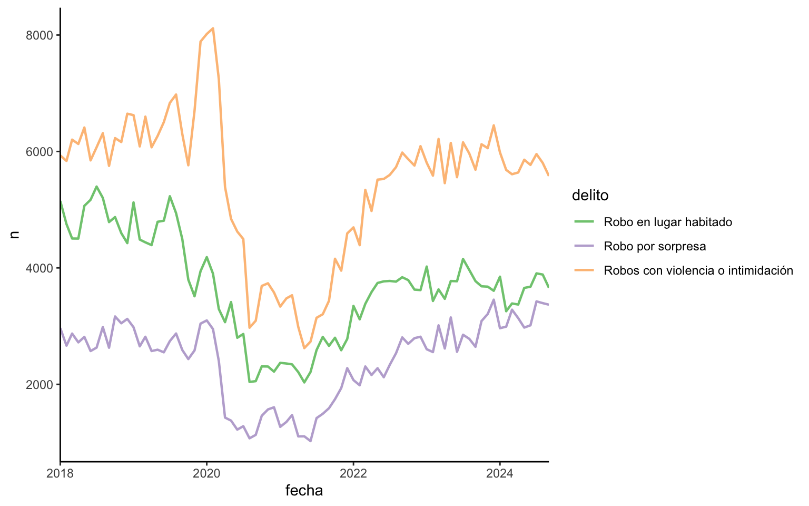

### Gráfico de barras horizontal

``` r
delinc |> 
  filter(delito == "Robos con violencia o intimidación") |> 
  group_by(region) |> 
  summarize(n = sum(delito_n)) |> 
  ggplot() +
  aes(n, region) +
  geom_col()
```


``` r
library(scales) # para mejorar las escalas
library(forcats) # para ordenar variables (tipo factor)
```

gráfico de barras horizontal, ordenadas, y con saltos de línea en las etiquetas

``` r
delinc |> 
  filter(delito == "Robos con violencia o intimidación") |> 
  group_by(region) |> 
  summarize(n = sum(delito_n), .groups = "drop") |> 
  ungroup() |> 
  # reordenar las barras 
  mutate(region = fct_reorder(region, n)) |>
  ggplot() +
  aes(n, region) +
  geom_col(width = 0.5) + # ancho de las barras
  # modificar escala horizontal
  scale_x_continuous(name = "Delitos",
                     labels = scales::label_comma(big.mark = "."), # arreglar los miles
                     expand = expansion(c(0, 0.1)) # agregar espacio extra al final de la escala
                     ) +
  scale_y_discrete(name = "Regiones",
                   labels = label_wrap(30) # aplicar salto de línea a las etiquetas a los 30 caracteres
                   )
```


### Gráfico de barras horizontal con color

contar delitos por año, para elegir delitos similares

``` r
delinc |> 
  group_by(delito) |> 
  summarize(n = sum(delito_n)) |> 
  arrange(desc(n))
```

    # A tibble: 50 × 2
       delito                                              n
       <fct>                                           <dbl>
     1 Amenazas o riña                               944138 
     2 Consumo de alcohol y drogas en la vía pública 917037.
     3 Hurtos                                        856092.
     4 Daños                                         764460 
     5 Violencia intrafamiliar a mujer               666574 
     6 Robos con violencia o intimidación            441673 
     7 Lesiones leves                                376066 
     8 Robo de objetos de o desde vehículo           329299 
     9 Robo en lugar habitado                        297576 
    10 Robos en lugar no habitado                    289593 
    # ℹ 40 more rows

gráfico de barras horizontal con leyenda en dos columnas

``` r
delinc |> 
  # seleccionar delitos a incluir
  filter(delito %in% c("Robos con violencia o intimidación",
                       "Violencia intrafamiliar a mujer",
                       "Robo de objetos de o desde vehículo")) |> 
  group_by(region, delito) |> 
  summarize(n = sum(delito_n)) |> 
  ungroup() |> 
  # reordenar las barras
  mutate(region = fct_reorder(region, n)) |>
  # grafico
  ggplot() +
  aes(n, region, 
      fill = delito) + # especificar color
  geom_col(width = 0.5) +
  # escalas
  scale_x_continuous(name = "Delitos",
                     labels = scales::label_comma(big.mark = "."), 
                     expand = expansion(c(0, 0.1))) +
  scale_y_discrete(name = "Regiones",
                   labels = label_wrap(30)) + 
  # modificar leyenda
  guides(fill = guide_legend(position = "bottom", # leyenda abajo
                             ncol = 2)) # en dos columnas
```

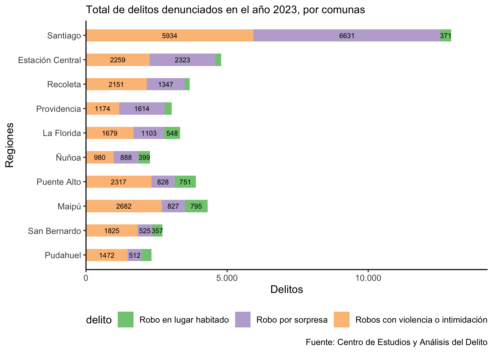

``` r
library(stringr) # para trabajar con texto
```

gráfico de barras horizontal con leyenda en una fila

``` r
delinc |> 
  filter(delito %in% c("Robos con violencia o intimidación",
                       "Violencia intrafamiliar a mujer",
                       "Robo de objetos de o desde vehículo")) |> 
  group_by(region, delito) |> 
  summarize(n = sum(delito_n)) |> 
  ungroup() |> 
  # reordenar las barras
  mutate(region = fct_reorder(region, n)) |>
  mutate(delito = stringr::str_wrap(delito, 25)) |> # arreglar textos de leyenda muy largos
  # grafico
  ggplot() +
  aes(n, region, fill = delito) +
  geom_col(width = 0.5) +
  scale_x_continuous(name = "Delitos",
                     labels = scales::label_comma(big.mark = "."),
                     expand = expansion(c(0, 0.1))) +
  scale_y_discrete(name = "Regiones",
                   labels = label_wrap(30)) +
  # modificar leyenda
  guides(fill = guide_legend(position = "bottom", nrow = 1)) # en una columna
```


### Gráfico de barras comparando categorías

``` r
library(lubridate)
```

procesar datos primero

``` r
delinc_tabla <- delinc |> 
  filter(lubridate::year(fecha) == 2023) |> 
  filter(delito %in% c("Robos con violencia o intimidación",
                       "Violencia intrafamiliar a mujer",
                       "Robo de objetos de o desde vehículo")) |> 
  group_by(region, delito) |> 
  summarize(n = sum(delito_n)) |> 
  ungroup() |> 
  # reordenar las barras
  mutate(region = fct_reorder(region, n)) |>
  mutate(delito = str_wrap(delito, 25))
```

hacer gráfico pero guardándolo como objeto

``` r
grafico <- delinc_tabla |> 
  ggplot() +
  aes(n, region, 
      fill = delito) + # relleno
  geom_col(width = 0.9, 
           position = position_dodge(), # especificar que las categorías aparezcan lado a lado
           color = "white", linewidth = 0.5) +
  scale_x_continuous(name = "Delitos",
                     labels = scales::label_comma(big.mark = "."), 
                     expand = expansion(c(0, 0.1))) +
  scale_y_discrete(name = "Regiones",
                   labels = label_wrap(30)) +
  # modificar leyenda
  guides(fill = guide_legend(position = "bottom", nrow = 1)) +
  # título
  labs(title = "Delitos",
       subtitle = "Cantidad de delitos en el año 2023")
```

ver el gráfico

``` r
grafico
```

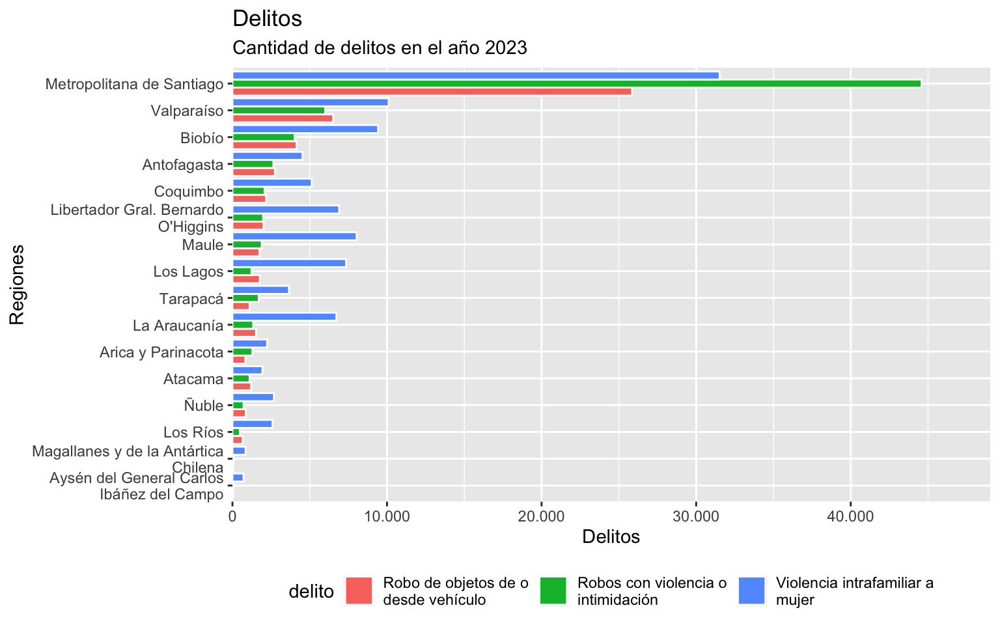

### Temas

aplicar un tema al gráfico ya creado

``` r
grafico +
  theme_minimal()
```


``` r
grafico +
  theme_classic()
```

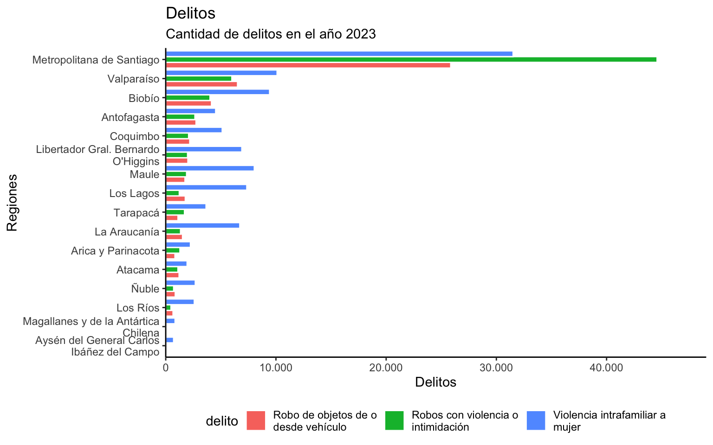

modificar elementos del tema del gráfico

``` r
grafico_2 <- grafico +
  theme_classic() +
  theme(axis.ticks = element_blank(),
        axis.text.y = element_text(colour = "black", 
                                   face = "bold", 
                                   size = 11, lineheight = 0.8)) +
  theme(axis.title.x = element_text(margin = margin(t = 10, b = -10)))

grafico_2
```

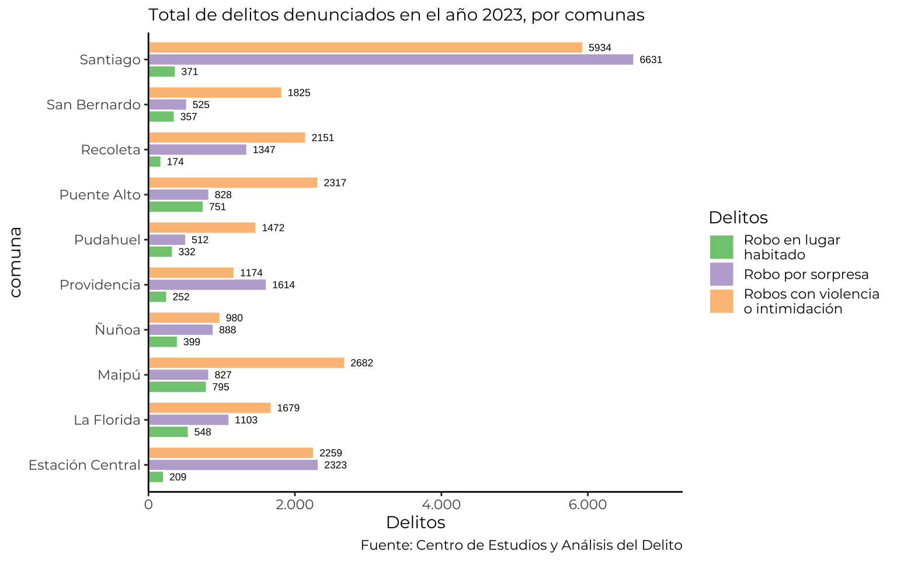

agregar una línea horizontal

``` r
grafico_2 +
  geom_vline(xintercept = 30000, linetype = "dashed", alpha = .7)
```

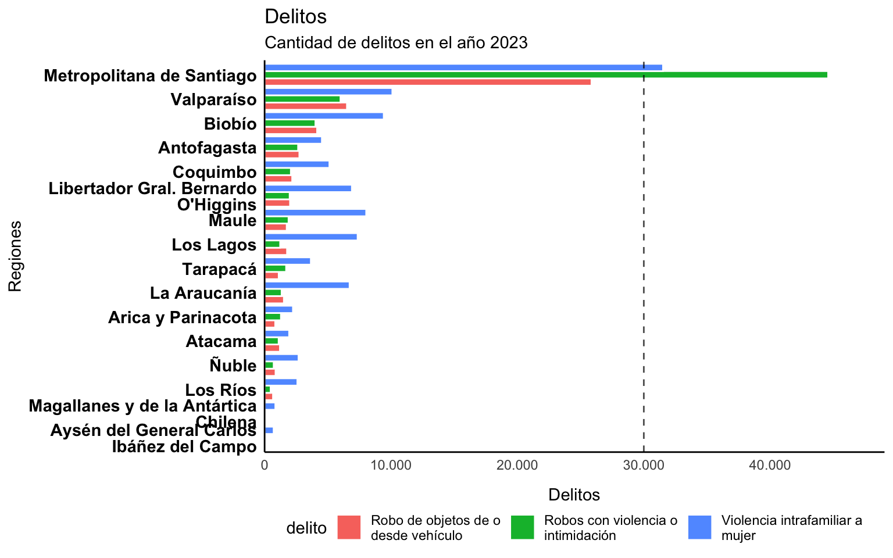

calcular promedio

``` r
promedio <- mean(delinc_tabla$n)
```

línea horizontal del promedio

``` r
grafico_2 +
  geom_vline(xintercept = promedio, linetype = "solid", color = "red3", linewidth = 1, alpha = .7)
```

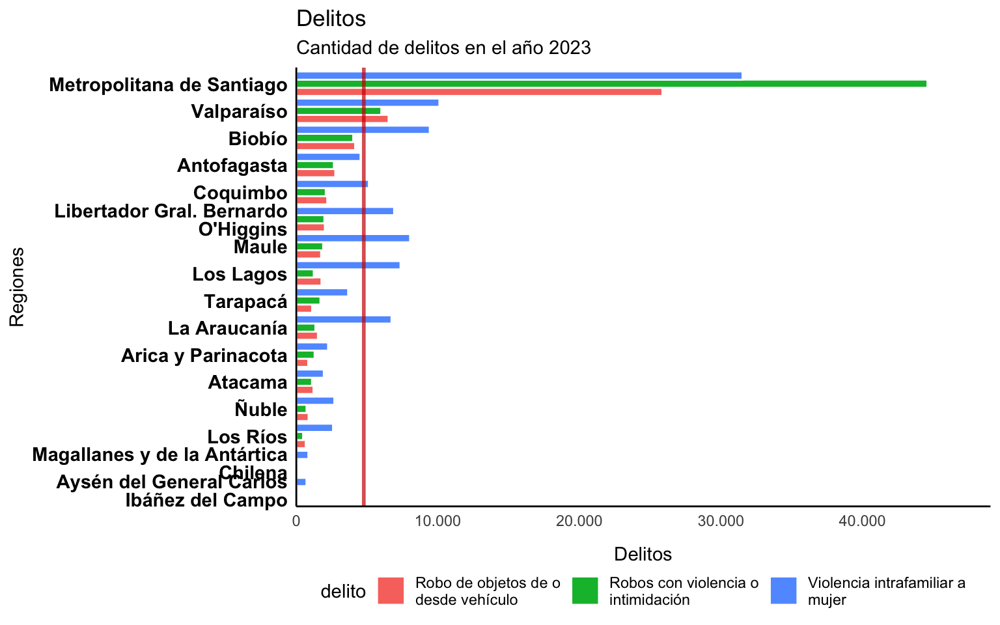

### Gráfico de barras apiladas

calcular datos

``` r
delinc_tabla_2 <- delinc |> 
  filter(year(fecha) == 2023) |> 
  filter(delito %in% c("Robos con violencia o intimidación",
                       "Violencia intrafamiliar a mujer",
                       "Robo de objetos de o desde vehículo")) |> 
  group_by(region, delito) |> 
  summarize(n = sum(delito_n)) |> 
  ungroup() |> 
  # reordenar las barras
  mutate(region = fct_reorder(region, n)) |>
  mutate(delito = str_wrap(delito, 25))
```

gráfico

``` r
grafico_apilado <- delinc_tabla_2 |> 
  ggplot() +
  aes(n, region, fill = delito) +
  geom_col(width = 0.5) +
  # escalas
  scale_x_continuous(name = "Delitos",
                     labels = scales::label_comma(big.mark = "."), # arreglar los miles
                     expand = expansion(c(0, 0.1))) +
  scale_y_discrete(name = "Regiones",
                   labels = label_wrap(30)) +
  # modificar leyenda
  guides(fill = guide_legend(position = "bottom", nrow = 1))

grafico_apilado
```

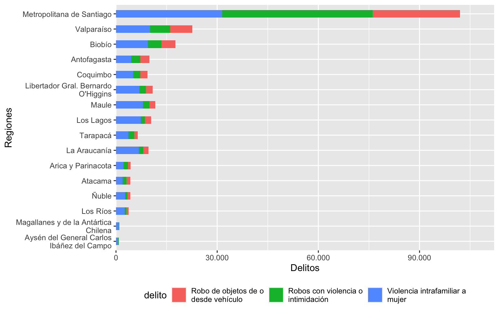

agregar tema

``` r
grafico_apilado +
  theme_classic()
```


agregar texto

``` r
grafico_apilado +
  theme_classic() +
  geom_text(
    aes(label = n),
    position = position_stack(0.5), # especificar que aparezca al medio de las barras
    size = 3)
```


corregir texto para que solo aparezca para cantidades mayores a x usando ifelse()

``` r
grafico_apilado +
  theme_classic() +
  geom_text(
    aes(label = ifelse(n > 8000, comma(n, big.mark = "."), "")),
    position = position_stack(0.5),
    size = 3)
```


otra forma de lograr lo mismo, filtrando los datos que llegan a geom_text()

``` r
grafico_apilado +
  theme_classic() +
  geom_text(data = ~filter(.x, n > 5000), # especificar los datos de geom_text()
    aes(label = n),
    position = position_stack(0.5),
    size = 3)
```

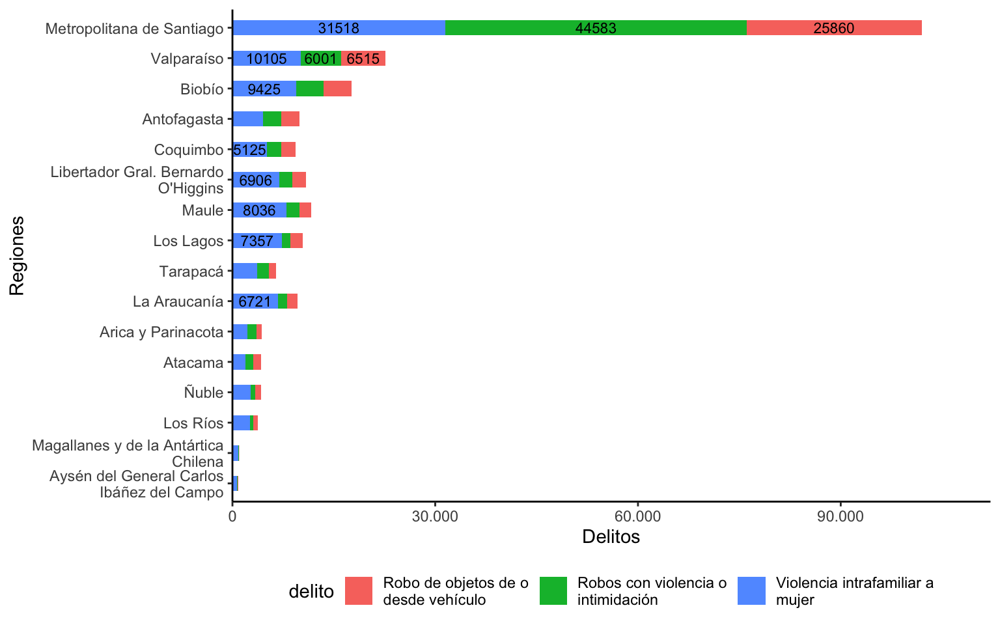

calcular totales regionales

``` r
delinc_tabla_totales <- delinc_tabla_2 |> 
  group_by(region) |> 
  summarise(n = sum(n))

delinc_tabla_totales
```

    # A tibble: 16 × 2
       region                                         n
       <fct>                                      <dbl>
     1 Aysén del General Carlos Ibáñez del Campo    826
     2 Magallanes y de la Antártica Chilena         963
     3 Los Ríos                                    3730
     4 Ñuble                                       4264
     5 Atacama                                     4260
     6 Arica y Parinacota                          4370
     7 La Araucanía                                9589
     8 Tarapacá                                    6473
     9 Los Lagos                                  10362
    10 Maule                                      11676
    11 Libertador Gral. Bernardo O'Higgins        10898
    12 Coquimbo                                    9383
    13 Antofagasta                                 9930
    14 Biobío                                     17595
    15 Valparaíso                                 22621
    16 Metropolitana de Santiago                 101961

agregar texto de totales regionales

``` r
grafico_apilado_3 <- grafico_apilado +
  theme_classic() +
  geom_text(data = ~filter(.x, n > 5000),
            aes(label = comma(n, big.mark = ".")),
            position = position_stack(0.5),
            size = 3) +
  geom_text(data = delinc_tabla_totales,
            inherit.aes = F, # que esta capa no herede las estéticas globales (aes) del gráfico
            # especificar la estética de esta capa
            aes(x = n, y = region, label = comma(n, big.mark = ".")), 
            hjust = 0, size = 3, nudge_x = 800, 
            fontface = "bold")
```

ver

``` r
grafico_apilado_3
```

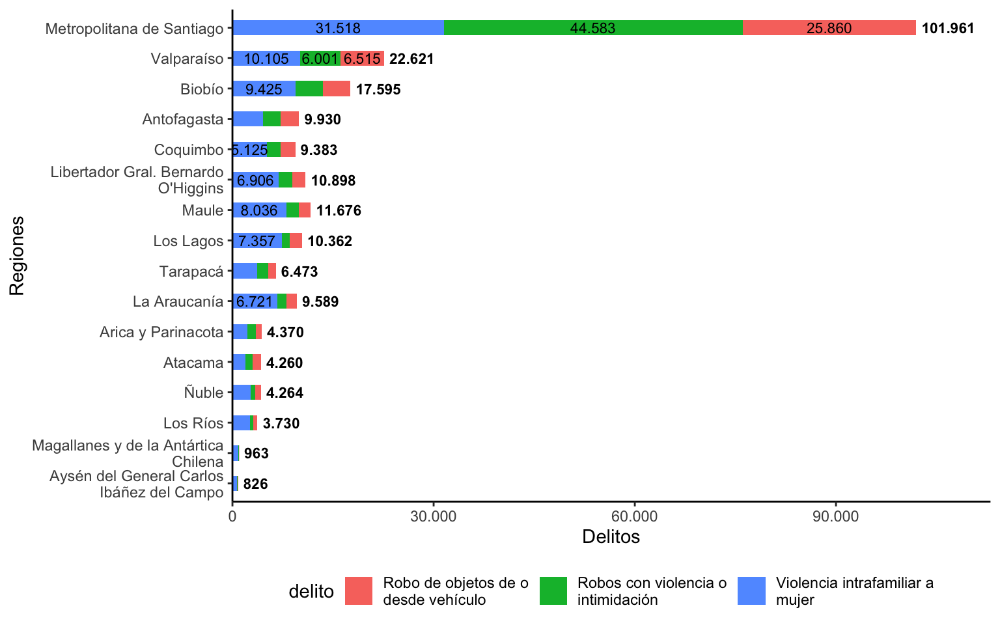

modificar escala de colores

``` r
grafico_apilado_4 <- grafico_apilado_3 +
  scale_fill_manual(values = c("#D74967", "#B384C0", "#F47066")) +
  theme(panel.grid.major.x = element_line(),
        panel.grid.minor.x = element_line(linewidth = 0.2))
```

ver

``` r
grafico_apilado_4
```

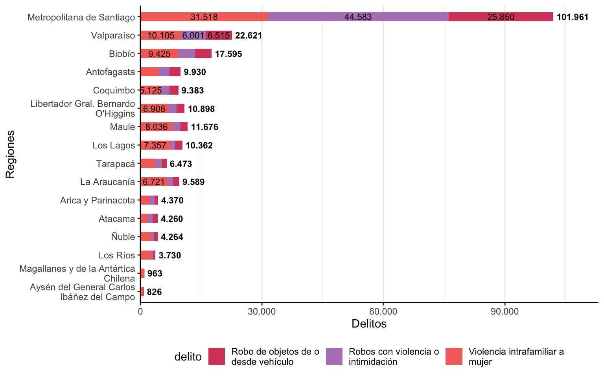

## Tipografías

``` r
# library(showtext)
```

descargar una tipografía desde google fonts

``` r
# font_add_google(name = "Montserrat")
```

font_add_google(name = "Nunito")

activar el uso de tipografías

``` r
# showtext_auto()
# showtext_opts(dpi = 300) # resolución para que se vean bien las tipografías
```

cambiar tipografía global

``` r
grafico_apilado_4 +
  theme_classic(base_family = "Montserrat")
```

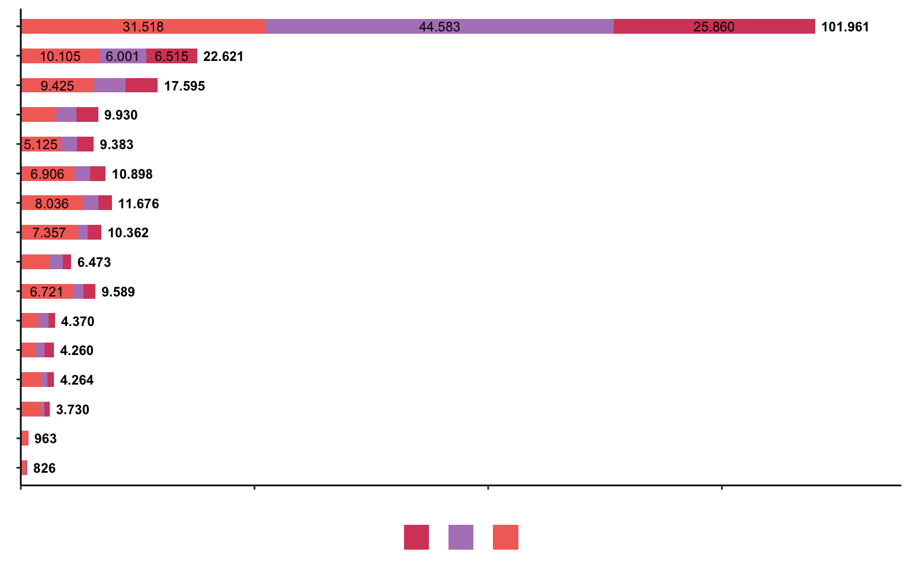

## Guardar gráficos

``` r
ggsave("grafico.jpg", width = 10, height = 6, dpi = 300) 
```

[^1]: con *mapeo* nos referimos al acto de definir una correspondencia entre el comportamiento de una variable y el resultado de algún elemento de nuestro gráfico, el cual pasará a asumir características de la variable que se le mapea.
