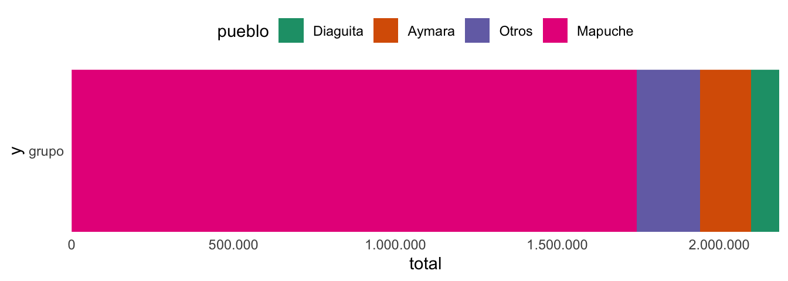
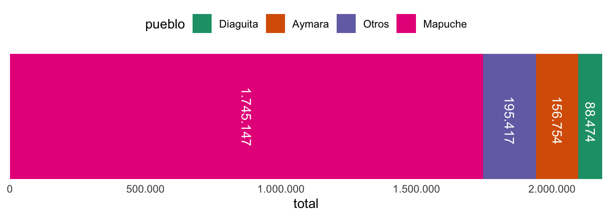



`{ggplot2}` es una librería de visualización de datos bastante popular en el mundo de la ciencia de datos. Sus principales características son su atractivo, su conveniencia para la exploración de datos, un gran potencial de personalización, y un extenso ecosistema de extensiones que nos permiten generar visualizaciones prácticamente de cualquier tipo.

Otro beneficio de usarlo es propio de el uso de cualquier herramienta programática para generar resultados en el ámbito del análisis de datos: la reusabilidad del código, que nos permite especificar una sola vez el resultado que queremos y luego volver a aplicarlo infinitas veces con distintos datos, datos actualizados, o variaciones de un conjunto de datos, etc.

------------------------------------------------------------------------

*Este tutorial está diseñado para empezar desde lo más básico, e ir avanzando de a poco por distintos tipos de visualizaciones para familiarizarse con el modo de uso de este paquete. A medida que tutorial avanza, se van introduciendo nuevos elementos es la medida que son relevantes y apropiados de introducir. También se van introduciendo distintos conjuntos de datos, y usando paquetes auxiliares que son introducidos secuencialmente. Por estas razones, se recomienda seguir el tutorial en orden.*

⚠️ Si aún no te manejas bien programando en R, te recomiendo revisar primero [este tutorial sobre trabajar con datos usando `{dplyr}`](../../../../blog/r_introduccion/dplyr_intro/), o bien, [este tutorial](../../../../blog/r_introduccion/r_basico/) y su [segunda parte](../../../../blog/r_introduccion/r_intermedio/) para aprender R desde cero.

------------------------------------------------------------------------

## Introducción


La librería `{ggplot2}` crea gráficos por medio de un sistema de capas. Mediante la suma de capas vamos a poder crear expresiones gráficas de nuestros datos, agregando tantas capas como sean necesarias para comunicar los resultados, así como también para afinar la visualización final.

Para entender cómo funciona `{ggplot2}`, veamos primero los principales tipos de **capas** que vamos a poder ir agregando a nuestro gráfico. Cada capa va a tener un rol específico, y es importante saber cómo se llaman para poder aplicarlas cuando queramos modificar uno u otro aspecto de nuestra visualización.

-   **datos:** usualmente la primera capa, que entrega los datos a `{ggplot2}` para poder usar variables como elementos de la visualización
-   **estéticas:** (`aes()`) capa donde se realiza el *mapeo[^1]* de variables a objetos geométricos, leyendas, ejes y escalas
-   \*geometrías:\*\* (`geom_x()`)
-   **escalas:** (`scale_x_y()`) definición de las dimensiones que adquirirán las estéticas, tales como rangos de valores, paletas de colores, límites de los ejes, etc.
-   **coordenadas:** (`coord_x()`): configuración del plano de coordenadas donde se grafican los datos; por ejemplo, definir los límites del gráfico, la proyección de los datos si es que se trata de un mapa, etc.
-   **facetas:** (`facet_x()`) distribución de los datos en matrices de gráficos; son una forma de especificar que queremos dividir la visualización en tantos gráficos como valores tenga una variable
-   **temas:** (`theme()`) configura detalles visuales de todos los elementos del gráfico, tales como fondo, grilla, ejes, tipografía, tamaños, espaciados, bordes y más.

Una vez que entendamos estas piezas básicas de la creación de gráficos con `{ggplot2}`, pasemos a generar nuestras primeras visualizaciones.

``` r
# install.packages("ggplot2")
library(ggplot2)
```

Vamos a crear un **gráfico vacío** a partir de una primera capa de datos. Para iniciar la creación de un gráfico, usamos la función `ggplot()`, a la cual le pasamos el conjunto de datos que queremos usar.

``` r
iris |> ggplot()
```

``` r
ggplot(data = iris) # equivalente a lo anterior
```


Al llamar la función `ggplot()` se genera un gráfico completamente vacío, ya que aún no hemos definido las estéticas ni las geometrías de nuestro gráfico.

A nuestra primera capa de datos le agregaremos una capa de estética, en la cual mapearemos variables a aspectos de la visualización. Los aspectos más básicos de una visualización de datos, y usualmente los que son obligatorios de definir, son las variables mapeadas a los ejes horizontales (`x`) y verticales (`y`) del gráfico.

``` r
iris |> 
  ggplot() + # iniciar el gráfico
  # definir el mapeo de variables a características estéticas del gráfico
  aes(x = Sepal.Length, # eje x (horizontal)
      y = Sepal.Width) # eje y (vertical)
```


Con el código anterior hicimos que el eje horizontal se corresponda con la variable `Sepal.Length` y el eje vertical con `Sepal.Width`. Podemos ver que ambos ejes adoptaron los nombres, rangos y valores de estas variables.

Sin embargo, aún no hay ninguna expresión gráfica directa de los datos en nuestro gráfico, debido a que aún no especificamos una capa de geometría.

## Dispersión

Como elegimos columnas numéricas de los datos `iris` para el gráfico, lo que representaremos son la ubicación de las observaciones con respecto a ambas variables. Cuando tenemos dos variables numéricas en los ejes, podemos crear un gráfico de dispersión.

Agreguemos una capa `geom_point()` a nuestro gráfico para que los datos se expresen visualmente como puntos:

``` r
iris |> 
  ggplot() + # iniciar el gráfico
  # definir el mapeo de variables a características estéticas del gráfico
  aes(x = Sepal.Length, # eje x (horizontal)
      y = Sepal.Width) + # eje y (vertical)
  # agregar una capa de geometría
  geom_point() # geometría de puntos
```


Con `geom_point()`, cada observación adquiere una coordenada en el gráfico en base a los valores que tengan en las variables de los ejes vertical y horizontal.

Este tipo de gráficos se llaman gráficos de dispersión, y son útiles para explorar datos que poseen varias variables numéricas que pueden estar relacionadas entre sí.

Complementemos el ejemplo anterior, esta vez mapeando una variable más a la estética del `color`:

``` r
iris |> 
  ggplot() +
  aes(x = Sepal.Length, 
      y = Sepal.Width, 
      color = Species) + # variable mapeada al color
  geom_point()
```


Los puntos del gráfico adquieren colores en base a una tercera variable, `Species`, permitiéndonos diferenciar grupos de puntos, y en consiguiente extraer más información desde la visualización.

Ahora, en lugar del color, mapeemos una variable al tamaño de los puntos:

``` r
iris |> 
  ggplot() +
  aes(x = Sepal.Length, 
      y = Sepal.Width, 
      size = Petal.Length) + # variable mapeada al tamaño
  geom_point(color = "purple2", alpha = 0.5) 
```


Ahora los valores de la variable `Petal.Length` que mapeamos a la estética `size` harán que los puntos del gráfico cambien de tamaño en relación a los valores de `Petal.Length`.

Dentro de la geometría podemos definir manualmente el color, la transparencia, Y varios otros atributos visuales de todas las geometrías que usemos. En este caso, definimos un color para todos los puntos, y una transparencia que nos permitirá notar cuando existen puntos sobrepuestos (observaciones idénticas).

Naturalmente, podemos usar variables para controlar tanto el color como el tamaño, y ajustar los argumentos de las geometrías para que se vean como queramos. Como toque final, cambiamos la paleta de colores por una de [ColorBrewer](https://datavizf24.classes.andrewheiss.com/resource/colors.html#colorbrewer):

``` r
iris |> 
  ggplot() +
  aes(x = Sepal.Length, 
      y = Sepal.Width, 
      color = Species,
      size = Petal.Length) + 
  geom_point(alpha = 0.6, shape = "diamond") +
  # paleta de colores
  scale_color_brewer(palette = "Set2") +
  # tema del gráfico
  theme_minimal()
```


## Histograma

Los gráficos de histograma se usan comúnmente para explorar la distribución de los datos de forma rápida.

``` r
iris |> # datos
  ggplot() + # iniciar
  aes(x = Sepal.Length) + # variable horizontal
  geom_histogram() # histograma
```


Ese tipo de gráficos solamente requiere de una variable. La variable se expresará en el eje horizontal, con la frecuencia de observaciones ascendiendo desde el plano horizontal en correspondencia con la cantidad de casos en cada valor de la variable.

En otras palabras, un histograma nos permite ver cuántas veces se repite cada valor de una variable, y de este modo podemos identificar cómo se distribuyen los datos.

## Densidad

Al igual que los histogramas, los gráficos de densidad solo requieren de una variable. Los gráficos de densidad expresan la distribución de los datos como una curva, simplificando la visualización.

``` r
iris |> 
  ggplot() +
  aes(x = Sepal.Length) +
  geom_density()
```


Podemos cambiar los argumentos de `geom_density()`, o de cualquier otra función `geom_x()`, para personalizar su apariencia:

``` r
iris |> 
  ggplot() +
  aes(x = Sepal.Length) +
  geom_density(fill = "black", alpha = 0.6)
```


Si mapeamos una variable al color del gráfico de densidad, obtendremos múltiples distribuciones de datos para cada grupo en la variable asignada al color.

``` r
iris |> 
  ggplot() +
  aes(x = Sepal.Length, 
      fill = Species, # relleno de la figura
      color = Species) + # bordes de la figura
  geom_density(alpha = 0.6) +
  # tema
  theme_classic() +
  scale_color_brewer(palette = "Dark2") +
  scale_fill_brewer(palette = "Dark2") +
  coord_cartesian(expand = FALSE)
```


Cuándo se visualizan figuras cerradas, como una curva, una barra, o un polígono, existen dos argumentos que corresponden con el color: el relleno (`fill`) de las figuras, y su borde (`color`). Por eso en este ejemplo asignamos la variable `Species` tanto al relleno como al borde. Como toque final, definimos un tema con `theme_classic()`, aplicamos una paleta de colores tanto al relleno como al color, y eliminamos el espaciado extra en los ejes ajustando el argumento `expand` en la capa de coordenadas, `coord_cartesian()`.

------------------------------------------------------------------------

Para seguir aprendiendo veremos algunos ejemplos con conjuntos de datos reales.

El primer conjunto de datos que utilizaremos es una serie de [temperaturas medidas en estaciones meteorológicas a lo largo de todo Chile.](https://github.com/bastianolea/temperaturas_chile)

``` r
library(dplyr) # para manipular datos
library(readr) # para cargar datos
```

Puedes descargar los datos [desde este repositorio](https://github.com/bastianolea/temperaturas_chile), o bien ejecutar el siguiente código que descargará los datos directamente y los cargará en tu sesión de R:

``` r
temp <- read_csv2("https://github.com/bastianolea/temperaturas_chile/raw/main/datos/procesados/temperaturas_chile_unificadas.csv")
```

``` r
glimpse(temp)
```

    Rows: 159,073
    Columns: 13
    $ codigo_nacional <dbl> 180005, 180005, 180005, 180005, 180005, 180005, 180005…
    $ altura          <dbl> 50, 50, 50, 50, 50, 50, 50, 50, 50, 50, 50, 50, 50, 50…
    $ año             <dbl> 2013, 2013, 2013, 2013, 2013, 2013, 2013, 2013, 2013, …
    $ mes             <dbl> 1, 1, 1, 1, 1, 1, 1, 1, 1, 1, 1, 1, 1, 1, 1, 1, 1, 1, …
    $ dia             <dbl> 1, 2, 3, 4, 5, 6, 7, 8, 9, 10, 11, 12, 13, 14, 15, 16,…
    $ t_min           <dbl> 16.7, 16.2, 20.1, 17.5, 19.8, 18.8, 17.5, 17.3, 19.2, …
    $ t_max           <dbl> 23.9, 23.5, 24.3, 24.4, 23.9, 24.0, 23.6, 23.1, 24.9, …
    $ nombre          <chr> "Chacalluta, Arica Ap.", "Chacalluta, Arica Ap.", "Cha…
    $ latitud         <dbl> -18.35555, -18.35555, -18.35555, -18.35555, -18.35555,…
    $ longitud        <dbl> -70.34028, -70.34028, -70.34028, -70.34028, -70.34028,…
    $ zona_geografica <chr> "Litoral", "Litoral", "Litoral", "Litoral", "Litoral",…
    $ fecha           <date> 2013-01-01, 2013-01-02, 2013-01-03, 2013-01-04, 2013-…
    $ t_med           <dbl> NA, NA, NA, NA, NA, NA, NA, NA, NA, NA, NA, NA, NA, NA…

El conjunto de datos posee variables de identificación de las estaciones meteorológicas como su nombre y ubicación, tres columnas que identifican la fecha de la observación, y dos columnas con las temperaturas mínimas y máximas.

Exploremos las observaciones de una estación a través del tiempo con un gráfico de histograma, usando la geometría `geom_histogram()`:

``` r
temp |> 
  filter(nombre == "Chacalluta, Arica Ap.") |> 
  ggplot() +
  aes(fecha) +
  geom_histogram(color = "white") +
  # tema
  theme_classic()
```


Dentro de la función `geom_histogram()` especificamos que el borde de las barras sea blanco, y al final del gráfico agregamos una función `theme_x()` para darle una apariencia distinta a la visualización.

## Dispersión

Teniendo dos columnas numéricas, podemos crear un gráfico de dispersión que dibuje un puntos que relacionen las mediciones meteorológicas de cada día.

``` r
temp |> 
  filter(nombre == "Carriel Sur, Concepción Ap.",
         año > 1990) |> 
  ggplot() +
  aes(t_min, t_max, color = mes) +
  geom_point(alpha = 0.6) +
  # tema
  theme_classic()
```


Cada punto representa un día, y su ubicación corresponde a la temperatura máxima y mínima de cada día.

## Cajas o boxplot

Puedes crear un gráfico de caja o *boxplot* del total de las observaciones:

``` r
temp |> 
  ggplot() +
  aes(y = t_max) +
  geom_boxplot(fill = "grey90") +
  theme_classic()
```


Solamente definiendo una variable para el eje vertical obtenemos un gráfico que nos presenta un resumen estadístico de las observaciones del conjunto de datos, con líneas que marcan la mediana (al medio de la caja) y los cuartiles del 25% y del 75% (los límites de la caja).

Filtremos los datos para tener información de sólo tres estaciones meteorológicas:

``` r
temp_filt <- temp |> 
  filter(nombre %in% c("Chacalluta, Arica Ap.",
                       "General Freire, Curicó Ad.",
                       "Carlos Ibañez, Punta Arenas Ap."))
```

Ahora podemos asignar la variable `nombre` al eje horizontal del gráfico para obtener tres cajas:

``` r
temp_filt |> 
  ggplot() +
  aes(nombre, t_max) +
  geom_boxplot(fill = "grey90") +
  # tema
  theme_classic()
```


También podemos volver a mapear la variable del eje horizontal a la estética del color para distinguir aún más las cajas; sin embargo, mapear una variable al color hace que aparezca una leyenda, que en este caso es redundante, por lo que agregamos una capa de leyenda (`guides()`) para omitirla.

``` r
temp_filt |> 
  ggplot() +
  aes(nombre, t_max, 
      color = nombre, fill = nombre) +
  geom_boxplot(alpha = 0.5) +
  guides(fill = guide_none(),
         color = guide_none()) +
  # tema
  theme_classic() +
  # paletas de colores
  scale_fill_brewer(palette = "Set2") +
  scale_color_brewer(palette = "Set2")
```


## Dispersión por grupos

Si queremos producir un punto por cada observación a través de las tres estaciones metodologías que filtramos, obtenemos un gráfico como el siguiente:

``` r
temp_filt |> 
  ggplot() +
  aes(nombre, t_max) +
  geom_point(size = 10, alpha = 0.05) +
  theme_minimal()
```


Podemos ver que resulta un gráfico muy poco legible, dado que estamos dibujando 15 mil puntos unos encima de otros. Para solucionarlo, podemos reemplazar `geom_point()` por `geom_jitter()`, que es una geometría que agrega dispersión a los puntos para hacerlos mas visibles:

``` r
temp_filt |> 
  ggplot() +
  aes(nombre, t_max) +
  geom_jitter(size = 2, alpha = 0.05, height = 0) +
  theme_minimal()
```


Dentro de los argumentos de `geom_jitter()` podemos especificar la dirección en la que queremos agregar la dispersión aleatoria. Si especificamos `height = 0`, entonces la dispersión no será vertical, y los puntos solamente se moverán horizontalmente, para que la posición vertical de los puntos sea certera y solamente se desplacen hacia los lados para poder verlos individualmente sin que se tapen unos a otros.

## Violín

Los gráficos de violin son básicamente gráficos de densidad, pero espejados o duplicados para producir una silueta similar a la de un violín.

``` r
temp_filt |> 
  ggplot() +
  aes(nombre, t_max) +
  geom_violin(alpha = 0.5, fill = "grey90") +
  theme_minimal()
```


Recordemos que siempre podemos agregar la cantidad de capas que deseemos a nuestros gráficos. Por ejemplo, agregar un boxplot sobre los violines:

``` r
temp_filt |> 
  ggplot() +
  aes(nombre, t_max) +
  geom_violin(alpha = 0.4, fill = "purple3", color = "purple3") +
  geom_boxplot(width = 0.2, outliers = FALSE, 
               alpha = 0.4, fill = "purple4", color = "purple4",) +
  theme_minimal()
```


combinar violín con puntos

``` r
temp_filt |> 
  ggplot() +
  aes(nombre, t_max) +
  geom_jitter(size = 1, alpha = 0.05, height = 0) +
  geom_violin(alpha = 0.4) +
  theme_minimal()
```


Los gráficos que creemos no tienen por qué reducirse a un solo conjunto de datos. Podemos calcular un nuevo conjunto de datos para complementar las visualizaciones que queremos realizar.

Calculemos una tabla que contenga los promedios y las medianas para cada uno de los tres grupos de nuestro conjunto de datos:

``` r
# calcular medianas
temp_median <- temp_filt |> 
  group_by(nombre) |> 
  summarise(t_max = median(t_max, na.rm = T))
```

Luego podemos hacer el gráfico, y en las capas que queremos utilizar conjuntos de datos distintos, usamos el argumento `data` para decirle a `{ggplot2}` que esas capas se basarán en datos distintos a los de la primera capa de datos (`temp_filt`):

``` r
temp_filt |> 
  ggplot() +
  aes(nombre, t_max) +
  geom_violin(alpha = 0.4, color = "grey80", fill = "grey80") +
  # cuadrados de mediana
  geom_point(data = temp_median, 
             size = 5, shape = "diamond", color = "purple", alpha = 0.6) +
  # tema
  theme_minimal()
```


Como las columnas de el segundo conjunto de datos (`temp_median`) se llaman igual a las del primero, `{ggplot2}` detecta las variables mapeadas en la capa de estética y las reutiliza en la segunda capa de geometría, por lo que no es necesario especificar en la capa de `geom_point()` las variables a utilizar. Pero si las variables de un segundo conjunto de datos se llamaran distinto, podríamos especificar dentro de la geometría una nueva estética con la función `aes()` para que se aplique a esa capa en particular.

## Líneas

Para visualizar los datos como líneas primero procesaremos los datos para obtener promedios mensuales de temperatura:

``` r
library(lubridate) # para trabajar con fechas

temp_mensual <- temp |> 
  filter(nombre == "Quinta Normal, Santiago",
         año > 1980) |>
  # redondear fechas al mes
  mutate(fecha = lubridate::floor_date(fecha, "month")) |>  
  group_by(fecha) |> 
  summarise(t_min = mean(t_min, na.rm = T),
            t_max = mean(t_max, na.rm = T))
```

Ahora podemos usar una variable en formato fecha como eje horizontal. `{ggplot2}` detectará que la variable es una fecha y mostrará un eje adaptado de acuerdo a la escala de los datos; en este caso, mostrando sólo los años.

``` r
temp_mensual |> 
  ggplot() +
  aes(x = fecha, # usar fecha como eje horizontal
      y = t_max, 
      color = t_max) +
  geom_line(linewidth = 1) + # gráfico de líneas
  # especificar colores de la escala
  scale_color_gradient(low = "blue4", high = "red2") +
  # leyenda abajo
  guides(color = guide_colorbar(position = "bottom")) +
  # temas
  theme_classic() +
  theme(legend.key.width = unit(30, "pt"),
        legend.key.height = unit(4, "pt"))
```


## Mosaico

Del mismo modo que realizamos un gráfico de dispersión, podemos realizar un gráfico de puntos ordenados si es que las variables numéricas que usaremos en los ejes de coordenadas son consistentes, por ejemplo, en el caso de observaciones medidas diaria o mensualente.

En el siguiente gráfico mapearemos los valores de las temperaturas por año horizontalmente, y con los meses verticalmente:

``` r
temp |> 
  filter(nombre == "General Freire, Curicó Ad.") |> 
  group_by(año, mes) |> 
  summarize(t_max = mean(t_max, na.rm = T)) |> 
  filter(año >= 1980) |> 
  ggplot() +
  aes(año, mes, color = t_max) +
  geom_point(size = 3, alpha = .7) +
  scale_y_continuous(breaks = 1:12) +
  theme_minimal()
```


Obtenemos una visualización que nos permite ver, al mismo tiempo, la evolución a través de los años de las temperaturas, teniendo la vista la variación mensual dentro de cada año. Podemos mejorar esta visualización utilizando la geometría `geom_tile()`, para generar mosaicos:

``` r
temp |> 
  filter(nombre == "General Freire, Curicó Ad.") |> 
  group_by(año, mes) |> 
  summarize(t_max = mean(t_max, na.rm = T)) |> 
  filter(año >= 1980) |> 
  ggplot() +
  aes(año, mes, fill = t_max) +
  geom_tile()+
  scale_y_continuous(breaks = 1:12) +
  theme_minimal()
```


En el clase anterior, cada observación es representada por uno de los mosaicos. Esta visualización podría mejorarse si es que cambiamos el sistema de coordenadas del gráfico para que la relación entre la variable vertical y la variable horizontal sea siempre cuadrada. Usamos la función `coord_fixed()` para fijar el sistema de coordenadas para cada intersección entre el eje *x* e *y* tengan un aspecto cuadrado:

``` r
temp |> 
  filter(nombre == "General Freire, Curicó Ad.") |> 
  group_by(año, mes) |> 
  summarize(t_max = mean(t_max, na.rm = T)) |> 
  filter(año >= 1980) |> 
  ggplot() +
  aes(año, mes, fill = t_max) +
  geom_tile() +
  coord_fixed(expand = FALSE) +
  viridis::scale_fill_viridis(option = "magma", name = NULL) +
  theme_minimal() +
  scale_y_continuous(breaks = 1:12) +
  scale_x_continuous(breaks = c(seq(1980, 2020, 10), 2024)) +
  labs(title = "Temperatura máxima mensual",
       subtitle = "Estación meteorológica General Freire, Curicó") +
  theme(legend.key.height = unit(8, "mm"),
        legend.key.width = unit(2, "mm")) +
  theme(panel.grid.major = element_blank())
```


Al especificar el argumento `expand = FALSE` en cualquier función `coord_x()`, hacemos que el gráfico elimine el espaciado interior entre los ejes y las geometrías, logrando así que se acerquen los mosaicos a los números de las escalas.

A esta visualización también le agregamos una paleta de colores continua más apropiada para mostrar las diferencias entre los valores; en este caso, la paleta `magma` del [conjunto de paletas de colores `{viridis}`](https://cran.r-project.org/web/packages/viridis/vignettes/intro-to-viridis.html#the-color-scales). Además usamos `scale_x_continuous()` para especificar los quiebres (`breaks`) de los valores de la escala horizontal, incluyendo así el año 2024, ya agregamos títulos, subtítulos, y especificaciones del tema del gráfico (`theme()`) para que la leyenda se vea mejor.

------------------------------------------------------------------------

Seguiremos con los ejemplos de visualizaciones usando un conjunto de datos distintos. Se trata de conteo de población indígena u originaria, desagradados por género, pueblo indígena, y ubicación geográfica. Puedes obtener los datos [desde este repositorio,](https://github.com/bastianolea/pueblos_indigenas_chile) o cargar los datos desde la siguiente función, que los descarga y lo agrega tu entorno de R directamente.

``` r
pueblos <- readr::read_csv2("https://github.com/bastianolea/pueblos_indigenas_chile/raw/master/datos/pueblos_indigenas_chile.csv")
```

``` r
glimpse(pueblos)
```

    Rows: 7,612
    Columns: 10
    $ sexo            <chr> "Hombres", "Hombres", "Hombres", "Hombres", "Hombres",…
    $ pueblo          <chr> "Mapuche", "Aymara", "Rapa Nui", "Lican Antai", "Quech…
    $ n               <dbl> 4094, 27075, 19, 353, 1156, 152, 915, 14, 5, 2202, 540…
    $ codigo_comuna   <dbl> 15101, 15101, 15101, 15101, 15101, 15101, 15101, 15101…
    $ nombre_comuna   <chr> "Arica", "Arica", "Arica", "Arica", "Arica", "Arica", …
    $ codigo_region   <dbl> 15, 15, 15, 15, 15, 15, 15, 15, 15, 15, 15, 15, 15, 15…
    $ nombre_region   <chr> "Arica y Parinacota", "Arica y Parinacota", "Arica y P…
    $ año             <dbl> 2017, 2017, 2017, 2017, 2017, 2017, 2017, 2017, 2017, …
    $ poblacion_total <dbl> 232628, 232628, 232628, 232628, 232628, 232628, 232628…
    $ orden_region    <dbl> 1, 1, 1, 1, 1, 1, 1, 1, 1, 1, 1, 1, 1, 1, 1, 1, 1, 1, …

## Barras ordenado

Realicemos una suma de los conteos agrupada por pueblo originario:

``` r
pueblos_n <- pueblos |>
  mutate(pueblo = ifelse(pueblo %in% c("Mapuche", "Aymara", "Diaguita"), pueblo, "Otros")) |> 
  group_by(pueblo) |> 
  summarize(total = sum(n))

pueblos_n
```

    # A tibble: 4 × 2
      pueblo     total
      <chr>      <dbl>
    1 Aymara    156754
    2 Diaguita   88474
    3 Mapuche  1745147
    4 Otros     195417

Con esta información podemos generar un gráfico de barras:

``` r
pueblos_n |> 
  ggplot() +
  aes(pueblo, total, fill = pueblo) +
  geom_col() +
  theme_minimal() +
  # paleta de colores
  scale_fill_brewer(palette = "Dark2")
```


Si deseamos ordenar las barras de acuerdo a su valor, lo que tenemos que hacer es ordenar la variable del eje desde el que se originan las barras. En este caso, las barras salen desde el eje *x* de acuerdo al pueblo indígena. Entonces, la variable `pueblo` tendría que ser ordenada de acuerdo a la variable `total`. Para esto, necesitamos que la variable sea un factor, que son el tipo de variables categóricas en R que guardan información acerca de el orden de los niveles o categorías de la variable.

La función `fct_reorder()` del [paquete `{forcats}`](https://forcats.tidyverse.org) nos permite ordenar variables tipo caracter a partir de una segunda variable numérica:

``` r
grafico_pueblos_1 <- pueblos_n |> 
  mutate(pueblo = forcats::fct_reorder(pueblo, total)) |> 
  ggplot() +
  aes(pueblo, total, fill = pueblo) +
  geom_col() +
  theme_minimal() +
  # paleta de colores
  scale_fill_brewer(palette = "Dark2")+
  # escala vertical
  scale_y_continuous(labels = scales::label_comma(big.mark = "."))

grafico_pueblos_1
```


También agregamos una capa `scale_y_continuous()` para modificar la escala vertical del gráfico y así mostrar correctamente los números grandes con un separador de miles, para mejorar la legibilidad de las cifras. Para lograrlo, usamos la función `label_comma()` del [conveniente paquete `{scales}`.](https://scales.r-lib.org)

## Textos

Para agregar texto a nuestros gráficos debemos introducir la capa de geometría `geom_text()`. Esta geometría requiere de un mapeo específico, `label`, que corresponde a la etiqueta de texto que se mostrará. En `label` debes poner la variable cuyo valor quieres que aparezca como texto:

``` r
grafico_pueblos_1 + 
  geom_text(aes(label = total))
```


En primera instancia, se ve terrible. Esto es porque los textos están apareciendo en la coordenada del eje vertical donde terminan las barras; es decir, justo encima del límite de las barras. Para mejorar esto, en la capa de `geom_text()` para especificar la justificación vertical del texto en `vjust`, para que el texto no aparezca centrado en la coordenada *y*, sino que la coordenada *y* sea la altura de base del texto, y el argumento `nudge_y` para sumarle un valor específico a la coordenada *y* del texto, cosa que aparezca levemente distanciado del borde de las barras:

``` r
grafico_pueblos_1 + 
  geom_text(aes(label = format(total, big.mark = ".")), 
            vjust = 0,
            nudge_y = 15000)
```


Cuando ponemos texto en un gráfico, usualmente tenemos que hacer algunos ajustes en consideración de que algunos elementos del gráfico van a ser muy grandes o muy pequeños, y por lo tanto el texto no siempre se va a ver bien. Para solucionar estos problemas podemos usar múltiples capas de texto en lugar de una sola, donde cada capa de texto dibuje los textos para algunos datos, con los ajustes necesarios para dichos casos.

En el ejemplo que estamos haciendo, vamos a graficar el texto en dos capas de `geom_text()`: una capa para las cifras que son mayores al promedio (barras grandes), y otra capa para las que son menores al promedio (barras pequeñas). De esta forma, podemos hacer que los números sobre las Barras grandes aparezcan dentro de la barra y en color blanco, y los números de las barras pequeñas aparezcan encima de las barras y en color negro:

``` r
grafico_pueblos_1 + 
  # texto para barras chicas
  geom_text(data = ~filter(.x, total < mean(total)),
            aes(label = format(total, big.mark = ".")), 
            vjust = 0, nudge_y = 20000) +
  # texto para barras grandes
  geom_text(data = ~filter(.x, total >= mean(total)),
            aes(label = format(total, big.mark = ".")), 
            vjust = 1, nudge_y = -20000, color = "white")
```


Hicimos que cada capa dibuje textos distintos filtrando los datos que llegan a cada una de las capas en el argumento `data` de cada geometría. En los argumentos `data` usamos notación lambda para filtrar los datos del gráfico (`~filter(.x)`) sin tener que especificar el conjunto de datos específico. Pero si esto te parece complicado, también se puede lograr el mismo efecto sin `data` usando `ifelse(total > mean(total), total, "")` en `label` para que cada capa escriba el texto que cumple con la condición, E imprima nada si es que no la cumple.

## Anotaciones

Muchas veces queremos agregar un texto o anotación específico en alguna ubicación de nuestro gráfico. Para estos fines existe una capa ed geometría personalizada llamada `annotate()`, que a diferencia del resto de la geometría de `{ggplot2}`, no depende de la especificación estética (`aes()`), sino que sus parámetros son completamente manuales. Entonces, podemos usar `annotate()` para crear un evento puntual en nuestra visualización, y sea escribiendo el texto y sus coordenadas a mano, o sacándolas de un objeto. En este caso, filtraremos la tabla de datos que produce el gráfico para enfocarnos en una sola observación, y usaremos las coordenadas de esta tabla resultante para crear una anotación que añada un texto en un lugar específico del gráfico:

``` r
# filtrar datos del gráfico
cifra_pueblos <- pueblos_n |> filter(pueblo == "Aymara")

grafico_pueblos_1 +
  # agregar una geometría manual
  annotate("text", 
           x = cifra_pueblos$pueblo,
           y = cifra_pueblos$total + 10000, # agregar separación entre la barra y el texto
           label = "***", size = 6, fontface = "bold")
```


Un segundo ejemplo:

``` r
pueblos_n |> 
  mutate(pueblo = forcats::fct_reorder(pueblo, total)) |> 
  ggplot() +
  aes(pueblo, total, fill = pueblo) +
  geom_col() +
  theme_minimal() +
  scale_fill_brewer(palette = "Dark2") +
  scale_y_continuous(labels = scales::label_comma(big.mark = ".")) +
  # geometría manual
  annotate("text", 
           x = "Mapuche",
           y = 1000000, 
           label = "Mayoría mapuche", 
           size = 5, angle = 90, color = "white")
```


## Barras apiladas

En un gráfico de barras apiladas, lo que hacemos es separar los datos por colores, y generar una sola barra que esté compuesta por segmentos de colores del tamaño que represente cada grupo. Este tipo de visualización puede ser himnos para mostrar la proporción que ocupa cada sus grupos dentro del total, dado que la información se presenta como un solo todo.

Para lograr que la información esté en una misma barra, simplemente tenemos que definir alguno de los dos ejes, horizontal o vertical, como un valor fijo, en este caso `"grupo"`:

``` r
grafico_pueblos_2 <- pueblos_n |> 
  mutate(pueblo = forcats::fct_reorder(pueblo, total)) |> 
  ggplot() +
  aes(total, "grupo", fill = pueblo) +
  geom_col() +
  theme_minimal() +
  scale_fill_brewer(palette = "Dark2") +
  scale_x_continuous(labels = scales::label_comma(big.mark = ".")) +
  coord_cartesian(expand = FALSE) +
  guides(fill = guide_legend(position = "top"))

grafico_pueblos_2
```



Podemos realizar algunos ajustes al tema del gráfico para ocultar el truco que hicimos para que el gráfico tuviera una sola barra, y aprovechamos de ponerle texto a los valores de cada segmento. El texto lo agregamos con la función `geom_text()`, pero explicitando que la posición de las etiquetas tiene que ser apilada, igual que nuestro gráfico, con `position = position_stack()`. El número `0.5` dentro de `position_stack()` indica que queremos que las cifras aparezcan en medio de su correspondiente segmento, y no al final del mismo.

``` r
grafico_pueblos_2 +
  geom_text(aes(label = format(total, big.mark = ".")), color = "white",
            position = position_stack(0.5), angle = -90) +
  theme(axis.title.y = element_blank(),
        axis.text.y = element_blank())
```



## Torta

Muchas personas dedicadas a las estadísticas o a la ciencia de datos han planteado (buenas) críticas en contra de los gráficos de torta. Para fines de este tutorial, ignoraremos un poco estas críticas, debido a que, a pesar de ser inapropiados para muchas situaciones, siguen siendo gráficos atractivos y muy solicitados en la práctica. Por lo tanto, aprenderemos de todas formas a realizarlos en `{ggplot2}`.

En `{ggplot2}`, un gráfico de torta no es un tipo de visualización completamente distinto a las que ya hemos visto, ya que, técnicamente, un gráfico de torta no es más que una visualización radial o circular de lo mismo que expresa un gráfico de barras. En otras palabras, un gráfico de torta es un gráfico de barras apilado, y luego enrollado desde una de sus esquinas.

En este sentido, todo gráfico de tortas empieza siendo un gráfico de barras apilado:

``` r
pueblos_n |> 
  ggplot() +
  aes(1, total, fill = pueblo) +
  geom_col() +
  scale_fill_brewer(palette = "Dark2") +
  theme_minimal()
```


A especificar que el eje horizontal del gráfico sea tan sólo el valor `1`, mientras que las observaciones están agrupadas por una variable asignada a la estética `color`, estamos haciendo que todos los datos del gráfico aparezcan uno encima del otro, sin separarse horizontalmente como los ejemplos anteriores.

Una vez que tenemos este gráfico de barras apilado, podemos agregar una capa `coord_polar()` para cambiar el sistema de coordenadas del gráfico, con el objetivo de que la escala vertical del gráfico deje de ser una línea vertical y se transforme en un círculo:

``` r
pueblos_n |> 
  ggplot() +
  aes(1, total, fill = pueblo) +
  geom_col() +
  scale_fill_brewer(palette = "Dark2") +
  theme_void() +
  # coordenadas circulares
  coord_polar(theta = "y") # enrollar el gráfico para volverlo circular
```


Si comparas este gráfico de torta con el gráfico anterior, notarás que el gráfico de torta es exactamente el gráfico de barras, pero en enrollado a partir de su esquina inferior derecha.

Para agregar etiquetas de texto a nuestro gráfico de torta, el proceso es el mismo que para agregar a un gráfico de barras apiladas; es decir, necesitamos agregar una capa `geom_text()` que especifique que los textos también deben apilarse con `position = position_stack()`:

``` r
pueblos_n |> 
  ggplot() +
  aes(1, total, fill = pueblo) +
  geom_col() +
  scale_fill_brewer(palette = "Dark2") +
  theme_void() +
  coord_polar(theta = "y") +
  # texto
  geom_text(aes(label = format(total, big.mark = "."), x = 1.3), color = "white",
            position = position_stack(0.5))
```


Una variación del gráfico de torta es el gráfico de dona, que no es más que un gráfico de torta con un espacio al medio. Para crear el espacio dentro de la torta, y recordando que los gráficos de tortas son gráficos de barras apiladas, necesitamos agregar espacio en el eje horizontal del gráfico de barras:

``` r
pueblos_n |> 
  ggplot() +
  aes(1, total, fill = pueblo) +
  geom_col() +
  scale_fill_brewer(palette = "Dark2") +
  # agregar espacio en el eje
  scale_x_continuous(expand = expansion(c(2, 0)))
```


Logramos agregar un espacio en el eje horizontal del gráfico modificando la escala correspondiente (`scale_x_continuous()`), ajustando en ella al argumento `expand` que controla cuánto espaciado va a haber en cada borde de el eje correspondiente. Por defecto, `{ggplot2}` agrega un pequeño espaciado en cada eje.

``` r
pueblos_n |> 
  ggplot() +
  aes(1, total, fill = pueblo) +
  geom_col() +
  scale_fill_brewer(palette = "Dark2") +
  # agregar espacio en el eje
  scale_x_continuous(expand = expansion(c(2, 0))) +
  # hacer en torta
  coord_polar(theta = "y") +
  theme_void() +
  # texto
  geom_text(aes(label = format(total, big.mark = "."), x = 1), color = "white", size = 3,
            position = position_stack(0.5))
```


Si cambiamos `coord_polar()` por `coord_radial()` y ajustamos un poco la escala vertical y otros detalles, podemos hacer que los textos sigan en el ángulo de la torta:

``` r
pueblos_n |> 
  ggplot() +
  aes(1, total, fill = pueblo) +
  geom_col() +
  scale_fill_brewer(palette = "Dark2") +
  # agregar espacio en el eje
  scale_x_continuous(expand = expansion(c(2, 0))) +
  scale_y_continuous(expand = expansion(c(0, 0))) +
  # hacer en torta
  coord_radial(theta = "y", rotate.angle = TRUE) +
  theme_void() +
  # texto
  geom_text(aes(label = scales::comma(total, big.mark = "."), x = 1.7), color = "black", size = 3,
            position = position_stack(0.5))
```


## Facetas

Se le llama a facetas a la división de un mismo gráfico en múltiples gráficos a partir de una variable determinada. Especificando una variable de agrupación, entonces, podemos generar una visualización que contenga múltiples gráficos del mismo tipo, pero visualizando datos filtrados por la variable seleccionada.

Primero calculemos un conjunto de datos agrupados por dos variables:

``` r
pueblos_n_sexo <- pueblos |> 
  mutate(pueblo = ifelse(pueblo %in% c("Mapuche", "Aymara", "Diaguita"), pueblo, "Otros")) |> 
  group_by(pueblo, sexo) |> 
  summarize(total = sum(n)) |> 
  group_by(pueblo) |> 
  mutate(p = total/sum(total))

glimpse(pueblos_n_sexo)
```

    Rows: 8
    Columns: 4
    Groups: pueblo [4]
    $ pueblo <chr> "Aymara", "Aymara", "Diaguita", "Diaguita", "Mapuche", "Mapuche…
    $ sexo   <chr> "Hombres", "Mujeres", "Hombres", "Mujeres", "Hombres", "Mujeres…
    $ total  <dbl> 75785, 80969, 43360, 45114, 861241, 883906, 97725, 97692
    $ p      <dbl> 0.4834645, 0.5165355, 0.4900875, 0.5099125, 0.4935063, 0.506493…

Teniendo una variable extra en el conjunto de datos, podemos dividir el gráfico en más de uno especificando una capa `facet_wrap()` con la variable de división:

``` r
pueblos_n_sexo |> 
  ggplot() +
  aes(1, p, fill = sexo) +
  geom_col() +
  # agregar texto
  geom_text(aes(label = scales::percent(p, accuracy = 1)), color = "white",
            position = position_stack(0.5), fontface = "bold") +
  coord_polar(theta = "y") +
  scale_fill_brewer(palette = "Dark2") +
  facet_wrap(~pueblo) +
  theme_void()
```


Al crear una faceta por la variable `pueblo`, que tiene cuatro niveles, obtenemos cuatro gráficos con el mismo código que necesitamos para generar uno solo. ¡Qué ofertón!

------------------------------------------------------------------------

La tercera parte de tutorial continuaremos con un último conjunto de datos. Se trata de una base con más de 1 millón de filas que contiene la frecuencia de múltiples tipos de delitos, desagregados por el tipo de delito, ubicación geográfica, y año. Puedes descargar los datos [desde este repositorio](https://github.com/bastianolea/delincuencia_chile/) que recopila las estadísticas oficiales sobre delitos en Chile, o bien puedes ejecutar el siguiente código para descargar los datos y cargarlo en tu entorno de R. Debido a la cantidad de observaciones, el archivo viene en formato *parquet,* un formato moderno de datos columnares optimizado para eficiencia y velocidad, para el cual necesitas [instalar el paquete `{arrow}`](https://arrow.apache.org/docs/r/).

``` r
# install.packages("arrow")
library(arrow)

delinc <- arrow::read_parquet("https://github.com/bastianolea/delincuencia_chile/raw/main/datos_procesados/cead_delincuencia_chile.parquet")
```

## Líneas

La gráficos en línea se usan principalmente para mostrar el cambio o evolución de una variable a través de otra, usualmente a través del tiempo. Usaremos `geom_line()` para visualizar la cantidad total de delitos mensuales desde el año 2018.

``` r
delinc |> 
  filter(delito == "Robos con violencia o intimidación") |> 
  group_by(fecha) |> 
  summarize(n = sum(delito_n)) |> 
  ggplot() +
  aes(fecha, n) +
  geom_line(alpha = .4) +
  geom_point(size = 1) +
  theme_classic()
```


Podemos agregar al mismo tiempo una capa de puntos sobre las líneas para destacar la ubicaciones específica de las observaciones.

Recordemos que también podemos usar cualquier variable para darle color a cualquier geometría; por ejemplo, crear una variable que indique si la observación aumenta o disminuye con respecto al caso anterior, y pintar los puntos siguiendo estos cambios:

``` r
delinc |> 
  filter(delito == "Robos con violencia o intimidación") |> 
  group_by(fecha) |> 
  summarize(n = sum(delito_n)) |> 
  mutate(cambio = ifelse(n > lag(n), "aumento", "disminución")) |> 
  filter(!is.na(cambio)) |> 
  ggplot() +
  aes(fecha, n) +
  geom_line(alpha = .4) +
  geom_point(aes(color = cambio), size = 2) +
  scale_color_manual(values = c("aumento" = "indianred3", "disminución" = "darkolivegreen3")) +
  guides(color = guide_legend(override.aes = list(size = 5))) +
  theme_classic()
```


Calculemos una tabla de datos que sume las cantidades de tres delitos en específico a través del tiempo:

``` r
delinc_filt <- delinc |> 
  filter(delito %in% c("Robos con violencia o intimidación",
                       "Robo en lugar habitado", 
                       "Robo por sorpresa")) |> 
  group_by(delito, fecha) |> 
  summarize(n = sum(delito_n))
```

Ahora que los datos están agrupados por la variable `delito`, podemos usarla para dar color a nuestras líneas. Esto tiene como resultado que las líneas se separen para seguir la trayectoria de cada uno de los valores de los niveles de la variable que usamos para el color:

``` r
delinc_filt |> 
  ggplot() +
  aes(fecha, n, color = delito) +
  geom_line(linewidth = 0.8) +
  theme_classic() +
  scale_color_brewer(palette = "Accent") +
  scale_x_date(expand = expansion(0))
```


Algunas geometrías en `{ggplot2}` son capaces de realizar cálculos estadísticos por nosotros a la hora de visualizar. Uno de los más comunes para explorar tendencias en los datos es agregar líneas de regresión lineal sobre los datos. Agregando una capa de la geometría `geom_smooth()`, se calcularán tres líneas de regresión para cada uno de los grupos que estamos visualizando, debido a que en este caso estamos agrupando nuestra visualización por color.

``` r
delinc_filt |> 
  ggplot() +
  aes(fecha, n, color = delito) +
  geom_line(linewidth = 0.8) +
  geom_smooth(method = "lm", se = F, linetype = "dashed") +
  theme_classic() +
  scale_color_brewer(palette = "Accent") +
  scale_x_date(expand = expansion(0))
```


Estas líneas de regresión representan trayectorias ajustadas a la posición de todas las observaciones de cada grupo, entregándonos información visual acerca de si los datos representan en general una tendencia a la alza o a la baja.

Otra forma de complementar la información en nuestros gráficos es agregar líneas que marquen puntos importantes en una de las escalas. Esto suele ser útil cuando estamos presentando información graficada en torno al tiempo, para marcar por ejemplo alguna fecha clave. En este caso, marcaremos una barra vertical con respecto a la escala del tiempo que indique el inicio del último gobierno, usando `geom_vline()` (`v` por *vertical*). Además, usaremos `annotate()` para crear una etiqueta que indique a qué corresponde la barra que agregamos:

``` r
delinc_filt |> 
  ggplot() +
  aes(fecha, n, color = delito) +
  geom_line(linewidth = 0.8) +
  geom_vline(xintercept = as_date("2022-03-11"), linewidth = 1.3, color = "deeppink3", alpha = 0.5) +
  annotate(geom = "label", label = "Gabriel Boric", 
           x = as_date("2022-03-11") + 40, y = 7000, hjust = 0, 
           fill = "deeppink3", color = "white", alpha = 0.6, size = 3.5) +
  theme_classic() +
  scale_color_brewer(palette = "Accent") +
  scale_x_date(expand = expansion(0))
```


## Barras comparativas

Los gráficos de barras nos permiten comparar valores de forma muy clara. Pero a veces también queremos comparar valores dentro de los valores que estábamos comparando. Calcularemos la cantidad de tres delitos distintos a través de 10 comunas, para generar un gráfico que nos permita comparar tanto los delitos *entre* las comunas como las cantidades de los delitos distintos *dentro* de cada una de estas comunas.

``` r
# obtener top 10 comunas segun cantidad de delitos
comunas_delinc <- delinc |> 
  filter(region == "Metropolitana de Santiago") |> 
  group_by(comuna) |> 
  summarize(total = sum(delito_n)) |> # sumar delitos por comuna
  slice_max(total, n = 10) |> # filtrar 10 con mayor cantidad
  pull(comuna) # extraer comunas

# calcular delitos por comunas
delinc_comuna <- delinc |> 
  # seleccionar delitos a incluir
  filter(delito %in% c("Robos con violencia o intimidación",
                       "Robo en lugar habitado", 
                       "Robo por sorpresa")) |> 
  filter(lubridate::year(fecha) == 2023) |> 
  filter(region == "Metropolitana de Santiago",
         comuna %in% comunas_delinc) |> 
  group_by(comuna, delito) |> 
  summarize(n = sum(delito_n)) |>  
  ungroup() |> 
  arrange(desc(n))
```

Creamos un gráfico de barras, que en el eje horizontal tenga los valores y en el vertical tenga las comunas, y usamos las categorías de delitos como el relleno de color:

``` r
delinc_comuna |> 
  # reordenar las barras por frecuencia
  mutate(comuna = forcats::fct_reorder(comuna, n)) |>
  ggplot() +
  aes(n, comuna, 
      fill = delito) + # especificar color
  # barras
  geom_col(width = 0.5) +
  # texto
  geom_text(aes(label = ifelse(n > 350, n, "")), 
            position = position_stack(vjust = 0.5),
            size = 2.5) +
  # escalas
  scale_x_continuous(name = "Delitos",
                     labels = scales::label_comma(big.mark = "."), 
                     expand = expansion(c(0, 0.1))) +
  scale_y_discrete(name = "Regiones",
                   labels = scales::label_wrap(30)) + 
  theme_classic() +
  # paleta de colores
  scale_fill_brewer(palette = "Accent") +
  # modificar leyenda
  guides(fill = guide_legend(position = "bottom", # leyenda abajo
                             nrow = 1)) + # en dos columnas
  labs(subtitle = "Total de delitos denunciados en el año 2023, por comunas",
       caption = "Fuente: Centro de Estudios y Análisis del Delito")
```


Sin embargo, en este gráfico toma preponderancia la cantidad total de delitos en ciertas comunas, dado que resultan muy mayores que en otras. Tenemos una alternativa para realizar esta visualización, que es poner los segmentos de las barras de cada variable del eje vertical lado al lado en vez de apilarlas. Para ello, podemos definir que los segmentos de color de cada barra se ubiquen en la posición `position_dodge()` en lugar de `position_stack()` (la anterior):

``` r
grafico_delincuencia_1 <- delinc_comuna |> 
  ggplot() +
  aes(n, comuna, 
      fill = delito) + # relleno
  geom_col(width = 0.8, 
           position = position_dodge(), # especificar que las categorías aparezcan lado a lado
           color = "white", linewidth = 0.5) +
  geom_text(aes(label = paste(" ", n)), # espaciar texto
            position = position_dodge(width = 0.8),
            size = 2.3, hjust = 0) +
  theme_classic() +
  scale_x_continuous(name = "Delitos",
                     labels = scales::label_comma(big.mark = "."), 
                     expand = expansion(c(0, 0.1))) +
  scale_fill_brewer(palette = "Accent", name = "Delitos",
                    labels = scales::label_wrap(20)) +
  guides(fill = guide_legend(position = "right", ncol = 1)) +
  theme(panel.grid.major.x = element_line()) +
  labs(subtitle = "Total de delitos denunciados en el año 2023, por comunas",
       caption = "Fuente: Centro de Estudios y Análisis del Delito")

grafico_delincuencia_1
```


Con este posicionamiento de las barras obtenemos un gráfico que nos permite comparar cada uno de los subgrupos de cada variable del eje vertical entre sí, dado que ahora los segmentos de colores, en este caso los tipos de delitos, se ubican lateralmente uno con el otro, facilitando la comparación visual.

## Temas

Si queremos modificar elementos específicos de la visualización, usamos la capa `theme()`. Dentro de esta función, podemos individualizar cualquier elemento de la visualización. Para saber cómo se llama cada elemento, puedes empezar escribiendo su ubicación general (`plot`, `panel`, `axis`, `legend`, etc.) y RStudio/Positron debería sugerirte las distintas posibilidades, o bien puedes [entrar a esta guía](https://isabella-b.com/blog/ggplot2-theme-elements-reference/) para encontrar los nombres de cada uno de los elementos.

En este caso, definiremos la tipografía general del gráfico al incluirla en el llamado a `theme_classic()`, y dentro de la especificación del tema (`theme()`) modificaremos la apariencia del subtítulo, de las líneas en el panel del gráfico correspondientes al eje horizontal, eliminaremos el título del eje vertical y las rayitas de los ejes, y especificaremos el tipo de letra del texto del eje vertical.

``` r
grafico_delincuencia_2 <- grafico_delincuencia_1 +
  theme_classic(base_family = "Verdana") +
  theme(plot.subtitle = element_text(face = "italic", size = 12),
        panel.grid.major.x = element_line(),
        axis.title.y = element_blank(),
        axis.ticks = element_blank(),
        axis.text.y = element_text(colour = "black", 
                                   face = "bold", 
                                   size = 11, lineheight = 0.8))

grafico_delincuencia_2
```


## Tipografías

Existen muchos métodos distintos para usar tipografías personalizadas en nuestros gráficos de `{ggplot2}`. Debido a que obtener, instalar y activar tipografías suele ser algo complejo, una solución sencilla y compatible es utilizar tipografía web, como las ofrecidas por [Google Fonts.](https://fonts.google.com) puedes navegar a ese sitio y encontrar una tipografía que te interese, y descargarla por medio del paquete `{showtext}`:

``` r
# install.packages("showtext")
library(showtext)

font_add_google(name = "Montserrat")
```

Luego, tienes que usar la función `showtext_auto()` para activar el uso de las tipografías descargadas en tu sesión de R, y posiblemente tengas que ajustar la resolución de las tipografías para que se vean bien en la pantalla.

``` r
showtext_auto()
showtext_opts(dpi = 200) # resolución para que se vean bien las tipografías
```

Habiendo hecho lo anterior, basta con referirse al nombre de la tipografía, ya sea al especificar el tema de nuestro gráfico, o en cualquier geometría que utilice texto como `geom_text()`.

``` r
grafico_delincuencia_2 +
  theme_classic(base_family = "Montserrat")
```


Vale mencionar que el tipo grafías descargadas por este método solamente estarán disponibles durante la sesión de R, por lo que la próxima vez que quieras usarlas deberán ser descargadas de la misma manera. Si tienes algún problema con esas tipografías, basta con reiniciar la sesión de R para dejar de utilizarlas.

## Guardar gráficos

El último paso para nuestra visualización es, probablemente, guardarla a nuestro equipo para poder insertarla en algún documento u ocuparla. Para ello, la función `ggsave()` guardará a tu computadora el último gráfico que hayas generado. Solamente debes especificar el nombre del archivo resultante, con su extensión (`jpg`, `png`, `pdf`, etc.).

``` r
ggsave("grafico.jpg", width = 7, height = 5) 
```

La extensión del archivo definirá el formato del archivo resultante. Si no especifica una ruta para archivo, lo más probable es que tu archivo aparezca en tu proyecto de R (si no estás usando proyectos de R [(deberías)](https://bastianolea.rbind.io/blog/r_introduccion/proyectos/) Lo más probable es que no encuentres la imagen porque aparecerá en la *raíz* de tu disco).

Si no específicas un ancho y alto, el gráfico tendrá el ancho y alto de la ventana de previsualización de RStudio. Si deseas ajustar el tamaño de los elementos de tu gráfico, puedes usar el argumento `scale`, que es un número que mientras más grande hará que los elementos sean más pequeños.

------------------------------------------------------------------------

Con esto concluye este tutorial inicial para aprender a visualizar datos en R con `{ggplot2}`. Cómo puedes ver, las nociones principales de `{ggplot2}` son pocas, pero es la combinación entre ellas y su uso creativo lo que nos permite crear visualizaciones interesantes!

Si aprendiste con este tutorial, considera hacerme una pequeña donación en el siguiente enlace:



------------------------------------------------------------------------

Para cerrar, dejo algunos enlaces útiles para ayudarte a usar `{ggplot2}`:

**Paletas de colores**
- Tutorial sobre el uso de paletas de colores: https://datavizf24.classes.andrewheiss.com/resource/colors.html
- Guía sobre herramientas para usar color en R: https://bastianolea.rbind.io/blog/colores/
- Guía para el uso de paletas de colores Viridis: https://cran.r-project.org/web/packages/viridis/vignettes/intro-to-viridis.html#the-color-scales
- Sitio web con paletas de colores ColorBrewer: https://colorbrewer2.org/#type=sequential&scheme=YlGnBu&n=3
- Paletas de colores Scico: https://www.data-imaginist.com/posts/2018-05-30-scico-and-the-colour-conundrum/

**Temas**
- Sobre los temas de `{ggplot2}`: https://ggplot2.tidyverse.org/reference/ggtheme.html
- Paquete `{ggthemes}` con temas extra: https://yutannihilation.github.io/allYourFigureAreBelongToUs/ggthemes/

**Elementos de los gráficos** (para modificar temas):
- https://isabella-b.com/blog/ggplot2-theme-elements-reference/
- https://henrywang.nl/ggplot2-theme-elements-demonstration/
- https://ggplot2.tidyverse.org/reference/theme

[^1]: con *mapeo* nos referimos al acto de definir una correspondencia entre el comportamiento de una variable y el resultado de algún elemento de nuestro gráfico, el cual pasará a asumir características de la variable que se le mapea.
