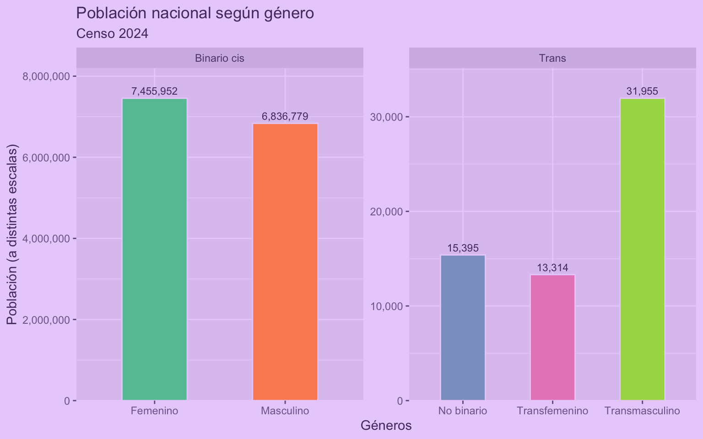
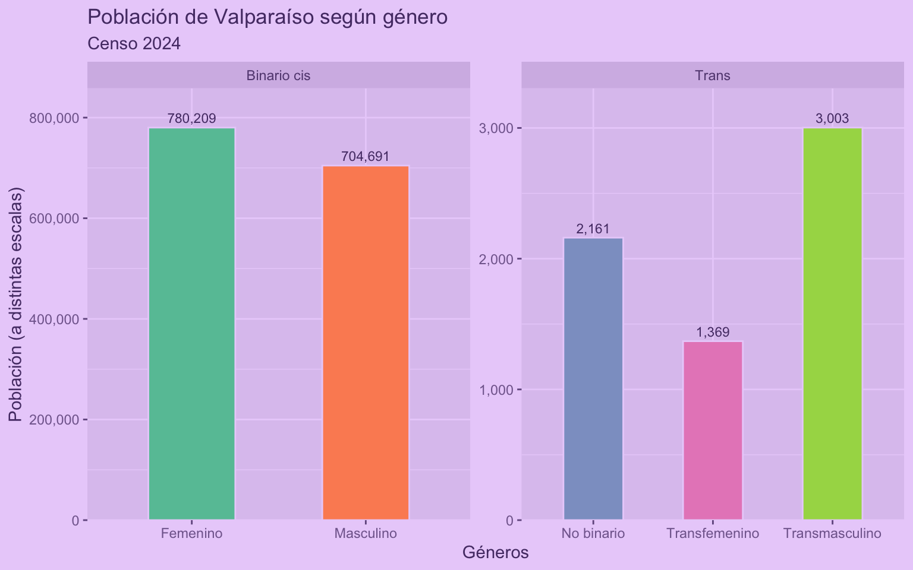
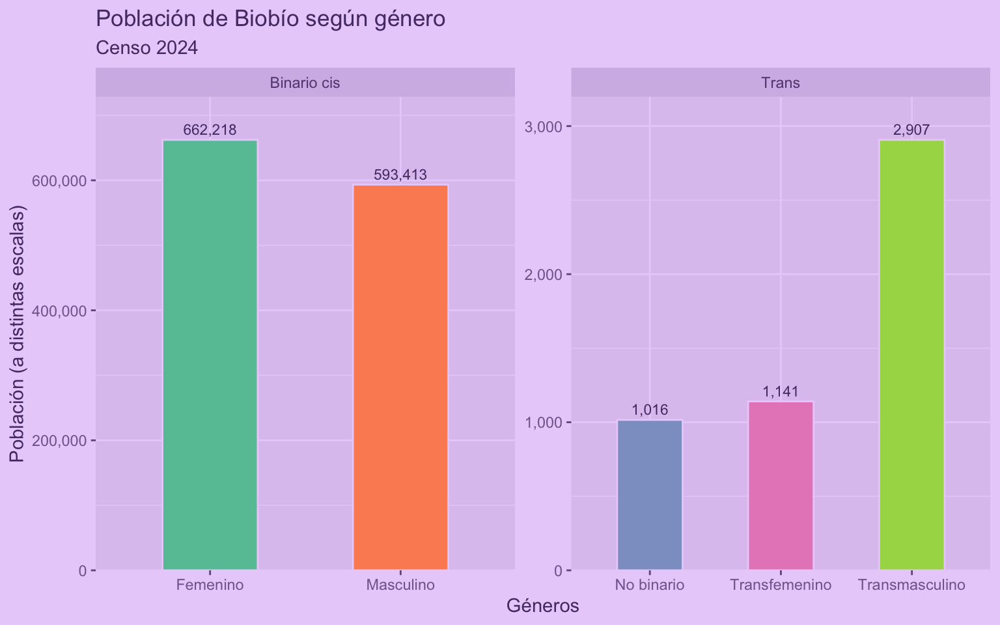
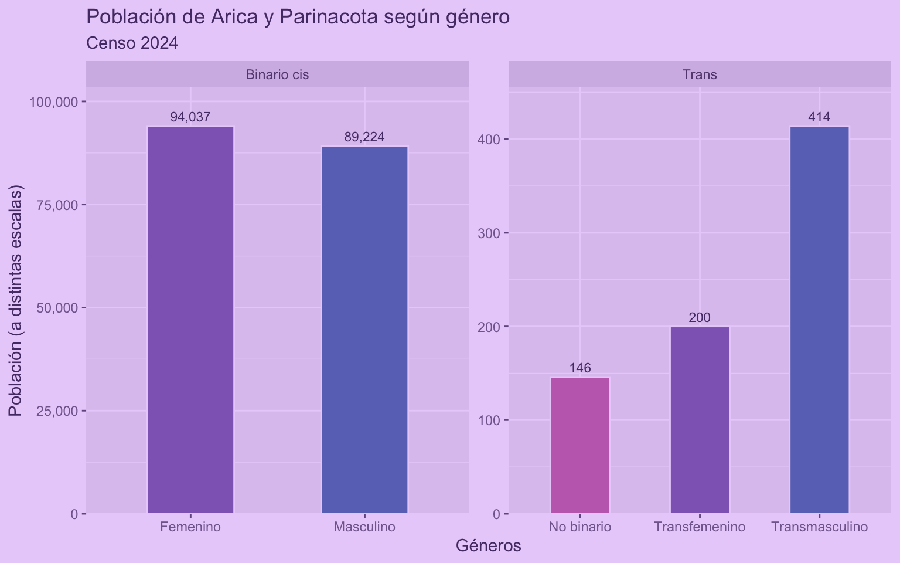

El otro día me llegó un script (muy probablemente hecho por una IA) de más de 9.000 líneas!


Igual era entendible, porque era un script que producía cientos de gráficos. Pero revisando el script me doy cuenta de que también **se repiten cientos de veces los mismos patrones de código.**

Scripts como éstos suelen ser apenas una docena de bloques de código distintos, pero repetidos muchas veces cada uno con mínimas diferencias entre ellos: referencias a columnas distintas, etc.

Esa extensión y ese nivel de repetición hizo que modificar el script para mejorar los gráficos, que en teoría eran un puñado de visualizaciones repetidas muchas veces, fuera un enorme dolor de cabeza.

Al tiro pensé: *Este script enorme podría haber sido un `for` loop* 😂

***¿Qué tiene de malo la repetición?***
- Produce scripts **difíciles de revisar y entender**, porque son tan eternos que no puedes contenerlos en tu cabeza 🤕
- Es código **difícil de mantener**, porque si quieres hacer un cambio, vas a tener que aplicarlo infinitas veces de forma manual 😫
- Producen **problemas a largo plazo**, porque puede ser que aparezca un error en el código y vas a tener que bucear 🐠 entre miles de líneas para encontrarlo

Aquí dejo algunos consejos para escribir código más **eficiente**, más **fácil de entender**, y **más fácil de mantener**.

------------------------------------------------------------------------

## Separar un script en partes

Si tienes un script muy largo, lo primero que puedes hacer es **separar el script en varias partes**, y cada parte ponerla en un archivo distinto.

Si un script requiere que se ejecute otro, puedes agregar `source()` para que dentro de un script se ejecute otro script.

Por ejemplo, en un script pones todo el código de la carga de datos, en otro pones las funciones que usarás, y el tercer script lo empiezas con `source("cargar.R")` y `source("funciones.R")`.



Entonces pasas desde esto:
- `script_enorme.R`



A esto:
- `cargar.R`
- `funciones.R`
- `pruebas.R`
- `gráficos.R`



Entonces, si necesitas cambiar algo en la carga de datos, vas al script correspondiente y lo arreglas!

Otra opción es tener todo en scripts separados, y luego tener un **script principal que ejecute todos los pasos necesarios** con `source()`, una especie de orquestador de todos los pasos de tu proyecto. En estos casos se recomienda anteceder los scripts con una numeración para registrar el orden de los pasos.

{{< info "Para orquestar _pipelines_ en R existe [el paquete `{targets}`](https://docs.ropensci.org/targets/), que permite declarar flujos o _pipelines_ con los pasos necesarios para tu proyecto, coordinando la ejecución de todos los pasos. Tiene el beneficio de que optimiza el tiempo de procesamiento al ejecutar solamente los pasos que tienen cambios. Para más información [revisa este libro.](https://books.ropensci.org/targets/)">}}

## Crear funciones

Si tienes un **bloque de código que se repite muchas veces**, lo mejor es convertirlo en una función, y luego llamar a esa función cada vez que necesites ejecutar ese bloque de código.

***Por qué usar funciones?***
- Permiten **ordenar el código**, porque *esconden* la complejidad del código dentro de la función, dejando sólo lo necesario a la vista: pasas de muchas líneas de código a una función con un nombre que describa lo que hace
- Permiten **reutilizar código**, porque una vez que creas la función, puedes usarla las veces que quieras sin tener que copiar y pegar el mismo bloque de código
- Te ayudan a **mantener el código**, porque si después necesitas hacer un cambio o corrección, la haces en un sólo lugar, y ese cambio se va a aplicar a todas las veces que uses la función



Pongámonos en el caso de que vamos a procesar los [resultados del Censo de población y vivienda 2024](https://censo2024.ine.gob.cl/resultados/) de Chile, y cargamos los **datos sobre población según género**:



``` r
library(readxl)
library(dplyr)
library(janitor)
library(tidyr)

# cargar datos
genero <- read_xlsx("P5_Genero.xlsx", sheet = 2)

# limpiar y procesar
genero_long <- genero |> 
  row_to_names(3) |> 
  pivot_longer(cols = 4:last_col(),
               names_to = "genero",
               values_to = "poblacion") |> 
  select(region = 2, genero, poblacion) |> 
  mutate(poblacion = as.numeric(poblacion)) |> 
  mutate(tipo = case_when(genero %in% c("Masculino", "Femenino") ~ "Binario cis",
                          genero %in% c("No binario", "Transfemenino", "Transmasculino") ~ "Trans",
                          TRUE ~ "Otros")) |> 
  filter(tipo != "Otros")

genero_long
```

    # A tibble: 95 × 4
       region             genero         poblacion tipo       
       <chr>              <chr>              <dbl> <chr>      
     1 País               Masculino        6836779 Binario cis
     2 País               Femenino         7455952 Binario cis
     3 País               Transmasculino     31955 Trans      
     4 País               Transfemenino      13314 Trans      
     5 País               No binario         15395 Trans      
     6 Arica y Parinacota Masculino          89224 Binario cis
     7 Arica y Parinacota Femenino           94037 Binario cis
     8 Arica y Parinacota Transmasculino       414 Trans      
     9 Arica y Parinacota Transfemenino        200 Trans      
    10 Arica y Parinacota No binario           146 Trans      
    # ℹ 85 more rows

Ahora que tenemos los datos por región y género, procedemos a **visualizar los datos**:

``` r
library(ggplot2)
```

    Warning: package 'ggplot2' was built under R version 4.4.3

``` r
# visualizar
genero_long |> 
  filter(region == "País") |> 
  ggplot(aes(x = genero, y = poblacion, fill = genero)) +
  geom_col(width = 0.5, color = "#EAD2FA") +
  geom_text(aes(label = scales::comma(poblacion)), 
            position = position_dodge(width = 0.9), 
            vjust = -0.5, 
            size = 3) +
  scale_fill_brewer(type = "qual", palette = "Set2") +
  scale_y_continuous(labels = scales::comma,
                     expand = expansion(mult = c(0, 0.1))) +
  scale_x_discrete(labels = label_wrap_gen(15)) +
  facet_wrap(~tipo, scales = "free") +
  guides(fill = guide_none()) +
  theme_grey(ink = "#553A74",
             paper = "#EAD2FA",
             accent = "#9069C0") +
  labs(title = "Población nacional según género",
       subtitle = "Censo 2024",
       x = "Géneros", y = "Población (a distintas escalas)")
```



Pero imaginemos que ahora queremos **hacer el mismo gráfico varias veces**. ¿Copiamos el bloque del gráfico y lo pegamos las veces que lo necesitemos? **NO!** 😡

En vez de repetir el código, copiamos el código y creamos funciones para ordenarlo y hacerlo más manejable:

``` r
# función para cargar datos
censo_cargar_genero <- function(archivo = "P5_Genero.xlsx") {
  read_xlsx(archivo, sheet = 2)
}
```

``` r
# función para procesar datos
censo_procesar_genero <- function(genero) {
  
  genero |> 
    row_to_names(3) |> 
    pivot_longer(cols = 4:last_col(),
                 names_to = "genero",
                 values_to = "poblacion") |> 
    select(region = 2, genero, poblacion) |> 
    mutate(poblacion = as.numeric(poblacion)) |> 
    mutate(tipo = case_when(genero %in% c("Masculino", "Femenino") ~ "Binario cis",
                            genero %in% c("No binario", "Transfemenino", "Transmasculino") ~ "Trans",
                            TRUE ~ "Otros")) |> 
    filter(tipo != "Otros") |> 
    filter(!is.na(region))
}
```

``` r
# función para visualizar datos 
censo_grafico_genero <- function(genero_long,
                                 filtro = "País",
                                 titulo = "Población nacional según género") {
  genero_long |> 
    filter(region == filtro) |> 
    ggplot(aes(x = genero, y = poblacion, fill = genero)) +
    geom_col(width = 0.5, color = "#EAD2FA") +
    geom_text(aes(label = scales::comma(poblacion)), 
              position = position_dodge(width = 0.9), 
              vjust = -0.5, 
              size = 3) +
    scale_fill_brewer(type = "qual", palette = "Set2") +
    scale_y_continuous(labels = scales::comma,
                       expand = expansion(mult = c(0, 0.1))) +
    scale_x_discrete(labels = label_wrap_gen(15)) +
    facet_wrap(~tipo, scales = "free") +
    guides(fill = guide_none()) +
    theme_grey(ink = "#553A74",
               paper = "#EAD2FA",
               accent = "#9069C0") +
    labs(title = titulo,
         subtitle = "Censo 2024",
         x = "Géneros", y = "Población (a distintas escalas)")
}
```

Lo que hicimos fue simplemente **meter las partes del código dentro de `function()`** para crear funciones.

Ahora cuando necesitemos ejecutar esas partes del código, simplemente llamamos las funciones:

``` r
genero <- censo_cargar_genero()

genero_long <- censo_procesar_genero(genero)

censo_grafico_genero(genero_long,
                     filtro = "Valparaíso",
                     titulo = "Población de Valparaíso según género")
```



¡Mucho más breve y ordenado! 😍

Ahora podemos **reutilizar la función** para generar otro gráfico similar en tan sólo un par de líneas:

``` r
censo_grafico_genero(genero_long,
                     filtro = "Biobío",
                     titulo = "Población de Biobío según género")
```



En el fondo lo que hicimos fue *esconder* parte del código dentro de las funciones, despejando nuestro script.

Ahora, si queremos **hacer algún cambio en el código**, cambiamos la función que creamos y re-ejecutamos la función, y así el cambio se aplicará a las siguientes veces que ocupemos la función.
Por ejemplo, cambiemos la paleta de colores:



``` r
# cambiamos la función, agregando el código nuevo dentro de ella
censo_grafico_genero <- function(genero_long,
                                 filtro = "País",
                                 titulo = "Población nacional según género") {
  genero_long |> 
    filter(region == filtro) |> 
    ggplot(aes(x = genero, y = poblacion, fill = genero)) +
    geom_col(width = 0.5, color = "#EAD2FA") +
    geom_text(aes(label = scales::comma(poblacion)), 
              position = position_dodge(width = 0.9), 
              vjust = -0.5, 
              size = 3) +
    # scale_fill_brewer(type = "qual", palette = "Set2") +
    #### cambio en la función para cambiar paleta de colores
    scale_fill_manual(values = c("Femenino" = "#9069C0", 
                                 "Masculino" = "#6974C0", 
                                 "No binario" = "#C46EBA", 
                                 "Transfemenino" = "#9069C0", 
                                 "Transmasculino" = "#6974C0")) +
    ####
    scale_y_continuous(labels = scales::comma,
                       expand = expansion(mult = c(0, 0.1))) +
    scale_x_discrete(labels = label_wrap_gen(15)) +
    facet_wrap(~tipo, scales = "free") +
    guides(fill = guide_none()) +
    theme_grey(ink = "#553A74",
               paper = "#EAD2FA",
               accent = "#9069C0") +
    #### cambio en la función para usar el filtro en el título
    labs(title = paste("Población de", filtro, "según género"),
         ####
         subtitle = "Censo 2024",
         x = "Géneros", y = "Población (a distintas escalas)")
}
```



Ahora que actualizamos la función, al volver a usarla tendrá los cambios nuevos:

``` r
censo_grafico_genero(genero_long,
                     filtro = "Arica y Parinacota")
```



## Hacer un *loop* o bucle

Otro caso de repetición es cuando tenemos que **hacer una misma cosa muchas veces**.

Siguiendo el ejeplo anterior, donde creamos una función, una opción es usar la función muchas veces:

``` r
censo_grafico_genero(genero_long, filtro = "Arica y Parinacota")

censo_grafico_genero(genero_long, filtro = "Tarapacá")

censo_grafico_genero(genero_long, filtro = "Antofagasta")

censo_grafico_genero(genero_long, filtro = "Coquimbo")
```

... y así hasta el infinito. Pero esto no es eficiente!

Lo mejor sería usar un *loop* o bucle, que es una estructura de código que permite repetir un bloque de código varias veces, cambiando alguna parte del código cada vez.



En este caso, el código repetido siempre es la misma función (o el bloque de código que genera el gráfico), y lo único que cambia son los argumentos que se le enrega a la función (la región a filtrar), así que podemos hacer un *loop* que ejecute varias veces el código, y en cada paso cambie el filtro:

``` r
# obtener vector con las regiones
regiones <- unique(genero_long$region)
```

Primero obtenemos un vector que contenga el valor que queremos que se use en cada paso del *loop*, y luego construimos el *loop* para que, por cada valor del vector (`for (region in regiones)`), ejecute el bloque de código que queremos repetir:

``` r
# hacer un loop para generar un gráfico por cada región
for (region in regiones) {
  censo_grafico_genero(genero_long, filtro = region)
}
```

Con sólo esas pocas líneas, generamos gráficos para todas las regiones del país!



## Conclusión

En resumidas cuentas, si aplicamos lo aprendido en este tutorial, lo que hicimos quedaría así:

``` r
source("funciones.R")

# cargar
genero <- censo_cargar_genero()

# procesar
genero_long <- censo_procesar_genero(genero)

# loop
for (region in unique(genero$regiones)) {
  censo_grafico_genero(genero_long, filtro = region)
}
```

Hermoso. Elegante. Conciso. Reproducible. Una obra de arte 👌🏼

Quizás lo mejor que puedes hacer con tu código es **hacerlo legible** y **no repetirte**. Como hemos visto, lo mejor es **separar el código en partes**, **crear funciones** para ordenar el código y hacerlo más manejable, y **usar loops** para ejecutar un mismo código varias veces.



