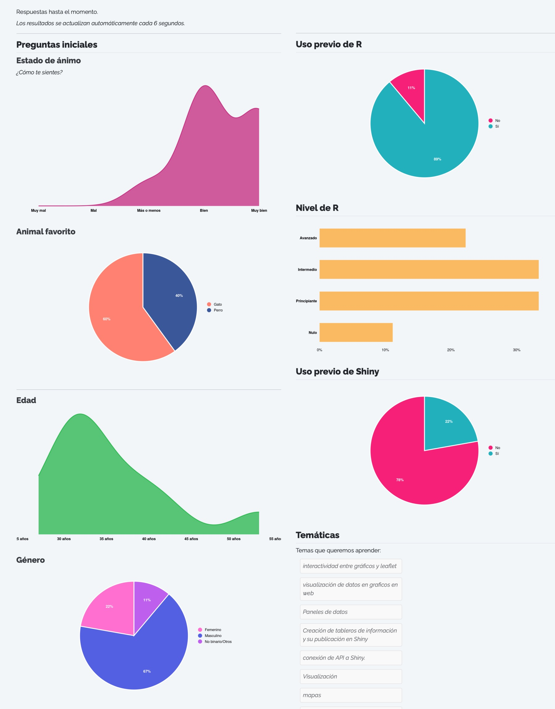

Con el paquete [`{surveydown}`](https://surveydown.org) podemos crear encuestas desde R gratis, cuyas respuestas se almacenan en una base de datos también gratuita.

La gracia de crear tu propia encuesta es que puedes personalizarla según tus necesidades, pero también es que no necesitas depender de un servicio para generar la encuesta, ni tampoco tener que pagar para poder crearla o publicarla. Por el contrario, podemos utilizar **tecnologías gratuitas y de código abierto** para crear nuestras encuestas, almacenar sus resultados y analizarlos.





El paquete [`{surveydown}`](https://surveydown.org) combina el uso de [Quarto](https://quarto.org/docs/computations/r.html) y [Shiny](https://shiny.posit.co/r/getstarted/shiny-basics/lesson1/) para crear encuestas fáciles de diseñar, y con altas capacidades de personalización. [Aquí te dejo una **encuesta de prueba** para que veas cómo son!](https://bastianoleah.shinyapps.io/encuesta_animales)

El diseño de la encuesta, con todas sus preguntas, títulos, textos, páginas y botones, se hace por medio de un **documento [Quarto](https://quarto.org/docs/computations/r.html)**, donde literalmente vas poniendo todo el contenido que quieres que tenga tu encuesta, especificando los saltos de página de la encuesta, y listo.

El funcionamiento interno de la encuesta es resuelto por `{surveydown}`, y no tenemos que realizar nada de configuración ni programación por nuestro lado. Todo funciona de forma inmediata (la encuesta, la interacción del usuario y la base de datos) por medio de una **aplicación Shiny**. Lo único que tenemos que proveer es la **conexión a la base de datos** donde se van a ir guardando las respuestas, y de la cual también vamos a poder obtener los resultados cuando queramos.







## Instalar el paquete

Instalamos [la versión más reciente](https://surveydown.org/blog/2025-11-21-announcing-surveydown-version-1/):

```r
# install.packages("pak")
pak::pak("surveydown-dev/surveydown")
```

## Crear una encuesta

Para crear nuestra encuesta, creamos un [nuevo proyecto de RStudio](/blog/r_introduccion/proyectos/) para la encuesta, y usamos la función `surveydown::sd_create_survey()` para crear una plantilla de encuesta lista para editar. Sólo una encuesta por proyecto!

En la función `sd_create_survey()` puedes elegir [plantillas](https://surveydown.org/templates), como `sd_create_survey(template = "question_types")` para obtener una encuesta con varios tipos de preguntas distintos para partir.

Cuando creamos nuestra primera encuesta, obtenemos un proyecto de R con dos archivos principales: 
- `survey.qmd`: la **encuesta**, en un documento Quarto, donde diseñas todo el contenido de la encuesta, desde subtítulos, textos de introducción, títulos para las preguntas, las preguntas en sí misma, y otros textos que quieras agregar entremedio de la encuesta.
- `app.R`: la **aplicación** Shiny donde va a aparecer tu encuesta, y que posibilita que las respuestas vayan guardándose en una base de datos. El rol de la aplicación Shiny es hacer la gestión de que la encuesta funcione y sea interactiva, y que las respuestas que ingresamos quedan registradas en la base de datos. Pero también aquí se puede [configurar lógica condicional](https://surveydown.org/docs/conditional-logic) para la encuesta, y además podemos ir mostrando resultados en tiempo real, visualizaciones de nuestros resultados que se actualizan automáticamente, y más.


## Diseñar la encuesta

Estando en el proyecto de R de nuestra nueva encuesta, abrimos el documento Quarto `survey.qmd`, y en él encontraremos una encuesta que viene por defecto. 

Mirando este documento vemos que las páginas de la encuesta van delimitadas por cercos `:::`, y que dentro de estos cercos va todo el contenido que queramos poner en cada página, como títulos, textos y preguntas.

```quarto
::: {.sd-page id=bienvenida}

# Encuesta

Texto de _introducción_ 

:::
```

### Crear preguntas
Dentro de los cercos que delimitan cada página, cada pregunta de la encuesta va en el documento como un bloque de código R, que en su interior contiene la función `sd_question()`. 

````markdown
```{r}
sd_question(
  type  = 'mc',
  id    = 'pinguinos',
  label = "쯈ué tipo de ping칲ino te gusta más?",
  option = c(
    'Adélie'    = 'adelie',
    'Chinstrap' = 'chinstrap',
    'Gentoo'    = 'gentoo'
  )
)
```
````

Con esta función se crean las preguntas de nuestra encuesta, y en sus argumentos tenemos todas las opciones para personalizarlas.

En el sitio de `{surveydown}` puedes conocer [todos los **tipos de preguntas**](https://surveydown.org/docs/question-types), para que veas cómo se ven y cómo se crean. 

También existe una [**encuesta online de prueba** que te muestra todos los tipos de preguntas](https://surveydown.shinyapps.io/question_types/) en una encuesta real.



Aquí te dejo algunos ejemplos de preguntas básicas que puedes incluir en tu encuesta:

#### _Preguntas de selección múltiple_
```r
sd_question(
  type  = 'mc_buttons',
  id    = 'animal',
  label = "쮺uál es tu animal favorito?",
  option = c(
    "Perro",
    "Gato",
    "Mapache"
  )
)
```

#### _Pregunta de ingreso de números_
```r
sd_question(
  type  = 'numeric',
  id    = 'edad',
  label = "쮺uál es tu edad?"
)
```

####  _Pregunta de ingreso de texto_
```r
sd_question(
  type  = "text",
  id    = "temas",
  label = "Escribe tus comentarios aquí",
  placeholder = "(opcional)"
)
```
#### _Pregunta de selección múltiple con selección de más de una respuesta_
```r
sd_question(
  type  = 'mc_multiple_buttons',
  id    = 'genero',
  label = "쮺on qué género te identificas?",
  option = c(
    "Femenino",
    "No binario/Otros",
    "Masculino",
    "Prefiero no responder"
  )
)
```

### Navegación

Al finalizar cada página de tu encuesta, tienes que agregar el botón de siguiente, para que los usuarios/as puedan avanzar a la siguiente página:

```r
sd_nav(label_next = "Siguiente")
```

En este botón también puedes configurar si llevar a les usuaries a otra página distinta. 

En la página final de tu encuesta puedes poner un texto de agradecimiento y más información, y especificar el botón para terminar la encuesta:

```r
sd_close(label_close = "Terminar")
```

Si quieres probar cómo va quedando tu encuesta, puedes ejecutar la aplicación Shiny desde el archivo `app.R`, presionando el botón _Run._



En [este repositorio](https://github.com/bastianolea/encuesta_animales) te dejo el código de [una encuesta básica](https://bastianoleah.shinyapps.io/encuesta_animales), de tres preguntas, con gráficos que visualizan las respuestas de la encuesta al terminar de responderla. Puedes usarla como guía al momento de diseñar tu propia encuesta.

Sin embargo, para que tu encuesta funcione, tienes que **configurar la base de datos** primero. Veremos eso a continuación, pero si de todas maneras quieres probar tu encuesta antes de configurar la base de datos, puedes probar la aplicación Shiny ejecutándola, y las respuestas se van a guardar en un archivo local.


## Configurar la base de datos

Para que las preguntas que respondan tus usuarios/as queden registradas, es necesario especificar un método de recolección de los datos que guarde las respuestas en una base de datos centralizada. 

Pero una de las limitaciones de las aplicaciones Shiny, particularmente las publicadas en shinyapps.io, es que no pueden almacenar datos persistentes, sino que los datos creados durante el uso de las apps son eliminados al terminar la sesión. 

Por lo tanto, hay que **[crear una base de datos](/blog/db_supabase/)** donde las respuestas de cada persona sean registradas en cada interacción con la encuesta, y que luego podamos consultar para obtener los resultados. 

Esto no es tan difícil de hacer como suena. En la documentación de `{surveydown}` hay [instrucciones detalladas para crear una base de datos para tu encuesta](https://surveydown.org/docs/storing-data), y acá tengo un **[tutorial completo para crear bases de datos](/blog/db_supabase/)**, pero acá de te dejo un resumen:

#### Paso 1: crea una cuenta en Supabase

Lo primero es averiguar dónde podemos crear una base de datos remota y gratuita. En la [documentación](https://surveydown.org/docs/storing-dat) de `{surveydown}` recomiendan usar [Supabase](https://supabase.com). Supabase es un **proveedor abierto y gratuito de bases de datos Postgres**. Crea una cuenta ahí, y sigue las instrucciones para tener tu primer proyecto, el cual cuenta con una base de datos. En tu base de datos podrás tener tablas donde se almacenarán las respuestas de tu encuesta. En una misma base de datos pueden haber múltiples tablas, una tabla para cada encuesta distinta que crees. 

#### Paso dos: crear la base de datos
Luego tienes que crear un _proyecto._ En este proyecto habrá una base de datos donde se almacenarán los datos de respuesta de tu encuesta, en una tabla específica. 



Aquí lo importante es que tienes que **definir una contraseña segura**, que será la contraseña que uses para que tu encuesta pueda escribir sus resultados en la base, y también para que tú puedas obtener los resultados desde la base.



#### Paso tres: obtener parámetros de la base de datos

Luego de crear la base, necesitas obtener los **parámetros de conexión** para poder hacer la conexión entre tu encuesta y la base. 

Al entrar a tu proyecto, arriba presiona el botón **Connect**. Se abrirá un panel donde se nos entregarán los parámetros de acceso a la base de datos.



**Importante:** en _Method_ que elegir _Transaction Pooler_.

Ten a la vista estos parámetros para ingresarlos en el siguiente paso!

#### Paso cuatro: guardar los parámetros de la base de datos

Ahora que tienes los parámetros de conexión, ejecuta el siguiente comando:

```r
sd_db_config()
```

Este comando irá pidiéndote uno por uno los parámetros de conexión que tienes en Supabase, incluyendo la contraseña que ingresaste al momento de crear el proyecto.

Cuando te pregunte por el nombre de la tabla, puedes poner el que tú quieras. La tabla se va a crear solita en la base de datos. Si luego creas una nueva encuesta, y pones un nombre de tabla distinto, las respuestas de esta nueva encuesta aparecerá en una tabla separada. Basta con especificar el nombre de una tabla nueva para que la tabla nueva se cree, no es necesario crearla antes en otro lugar.



Estas credenciales se guardarán en un archivo oculto `.env` dentro de tu proyecto, y que será leído por la encuesta para poder conectarse a la base de datos.


#### Paso cinco: configurar la base de datos en tu proyecto de R

Abre `app.R`, y revisa que la función `sd_db_connect()` que está al principio del script. Por defecto dice `db <- sd_db_connect(ignore = TRUE)`, para funcionar en modo de prueba sin una base de datos, pero ahora queremos que diga solamente `db <- sd_db_connect()`. De este modo, la aplicación va a buscar el archivo `.env` que creamos en el paso anterior y se va a conectar a la base de datos.

¡Y listo! Ahora cada respuesta que se marque en tu encuesta quedará registrada automáticamente en la base de datos.


## Probar la encuesta

Para ejecutar tu encuesta, tienes que abrir el script de la aplicación Shiny, `app.R`, y ejecutar la app con el botón _Run._ Tu encuesta se abrirá una nueva ventana y podrás ponerla a prueba, o responderla.

Todas las respuestas que ingreses quedarán registradas en la base de datos de Supabase, incluso cuando la ejecutes localmenet. En el sitio web de Supabase, dentro de tu proyecto de la encuesta, puedes acceder a _Table editor_ para revisar la tabla que contiene las respuestas, y revisar las respuestas en una planilla interactiva.

## Subir tu encuesta y compartirla

El último paso es **publicar tu encuesta** y compartirla con otras personas para que la respondan. La forma más sencilla de hacer esto es publicar la aplicación en [shinyapps.io](https://www.shinyapps.io). [En este post te doy todas las instrucciones para que puedas publicar tu aplicación gratuitamente a shinyapps.io](https://bastianolea.rbind.io/blog/r_introduccion/tutorial_shinyapps/). Para publicar la encuesta como una aplicación en [shinyapps.io](https://www.shinyapps.io), abre el script `app.R` y presiona el botón azul de _Publicar_ (en la esquina superior derecha del panel de script), y publícala a como si de cualquier otra aplicación se tratase. Una vez publicada, tendrás un enlace que puedes compartir con otras personas. 

Todas las respuestas quedarán registradas en tu base de datos, incluso desde la aplicación publicada, porque la app contiene la autenticación que hiciste a la base de datos, así que tiene _permiso_ para escribir en la tabla remota.


## Obtener resultados de la encuesta

Para obtener los resultados de tu encuesta, simplemente en un nuevo script te conectas a la base con `sd_db_connect()` y usas la función `sd_get_data()` para obtener los datos:

```r
library(surveydown)

db <- sd_db_connect()

data <- sd_get_data(db)
```

Vale decir que la obtención de los datos remotos tienes que hacerla desde el mismo proyecto de R donde creaste y configuraste las credenciales de tu base de datos. 

Una vez establecida la conexión con la base de datos, si vuelves a ejecutar la función `sd_get_data()` obtendrás los datos actualizados.

----

## Conclusión

Siguiendo esta instrucciones, en unos minutos podrás tener una encuesta sencilla, personalizable, y totalmente gratis, que puedes publicar online y enviarla para empezar a recolectar datos. En el proceso, también habrás aprendido a crear y conectarte a una base de datos SQL, una herramienta crucial y que abre muchas posibilidades en el mundo del análisis de datos y el desarrollo de aplicaciones Shiny.

Personalmente, creé una encuesta de evaluación anónima para las alumnas y alumnos de mis [cursos de R](/clases/), y otra encuesta de bienvenida a nuevos alumnxs de mis cursos, donde rellenaron sus datos de caracterización, respondieron sobre sus conocimientos previos de R y sus expectativas del curso, y al final de la encuesta **los resultados se visualizaban en tiempo real**, actualizándose cada cinco segundos, y así todas y todos podíamos ver gráficos que describían a los participantes del curso a medida que respondían! 😍


_Gráficos al final de la encuesta, actualizados en tiempo real_

[En este repositorio](https://github.com/bastianolea/encuesta_animales) te dejo el código de una encuesta que también muestra gráficos en tiempo real con las respuestas al finalizar, y [en este enlace puedes ver la misma encuesta en funcionamiento](https://bastianoleah.shinyapps.io/encuesta_animales) y responderla.

----

Si este tutorial te sirvió, por favor considera hacerme una pequeña donación para poder tomarme un cafecito mientras escribo el siguiente tutorial 🥺

