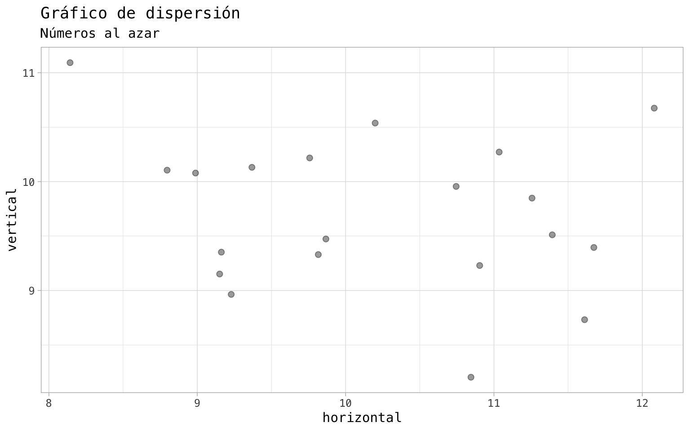
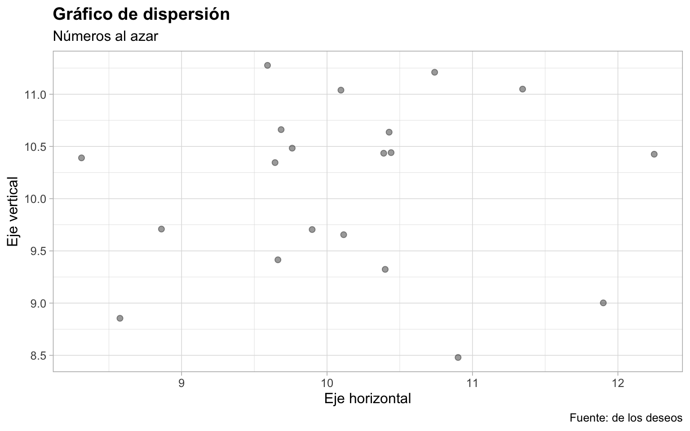
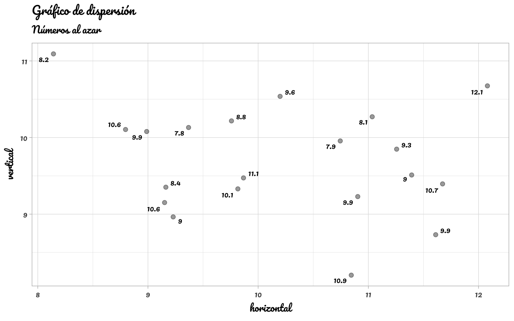
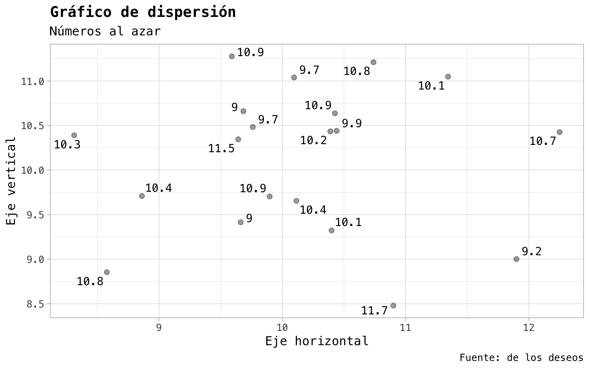
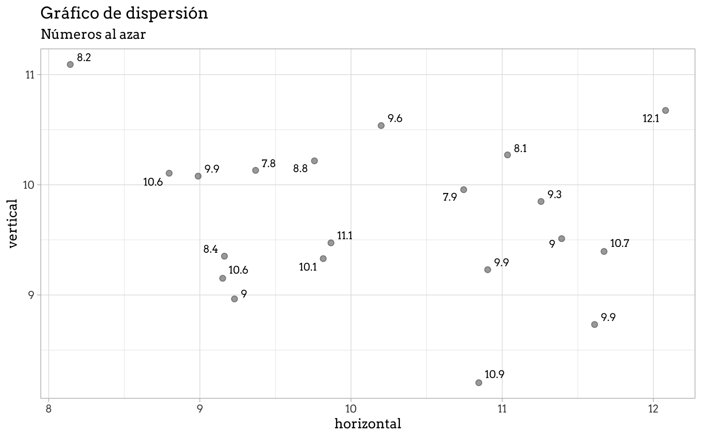

``` r
library(ggplot2)
library(dplyr)
```


    Attaching package: 'dplyr'

    The following objects are masked from 'package:stats':

        filter, lag

    The following objects are masked from 'package:base':

        intersect, setdiff, setequal, union

``` r
# crear datos al azar
datos <- tibble(a = rnorm(20, mean = 10, sd = 1),
                b = rnorm(20, mean = 10, sd = 1),
                c = round(rnorm(20, mean = 10, sd = 1), 1))

grafico <- datos |> 
  ggplot() +
  aes(x = a, y = b) +
  geom_point(size = 2, alpha = 0.4) +
  labs(title = "Gráfico de dispersión",
       subtitle = "Números al azar",
       x = "horizontal", y = "vertical") +
  theme_light()
```

``` r
# especificar tipografía para el tema
grafico +
  theme(text = element_text(family = "Menlo"))
```



``` r
# especificar tipografía para geom_text() y para el tema
grafico +
  ggrepel::geom_text_repel(aes(label = c), 
                           size = 3, family = "Menlo") +
  theme(text = element_text(family = "Menlo"))
```



## Showtext

``` r
library(showtext)
```

    Loading required package: sysfonts

    Loading required package: showtextdb

``` r
# descargar una tipografía desde google fonts
font_add_google(name = "Pacifico")

# activar tipogtafías
showtext_auto()
showtext_opts(dpi = 300)

# usar la tipografía desde Google Fonts
grafico +
  ggrepel::geom_text_repel(aes(label = c), 
                           size = 3, family = "Pacifico") +
  theme(text = element_text(family = "Pacifico"))
```



## Archivo

``` r
# agregar una tipografía desde un archivo
font_add("gobCL", 
         regular = "tipografías/gobCL_Regular.otf",
         bold = "tipografías/gobCL_Bold.otf")

# probar tipografía desde archivo
grafico +
  ggrepel::geom_text_repel(aes(label = c), 
                           size = 3, family = "gobCL") +
  theme(text = element_text(family = "gobCL"))
```



## Descargar

``` r
# descargar tipografía desde Google Fonts
gfonts::setup_font("arvo", "tipografías")
```

    ✓ Font files downloaded!
    ✓ CSS file generated!
    ✲ Please use `use_font("arvo", "tipografías/css/arvo.css")` to import the font in Shiny or Markdown.

``` r
# agregar una tipografía desde un archivo
font_add("Arvo", 
         regular = "tipografías/fonts/arvo-v23-latin-regular.ttf",
         bold = "tipografías/fonts/arvo-v23-latin-700.ttf")

# probar tipografía descargada como archivo desde Google Fonts
grafico +
  ggrepel::geom_text_repel(aes(label = c), 
                           size = 3, family = "Arvo") +
  theme(text = element_text(family = "Arvo"))
```





