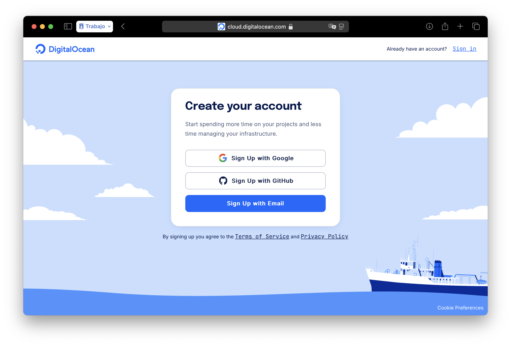
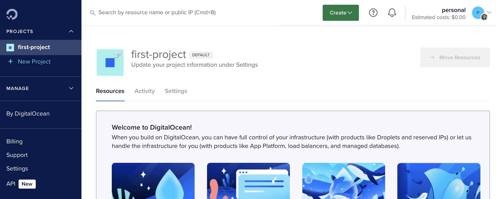
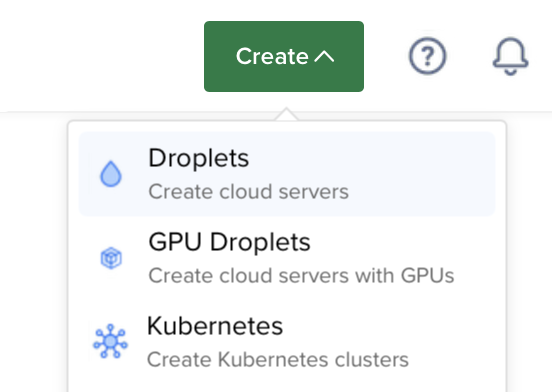
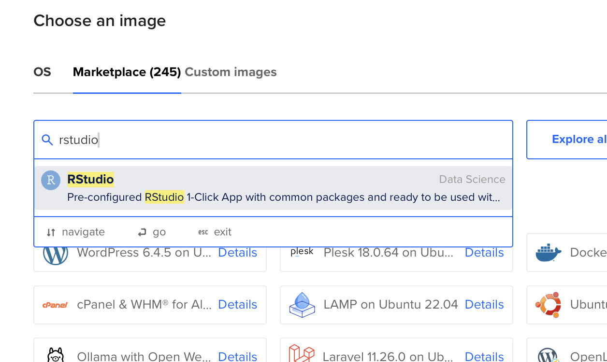
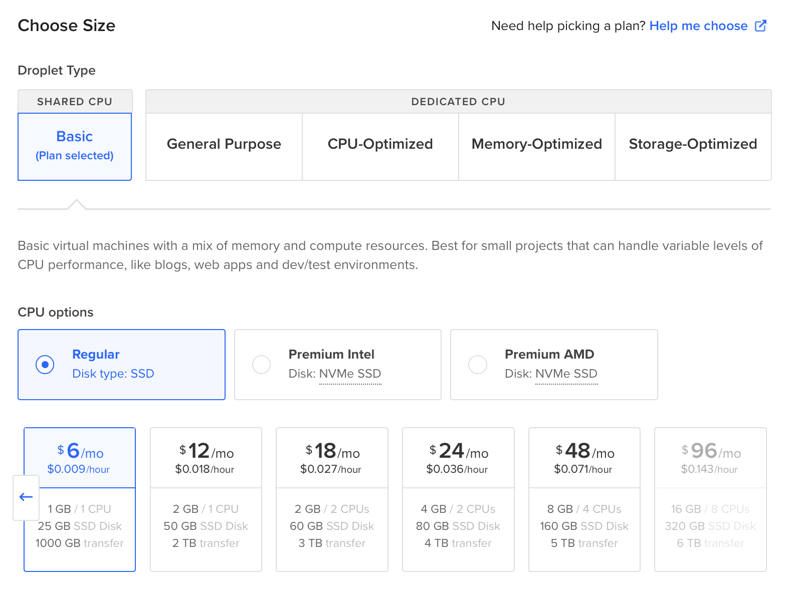
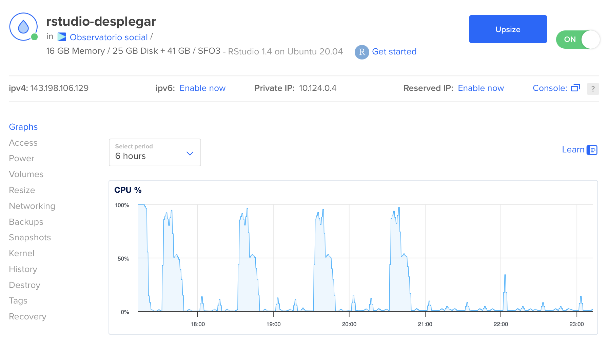
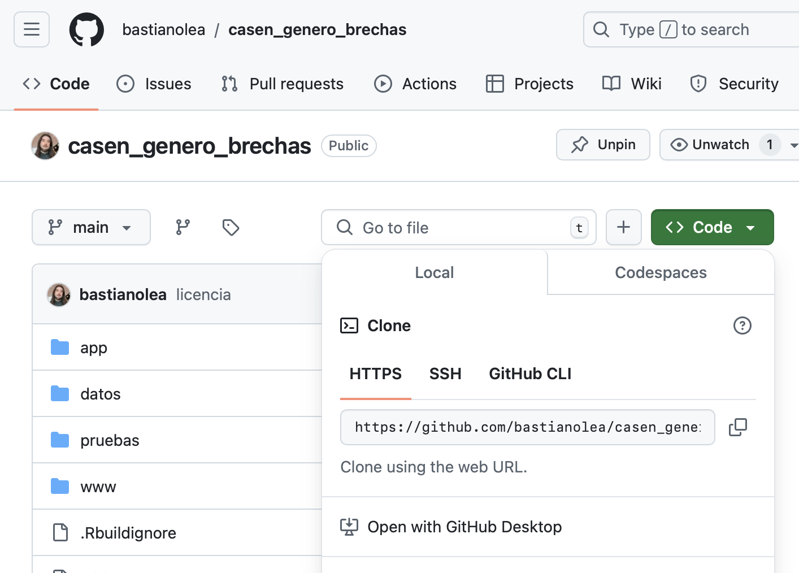



En este tutorial encuentras instrucciones paso a paso para crear un droplet (servidor privado) en Digital Ocean, en el cual puedes subir aplicaciones Shiny, ejecutar RStudio, dejar automatizados procesos recurrentes de análisis de datos o web scraping, y más.



## Crear una cuenta 

Puedes [crearte una cuenta con este enlace](https://m.do.co/c/b117f791b027) para obtener $200 de crédito por 60 días, y mi me llegan $25 😊

(necesita medio de pago)




## Crear un proyecto




## Crear un droplet




Buscar en el Marketplace la imagen RStudio



Elegir la configuración del droplet


    
## Configurar droplet



Crear usuario

```
adduser usuario
```

```
adduser usuarioprueba
usermod -aG sudo usuarioprueba
```

Para abrir el RStudio instalado en el Droplet: `{IP}:8787`


## Clonar una aplicación



- En el RStudio del droplet
    - Nuevo proyecto
    - Proyecto desde control de versiones
    - https://github.com/bastianolea/estimador_ingresos_trabajo.git
    
O en la Terminal del droplet: `git clone {url}`

## Configurar Shiny Server
Enlazar la carpeta de la aplicación con la carpeta de `shiny-server` por medio de un _enlace simbólico_:

```
sudo ln -s ~/miaplicacion /srv/shiny-server/
```

### Instalar paquetes para Shiny

Desde la consola de Digital Ocean:
```
sudo su - shiny
R
install.packages("...")
```

Editar configuración de Shiny
```
sudo nano /etc/shiny-server/shiny-server.conf
```

Dentro de este archivo, agregar estas opciones:
```
preserve_logs true;
sanitize_errors false;
```

Guardar usando control+O, cerrar usando control+W.

