[El paquete de R `{gt}`](https://gt.rstudio.com) (llamado así por generar *great tables*) permite producir tablas atractivas con R para presentar tus datos. Sus cualidades principales son que produce **resultados atractivos con muy pocas líneas de código**, pero al mismo tiempo ofrece una **alta capacidad de personalización**, teniendo opciones para personalizar prácticamente todos los aspectos de la tabla.

Otro beneficio de usar este paquete es que contiene funciones que hacen muy fácil darle el **formato correcto a las variables numéricas,** como porcentajes, números grandes, cifras en dinero, etc., Y además, ofrece funciones para darle estilos personalizados a las columnas o celdas de tu tabla de forma programática. Esto permite generar ciertas reglas para que las **celdas cambien de colores dependiendo de su valor**, ciertas cifras **cambian su tipo de letra bajo determinadas circunstancias**, y mucho más.

En este artículo te mostraré tres ejemplos de creación de distintas tablas basadas en datos reales:

1.  Tabla de **estimación de pobreza comunal**, con estilo condicional de celdas y columnas con colorización en base a datos
2.  Tabla de **resultados electorales**, con colorización de celdas de variables categóricas en base a una segunda variable categórica
3.  Tabla de **Producto Interno Bruto regional**, con colorización de múltiples columnas numéricas de forma simultánea, y estilo de celdas condicional

------------------------------------------------------------------------

## Tabla de estimación de pobreza por comunas

El primer ejemplo de tabla se basará en los datos de [estimaciones de pobreza comunal del año 2022, producidos por el Ministerio de Desarrollo Social](https://bidat.midesof.cl/directorio/Pobreza%20comunal/estimaciones-de-pobreza-comunal-2022) de Chile.

El primer paso será [obtener los datos oficiales.](https://bidat.midesof.cl/directorio/Pobreza%20comunal/estimaciones-de-pobreza-comunal-2022) Por conveniencia, tengo la tabla con los datos originales pre-procesada [en un repositorio sobre datos de pobreza en Chile](https://github.com/bastianolea/pobreza_chile), por lo que es posible importar los datos limpios en una sola línea de código:

``` r
pobreza <- readr::read_csv2("https://raw.githubusercontent.com/bastianolea/pobreza_chile/refs/heads/main/pobreza_comunal/datos_procesados/pobreza_comunal.csv")

pobreza
```

    # A tibble: 345 × 8
       codigo region     nombre_comuna poblacion pobreza_n pobreza_p limite_inferior
        <dbl> <chr>      <chr>             <dbl>     <dbl>     <dbl>           <dbl>
     1   1101 Tarapacá   Iquique          229674    41967.     0.183          0.162 
     2   1107 Tarapacá   Alto Hospicio    138527    45162.     0.326          0.295 
     3   1401 Tarapacá   Pozo Almonte      18290     4563.     0.250          0.199 
     4   1402 Tarapacá   Camiña             1380      308.     0.223          0.138 
     5   1403 Tarapacá   Colchane           1575      473.     0.300          0.187 
     6   1404 Tarapacá   Huara              3072     1185.     0.386          0.319 
     7   1405 Tarapacá   Pica               6184     1040.     0.168          0.119 
     8   2101 Antofagas… Antofagasta      438942    73103.     0.167          0.141 
     9   2102 Antofagas… Mejillones        15502     3078.     0.199          0.127 
    10   2103 Antofagas… Sierra Gorda       1790      295.     0.165          0.0743
    # ℹ 335 more rows
    # ℹ 1 more variable: limite_superior <dbl>

Podemos ver que los datos corresponden a 345 filas con información de las comunas, su población, y las cifras de pobreza en números absolutos y porcentaje.

Para el ejemplo, primero obtendremos 7 filas al azar y seleccionaremos solamente las columnas que nos interesan. Teniendo cualquier tabla de datos en R, si le agregamos la función `gt()` crearemos una tabla `{gt}` con las configuraciones por defecto:

``` r
library(dplyr)
library(gt)

set.seed(1917)

tabla_pobreza_1 <- pobreza |> 
  slice_sample(n = 7) |> 
  select(region, contains("comuna"), poblacion, starts_with("pobreza")) |> 
  gt()
```

<div style="background-color:white;padding:12px;border-radius:5px;max-width:480px;">
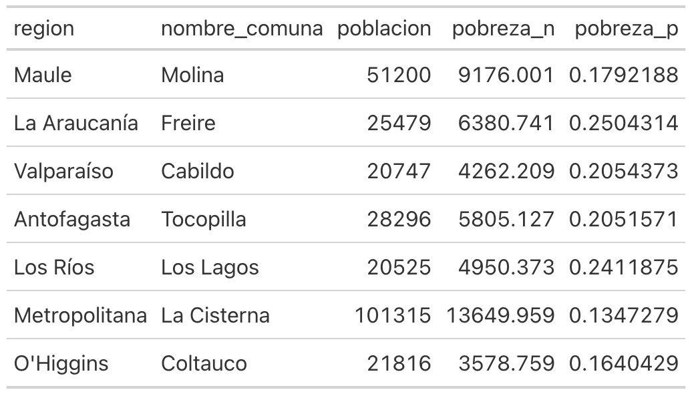
</div>

Esta es la tabla básica que entrega `{gt}`, la cual viene con líneas horizontales elegantes y un espaciado de celdas agradable. Tiene una apariencia bastante mejor que haber pegado a los datos en una planilla de Excel 🤫

### Formato de variables numéricas

El primer paso para mejorar esta tabla es darle un formato de texto correcto a las variables numéricas. Esto logramos con las funciones de `{gt}` que empiezan con `fmt_` (por *formato*), de las cuales usaremos `fmt_number()` para remover decimales de los números enteros y aplicar separadores de miles, y `fmt_percent()` para especificar el número de decimales y usar la coma como separador de decimales.

``` r
tabla_pobreza_2 <- tabla_pobreza_1 |> 
  # dar formato a números enteros
  fmt_number(columns = c(poblacion, pobreza_n),
             decimals = 0, sep_mark = ".") |> 
  # dar formato a porcentajes
  fmt_percent(columns = pobreza_p,
              decimals = 1, drop_trailing_zeros = TRUE,
              dec_mark = ",")
```

<div style="background-color:white;padding:12px;border-radius:5px;max-width:480px;">
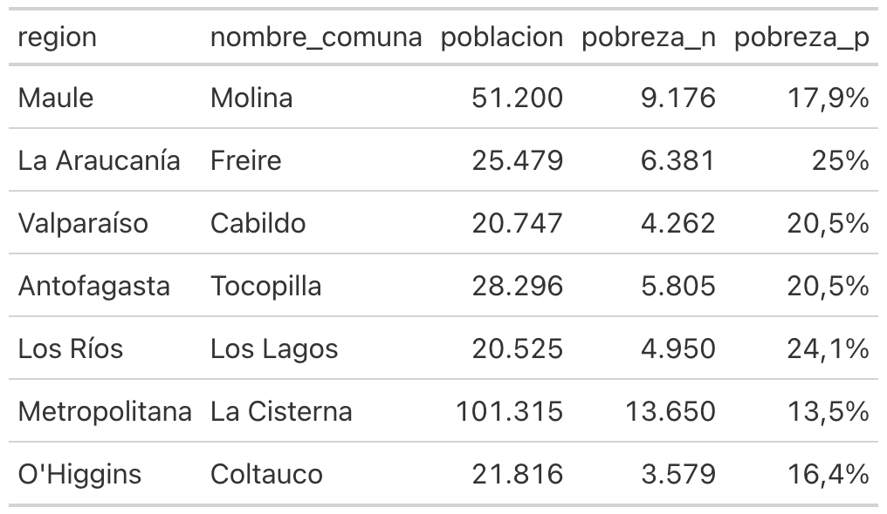
</div>

### Apariencia de columnas

El segundo paso va a ser cambiar el formato del texto de algunas columnas. En este caso, queremos aplicar letras negrita a la columna `nombre_comuna`, Y vamos a alinear la columna `region` hacia la derecha, para que se pegue al nombre de las comunas. Esto se lleva a cabo con la función `tab_style()`, cuyo primer argumento es el estilo que vamos a darle a las celdas, y el segundo es las columnas o filas que vamos a afectar. Cómo vamos a cambiar el texto de las celdas, en el argumento `style` se usa la función `cell_text()`, que contiene todos los atributos que podemos cambiar de las letras de las celdas, como color, tamaño, estilo, peso, etc.

La alineación del texto también podríamos haberla hecho con la función `tab_style()`, especificando en `cell_text()` que queremos que el texto sea alienado a la derecha, pero `{gt}` nos facilita un poco ésto con la función `cols_align()`.

``` r
tabla_pobreza_3 <- tabla_pobreza_2 |> 
  # cambiar estilo de texto de una columna
  tab_style(style = cell_text(weight = "bold"),
            locations = cells_body(nombre_comuna)) |> 
  # alineación de texto de una columna
  cols_align(align = "right", 
             columns = region)
```

<div style="background-color:white;padding:12px;border-radius:5px;max-width:480px;">
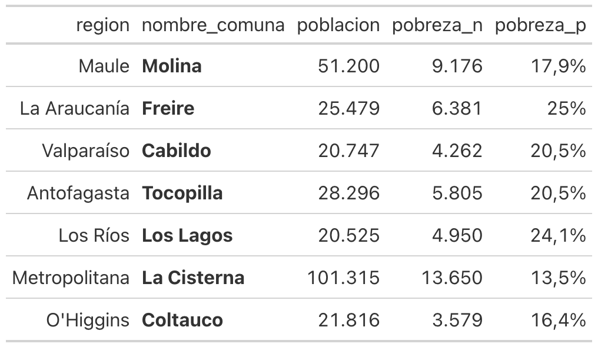
</div>

Para terminar de cambiar las configuraciones básicas de nuestra tabla, tenemos que mejorar los nombres de las columnas y agregar información de contexto a la tabla. Reemplazaremos los nombres de las columnas por nombres correctamente redactados, usando la función `cols_label()`, a la cual hay que darle los nombres de las columnas con el texto que queremos que tenga cada uno. Luego, utilizaremos la función `tab_header()` para agregar título y subtítulo, y la función `tab_source_note()` para agregar un texto de fuente debajo de la tabla.

``` r
tabla_pobreza_4 <- tabla_pobreza_3 |> 
  # nombres de columnas
  cols_label(region = "Región", nombre_comuna = "Comuna",
             poblacion = "Población", 
             pobreza_n = "Cantidad", pobreza_p = "Porcentaje") |> 
  # título y subtítulo
  tab_header(title = "Pobreza comunal", subtitle = "Cantidad y porcentaje de personas en situación de pobreza") |> 
  # texto fuente
  tab_source_note("Fuente: Estimaciones de pobreza comunal 2022,") |> 
  tab_source_note("Ministerio de Desarrollo Social")
```

<div style="background-color:white;padding:12px;border-radius:5px;max-width:480px;">
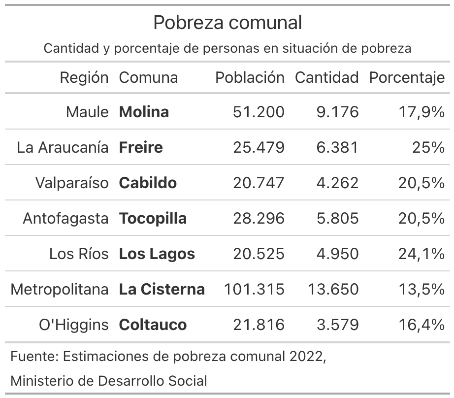
</div>

En este punto ya tenemos una tabla presentable, ordenada y elegante. Podemos guardar la tabla como una imagen con el comando `gtsave()`, incluirla en un reporte Quarto/RMarkdown o en una app Shiny.

### Estilo condicional de celdas

Podemos seguir mejorando en la tabla agregando cambios condicionales en el estilo de celdas que cumplan con una condición puntual. Por ejemplo, queremos destacar celdas de la variable `poobreza_n` que superen cierto valor, debido a que nos parece relevante distinguir comunas donde exista una cierta cantidad de personas en condición de pobreza.

Para agregar estilos condicionales a las celdas de una o varias columnas, usamos la misma función `tab_style()` que usamos para darle un estilo a las columnas completas, pero esta vez, en el argumento de `location` que usamos para especificar la columna que queremos modificar, especificamos tanto una columna como un criterio para las filas. De esta forma, se indica que queremos cambiar el estilo de una columna, pero sólo si sus filas cumplen una condición determinada:

``` r
tabla_pobreza_5 <- tabla_pobreza_4 |> 
  tab_style(style = cell_fill(color = "red", alpha = 0.2),
            locations = cells_body(columns = pobreza_n, 
                                   rows = pobreza_n > 6000)
  )
```

<div style="background-color:white;padding:12px;border-radius:5px;max-width:480px;">
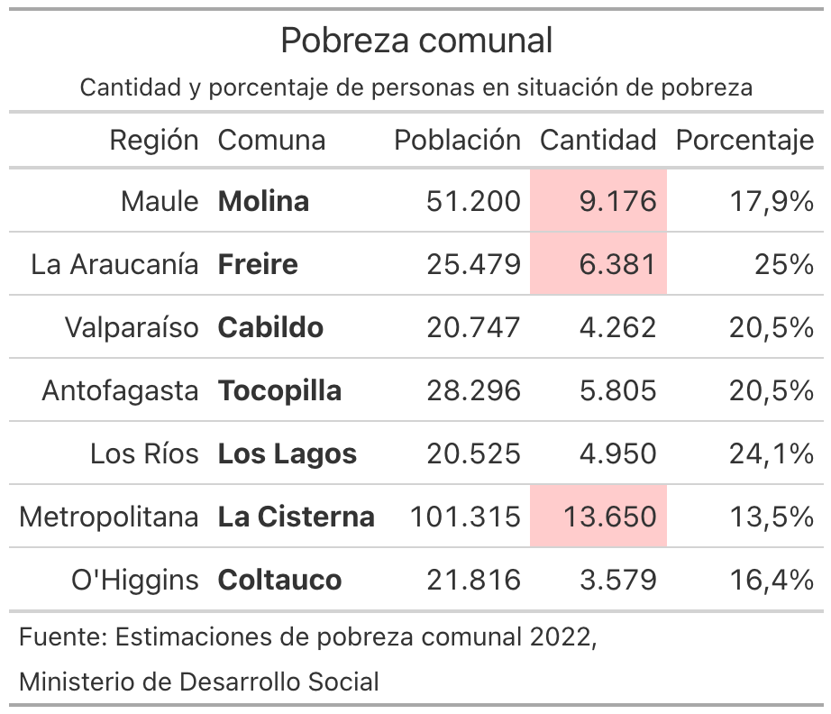
</div>

### Colorear columnas según su valor

Podemos hacer que una columna de una variable numérica exprese su valor a través de una **escala de colores**. Así resulta mucho más fácil guiar la atención a las diferencias en los valores de las observaciones, ya que podemos identificar valores bajos y altos de la misma variable siguiendo el degradado de colores.

La función `data_color()` aplica colorización de celdas en base a los valores de la variable indicada en el argumento `column`. Si las variables numérica, especificamos que el método sea `numeric`, y luego tenemos varios argumentos que podemos especificar para modificar la colorización. Los principales son `domain`, donde se especifica el rango de la escala de colores (es decir, el valor que corresponde con el color mínimo y el valor del color máximo), y la paleta en `palette`, qué puede hacer un vector de colores que van desde el valor más bajo el valor más alto; es decir, el color asignado a los valores más bajos de la variable, y los colores siguientes en el degradado. En este caso, queremos que las cifras bajas sean de color blanco (igual que el fondo del gráfico), y a medida que el valor sea más alto sean de un rojo intenso y luego un rojo oscuro. El color más alto (rojo oscuro) corresponde al valor `0.3` o 30%, dado que en el contexto de medición de pobreza consideramos que eso ya es una cifra suficientemente alarmante. Los valores que queden fuera de este rango de cero a 30% van a adquirir el color de los datos perdidos (`na_color`), de modo que todos los valores iguales o mayores a 0.3 van a ser del color más alto.

``` r
tabla_pobreza_6 <- tabla_pobreza_5 |> 
  data_color(columns = pobreza_p,
             method = "numeric", 
             domain = c(0, 0.3), na_color = "red4",
             palette = c("white", "red1", "red4"))
```

<div style="background-color:white;padding:12px;border-radius:5px;max-width:480px;">
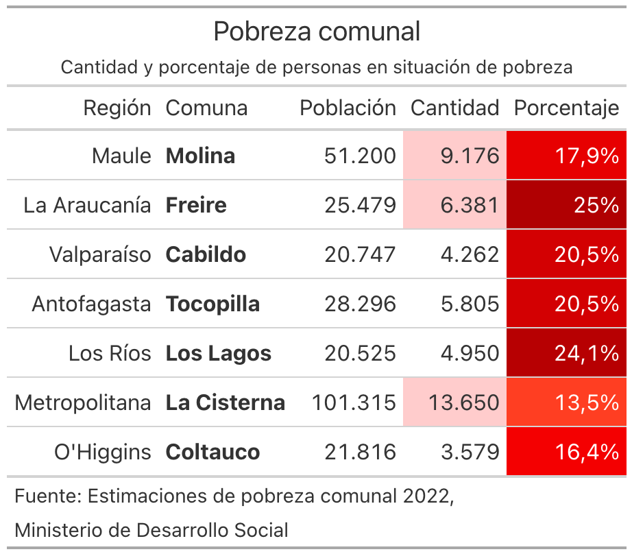
</div>

Gracias al degradado de colores a las celdas tenemos una tabla que comunica mucho más que la versión anterior, dado que guía la interpretación de los datos a una variable puntual.

### Estilo avanzado de tablas

Para finalizar con esta tabla, podemos personalizar con mayor detalle de todos los aspectos de la misma. En el bloque de código que viene a continuación, vamos a especificar múltiples modificaciones a la tabla:
- Cambiar el tamaño del texto de las celdas
- Usar una tipografía o tipo de letra distinto para la tabla, usando tipografías de Google, con las funciones `opt_table_font()` y [`google_font()`](https://fonts.google.com)
- Poner el subtítulo de la tabla en itálica con `tab_style()`
- Cambiar el color del texto de algunas columnas, ya que queremos que pasen a segundo plano, usando `tab_style()`
- Alinear los textos de título y subtítulo hacia el lado izquierdo, usando `tab_style()`
- Cambiar el color de fondo de los nombres de columnas, para crear una jerarquía en la tabla, usando `tab_style()`
- Eliminar las líneas de borde de la tabla con `opt_table_lines("none")`, para luego personalizar las líneas horizontales en `tab_options()`, poniéndolas de color blanco y ensanchándolas para que creen una separación entre filas
- Crear un espaciado entre el subtítulo con el resto de la tabla, al ensanchar la línea divisoria entre ambas, usando `tab_options()`
- Agregar un color de fondo alternante de las filas, para guiar la lectura, usando `opt_row_striping()`
- Cambiar el texto de la fuente en la parte de abajo de la tabla, y creamos un espaciado entre la fuente y la tabla ensanchando la línea divisoria entre ambas, usando `tab_style()` y `tab_options()`

``` r
tabla_pobreza_7 <- tabla_pobreza_6 |> 
  # texto de tabla más chico
  tab_style(style = cell_text(size = "small"),
            locations = list(cells_body(),
                             cells_column_labels())) |> 
  # tipografía
  opt_table_font(font = google_font(name = "Host Grotesk")) |> 
  # subtítulo en itálicas
  tab_style(style = cell_text(style = "italic"),
            locations = cells_title("subtitle")) |> 
  # texto de columna
  tab_style(style = cell_text("grey60"),
            locations = cells_body(columns = c(region, poblacion))) |> 
  # alineación de texto de titulares
  tab_style(style = cell_text(align = "left"),
            locations = cells_title()) |> 
  # color de fondo de títulos de columnas
  tab_style(style = cell_fill("grey92"),
            locations = cells_column_labels()) |> 
  # eliminar líneas por defecto
  opt_table_lines("none") |> 
  # espaciado entre filas
  tab_options(table_body.hlines.style = "solid",
              table_body.hlines.width = 2, 
              table_body.hlines.color = "white") |> 
  # espaciado entre subtítulo y tabla
  tab_options(heading.border.bottom.style = "solid",
              heading.border.bottom.color = "white",
              heading.border.bottom.width = 12,
              heading.padding = 0) |> 
  # filas con fondo alternante
  opt_row_striping() |> 
  # texto fuente
  tab_options(source_notes.font.size = "small", source_notes.padding = 0) |> 
  tab_style(style = cell_text(align = "right"), locations = cells_source_notes()) |> 
  # espaciado tabla y fuente
  tab_options(table_body.border.bottom.style = "solid",
              table_body.border.bottom.color = "white",
              table_body.border.bottom.width = 12)
```

<div style="background-color:white;padding:12px;border-radius:5px;max-width:480px;">
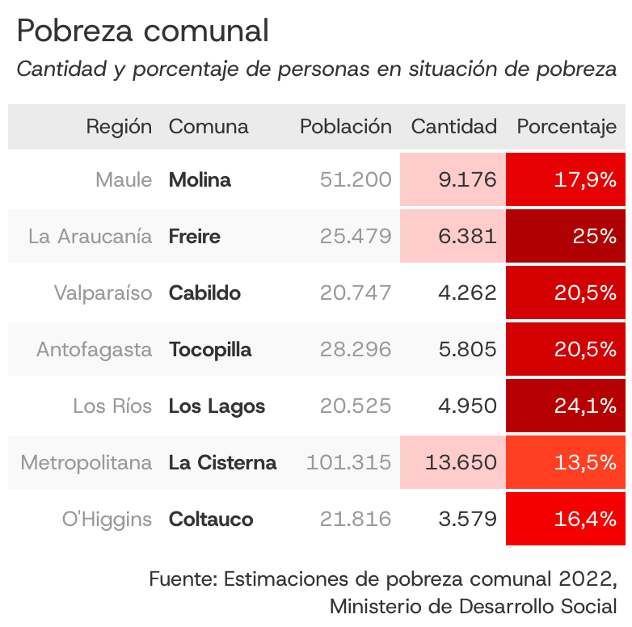
</div>

La tabla terminada tiene una apariencia mucho más personalizada y atractiva 🥰

------------------------------------------------------------------------

## Tabla de resultados electorales

En el segundo ejemplo, haremos una pequeña tabla que resuma resultados electorales. En esta tabla, el sector político al que pertenezcan los candidatos o candidatas tendrá un color específico, pero este color se aplicará a una columna distinta al sector político.

Los datos fueron obtenidos desde el sitio web del Servel por medio de web scraping. [El procesamiento de los datos y los datos originales se encuentran en este repositorio](https://github.com/bastianolea/servel_scraping_votaciones), pero para este ejemplo, cargaremos directamente el archivo que contiene todos los resultados oficiales, procesados y limpios.

``` r
library(dplyr)
library(tidyr)
library(forcats)
library(glue)
library(lubridate)
library(stringr)

# cargar datos remotamente desde el repositorio
datos_elecciones <- readr::read_csv2("https://raw.githubusercontent.com/bastianolea/servel_scraping_votaciones/refs/heads/main/datos/resultados_alcaldes_2024.csv")

datos_elecciones
```

    # A tibble: 1,922 × 11
       comuna    candidato         partido lista sector votos porcentaje total_votos
       <chr>     <chr>             <chr>   <chr> <chr>  <dbl>      <dbl>       <dbl>
     1 ALGARROBO Marco Antonio Go… RN      Z - … Derec…  4250     0.276        15405
     2 ALGARROBO Veronica Maricel… IND     CAND… Indep…  2905     0.189        15405
     3 ALGARROBO Marcela Maritza … IND     CAND… Indep…  2677     0.174        15405
     4 ALGARROBO Alejandro Felipe… IND     CAND… Indep…  2425     0.157        15405
     5 ALGARROBO Carlos Orlando T… IND     CAND… Indep…  1089     0.0707       15405
     6 ALGARROBO Maria Luisa Hami… IND     CAND… Indep…   365     0.0237       15405
     7 ALGARROBO Gaston Dubournai… IND     F - … Indep…   332     0.0216       15405
     8 ALGARROBO Nulo/Blanco       <NA>    <NA>  Otros   1362     0.0884       15405
     9 ALHUE     Marcela Chamorro… IND     H - … Izqui…  3490     0.598         5841
    10 ALHUE     Jose Andres Arel… IND     CAND… Indep…  1828     0.313         5841
    # ℹ 1,912 more rows
    # ℹ 3 more variables: mesas_escrutadas <dbl>, mesas_totales <dbl>,
    #   mesas_porcentaje <dbl>

Habiendo cargado los datos, filtramos por una comuna que nos interese, y ordenamos las columnas:
- Convertimos el sector político (variable `sector`) en un factor ordenado.
- Luego hacemos que la columna `candidato` también sea un factor cuyo orden depende del `porcentaje` obtenido.
- Llevamos los votos nulos a la última posición del factor de candidatos para que aparezcan al final.
- Ordenamos la tabla por el factor ordenado `candidato`.

``` r
comuna_elegida = "PEÑALOLEN"

tabla_elecciones_1 <- datos_elecciones |> 
  filter(comuna == comuna_elegida) |> 
  # ordenar sector político
  mutate(sector = as.factor(sector),
         sector = fct_relevel(sector, "Izquierda", "Derecha", "Independiente", "Otros")) |>
  # nulos al final de la tabla
  mutate(candidato = fct_reorder(candidato, porcentaje),
         candidato = fct_relevel(candidato, "Nulo/Blanco",after = 0)) |> 
  arrange(desc(candidato)) |>
  select(candidato, partido, votos, porcentaje, sector)

tabla_elecciones_1
```

    # A tibble: 5 × 5
      candidato                  partido votos porcentaje sector       
      <fct>                      <chr>   <dbl>      <dbl> <fct>        
    1 Miguel Andres Concha Manso FA      52293     0.317  Izquierda    
    2 Claudia Mora Vega          RN      52170     0.316  Derecha      
    3 Carlos Alarcon Castro      IND     31217     0.189  Independiente
    4 Eduardo Giesen Amtmann     IND      9321     0.0565 Independiente
    5 Nulo/Blanco                <NA>    19928     0.121  Otros        

Procedemos a crear la tabla básica con `{gt}`, incluyendo un subtítulo en formato *markdown* que contiene dentro de sí el nombre de la comuna elegida a partir del objeto que usamos para filtrar los datos en el paso anterior. El [texto *markdown*](https://quarto.org/docs/authoring/markdown-basics.html) permite darle estilo enriquecido al texto de forma sencilla usando símbolos, lo cual resulta conveniente para casos como éste.

``` r
library(gt)

tabla_elecciones_2 <- tabla_elecciones_1 |> 
  gt() |> 
  # titulares
  tab_header(title = md("_Resultados parciales:_ Elecciones Municipales 2024"),
             subtitle = md(glue("**{str_to_title(comuna_elegida)}**")))
```

<div style="background-color:white;padding:12px;border-radius:5px;max-width:480px;">
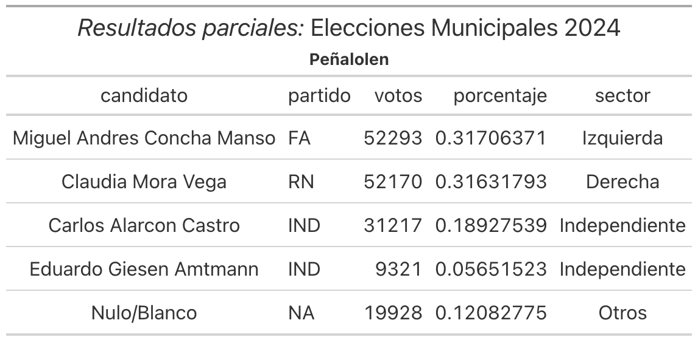
</div>

Aplicamos el formato de porcentaje a la columna de porcentaje, y el formato numérico a la columna numérica. Luego definimos algunos aspectos del estilo de la tabla, como fondos de color para algunas columnas, una [tipografía personalizada desde Google Fonts](https://fonts.google.com), alineaciones de textos, y estilos de textos distintos en los distintos elementos de la tabla.

``` r
tabla_elecciones_3 <- tabla_elecciones_2 |> 
  # formato de números
  fmt_percent(porcentaje, decimals = 1) |> 
  fmt_number(votos, 
             decimals = 0, sep_mark = ".", dec_mark = ",") |> 
  # estilo fondos de todas las celdas excepto partido
  tab_style(locations = cells_body(column = c(candidato, votos, porcentaje)),
            style = cell_fill(color = "grey96")) |> 
  # tipografía
  opt_table_font(font = google_font("Open Sans")) |>
  # alineación de textos
  cols_align(columns = c(candidato, partido, porcentaje), align = "left") |> 
  cols_align(columns = c(partido), align = "center") |> 
  cols_hide(sector) |>
  opt_table_lines("none") |>
  opt_align_table_header(align = "left") |> 
  # estilo de textos
  tab_style(locations = cells_body(column = c(candidato, partido, porcentaje)), 
            style = cell_text(weight = "bold")) |> 
  tab_style(locations = cells_column_labels(), 
            style = cell_text(style = "italic")) |> 
  tab_style(locations = cells_body(rows = candidato == "Nulo/Blanco"), 
            style = cell_text(weight = "normal")) |> 
  # etiquetas de columnas
  cols_label(candidato = "Candidato/a",
             partido = "Partido",
             votos = "Votos",
             porcentaje = "%")
```

<div style="background-color:white;padding:12px;border-radius:5px;max-width:480px;">
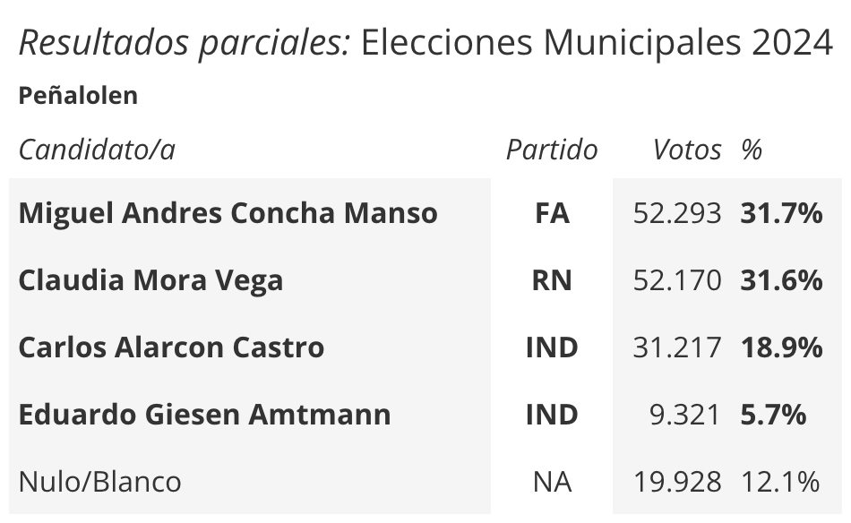
</div>

### Colorear celdas según una variable categórica o factor

Ahora viene lo entretenido. La tabla tiene una columna con una variable de partido político (`partido`), pero los datos contienen también una columna de `sector` político, que engloba a los partidos políticos. Vamos a asignar un color a las celdas del partido político dependiendo del sector político al que pertenecen; es decir, usar el contenido de una columna de la tabla para cambiar el estilo de *otra columna distinta* de la tabla.

Creamos una lista con los colores que queremos usar para la variable categórica `sector`, que representa el sector del espectro político al cual pueden pertenecer los partidos políticos.

``` r
color <- list("izquierda" = "#DB231D",
              "derecha" = "#1D76DB",
              "centro" = "#B16AD2", 
              "independiente" = "#38B51D", 
              "otros" = "grey50")

levels(tabla_elecciones_1$sector)
```

    [1] "Izquierda"     "Derecha"       "Independiente" "Otros"        

La función `data_color()`, que usamos anteriormente para dar color a variables numéricas en base a sus valores, también permite asignar colores a las variables en base a sus niveles, para el caso de variables categóricas o factores que contienen niveles o categorías de respuesta nominales u ordinales.

Para que esto funcione correctamente, es necesario que la variable esté en formato factor, lo cual hicimos en el primer paso de ordenar las columnas. La variable `sector` posee un determinado orden de sus niveles, que revisamos con la función `levels(tabla_elecciones_1$sector)`, Y en base al orden de estos niveles, especificamos los colores en la paleta, en el argumento `palette` de `data_color()`. Es en esta función donde especificamos que la información sale de la columna `sector`, pero afecta a la columna `partido`, y el efecto del color se aplica al texto, no al fondo (`apply_to = "text"`).

Una vez especificando esto, podemos repetir la misma operación pero aplicando el efecto al fondo (`apply_to = "fill"`) y dándole una transparencia de 20% (`alpha = 0.2`).

``` r
tabla_elecciones_4 <- tabla_elecciones_3 |> 
  # color texto partidos
  data_color(columns = sector,
             target_columns = partido,
             method = "factor",
             palette = c(color$izquierda, color$derecha, 
                         color$independiente, color$otros),
             apply_to = "text") |> 
  # color fondo partidos
  data_color(columns = sector,  rows = candidato != "Nulo/Blanco",
             target_columns = partido,
             method = "factor",
             palette = c(color$izquierda, color$derecha, 
                         color$independiente, color$otros),
             alpha = 0.2, 
             apply_to = "fill", 
             autocolor_text = FALSE)
```

<div style="background-color:white;padding:12px;border-radius:5px;max-width:480px;">
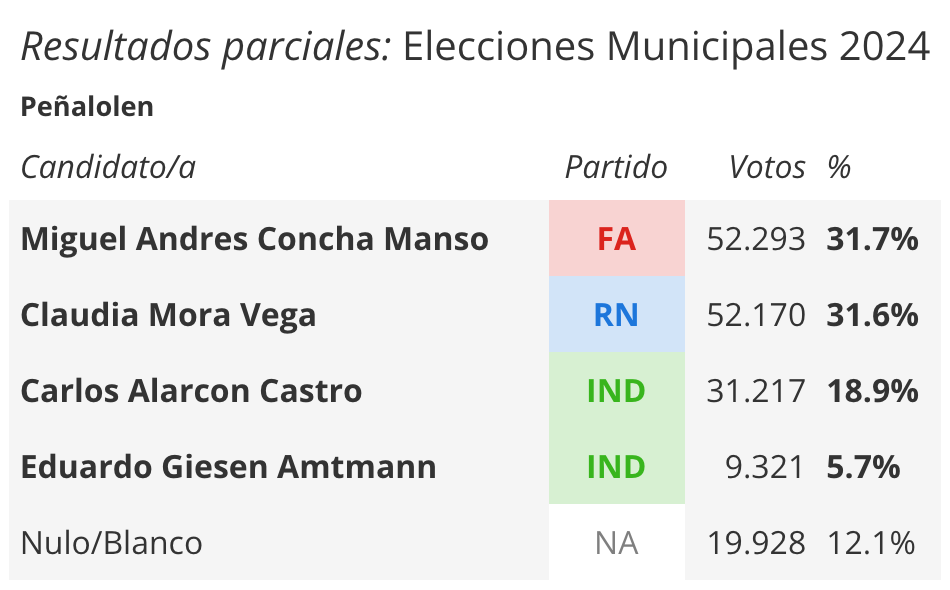
</div>

Repetir el efecto de colonización al texto y al fondo por separado nos permite darle un efecto más sofisticado al color de las celdas, donde el fondo de la celda tiene el mismo color que el texto, pero más suave.

Finalmente, aplicamos otras personalizaciones a la tabla, principalmente para crear un espacio entre las celdas y otros elementos de la tabla, y especificar el color de fondo y de texto de los votos nulos/blancos, que son menos relevantes.

``` r
tabla_elecciones_5 <- tabla_elecciones_4 |> 
  # color fondo nulos
  data_color(columns = sector, rows = candidato == "Nulo/Blanco",
             target_columns = partido,
             palette = "grey96",
             alpha = 1, apply_to = "fill", autocolor_text = FALSE) |> 
  # estilo fila nulos
  tab_style(locations = cells_body(rows = candidato == "Nulo/Blanco"), 
            style = cell_text(color = "grey70")) |> 
  # notas al pie
  tab_options(table_body.hlines.style = "solid", 
              table_body.hlines.width = 8, 
              table_body.hlines.color = "white",
              table_body.vlines.style = "solid", 
              table_body.vlines.width = 8, 
              table_body.vlines.color = "white") |> 
  tab_footnote(footnote = glue("Fuente: Servel")) |>
  tab_style(locations = cells_footnotes(), 
            style = cell_text(align = "right", size = px(12))) |> 
  tab_options(heading.subtitle.font.size = 19, heading.padding = 1, 
              heading.border.bottom.style = "solid", 
              heading.border.bottom.width = 16, 
              heading.border.bottom.color = "white") |> 
  tab_options(table_body.border.bottom.style = "solid", 
              table_body.border.bottom.width = 5, 
              table_body.border.bottom.color = "white",
              footnotes.padding = 1)
```

<div style="background-color:white;padding:12px;border-radius:5px;max-width:480px;">
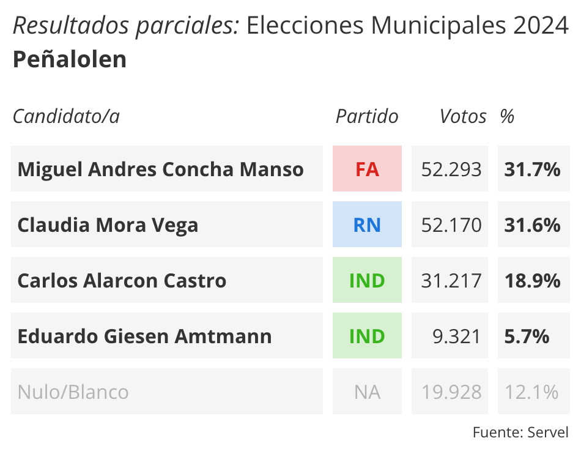
</div>

Obtenemos como resultado una tabla concisa pero a la vez informativa.

------------------------------------------------------------------------

## Tabla de Producto Interno Bruto regional

El tercer y último ejemplo será una tabla con datos regionales para un rango de varios años; es decir, una tabla con una alta cantidad de celdas numéricas en cuadrícula.

Los datos serán obtenidos directamente desde las [estadísticas del Banco Central de Chile](https://si3.bcentral.cl/siete/), utilizando web scraping, siguiendo el [trabajo previo que hice con estadísticas económicas](https://github.com/bastianolea/economia_chile) para un [visualizador interactivo de indicadores económicos](../../../apps/economia_chile/).

Cargamos el paquete `{rvest}`, especificamos la dirección web donde está ubicada la tabla que nos interesa, y hacemos web scraping de la tabla ubicada en esa página:

``` r
library(dplyr)
library(rvest)

# url con la tabla
url <- "https://si3.bcentral.cl/Siete/ES/Siete/Cuadro/CAP_ESTADIST_REGIONAL/MN_REGIONAL1/CCNN2018_PIB_REGIONAL_T?cbFechaInicio=2018&cbFechaTermino=2024&cbFrecuencia=ANNUAL&cbCalculo=NONE&cbFechaBase="

# abrir sesión y obtener código de fuente del sitio
sitio <- session(url) |> read_html()

# obtener la tabla del sitio, sin convertir unidades
tablas <- sitio |> html_table(convert = FALSE)

# limpieza mínima
tabla_pib <- tablas[[1]] |> 
  rename(region = 2) |> 
  select(-1)

tabla_pib
```

    # A tibble: 19 × 8
       region                       `2018` `2019` `2020` `2021` `2022` `2023` `2024`
       <chr>                        <chr>  <chr>  <chr>  <chr>  <chr>  <chr>  <chr> 
     1 Región de Arica y Parinacota 1.433  1.419  1.331  1.554  1.665  1.696  1.680 
     2 Región de Tarapacá           4.355  4.573  4.392  4.791  4.868  5.022  5.225 
     3 Región de Antofagasta        15.986 15.983 15.697 15.560 15.562 16.089 17.257
     4 Región de Atacama            3.687  3.528  3.540  3.958  3.991  4.036  4.081 
     5 Región de Coquimbo           5.876  5.956  5.658  6.169  6.126  6.311  6.395 
     6 Región de Valparaíso         13.989 13.948 13.087 14.406 15.258 15.288 15.551
     7 Región Metropolitana de San… 78.215 78.931 72.170 81.945 84.131 84.396 85.941
     8 Región del Libertador Gener… 7.930  7.882  7.589  8.310  8.328  8.211  8.686 
     9 Región del Maule             7.186  7.148  7.049  7.651  7.898  8.046  8.464 
    10 Región de Ñuble              2.775  2.786  2.693  3.016  3.121  3.066  3.176 
    11 Región del Biobío            11.337 11.499 10.865 11.864 12.202 12.917 13.241
    12 Región de La Araucanía       5.241  5.325  5.075  5.708  5.956  6.072  6.255 
    13 Región de Los Ríos           2.498  2.503  2.403  2.639  2.709  2.706  2.821 
    14 Región de Los Lagos          6.422  6.563  6.225  6.722  6.957  7.047  7.156 
    15 Región de Aysén del General… 1.228  1.243  1.138  1.176  1.198  1.297  1.294 
    16 Región de Magallanes y de l… 1.843  1.934  1.689  1.813  1.912  1.943  2.052 
    17 Subtotal regionalizado       170.0… 171.2… 160.6… 176.9… 181.3… 183.7… 189.1…
    18 Extrarregional               19.435 19.415 18.320 22.270 22.219 20.702 20.737
    19 Producto Interno Bruto       189.4… 190.6… 178.9… 199.1… 203.4… 204.5… 209.9…

Nos encontramos con una tabla que tiene 19 filas y seis columnas numéricas, correspondientes a los valores del Producto Interno Bruto para cada uno de los años. Procedemos a limpiar estos datos, debido a que la tabla usa puntos como divisores de miles, y esto hace que R interprete los números como si fueran decimales. Usamos `stringr::str_remove()` para eliminar todos los puntos en todas las columnas que empiecen con `20` (los años), y luego las convertimos a numéricas.

``` r
library(stringr)
library(forcats)

pib_regional <- tabla_pib |> 
  mutate(across(starts_with("20"), ~str_remove(.x, "\\."))) |> 
  mutate(across(starts_with("20"), as.numeric)) |> 
  filter(str_detect(region, "Región"))

pib_regional
```

    # A tibble: 16 × 8
       region                       `2018` `2019` `2020` `2021` `2022` `2023` `2024`
       <chr>                         <dbl>  <dbl>  <dbl>  <dbl>  <dbl>  <dbl>  <dbl>
     1 Región de Arica y Parinacota   1433   1419   1331   1554   1665   1696   1680
     2 Región de Tarapacá             4355   4573   4392   4791   4868   5022   5225
     3 Región de Antofagasta         15986  15983  15697  15560  15562  16089  17257
     4 Región de Atacama              3687   3528   3540   3958   3991   4036   4081
     5 Región de Coquimbo             5876   5956   5658   6169   6126   6311   6395
     6 Región de Valparaíso          13989  13948  13087  14406  15258  15288  15551
     7 Región Metropolitana de San…  78215  78931  72170  81945  84131  84396  85941
     8 Región del Libertador Gener…   7930   7882   7589   8310   8328   8211   8686
     9 Región del Maule               7186   7148   7049   7651   7898   8046   8464
    10 Región de Ñuble                2775   2786   2693   3016   3121   3066   3176
    11 Región del Biobío             11337  11499  10865  11864  12202  12917  13241
    12 Región de La Araucanía         5241   5325   5075   5708   5956   6072   6255
    13 Región de Los Ríos             2498   2503   2403   2639   2709   2706   2821
    14 Región de Los Lagos            6422   6563   6225   6722   6957   7047   7156
    15 Región de Aysén del General…   1228   1243   1138   1176   1198   1297   1294
    16 Región de Magallanes y de l…   1843   1934   1689   1813   1912   1943   2052

Ahora podemos crear nuestra tabla básica con `{gt}`, especificando el formato apropiado para todas las columnas numéricas en una sola instancia `fmt_number()`. Esto es posible porque podemos usar selectores de `{dplyr}` en los argumentos de columnas de `{gt}`, así que podemos pedirle que aplique un formato, estilo, u otras herramientas de `{gt}` a una o varias columnas seleccionadas por su nombre parcial o por su tipo de datos. En este caso, aplicamos el formato a todas las columnas numéricas usando `where(is.numeric)`:

``` r
library(gt)

tabla_pib_regional_1 <- pib_regional |> 
  gt() |> 
  cols_align("right", region) |> 
  # formato de columnas numéricas
  fmt_number(columns = where(is.numeric), 
             sep_mark = ".", decimals = 0)
```

<div style="background-color:white;padding:12px;border-radius:5px;max-width:480px;">
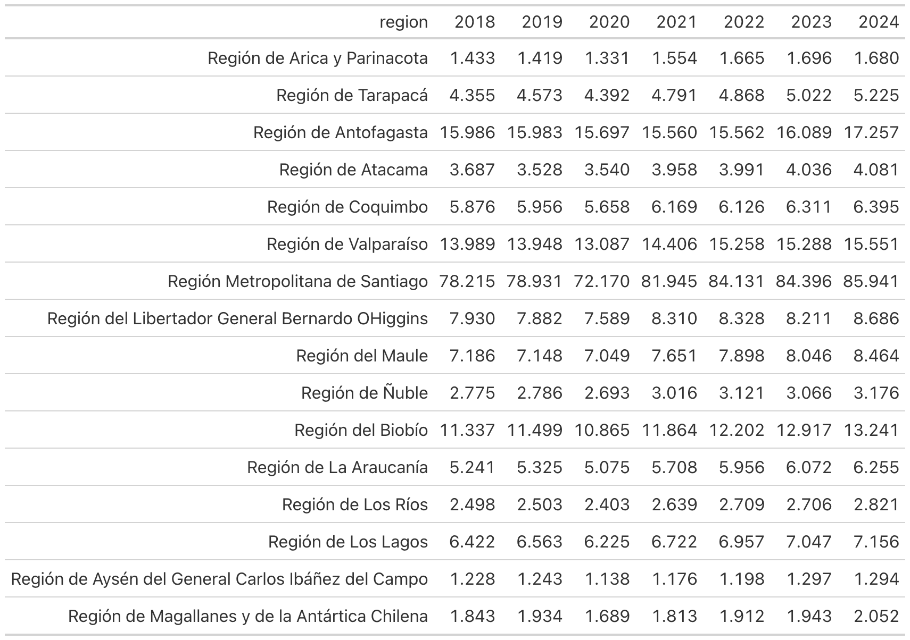
</div>

Con una sola línea formateamos seis columnas. Yey! 🥳

### Cálculo de diferencia porcentual entre años

Luego producir esta tabla, vamos a realizar una transformación en los datos para poder calcular la variación anual, entendida como la diferencia porcentual entre un año y el anterior. Para realizar este cálculo, lo más conveniente es transformar los datos a formato largo; es decir, una fila por observación, y una variable por columna. Usamos `pivot_longer()` para transformar las seis columnas que teníamos de datos numéricos por año, en una sola columna de datos numéricos, y otra columna que contengan los años a los que corresponde cada observación.

``` r
library(tidyr)

pib_regional_long <- pib_regional |> 
  pivot_longer(cols = where(is.numeric),
               names_to = "año",
               values_to = "valor")
```

Ahora, es muy sencillo calcular la variación porcentual entre una observación y otra: agrupamos los datos por región, y calculamos cada valor dividido por el valor anterior (la celda de arriba, obtenida con `lag()`):

``` r
pib_regional_cambio <- pib_regional_long |> 
  # ordenar observaciones
  arrange(region, año) |>
  group_by(region) |> 
  # calcular cambio
  mutate(cambio = valor/lag(valor),
         cambio = 1 - cambio) |> 
  ungroup() |> 
  filter(!is.na(cambio))

pib_regional_cambio
```

    # A tibble: 96 × 4
       region                           año   valor    cambio
       <chr>                            <chr> <dbl>     <dbl>
     1 Región Metropolitana de Santiago 2019  78931 -0.00915 
     2 Región Metropolitana de Santiago 2020  72170  0.0857  
     3 Región Metropolitana de Santiago 2021  81945 -0.135   
     4 Región Metropolitana de Santiago 2022  84131 -0.0267  
     5 Región Metropolitana de Santiago 2023  84396 -0.00315 
     6 Región Metropolitana de Santiago 2024  85941 -0.0183  
     7 Región de Antofagasta            2019  15983  0.000188
     8 Región de Antofagasta            2020  15697  0.0179  
     9 Región de Antofagasta            2021  15560  0.00873 
    10 Región de Antofagasta            2022  15562 -0.000129
    # ℹ 86 more rows

Con nuestra nueva variable `cambio` calculada, ahora volvemos a transformar los datos para que estén en el formato *ancho*; es decir, nuevamente cada celda ubicada en una columna distinta dependiendo del año al cual corresponde. Así, volvemos a obtener seis columnas de datos numéricos, una para cada año, pero esta vez con la diferencia porcentual de los valores en vez del valor absoluto.

``` r
pib_regional_cambio_wide <- pib_regional_cambio |> 
  select(region, año, cambio) |> 
  pivot_wider(names_from = año, values_from = cambio)

pib_regional_cambio_wide
```

    # A tibble: 16 × 7
       region                    `2019`   `2020`   `2021`   `2022`   `2023`   `2024`
       <chr>                      <dbl>    <dbl>    <dbl>    <dbl>    <dbl>    <dbl>
     1 Región Metropolitana d… -9.15e-3  0.0857  -0.135   -2.67e-2 -0.00315 -0.0183 
     2 Región de Antofagasta    1.88e-4  0.0179   0.00873 -1.29e-4 -0.0339  -0.0726 
     3 Región de Arica y Pari…  9.77e-3  0.0620  -0.168   -7.14e-2 -0.0186   0.00943
     4 Región de Atacama        4.31e-2 -0.00340 -0.118   -8.34e-3 -0.0113  -0.0111 
     5 Región de Aysén del Ge… -1.22e-2  0.0845  -0.0334  -1.87e-2 -0.0826   0.00231
     6 Región de Coquimbo      -1.36e-2  0.0500  -0.0903   6.97e-3 -0.0302  -0.0133 
     7 Región de La Araucanía  -1.60e-2  0.0469  -0.125   -4.34e-2 -0.0195  -0.0301 
     8 Región de Los Lagos     -2.20e-2  0.0515  -0.0798  -3.50e-2 -0.0129  -0.0155 
     9 Región de Los Ríos      -2.00e-3  0.0400  -0.0982  -2.65e-2  0.00111 -0.0425 
    10 Región de Magallanes y… -4.94e-2  0.127   -0.0734  -5.46e-2 -0.0162  -0.0561 
    11 Región de Tarapacá      -5.01e-2  0.0396  -0.0908  -1.61e-2 -0.0316  -0.0404 
    12 Región de Valparaíso     2.93e-3  0.0617  -0.101   -5.91e-2 -0.00197 -0.0172 
    13 Región de Ñuble         -3.96e-3  0.0334  -0.120   -3.48e-2  0.0176  -0.0359 
    14 Región del Biobío       -1.43e-2  0.0551  -0.0919  -2.85e-2 -0.0586  -0.0251 
    15 Región del Libertador …  6.05e-3  0.0372  -0.0950  -2.17e-3  0.0140  -0.0578 
    16 Región del Maule         5.29e-3  0.0139  -0.0854  -3.23e-2 -0.0187  -0.0520 

Generamos una nueva tabla `{gt}` con las diferencias porcentuales entre años, especificando que estas columnas numéricas ahora son porcentajes:

``` r
tabla_pib_regional_2 <- pib_regional_cambio_wide |> 
  gt() |> 
  cols_align("right", region) |> 
  fmt_percent(where(is.numeric),
              decimals = 1, dec_mark = ",") |> 
  cols_label(region = "Región")
```

<div style="background-color:white;padding:12px;border-radius:5px;max-width:480px;">
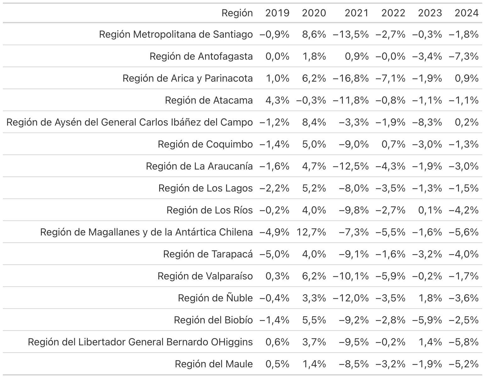
</div>

### Colorear múltiples columnas simultáneamente

Ahora que tenemos una cuadrícula de valores numéricos en nuestra tabla, resulta conveniente aplicar color a cada celda dependiendo de su valor. Esto permite una interpretación más rápida de una gran cantidad de datos, debido a que seguía la vista hacia los valores anómalos o destacables, Y se facilita la interpretación de patrones generales en los datos a partir del color.

Usamos la función `data_color()` para colorizar las columnas, aprovechando las selección de columnas con la función `where(is.numeric)` para aplicar el color a todas las columnas numéricas de una sola vez. Usaremos la paleta [viridis](https://github.com/sjmgarnier/viridis), que facilita la interpretación de diferencia en los datos, y además es inclusiva para personas daltónicas.

``` r
tabla_pib_regional_3 <- tabla_pib_regional_2 |> 
  data_color(where(is.numeric), 
             method = "numeric",
             palette = "viridis")
```

<div style="background-color:white;padding:12px;border-radius:5px;max-width:480px;">
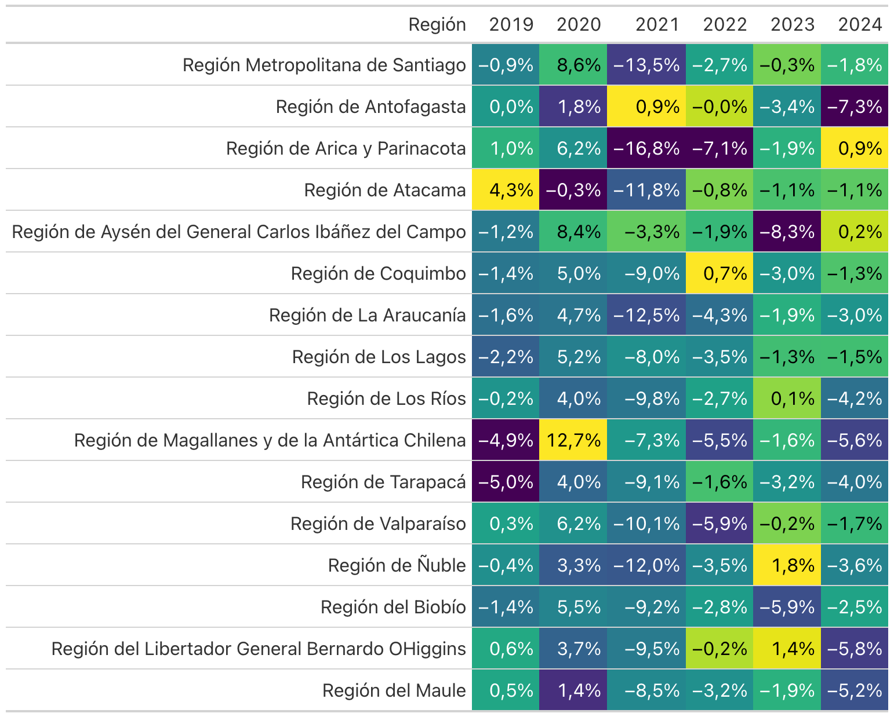
</div>

Otra opción es especificar que los colores se apliquen solamente al texto, para generar una tabla más liviana a la vista. Especificamos una paleta básica que va de rojo a verde pasando por negro. Usamos el método `bin` para segmentar los colores en rangos discretos, en vez de usar un degradado de colores, para facilitar la interpretación. Los rangos para cada uno de los colores se establece en el argumento `bins`, donde definimos que el color rojo se va aplicar a valores hasta -2%, luego negro del -2% al 2%, y de ahí en adelante verde.

``` r
tabla_pib_regional_4 <- tabla_pib_regional_2 |> 
  data_color(where(is.numeric), 
             method = "bin",
             apply_to = "text",
             palette = c("#bf2f2f", "black", "#279f2b"),
             bins = c(-Inf, -0.02, 0.02, Inf))
```

<div style="background-color:white;padding:12px;border-radius:5px;max-width:480px;">
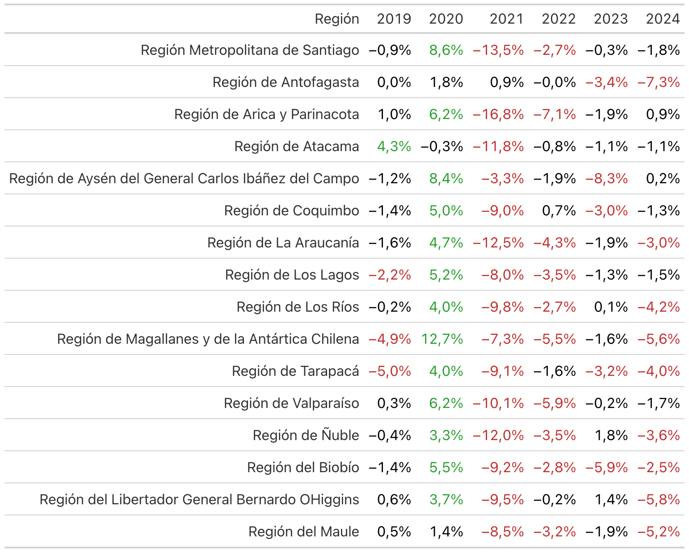
</div>

Usamos categorías de colores en vez de degradados para facilitar la interpretación, debido a que los degradados tendrían demasiados valores de color en una cuadrícula que ya es suficientemente compleja, dificultando que las personas asocian rápidamente diferentes sombras de rojo o de verde a interpretaciones significativas. En lugar de eso, simplificamos la interpretación al solamente colorear valores negativos y positivos, y mantener un rango de valores dentro de la normalidad que carecen de un color distintivo (negro).

Finalmente, aplicamos más personalizaciones de estilo a la tabla para que resulte más atractiva:
- Limitar el ancho de la primera columna con `cols_width()`
- Aplicar negritas a los nombres de variables e itálicas a la primera columna con `tab_style()`
- Eliminar las líneas horizontales de arriba y abajo de la tabla
- Disminuir el espaciado interior de las celdas para aumentar la densidad de información con `tab_options(data_row.padding = px(6))`

``` r
tabla_pib_regional_5 <- tabla_pib_regional_4 |> 
  # ancho máximo de columna región
  cols_width(region ~ px(220)) |> 
  # filas alternas
  opt_row_striping() |> 
  # estilo de columnas
  tab_style(style = cell_text(weight = "bold"),
            locations = cells_column_labels()) |> 
  tab_style(style = cell_text(style = "italic"),
            locations = cells_body(columns = region)) |> 
  # eliminar líneas horizontales de arriba y abajo
  tab_options(table.border.top.style = "hidden",
              table.border.bottom.style = "hidden") |> 
  # cambiar el espaciado interno de las celdas
  tab_options(data_row.padding = px(6)) |>
  # título y fuentes
  tab_header(title = "Producto Interno Bruto regional",
             subtitle = "Variación anual, por regiones") |> 
  tab_source_note("Fuente: Banco Central de Chile")
```

<div style="background-color:white;padding:12px;border-radius:5px;max-width:480px;">
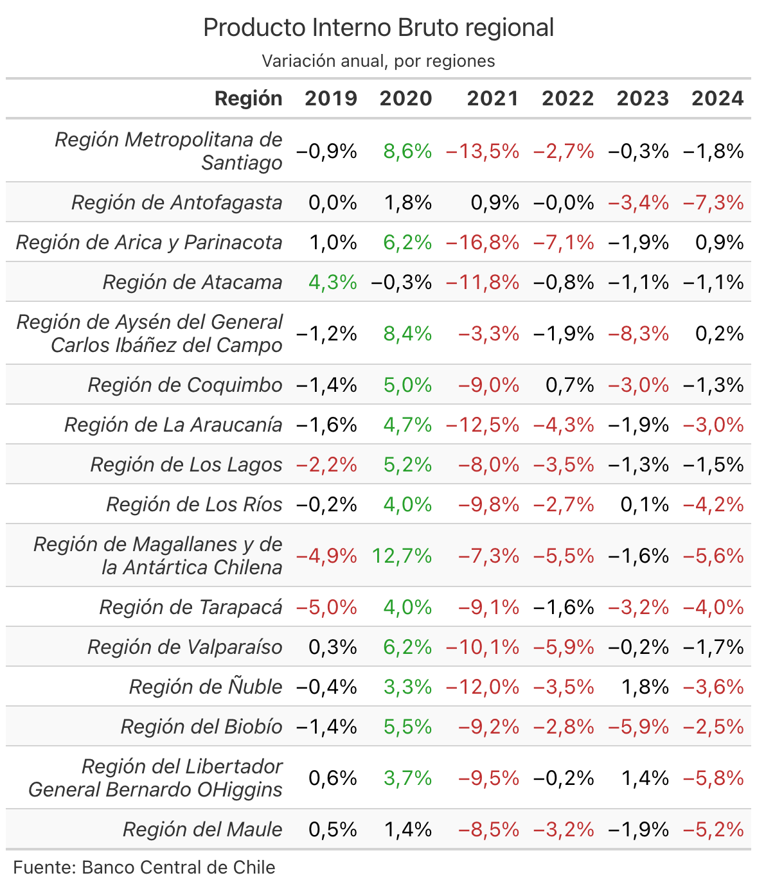
</div>

### Estilo condicional a través de varias columnas

Ahora nos ubicaremos en un caso de uso más complejo. Queremos destacar los valores más extremos de la tabla a partir de una condicional: si los valores de las celdas son menores a -3%, queremos que el texto esté en negritas. Como ejemplo, aplicaremos esto a una sola columna, dejando las demás en gris para que se note el cambio:

``` r
# una columna
tabla_pib_regional_5a <- tabla_pib_regional_5 |> 
  tab_style(style = cell_text(color = "grey70"),
            locations = cells_body(columns = `2019`:`2022`)) |>
  tab_style(style = cell_text(weight = "bold"),
            locations = cells_body(columns = `2023`,
                                   rows = `2023` < -0.03))
```

<div style="background-color:white;padding:12px;border-radius:5px;max-width:480px;">
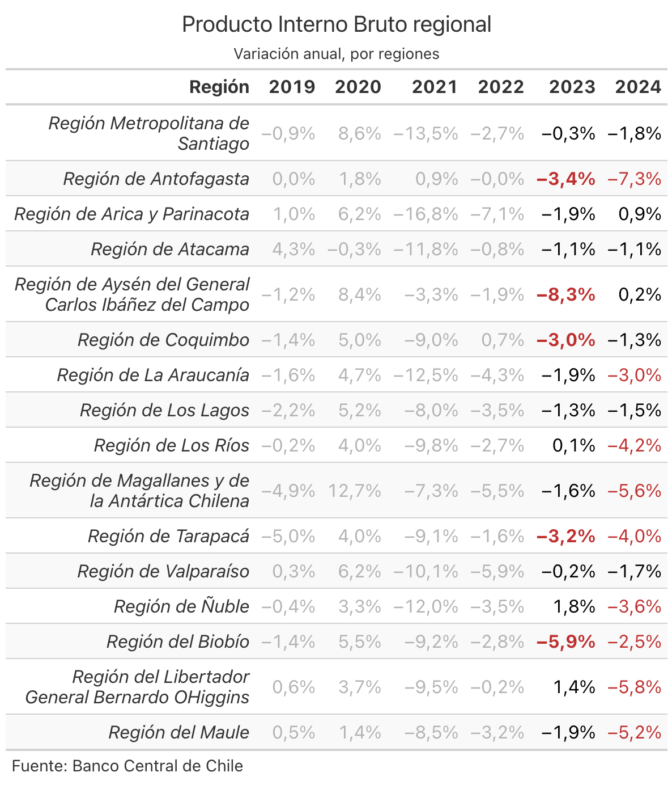
</div>

Si bien esto funciona, el problema que vamos a tener radica en que cada especificación de las columnas a las que va a aplicar el estilo dependen también de la evaluación de la condicional en la misma columna. En el fondo, que un valor adquiera o no el estilo depende de si está en la columna, y si la fila de *esa misma* columna cumple con la condición establecida. Entonces, si queremos aplicar lo mismo a otra columna, habría que modificar tanto la columna como la condición, porque la condición depende también de la columna.

Entonces, ¿qué hacer si queremos aplicar lo mismo a más de una columna? Podemos repetir el llamado de `tab_style()` para cada uno de los años, o bien, podemos hacer un solo llamado a `tab_style()`, pero especificando más de una combinación de columna/fila en `locations` al mismo tiempo:

``` r
# dos columnas
tabla_pib_regional_5b <- tabla_pib_regional_5 |> 
  tab_style(style = cell_text(color = "grey70"),
            locations = cells_body(columns = `2019`:`2021`)) |>
  tab_style(style = cell_text(weight = "bold"),
            locations = list(cells_body(columns = `2022`,
                                        rows = `2022` < -0.03),
                             cells_body(columns = `2023`,
                                        rows = `2023` < -0.03))
  )
```

<div style="background-color:white;padding:12px;border-radius:5px;max-width:480px;">
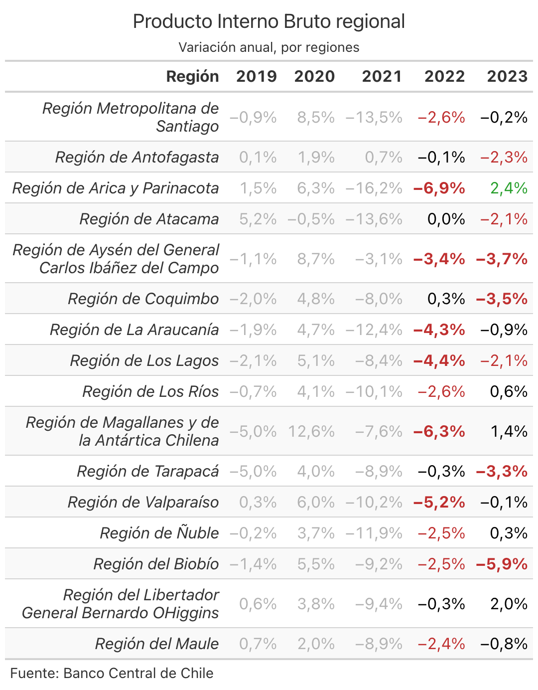
</div>

Esto funciona porque se puede entregar a `locations` una lista con múltiples funciones que especifiquen el lugar en la tabla en que se quiere aplicar el estilo.

Sin embargo, esta solución se volvería extremadamente repetitiva si queremos aplicarlo a seis columnas o más. Habría que escribir manualmente la especificación de `cells_body()` para cada una de las combinaciones de años y filas.

A continuación comparto una solución a este problema que involucra una iteración sobre los nombres de las columnas usando `purrr::map()`. La idea es que, si el argumento `locations` acepta múltiples columnas por medio de una lista (como hicimos en el paso anterior), podemos usar `map()` para especificar una sola vez la columna y la condición, y multiplicarla por todas las columnas que necesitemos.

Lo que estamos haciendo es una lista con múltiples instancias de `cells_body()`, una para cada elemento en el vector `columnas`. Dentro de `cells_body()` se usa la sintaxis `!!sym()` para transformar el nombre de una columna escrito como texto a un *símbolo*, para poder hacer la comparación apropiadamente (porque no se puede hacer `"1" < 0`, tiene que ser `1 < 0`).

``` r
# múltiples columnas con filas condicionales

# obtener nombres de columas a las que queremos aplicar el estilo
columnas <- pib_regional_cambio_wide |> 
  select(where(is.numeric)) |> 
  names()

tabla_pib_regional_5c <- tabla_pib_regional_5 |> 
  tab_style(style = cell_text(weight = "bold"),
            # aplicar el estilo a todas las columnas, iterando la función cells_body por los nombres de columnas
            locations = purrr::map(columnas, 
                                   ~cells_body(
                                     columns = .x,
                                     rows = !!sym(.x) < -0.03)
                                   )
  )
```

<div style="background-color:white;padding:12px;border-radius:5px;max-width:480px;">
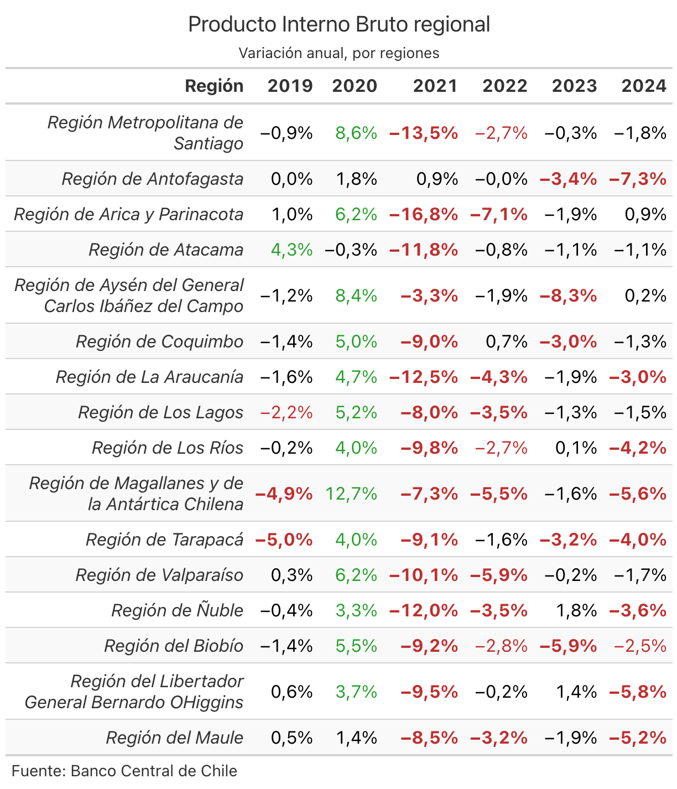
</div>

De esta forma, usamos un poco de magia de iteraciones con `{purrr}` y sintaxis avanzada de R con `{rlang}` para poder aplicar un formato condicional a múltiples columnas de una tabla.

------------------------------------------------------------------------

## Otros recursos para tablas `{gt}`

-   Documentación oficial: https://gt.rstudio.com
-   https://themockup.blog/static/resources/gt-cookbook.html#table-customization
-   https://gt.albert-rapp.de

------------------------------------------------------------------------

Si este tutorial te sirvió, por favor considera hacerme una pequeña donación para poder tomarme un cafecito mientras escribo el siguiente tutorial 🥺



