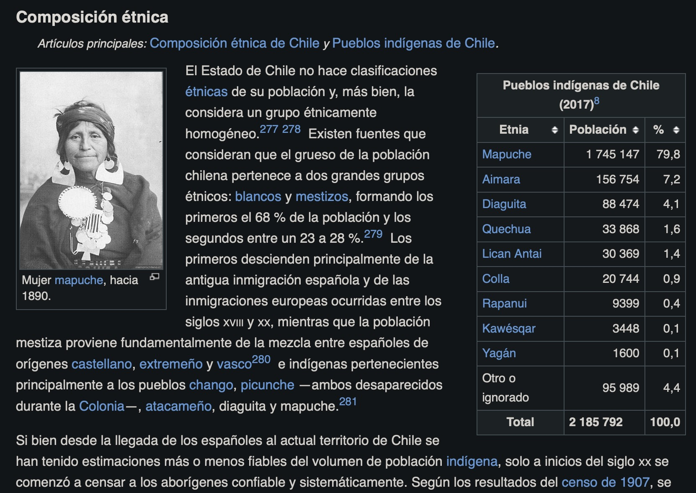
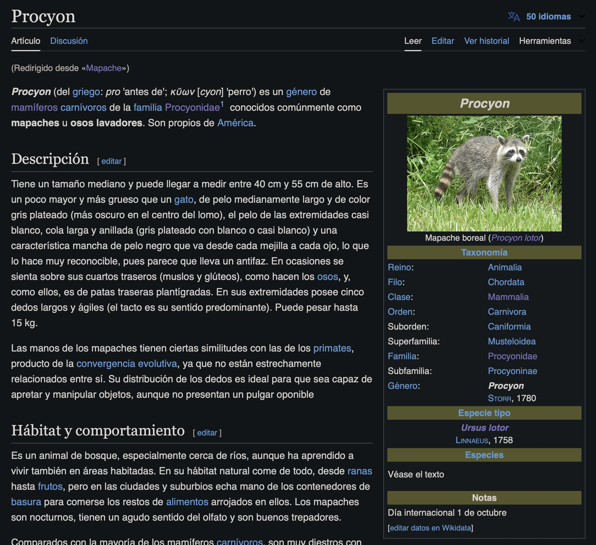
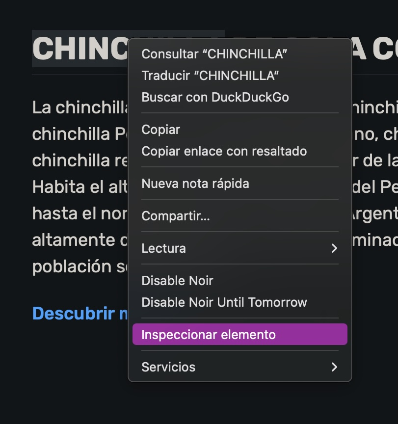
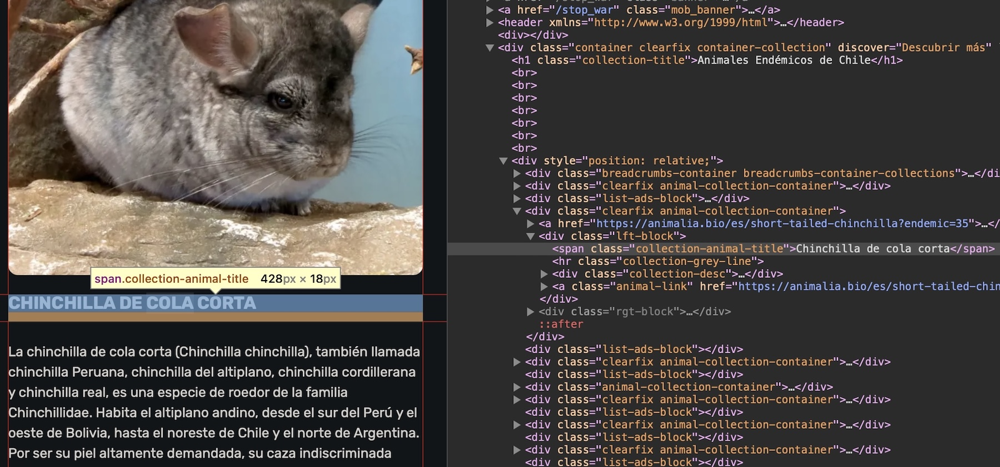
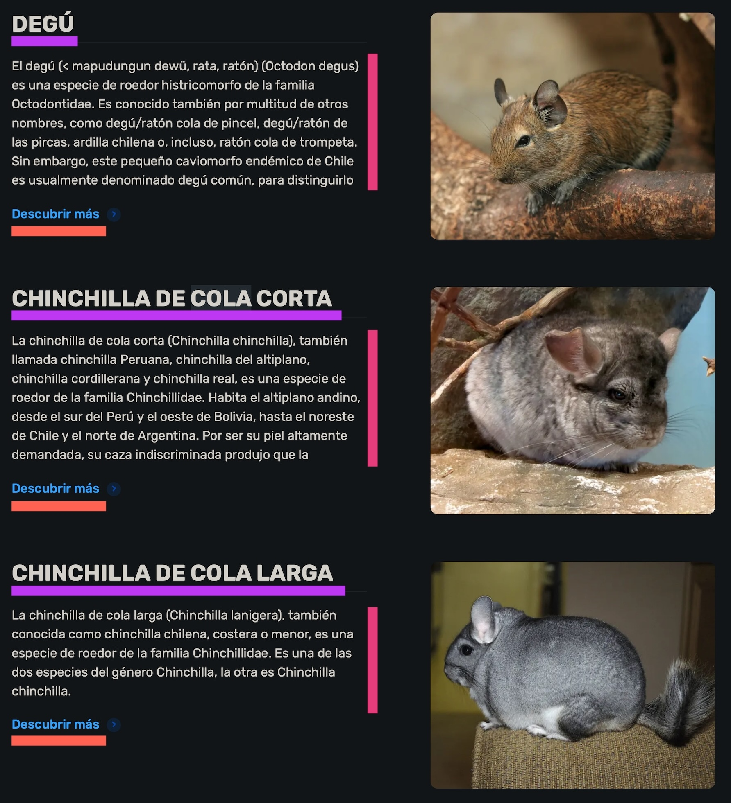

Se denomina web scraping a un conjunto de técnicas usadas para **obtener datos desde páginas web**. Esto significa poder transformar la información que vemos en distintos sitios de internet en datos que podamos utilizar.

Se usa el web scraping cuando un sitio web presenta información, cifras, datos, números, o cualquier otro elemento que nos pueda servir, pero sin facilitar acceso a los datos, como sería un enlace de descarga, una API para obtener los datos, o alguna forma de exportar la información. En estos casos tenemos que recurrir al scraping para transformar lo que vemos en la web en datos analizables.

En este tutorial aprenderemos a hacer web scraping en R para **extraer cualquier información que veamos en un sitio web**, y traerla a nuestro entorno de R para poder procesarla como deseemos.

## Web scraping con {rvest}

La primera opción a la hora de hacer web scraping de sitios web con R es [el paquete {rvest}](https://rvest.tidyverse.org) (*harvest,* o *cosechar* en español). Este paquete, parte del [Tidyverse](https://www.tidyverse.org/), suele ser la opción más sencilla, más popular y mejor documentada para extraer datos desde sitios web estáticos en R.

``` r
# install.packages("rvest")
library(rvest)
```

Existen otros paquetes para el web scraping, como [{RSelenium}](https://docs.ropensci.org/RSelenium/index.html), que se caracteriza por permitirnos obtener datos desde sitios web dinámicos, pero a su vez es menos intuitivo y más difícil de configurar, lo que hace que sea necesario explicarlo en un tutorial aparte.

### Extraer tablas desde un sitio web

Como primer paso, extraeremos los datos de una tabla alojada en internet. Cuando las tablas están formateadas apropiadamente, como las tablas que podemos encontrar en Wikipedia, extraerlas resulta muy sencillo.

El primer paso es definir la dirección del sitio que queremos scrapear, y luego usamos dos funciones para obtener el código de fuente de este sitio: la función `session()`, que nos permite conectarnos al sitio web creando una *sesión*, y luego la función `read_html()`, que descargará el código del sitio y nos permitirá extraer información desde el mismo.

``` r
url <- "https://es.wikipedia.org/wiki/Chile"

sitio_chile <- session(url) |> 
  read_html()

sitio_chile
```

    {html_document}
    <html class="client-nojs vector-feature-language-in-header-enabled vector-feature-language-in-main-page-header-disabled vector-feature-sticky-header-disabled vector-feature-page-tools-pinned-disabled vector-feature-toc-pinned-clientpref-1 vector-feature-main-menu-pinned-disabled vector-feature-limited-width-clientpref-1 vector-feature-limited-width-content-enabled vector-feature-custom-font-size-clientpref-1 vector-feature-appearance-pinned-clientpref-1 vector-feature-night-mode-enabled skin-theme-clientpref-day vector-toc-available" lang="es" dir="ltr">
    [1] <head>\n<meta http-equiv="Content-Type" content="text/html; charset=UTF-8 ...
    [2] <body class="skin--responsive skin-vector skin-vector-search-vue mediawik ...

El objeto resultante es un documento HTML del cual podremos extraer los elementos del sitio que nos interesen.

Intentemos extraer la tabla del sitio que posee datos sobre población indígena en el país:



Para extraer las tablas de este sitio, usamos la función `html_table()`. Las funciones que extraen elementos de los sitios empiezan con `html`.

``` r
tablas <- sitio_chile |> 
  html_table()
```

El resultado de esta extracción va a ser una lista. En R, una lista es un tipo de objeto que dentro de sí puede contener múltiples elementos de distinto tipo, forma, o tamaño. En este caso, esta lista contiene todas las tablas que habían en la página. Entonces, tenemos que elegir la tabla que nos interesa analizar.

En este caso, nos interesa la octava tabla, que contiene información sobre pueblos indígenas en Chile, por lo que la extraemos de la lista:

``` r
# extraer tabla de la lista
tabla_1 <- tablas[[8]]

tabla_1
```

    # A tibble: 12 × 3
       Pueblos indígenas de Chile (2…¹ Pueblos indígenas de…² Pueblos indígenas de…³
       <chr>                           <chr>                  <chr>                 
     1 Etnia                           Población              %                     
     2 Mapuche                         1 745 147              79,8                  
     3 Aimara                          156 754                7,2                   
     4 Diaguita                        88 474                 4,1                   
     5 Quechua                         33 868                 1,6                   
     6 Lican Antai                     30 369                 1,4                   
     7 Colla                           20 744                 0,9                   
     8 Rapanui                         9399                   0,4                   
     9 Kawésqar                        3448                   0,1                   
    10 Yagán                           1600                   0,1                   
    11 Otro o ignorado                 95 989                 4,4                   
    12 Total                           2 185 792              100,0                 
    # ℹ abbreviated names: ¹​`Pueblos indígenas de Chile (2017)[8]​`,
    #   ²​`Pueblos indígenas de Chile (2017)[8]​`,
    #   ³​`Pueblos indígenas de Chile (2017)[8]​`

``` r
# limpiar datos de la tabla
library(dplyr)
```


    Attaching package: 'dplyr'

    The following objects are masked from 'package:stats':

        filter, lag

    The following objects are masked from 'package:base':

        intersect, setdiff, setequal, union

``` r
# renombrar columnas
tabla_1a <- tabla_1 |> 
  janitor::row_to_names(1) |> 
  janitor::clean_names()

# convertir variables a numéricas
tabla_1b <- tabla_1a |> 
  # remover espacios
  mutate(poblacion = stringr::str_remove_all(poblacion, "\\s+")) |>  
  # reemplazar comas por puntos
  mutate(percent = stringr::str_replace(percent, ",", ".")) |> 
  # convertir a numéricas
  mutate(across(c(poblacion, percent), as.numeric))

tabla_1b
```

    # A tibble: 11 × 3
       etnia           poblacion percent
       <chr>               <dbl>   <dbl>
     1 Mapuche           1745147    79.8
     2 Aimara             156754     7.2
     3 Diaguita            88474     4.1
     4 Quechua             33868     1.6
     5 Lican Antai         30369     1.4
     6 Colla               20744     0.9
     7 Rapanui              9399     0.4
     8 Kawésqar             3448     0.1
     9 Yagán                1600     0.1
    10 Otro o ignorado     95989     4.4
    11 Total             2185792   100  

¡Listo! Extrajimos datos desde una tabla de Wikipedia, y ahora podemos usarlos para lo que necesitemos.

### Extraer datos de un sitio usando etiquetas

Para scrapear elementos puntuales de un sitio, necesitamos identificarlos, y así extraer solamente lo que nos interesa. Cada elemento en un sitio web, ya sea texto, tablas o imágenes, se crea a partir de [etiquetas HTML](https://developer.mozilla.org/es/docs/Web/HTML/Element). Si identificamos las etiquetas HTML de los datos que necesitamos, podemos usarlas para extraerlos.

Probemos con otra página de Wikipedia:



``` r
url <- "https://es.wikipedia.org/wiki/Mapache"

sitio_mapache <- session(url) |> 
  read_html()
```

Para extraer elementos de un sitio, usamos la función `html_elements()`, cuyo argumento será el identificador del elemento que queremos extraer. Para extraer el título de la página, usualmente podemos usar la etiqueta HTML `h1`, que se usa para títulos de mayor jerarquía (existen etiquetas de títulos `h1`, `h2`... hasta `h6`).

``` r
sitio_mapache |> 
  html_elements("h1")
```

    {xml_nodeset (1)}
    [1] <h1 id="firstHeading" class="firstHeading mw-first-heading"><span class=" ...

Obtenemos un elemento que empieza con `<h1...`, lo que significa que extrajimos un elemento en el sitio con dicha etiqueta `h1`. Para convertir este elemento a texto, usamos la función `html_text()`:

``` r
sitio_mapache |> 
  html_elements("h1") |> 
  html_text()
```

    [1] "Procyon"

Del mismo modo, podemos extraer otros elementos del sitio, tales como los subtítulos de etiqueta `h2`:

``` r
sitio_mapache |> 
  html_elements("h2") |> 
  html_text()
```

    [1] "Contenidos"                        "Descripción"                      
    [3] "Hábitat y comportamiento"          "Nombre"                           
    [5] "Especies"                          "Especies relacionadas y similares"
    [7] "Véase también"                     "Referencias"                      
    [9] "Enlaces externos"                 

Si deseamos extraer todo el texto del sitio, apuntamos a la etiqueta de párrafo, que es `p`:

``` r
texto <- sitio_mapache |> 
  html_elements("p") |> 
  html_text()

texto[3:5]
```

    [1] "Tiene un tamaño mediano y puede llegar a medir entre 40 cm y 55 cm de alto. Es un poco mayor y más grueso que un gato, de pelo medianamente largo y de color gris plateado (más oscuro en el centro del lomo), el pelo de las extremidades casi blanco, cola larga y anillada (gris plateado con blanco o casi blanco) y una característica mancha de pelo negro que va desde cada mejilla a cada ojo, lo que lo hace muy reconocible, pues parece que lleva un antifaz. En ocasiones se sienta sobre sus cuartos traseros (muslos y glúteos), como hacen los osos, y, como ellos, es de patas traseras plantígradas. En sus extremidades posee cinco dedos largos y ágiles (el tacto es su sentido predominante). Puede pesar hasta 15 kg.   \n"
    [2] "Las manos de los mapaches tienen ciertas similitudes con las de los primates, producto de la convergencia evolutiva, ya que no están estrechamente relacionados entre sí. Su distribución de los dedos es ideal para que sea capaz de apretar y manipular objetos, aunque no presentan un pulgar oponible  \n"                                                                                                                                                                                                                                                                                                                                                                                                                                   
    [3] "Es un animal de bosque, especialmente cerca de ríos, aunque ha aprendido a vivir también en áreas habitadas. En su hábitat natural come de todo, desde ranas hasta frutos, pero en las ciudades y suburbios echa mano de los contenedores de basura para comerse los restos de alimentos arrojados en ellos. Los mapaches son nocturnos, tienen un agudo sentido del olfato y son buenos trepadores.\n"                                                                                                                                                                                                                                                                                                                                          

El objeto resultante es un vector de texto, separado en párrafos.

### Extraer datos de un sitio usando clases

Hagamos otro ejemplo sobre un sitio menos estructurado que Wikipedia: queremos obtener una lista de animales endémicos de Chile desde el sitio web [animalia.bio](https://animalia.bio/es/endemic-lists/country/endemic-animals-of-chile).

En este sitio, cada títuar de los párrafos contiene el nombre de un animal endémico. Por alguna razón, este sitio impide que le hagamos scraping si nos conectamos con la función `session()`[^1], pero también es posible extraer el código directamente del sitio, sin crear una sesión. Cuándo se hace web scraping es posible encontrarse con problemas de este tipo, como sitios que evitan entregar su información, o que lo hacen un poco más complicado de lo normal.

``` r
url <- "https://animalia.bio/es/endemic-lists/country/endemic-animals-of-chile"

# extraer código de fuente del sitio sin abrir una sesión
sitio_animales <- read_html(url)

sitio_animales
```

    {html_document}
    <html lang="es">
    [1] <head>\n<meta http-equiv="Content-Type" content="text/html; charset=UTF-8 ...
    [2] <style>\n @media  only screen and (max-width: 992px) {\n  .mob_banner {\n ...
    [3] <body class="page-collection " bucket_url="https://s3.animalia.bio">\n    ...

Con este sitio web no nos resulta extraer la etiqueta `h2`, `h3` o `h4` que se usan usualmente para los titulares en sus distintos niveles, sencillamente porque este sitio web no usa esas etiquetas para crear sus titulares.

``` r
sitio_animales |> 
  html_elements("h2")
```

    {xml_nodeset (0)}

En estos casos, tenemos que entrar al sitio web e identificar manualmente cómo se distinguen entre el resto del código los elementos que queremos extraer.

Accedemos al sitio web con un navegador web cualquiera, y entramos al inspector web de nuestro navegador. Podemos hacer clic derecho en algún elemento del sitio, y elegir la opción *Inspeccionar* para abrir el inspector:



Se abrirá un **inspector web** donde veremos el código de fuente del sitio al lado del sitio mismo. Si movemos nuestro cursor sobre las líneas del código, se destacarán los elementos del sitio web que corresponden a cada línea, o viceversa. De esta forma, podemos encontrar exactamente cuál línea de código se corresponde con el elemento que queremos extraer.



En este caso, la línea de código de los titulares de cada animal es a una etiqueta `span`, que corresponde a un contenedor de texto. Por sí sola, esta etiqueta no identifica de manera única a los datos que queremos extraer, por lo tanto, tenemos que encontrar otro identificador dentro de esta etiqueta que nos sirva.

En la mayoría de los casos, los elementos de un sitio web que comparten un mismo estilo gráfico (tipografía, tamaño de texto, color, etc.) comparten también una **clase CSS**. Una clase CSS es una forma de definir la apariencia de una parte de un sitio web, como un titular, un párrafo de texto, o un botón, definiendo su apariencia en una hoja de estilos CSS a partir del nombre de la clase, para luego aplicar esta misma clase a múltiples elementos del sitio. Por lo tanto, **identificar la clase de un elemento web usualmente nos permite extraer múltiples elementos de un sitio que comparten una misma jerarquía o apariencia.**

En la siguiente imagen se destacan con líneas de colores los elementos del sitio que comparten un estilo y jerarquía, y por ende podemos asumir que comparten una clase en común entre ellos:



En el caso de este sitio, y como vemos en el código del inspector web de nuestro navegador, todos los títulos de los animales del sitio poseen la clase `collection-animal-title`. Entonces, podemos usar esa clase para extraer los elementos usando la función `html_elements()`. Pero hay que tener en consideración que las clases CSS se escriben anteponiéndoles un punto, por lo que usamos `".collection-animal-title"`:

``` r
animales <- sitio_animales |> 
  html_elements(".collection-animal-title") |> 
  html_text()

animales[1:10]
```

     [1] "Degú"                        "Chinchilla de cola corta"   
     [3] "Chinchilla de cola larga"    "Zorro chilote"              
     [5] "Delfín chileno"              "Rana chilena"               
     [7] "Remolinera costera chilena"  "Cachudito de juan fernández"
     [9] "Turca"                       "Chiricoca"                  

Al extraer los elementos que comparten una misma clase, `{rvest}` nos entrega un vector que contiene todos elementos del sitio que usan en esa clase; en este caso, los títulos de los animales.

Si seguimos viendo el código de fuente del sitio, notamos que también hay otras clases que describen los elementos asociados a cada animal: la clase `collection-desc` que se aplica a los párrafos, y la clase `animal-link` que contiene el enlace a cada animal.

Para extraer los textos, apuntamos a la clase `.collection-desc`, y usamos `html_text2()`, que además de convertir a texto, también ayuda removiendo caracteres en blanco como espacios o saltos de línea:

``` r
textos <- sitio_animales |> 
  html_elements(".collection-desc") |> 
  html_text2()

textos[1:5]
```

    [1] "El degú (< mapudungun dewü, rata, ratón) (Octodon degus) es una especie de roedor histricomorfo de la familia Octodontidae. Es conocido también por multitud de otros nombres, como degú/ratón cola de pincel, degú/ratón de las pircas, ardilla chilena o, incluso, ratón cola de trompeta. Sin embargo, este pequeño caviomorfo endémico de Chile es usualmente denominado degú común, para distinguirlo de los otros miembros del género Octodon. El término degú ...por sí solo, no obstante, puede usarse para referirse al género Octodon o, de forma común, a Octodon degus. Otros caviomorfos con los que los degús están estrechamente relacionados son las chinchillas y los conejillos de Indias (ver infraorden Caviomorpha). Menos"                                                                                                                                                                                                                                                                                                                                                                                                                                                                                                   
    [2] "La chinchilla de cola corta (Chinchilla chinchilla), también llamada chinchilla Peruana, chinchilla del altiplano, chinchilla cordillerana y chinchilla real, es una especie de roedor de la familia Chinchillidae. Habita el altiplano andino, desde el sur del Perú y el oeste de Bolivia, hasta el noreste de Chile y el norte de Argentina. Por ser su piel altamente demandada, su caza indiscriminada produjo que la población se reduzca dr ...amáticamente. La UICN estimó una reducción del 90% de la población en sólo 3 generaciones (15 años), colocándola entre las especies amenazadas.En Perú y Bolivia no existen colectas de individuos desde hace 50 años; sin embargo reportes recientes, basados en entrevistas con gente local y observaciones de guardaparques, en la Reserva nacional Eduardo Abaroa en el Departamento de Potosí, en la región del sudoeste boliviano fronteriza con la Región de Antofagasta de Chile, parecen indicar poblaciones extensas. En Bolivia, es poco probable que la especie se encuentre en otros sitios de su rango distribucional histórico. Actualmente existen registros de poblaciones en Argentina y Chile; se encuentra extinta en Perú, y su presencia en Bolivia es incierta. Menos"
    [3] "La chinchilla de cola larga (Chinchilla lanigera), también conocida como chinchilla chilena, costera o menor, es una especie de roedor de la familia Chinchillidae. Es una de las dos especies del género Chinchilla, la otra es Chinchilla chinchilla. Menos"                                                                                                                                                                                                                                                                                                                                                                                                                                                                                                                                                                                                                                                                                                                                                                                                                                                                                                                                                                                     
    [4] "El zorro chilote o zorro de Darwin (Lycalopex fulvipes) es un cánido endémico del sur de Chile. Fue descrito por primera vez en 1834 por Charles Darwin, quien lo clasificó erróneamente como una subespecie del zorro chilla (L. griseus). Se considera la especie de cánido en mayor riesgo de extinción en el mundo. No tiene subespecies. Menos"                                                                                                                                                                                                                                                                                                                                                                                                                                                                                                                                                                                                                                                                                                                                                                                                                                                                                               
    [5] "El delfín chileno (Cephalorhynchus eutropia), también conocido como delfín negro y tonina es una especie de cetáceo odontoceto de la familia Delphinidae que se encuentra mayoritariamente en las costas de Chile y muy escasamente también en la Patagonia argentina. Menos"                                                                                                                                                                                                                                                                                                                                                                                                                                                                                                                                                                                                                                                                                                                                                                                                                                                                                                                                                                      

Para extraer los enlaces, el proceso es levemente distinto, porque si extraemos el texto de los enlaces desde la clase `.animal-link`, solamente obtendremos el texto, no el enlace en sí mismo:

``` r
sitio_animales |> 
  html_elements(".animal-link") |> 
  html_text()
```

     [1] "Descubrir más  " "Descubrir más  " "Descubrir más  " "Descubrir más  "
     [5] "Descubrir más  " "Descubrir más  " "Descubrir más  " "Descubrir más  "
     [9] "Descubrir más  " "Descubrir más  " "Descubrir más  " "Descubrir más  "
    [13] "Descubrir más  " "Descubrir más  " "Descubrir más  " "Descubrir más  "
    [17] "Descubrir más  " "Descubrir más  " "Descubrir más  " "Descubrir más  "
    [21] "Descubrir más  " "Descubrir más  " "Descubrir más  " "Descubrir más  "
    [25] "Descubrir más  " "Descubrir más  " "Descubrir más  " "Descubrir más  "
    [29] "Descubrir más  " "Descubrir más  " "Descubrir más  " "Descubrir más  "
    [33] "Descubrir más  " "Descubrir más  " "Descubrir más  " "Descubrir más  "
    [37] "Descubrir más  " "Descubrir más  " "Descubrir más  " "Descubrir más  "
    [41] "Descubrir más  " "Descubrir más  "

Notamos que la etiqueta HTML que se usa para crear los enlaces es la etiqueta `a`, y dentro de esta etiqueta, además de la clase tenemos otros **atributos**, tales como el atributo `href` (*hypertext reference*), que contiene la dirección a la que apunta el enlace:

``` r
sitio_animales |> 
  html_elements(".animal-link")
```

    {xml_nodeset (42)}
     [1] <a class="animal-link" href="https://animalia.bio/es/degu?endemic=35">De ...
     [2] <a class="animal-link" href="https://animalia.bio/es/short-tailed-chinch ...
     [3] <a class="animal-link" href="https://animalia.bio/es/long-tailed-chinchi ...
     [4] <a class="animal-link" href="https://animalia.bio/es/darwins-fox?endemic ...
     [5] <a class="animal-link" href="https://animalia.bio/es/chilean-dolphin?end ...
     [6] <a class="animal-link" href="https://animalia.bio/es/calyptocephalella?e ...
     [7] <a class="animal-link" href="https://animalia.bio/es/chilean-seaside-cin ...
     [8] <a class="animal-link" href="https://animalia.bio/es/juan-fernndez-tit-t ...
     [9] <a class="animal-link" href="https://animalia.bio/es/moustached-turca?en ...
    [10] <a class="animal-link" href="https://animalia.bio/es/crag-chilia?endemic ...
    [11] <a class="animal-link" href="https://animalia.bio/es/juan-fernndez-firec ...
    [12] <a class="animal-link" href="https://animalia.bio/es/slender-billed-para ...
    [13] <a class="animal-link" href="https://animalia.bio/es/chilean-tinamou?end ...
    [14] <a class="animal-link" href="https://animalia.bio/es/chilean-woodstar?en ...
    [15] <a class="animal-link" href="https://animalia.bio/es/masafuera-rayadito? ...
    [16] <a class="animal-link" href="https://animalia.bio/es/de-filippis-petrel? ...
    [17] <a class="animal-link" href="https://animalia.bio/es/white-throated-tapa ...
    [18] <a class="animal-link" href="https://animalia.bio/es/telmatobufo-bullock ...
    [19] <a class="animal-link" href="https://animalia.bio/es/telmatobufo-venustu ...
    [20] <a class="animal-link" href="https://animalia.bio/es/rhinella-atacamensi ...
    ...

Para extraer este atributo de los elementos de etiqueta `a`, usamos la función `html_attr()`, especificando el atributo que queremos extraer:

``` r
enlaces <- sitio_animales |> 
  html_elements(".animal-link") |> 
  html_attr("href")

enlaces[1:10]
```

     [1] "https://animalia.bio/es/degu?endemic=35"                     
     [2] "https://animalia.bio/es/short-tailed-chinchilla?endemic=35"  
     [3] "https://animalia.bio/es/long-tailed-chinchilla?endemic=35"   
     [4] "https://animalia.bio/es/darwins-fox?endemic=35"              
     [5] "https://animalia.bio/es/chilean-dolphin?endemic=35"          
     [6] "https://animalia.bio/es/calyptocephalella?endemic=35"        
     [7] "https://animalia.bio/es/chilean-seaside-cinclodes?endemic=35"
     [8] "https://animalia.bio/es/juan-fernndez-tit-tyrant?endemic=35" 
     [9] "https://animalia.bio/es/moustached-turca?endemic=35"         
    [10] "https://animalia.bio/es/crag-chilia?endemic=35"              

Una vez que hayamos extraído los elementos del sitio que necesitamos, y considerando que los elementos extraídos tienen todos el mismo largo (dado que cada animal del sitio tenía exactamente un título, un párrafo y un enlace), podemos unir todos los resultados en una tabla para **construir un dataframe a partir de los datos scrapeados.**

``` r
tabla_animales <- tibble(animales,
                         textos, 
                         enlaces)

tabla_animales
```

    # A tibble: 42 × 3
       animales                    textos                                    enlaces
       <chr>                       <chr>                                     <chr>  
     1 Degú                        El degú (< mapudungun dewü, rata, ratón)… https:…
     2 Chinchilla de cola corta    La chinchilla de cola corta (Chinchilla … https:…
     3 Chinchilla de cola larga    La chinchilla de cola larga (Chinchilla … https:…
     4 Zorro chilote               El zorro chilote o zorro de Darwin (Lyca… https:…
     5 Delfín chileno              El delfín chileno (Cephalorhynchus eutro… https:…
     6 Rana chilena                La rana chilena (Calyptocephalella gayi)… https:…
     7 Remolinera costera chilena  La remolinera costera chilena (Cinclodes… https:…
     8 Cachudito de juan fernández El cachudito de Juan Fernández (Anairete… https:…
     9 Turca                       La turca o huet-huet turca (Pteroptochos… https:…
    10 Chiricoca                   La chiricoca (Ochetorhynchus melanurus),… https:…
    # ℹ 32 more rows

Creamos una tabla con los resultados de los tres datos que scrapeamos!

En general, ésta es la lógica básica del web scraping. Se debe identificar el sitio web que necesitas, luego explorar el código de fuente del sitio para entender cuáles son las clases de los elementos que quieres extraer, para finalmente extraerlos y procesarlos, de ser necesario. En muchos casos, lo que se hace es obtener una cierta cantidad de enlaces que contienen información que está estructurada de una manera homogénea, y luego se ejecuta el proceso de scraping a cada uno de los enlaces a través de un loop o iteración, por ejemplo con la función `purrr::map()`.

El web scraping es una herramienta muy útil para acelerar tus procesos y automatizar obtenciones y actualizaciones de datos, y es algo que resulta muy atractivo para personas interesadas en los datos. Pero ojo, que he visto mucha gente que quiere *entrar* al análisis de datos *empezando* por aprender web scraping. En mi experiencia, si bien el web scraping de por si no es algo complejo, sí es una herramienta que requiere de un **dominio de estructuras de datos complejas**, así como de **habilidades avanzadas de limpieza de datos**. Ello debido a que los datos que obtenemos por web scraping pueden venir literalmente en *cualquier* formato, con infinidad de problemas inesperados, y será tarea de el/la analista resolver esos desafíos de interpretación y limpieza de datos de forma creativa, de manera que los resultados salgan correctos tanto para 1 como para 100 páginas de un mismo sitio web.

------------------------------------------------------------------------

Si te sirvió este tutorial, por favor considera hacerme una pequeña donación para poder tomarme un cafecito mientras escribo el siguiente tutorial 🥺

<div style = "height: 18px;">
</div>
<div>
  <div style="display: flex;
  justify-content: center;
  align-items: center;">
    <script type="text/javascript" src="https://cdnjs.buymeacoffee.com/1.0.0/button.prod.min.js" data-name="bmc-button" data-slug="bastimapache" data-color="#FFDD00" data-emoji="☕"  data-font="Cookie" data-text="Regálame un cafecito" data-outline-color="#000000" data-font-color="#000000" data-coffee-color="#ffffff" ></script>
  </div>

[^1]: Lo más probable sea que este sitio identifique que estamos conectándonos desde un paquete de R que hace web scraping, y por lo tanto cancela la conexión entregando un error 403 (prohibido). Esto se debe a que cualquier interfaz que se conecte una página web entrega un *user agent* que los identifica, y muchos sitios usan esta información para prohibir el acceso o mostrar distintos elementos dependiendo del navegador que uses.
