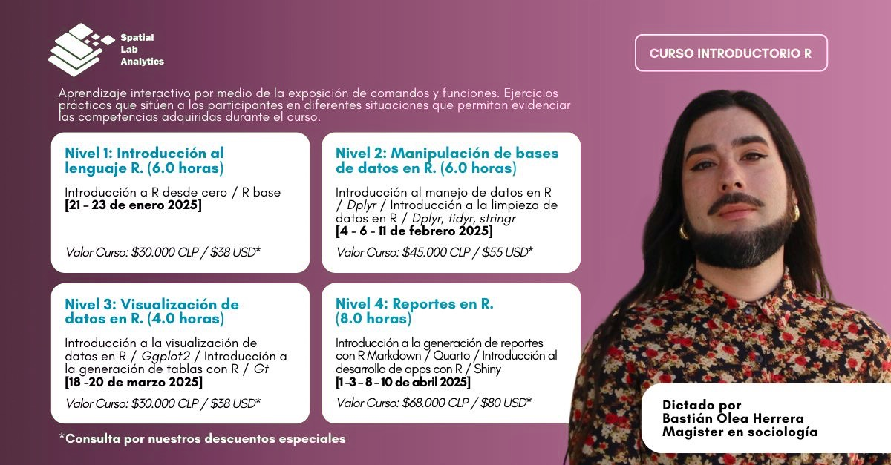
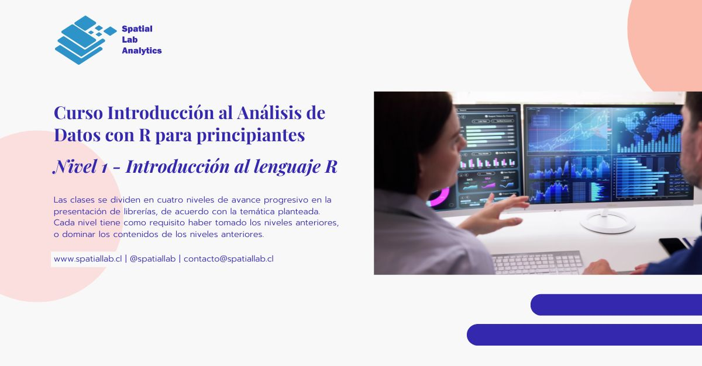
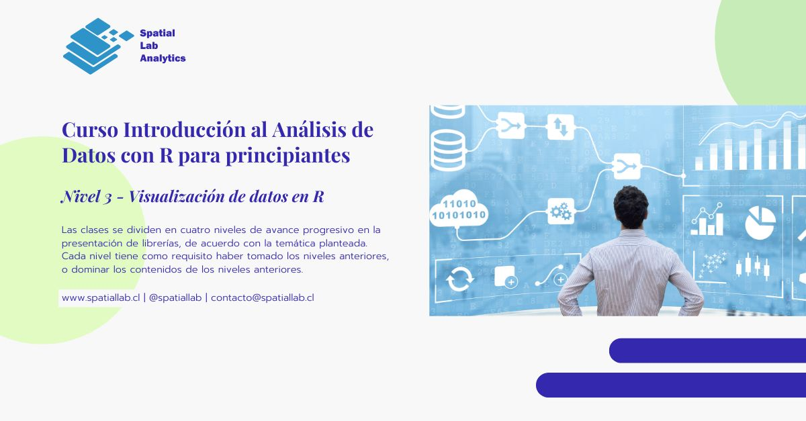
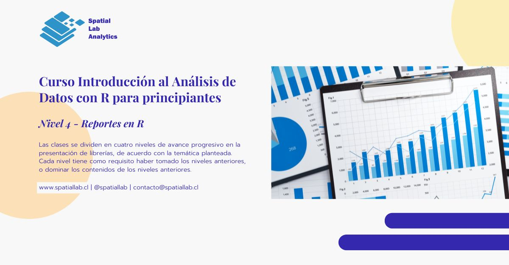

[**¡Inscripciones abiertas!**](https://spatiallab.cl/cursos-1/ola/services/curso-introduccion-al-analisis-de-datos-con-r-para-principiantes)

#### ¿Quieres iniciarte en el mundo del análisis de datos? 

A finales de enero empiezo a dictar el curso "Introducción al Análisis de Datos con R para principiantes”, con el que puedes aprender desde cero a manipular, explorar y visualizar datos con el lenguaje R.

Si no tienes experiencia programando ni analizando datos, o si ya tienes experiencia pero quieres fortalecer tus habilidades y potenciarlas, ¡este curso es para ti! Puedes elegir los niveles que necesites para adaptar el curso a tus necesidades.

El curso consiste de 4 niveles. Puedes tomarlos todos para aprender DESDE CERO a analizar datos con el lenguaje R, o bien, puedes elegir sólo los niveles que necesites! Por ejemplo, saltarte el nivel básico, sólo tomar los dos últimos que son más avanzados, o uno en particular que te permita solucionar una necesidad puntual.

Tenemos un **descuento de 20%** si te inscribes antes del 31 de diciembre, y un 30% de descuento por pago de la totalidad del curso!

1. **Nivel 1:** _introducción desde cero a R,_ donde aprenderemos lo básico del lenguaje para poder usarlo correctamente y poder resolver futuros desafíos con más confianza
2. **Nivel 2:** _manipulación de datos con R,_ donde usaremos herramientas para explorar nuestros datos, limpiar datos, y en general a obtener todas las respuestas que requiramos de forma práctica y fácil de programar.
3. **Nivel 3:** _visualización de datos con R,_ para poder explorar nuestra información de manera visual, pero también para poder presentar resultados de manera atractiva y clara
4. **Nivel 4:** _generación de productos con R,_ ya sean aplicaciones interactivas que expongan nuestros datos en la web, o reportes automatizados que nos ayudarán a llevar nuestro código a formatos entregables de manera eficiente.

Toda la información la puedes encontrar aquí: https://spatiallab.cl/cursos-1/ola/services/curso-introduccion-al-analisis-de-datos-con-r-para-principiantes

----

Te invitamos a este nuevo curso de carácter introductorio, que tiene como propósito que las alumnas y alumnos aprendan a analizar datos programando en R, desde cero. 

Las clases se dividen en cuatro niveles de avance progresivo en la presentación de contenidos. Cada nivel tiene como requisito haber tomado los niveles anteriores, o dominar los contenidos de los niveles anteriores. Esto significa que puedes tomar cualquiera de los 4 niveles, de acuerdo a tus objetivos y tus conocimientos previos de R. Por ejemplo: si no tienes conocimientos de R y sólo quieres una introducción. puedes tomar los niveles 1 y 2 del curso. Si ya sabes de R y quieres aprender mejores formas de aplicarlo, puedes tomar los cursos 3 y 4, y el curso 2 dependiendo de si necesitas una base extra para dominar mejor el lenguaje.

Este curso es ideal para personas sin conocimientos de programación que quieran adentrarse en el mundo del análisis de datos con R.

[**Inscríbete aquí**](https://spatiallab.cl/cursos-1/ola/services/curso-introduccion-al-analisis-de-datos-con-r-para-principiantes)

----

### NIVEL 1: Introducción al lenguaje R
_(4.0 horas)_ 
- Introducción a R desde cero 
- R base  
Fechas / 21 – 23 enero 2025 / 18:00 a 20:00 horas (GMT-3)  

Valor curso nivel 1:  
- $30.000 CLP total / $24.000 CLP (20% descuento pagando antes del 25 de Diciembre 2024) 
- $38 USD total / $30 USD descuento aplicado (pagando antes del 25 de Diciembre 2024)   

### NIVEL 2: Manipulación de bases de datos en R
_(6.0 horas)_
- Introducción al manejo de datos en R (dplyr)
- Introducción a la limpieza de datos en R (dplyr, tidyr, stringr)

Fechas / 4 - 6 - 11 febrero 2025 / 18:00 a 20:00 horas (GMT-3)  

Valor curso nivel 2:
- $45.000 CLP total / $36.000 CLP (20% descuento pagando antes del 25 de Diciembre 2024) 
- $55 USD / $44 USD descuento aplicado (pagando antes del 25 de Diciembre 2024)   

### NIVEL 3: Visualización de datos en R 
_(4.0 horas)_
- Introducción a la visualización de datos en R (ggplot2)
- Introducción a la generación de tablas con R (gt)  

Fechas / 18 - 20 marzo 2025 / 18:00 a 20:00 horas (GMT-3)  

Valor curso nivel 3: 
- $30.000 CLP total / $24.000 CLP (20% descuento pagando antes del 25 de Diciembre 2024)  
- $38 USD / $30 USD (20 % de descuento pagando antes del 25 de Diciembre 2024)   

### NIVEL 4: Reportes en R
_(8.0 horas)_
- Introducción a la generación de reportes con R (Quarto)
- Introducción al desarrollo de apps con R (Shiny)

Fechas / 1 -3 – 8 – 10 abril 2025 / 18:00 a 20:00 horas (GMT-3)  

Valor curso nivel 4: 
- $68.000 CLP / $54.400 CLP (20% de descuento pagando antes del 25 de Diciembre 2024) 
- $80 USD / $64 USD (20% descuento pagando antes del 25 de Diciembre 2024)   

----

COSTO TOTAL DEL CURSO: $173.000 CLP / $212 USD / 22 horas sincrónicas en 11 sesiones. 30% de descuento por pago de la totalidad del curso (4 niveles) [$121.600 CLP / $148 USD]

[**Inscríbete aquí**](https://spatiallab.cl/cursos-1/ola/services/curso-introduccion-al-analisis-de-datos-con-r-para-principiantes)

Dictado por Bastián Olea Herrera, Magíster en Sociología PUC, Diplomado en Data Science PUC