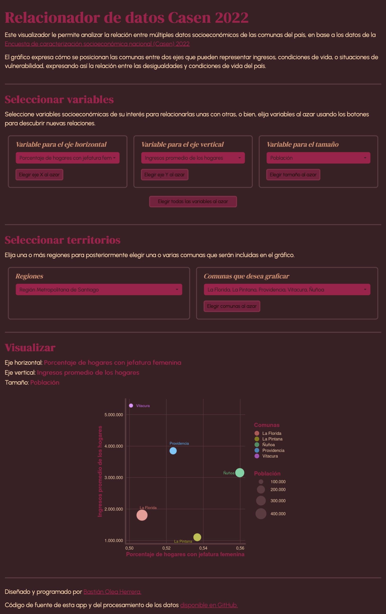

[Aplicación web](https://bastianoleah.shinyapps.io/casen_relacionador) que permite comparar visualmente múltiples variables desde la encuesta Casen 2022, las cuales se visualizan en un gráfico de dispersión por comunas o regiones. Por defecto, al abrir la app se eligen variables al azar. 

El visualizador permite analizar la relación entre múltiples datos socioeconómicos de las comunas del país, en base a los datos de la [Encuesta de caracterización socioeconómica nacional (Casen) 2022](https://observatorio.ministeriodesarrollosocial.gob.cl/encuesta-casen-2022).

El gráfico expresa cómo se posicionan las comunas entre dos ejes que pueden representar ingresos, condiciones de vida, o situaciones de vulnerabilidad, expresando así la relación entre las desigualdades y condiciones de vida del país.
           
Tanto la aplicación como el procesamiento de los datos, incluida la descarga de los datos oficiales de la Casen, están programadas en R y disponibles en este repositorio.

[La aplicación web está disponible en shinyapps.io](https://bastianoleah.shinyapps.io/casen_relacionador), o bien, puedes clonar este repositorio en tu equipo para usarla por medio de RStudio.

### Información técnica
Para producir los datos, hay que ejecutar los scripts en el siguiente orden:

1. `casen2022_importar.r`: descarga la base de datos original de la encuesta Casen desde su fuente 
2. `casen2022_preprocesar.r`: carga la base de datos descargada en el paso anterior y la deja guardada en un formato más eficiente
3. `casen2022_calcular.r`: determina las variables a utilizar en el visualizador, y luego calcula conteos, promedios, medianas y porcentajes, según corresponda para cada variable. Las variables de ingresos son representadas por la mediana comunal, las demás variables numéricas son promedios, y las que no son numéricas (por ejemplo, nacionalidad, pobreza, etc.) son calculadas como conteo de la población comunal, y luego transformado en promedio de la población comunal.

----

Diseñado y programado en R por Bastián Olea Herrera. Magíster en Sociología, data scientist.